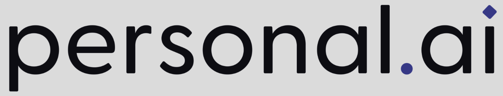
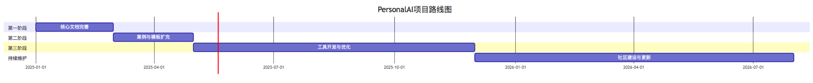

# PersonalAI - 先用AI，先进起来

  
    
  

    
    
    
  

  
<strong>人工智能赋能研发全过程的实践指南</strong>

  
让顶尖AI模型为研发团队打工

## 📖 项目简介

**PersonalAI** 项目致力于构建一个全面的文档资源库，聚焦于"先用AI，先进起来"的理念，为研发团队提供在云原生、中台、平台化等领域充分利用人工智能技术的实践指南。该项目整合了大型语言模型(LLM)、智能体(Agent)和模型上下文协议(MCP)等前沿AI技术，旨在全方位提升研发效率和创新能力。

### 🚀 "产品研发GPT三级火箭"

本项目核心提出并实践"产品研发GPT三级火箭"理念，通过三个阶段系统性提升研发全流程效能：

1. **PrototypeGPT** - 快速系统原型化，从需求到可演示Demo的敏捷过程
2. **DevelopGPT** - 快速系统设计与实现，高效完成60%+开发工作
3. **IPRGPT** - 知识产权草案生成，加速创新成果保护与积累

参考设计&实现，如下：

1. **[ProtoForge](https://github.com/turtacn/protoforge)** - An open-source ai-agent and agentic ai framework for autonomous code generation, product prototyping, iterative development, and IP protection — powered by composable LLM agents and designed for private, full-stack R&D workflow.

同时配合系统智能诊断能力，例如:

1. **[SREagent](https://github.com/turtacn/chasi-sreagent)** - An open source GPT enhanced automatic SRE agent for applications & platform

实现研发全链路的AI赋能。

特别关注非功能性需求场景，运用DFX方法，实现现代软件的质量综合治理，例如：

1. **[NFR-DFX-Quality-Toolkit](https://github.com/turtacn/NFR-DFX-Quality-Toolkit)** - An open-source toolkit that applies DFX (Design for eXcellence) methods on non-functional requirements to modern software quality.

实现质量设计的逻辑。

所有业务与技术分析来源于，对"企业"这种商业体的全面业务与技术分析，例如

* **[baidu.com](examples/BA/baidu.com/01-overview.md)** 
* **[bytedance.com](examples/BA/bytedance.com/01-overview.md)** 
* **...**

再进一步，围绕给定的企业现状，针对发挥自我优势、所在行业的技术趋势、关联的业务板块，给出完整的产品战略分析和原型化设计，例如

* **[sec-ai-cloud](examples/prototype/security-cloud-ai.md)**
* **...**
 
## 🌟 核心特性

- **全面的方法论体系**：提供从需求分析到知识产权保护的完整AI应用方法论
- **丰富的提示词模板**：涵盖研发各阶段的高质量提示词模板库
- **标准化工作流程**：预设多种AI辅助研发工作流，便于团队快速落地
- **实践案例分享**：真实项目实践经验与案例详解
- **工具脚本集合**：配套实用工具脚本，提升工作效率

## 🔍 项目目标受众

- 技术团队负责人
- 研发工程师
- 产品经理
- 架构师
- 技术创新专家
- DevOps工程师

## 🚦 快速开始

### 前置条件

- 基本了解AI与大型语言模型
- 对研发流程有基本认知

### 浏览指南

1. 从 [快速入门指南](docs/getting-started.md) 开始了解项目整体内容
2. 根据需求选择合适的模块深入学习
3. 尝试在实际工作中应用相关方法与工具

---

## 🚀 赋能项目总览（W.I.P） | Project Overview

| 项目名称                  | 项目链接                                                                                   | 项目简介（中英）                                                                                                                                                                                                                                                                                                                                                                                                    |
| --------------------- | -------------------------------------------------------------------------------------- | ----------------------------------------------------------------------------------------------------------------------------------------------------------------------------------------------------------------------------------------------------------------------------------------------------------------------------------------------------------------------------------------------------------- |
| **StarSeek**         | [https://github.com/turtacn/starseek](https://github.com/turtacn/starseek)           | **中文:**StarSeek 是专为 StarRocks、ClickHouse、Doris 等列存储数据库设计的统一全文检索中台服务。它提供类 Elasticsearch 的 API 接口，同时充分利用列存储引擎的高性能优势。 **EN:** StarSeek is a unified full-text search middleware service designed specifically for columnar databases like StarRocks, ClickHouse, and Doris. It provides Elasticsearch-like APIs while leveraging the high-performance advantages of columnar storage engines. |
| **IOShelfer**         | [https://github.com/turtacn/ioshelfer](https://github.com/turtacn/ioshelfer)           | **中文:**IOShelfer 是一个先进的轻量级 I/O 系统亚健康检测框架，专为企业级基础设施监控而设计。它通过实时检测、智能预测和自动化修复功能，在关键故障发生前识别问题，保护 RAID 控制器、存储设备和网络 I/O 子系统的稳定运行。 **EN:** IOShelfer is a lightweight, advanced I/O subhealth monitoring framework for enterprise infrastructure. It enables real-time diagnosis, smart prediction, and auto-repair for RAID, storage, and network I/O subsystems—proactively preventing critical failures. |
| **Yshield（御知）**       | [https://github.com/turtacn/yshield](https://github.com/turtacn/yshield)               | **中文:**Yshield 是一款 AI 驱动的自主安全防御系统，采用自治学习、决策与响应机制，结合机器学习与大数据分析，打造下一代闭环式安全运营体系，实现“先知先觉、永不疲倦”的网络威胁防御能力。 **EN:** Yshield is an AI-driven autonomous cybersecurity system providing next-gen, closed-loop protection through self-learning, decision-making, and response to proactively and tirelessly defend against cyber threats.                                                                     |
| **Huizhu.AI（慧助AI）**   | [https://github.com/turtacn/huizhu.ai](https://github.com/turtacn/huizhu.ai)           | **中文:**集成生成式 AI、智能运维（AIOps）和 AI 安全的企业服务平台，通过对话式交互提升业务自动化、决策支持与运营效率。 **EN:** Huizhu.AI is an integrated enterprise platform combining Generative AI, AIOps, and AI Security in a conversational interface, enhancing automation, efficiency, and business decision-making.                                                                                                                            |
| **Secureflow（数安智联）**  | [https://github.com/turtacn/secureflow](https://github.com/turtacn/secureflow)         | **中文:**一个基于联邦学习、MPC、机密计算和区块链的隐私保护协作平台，支持跨组织数据分析而无需暴露原始数据。 **EN:** Secureflow is a privacy-preserving collaboration platform using FL, MPC, confidential computing, and blockchain to enable secure, cross-org data analytics without revealing raw data.                                                                                                                                             |
| **xAI-Workbench（灵犀）** | [https://github.com/turtacn/xai-workbench](https://github.com/turtacn/xai-workbench)   | **中文:**一个少代码、可定制的企业 AI 平台，提供预设场景模板和本地模型部署能力，帮助企业普及生成式 AI 应用。 **EN:** xAI-Workbench is a low-code enterprise GenAI platform with preset templates and customizable model deployment, democratizing AI for non-experts.                                                                                                                                                                                |
| **AnheGuard（安合盾）**    | [https://github.com/turtacn/anheguard](https://github.com/turtacn/anheguard)           | **中文:**为中小企业设计的云原生安全与合规平台，提供订阅式持续合规监控、安全咨询与事件响应服务。 **EN:** AnheGuard is a cloud-native, subscription-based security and compliance platform tailored for SMEs—offering continuous monitoring, consultation, and incident response.                                                                                                                                                                   |
| **MHA4RDB**           | [https://github.com/turtacn/mha4rdb](https://github.com/turtacn/mha4rdb)               | **中文:**面向 Vastbase、MySQL、PostgreSQL 等关系型数据库的高可用主节点架构，提高系统稳定性和容灾能力。 **EN:** A high-availability master architecture designed for relational databases like Vastbase, MySQL, and PostgreSQL.                                                                                                                                                                                                           |
| **GuoceDB**           | [https://github.com/turtacn/guocedb](https://github.com/turtacn/guocedb)               | **中文:**基于 Go 构建的模块化 SQL 数据库，采用 BadgerDB 存储引擎，具备高可扩展性和良好的架构分层。 **EN:** A modular SQL database written in Go with BadgerDB, designed for extensibility and layered architecture.                                                                                                                                                                                                                       |
| **DSACP**             | [https://github.com/turtacn/dsacp](https://github.com/turtacn/dsacp)                   | **中文:**基于 Apache Ranger，为大数据系统（如 Kafka、Hive、ClickHouse 等）提供统一的敏感数据访问控制和动态脱敏能力。 **EN:** A unified data access control framework based on Apache Ranger, extending fine-grained permissions and masking to diverse big data systems.                                                                                                                                                                   |
| **OpenCDI**           | [https://github.com/turtacn/opencdi](https://github.com/turtacn/opencdi)               | **中文:**基于 Kubernetes 和容器技术的现代化桌面交付平台，支持国产操作系统与硬件，提升信息安全。 **EN:** OpenCDI is a modern, container-based desktop delivery platform leveraging Kubernetes, optimized for domestic OS and hardware for enhanced security.                                                                                                                                                                                 |
| **DataSeap**          | [https://github.com/turtacn/dataseap](https://github.com/turtacn/dataseap)             | **中文:**统一、高效、可扩展的数据底座平台，集成监控、告警、日志、升级等功能，简化大数据基础设施运维。 **EN:** DataSeap is a scalable data infrastructure platform with integrated monitoring, alerts, and lifecycle management, simplifying big data operations.                                                                                                                                                                                     |
| **Chasi-Bod**         | [https://github.com/turtacn/chasi-bod](https://github.com/turtacn/chasi-bod)           | **中文:**融合 sealer 与 vCluster 思路的简化多系统集成平台，支持业务系统在 Kubernetes 上共享基础设施并保持隔离。 **EN:** Inspired by vcluster and sealer, Chasi-Bod enables isolated, unified deployment of multiple business systems on a shared Kubernetes cluster.                                                                                                                                                                       |
---

## 📚 核心文档

| 名称 | 描述 |
|------|------|
| [快速入门指南](docs/getting-started.md) | 项目概览与开始使用的指导 |
| [AI研发方法论](docs/principles/ai-rd-methodology.md) | AI辅助研发的核心方法论 |
| [PrototypeGPT详解](docs/rocket/prototype-gpt.md) | 快速系统原型化详细指南 |
| [DevelopGPT详解](docs/rocket/develop-gpt.md) | 系统设计与实现加速方法 |
| [IPRGPT详解](docs/rocket/ipr-gpt.md) | 知识产权生成指南 |

## 🛠️ 示例与模板

项目提供多种开箱即用的模板与工作流：

- **提示词模板**：针对不同场景优化的提示词
- **工作流模板**：标准化的AI应用流程步骤
- **实践案例**：基于真实项目的应用示例

## 🔄 如何贡献

我们非常欢迎社区成员参与项目贡献，包括但不限于：

- 提交Bug报告或功能建议
- 贡献新的提示词模板或工作流
- 分享实践案例与经验
- 改进文档内容与结构

详细信息请参阅 [贡献指南](CONTRIBUTING.md)。

## 📊 项目路线图

## 📄 许可证

本项目采用 [Apache 2.0 许可证](LICENSE)。

## 👏 致谢

感谢以下开源项目为PersonalAI提供的灵感与参考：

- [wonderful-prompts](https://github.com/langgptai/wonderful-prompts)
- [awesome-mcp-servers](https://github.com/punkpeye/awesome-mcp-servers)
- [deepseek-engineer](https://github.com/Doriandarko/deepseek-engineer)
- [gopool](https://pro.devchat.ai/devchat-ai/gopool/)
- [devchat](https://www.devchat.ai/)
- [llm-course](https://github.com/mlabonne/llm-course)

## 📢 联系我们

如有任何问题或建议，请通过以下方式联系我们：

- GitHub Issues: [https://github.com/turtacn/PersonalAI/issues](https://github.com/turtacn/PersonalAI/issues)

---

  <strong>让AI助力你的团队，今天就开始行动！</strong>

