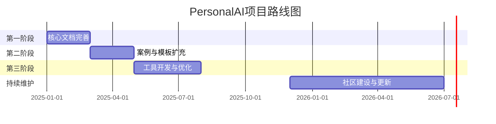

# PersonalAI - 先用AI，先进起来

<div align="center">
  
  <br><br>
  <p>
    <a href="https://github.com/turtacn/PersonalAI/stargazers"></a>
    <a href="https://github.com/turtacn/PersonalAI/issues"></a>
    <a href="https://github.com/turtacn/PersonalAI/blob/main/LICENSE"></a>
  </p>
  <p><strong>人工智能赋能研发全过程的实践指南</strong></p>
  <p>让顶尖AI模型为研发团队打工</p>
</div>

## 📖 项目简介

**PersonalAI** 项目致力于构建一个全面的文档资源库，聚焦于"先用AI，先进起来"的理念，为研发团队提供在云原生、数据中台、业务中台等领域充分利用人工智能技术的实践指南。该项目整合了大型语言模型(LLM)、智能体(Agent)和模型上下文协议(MCP)等前沿AI技术，旨在全方位提升研发效率和创新能力。

### 🚀 "产研GPT三级火箭"

本项目核心提出并实践"产研GPT三级火箭"理念，通过三个阶段系统性提升研发全流程效能：

1. **PrototypeGPT** - 快速系统原型化，从需求到可演示Demo的敏捷过程
2. **DevelopGPT** - 快速系统设计与实现，高效完成60%+开发工作
3. **IPRGPT** - 知识产权草案生成，加速创新成果保护与积累

同时配合系统智能诊断能力，实现研发全链路的AI赋能。

## 🌟 核心特性

- **全面的方法论体系**：提供从需求分析到知识产权保护的完整AI应用方法论
- **丰富的提示词模板**：涵盖研发各阶段的高质量提示词模板库
- **标准化工作流程**：预设多种AI辅助研发工作流，便于团队快速落地
- **实践案例分享**：真实项目实践经验与案例详解
- **工具脚本集合**：配套实用工具脚本，提升工作效率

## 🔍 项目目标受众

- 技术团队负责人
- 研发工程师
- 产品经理
- 架构师
- 技术创新专家
- DevOps工程师

## 🚦 快速开始

### 前置条件

- 基本了解AI与大型语言模型
- 对研发流程有基本认知

### 浏览指南

1. 从 [快速入门指南](docs/getting-started.md) 开始了解项目整体内容
2. 根据需求选择合适的模块深入学习
3. 尝试在实际工作中应用相关方法与工具

## 📋 项目结构

```
PersonalAI/
├── docs/                           # 核心文档目录
│   ├── principles/                 # 原则与方法论
│   ├── rocket/                     # 三级火箭文档
│   └── diagnostics/                # 系统智能诊断
├── slides/                         # 幻灯片资源
├── examples/                       # 实例与案例
├── templates/                      # 模板资源
│   ├── prompts/                    # 提示词模板
│   └── workflows/                  # 工作流模板
└── tools/                          # 工具资源
```

## 📚 核心文档

| 名称 | 描述 |
|------|------|
| [快速入门指南](docs/getting-started.md) | 项目概览与开始使用的指导 |
| [AI研发方法论](docs/principles/ai-rd-methodology.md) | AI辅助研发的核心方法论 |
| [PrototypeGPT详解](docs/rocket/prototype-gpt.md) | 快速系统原型化详细指南 |
| [DevelopGPT详解](docs/rocket/develop-gpt.md) | 系统设计与实现加速方法 |
| [IPRGPT详解](docs/rocket/ipr-gpt.md) | 知识产权生成指南 |

## 🛠️ 示例与模板

项目提供多种开箱即用的模板与工作流：

- **提示词模板**：针对不同场景优化的提示词
- **工作流模板**：标准化的AI应用流程步骤
- **实践案例**：基于真实项目的应用示例

## 🔄 如何贡献

我们非常欢迎社区成员参与项目贡献，包括但不限于：

- 提交Bug报告或功能建议
- 贡献新的提示词模板或工作流
- 分享实践案例与经验
- 改进文档内容与结构

详细信息请参阅 [贡献指南](CONTRIBUTING.md)。

## 📊 项目路线图



## 📄 许可证

本项目采用 [MIT 许可证](LICENSE)。

## 👏 致谢

感谢以下开源项目为PersonalAI提供的灵感与参考：

- [wonderful-prompts](https://github.com/langgptai/wonderful-prompts)
- [awesome-mcp-servers](https://github.com/punkpeye/awesome-mcp-servers)
- [deepseek-engineer](https://github.com/Doriandarko/deepseek-engineer)
- [gopool](https://pro.devchat.ai/devchat-ai/gopool/)
- [devchat](https://www.devchat.ai/)

## 📢 联系我们

如有任何问题或建议，请通过以下方式联系我们：

- GitHub Issues: [https://github.com/turtacn/PersonalAI/issues](https://github.com/turtacn/PersonalAI/issues)

---

<p align="center">
  <strong>让AI助力你的团队，今天就开始行动！</strong>
</p>