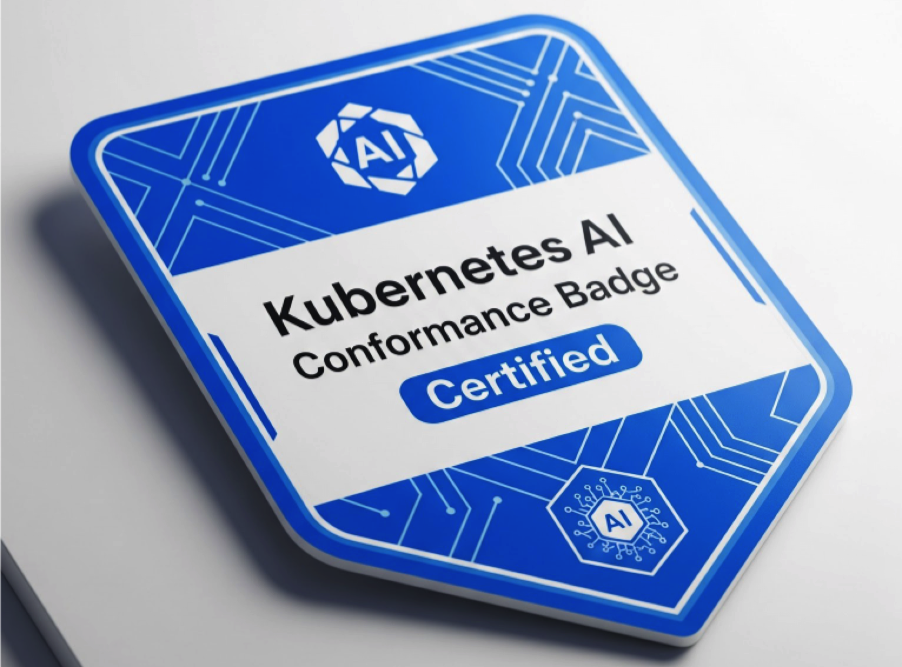

### CNCF Kubernetes AI 一致性（Conformance）

**作者：** Janet Kuo ([@janetkuo](https://github.com/janetkuo))、Mario Fahlandt ([@mfahlandt](https://github.com/mfahlandt))、[wg-ai-conformance@kubernetes.io](mailto:wg-ai-conformance@kubernetes.io)、Jorge Castro ([@castrojo](https://github.com/castrojo))、Jeffrey Sica ([@jeefy](https://github.com/jeefy))  

**翻译：** Turtacn ([@turtacn](https://github.com/turtacn))

**状态：** 正在审核中  

**最近更新：** 2025年8月21日

***这是一份与CNCF和[AI Conformance WG](https://github.com/kubernetes/community/tree/master/wg-ai-conformance)合作的公开文档***

  


### 概览

CNCF Kubernetes AI 一致性定义了一套Kubernetes集群必须在**标准CNCF Kubernetes一致性之上**提供的额外能力、API和配置，以可靠且高效地运行AI/ML工作负载。

一个Kubernetes平台或发行版必须先获得Kubernetes一致性认证，才能获得AI一致性认证。

#### 主要目标

  * 简化Kubernetes上的AI/ML并加速其采用
  * 确保AI工作负载的互操作性和可移植性
  * 在行业标准基础上促进AI工具生态系统的增长

#### 范围

**在范围内（In Scope）：**

  * 针对调度、编排和执行的AI特定扩展。
  * 专用AI硬件的发现、分配和管理。
  * 对AI/ML至关重要的特定存储、网络、安全和可观察性配置及能力。
  * 确保核心Kubernetes扩展点能够有效支持常见的AI Operator模式。

**超出范围（Out of Scope）：**

  * 标准Kubernetes一致性已测试的功能（除非需要特定的AI相关配置）。
  * 针对模型服务（model servers）和框架（frameworks）等组件的测试。尽管此一致性将提及对这些组件的要求，但它不会提供全面的测试。

#### 统一的AI一致性

我们认为，在中期内，AI/ML工作负载将与非AI工作负载保持区别，并将需要Kubernetes提供不同的能力。

AI一致性将有助于确保AI/ML工作负载的可移植性，从而降低总体拥有成本。AI一致性还将推动新的Kubernetes功能以及模型服务、训练框架和其他相关组件的相应改进。我们希望尽可能减少运行AI/ML工作负载所需的DIY和特定于框架的补丁。

一些一致性要求可能更适用于训练（training），另一些则更适用于服务（serving）工作负载。我们预计，训练和服务工作负载的需求将变得更加相似，随着时间的推移，它们之间的差异将变得微乎其微。对硬件的期望将相同。底层（Underlying layers）如存储将全面提速。

因此，为了建立一个基础且广泛适用的标准来鼓励这种融合，此一致性的初始版本将侧重于通用的底层能力。因此，在一致性方面，工作负载类型没有区分。

#### 指导性用例

本文档中的要求源于支持一组常见、高价值AI/ML用例在标准化、可移植平台上运行的需要。

  * **大规模训练和微调（Large-scale training and fine-tuning）：** 关键平台要求包括访问高性能加速器、高吞吐量和拓扑感知的网络、“集体调度”（gang scheduling）以及可扩展的数据访问。
  * **高性能推理（High-performance Inference）：** 关键平台要求包括访问加速器、高级流量管理以及用于监控延迟和吞吐量的标准化指标。
  * **MLOps管道（MLOps Pipelines）：** 关键平台要求包括一个健壮的批处理作业系统、一个用于管理资源争用的队列系统、安全访问对象存储和模型注册表等其他服务，以及可靠的CRD/Operator支持。

### 要求

  * **MUST (必须)** 表示一致性的强制性要求。
  * **SHOULD (应该)** 表示推荐的实践或期望的目标。虽然不是强制性的，但它标志着社区正在朝着这个方向发展，并相信这将带来更好的结果、改进的互操作性或增强的功能。预计随着实践的成熟和对其普遍益处的共识固化，SHOULD 要求可能会在标准的未来迭代中演变为 MUST 要求。

平台应支持启用所有必需的组件，即使这些组件不是标准Kubernetes的一部分，从而消除用户需要单独手动安装这些组件的麻烦。

| 加速器（Accelerators） | 加速器资源暴露与分配（Accelerator Resource Exposure & Allocation） | **MUST (必须)：** 支持[动态资源分配（DRA）](https://kubernetes.io/docs/concepts/scheduling-eviction/dynamic-resource-allocation/)，以实现比简单计数更灵活和细粒度的资源请求。注意：DRA的目标是在1.34版本（2025年8月）中达到GA（普遍可用）。如何测试：验证所有`resource.k8s.io/v1` DRA API资源已启用。 |
| :---- | :---- | :---- |
| | **加速器驱动与运行时管理（Accelerator Driver & Runtime Management）** | **SHOULD (应该)：** 提供一种可验证的机制，确保兼容的加速器驱动和相应的容器运行时配置在具有加速器的节点上得到正确安装和维护。必须通过DRA属性暴露驱动版本（例如`dra.vendor.com/driver-version`，这可以通过[Kubernetes进行标准化](https://github.com/kubernetes/enhancements/tree/master/keps/sig-node/4381-dra-structured-parameters)）。如果加速器不兼容，节点必须准确报告不健康状态或错误情况。 |
| | | **SHOULD (应该)：** 公布已安装的加速器驱动版本，这可能会影响工作负载兼容性。此版本信息必须通过DRA属性暴露（例如`dra.vendor.com/driver-version`）。 |
| | **GPU共享（GPU Sharing）** | **SHOULD (应该)：** 提供明确定义的GPU共享机制，以提高不需要完整专用GPU的工作负载的利用率。如果支持硬件级别的分区，这些部分GPU资源应通过DRA作为独立的、可调度的资源暴露。如果支持基于软件的共享（例如时间分片），则应使用设备插件（device plugin）来允许GPU的超额订阅，并为DRA提供前瞻性路径（一旦它被支持）。 |
| | **虚拟化加速器（Virtualized Accelerators）** | **SHOULD (应该)：** 如果平台支持虚拟化加速器技术（例如vGPU），也应通过DRA暴露和管理这些技术，以保持与物理部分GPU的一致性。 |
| | **硬件拓扑感知（Hardware Topology Awareness）** | **SHOULD (应该)：** 对于具有专用硬件拓扑的节点，关于加速器物理布局及其与高性能网络接口卡（NICs）接近度的信息应以结构化方式被发现。这包括但不限于：加速器之间的直接高速互连；加速器和NIC在节点物理拓扑上的对齐。此信息应通过DRA属性暴露，以实现拓扑感知调度。 |
| **存储（Storage）** | **高性能存储（High-Performance Storage）** | **SHOULD (应该)：** 如果平台提供专门为高IOPS/吞吐量AI工作负载优化的块/文件存储，则应通过`StorageClass`资源暴露。 |
| | | **SHOULD (应该)：** 提供至少一个`StorageClass`，由高性能容器存储接口（CSI）驱动程序支持，该驱动程序提供适用于AI/ML工作流（如协同开发环境（例如JupyterHub）和共享数据缓存）的`ReadWriteMany`访问。支持以下模式之一的此能力：高性能共享文件系统（例如Lustre）；对象存储，可能通过本地缓存进行配置并呈现为文件系统。 |
| | **镜像拉取优化（Image Pull Optimizations）** | **SHOULD (应该)：** 促进大型容器镜像的更快拉取，这在AI/ML中很常见（由于模型权重），例如：启用镜像复制或缓存解决方案，将镜像数据放置在靠近AI工作负载运行的节点；确保容器运行时和镜像管理组件高效处理标准OCI镜像，特别是那些以大型、独特层结构化的AI模型镜像；使用镜像流（image streaming）等机制来减少容器引导时间，特别是对于包含大型模型工件的镜像。 |
| | **AI工作负载数据缓存（Data Caching for AI Workloads）** | **SHOULD (应该)：** 提供一种机制来缓存靠近计算节点的常用数据。 |
| **网络（Networking）** | **高性能Pod-to-Pod通信（High-Performance Pod-to-Pod Communication）** | **SHOULD (应该)：** 利用DRA进行网络资源管理，将Pod附加到多个网络接口。这是将专用高性能网络接口暴露给Pod的推荐方式，其特性应可被发现，以实现知情调度或工作负载配置。 |
| | **AI/ML推理高级入口（Advanced Ingress for AI/ML Inference）** | **MUST (必须)：** 支持Kubernetes `Gateway` API及其针对推理服务的高级流量管理实现，该实现能够实现加权流量拆分、基于头的路由（针对OpenAI协议头），以及与服务网格（service meshes）的可选集成。如何测试：验证所有`gateway.networking.k8s.io/v1` Gateway API资源已启用。 |
| | | **SHOULD (应该)：** 支持Gateway API推理扩展（Inference Extension）的实现，该扩展具有以下特点：使用模型服务平台在Kubernetes上托管模型；专门服务LLMs；基于模型服务平台公布的指标和能力，为LLM推理做出高级路由决策（例如K/V缓存感知路由）。 |
| | **网络策略实施（Network Policy Enforcement）** | **SHOULD (应该)：** 支持默认安装并激活的网络策略提供商，该提供商能够实施用户定义的`NetworkPolicy`资源，从而允许对标准pod网络接口上的AI工作负载进行细粒度流量控制。对于标准NetworkPolicy实现可能面临限制的大规模集群，提供清晰的指导或替代方案。 |
| **调度与编排（Scheduling & Orchestration）** | **增强型批处理作业管理（Enhanced Batch Job Management）** | **SHOULD (应该)：** 通过支持[`JobSet`](https://www.google.com/search?q=%5Bhttps://jobset.sigs.k8s.io/docs/overview/%5D(https://jobset.sigs.k8s.io/docs/overview/)) API (`jobset.x-k8s.io`) 的机制，支持将相互依赖的Kubernetes作业组作为单个单元进行管理，这对于启用MPI作业等紧密耦合的分布式工作负载至关重要。 |
| | | **SHOULD (应该)：** 通过支持[`Kueue`](https://www.google.com/search?q=%5Bhttps://kueue.sigs.k8s.io/%5D(https://kueue.sigs.k8s.io/)) API (`kueue.x-k8s.io`) 的机制，支持AI批处理工作负载的作业排队、公平共享和“集体调度”（gang scheduling）。 |
| | **AI工作负载的有效自动伸缩（Effective Autoscaling for AI Workloads）** | **MUST (必须)：** 集群自动伸缩器（Cluster autoscaler）或其等效组件必须能够根据请求这些加速器的待定（pending）pod来扩容/缩容包含特定加速器类型的节点组。如何测试：准备一个配置了特定加速器类型的节点池，最小规模为N，最大规模至少为N+1。创建N+1个Pod，每个都请求来自该池的一个加速器资源。验证至少有一个Pod无法调度（Pending），且集群自动伸缩器将增加节点数量至N+1，从而使该Pod进入运行状态（Running）。删除该Pod，然后集群自动伸缩器将移除空闲的加速器节点，使节点数量返回到N。 |
| | | **MUST (必须)：** `HorizontalPodAutoscaler`必须能够对使用加速器的pod正常工作。这包括能够根据与AI/ML工作负载相关的自定义指标来伸缩这些Pod。这与下方的[加速器性能指标](https://www.google.com/search?q=%23bookmark%3Dkix.h93u3hesy481)相关。如何测试：配置一个自定义指标管道，以向HPA暴露与加速器相关的自定义指标。创建一个Deployment，其中每个Pod请求一个加速器并暴露一个自定义指标。创建一个以该Deployment为目标的HorizontalPodAutoscaler。引入负载到示例应用程序，使平均自定义指标值显著超过目标值，触发扩容。然后移除负载，触发缩容。 |
| | | **SHOULD (应该)：** 平台的自动伸缩和调度系统应支持异构节点组（通常称为节点组或节点池）的管理，允许AI工作负载表达亲和性/反亲和性（affinity/anti-affinity）或污点/容忍度（taints/tolerations），以便在合适的节点上进行调度，从而实现跨工作负载类型的部署（例如，AI工作负载在AI优化节点上运行，反之亦然）。集群自动伸缩器应感知这些放置约束。 |
| | **加速器拓扑感知调度（Accelerator Topology-Aware Scheduling）** | **SHOULD (应该)：** 如果加速器互连可被发现，调度框架应能够做出拓扑感知的放置决策。这与上方的[硬件拓扑感知](https://www.google.com/search?q=%23bookmark%3Did.xo0br41s89ni)相关。 |
| **可观察性与遥测（Observability & Telemetry）** | **加速器性能指标（Accelerator Performance Metrics）** | **MUST (必须)：** 对于支持的加速器类型，通过标准化的、机器可读的格式指标端点暴露细粒度的性能指标。这必须包括每加速器利用率和内存使用情况的核心指标集。此外，如果底层硬件或虚拟化层提供，还应暴露其他相关指标，如温度、功耗和互连带宽。指标列表应与新兴标准保持一致，例如[OpenTelemetry metrics](https://opentelemetry.io/docs/specs/semconv/system/hardware-metrics/#hwgpu---gpu-metrics)，以确保互操作性。如何测试：给定一个具有支持的加速器类型的节点，识别该节点上加速器的Prometheus兼容指标端点，并从中抓取指标。解析抓取的指标，以找到该节点上每个支持的加速器的指标，包括：加速器利用率、内存使用情况、温度、功耗等。该测试可以演进为在这些指标标准化后检查具体的指标名称。 |
| | **AI作业与推理服务指标（AI Job & Inference Service Metrics）** | **MUST (必须)：** 提供一个能够发现和收集从以标准格式（例如Prometheus exposition format）暴露指标的工作负载的监控系统。这确保了从常见AI框架和服务器收集关键指标的轻松集成。如何测试：由于所有这些常见指标都以Prometheus格式暴露，测试将验证平台的监控系统是否可以收集Prometheus指标。首先使用一个常见框架部署一个AI应用程序，为该应用程序配置指标收集。为该应用程序生成示例流量，然后查询平台的监控系统并验证AI应用程序的关键指标已被收集。 |
| **安全（Security）** | **安全加速器访问（Secure Accelerator Access）** | **MUST (必须)：** 确保从容器内部对加速器的访问通过Kubernetes资源管理框架（设备插件或DRA）和容器运行时得到适当的隔离和中介，以防止工作负载之间未经授权的访问或干扰。如何测试：将一个Pod部署到具有可用加速器的节点上，但不在Pod规范中请求加速器资源。在Pod中执行命令以探测加速器设备，该命令应失败或报告未找到加速器设备。创建两个Pod，每个都被分配一个加速器资源。在一个Pod中执行命令试图访问另一个Pod的加速器，应被拒绝。 |
| | **安全工作负载认证（Secure Workload Authentication）** | **SHOULD (应该)：** 提供一个可验证的机制，确保AI工作负载可以安全地访问其他服务，而无需依赖长期存在的静态凭据，通过满足以下至少一项要求：提供一种安全身份机制（例如workload identity, SPIFFE/SPIRE），向工作负载颁发短期、自动管理的凭据。对于不适用的环境（例如on-prem，air-gapped），展示等效的安全控制（例如网络隔离）。如何测试：创建一个ServiceAccount（KSA）和一个外部IAM身份，并配置平台的workload identity（或等效）机制，授予KSA权限以模拟外部IAM身份。创建一个Pod使用该KSA。Pod通过workload identity获取一个令牌，将此令牌发送到令牌验证端点。验证与令牌关联的身份（由验证端点确认）与外部IAM身份匹配。 |
| | **AI机密计算（Confidential Computing for AI）** | **SHOULD (应该)：** 支持在基于硬件的可信执行环境（TEEs）中部署机密容器。这包括节点支持、兼容的容器运行时以及AI工作负载的远程证明机制。 |
| | **安全AI软件和模型供应链赋能（Secure AI Software & Model Supply Chain Enablement）** | **SHOULD (应该)：** 确保Kubernetes准入控制（admission control）机制可以与Sigstore/Cosign等工具有效结合使用，以验证AI模型工件和容器镜像的签名，并与策略引擎（例如Gatekeeper）结合使用，以实施与AI工作负载相关的供应链安全策略。 |
| | **非可信代码的工作负载沙盒（Workload Sandboxing for Untrusted Code）** | **SHOULD (应该)：** 提供一种机制，在提供强大、内核级隔离的沙盒中运行工作负载。这对于可能执行非可信代码的AI Agent用例至关重要。沙盒应将工作负载的进程、内存和网络访问与主机节点隔离。 |
| **维护与修复（Maintenance & Repairs）** | **故障设备检测（Failed devices detection）** | **SHOULD (应该)：** 提供一种机制来检测故障设备（例如加速器），并可选地提供自动修复。如何测试：创建一个模拟设备插件，报告一个模拟设备不健康。识别一个具有健康、可调度的模拟加速器资源的节点。触发该节点上其中一个加速器设备的模拟故障。轮询目标Node对象的`status.conditions`和与该节点相关的任何`Events`。该加速器类型的`Node.status.allocatable`资源计数将相应地递减。 |
| | **早期维护通知（Early maintenance notification）** | **SHOULD (应该)：** 通过标准化的`Node conditions`，为工作负载提供一个早期计划维护通知机制，以准备应对中断。 |
| | **高度连接节点的集体维护（Gang maintenance for highly connected nodes）** | **SHOULD (应该)：** 允许对高度连接的节点进行集体维护。在高度连接的节点情况下，单个节点的不可用通常可能意味着整个节点集（gang）不可用。在这种情况下，应允许集体维护以最小化中断。 |
| **AI框架与Operator赋能（AI Framework & Operator Enablement）** | **健壮的CRD与Controller操作（Robust CRD and Controller Operation）** | **MUST (必须)：** 确保复杂CRD及其关联控制器（在AI/ML Operator中很常见，例如Ray、Kubeflow）的安装和操作能够可靠地运行。平台不得施加超出标准Kubernetes资源配额的非标准限制，导致失败。此类被禁止的限制示例包括：过于激进的API服务器限速，导致正常的Operator协调被节流；对已安装的CRD或webhook数量的隐藏限制；导致webhook执行不可靠或负载下控制器协调缓慢的控制平面资源约束。如何测试：部署一个代表性的AI Operator，验证Operator的所有Pod及其webhook都在运行，并且其CRD已在API服务器注册。验证无效尝试（例如无效的spec）应被其准入webhook拒绝。验证自定义资源的有效实例可以被协调。 |

### 一致性测试（Conformance Testing）

Kubernetes AI一致性测试套件将专门测试这些 **MUST (必须)：** 的附加要求。它将假定已成功完成标准Kubernetes一致性套件。

AI一致性测试，类似于标准Kubernetes一致性测试，将有一个严格的通过/失败结果。获得AI一致性认证需要通过所有AI一致性测试。

一致性测试将验证AI特定API、配置和能力的存在及其正确行为。供应商将能够运行这些测试来认证他们的Kubernetes发行版/平台为“Kubernetes AI Conformant”。

#### 2025年计划：自我评估问卷

为了促进2025年的初始一致性，每个公司/供应商将在指定存储库中完成一份问卷。CNCF将随后审查此提交作为完整测试程序投入运行之前的初步步骤。

问卷将如下所示：

```
# Kubernetes AI 一致性清单
# 平台名称：[指定平台名称]
# 平台版本：[指定平台版本]
# 供应商：[指定供应商名称]
# 提交日期：[YYYY-MM-DD]
# 注：此清单基于 Kubernetes AI 一致性文档。
# 参与者应填写每个要求的'status'（状态）、'evidence'（证据）和'notes'（备注）字段。
metadata:
  platformName: "[Platform Name]"
  platformVersion: "[Platform Version]"
  vendorName: "[Vendor Name]"
  submissionDate: "[YYYY-MM-DD]"

spec:
  accelerators:
    - id: acc_dra_support
      description: "支持动态资源分配（DRA）以实现比简单计数更灵活和细粒度的资源请求。"
      level: MUST
      status: ""   # Implemented（已实施）, Not Implemented（未实施）, Partially Implemented（部分实施）, N/A
      evidence: "" # URL或文档/测试结果引用
      notes: ""    # 当状态为N/A时必须提供理由

    - id: acc_driver_runtime_management_mechanism
      description: "提供一种可验证的机制，确保兼容的加速器驱动和相应的容器运行时配置在具有加速器的节点上得到正确安装和维护。"
      level: MUST
      status: ""
      evidence: ""
      notes: ""
```

注意：`status`字段可以是“不适用（N/A）”。选择此状态的供应商必须在`notes`字段中提供理由，解释为什么该要求不适用于其平台的架构（例如，“这是一个没有外部网络访问的气隙（air-gapped）平台，因此对云服务的workload identity要求不适用”）。

#### 一致性有效性与续期

维护Kubernetes AI一致性状态的过程将随着该计划从最初的、基于问卷的阶段成熟到完全自动化的测试套件而演变。

**第一阶段：通过自我评估进行初始一致性认证（2025年计划）**

对于最初的计划推出，一致性将基于已完成的自我评估问卷授予，如2025年计划所述。

此初始一致性认证有效期为一年。在强制执行自动化测试套件之前，平台每年都需要提交一份更新的自我评估，以保持其“Kubernetes AI Conformant”状态。

**第二阶段：通过自动化测试进行一致性认证**

一旦正式的AI一致性测试套件发布，将针对特定版本的Kubernetes平台与特定版本的AI一致性授予一致性徽章。

AI一致性测试验证平台对其指定API契约或其组件行为的遵循，而非这些组件的具体软件版本。为确保稳定性，MUST要求将仅适用于GA API。

要声明对较新Kubernetes版本或更新版本的AI一致性的一致性，平台必须成功运行相应的新版本一致性测试套件。这使认证周期与Kubernetes和AI一致性的发布周期保持一致。如果供应商使用的组件API中的一项破坏性更改（breaking change）影响了其与认证版本的一致性状态，则也需要重新提交认证。

#### 版本控制（Versioning）

它将进行版本控制以适应不断发展的AI/ML领域。每个版本将指定一套能力，一致性测试将验证它们的存在和正确功能。每个版本将锚定到特定的Kubernetes版本。初始版本将依赖于Kubernetes v1.34。

#### 时间表（Timeline）

| 2025年6月底 | 组建Kubernetes [AI一致性工作组](https://groups.google.com/a/kubernetes.io/g/dev/c/u6I_mCRC4lE/m/tBWyGOAmAwAJ) |
| :---- | :---- |
| 约2025年8月 | 在[cncf/ai-conformance](https://github.com/cncf/ai-conformance)存储库中发布v1版AI一致性 |
| 约2025年9月 | **公司和供应商开始自我认证过程** |
| 2025年8月底 | **Kubernetes 1.34发布，预计将包含DRA的GA版本** |
| 2025年9月 | CNCF理事会会议 |
| 2025年10月底 | **第一轮自我认证的截止日期** |
| 2025年11月中旬 | 在KubeCon NA 2025上进行一次重大公告和展示 |