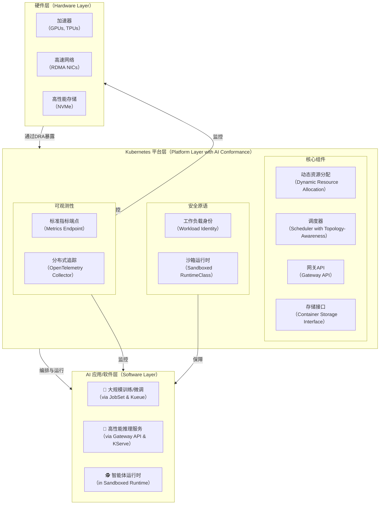

# **白皮书草案：面向智能体AI平台的企业级Kubernetes评测标准**

**A Proposal for Enterprise-Grade Kubernetes Conformance for Agentic AI Platforms**

**版本**: 0.9 (草案)
**作者**: CNCF SIG-AI (贡献者: [turtacn/Organization Here])
**日期**: 2025年8月24日

## **摘要**

随着智能体AI（Agentic AI）从实验走向生产，Kubernetes已成为承载其复杂工作负载的事实标准。然而，当前在标准Kubernetes上运行AI应用，尤其是在需要高性能、强安全和可移植性的企业环境中，仍存在大量标准化缺失、配置复杂和能力不一致的问题。本白皮书提出了一套全新的、专注于AI的附加认证——**Kubernetes AI Conformance**。它旨在现有CNCF Kubernetes Conformance的基础上，定义一套涵盖硬件资源管理、AI工作负载调度、网络、存储、安全和可观测性的标准化能力与测试基准，从而保证AI应用在不同认证平台间的无缝迁移，加速企业级智能体AI的落地与创新。

## **1. 背景与核心问题**

[cite\_start]当前在Kubernetes上运行AI工作负载存在**标准化缺失、可移植性差、配置复杂**三大痛点 [cite: 61]。

  * **标准化缺失**：如何描述和调度一个需要特定拓扑结构GPU的训练任务？如何为推理服务提供统一的、具备流量切分能力的API入口？这些问题目前缺乏统一的、声明式的解决方案。
  * **可移植性差**：一个在某云厂商深度优化的K8s集群上开发的AI应用，往往难以直接迁移到另一个云或本地环境中，因为其严重依赖特定的设备插件、存储驱动和网络配置。
  * **配置复杂**：用户需要进行大量的“DIY”工作，手动组合调度器、设备插件、监控工具等，才能搭建一个可用的AI平台，这极大地增加了总体拥有成本（TCO）并拖慢了创新速度。

## **2. 核心原则与目标**

Kubernetes AI Conformance遵循以下核心原则：

  * **基于开放标准**：所有规范优先采用CNCF和Kubernetes社区的既有或正在发展的标准（如DRA, Gateway API, JobSet）。
  * **声明式与自动化**：强调通过声明式API来定义和管理AI基础设施和工作负载，并鼓励自动化测试。
  * **分层与解耦**：规范定义的是平台必须具备的“能力”，而非具体的“实现”，鼓励生态多样性。
  * **企业级就绪**：高度关注安全性、可靠性、可观测性和治理能力，满足企业生产环境的严苛要求。

**核心目标**：

1.  [cite\_start]**为用户提供一个“开箱即用”的、为AI优化的K8s环境**，降低使用门槛 [cite: 62]。
2.  [cite\_start]**保证AI工作负载的可移植性**，实现在任何认证平台上的无缝迁移 [cite: 62]。
3.  [cite\_start]**促进AI基础设施生态的健康发展**，为上层AI框架和服务商提供一个稳定可靠的基座 [cite: 62]。

## **3. Conformance 规范与测试领域 (草案)**

一个通过Kubernetes AI Conformance认证的平台，必须（MUST）或应该（SHOULD）在以下领域满足特定要求。

### **3.1. 硬件与资源管理**

  * [cite\_start]**[MUST] 动态资源分配 (DRA)**：平台必须基于Kubernetes v1.34+的动态资源分配（DRA）API来管理和暴露AI加速器（GPU/TPU/FPGA）及其他特殊硬件资源 [cite: 61, 65]。这取代了旧的Device Plugin模式，是实现拓扑感知调度的核心基石。
  * [cite\_start]**[MUST] 核心性能指标暴露**：平台必须通过标准metrics endpoint（如Prometheus格式）暴露一组核心的加速器性能指标，基线要求至少包含**单卡利用率（per-accelerator utilization）和显存使用率（memory usage）** [cite: 62]。
  * [cite\_start]**[SHOULD] 自动化故障检测**：平台应具备自动化检测硬件故障（如GPU离线）并自动标记、隔离相关节点的能力，以提升集群的整体可用性 [cite: 78]。

### **3.2. 工作负载定义与调度**

  * [cite\_start]**[MUST] AI原生工作负载CRD支持**：平台必须支持用于定义智能体AI相关工作负载的标准化CRD（Custom Resource Definition），例如用于自动注册和发现工具的`AgentTool` CRD [cite: 21]。
  * [cite\_start]**[SHOULD] 分布式作业管理 (JobSet)**：平台应支持`JobSet` API，用于管理紧密耦合的分布式训练任务，确保其All-or-Nothing的原子性执行 [cite: 63, 73]。
  * [cite\_start]**[SHOULD] 作业排队与资源共享 (Kueue)**：平台应集成`Kueue`，为批处理作业提供排队、抢占、公平共享和资源预留能力，以提高资源利用率 [cite: 63, 71]。
  * [cite\_start]**[SHOULD] 拓扑与NUMA感知调度**：调度器应能理解硬件的拓扑结构（如GPU间的NVLink连接、CPU与GPU的NUMA关系），并进行亲和性调度，最小化数据传输延迟 [cite: 55, 68]。

### **3.3. 网络**

  * [cite\_start]**[MUST] 推理服务流量管理 (Gateway API)**：平台必须采用`Gateway API`作为AI推理服务流量管理的标准入口，支持流量切分、头部路由等高级功能 [cite: 65, 74]。
  * [cite\_start]**[SHOULD] 高性能多网络接口**：平台应支持为Pod挂载多个网络接口（如通过Multus CNI），并能通过DRA暴露高性能网卡（如支持RDMA/SR-IOV），实现计算与通信网络的协同调度 [cite: 68]。

### **3.4. 存储**

  * [cite\_start]**[MUST] 容器存储接口 (CSI)**：平台必须通过`CSI`来对接存储系统，支持动态卷供给和快照等功能 [cite: 64, 71]。
  * [cite\_start]**[SHOULD] 高性能存储支持**：平台应能与支持GPU直接访问的高性能存储（如GPUDirect Storage）集成，为数据密集型任务提供加速 [cite: 41]。

### **3.5. 安全与隔离**

  * [cite\_start]**[MUST] 运行时安全策略**：平台必须支持标准的网络策略（Network Policies），并能对智能体的出站（egress）流量进行管控 [cite: 55, 76]。
  * [cite\_start]**[SHOULD] 工作负载身份 (Workload Identity)**：平台应支持基于SPIFFE/SPIRE等标准的工作负载身份机制，为实现零信任安全和细粒度访问控制提供基础 [cite: 64, 67, 75]。
  * [cite\_start]**[SHOULD] 沙箱化运行时 (Workload Sandboxing)**：平台应提供至少一种强隔离的沙箱运行时（如gVisor, Kata Containers），用于执行不可信的智能体代码，并能通过`RuntimeClass`进行声明式选用 [cite: 56, 67, 76]。
  * [cite\_start]**[SHOULD] 机密计算 (Confidential Computing)**：为最高安全等级的场景，平台应支持在机密计算环境（如Intel TDX, AMD SEV）中运行工作负载，保护数据在使用过程中的隐私 [cite: 67]。
  * [cite\_start]**[SHOULD] 软件供应链安全**：平台应能与Sigstore/Cosign等工具集成，强制执行镜像签名验证策略，确保部署的AI模型和应用来源可信 [cite: 64]。

### **3.6. 可观测性**

  * [cite\_start]**[MUST] AI服务核心指标采集**：平台的监控系统必须能够自动发现并采集遵循标准格式（如Prometheus）的AI应用指标，确保对模型训练任务和推理服务的关键性能指标（如延迟、吞吐量）进行有效监控 [cite: 63]。
  * [cite\_start]**[SHOULD] 全链路追踪**：平台应支持OpenTelemetry，能够对智能体的“计划-动作-工具调用-模型推理”全链路进行追踪，以实现问题排查和性能分析 [cite: 55, 56]。

## **4. 认证流程与工具**

1.  **初期 (2025年Q4)**: 通过\*\*自我评估清单（见附录A）\*\*的方式启动认证。供应商需填写并公开其平台对各项规范的支持情况。
2.  **成熟期 (2026年)**: 开发并开源一套**自动化的一致性测试套件（`sonobuoy`插件）**。该套件将部署一系列测试工作负载到目标集群，通过断言其行为和平台暴露的能力来自动验证合规性。
3.  **引入基准测试**：测试套件将包含一个最小化的**回归评测流水线（见附录B）**，其中包含运行开源智能体基准（如WebArena, AgentBench）的占位符，以验证平台在真实场景下的功能和性能。

## **5. 架构图：AI Conformance下的Kubernetes**

此图展示了AI Conformance规范下的Kubernetes平台各核心组件如何协同工作，支撑上层的AI应用。



**架构解读**：硬件资源通过**DRA**这一核心组件被平台层所理解和调度。平台层利用**调度器**、**Gateway API**等核心能力，为上层AI应用提供标准化的运行环境。**安全**和**可观测性**作为平台的内建能力，贯穿始终，为AI应用的稳定、安全运行提供保障。

## **附录 A: Kubernetes AI Conformance 自我评估清单 (Markdown模板)**

```markdown
# Kubernetes AI Conformance 自我评估清单 V0.9

**供应商:** **产品/版本:** **评估日期:** | 领域 | ID | 要求 | 支持级别 (No/Partial/Full) | 备注/实现方式 |
| :--- | :--- | :--- | :--- | :--- |
| **硬件与资源管理** | HW-1.1 | **[MUST]** 支持DRA管理AI加速器 | | |
| | HW-1.2 | **[MUST]** 暴露GPU利用率和显存指标 | | |
| | HW-1.3 | **[SHOULD]** 自动化硬件故障检测 | | |
| **工作负载与调度** | WL-2.1 | **[MUST]** 支持AI原生工作负载CRD | | |
| | WL-2.2 | **[SHOULD]** 支持JobSet | | |
| | WL-2.3 | **[SHOULD]** 支持Kueue | | |
| | WL-2.4 | **[SHOULD]** 支持拓扑感知调度 | | |
| **网络** | NET-3.1 | **[MUST]** 支持Gateway API | | |
| | NET-3.2 | **[SHOULD]** 支持多网络接口及RDMA | | |
| **存储** | STO-4.1 | **[MUST]** 支持CSI | | |
| | STO-4.2 | **[SHOULD]** 支持GPUDirect Storage | | |
| **安全与隔离** | SEC-5.1 | **[MUST]** 支持网络策略 | | |
| | SEC-5.2 | **[SHOULD]** 支持工作负载身份 | | |
| | SEC-5.3 | **[SHOULD]** 支持沙箱运行时 | | |
| | SEC-5.4 | **[SHOULD]** 支持机密计算 | | |
| | SEC-5.5 | **[SHOULD]** 支持镜像签名验证 | | |
| **可观测性** | OBS-6.1 | **[MUST]** 自动采集AI服务指标 | | |
| | OBS-6.2 | **[SHOULD]** 支持OpenTelemetry全链路追踪 | | |
```

## **附录 B: 最小化回归评测流水线示例 (YAML占位符)**

这是一个使用GitHub Actions的流水线示例，展示了如何将Conformance测试和Agent基准测试集成到CI中。

```yaml
name: Kubernetes AI Conformance Regression Pipeline

on:
  push:
    branches: [ main ]
  pull_request:
    branches: [ main ]

jobs:
  conformance-test:
    runs-on: ubuntu-latest
    steps:
    - name: Checkout code
      uses: actions/checkout@v3

    - name: Setup Kubernetes Cluster
      # 此处为部署一个待测K8s集群的步骤
      run: |
        echo "Setting up a test cluster..."
        # e.g., using kind, k3s, or a cloud provider's cluster

    - name: Run AI Conformance Test Suite
      # 运行自动化的测试套件
      run: |
        echo "Running sonobuoy with ai-conformance plugin..."
        # sonobuoy run --plugin https://url/to/ai-conformance.yaml --wait

    - name: Run Agent Benchmarks
      # 运行智能体基准测试以验证端到端功能
      run: |
        echo "Running WebArena benchmark placeholder..."
        # git clone https://github.com/web-arena-benchmark/webarena.git && cd webarena
        # ./run_benchmark.sh --task-type shopping --agent-type your-agent

        echo "Running AgentBench benchmark placeholder..."
        # git clone https://github.com/THUDM/AgentBench.git && cd AgentBench
        # ./run_agentbench.sh --model your-model --task os_interaction

    - name: Teardown Cluster
      if: always()
      run: |
        echo "Tearing down the test cluster..."
```

## **参考资料**

[1] CNCF (2025). Help Us Build the Kubernetes Conformance for AI. CNCF Blog.

[2] GitHub. cncf/ai-conformance.

[3] Kubernetes Documentation. Dynamic Resource Allocation.

[4] Kubernetes Gateway API Documentation.

[5] Kueue Documentation.