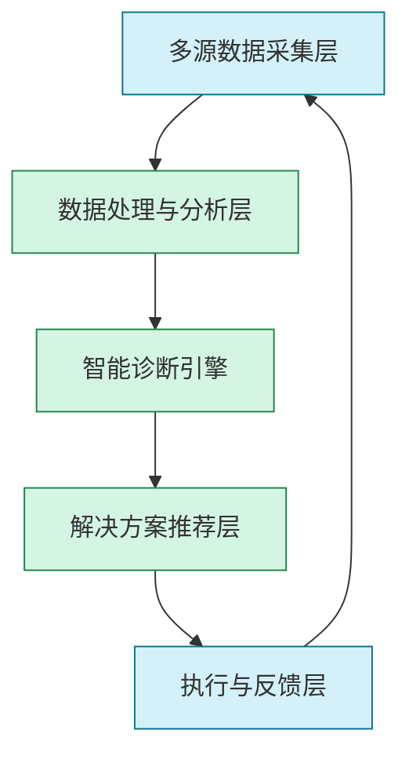

# 智能诊断系统

## 1. 概述

智能诊断系统是产研火箭的重要支撑组件，通过AI技术对研发全流程的异常、瓶颈和质量问题进行自动化识别与分析。它结合机器学习、知识图谱和专家系统，持续监控系统运行状态，提前发现潜在问题，并提供智能化解决方案。

### 1.1 核心价值

- **问题早期发现**：在问题扩大前识别潜在风险与异常模式
- **根因快速定位**：减少平均问题排查时间80%以上
- **解决方案智能推荐**：提供基于历史案例与最佳实践的解决建议
- **知识沉淀与复用**：构建组织级技术问题解决知识库
- **持续改进闭环**：推动系统质量与稳定性的迭代提升

### 1.2 应用场景

- 代码质量异常诊断与修复
- 系统性能瓶颈识别与优化
- 集成测试问题自动分析
- 生产环境异常预警与处理
- 用户体验痛点识别与改进

## 2. 智能诊断系统架构

智能诊断系统采用分层设计，实现从数据采集到智能决策的完整诊断闭环：



### 2.1 多源数据采集层

**功能**：广泛收集系统运行、开发过程和用户交互的多维度数据

**数据源**：
- 代码仓库与提交记录
- CI/CD流水线日志
- 系统监控指标与告警
- 错误日志与异常堆栈
- 用户反馈与行为数据
- 测试结果与覆盖率报告

**采集机制**：
- 实时流式数据收集
- 周期性批量数据抓取
- 事件触发式数据捕获
- API集成与数据交换

### 2.2 数据处理与分析层

**功能**：清洗、转换和结构化原始数据，提取有价值的诊断信息

**核心能力**：
- 日志解析与标准化处理
- 时序数据分析与趋势识别
- 文本挖掘与自然语言处理
- 异常检测与阈值动态调整
- 数据关联分析与上下文构建

**技术实现**：
- 分布式流处理框架
- 实时特征提取算法
- 数据清洗与转换管道
- 上下文关联引擎

### 2.3 智能诊断引擎

**功能**：对处理后的数据进行深度分析，识别问题和根因

**核心算法**：
- 异常检测与模式识别
- 根因分析与因果推断
- 知识图谱推理引擎
- 专家规则系统
- 多模态AI模型

**诊断类型**：
- 代码质量诊断
- 性能瓶颈诊断
- 系统架构诊断
- 集成问题诊断
- 用户体验诊断

### 2.4 解决方案推荐层

**功能**：基于诊断结果提供针对性的解决方案

**推荐机制**：
- 案例匹配与相似度计算
- 最佳实践知识库检索
- 解决方案生成与评分
- 专家经验规则应用
- 协作修复建议

**解决方案类型**：
- 代码修复建议
- 配置优化方案
- 架构调整建议
- 资源扩展方案
- 流程改进建议

### 2.5 执行与反馈层

**功能**：推动解决方案实施并收集效果反馈

**执行机制**：
- 自动修复执行
- 人机协作处理
- 任务分配与追踪
- 变更管理与控制

**反馈闭环**：
- 解决效果评估
- 方案有效性记录
- 知识库更新与增强
- 诊断模型持续优化

## 3. 核心诊断能力

### 3.1 代码质量智能诊断

**诊断范围**：
- 代码缺陷与漏洞
- 架构设计问题
- 性能隐患
- 可维护性问题
- 测试覆盖度不足

**诊断方法**：
- 静态代码分析
- 历史提交模式分析
- 代码复杂度与变更风险评估
- 依赖关系与架构合理性检查
- 最佳实践符合度评估

**应用示例**：
```
【智能诊断报告：代码质量】

检测模块: 用户认证服务(auth-service)
诊断等级: 警告(P2)

问题描述:
检测到认证模块中存在潜在的令牌验证漏洞，可能导致某些场景下的权限绕过。

根因分析:
1. JWT验证逻辑中缺少令牌过期时间检查
2. 权限验证与令牌验证的执行顺序不当
3. 异常处理逻辑允许在验证失败时继续执行

影响范围:
可能影响所有依赖该认证服务的API调用(约15个服务)

修复建议:
1. 添加完整的令牌有效期验证逻辑
2. 调整验证流程，确保先完成令牌验证再进行权限检查
3. 增强异常处理，确保验证失败时请求被正确拦截

参考修复代码:
    ```java
    // 修复前
    public boolean validateToken(String token) {
      try {
        Claims claims = Jwts.parser()
          .setSigningKey(secretKey)
          .parseClaimsJws(token)
          .getBody();
        return true;
      } catch (Exception e) {
        logger.error("Token validation error", e);
        return false;
      }
    }
    
    // 修复后
    public boolean validateToken(String token) {
      try {
        Claims claims = Jwts.parser()
          .setSigningKey(secretKey)
          .parseClaimsJws(token)
          .getBody();
        
        // 添加过期时间验证
        Date expiration = claims.getExpiration();
        if (expiration == null || expiration.before(new Date())) {
          return false;
        }
        
        return true;
      } catch (Exception e) {
        logger.error("Token validation error", e);
        return false;
      }
    }
    ```

相似历史案例: AUTH-2023-07-15
知识库参考: SEC-JWT-VALIDATION-001
```

### 3.2 性能瓶颈智能诊断

**诊断范围**：
- 响应时间异常
- 资源使用率问题
- 并发处理瓶颈
- 数据库查询效率
- API调用延迟

**诊断方法**：
- 性能指标异常检测
- 调用链路分析
- 资源使用模式识别
- SQL查询性能评估
- 负载模式与容量分析

**应用示例**：
```
【智能诊断报告：性能瓶颈】

检测服务: 商品目录服务(product-catalog)
诊断等级: 严重(P1)

问题描述:
检测到商品搜索API的p95响应时间在过去3小时内增加了350%，从200ms上升到920ms。

根因分析:
1. 数据库慢查询: 分类筛选查询未使用索引
2. 连接池饱和: 当前连接数99/100，等待队列增长
3. 关联查询效率低: 商品与库存的关联查询执行了N+1查询模式

影响范围:
- 搜索功能响应缓慢(影响约40%的用户请求)
- 间接影响购物车与订单转化率(下降12%)

修复建议:
1. 为product_category_id字段添加索引
2. 优化SQL查询，使用JOIN替代子查询
3. 实施查询结果缓存策略
4. 增加数据库连接池容量

SQL优化示例:
    ```sql
    -- 优化前
    SELECT * FROM products 
    WHERE status = 'active' 
    AND (SELECT count(*) FROM product_categories 
         WHERE product_id = products.id 
         AND category_id IN (12, 15, 18)) > 0;
    
    -- 优化后
    SELECT DISTINCT p.* FROM products p
    JOIN product_categories pc ON p.id = pc.product_id
    WHERE p.status = 'active'
    AND pc.category_id IN (12, 15, 18);
    ```

相似历史案例: PERF-2023-09-22
知识库参考: DB-QUERY-OPT-005, CONN-POOL-SIZING-002
```

### 3.3 系统集成智能诊断

**诊断范围**：
- 服务间通信异常
- API契约不匹配
- 数据格式不一致
- 依赖版本冲突
- 集成点故障

**诊断方法**：
- 服务调用图分析
- 接口契约变更检测
- 数据流异常模式识别
- 依赖关系冲突分析
- 故障传播路径追踪

**应用示例**：
```
【智能诊断报告：系统集成】

检测场景: 订单创建流程
诊断等级: 高(P2)

问题描述:
订单服务与支付服务集成出现间歇性失败，成功率从99.7%下降到94.2%。

根因分析:
1. API版本不匹配: 支付服务最近部署(v2.5.1)更新了交易创建API的请求格式
2. 数据格式变更: 价格字段从字符串变更为数字类型，导致序列化错误
3. 超时设置不当: 订单服务对支付API调用的超时设置(2秒)低于支付服务的平均处理时间(2.3秒)

影响范围:
影响约6%的订单创建请求，主要发生在高峰期和大额订单处理时

修复建议:
1. 更新订单服务中的支付客户端适配最新API格式
2. 统一价格字段的类型处理
3. 增加超时阈值至5秒
4. 实现优雅降级机制

代码修复示例:
    ```java
    // 修复前
    public PaymentResult createPayment(Order order) {
      PaymentRequest request = new PaymentRequest();
      request.setAmount(String.valueOf(order.getTotalAmount()));
      request.setOrderId(order.getId());
      
      return paymentClient.createTransaction(request);
    }
    
    // 修复后
    public PaymentResult createPayment(Order order) {
      PaymentRequestV2 request = new PaymentRequestV2();
      request.setAmount(order.getTotalAmount().doubleValue());
      request.setOrderId(order.getId());
      request.setCurrency(order.getCurrency());
      
      try {
        return paymentClient.createTransactionV2(request);
      } catch (Exception e) {
        log.error("Payment service error", e);
        return fallbackPaymentProcessing(order);
      }
    }
    ```

相似历史案例: INT-2023-08-03
知识库参考: API-VERSION-COMP-003, TIMEOUT-CONFIG-001
```

### 3.4 用户体验智能诊断

**诊断范围**：
- 交互流畅度问题
- 功能可用性障碍
- 用户路径异常
- 界面一致性问题
- 易用性挑战

**诊断方法**：
- 用户行为路径分析
- 会话回放异常检测
- 交互时间异常识别
- 用户反馈情感分析
- A/B测试结果分析

**应用示例**：
```
【智能诊断报告：用户体验】

检测功能: 移动端结账流程
诊断等级: 中(P3)

问题描述:
移动端用户在支付方式选择步骤的放弃率较高，从平均15%上升到28%。

根因分析:
1. 交互延迟: 支付选项加载时间超过3秒，缺少加载状态提示
2. 视觉反馈不足: 用户点击支付方式后无明确选中状态
3. 布局问题: 在iPhone SE等小屏设备上，确认按钮被键盘遮挡
4. 错误处理欠佳: 验证失败提示不清晰，定位在屏幕不易察觉位置

影响范围:
主要影响移动端用户，特别是小屏设备和首次购物用户

改进建议:
1. 添加支付选项的骨架屏加载状态
2. 强化选中状态的视觉反馈
3. 优化小屏幕布局，确保关键按钮可见
4. 改进错误提示的位置和清晰度

    UI修复示例:
    ```jsx
    // 修复前
    function PaymentOptions() {
      const [options, setOptions] = useState([]);
      
      useEffect(() => {
        fetchPaymentOptions().then(data => setOptions(data));
      }, []);
      
      return (
        <div className="payment-container">
          {options.map(option => (
            <div className="payment-option" onClick={() => selectOption(option.id)}>
              {option.name}
            </div>
          ))}
          <button className="confirm-button">确认支付方式</button>
        </div>
      );
    }
    
    // 修复后
    function PaymentOptions() {
      const [options, setOptions] = useState([]);
      const [loading, setLoading] = useState(true);
      const [selected, setSelected] = useState(null);
      const [error, setError] = useState(null);
      
      useEffect(() => {
        setLoading(true);
        fetchPaymentOptions()
          .then(data => {
            setOptions(data);
            setLoading(false);
          })
          .catch(err => {
            setError('加载支付方式失败，请重试');
            setLoading(false);
          });
      }, []);
      
      const selectOption = (id) => {
        setSelected(id);
        setError(null);
      };
      
      return (
        <div className="payment-container">
          {loading ? (
            <SkeletonLoader count={4} className="payment-option-skeleton" />
          ) : error ? (
            <ErrorMessage message={error} onRetry={() => fetchPaymentOptions()} />
          ) : (
            <>
              {options.map(option => (
                <div 
                  className={`payment-option ${selected === option.id ? 'selected' : ''}`}
                  onClick={() => selectOption(option.id)}
                  aria-selected={selected === option.id}
                >
                  
                  <span>{option.name}</span>
                  {selected === option.id && <CheckIcon className="selected-icon" />}
                </div>
              ))}
            </>
          )}
          <div className="sticky-footer">
            {error && <div className="error-banner">{error}</div>}
            <button 
              className={`confirm-button ${!selected && 'disabled'}`}
              disabled={!selected || loading}
            >
              确认支付方式
            </button>
          </div>
        </div>
      );
    }
    ```

相似历史案例: UX-2023-05-17
知识库参考: MOBILE-CHECKOUT-001, ERROR-HANDLING-UX-004
```

## 4. 智能诊断驱动模型

### 4.1 异常检测模型

**核心功能**：
识别系统中的异常行为、模式与指标偏差

**模型类型**：
- 统计异常检测
- 时序异常检测
- 深度学习异常检测
- 规则引擎异常检测

**应用场景**：
- 性能指标异常监测
- 用户行为异常识别
- 系统调用模式异常
- 资源使用异常检测

**模型更新机制**：
- 持续学习与阈值自适应
- 反馈驱动的模型调整
- 季节性与周期性调整
- 多维度异常相关性学习

### 4.2 根因分析模型

**核心功能**：
从多种异常现象中推断出问题的根本原因

**模型类型**：
- 因果推理模型
- 决策树与随机森林
- 贝叶斯网络
- 知识图谱推理

**应用场景**：
- 多服务故障关联分析
- 性能衰退根因定位
- 集成失败原因追踪
- 用户体验问题溯源

**增强技术**：
- 拓扑感知的传播分析
- 时序相关性计算
- 专家知识规则融合
- 历史案例相似度匹配

### 4.3 解决方案生成模型

**核心功能**：
基于问题诊断结果自动提供解决方案

**模型类型**：
- 检索增强生成模型
- 案例推理系统
- 多目标优化模型
- 专家系统规则引擎

**生成策略**：
- 历史解决方案适配
- 最佳实践知识应用
- 专家经验规则匹配
- AI辅助方案创新

**评估机制**：
- 方案可行性评分
- 实施难度与风险评估
- 预期效果预测
- 副作用与影响分析

## 5. 实施与集成

### 5.1 数据源集成

**系统日志集成**：
- 标准化日志格式与级别
- 分布式日志收集管道
- 结构化与非结构化日志处理
- 日志关联与会话追踪

**监控指标集成**：
- 应用性能指标(APM)
- 基础设施监控指标
- 业务指标与KPI
- 自定义监控指标

**代码与构建集成**：
- 代码仓库变更跟踪
- 构建流水线结果采集
- 代码质量报告集成
- 测试覆盖与结果分析

**用户反馈集成**：
- 应用内反馈渠道
- 用户行为数据收集
- 客服工单与问题报告
- NPS与满意度调查

### 5.2 触发机制

**实时触发**：
- 阈值告警触发诊断
- 异常检测自动启动
- 错误堆栈即时分析
- 性能衰退实时识别

**周期触发**：
- 定时健康检查
- 周期性代码质量扫描
- 性能基线周期评估
- 系统拓扑定期分析

**人工触发**：
- 问题报告智能分析
- 按需专项诊断
- 变更前后对比分析
- 安全漏洞专项检查

### 5.3 产研流程集成

**研发阶段集成**：
- 代码提交前质量诊断
- 设计方案自动评审
- 代码审查辅助分析
- 测试覆盖gaps识别

**发布阶段集成**：
- 上线前健康检查
- 变更风险自动评估
- 回滚决策智能辅助
- 灰度效果实时诊断

**运维阶段集成**：
- 生产环境持续监测
- 故障智能分级响应
- 系统弹性能力评估
- 资源优化建议

## 6. 最佳实践

### 6.1 诊断规则体系建设

**规则分层**：
- 基础设施层规则
- 应用服务层规则
- 业务逻辑层规则
- 用户体验层规则

**规则管理**：
- 规则版本控制与管理
- 规则有效性评估
- 规则冲突检测与调和
- 规则生命周期管理

**规则示例**：
```
规则ID: PERF-DB-001
名称: 数据库查询性能异常检测
描述: 监测数据库查询响应时间异常增长
条件:
  - 平均查询时间超过基线值的200%
  - 持续时间 > 5分钟
  - 影响查询数 > 100/分钟
诊断动作:
  - 收集Top 10慢查询
  - 分析相关表的索引使用情况
  - 检查数据库连接池状态
  - 评估查询计划变更
严重程度: 高
标签: 性能,数据库,查询优化
```

### 6.2 诊断知识库构建

**知识结构**：
- 问题模式分类
- 根因与解决方案映射
- 技术栈相关最佳实践
- 诊断决策树

**知识来源**：
- 历史解决案例提取
- 专家经验编码
- 技术文档与最佳实践
- 行业标准与模式

**知识演进**：
- 基于反馈的知识优化
- 新问题模式纳入
- 解决方案效果评估
- 领域知识定期更新

### 6.3 闭环反馈机制

**效果跟踪**：
- 解决方案实施监控
- 预期与实际效果对比
- 长期影响评估
- 二次问题监测

**模型优化**：
- 基于准确度的模型调整
- 误报与漏报分析
- 阈值与规则动态优化
- 场景适应性增强

**持续学习**：
- 新模式与异常识别
- 专家反馈纳入
- 未知问题分类与处理
- 跨场景知识迁移

## 7. 案例研究

### 7.1 微服务架构性能诊断案例

**场景描述**：
电商平台在促销活动期间出现订单处理延迟，用户投诉增多。

**挑战**：
- 复杂微服务架构(20+服务)
- 多层依赖关系
- 流量剧增(10倍日常流量)
- 问题表现不一致

**诊断过程**：
1. **异常检测**：
   - 识别订单服务的响应时间异常增长(350%)
   - 发现库存服务错误率上升(0.2% → 3.5%)
   - 检测到数据库连接池饱和

2. **根因分析**：
   - 构建服务调用拓扑图
   - 分析调用链路耗时分布
   - 识别库存锁争用问题
   - 发现数据库连接池配置不当

3. **解决方案生成**：
   - 库存查询策略优化
   - 数据库连接池参数调整
   - 缓存策略实施
   - 高并发路径异步化改造

**成果**：
- 诊断时间从数小时缩短至15分钟
- 系统吞吐量提升300%
- 响应时间恢复正常
- 构建可重用的高并发诊断模型

### 7.2 前端用户体验诊断案例

**场景描述**：
移动应用最新版本发布后，用户评分下降，使用时长减少。

**挑战**：
- 缺乏明确的错误报告
- 多设备多系统表现不一
- 用户反馈模糊不具体
- 性能指标看似正常

**诊断过程**：
1. **异常检测**：
   - 分析用户行为轨迹变化
   - 识别特定流程完成率下降(25%)
   - 检测页面交互卡顿指标上升
   - 关联用户反馈情绪分析

2. **根因分析**：
   - 会话回放异常模式分析
   - 设备分群性能对比
   - JavaScript执行时间分析
   - 网络请求时序评估

3. **解决方案生成**：
   - 关键渲染路径优化
   - 资源加载优先级调整
   - 交互防抖动措施
   - 渐进式图片加载实现

**成果**：
- 应用评分恢复并提升
- 用户平均使用时长增加40%
- 转化率提升15%
- 建立前端体验基线与监控

## 8. 高级特性

### 8.1 自适应阈值与基线

**功能**：
动态调整异常检测阈值，适应系统变化与业务模式

**实现机制**：
- 时间序列分解与季节性识别
- 多维度基线自动计算
- 业务周期感知的阈值调整
- 异常模式的自动分类与权重

**应用效果**：
- 减少90%的误报告警
- 提前15-30分钟发现异常趋势
- 适应业务增长与系统扩展
- 精准识别缓慢劣化问题

### 8.2 协作诊断机制

**功能**：
结合AI自动诊断与人类专家经验的协作机制

**协作模式**：
- AI初步诊断与人工确认
- 专家指导下的深度分析
- 诊断结果共同评审
- 知识迁移与经验学习

**技术实现**：
- 交互式诊断界面
- 假设验证工具
- 协作知识编辑
- 专家反馈学习循环

### 8.3 跨系统关联分析

**功能**：
在多系统、多服务间建立问题关联，识别复杂依赖导致的问题

**分析维度**：
- 服务间调用依赖
- 资源共享与竞争
- 数据流一致性
- 部署与变更时序

**应用场景**：
- 微服务架构故障传播分析
- 数据不一致根源追踪
- 资源争用问题诊断
- 复杂分布式事务失败分析

## 9. 工具与资源

### 9.1 诊断工具集

| 工具类型 | 代表工具 | 应用场景 |
|---------|---------|---------|
| 日志分析 | ELK Stack, Loki | 集中式日志收集与分析 |
| APM工具 | New Relic, Dynatrace | 应用性能监控与追踪 |
| 分布式追踪 | Jaeger, Zipkin | 服务调用链路分析 |
| 根因分析 | PagerDuty, SigNoz | 自动化故障根因推断 |
| 前端监控 | LogRocket, Sentry | 用户体验与前端异常监控 |
| 数据库监控 | VividCortex, SolarWinds | 数据库性能与查询分析 |

### 9.2 集成接口

**监控系统集成**：
- Prometheus兼容的指标接口
- OpenTelemetry数据采集
- 告警API与回调机制
- 监控数据查询接口

**开发工具集成**：
- IDE插件与诊断扩展
- Git提交钩子集成
- CI/CD流水线集成点
- 代码审查工具集成

**知识库集成**：
- 知识图谱查询接口
- 最佳实践推荐API
- 文档与Wiki集成
- 工单系统双向集成

## 10. 未来发展方向

### 10.1 多模态分析增强

- 整合代码、日志、指标与用户行为的多模态分析
- 引入视觉模型分析界面截图与录屏
- 语音分析用户反馈与客服录音
- 跨模态异常关联与根因推断

### 10.2 预测性诊断

- 从检测已发生问题转向预测潜在问题
- 资源使用与性能降级趋势预测
- 用户满意度变化预警
- 基于变更的风险预测与防范

### 10.3 自治修复能力

- 低风险问题的自动修复机制
- 资源动态调整与优化
- 自适应配置调整
- 基于历史经验的防御性调整

### 10.4 持续学习与演进

- 跨组织知识共享与学习
- 新技术栈与架构的适应性学习
- 零样本与小样本问题识别
- 诊断能力自评估与优化

## 参考资料

[1] Chen, J., et al. "AIOps: Real-World Challenges and Research Innovations." 2020 IEEE International Conference on Software Maintenance and Evolution (ICSME), 2020.

[2] Soldani, J., et al. "Automated Root Cause Analysis in Microservices Architectures." IEEE Transactions on Services Computing, 2022.

[3] Gan, Y., et al. "Understanding the Complexity of Diagnosing Distributed Systems." IEEE Transactions on Software Engineering, 2021.

[4] Ma, M., et al. "AutoDiagnosis: Automatically Diagnosing Performance Issues in Mobile Applications." ESEC/FSE 2021.

[5] Karari, L., et al. "AI-Driven Intelligent Diagnosis: From Machine Learning to Knowledge Mining." International Journal of Software Engineering and Knowledge Engineering, 2023.
