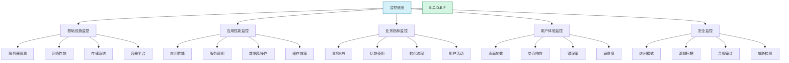
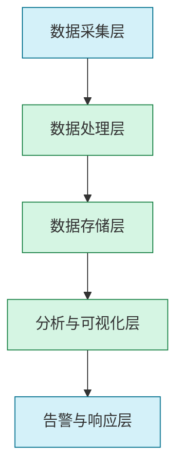

```markdown:docs/diagnostics/monitoring.md
# 监控系统设计指南

## 1. 概述

监控系统是产研火箭的核心支撑系统之一，为研发全生命周期提供全面的可观测性支持。本指南涵盖监控系统的设计原则、架构模式、实现方法和最佳实践，帮助团队构建高效的监控体系，实现问题的早期发现和快速响应。

### 1.1 监控系统的价值

监控系统为产品研发和运营提供以下核心价值：

- **问题早期发现**：在用户受影响前识别潜在问题
- **快速定位根因**：减少平均故障排查时间(MTTR)
- **性能优化基础**：提供数据支持的优化决策依据
- **容量规划支持**：预测资源需求并提前规划扩展
- **业务洞察提供**：通过技术指标关联业务表现
- **安全态势感知**：识别异常访问模式和潜在风险

### 1.2 监控维度

全面的监控体系应覆盖以下关键维度：



## 2. 监控系统设计原则

### 2.1 可观测性三大支柱

现代监控系统设计基于可观测性的三大支柱：

**1. 指标(Metrics)**
- 数值化的系统行为量度
- 适合趋势分析和阈值告警
- 低存储成本，可长期保留
- 例：CPU使用率、请求数、错误率

**2. 日志(Logs)**
- 离散的时间点事件记录
- 提供详细的上下文信息
- 适合调试和根因分析
- 例：错误信息、访问记录、系统事件

**3. 追踪(Traces)**
- 请求在分布式系统中的完整路径
- 显示组件间的关系和依赖
- 识别性能瓶颈和错误传播
- 例：服务调用链、数据库查询时间

### 2.2 核心设计原则

**全面覆盖原则**
- 覆盖所有关键组件和服务
- 监控从前端到后端的完整链路
- 包括自身系统和第三方依赖
- 无监控盲点和监控死角

**适当粒度原则**
- 根据数据重要性和波动性选择合适采集频率
- 高价值指标使用更细粒度采集
- 平衡数据精度和系统开销
- 支持按需调整采集粒度

**关联分析原则**
- 建立指标间的关联关系
- 将技术指标与业务指标关联
- 支持从现象追踪到根因
- 提供上下文关联的告警信息

**可扩展性原则**
- 架构支持水平扩展
- 随监控对象增加而平滑扩容
- 支持新类型监控的便捷接入
- 避免单点瓶颈和限制

**自动化原则**
- 自动发现和配置新服务
- 智能阈值和异常检测
- 自动化报告和可视化
- 减少人工干预和配置工作

### 2.3 监控数据模型

**指标数据模型**
- 基于时间序列的键值对结构
- 包含指标名称、时间戳、数值和标签
- 支持多维度标签进行分组和筛选
- 适用于数学运算和聚合分析

示例指标格式：
```
http_requests_total{method="GET", endpoint="/api/users", status="200"} 24 1627984882
```

**日志数据模型**
- 结构化或半结构化的事件记录
- 包含时间戳、级别、来源和消息内容
- 支持上下文信息和元数据
- 可搜索和过滤的文本内容

示例日志格式：
```json
{
  "timestamp": "2023-10-25T14:35:22.123Z",
  "level": "ERROR",
  "service": "user-service",
  "traceId": "abc123",
  "message": "Failed to authenticate user",
  "userId": "user-456",
  "errorCode": "AUTH_001",
  "stack": "..."
}
```

**追踪数据模型**
- 基于分布式追踪规范(如OpenTelemetry)
- 包含trace和span的层级结构
- 记录时间信息、属性和事件
- 保留父子关系和因果顺序

示例追踪格式：
```json
{
  "traceId": "abc123",
  "spans": [
    {
      "spanId": "span-1",
      "name": "GET /api/users",
      "startTime": "2023-10-25T14:35:22.100Z",
      "endTime": "2023-10-25T14:35:22.150Z",
      "service": "api-gateway",
      "kind": "SERVER",
      "status": "OK",
      "attributes": {
        "http.method": "GET",
        "http.url": "/api/users"
      },
      "events": [...],
      "links": [...]
    },
    {
      "spanId": "span-2",
      "parentSpanId": "span-1",
      "name": "UserService.getUsers",
      "startTime": "2023-10-25T14:35:22.110Z",
      "endTime": "2023-10-25T14:35:22.140Z",
      "service": "user-service",
      "kind": "CLIENT",
      "status": "OK",
      "attributes": {...},
      "events": [...],
      "links": [...]
    }
    // 更多spans...
  ]
}
```

## 3. 监控系统架构

### 3.1 总体架构

现代监控系统通常采用分层架构，包含以下核心组件：



### 3.2 数据采集层

**责任**：从各种来源采集监控数据，并进行初步处理

**核心组件**：
- **指标收集器**：从系统和应用采集数值指标
- **日志采集器**：收集和转发各类日志数据
- **追踪代理**：捕获分布式调用的追踪信息
- **探针与插桩**：在应用中嵌入数据采集点
- **采集目录服务**：维护采集目标和配置

**采集策略**：
- **推送模式(Push)**：被监控对象主动发送数据
- **拉取模式(Pull)**：监控系统定期抓取数据
- **混合模式**：结合两种模式的优点

**采集机制**：
- **代理收集**：在主机或容器中部署收集代理
- **无代理收集**：直接从API或远程端点采集
- **边车模式**：为每个服务部署专用收集容器
- **内置SDK**：应用集成专用监控SDK

### 3.3 数据处理层

**责任**：对原始数据进行处理、转换、规范化和富化

**核心功能**：
- **数据过滤**：去除无用或敏感数据
- **数据聚合**：降采样和预计算常用聚合值
- **数据验证**：检查数据有效性和完整性
- **数据转换**：标准化格式和单位
- **数据富化**：添加元数据和上下文信息
- **数据路由**：分发数据到适当的存储和处理管道

**处理模式**：
- **流式处理**：实时处理数据流
- **批量处理**：周期性处理数据批次
- **混合处理**：针对不同数据类型采用不同策略

### 3.4 数据存储层

**责任**：高效存储和检索大规模监控数据

**存储分类**：
- **时间序列数据库**：存储指标数据
- **日志存储系统**：存储日志数据
- **追踪存储系统**：存储分布式追踪数据
- **元数据存储**：存储监控对象和配置信息

**存储特性**：
- **高写入吞吐**：支持大量并发写入
- **高效压缩**：降低存储成本
- **灵活保留策略**：不同粒度的数据保留时间
- **快速查询**：支持时间范围和多维度查询

**数据生命周期管理**：
- **热数据**：高性能存储，完整精度
- **温数据**：降采样后的中期数据
- **冷数据**：高度压缩的长期归档数据
- **自动过期**：基于策略的数据清理

### 3.5 分析与可视化层

**责任**：提供数据的分析、挖掘和可视化能力

**核心功能**：
- **实时仪表板**：展示系统当前状态
- **趋势分析**：显示历史趋势和变化
- **交互式查询**：支持自定义数据筛选和分析
- **关联分析**：展示多指标间的关联关系
- **异常检测**：识别数据中的异常模式
- **根因分析**：帮助定位问题根源

**可视化类型**：
- **时间序列图表**：展示指标随时间变化
- **拓扑图**：显示系统组件和依赖关系
- **热力图**：展示高密度数据分布
- **追踪瀑布图**：可视化请求执行过程
- **日志浏览器**：搜索和分析日志内容

### 3.6 告警与响应层

**责任**：检测异常情况并触发适当的响应

**告警组件**：
- **告警规则引擎**：评估数据是否符合告警条件
- **告警管理器**：处理告警分组、路由和通知
- **告警通知系统**：通过多种渠道发送告警
- **告警抑制机制**：减少告警风暴和重复告警
- **告警升级策略**：基于时间和严重性的升级规则

**响应机制**：
- **自动化响应**：预设的自动处理动作
- **人工介入**：需要人工处理的工单创建
- **响应流程**：预定义的问题响应步骤
- **知识库关联**：将告警与解决方案关联

## 4. 关键监控指标

### 4.1 基础设施指标

**主机资源指标**：
- **CPU使用率**：总体使用率、每核心使用率、用户/系统时间
- **内存使用**：总使用量、空闲空间、交换活动
- **磁盘使用**：容量使用率、IOPS、读写延迟、队列深度
- **网络流量**：吞吐量、数据包率、错误与丢包率
- **系统负载**：1/5/15分钟平均负载

**容器指标**：
- **容器CPU**：使用率、节流统计
- **容器内存**：使用量、限制、OOM事件
- **容器网络**：I/O吞吐量、连接状态
- **容器生命周期**：创建/销毁率、重启次数
- **容器健康**：健康检查状态、就绪状态

**网络设备指标**：
- **接口吞吐量**：进/出比特率、包速率
- **错误统计**：错误包、丢包、冲突
- **链路状态**：上下状态、延迟、抖动
- **队列指标**：队列深度、排队延迟
- **连接统计**：活动连接、连接状态分布

**虚拟化平台指标**：
- **虚拟机状态**：电源状态、CPU就绪时间
- **虚拟机资源**：资源分配与使用比率
- **宿主机指标**：资源利用率、过载指标
- **集群状态**：容量、利用率、平衡性

### 4.2 应用性能指标

**通用应用指标**：
- **请求吞吐量**：每秒请求数(RPS)/每分钟事务数(TPM)
- **响应时间**：平均、中位数、90/95/99百分位延迟
- **错误率**：按类型和状态码分类的错误比率
- **饱和度**：资源使用率与容量上限的比值
- **可用性**：正常运行时间与总时间的比率

**Web应用指标**：
- **页面加载时间**：首字节时间(TTFB)、DOM就绪时间
- **资源加载性能**：JS/CSS/图片加载时间
- **前端错误**：JavaScript错误、API调用失败率
- **用户交互指标**：首次内容绘制(FCP)、交互到绘制时间(TTI)
- **Web性能体验**：累积布局偏移(CLS)、最大内容绘制(LCP)

**微服务指标**：
- **服务调用量**：内部/外部API调用频率
- **服务依赖可用性**：上游服务可用状态
- **实例健康状态**：服务实例的运行状况
- **熔断器状态**：开/关/半开状态及转换次数
- **重试与降级**：重试次数、降级启动次数

**消息队列指标**：
- **队列深度**：待处理消息数
- **消息速率**：生产/消费消息的速率
- **处理延迟**：从生产到消费的时间差
- **失败率**：消息处理失败比例
- **重传统计**：消息重传次数

### 4.3 数据库指标

**通用数据库指标**：
- **查询吞吐量**：每秒查询数/事务数
- **查询响应时间**：查询执行时间分布
- **连接使用**：活动连接数、空闲连接、连接等待
- **缓存效率**：缓存命中率、缓存使用量
- **错误统计**：查询错误、锁超时、死锁

**关系型数据库指标**：
- **表/索引扫描**：全表扫描次数、索引使用率
- **锁统计**：锁等待次数、锁等待时间
- **事务指标**：事务速率、回滚率、活动事务
- **临时空间**：临时表/空间使用情况
- **缓冲区指标**：缓冲池命中率、写缓冲区刷新

**NoSQL数据库指标**：
- **读/写操作分布**：读写比例、操作类型分布
- **分区平衡性**：分区间数据/负载分布
- **复制延迟**：主从节点间数据同步延迟
- **一致性级别**：各一致性级别的请求分布
- **数据压缩比**：压缩前后的数据大小比

**缓存系统指标**：
- **命中率**：按键分类的缓存命中率
- **驱逐率**：缓存项被驱逐的频率
- **内存使用**：已用内存与总容量比
- **过期速率**：键自动过期的速率
- **冷热分布**：访问频率的分布情况

### 4.4 业务指标

**用户行为指标**：
- **活跃用户**：DAU/MAU及增长趋势
- **会话指标**：平均会话时长、跳出率
- **功能使用**：各功能模块的使用频率
- **转化指标**：关键流程的转化漏斗
- **留存指标**：N日/周留存率

**电商业务指标**：
- **交易指标**：下单量、支付量、订单金额
- **商品指标**：商品浏览、加购、收藏量
- **用户指标**：新购客户、复购率、客单价
- **服务指标**：物流时效、客服响应时间
- **营销指标**：优惠券使用率、促销转化率

**内容平台指标**：
- **内容指标**：发布量、点击量、完成率
- **互动指标**：评论、分享、点赞数
- **创作者指标**：活跃创作者、创作频率
- **分发指标**：推荐点击率、搜索成功率
- **用户粘性**：日均访问时长、访问频次

**SaaS平台指标**：
- **租户指标**：活跃租户数、续约率
- **功能使用**：核心功能的采用率
- **API使用**：API调用分布、成功率
- **集成指标**：第三方集成的使用情况
- **配额使用**：资源使用与配额比例

## 5. 告警设计

### 5.1 告警原则

**有效性原则**：
- 每个告警都应指向需要人为关注的问题
- 告警应该提供足够上下文以便快速响应
- 避免无法采取行动的"信息性"告警
- 确保告警与实际业务影响相关联

**可靠性原则**：
- 最小化误报和漏报
- 对噪声数据有抵抗力
- 在系统波动时保持稳定
- 响应真实异常而非暂时性波动

**区分度原则**：
- 告警级别反映真实严重程度
- 清晰区分需立即处理与可稍后处理的问题
- 不同级别使用不同通知渠道和紧急度
- 避免"告警疲劳"和"狼来了"效应

**自动化原则**：
- 尽量减少需要人工配置的告警规则
- 支持自学习的动态阈值
- 自动进行告警关联和根因推断
- 提供自动化响应的可能性

### 5.2 告警级别

**告警级别定义**：

| 级别 | 名称 | 响应时间 | 通知方式 | 适用场景 |
|------|------|----------|----------|----------|
| P0 | 紧急 | 立即(0-5分钟) | 电话+短信+多渠道 | 生产环境严重服务中断，大范围业务影响 |
| P1 | 严重 | 尽快(5-15分钟) | 短信+消息+邮件 | 部分服务不可用，明显业务影响 |
| P2 | 中度 | 及时(15-30分钟) | 消息+邮件 | 性能下降，潜在业务影响，需要及时处理 |
| P3 | 一般 | 计划内(1-4小时) | 邮件+工单 | 次要功能问题，有替代方案 |
| P4 | 提示 | 按需(1-2工作日) | 工单/仪表板 | 需要注意但不紧急的潜在问题 |

**升级策略**：
- 未响应告警在固定时间后自动升级
- 持续问题随时间推移逐级升高严重性
- 相似问题短时间内重复出现升级处理
- 跨多个组件的问题升级到更高层级处理

### 5.3 告警规则设计

**指标告警模式**：
- **阈值告警**：指标超过静态阈值
- **变化率告警**：指标变化速度异常
- **离群告警**：指标偏离历史模式
- **预测告警**：预计指标将达到危险水平
- **复合告警**：多个条件的组合判断

**告警规则模板示例**：
```yaml
# 静态阈值告警示例
name: "高CPU使用率告警"
query: "avg(cpu_usage) by (host) > 85"
duration: "5m"  # 持续5分钟
labels:
  severity: "warning"
  team: "infra"
annotations:
  summary: "主机{{$labels.host}}的CPU使用率持续超过85%"
  description: "主机{{$labels.host}}的CPU使用率为{{$value}}%，已持续5分钟以上"
  runbook_url: "https://wiki.example.com/runbooks/high-cpu"

# 动态阈值告警示例
name: "异常API错误率"
query: "sum(rate(http_requests_total{status=~'5..'}[5m])) by (service) / sum(rate(http_requests_total[5m])) by (service) > 0.05"
duration: "2m"  # 持续2分钟
labels:
  severity: "critical"
  team: "backend"
annotations:
  summary: "服务{{$labels.service}}的错误率异常"
  description: "服务{{$labels.service}}的错误率为{{$value | humanizePercentage}}，正常应小于5%"
  dashboard_url: "https://grafana.example.com/d/service-dashboard?var-service={{$labels.service}}"
```

**告警减噪策略**：
- **去抖动**：短暂波动不触发告警
- **告警分组**：相似告警合并处理
- **智能抑制**：根因告警抑制衍生告警
- **维护窗口**：计划维护期间暂停告警
- **自适应阈值**：基于历史模式动态调整阈值

### 5.4 告警响应流程

**告警生命周期**：
1. **触发**：告警条件满足
2. **通知**：发送到适当渠道
3. **确认**：值班人员确认接收
4. **分派**：分配给合适的处理人
5. **处理**：问题排查和解决
6. **验证**：确认问题已解决
7. **解除**：关闭告警
8. **回顾**：事后复盘和改进

**响应角色与职责**：
- **一线支持**：初步响应和简单问题解决
- **二线支持**：专业技术问题的深入排查
- **领域专家**：特定系统或组件的专业支持
- **值班经理**：跨团队协调和升级决策
- **产品负责人**：重大事件的业务决策支持

**响应流程自动化**：
- 自动创建故障工单和关联信息
- 智能路由到合适的处理团队
- 自动收集相关诊断信息
- 提供处理建议和类似历史问题
- 记录响应过程和解决方法

## 6. 实现和部署

### 6.1 技术栈选择

**主流监控技术栈对比**：

| 技术栈 | 优势 | 适用场景 | 考虑因素 |
|--------|------|----------|----------|
| Prometheus + Grafana | 开源成熟、强大查询语言、适合云原生 | 容器化环境、微服务架构 | 扩展性需单独规划、长期存储需外部解决方案 |
| ELK/Elastic Stack | 统一的日志和指标分析、强大搜索 | 日志密集型系统、内容搜索需求强 | 资源需求大、复杂部署和维护 |
| TICK Stack | 高效时序数据处理、原生支持IoT | 边缘计算、IoT场景、高写入需求 | 社区相对较小、学习曲线陡峭 |
| Datadog/New Relic | 全面托管、快速部署、全栈可见性 | 资源有限团队、多云环境 | 成本随规模增长、定制性有限 |
| OpenTelemetry + 后端存储 | 统一标准、广泛集成、厂商中立 | 长期技术战略、多样化监控需求 | 仍在发展中、需配合存储和可视化解决方案 |

**选型考虑因素**：
- **业务规模**：预期监控对象数量和数据量
- **技术栈兼容性**：与现有技术栈的集成便利性
- **团队能力**：维护和使用系统的技术能力
- **扩展需求**：未来监控范围和复杂度增长预期
- **成本约束**：许可、基础设施和人力成本

### 6.2 部署模式

**单体部署**：
- 适合小型环境和测试场景
- 所有组件在单一服务器或集群上运行
- 简化管理但可靠性和扩展性受限
- 资源争用可能影响性能

**分布式部署**：
- 适合中大型生产环境
- 数据采集、处理、存储在不同节点
- 支持水平扩展和高可用
- 复杂度增加但性能和可靠性提升

**多级部署**：
- 适合地理分布式或大规模环境
- 本地采集和汇聚点分布在不同位置
- 分层的数据聚合和处理
- 支持边缘计算和本地告警

**云原生部署**：
- 基于容器和Kubernetes的部署
- 使用操作符和Helm图表简化管理
- 利用云原生弹性和自动扩缩容
- 无状态组件与有状态服务分离部署

### 6.3 扩展性设计

**水平扩展策略**：
- **数据分片**：基于指标名称或标签的数据分片
- **功能分解**：将不同功能部署在专用节点
- **地域分区**：按地理位置或数据中心分区
- **负载均衡**：采集和查询请求的智能分发

**容量规划考虑因素**：
- 活跃时间序列数量（基数）
- 数据点写入和查询速率
- 保留期和存储需求
- 并发用户和查询复杂度

**高可用设计**：
- 关键组件冗余部署
- 跨可用区或区域的数据复制
- 无状态服务的多实例部署
- 故障自动检测和恢复机制

### 6.4 性能优化

**采集层优化**：
- 优化采集频率与数据量平衡
- 实施边缘过滤减少无用数据传输
- 批量处理和压缩数据传输
- 采集代理资源使用限制

**存储层优化**：
- 优化数据压缩算法和策略
- 实施高效的数据块管理
- 明智使用内存缓存加速查询
- 自动数据降采样和归档策略

**查询层优化**：
- 查询缓存和结果复用
- 复杂查询拆分和并行化
- 预计算常用聚合值
- 限制高资源消耗查询

## 7. 最佳实践与案例

### 7.1 指标命名与标签约定

**指标命名规范**：
- 使用有意义的层次化名称
- 采用一致的命名风格(如snake_case)
- 包含度量单位信息
- 区分计数器和仪表盘类型

**标准命名示例**：
```
{组件}_{指标类型}_{指标名称}_{单位}
```

例如：
- `http_requests_total`
- `database_connections_active`
- `system_memory_usage_bytes`
- `application_request_duration_seconds`

**标签使用最佳实践**：
- 使用标签区分实例和服务
- 保持高基数标签(如用户ID)的使用受控
- 标准化状态和结果标签值
- 维护一致的标签命名约定

**常用标准标签**：
- `environment`: 环境(prod, staging, dev)
- `service`: 服务或应用名称
- `instance`: 实例标识符
- `version`: 软件版本
- `region`, `zone`: 地理位置信息

### 7.2 日志标准化

**结构化日志格式**：
- 使用JSON或其他结构化格式
- 包含标准字段集和上下文信息
- 使用一致的时间戳格式(ISO-8601)
- 支持嵌套结构表示复杂数据

**关键日志字段**：
- `timestamp`: 事件发生时间
- `level`: 日志级别(INFO/WARN/ERROR等)
- `service`: 生成日志的服务
- `trace_id`, `span_id`: 分布式追踪标识符
- `message`: 人类可读的消息内容
- `context`: 事件相关的上下文数据

**日志级别使用指南**：
- `ERROR`: 需要立即关注的问题
- `WARN`: 潜在问题或即将出现的错误
- `INFO`: 重要操作状态变更
- `DEBUG`: 详细的排查信息(非生产)
- `TRACE`: 最详细的诊断数据(仅调试)

**敏感数据处理**：
- 避免记录密码、令牌和完整个人信息
- 实施数据脱敏策略(如部分掩码)
- 遵守数据合规要求(GDPR等)
- 审核日志内容避免信息泄露

### 7.3 实战案例研究

**案例一：电商平台监控体系**

**挑战**：
- 高流量电商平台，峰值每秒数万请求
- 复杂的微服务架构，200+服务实例
- 需要实时监控业务指标和技术性能
- 季节性流量高峰需提前发现潜在问题

**解决方案**：
- 部署Prometheus集群与联邦架构
- 服务网格集成提供自动指标采集
- 建立四级告警体系与值班制度
- 开发业务指标与技术指标关联面板

**成果**：
- 故障平均检测时间从15分钟降至2分钟
- 系统平均恢复时间(MTTR)减少65%
- 成功预测并避免三次潜在大规模故障
- 用户体验指标提升32%

**案例二：金融交易系统可观测性**

**挑战**：
- 低延迟交易系统，毫秒级响应需求
- 严格的合规性和审计要求
- 多层架构，包含遗留系统与新服务
- 零容忍的可用性和数据完整性要求

**解决方案**：
- 自定义高性能指标收集代理
- 多级筛选和聚合减少监控开销
- 全流程分布式追踪实现端到端可见性
- 自动化异常检测与预警系统

**成果**：
- 监控覆盖率从75%提升至99.8%
- 系统监控开销控制在1%以内
- 异常交易自动检测准确率达92%
- 平均问题确认时间减少78%

### 7.4 常见陷阱与规避

**监控系统常见问题**：
- **监控盲点**：缺少关键组件或路径的监控
- **指标爆炸**：过多低价值指标导致资源浪费
- **告警噪音**：过多误报导致告警疲劳
- **孤岛效应**：不同监控系统间缺乏集成
- **上下文缺失**：告警缺少足够诊断信息
- **扩展性瓶颈**：架构无法支持监控范围增长
- **性能影响**：监控系统对生产环境造成干扰

**避免陷阱的最佳实践**：
- 制定明确的监控策略和覆盖标准
- 定期审查和优化指标收集范围
- 实施告警质量评估和持续改进
- 构建统一的监控平台整合多种数据源
- 丰富告警上下文和问题排查指南
- 设计可横向扩展的监控架构
- 严格控制和测试监控系统资源使用

## 8. 监控成熟度模型

### 8.1 监控能力演进

**监控成熟度级别**：

| 级别 | 名称 | 特点 | 关注点 |
|------|------|------|--------|
| 1 | 基础监控 | 基本存活检查、简单指标收集 | 系统和服务的基本可用性 |
| 2 | 完善监控 | 全面指标覆盖、标准化告警 | 性能异常和资源使用 |
| 3 | 主动监控 | 趋势分析、预测告警、自动扩容 | 提前预防问题和性能优化 |
| 4 | 业务洞察 | 技术与业务指标关联、用户体验量化 | 业务影响和最终用户体验 |
| 5 | 自优化系统 | AI/ML驱动异常检测、自动修复、持续优化 | 系统自愈和智能运营 |

**能力发展路径**：
- 从基础设施到应用再到业务的覆盖扩展
- 从被动响应到主动预防的方法转变
- 从孤立数据到关联分析的深度提升
- 从人工判断到智能决策的演进

### 8.2 监控文化建设

**DevOps与可观测性**：
- 将监控作为CI/CD流程的必要组成
- "监控即代码"的实践方式
- 开发团队对监控的主人翁意识
- 共享责任模型（开发也参与监控和告警）

**数据驱动决策文化**：
- 基于监控数据进行架构和系统决策
- 将性能指标纳入产品开发目标
- 持续评估和优化监控系统ROI
- 培养团队数据分析和解读能力

**持续学习与改进机制**：
- 定期回顾监控有效性和告警质量
- 根据故障案例优化监控覆盖
- 分享监控最佳实践和经验教训
- 技术债务减少和系统可观测性提升计划

## 9. 资源与参考

### 9.1 监控工具清单

**开源监控系统**：
- **Prometheus**: 指标收集与告警
- **Grafana**: 可视化与仪表板
- **Elasticsearch/Logstash/Kibana**: 日志管理
- **Jaeger/Zipkin**: 分布式追踪
- **OpenTelemetry**: 统一可观测性框架
- **Alertmanager**: 告警管理与通知
- **Thanos/Cortex**: Prometheus长期存储扩展
- **Loki**: 日志聚合系统

**商业监控系统**：
- **Datadog**: 全栈监控平台
- **New Relic**: 应用性能监控
- **Dynatrace**: 自动化智能观测
- **Splunk**: 数据分析平台
- **AppDynamics**: 应用性能监控
- **Sumo Logic**: 云原生机器数据分析
- **Elastic Observability**: 统一可观测性套件
- **Honeycomb**: 高维度可观测性平台

### 9.2 学习资源

**书籍推荐**：
- 《Monitoring with Prometheus》
- 《Distributed Systems Observability》
- 《Cloud Native Monitoring》
- 《SRE: Site Reliability Engineering》
- 《Practical Monitoring》

**在线资源**：
- Prometheus官方文档
- Grafana Labs博客和教程
- OpenTelemetry文档中心
- Google SRE博客
- Datadog监控指南

**社区资源**：
- Prometheus社区
- CNCF可观测性特别兴趣小组
- Observability工程师Slack频道
- 监控和可观测性相关会议
- GitHub上的开源监控项目

### 9.3 模板和示例

**常用仪表板模板**：
- Node Exporter主机监控面板
- Kubernetes集群监控面板
- 常见数据库性能面板
- 微服务健康状况面板
- 用户体验监控面板

**告警规则示例库**：
- 标准基础设施告警规则
- 应用与服务健康检查规则
- 数据库性能监控规则
- 业务异常检测规则
- SLO/SLA违规告警规则

**配置文件样例**：
- Prometheus配置文件
- Grafana数据源和面板配置
- Alertmanager配置样例
- 日志收集代理配置
- 分布式追踪部署配置

## 10. 结论

监控与可观测性已经从简单的系统健康检查发展为产品研发和运营的核心支撑能力。一个设计良好的监控系统不仅能够及时发现问题，还能提供洞察、支持决策，并最终提升产品质量和用户体验。

随着系统复杂度的持续增长，建立全面、高效的监控体系将成为团队核心竞争力的重要组成部分。通过遵循本指南的原则和最佳实践，团队可以构建适合自身需求的监控系统，实现从被动响应到主动预防的转变，最终达到智能化运维的目标。

监控系统本身也应当是不断进化的，需要根据业务发展和技术变革持续优化和调整。将监控视为产品而非工具，持续投入和改进，才能确保其长期有效地支持团队目标。
