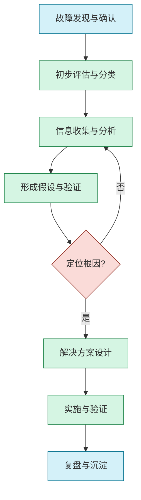

# 故障排查指南

## 1. 概述

故障排查是确保系统可靠性和用户体验的关键环节。本指南提供系统化的故障排查方法论、最佳实践和工具，帮助产研团队快速定位并解决各类技术问题，最大限度减少系统中断和用户影响。

### 1.1 基本原则

- **系统化方法**：采用结构化流程而非随机尝试
- **数据驱动**：基于监控数据和日志进行分析决策
- **根因思维**：追求发现并解决根本原因，而非仅处理表象
- **最小干预**：优先选择影响范围最小的解决方案
- **知识沉淀**：将排查经验转化为可复用知识

### 1.2 故障分类

| 类型 | 特征 | 例子 |
|------|------|------|
| 功能故障 | 特定功能不可用或错误 | 登录失败、数据提交错误 |
| 性能故障 | 系统响应缓慢或资源耗尽 | 页面加载慢、API超时 |
| 可靠性故障 | 系统不稳定或间歇性失败 | 随机崩溃、间歇连接断开 |
| 数据故障 | 数据不一致或损坏 | 数据丢失、状态不同步 |
| 安全故障 | 安全机制失效或被绕过 | 认证绕过、数据泄露 |

## 2. 故障排查流程

系统化的故障排查流程可提高效率并确保问题得到彻底解决：



### 2.1 故障发现与确认

**目标**：确认故障存在并获取初步信息

**步骤**：
1. 确认故障真实存在（排除误报）
2. 初步判断影响范围与严重程度
3. 记录故障首次发现时间与现象
4. 确定故障是否持续存在或间歇性发生
5. 快速确认是否为已知问题

**方法**：
- 复现测试：在不同环境下尝试复现问题
- 用户反馈分析：收集并分析多个用户报告
- 监控告警确认：验证系统告警的准确性
- 简单环境检查：确认基础设施状态

**工具**：
- 系统状态看板
- 用户反馈渠道
- 简单诊断脚本
- 基础监控告警

### 2.2 初步评估与分类

**目标**：评估故障影响并确定优先级

**步骤**：
1. 评估故障影响范围（用户比例、功能范围）
2. 判断业务影响严重程度（关键/非关键）
3. 确定故障类型（功能、性能、数据等）
4. 评估排查难度与预计解决时间
5. 确定是否需要启动应急响应流程

**评估维度**：
- **影响用户比例**：<1% / 1-10% / 10-50% / >50%
- **业务影响级别**：轻微 / 中度 / 严重 / 灾难性
- **故障可见性**：内部可见 / 部分用户可见 / 全部用户可见
- **持续时间风险**：短期 / 中期 / 长期 / 不确定

**优先级矩阵**：

| 影响范围 \ 严重程度 | 轻微 | 中度 | 严重 | 灾难性 |
|-----------------|------|------|------|--------|
| <1%用户         | P4   | P3   | P3   | P2     |
| 1-10%用户       | P3   | P3   | P2   | P1     |
| 10-50%用户      | P3   | P2   | P1   | P0     |
| >50%用户        | P2   | P1   | P0   | P0     |

### 2.3 信息收集与分析

**目标**：全面收集与分析可能相关的信息

**收集维度**：
- **时间维度**：故障前、故障中、类似时段的历史数据
- **空间维度**：不同服务、不同节点、不同区域
- **层次维度**：基础设施、中间件、应用、前端
- **关联维度**：依赖服务、外部系统、第三方接口

**关键信息来源**：
- 系统日志（应用日志、中间件日志、系统日志）
- 监控指标（资源使用、请求量、错误率、延迟）
- 分布式追踪数据（调用链路、服务依赖）
- 告警历史（同时段的相关告警）
- 配置变更记录（代码、配置、环境变更）
- 网络流量（流量模式、请求特征）
- 用户反馈（错误信息、复现步骤）

**分析方法**：
- **时间相关性分析**：将事件按时间线排序，寻找关联点
- **对比分析**：正常与异常状态的差异比较
- **模式识别**：识别错误日志或监控数据中的模式
- **依赖图分析**：构建并分析服务依赖关系
- **异常检测**：识别关键指标的异常变化

**工具示例**：
```bash
# 日志分析示例命令
grep "ERROR\|Exception\|FATAL" /var/log/application.log | tail -n 500 > /tmp/recent_errors.log

# 查找特定时间段的错误
sed -n '/2023-10-25 14:00:00/,/2023-10-25 15:00:00/p' /var/log/application.log | grep "ERROR"

# 提取关键指标
cat /var/log/application.log | grep "processing time:" | awk '{print $10}' > /tmp/processing_times.txt

# 分析HTTP错误状态码分布
cat /var/log/nginx/access.log | awk '{print $9}' | sort | uniq -c | sort -nr
```

### 2.4 形成假设与验证

**目标**：基于收集的信息形成可验证的故障假设

**假设形成方法**：
- 基于日志和错误信息的直接线索
- 基于系统变更历史的关联推断
- 基于架构知识的瓶颈推测
- 基于类似历史问题的经验套用
- 基于技术原理的底层分析

**假设优先级排序**：
1. 基于直接证据的假设
2. 近期发生变更相关的假设
3. 与观察到的症状高度匹配的假设
4. 最简单且容易验证的假设

**验证技术**：
- **日志增强**：添加临时日志以获取更多信息
- **复现测试**：在受控环境中尝试复现问题
- **对照实验**：对比正常与异常环境的差异
- **渐进式排除**：通过排除法缩小问题范围
- **组件隔离**：隔离特定组件测试其行为
- **流量镜像**：复制生产流量到测试环境分析

**验证工具示例**：
```bash
# 添加临时调试日志
sed -i 's/logger.debug/logger.info/g' src/main/java/com/example/service/OrderService.java

# 检查网络连通性
ping -c 5 database-server
telnet cache-server 6379

# 验证配置一致性
diff -u /etc/app/conf/production.conf /etc/app/conf/staging.conf

# 检查资源限制
ulimit -a
df -h
free -m
```

### 2.5 解决方案设计

**目标**：设计解决根因的有效方案，同时考虑风险和影响

**解决方案类型**：
- **紧急缓解方案**：快速恢复服务，不一定解决根因
- **临时解决方案**：解决当前问题，但可能需要后续改进
- **永久修复方案**：彻底解决根本原因的长期方案
- **预防性措施**：防止类似问题再次发生的改进

**方案评估维度**：
- **有效性**：解决问题的完整程度
- **实施风险**：可能导致的副作用或新问题
- **实施难度**：所需资源、时间和技术复杂度
- **可验证性**：效果是否可以明确验证
- **长期可持续性**：是否为长期有效的解决方案

**解决方案文档模板**：
```
问题概述：简要描述问题
根因分析：确定的根本原因
解决方案：
  - 方案描述：详细的解决步骤
  - 预期效果：预期达到的结果
  - 验证方法：如何验证解决效果
  - 风险评估：可能的副作用及缓解措施
  - 回滚计划：如果方案失败的撤回步骤
实施计划：
  - 实施时间：预计实施窗口
  - 资源需求：需要的人员和资源
  - 通知计划：需要告知的相关方
```

### 2.6 实施与验证

**目标**：安全实施解决方案并验证其效果

**实施最佳实践**：
- 确保有详细的实施计划和回滚方案
- 在非高峰期实施变更以减少影响
- 采用渐进式实施（如灰度发布）降低风险
- 保持清晰的沟通，确保所有相关方了解进展
- 全程记录实施过程和观察到的效果

**验证方法**：
- **功能验证**：确认故障现象已消失
- **性能验证**：测量关键性能指标是否恢复正常
- **持久性验证**：确认在不同条件下问题不会复现
- **负载测试**：在高负载下验证解决方案的稳定性
- **监控确认**：确认监控指标恢复正常

**验证示例**：
```
验证计划：数据库连接池优化
1. 基础功能测试：
   - 执行关键业务流程测试套件
   - 验证所有涉及数据库操作的API

2. 性能验证：
   - 测量数据库操作响应时间
   - 监控连接池使用率
   - 验证高并发下连接获取延迟

3. 稳定性验证：
   - 运行8小时持续负载测试
   - 模拟峰值流量下的系统表现
   - 监控内存使用与连接泄漏

4. 监控确认：
   - 确认连接超时告警不再触发
   - 验证数据库CPU使用率保持在阈值以下
   - 检查慢查询日志是否减少
```

### 2.7 复盘与沉淀

**目标**：从故障中学习并防止类似问题再次发生

**复盘维度**：
- **事件回顾**：故障发生、发现和解决的完整过程
- **根因分析**：导致问题的根本原因和贡献因素
- **响应评估**：响应和解决过程中的优缺点
- **预防措施**：如何防止类似问题再次发生
- **流程改进**：排查和解决流程中可以改进的地方

**知识沉淀内容**：
- 详细的故障案例文档
- 排查过程中有效的分析方法
- 可重用的诊断脚本和工具
- 架构或设计的改进建议
- 监控和告警的增强点

**故障复盘模板**：
```
故障复盘报告

基本信息：
  - 故障ID：FI-2023-0042
  - 发生时间：2023-10-25 14:30 UTC
  - 恢复时间：2023-10-25 16:45 UTC
  - 影响范围：支付服务，约15%用户受影响
  - 严重程度：P1

故障描述：
  - 现象：用户支付请求返回超时错误
  - 影响：部分订单无法完成支付流程
  - 初步症状：支付API响应时间增加，错误率上升

发现与响应：
  - 发现方式：监控告警（API错误率超过阈值）
  - 首次响应时间：5分钟
  - 定位根因时间：45分钟
  - 解决方案实施时间：30分钟
  - 验证与全面恢复时间：55分钟

根因分析：
  - 技术根因：数据库连接池配置不当，高峰期连接耗尽
  - 贡献因素：
    * 缺少连接池饱和度监控
    * 近期流量增长未进行容量规划调整
    * 连接泄漏导致可用连接减少

解决方案：
  - 临时方案：增加连接池最大连接数，重启应用服务
  - 永久方案：优化连接池配置，修复连接泄漏问题
  - 预防措施：添加连接池监控，实施自动扩缩容

经验教训：
  - 成功经验：快速识别连接池问题的日志分析方法
  - 改进机会：需要加强配置变更管理和容量规划
  - 监控增强：添加连接获取时间和排队监控

行动计划：
  - 添加连接池监控和告警（负责人：张三，1周内）
  - 优化数据库访问模式（负责人：李四，2周内）
  - 制定数据库容量规划流程（负责人：王五，1个月内）
  - 创建连接池问题诊断手册（负责人：赵六，2周内）
```

## 3. 常见故障排查方法

### 3.1 日志分析技术

**目标**：通过系统日志快速定位问题线索

**分析策略**：
1. **时间关联分析**：关注故障时间点前后的日志
2. **错误模式识别**：查找已知错误模式和异常堆栈
3. **异常频率分析**：识别异常日志出现频率的变化
4. **关联事件分析**：将不同系统的日志关联起来分析
5. **行为序列分析**：跟踪特定用户或请求的完整路径

**常用日志分析工具命令**：
```bash
# 基础日志查询
grep "Exception" /var/log/application.log | head -n 20

# 提取特定时间段的错误
awk '/2023-10-25T14:[0-9][0-9]/ && /ERROR/' /var/log/application.log

# 统计错误类型分布
grep -E "ERROR|WARN" /var/log/application.log | awk '{print $5}' | sort | uniq -c | sort -nr

# 提取JSON格式日志中的特定字段
grep "OrderService" /var/log/application.log | jq -r 'select(.level=="ERROR") | [.timestamp, .message] | @tsv'

# 分析错误趋势
grep "ERROR" /var/log/application.log | awk '{print $1,$2}' | cut -d'.' -f1 | uniq -c
```

**结构化日志分析**：
```python
# Python示例：分析JSON日志中的错误模式
import json
import pandas as pd
from datetime import datetime

errors = []
with open('/var/log/application.log', 'r') as f:
    for line in f:
        try:
            log = json.loads(line)
            if log.get('level') == 'ERROR':
                errors.append({
                    'timestamp': log.get('timestamp'),
                    'service': log.get('service'),
                    'message': log.get('message'),
                    'trace_id': log.get('trace_id')
                })
        except:
            continue

# 转换为DataFrame分析
df = pd.DataFrame(errors)
df['time'] = pd.to_datetime(df['timestamp'])

# 按时间段统计错误
hourly_errors = df.groupby(df['time'].dt.hour).size()
print("每小时错误分布:")
print(hourly_errors)

# 按服务分组统计
service_errors = df.groupby('service').size().sort_values(ascending=False)
print("\n各服务错误数:")
print(service_errors)
```

### 3.2 监控数据分析

**目标**：利用监控指标识别异常模式和关联性

**关键监控维度**：
- **资源使用**：CPU、内存、磁盘、网络
- **应用指标**：请求率、错误率、延迟、饱和度
- **业务指标**：转化率、会话数、活跃用户
- **依赖服务**：外部API调用成功率、响应时间
- **系统事件**：重启、部署、配置变更

**分析技术**：
1. **趋势偏离检测**：发现指标突然偏离正常趋势
2. **相关性分析**：寻找多个指标间的关联变化
3. **阈值突破分析**：指标超出正常范围的时间点
4. **对比分析**：与历史同期数据或不同环境对比
5. **周期性变化**：识别异常的周期性模式变化

**指标关联分析示例**：
```python
# Python示例：分析CPU使用率与响应时间的相关性
import pandas as pd
import matplotlib.pyplot as plt
import numpy as np
from scipy.stats import pearson

# 加载监控数据
metrics = pd.read_csv('monitor_data.csv', parse_dates=['timestamp'])

# 计算移动平均平滑数据
metrics['cpu_ma'] = metrics['cpu_usage'].rolling(window=10).mean()
metrics['response_ma'] = metrics['response_time'].rolling(window=10).mean()

# 计算相关性
correlation = pearson(
    metrics['cpu_ma'].dropna(), 
    metrics['response_ma'].dropna()
)[0]

print(f"CPU使用率与响应时间相关系数: {correlation:.2f}")

# 可视化分析
plt.figure(figsize=(12, 6))
plt.subplot(2, 1, 1)
plt.plot(metrics['timestamp'], metrics['cpu_usage'], 'b-', alpha=0.3)
plt.plot(metrics['timestamp'], metrics['cpu_ma'], 'b-', linewidth=2)
plt.title(f'CPU使用率与响应时间 (相关系数: {correlation:.2f})')
plt.ylabel('CPU使用率 (%)')

plt.subplot(2, 1, 2)
plt.plot(metrics['timestamp'], metrics['response_time'], 'r-', alpha=0.3)
plt.plot(metrics['timestamp'], metrics['response_ma'], 'r-', linewidth=2)
plt.ylabel('响应时间 (ms)')
plt.xlabel('时间')

# 标记异常点
threshold = metrics['response_ma'].mean() + 2 * metrics['response_ma'].std()
anomalies = metrics[metrics['response_ma'] > threshold]
plt.plot(anomalies['timestamp'], anomalies['response_ma'], 'ro')

plt.tight_layout()
plt.savefig('correlation_analysis.png')
```

### 3.3 分布式追踪分析

**目标**：通过调用链路追踪定位分布式系统中的问题

**分析维度**：
- **端到端延迟**：请求的完整处理时间
- **组件贡献**：各服务对总延迟的贡献
- **调用关系**：服务间的依赖和调用模式
- **错误传播**：错误如何在系统中传播
- **资源争用**：共享资源的竞争情况

**追踪数据分析方法**：
1. **性能热点分析**：识别耗时最长的服务和操作
2. **异常路径分析**：寻找包含错误或异常的调用路径
3. **依赖拓扑分析**：构建并分析服务依赖图
4. **服务间延迟分析**：评估服务间通信的延迟
5. **异常模式识别**：识别与正常模式不同的调用模式

**Jaeger查询示例**：
```
# 基于服务名和操作名查询追踪
service=order-service operation=createOrder limit=20

# 查询特定时间范围内的慢查询
service=order-service minDuration=1s start=2023-10-25T14:00:00Z end=2023-10-25T15:00:00Z

# 带有特定标签的追踪
service=order-service tag=error:true

# 使用span属性过滤
service=payment-service tag=http.status_code:500
```

**追踪分析脚本示例**：
```python
# Python示例：分析Jaeger导出的追踪数据
import json
import pandas as pd
from collections import defaultdict

with open('traces.json', 'r') as f:
    traces = json.load(f)

# 提取每个span的信息
spans = []
for trace in traces['data']:
    trace_id = trace['traceID']
    for span in trace['spans']:
        spans.append({
            'trace_id': trace_id,
            'span_id': span['spanID'],
            'parent_id': span.get('references', [{}])[0].get('spanID', ''),
            'service': span['process']['serviceName'],
            'operation': span['operationName'],
            'start_time': span['startTime'],
            'duration': span['duration'],
            'status_code': next((tag['value'] for tag in span['tags'] 
                              if tag['key'] == 'http.status_code'), None),
            'error': any(tag['key'] == 'error' and tag['value'] == True 
                       for tag in span['tags'])
        })

# 转换为DataFrame分析
df = pd.DataFrame(spans)

# 服务级别分析
service_stats = df.groupby('service').agg({
    'duration': ['mean', 'median', 'min', 'max', 'count'],
    'error': 'sum'
}).reset_index()

print("服务级别性能统计:")
print(service_stats)

# 错误路径分析
error_traces = df[df['error'] == True]['trace_id'].unique()
error_paths = defaultdict(int)

for trace_id in error_traces:
    trace_spans = df[df['trace_id'] == trace_id].sort_values('start_time')
    path = ' -> '.join(trace_spans['service'] + ':' + trace_spans['operation'])
    error_paths[path] += 1

print("\n常见错误路径:")
for path, count in sorted(error_paths.items(), key=lambda x: x[1], reverse=True)[:5]:
    print(f"{count}: {path}")
```

### 3.4 资源利用分析

**目标**：通过资源使用分析识别性能瓶颈和资源争用

**关键资源指标**：
- **CPU**：使用率、上下文切换、运行队列
- **内存**：使用率、交换活动、分页、内存泄漏
- **磁盘**：IOPS、吞吐量、延迟、空间使用
- **网络**：带宽、包丢失、连接状态、TCP重传
- **数据库**：连接数、锁争用、缓存命中率、查询性能

**分析方法**：
1. **饱和度分析**：识别接近或达到容量上限的资源
2. **利用率模式**：分析资源使用的时间模式和变化
3. **竞争识别**：发现多个进程争用同一资源的情况
4. **异常行为检测**：识别不符合历史模式的资源使用
5. **瓶颈转移分析**：理解一个瓶颈解决后下一个可能出现的瓶颈

**Linux性能分析命令**：
```bash
# CPU使用情况分析
top -b -n 1
mpstat -P ALL 1 5
pidstat -u 1 5

# 内存使用分析
free -m
vmstat 1 5
smem -tk

# 磁盘性能分析
iostat -xz 1 5
iotop -b -n 2
df -h

# 网络性能分析
netstat -s
ss -stat
iftop -t -s 5

# 进程资源使用
ps aux --sort=-%cpu | head -10
pstree -p $(pgrep java)
strace -p <pid> -c
```

**资源利用分析脚本**：
```python
# Python示例：分析系统资源使用趋势
import pandas as pd
import numpy as np
import matplotlib.pyplot as plt
from datetime import datetime, timedelta

# 加载资源使用数据
resource_data = pd.read_csv('system_metrics.csv', 
                           parse_dates=['timestamp'])

# 计算主要资源的使用率
resources = ['cpu', 'memory', 'disk_io', 'network']
fig, axes = plt.subplots(len(resources), 1, figsize=(12, 3*len(resources)))

# 计算每个资源的饱和点
saturation = {
    'cpu': 85,  # CPU超过85%认为接近饱和
    'memory': 90,  # 内存超过90%认为接近饱和
    'disk_io': 80,  # 磁盘IO超过80%认为接近饱和
    'network': 75,  # 网络带宽超过75%认为接近饱和
}

for i, resource in enumerate(resources):
    # 计算移动平均
    resource_data[f'{resource}_ma'] = resource_data[resource].rolling(window=20).mean()
    
    # 绘制资源使用趋势
    axes[i].plot(resource_data['timestamp'], resource_data[resource], 
                alpha=0.3, color='blue')
    axes[i].plot(resource_data['timestamp'], resource_data[f'{resource}_ma'], 
                linewidth=2, color='blue')
    
    # 标记饱和区域
    axes[i].axhline(y=saturation[resource], color='r', linestyle='--', 
                   label=f'饱和阈值 ({saturation[resource]}%)')
    
    # 标记超过饱和点的区域
    saturation_points = resource_data[resource_data[resource] > saturation[resource]]
    if not saturation_points.empty:
        axes[i].fill_between(saturation_points['timestamp'], 
                            saturation_points[resource], 
                            saturation[resource],
                            color='red', alpha=0.3)
    
    axes[i].set_title(f'{resource.upper()} 使用率')
    axes[i].set_ylabel('使用率 (%)')
    axes[i].set_ylim(0, 105)
    axes[i].legend()

axes[-1].set_xlabel('时间')
plt.tight_layout()
plt.savefig('resource_utilization.png')

# 识别资源使用的相关性
correlation_matrix = resource_data[resources].corr()
print("资源使用相关性矩阵:")
print(correlation_matrix)

# 识别资源瓶颈转移
bottleneck_periods = []
current_bottleneck = None
threshold_duration = timedelta(minutes=5)

for resource in resources:
    # 找出超过阈值的连续时间段
    over_threshold = resource_data[resource] > saturation[resource]
    if over_threshold.any():
        start_idx = None
        for i, is_over in enumerate(over_threshold):
            if is_over and start_idx is None:
                start_idx = i
            elif not is_over and start_idx is not None:
                end_idx = i - 1
                duration = resource_data.iloc[end_idx]['timestamp'] - \
                           resource_data.iloc[start_idx]['timestamp']
                if duration >= threshold_duration:
                    bottleneck_periods.append({
                        'resource': resource,
                        'start': resource_data.iloc[start_idx]['timestamp'],
                        'end': resource_data.iloc[end_idx]['timestamp'],
                        'duration': duration
                    })
                start_idx = None

print("\n检测到的资源瓶颈期:")
for period in sorted(bottleneck_periods, key=lambda x: x['start']):
    print(f"{period['resource']}: {period['start']} 到 {period['end']} "
          f"(持续 {period['duration']})")
```

### 3.5 网络故障分析

**目标**：定位和解决网络连接、通信和配置问题

**常见网络问题类型**：
- **连接性问题**：无法建立连接或连接中断
- **延迟问题**：网络延迟异常增加
- **吞吐量问题**：带宽利用不足或拥塞
- **数据包丢失**：通信中的数据包丢失
- **DNS问题**：域名解析失败或不正确
- **路由问题**：网络路由配置错误或失效

**网络分析工具**：
```bash
# 基本连通性测试
ping -c 5 target-host
traceroute target-host
mtr -n target-host

# DNS诊断
dig +trace example.com
host -v example.com
nslookup -debug example.com

# 端口和服务测试
netstat -tuln
nc -zv host port
telnet host port

# HTTP/HTTPS诊断
curl -v https://example.com
wget --spider --timeout=10 https://example.com

# TCP连接分析
ss -tan state established
netstat -np | grep <pid>

# 网络性能测试
iperf3 -c server -P 3
```

**网络故障排查流程**：
1. **确认连通性**：验证基本网络连接是否工作
2. **路径分析**：跟踪数据包从源到目的地的路径
3. **协议分析**：检查网络协议的正确功能
4. **配置验证**：验证网络配置的正确性
5. **性能测量**：测量网络性能指标

**微服务网络问题分析**：
```bash
# 服务发现检查
curl http://service-registry:8500/v1/catalog/services
dig +short service-name.service.consul

# API网关连接检查
curl -v http://api-gateway/health
tcpdump -i any port 8080 -n

# gRPC连接诊断
grpc_cli ls server-address
grpcurl -plaintext server-address list

# 服务网格诊断
istioctl analyze
kubectl exec -it $POD -- pilot-agent request GET stats | grep upstream
```

## 4. 专项故障排查指南

### 4.1 数据库性能问题

**常见数据库问题**：
- **慢查询**：执行时间异常长的查询
- **连接问题**：连接池配置不当或连接泄漏
- **锁争用**：事务锁定导致其他操作等待
- **索引问题**：缺少索引或索引使用不当
- **资源耗尽**：CPU、内存或I/O资源不足

**排查步骤**：
1. **查询性能分析**：
   - 识别慢查询及其模式
   - 检查执行计划寻找优化机会
   - 分析索引使用情况
   - 检查表统计信息是否最新

2. **连接管理分析**：
   - 监控活动连接数和状态
   - 检查连接池配置和使用情况
   - 识别长时间运行的事务和会话
   - 分析连接来源和分布

3. **锁和等待分析**：
   - 识别锁争用和等待事件
   - 分析阻塞事务和被阻塞事务
   - 检查死锁历史和模式
   - 优化事务隔离级别和范围

4. **资源使用分析**：
   - 监控数据库服务器CPU和内存使用
   - 检查磁盘I/O性能和使用模式
   - 分析缓存命中率和效率
   - 评估并发和负载能力

**MySQL/PostgreSQL诊断命令**：
```sql
-- 查看当前活动连接
SHOW PROCESSLIST;  -- MySQL
SELECT * FROM pg_stat_activity;  -- PostgreSQL

-- 识别慢查询
SELECT * FROM performance_schema.events_statements_summary_by_digest 
ORDER BY sum_timer_wait DESC LIMIT 10;  -- MySQL
SELECT query, calls, total_time, mean_time 
FROM pg_stat_statements 
ORDER BY total_time DESC LIMIT 10;  -- PostgreSQL

-- 分析锁争用
SELECT * FROM performance_schema.data_locks;  -- MySQL
SELECT relation::regclass, mode, granted, pid, age(now(), query_start) 
FROM pg_locks l JOIN pg_stat_activity a ON l.pid = a.pid 
WHERE NOT granted;  -- PostgreSQL

-- 检查索引使用情况
SHOW INDEX FROM table_name;  -- MySQL
SELECT indexrelname, idx_scan, idx_tup_read, idx_tup_fetch 
FROM pg_stat_user_indexes 
WHERE schemaname = 'public' 
ORDER BY idx_scan DESC;  -- PostgreSQL
```

**数据库性能优化建议**：
1. **查询优化**：
   - 重写复杂查询，避免全表扫描
   - 添加或优化索引
   - 使用查询缓存
   - 适当拆分大查询

2. **连接优化**：
   - 正确配置连接池参数
   - 防止连接泄漏
   - 实现连接复用
   - 设置合理的超时时间

3. **架构优化**：
   - 实施读写分离
   - 考虑分库分表
   - 使用合适的缓存策略
   - 优化数据库配置参数

### 4.2 内存相关问题

**常见内存问题**：
- **内存泄漏**：应用未释放不再使用的内存
- **过度分配**：分配超过可用物理内存
- **碎片化**：内存碎片导致分配效率低下
- **垃圾回收问题**：GC效率低下或暂停时间长
- **缓存配置不当**：缓存大小或策略不合理

**排查步骤**：
1. **内存使用分析**：
   - 监控进程内存使用趋势
   - 区分堆内存、栈内存和本机内存
   - 分析内存分配和释放模式
   - 识别异常的内存增长

2. **泄漏检测**：
   - 采集并分析内存转储
   - 跟踪对象引用和生命周期
   - 识别增长但未释放的对象集合
   - 分析长生命周期对象

3. **垃圾回收分析**：
   - 收集并分析GC日志
   - 评估GC频率和持续时间
   - 监控各代内存使用和回收效率
   - 调优GC参数和策略

4. **内存压力测试**：
   - 在受控环境中模拟高内存负载
   - 观察内存使用和释放行为
   - 测试OOM（内存不足）处理机制
   - 验证内存限制配置

**Java内存分析工具命令**：
```bash
# 显示JVM内存使用情况
jmap -heap <pid>

# 生成堆转储
jmap -dump:format=b,file=heap.hprof <pid>

# 查看堆中对象分布
jmap -histo <pid> | head -20

# 查看GC统计信息
jstat -gcutil <pid> 1000 10

# 打印GC详细日志(JVM参数)
-XX:+PrintGCDetails -

```markdown:docs/diagnostics/troubleshooting.md
XX:+PrintGCTimeStamps -Xloggc:gc.log
```

**内存问题解决建议**：
1. **内存泄漏修复**：
   - 识别并修复未关闭的资源
   - 检查长期缓存和集合的使用
   - 修复对象引用管理问题
   - 实现适当的资源释放机制

2. **内存使用优化**：
   - 优化对象创建和复用
   - 减少不必要的对象分配
   - 使用内存高效的数据结构
   - 适当使用对象池

3. **GC优化**：
   - 选择适合应用特性的GC算法
   - 调整堆大小和代空间比例
   - 减少长GC暂停的影响
   - 实施增量式垃圾回收

**Node.js内存分析示例**：
```javascript
// 使用process.memoryUsage()监控内存
const memoryLogger = setInterval(() => {
  const memUsage = process.memoryUsage();
  console.log({
    rss: `${Math.round(memUsage.rss / 1024 / 1024)} MB`,    // 进程总内存
    heapTotal: `${Math.round(memUsage.heapTotal / 1024 / 1024)} MB`,  // 堆总大小
    heapUsed: `${Math.round(memUsage.heapUsed / 1024 / 1024)} MB`,    // 已用堆大小
    external: `${Math.round(memUsage.external / 1024 / 1024)} MB`,    // 外部内存
    time: new Date().toISOString()
  });
}, 10000);

// 生成堆快照
const heapdump = require('heapdump');
function saveHeapSnapshot() {
  const filename = `heapsnapshot-${Date.now()}.heapsnapshot`;
  heapdump.writeSnapshot(filename, (err, filename) => {
    console.log(`Heap snapshot saved to ${filename}`);
  });
}

// 模拟内存泄漏检测和修复
class MemoryLeakChecker {
  constructor(thresholdMB = 100, intervalMs = 30000) {
    this.thresholdBytes = thresholdMB * 1024 * 1024;
    this.intervalMs = intervalMs;
    this.lastHeapUsed = 0;
    this.checkCount = 0;
    this.continualGrowthCount = 0;
  }
  
  start() {
    this.timerId = setInterval(() => this.check(), this.intervalMs);
    console.log('Memory leak checker started');
  }
  
  check() {
    const memUsage = process.memoryUsage();
    const currentHeapUsed = memUsage.heapUsed;
    this.checkCount++;
    
    console.log(`[MemCheck #${this.checkCount}] Heap usage: ${Math.round(currentHeapUsed / 1024 / 1024)} MB`);
    
    if (currentHeapUsed > this.lastHeapUsed) {
      this.continualGrowthCount++;
      console.log(`[MemCheck] Heap grew for ${this.continualGrowthCount} consecutive checks`);
      
      if (this.continualGrowthCount >= 5) {
        console.warn('[MemCheck] Possible memory leak detected!');
        saveHeapSnapshot();
      }
    } else {
      this.continualGrowthCount = 0;
    }
    
    this.lastHeapUsed = currentHeapUsed;
  }
  
  stop() {
    clearInterval(this.timerId);
    console.log('Memory leak checker stopped');
  }
}

// 使用内存泄漏检测器
const leakChecker = new MemoryLeakChecker();
leakChecker.start();
```

### 4.3 CPU与线程问题

**常见CPU与线程问题**：
- **CPU使用率高**：进程占用过多CPU资源
- **线程阻塞**：线程被锁或I/O操作阻塞
- **死锁**：多个线程互相等待资源造成永久阻塞
- **线程池配置不当**：线程数量不足或过多
- **竞态条件**：多线程并发访问共享资源引发问题

**排查步骤**：
1. **CPU使用情况分析**：
   - 识别高CPU使用进程和线程
   - 区分用户CPU时间和系统CPU时间
   - 分析CPU使用随时间的变化
   - 检查核心亲和性和使用分布

2. **线程状态分析**：
   - 获取线程转储并分析线程状态
   - 识别阻塞、等待和运行线程
   - 查找锁争用和等待资源模式
   - 分析线程栈信息寻找热点方法

3. **死锁检测**：
   - 分析线程之间的资源依赖关系
   - 识别环形等待条件
   - 查找获取锁但未释放的线程
   - 验证锁获取顺序和策略

4. **线程池分析**：
   - 监控线程池使用情况和队列
   - 评估线程池大小与工作负载匹配度
   - 分析任务执行时间和分布
   - 检查任务拒绝和超时情况

**线程分析工具命令**：
```bash
# Linux进程和线程分析
top -H -p <pid>
ps -eLo pid,tid,pcpu,pmem,state,comm | grep <pid>
pstack <pid>

# Java线程分析
jstack <pid> > threads.log
jcmd <pid> Thread.print
jcmd <pid> GC.heap_dump filename=heap.hprof

# Thread dump分析脚本示例
grep "blocked" threads.log -A 2 -B 2
grep -A 50 "BLOCKED" threads.log | grep -m 1 -B 50 "waiting on" 
```

**线程转储分析示例**：
```python
# Python脚本：分析Java线程转储
import re
import collections

def parse_thread_dump(file_path):
    with open(file_path, 'r') as f:
        content = f.read()
    
    # 提取线程信息
    thread_pattern = r'"([^"]+)"[^"]+tid=([0-9a-fx,]+)[^"]+nid=([0-9a-fx,]+) ([^\n]+)'
    threads = re.findall(thread_pattern, content)
    
    # 提取线程状态
    states = {}
    state_pattern = r'"([^"]+)".*? state=([A-Z_]+)'
    for match in re.finditer(state_pattern, content):
        states[match.group(1)] = match.group(2)
    
    # 提取锁信息
    locks = {}
    lock_pattern = r'"([^"]+)".*?locked <([0-9a-fx]+)>'
    for match in re.finditer(lock_pattern, content):
        thread_name = match.group(1)
        lock_id = match.group(2)
        if thread_name not in locks:
            locks[thread_name] = []
        locks[thread_name].append(lock_id)
    
    # 提取等待信息
    waiting = {}
    wait_pattern = r'"([^"]+)".*?waiting (on|to lock) <([0-9a-fx]+)>'
    for match in re.finditer(wait_pattern, content):
        thread_name = match.group(1)
        lock_id = match.group(3)
        if lock_id not in waiting:
            waiting[lock_id] = []
        waiting[lock_id].append(thread_name)
    
    # 分析结果
    results = {
        'thread_count': len(threads),
        'state_summary': collections.Counter(states.values()),
        'locks': locks,
        'waiting': waiting,
    }
    
    # 检测死锁
    deadlocks = []
    for thread_name, thread_locks in locks.items():
        for lock_id in thread_locks:
            if lock_id in waiting:
                for waiting_thread in waiting[lock_id]:
                    if waiting_thread in locks:
                        for waiting_thread_lock in locks[waiting_thread]:
                            if thread_name in waiting.get(waiting_thread_lock, []):
                                deadlocks.append((thread_name, waiting_thread))
    
    results['deadlocks'] = deadlocks
    
    return results

# 使用示例
if __name__ == "__main__":
    analysis = parse_thread_dump("threads.log")
    
    print(f"总线程数: {analysis['thread_count']}")
    print("线程状态分布:")
    for state, count in analysis['state_summary'].items():
        print(f"  {state}: {count}")
    
    if analysis['deadlocks']:
        print("\n检测到可能的死锁:")
        for t1, t2 in analysis['deadlocks']:
            print(f"  线程 '{t1}' 和 '{t2}' 之间可能存在死锁")
    
    print("\n占用最多锁的线程:")
    lock_counts = [(name, len(locks)) for name, locks in analysis['locks'].items()]
    for name, count in sorted(lock_counts, key=lambda x: x[1], reverse=True)[:5]:
        print(f"  {name}: {count} 锁")
    
    print("\n等待线程最多的锁:")
    wait_counts = [(lock_id, len(threads)) for lock_id, threads in analysis['waiting'].items()]
    for lock_id, count in sorted(wait_counts, key=lambda x: x[1], reverse=True)[:5]:
        print(f"  锁 {lock_id}: {count} 个线程在等待")
```

**CPU问题解决建议**：
1. **代码级优化**：
   - 优化热点方法和代码路径
   - 减少不必要的计算和操作
   - 使用更高效的算法和数据结构
   - 避免过度使用递归和循环

2. **线程管理优化**：
   - 优化线程池大小和策略
   - 减少线程上下文切换
   - 使用非阻塞I/O和异步处理
   - 避免细粒度锁导致的争用

3. **架构级优化**：
   - 实现计算任务横向扩展
   - 使用异步处理和消息队列
   - 考虑使用批处理减少单次处理开销
   - 实施服务降级和过载保护机制

### 4.4 缓存相关问题

**常见缓存问题**：
- **缓存失效**：缓存数据未正确更新或过期
- **缓存穿透**：大量请求未命中缓存直接访问数据库
- **缓存雪崩**：大量缓存同时失效导致系统压力激增
- **数据不一致**：缓存与数据源数据不同步
- **内存压力**：缓存占用过多内存资源

**排查步骤**：
1. **缓存命中率分析**：
   - 监控并分析缓存命中率变化
   - 识别低命中率的键或模式
   - 评估缓存失效策略有效性
   - 分析缓存使用和数据访问模式

2. **缓存数据验证**：
   - 对比缓存数据与数据源数据
   - 检查缓存更新机制是否正常
   - 验证缓存序列化和反序列化
   - 分析缓存数据生命周期

3. **缓存配置分析**：
   - 评估缓存大小和内存使用情况
   - 检查过期策略和驱逐算法
   - 分析分布式缓存同步机制
   - 评估缓存拓扑和网络延迟

4. **缓存性能测试**：
   - 测量缓存读写性能
   - 模拟高并发下的缓存行为
   - 测试故障场景下的系统弹性
   - 评估不同缓存策略的效果

**Redis缓存分析命令**：
```bash
# 查看Redis内存使用情况
redis-cli info memory

# 分析键的分布和类型
redis-cli --scan --pattern "user:*" | wc -l
redis-cli --scan --pattern "user:*" | head -10 | xargs -L 1 redis-cli type

# 查找大键
redis-cli --bigkeys

# 查看键过期情况
redis-cli --scan | xargs -L 100 redis-cli ttl | sort -n | uniq -c

# 监控命中率
redis-cli info stats | grep hit_rate

# 查看客户端连接
redis-cli client list | wc -l
redis-cli info clients
```

**缓存问题解决建议**：
1. **缓存策略优化**：
   - 实施多级缓存策略
   - 优化缓存键设计和数据结构
   - 使用合理的TTL和过期策略
   - 实施预热和按需加载机制

2. **缓存一致性优化**：
   - 实施写模式选择(Cache-Aside/Read-Through)
   - 优化缓存更新机制
   - 使用版本号或时间戳控制
   - 实现最终一致性机制

3. **缓存可靠性提升**：
   - 实施缓存高可用架构
   - 使用降级和熔断机制
   - 防止缓存穿透和雪崩
   - 实现热点数据保护

**缓存代码优化示例**：
```java
// 优化前：简单缓存实现，存在缓存穿透风险
public User getUserById(String userId) {
    // 尝试从缓存获取
    User cachedUser = (User) cache.get("user:" + userId);
    if (cachedUser != null) {
        return cachedUser;
    }
    
    // 缓存未命中，从数据库查询
    User user = userRepository.findById(userId);
    if (user != null) {
        cache.put("user:" + userId, user, CACHE_EXPIRY_SECONDS);
    }
    
    return user;
}

// 优化后：防止缓存穿透，使用空对象缓存和布隆过滤器
public User getUserById(String userId) {
    // 检查布隆过滤器，快速判断ID是否可能存在
    if (!userBloomFilter.mightContain(userId)) {
        return null; // ID一定不存在，避免查询
    }
    
    String cacheKey = "user:" + userId;
    
    // 尝试从缓存获取
    CacheValue<User> cachedValue = (CacheValue<User>) cache.get(cacheKey);
    if (cachedValue != null) {
        // 返回缓存的用户对象，即使是空值也返回
        return cachedValue.getValue(); // 可能为null
    }
    
    // 使用分布式锁防止缓存击穿
    try (AutoReleaseLock lock = lockManager.acquireLock("lock:" + cacheKey, 1000)) {
        if (lock.isAcquired()) {
            // 获取锁后再次检查缓存，避免重复加载
            cachedValue = (CacheValue<User>) cache.get(cacheKey);
            if (cachedValue != null) {
                return cachedValue.getValue();
            }
            
            // 从数据库查询
            User user = userRepository.findById(userId);
            
            // 无论用户是否存在都缓存结果，但使用不同的过期时间
            if (user != null) {
                cache.put(cacheKey, new CacheValue<>(user), CACHE_EXPIRY_SECONDS);
            } else {
                // 缓存空值，但使用较短的过期时间，避免长时间占用内存
                cache.put(cacheKey, new CacheValue<>(null), NEGATIVE_CACHE_EXPIRY_SECONDS);
            }
            
            return user;
        } else {
            // 未获取到锁，表示其他线程正在加载，短暂等待后重试
            Thread.sleep(50);
            return getUserById(userId);
        }
    } catch (InterruptedException e) {
        Thread.currentThread().interrupt();
        throw new RuntimeException("Failed to get user", e);
    }
}

// 缓存值包装类，允许缓存null值
class CacheValue<T> implements Serializable {
    private final T value;
    
    public CacheValue(T value) {
        this.value = value;
    }
    
    public T getValue() {
        return value;
    }
}
```

### 4.5 API与微服务问题

**常见API与微服务问题**：
- **服务不可用**：服务实例宕机或无法访问
- **超时问题**：服务响应时间过长导致调用超时
- **限流熔断**：达到流量限制或触发熔断机制
- **版本不兼容**：API契约变更导致调用失败
- **级联故障**：依赖服务故障导致连锁反应

**排查步骤**：
1. **服务可用性检查**：
   - 验证服务实例健康状态
   - 检查服务发现与注册状态
   - 测试服务端点的基本访问
   - 验证网络连接和防火墙规则

2. **调用链路分析**：
   - 收集并分析分布式追踪数据
   - 识别性能瓶颈和错误源
   - 检查服务依赖图和调用顺序
   - 分析错误传播和处理模式

3. **容错机制分析**：
   - 检查熔断器状态和配置
   - 验证降级逻辑和返回结果
   - 分析重试机制和策略
   - 评估超时设置的合理性

4. **负载与容量分析**：
   - 监控服务实例的负载分布
   - 评估资源使用和容量限制
   - 分析流量模式和峰值处理
   - 检查自动扩缩容机制

**微服务诊断命令**：
```bash
# 服务健康检查
curl -i http://service-host:port/actuator/health
curl -i http://service-host:port/metrics

# Kubernetes服务状态检查
kubectl get pods -l app=service-name
kubectl describe pod <pod-name>
kubectl logs <pod-name> -c <container-name> --tail=100

# 服务调用测试
curl -v -X POST http://api-gateway/service-path \
  -H "Content-Type: application/json" \
  -d '{"key": "value"}'

# 网络连接测试
nc -zv service-host port
curl -v telnet://service-host:port
```

**微服务弹性模式示例**：
```java
// 使用断路器模式处理服务调用
@HystrixCommand(
    fallbackMethod = "getProductFallback",
    commandProperties = {
        @HystrixProperty(name = "execution.isolation.thread.timeoutInMilliseconds", value = "500"),
        @HystrixProperty(name = "circuitBreaker.requestVolumeThreshold", value = "20"),
        @HystrixProperty(name = "circuitBreaker.errorThresholdPercentage", value = "50"),
        @HystrixProperty(name = "circuitBreaker.sleepWindowInMilliseconds", value = "5000")
    }
)
public Product getProduct(String productId) {
    return productClient.getProduct(productId);
}

// 降级方法
public Product getProductFallback(String productId, Throwable e) {
    log.warn("Product service call failed, using fallback for product {}: {}", 
             productId, e.getMessage());

    // 从缓存获取旧数据
    Product cachedProduct = productCache.getIfPresent(productId);
    if (cachedProduct != null) {
        return cachedProduct;
    }
    
    // 返回默认产品数据
    return Product.builder()
        .id(productId)
        .name("Temporary Product")
        .description("Product data temporarily unavailable")
        .price(0)
        .available(false)
        .build();
}

// 使用舱壁模式隔离服务调用
@HystrixCommand(
    fallbackMethod = "getOrderHistoryFallback",
    threadPoolKey = "orderServicePool",
    threadPoolProperties = {
        @HystrixProperty(name = "coreSize", value = "30"),
        @HystrixProperty(name = "maxQueueSize", value = "10")
    }
)
public List<Order> getOrderHistory(String userId) {
    return orderClient.getOrderHistory(userId);
}

// 实现重试机制
@Retryable(
    value = { ServiceException.class },
    maxAttempts = 3,
    backoff = @Backoff(delay = 1000, multiplier = 2)
)
public Payment processPayment(PaymentRequest request) {
    return paymentClient.processPayment(request);
}

// API版本兼容性处理
@RequestMapping(
    value = "/api/products/{id}",
    produces = { "application/vnd.company.app-v1+json", "application/json" }
)
public ResponseEntity<ProductResponseV1> getProductV1(@PathVariable String id) {
    Product product = productService.getProduct(id);
    return ResponseEntity.ok(productMapper.toV1Response(product));
}

@RequestMapping(
    value = "/api/products/{id}",
    produces = { "application/vnd.company.app-v2+json" }
)
public ResponseEntity<ProductResponseV2> getProductV2(@PathVariable String id) {
    Product product = productService.getProduct(id);
    return ResponseEntity.ok(productMapper.toV2Response(product));
}
```

## 5. 工具与资源

### 5.1 诊断工具清单

**系统级工具**：
| 工具 | 用途 | 适用平台 | 命令示例 |
|------|------|----------|---------|
| top | 实时系统资源监控 | Linux/Unix | `top -c` |
| htop | 增强版系统监控 | Linux/Unix | `htop` |
| vmstat | 系统资源统计 | Linux/Unix | `vmstat 1 5` |
| iostat | 硬盘I/O监控 | Linux/Unix | `iostat -xz 1` |
| netstat | 网络连接监控 | 跨平台 | `netstat -tuln` |
| ss | 套接字统计 | Linux | `ss -tanp` |
| tcpdump | 网络数据包分析 | Linux/Unix | `tcpdump -i eth0 port 80` |
| strace | 系统调用跟踪 | Linux | `strace -p <pid>` |
| lsof | 打开文件列表 | Linux/Unix | `lsof -p <pid>` |
| dstat | 系统资源统计 | Linux | `dstat -cdngy 5` |

**应用级工具**：
| 工具 | 用途 | 适用技术 | 说明 |
|------|------|----------|------|
| jstack | Java线程转储 | Java | 分析线程状态和栈信息 |
| jmap | Java内存转储 | Java | 分析堆内存使用情况 |
| jstat | JVM统计监控 | Java | 监控GC和类加载 |
| Arthas | Java诊断工具 | Java | 全面的运行时分析 |
| pprof | 性能分析工具 | Go | CPU和内存分析 |
| gdb | 代码级调试器 | C/C++ | 运行时调试和分析 |
| lldb | 代码级调试器 | C/C++/Swift | Apple平台调试 |
| node-heapdump | 内存转储工具 | Node.js | 分析V8堆内存 |
| dotnet-trace | .NET追踪工具 | .NET | 收集运行时诊断数据 |
| XDebug | PHP调试分析 | PHP | 性能分析和调试 |

**监控与可观测性工具**：
| 工具 | 主要功能 | 特点 |
|------|---------|------|
| Prometheus | 指标收集与告警 | 强大的查询语言和生态系统 |
| Grafana | 数据可视化 | 支持多数据源的仪表板 |
| ELK Stack | 日志收集与分析 | 强大的日志搜索和可视化 |
| Jaeger | 分布式追踪 | OpenTelemetry兼容追踪系统 |
| Zipkin | 分布式追踪 | 轻量级追踪系统 |
| New Relic | APM与监控 | 全栈监控和性能分析 |
| Datadog | 云监控 | 广泛的集成和可视化 |
| SigNoz | 全栈可观测性 | 开源可观测性平台 |

### 5.2 诊断脚本库

**系统资源检查脚本**：
```bash
#!/bin/bash
# system_health_check.sh - 系统健康状态检查脚本

echo "============ 系统健康检查 ============"
echo "检查时间: $(date)"
echo 

echo "1. 系统负载情况:"
uptime
echo 

echo "2. CPU使用情况:"
top -bn1 | head -20
echo 

echo "3. 内存使用情况:"
free -m
echo 

echo "4. 磁盘使用情况:"
df -h
echo 

echo "5. 最消耗CPU的进程:"
ps -eo pid,ppid,cmd,%cpu,%mem --sort=-%cpu | head -10
echo 

echo "6. 最消耗内存的进程:"
ps -eo pid,ppid,cmd,%cpu,%mem --sort=-%mem | head -10
echo 

echo "7. 网络连接状态:"
netstat -tunlp | grep LISTEN
echo 

echo "8. 最近的系统错误日志:"
dmesg | tail -20
echo 

echo "9. 打开文件数最多的进程:"
lsof | awk '{print $2}' | sort | uniq -c | sort -nr | head -10
echo 

echo "10. 系统启动时间:"
who -b
echo 

echo "============ 检查完成 ============"
```

**Java应用诊断脚本**：
```bash
#!/bin/bash
# java_app_diag.sh - Java应用诊断脚本

if [ -z "$1" ]; then
  echo "用法: $0 <java进程ID>"
  exit 1
fi

PID=$1
TIMESTAMP=$(date +%Y%m%d_%H%M%S)
OUTPUT_DIR="java_diag_${PID}_${TIMESTAMP}"

mkdir -p $OUTPUT_DIR
cd $OUTPUT_DIR

echo "开始Java应用诊断，进程ID: $PID"
echo "诊断结果将保存在: $OUTPUT_DIR"

# 基本进程信息
ps -o pid,ppid,user,start,time,etime,pcpu,pmem,vsz,rss,cmd -p $PID > process_info.txt

# JVM进程信息
jinfo -sysprops $PID > jvm_properties.txt 2>&1
jcmd $PID VM.flags > jvm_flags.txt 2>&1
jcmd $PID VM.system_properties > system_properties.txt 2>&1

# 线程状态
jstack -l $PID > thread_dump.txt 2>&1
jcmd $PID Thread.print > thread_details.txt 2>&1

# 内存状态
jmap -heap $PID > heap_summary.txt 2>&1
jmap -histo $PID > heap_histogram.txt 2>&1
jstat -gcutil $PID 1000 10 > gc_stats.txt 2>&1

# 生成堆转储（可选，取消注释使用）
# jmap -dump:format=b,file=heap_dump.hprof $PID

# 死锁检测
jcmd $PID Thread.print | grep -A 1 "Deadlock" > deadlock_check.txt 2>&1

# 类加载信息
jcmd $PID VM.classloader_stats > classloader_stats.txt 2>&1

# GC日志分析（如果开启了GC日志）
echo "GC日志位置 (如果配置了): $(jinfo -sysprops $PID | grep gc)" > gc_log_location.txt

# 性能计数器
jcmd $PID PerfCounter.print > perf_counters.txt 2>&1

echo "诊断完成，请检查 $OUTPUT_DIR 目录中的结果"
```

**数据库性能检查脚本（MySQL）**：
```bash
#!/bin/bash
# mysql_perf_check.sh - MySQL性能检查脚本

# 配置MySQL连接信息
MYSQL_USER="user"
MYSQL_PASS="password"
MYSQL_HOST="localhost"
MYSQL_PORT="3306"

# MySQL连接命令
MYSQL_CONN="mysql -u$MYSQL_USER -p$MYSQL_PASS -h$MYSQL_HOST -P$MYSQL_PORT"

# 输出文件
OUTPUT_DIR="mysql_diag_$(date +%Y%m%d_%H%M%S)"
mkdir -p $OUTPUT_DIR
cd $OUTPUT_DIR

echo "开始MySQL性能诊断..."

# 服务器状态
echo "获取服务器状态..."
$MYSQL_CONN -e "SHOW GLOBAL STATUS;" > global_status.txt
$MYSQL_CONN -e "SHOW GLOBAL VARIABLES;" > global_variables.txt

# 进程列表
echo "获取进程列表..."
$MYSQL_CONN -e "SHOW FULL PROCESSLIST;" > processlist.txt

# 检查慢查询
echo "检查慢查询设置..."
$MYSQL_CONN -e "SHOW VARIABLES LIKE '%slow%';" > slow_query_settings.txt

# InnoDB状态
echo "获取InnoDB状态..."
$MYSQL_CONN -e "SHOW ENGINE INNODB STATUS\G" > innodb_status.txt

# 表统计信息
echo "获取表统计信息..."
$MYSQL_CONN -e "SELECT table_schema, table_name, engine, row_format, 
                table_rows, avg_row_length, data_length, index_length
                FROM information_schema.tables 
                WHERE table_schema NOT IN ('mysql','performance_schema','information_schema')
                ORDER BY data_length + index_length DESC LIMIT 20;" > table_stats.txt

# 索引使用情况
echo "检查索引使用情况..."
$MYSQL_CONN -e "SELECT * FROM sys.schema_unused_indexes;" > unused_indexes.txt 2>/dev/null

# 检查长时间运行的事务
echo "检查长时间运行的事务..."
$MYSQL_CONN -e "SELECT * FROM information_schema.innodb_trx 
                WHERE trx_started < NOW() - INTERVAL 10 MINUTE;" > long_running_txns.txt

# 检查锁等待
echo "检查锁等待情况..."
$MYSQL_CONN -e "SELECT * FROM sys.innodb_lock_waits;" > lock_waits.txt 2>/dev/null

# 复制状态(如果是从库)
echo "检查复制状态..."
$MYSQL_CONN -e "SHOW SLAVE STATUS\G" > replication_status.txt 2>/dev/null

echo "诊断数据已保存到 $OUTPUT_DIR 目录"
```

### 5.3 问题排查清单

**系统性能问题排查清单**：
- [ ] 检查系统负载是否异常
- [ ] 检查CPU使用率和核心分布
- [ ] 检查内存使用情况和交换活动
- [ ] 检查磁盘I/O性能和队列长度
- [ ] 检查网络吞吐量和连接状态
- [ ] 检查高CPU进程和线程状态
- [ ] 检查系统日志中的错误和警告
- [ ] 检查关键服务的运行状态
- [ ] 检查系统变更历史和相关性
- [ ] 检查硬件问题和警报

**Web应用响应慢排查清单**：
- [ ] 测量端到端响应时间和分解点
- [ ] 检查浏览器网络瀑布图
- [ ] 检查服务器端API响应时间
- [ ] 检查数据库查询性能
- [ ] 检查缓存命中率和效果
- [ ] 分析应用服务器线程和连接池
- [ ] 检查第三方服务调用延迟
- [ ] 检查静态资源加载和优化
- [ ] 分析JavaScript执行时间
- [ ] 检查CDN和网络延迟

**数据库性能问题排查清单**：
- [ ] 识别并分析慢查询
- [ ] 检查查询计划和索引使用
- [ ] 检查数据库服务器资源使用
- [ ] 分析表结构和索引设计
- [ ] 检查连接池配置和使用
- [ ] 分析事务和锁争用情况
- [ ] 检查缓存设置和命中率
- [ ] 评估数据库配置参数
- [ ] 检查表数据量和增长趋势
- [ ] 分析备份和维护活动的影响

**微服务架构故障排查清单**：
- [ ] 确认服务发现和注册状态
- [ ] 检查服务实例健康状态
- [ ] 分析分布式追踪数据
- [ ] 检查服务间通信错误率
- [ ] 分析API网关和负载均衡状态
- [ ] 检查熔断器和降级状态
- [ ] 评估消息队列积压情况
- [ ] 检查配置中心和配置一致性
- [ ] 分析服务资源使用和容量
- [ ] 检查服务版本和兼容性

### 5.4 案例资源库

**内存泄漏案例研究**：
```
【案例】Java应用内存泄漏与解决方案

问题现象:
- 应用运行48小时后内存使用持续增长
- GC频率增加但释放内存效果不佳
- 最终导致OOM错误和应用崩溃

排查过程:
1. 使用jmap生成堆转储
2. 使用Eclipse MAT分析堆转储
3. 发现大量HttpClient连接未释放
4. 确认代码中使用了连接池但未正确关闭
5. 进一步发现定时任务创建了新连接但未释放

根本原因:
定时任务中使用了非连接池HttpClient实例，且未在finally块中关闭连接

解决方案:
1. 修改代码确保连接使用后释放
2. 改用托管连接池并配置最大连接数
3. 添加连接监控
4. 实施租约模式确保超时回收
5. 添加定期健康检查关闭空闲连接

代码改进:
    ```java
    // 改进前
    public void scheduledTask() {
        HttpClient httpClient = HttpClients.createDefault();
        try {
            HttpGet request = new HttpGet("https://api.example.com/data");
            HttpResponse response = httpClient.execute(request);
            // 处理响应...
        } catch (IOException e) {
            log.error("API调用失败", e);
        }
    }
    
    // 改进后
    public void scheduledTask() {
        CloseableHttpClient httpClient = HttpClients.createDefault();
        try {
            HttpGet request = new HttpGet("https://api.example.com/data");
            CloseableHttpResponse response = httpClient.execute(request);
            try {
                // 处理响应...
            } finally {
                response.close();
            }
        } catch (IOException e) {
            log.error("API调用失败", e);
        } finally {
            try {
                httpClient.close();
            } catch (IOException e) {
                log.error("关闭HttpClient失败", e);
            }
        }
    }
    
    // 更优解决方案：使用共享连接池
    @Bean
    public PoolingHttpClientConnectionManager connectionManager() {
        PoolingHttpClientConnectionManager cm = new PoolingHttpClientConnectionManager();
        cm.setMaxTotal(100);
        cm.setDefaultMaxPerRoute(20);
        return cm;
    }
    
    @Bean
    public CloseableHttpClient httpClient(PoolingHttpClientConnectionManager connectionManager) {
        return HttpClients.custom()
                .setConnectionManager(connectionManager)
                .evictExpiredConnections()
                .evictIdleConnections(30, TimeUnit.SECONDS)
                .build();
    }
    
    // 定期清理空闲连接
    @Scheduled(fixedRate = 30000)
    public void closeIdleConnections() {
        connectionManager.closeExpiredConnections();
        connectionManager.closeIdleConnections(30, TimeUnit.SECONDS);
    }
    ```

监控结果:
- 修复后内存使用稳定，无持续增长
- GC频率减少80%
- 服务连续运行时间从2天提升至30天以上
```

**数据库性能案例研究**：
```
【案例】电商平台订单查询性能优化

问题现象:
- 高峰期订单查询API响应时间从200ms增长到3500ms
- 数据库CPU使用率持续在85%以上
- 用户报告订单历史加载缓慢，部分请求超时

排查过程:
1. 分析慢查询日志，发现多个订单查询SQL执行时间异常
2. 检查执行计划，发现主要查询未使用索引
3. 分析表结构，发现order_status列上缺少索引
4. 监控连接池，发现连接利用率低但等待高
5. 检查事务，发现长事务持有锁导致阻塞

根本原因:
1. 查询条件中的order_status字段无索引
2. 关联查询中使用了不必要的LEFT JOIN
3. 分页查询使用OFFSET导致性能下降
4. 连接池配置不合理，最大连接数过低

解决方案:
1. 添加复合索引优化查询路径
2. 重构SQL，减少不必要JOIN
3. 使用"键集分页"代替OFFSET分页
4. 优化连接池设置，增加最大连接

SQL优化示例:
    ```sql
    -- 优化前
    SELECT o.*, c.name as customer_name, p.name as product_name
    FROM orders o 
    LEFT JOIN customers c ON o.customer_id = c.id
    LEFT JOIN order_items oi ON o.id = oi.order_id
    LEFT JOIN products p ON oi.product_id = p.id
    WHERE o.order_status = 'PROCESSING'
    AND o.create_time > '2023-01-01'
    ORDER BY o.create_time DESC
    LIMIT 100 OFFSET 400;
    
    -- 优化后
    -- 1. 添加索引
    ALTER TABLE orders ADD INDEX idx_status_time (order_status, create_time);
    
    -- 2. 优化查询
    SELECT o.*, c.name as customer_name
    FROM orders o 
    INNER JOIN customers c ON o.customer_id = c.id
    WHERE o.order_status = 'PROCESSING' 
    AND o.create_time > '2023-01-01'
    AND o.id < 12345  -- 键集分页的最后一个ID
    ORDER BY o.id DESC
    LIMIT 100;
    
    -- 3. 产品信息通过单独查询获取
    SELECT p.name as product_name, oi.order_id
    FROM order_items oi
    INNER JOIN products p ON oi.product_id = p.id
    WHERE oi.order_id IN (select id from orders where order_status = 'PROCESSING' 
                        AND create_time > '2023-01-01' 
                        AND id < 12345 
                        ORDER BY id DESC LIMIT 100);
    ```

连接池优化:
    ```java
    @Bean(name = "orderDataSource")
    public DataSource orderDataSource() {
        HikariConfig config = new HikariConfig();
        
        // 基本配置
        config.setJdbcUrl(env.getProperty("order.datasource.url"));
        config.setUsername(env.getProperty("order.datasource.username"));
        config.setPassword(env.getProperty("order.datasource.password"));
        
        // 连接池优化配置
        config.setMaximumPoolSize(50);      // 增加从10到50
        config.setMinimumIdle(10);          // 保持最小连接数
        config.setIdleTimeout(30000);       // 空闲超时
        config.setConnectionTimeout(10000); // 连接获取超时
        config.setMaxLifetime(1800000);     // 连接最大生命周期
        
        // 性能优化配置
        config.addDataSourceProperty("cachePrepStmts", "true");
        config.addDataSourceProperty("prepStmtCacheSize", "250");
        config.addDataSourceProperty("prepStmtCacheSqlLimit", "2048");
        
        return new HikariDataSource(config);
    }
    ```

优化效果:
- 订单查询API平均响应时间降低到150ms
- 数据库CPU使用率降低到40%
- 高峰期每秒处理订单查询请求增加5倍
- 数据库连接等待问题解决，无等待超时
```

**微服务故障案例研究**：
```
【案例】微服务架构中的级联故障排查与恢复

问题现象:
- 电商平台多个服务同时出现高延迟和错误率上升
- 用户订单无法完成，支付失败率增加
- 告警系统显示多个服务实例CPU和内存使用率异常
- 系统吞吐量下降80%

排查过程:
1. 分析监控仪表板，发现问题始于商品服务延迟增加
2. 检查分布式追踪数据，发现调用链断开点
3. 检查商品服务日志，发现大量数据库连接超时
4. 监控数据库主机，发现存储I/O延迟异常
5. 检查云平台监控，发现存储性能下降
6. 分析服务熔断和降级配置，发现阈值设置不合理

根本原因:
1. 云存储性能下降导致数据库读写延迟
2. 商品服务超时设置过长，占用线程池资源
3. 缺少服务隔离，导致故障在服务间级联传播
4. 熔断配置过于激进，导致部分正常服务被错误熔断

解决方案:
1. 短期：迁移关键数据库至高性能存储节点
2. 短期：调整超时和熔断参数，实现优雅降级
3. 中期：实施服务隔离和流量控制
4. 长期：改进系统弹性设计，增强故障容忍能力

    弹性模式实现示例:
    ```java
    // 改进前：简单服务调用
    public ProductInfo getProductInfo(String productId) {
        return productServiceClient.getProduct(productId);
    }
    
    // 改进后：实现舱壁、超时和降级模式
    @HystrixCommand(
        fallbackMethod = "getProductInfoFallback",
        commandKey = "productService",
        threadPoolKey = "productServiceTP",
        threadPoolProperties = {
            @HystrixProperty(name = "coreSize", value = "30"),
            @HystrixProperty(name = "maxQueueSize", value = "10")
        },
        commandProperties = {
            @HystrixProperty(name = "execution.isolation.thread.timeoutInMilliseconds", value = "300"),
            @HystrixProperty(name = "circuitBreaker.requestVolumeThreshold", value = "20"),
            @HystrixProperty(name = "circuitBreaker.errorThresholdPercentage", value = "50"),
            @HystrixProperty(name = "circuitBreaker.sleepWindowInMilliseconds", value = "5000"),
            @HystrixProperty(name = "metrics.rollingStats.timeInMilliseconds", value = "10000")
        }
    )
    public ProductInfo getProductInfo(String productId) {
        return productServiceClient.getProduct(productId);
    }
    
    public ProductInfo getProductInfoFallback(String productId, Throwable e) {
        log.warn("Product service call failed for product {}: {}", productId, e.getMessage());
        
        // 多级降级策略
        ProductInfo productInfo = cachedProductService.getFromCache(productId);
        if (productInfo != null) {
            log.info("Returning cached product info for {}", productId);
            return productInfo.toBuilder().withSource("cache").build();
        }
        
        return ProductInfo.builder()
            .productId(productId)
            .name("Product information temporarily unavailable")
            .available(false)
            .source("fallback")
            .build();
    }
    ```

    监控增强示例:
    ```java
    @Configuration
    public class ResilientServiceConfig {
        @Bean
        public MeterRegistryCustomizer<MeterRegistry> metricsCommonTags() {
            return registry -> registry.config()
                .commonTags("application", "ecommerce-platform");
        }
        
        @Bean
        public TimedAspect timedAspect(MeterRegistry registry) {
            return new TimedAspect(registry);
        }
        
        @Bean
        public CircuitBreakerRegistry circuitBreakerRegistry() {
            return CircuitBreakerRegistry.ofDefaults();
        }
        
        @Bean
        public CircuitBreaker productServiceCircuitBreaker(CircuitBreakerRegistry registry) {
            CircuitBreakerConfig config = CircuitBreakerConfig.custom()
                .failureRateThreshold(50)
                .waitDurationInOpenState(Duration.ofMillis(5000))
                .permittedNumberOfCallsInHalfOpenState(10)
                .slidingWindowSize(20)
                .recordExceptions(IOException.class, TimeoutException.class)
                .build();
            
            CircuitBreaker circuitBreaker = registry.circuitBreaker("productService", config);
            
            // 添加状态转换监听器
            circuitBreaker.getEventPublisher()
                .onStateTransition(event -> {
                    log.warn("Circuit breaker '{}' state changed from {} to {}",
                        event.getCircuitBreakerName(),
                        event.getStateTransition().getFromState(),
                        event.getStateTransition().getToState());
                });
            
            return circuitBreaker;
        }
    }
    ```

故障恢复过程:
1. 修改超时配置，降低延迟传播
2. 启用降级机制，返回缓存数据
3. 实施服务舱壁隔离
4. 调整熔断器阈值减少误触发
5. 迁移数据库到性能更好的存储
6. 逐步恢复服务，优先处理关键流程

恢复效果:
- 订单成功率在30分钟内恢复到99%以上
- 平均响应时间在2小时内恢复到正常水平
- 级联故障模式被成功阻断，隔离在单一服务
- 系统在存储问题解决前通过降级保持可用性
```

## 6. 故障预防与持续改进

### 6.1 预防性维护策略

**持续监控与预警**：
- 实施全面系统监控，跨越基础设施、服务和业务层面
- 设置智能阈值和动态基线，提前识别异常趋势
- 实施早期预警机制，在问题扩大前介入
- 建立关键指标仪表板和健康检查

**定期系统检查**：
- 制定例行系统健康检查清单和时间表
- 定期审查关键配置和安全设置
- 进行容量规划和增长预测
- 验证备份和恢复机制的有效性

**变更管理最佳实践**：
- 实施严格的变更控制流程
- 要求所有变更有回滚计划
- 采用渐进式部署策略（灰度、金丝雀部署）
- 在变更实施前进行风险评估

**预防性能问题措施**：
- 规范化性能测试和负载测试
- 定期进行瓶颈识别和性能分析
- 实施性能预算并监控性能变化
- 持续优化关键路径和热点代码

**代码质量保障**：
- 实施代码审查和静态分析
- 维护全面的单元测试和集成测试套件
- 设置关键代码覆盖率目标
- 定期进行技术债务评估和优化

### 6.2 混沌工程实践

**混沌实验基础**：
- 从小规模、低风险实验开始
- 定义明确的假设和成功标准
- 保持实验的可控性和可逆性
- 逐步提高实验复杂度和范围

**常见混沌实验类型**：
- **基础设施故障注入**：服务器宕机、网络分区、区域故障
- **依赖服务故障模拟**：API延迟、错误返回、间歇性故障
- **资源耗尽模拟**：CPU压力、内存泄漏、磁盘填满
- **流量波动模拟**：突发流量、缓慢流量增长、模式变化

**实施流程**：
1. 制定假设（例如："当数据库延迟增加时，系统将优雅降级"）
2. 设计实验（注入数据库延迟并监控系统行为）
3. 设置安全机制和监控
4. 执行实验并收集数据
5. 分析结果并总结发现
6. 实施改进并验证

**混沌实验工具**：
- **Chaos Monkey**：随机终止生产实例
- **Chaos Blade**：多种故障注入能力
- **Gremlin**：可控制的混沌工程平台
- **ChaosMesh**：Kubernetes原生混沌工程工具

**示例混沌实验配置**：
```yaml
# 使用ChaosMesh进行数据库延迟实验
apiVersion: chaos-mesh.org/v1alpha1
kind: NetworkChaos
metadata:
  name: database-delay
  namespace: app-namespace
spec:
  action: delay
  mode: one
  selector:
    namespaces:
      - database
    labelSelectors:
      "app": "mysql"
  delay:
    latency: "100ms"
    correlation: "25"
    jitter: "50ms"
  duration: "300s"
  scheduler:
    cron: "@every 10m"
```

### 6.3 知识管理与经验共享

**知识库构建**：
- 建立结构化的问题解决知识库
- 对故障案例进行分类和标记
- 维护常见问题与解决方案目录
- 创建标准化的故障后报告模板

**经验共享机制**：
- 举行定期的故障复盘会议
- 组织技术分享和讨论
- 建立专家社区和技术论坛
- 鼓励跨团队技术交流

**持续学习文化**：
- 将故障视为学习机会而非惩罚对象
- 强调根因分析而非责任追究
- 奖励知识分享和问题报告
- 建立导师制度传承经验

**文档最佳实践**：
- 保持文档的实时性和准确性
- 采用易于搜索和引用的格式
- 结合代码、配置与文档
- 定期审查和更新技术文档

### 6.4 提升问题排查能力

**团队能力建设**：
- 提供系统架构和故障排查培训
- 实施轮岗制度提高全局视角
- 组织模拟故障演练
- 建立问题排查能力评估体系

**工具与自动化**：
- 构建自助诊断工具
- 开发常见问题自动检测脚本
- 建立故障模式识别系统
- 实现监控数据可视化与关联

**决策支持系统**：
- 建立故障情景和解决方案映射
- 开发故障树分析工具
- 维护已知问题数据库
- 实施智能故障分类和路由

**持续改进流程**：
- 定期评审和优化故障响应流程
- 持续收集问题解决效率指标
- 识别和消除常见排错障碍
- 更新最佳实践和工具集

## 7. 结论

故障排查是产品研发中不可避免且极其重要的环节。通过系统化的方法、工具和最佳实践，可以显著提高问题解决效率，减少系统中断时间，提升用户体验和系统可靠性。

有效的故障排查不仅仅是技术能力，也是一种思维方式和文化。它需要系统思考、持续学习、经验沉淀和协作精神。通过建立预防性维护机制、实施混沌工程实践、加强知识管理与经验共享，以及持续提升问题排查能力，我们可以不断提高系统的可靠性和团队的问题解决能力。

最终，优秀的故障排查能力不仅能帮助我们快速恢复系统，更能推动我们不断优化系统设计和实现，使产品更加健壮和可靠。
