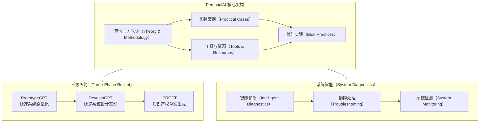
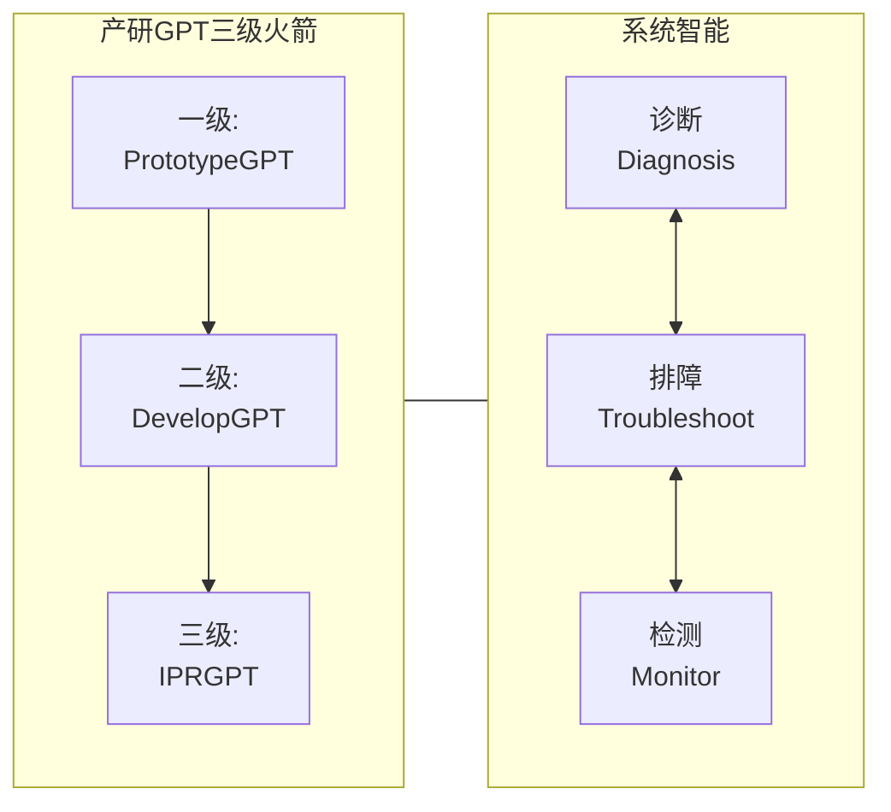
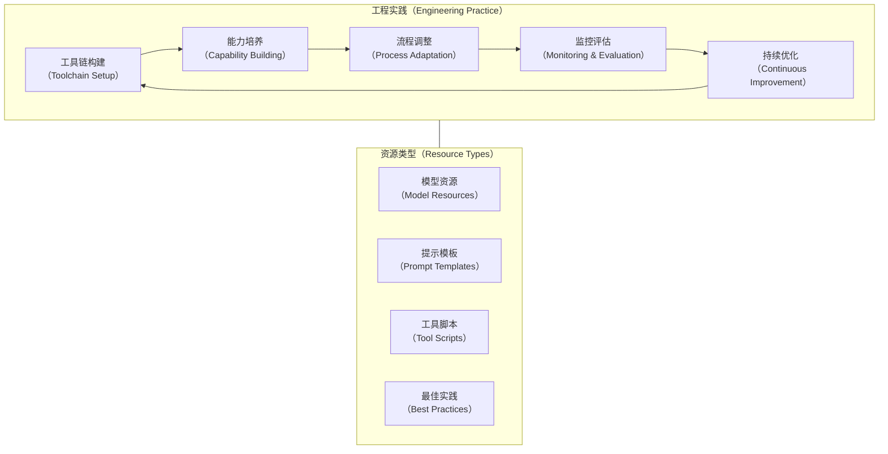
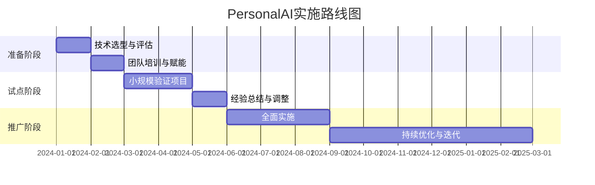

# PersonalAI 项目文档架构设计

## 1. 项目概述

PersonalAI项目旨在创建一个全面的文档资源库，聚焦于"先用AI，先进起来"的理念，为研发团队提供在云原生、数据中台、业务中台等领域充分利用人工智能技术的实践指南。本项目整合了最前沿的AI应用方法，包括大型语言模型(LLM)、智能体(Agent)和模型上下文协议(MCP)等，旨在全方位提升研发效率和创新能力。

### 1.1 项目核心架构



### 1.2 价值主张

PersonalAI项目立足于实现人工智能技术在研发全流程中的深度融合，通过提供系统化的方法论、丰富的实践案例和高效的工具资源，帮助研发团队实现以下核心价值：

1. **效率提升**：将重复性、低创造性工作交由AI处理，释放工程师创造力
2. **质量保障**：借助AI辅助代码审查、测试生成和缺陷预测
3. **知识传承**：实现团队知识体系的自动化积累与传递
4. **创新赋能**：通过AI激发新思路，加速技术创新和业务创新

## 2. 幻灯片演示框架

### 2.1 封面与开场

**幻灯片1: 封面**
- 标题: 《先用AI，先进起来》
- 副标题: 人工智能赋能研发全过程的实践指南
- 项目名称: PersonalAI
- 项目标识: GitHub - https://github.com/turtacn/PersonalAI

**幻灯片2: 内容概览**
- 研发面临的挑战与机遇
- AI技术革新与研发融合
- "产研GPT三级火箭"理念介绍
- 实践案例与价值展示
- 落地路径与资源获取

### 2.2 背景与现状

**幻灯片3: 研发现状与挑战**
- 研发效率瓶颈
- 知识传承困境
- 创新周期延长
- 质量保障压力
- 资源有限与需求无限的矛盾

**幻灯片4: AI技术变革**
- 大语言模型(LLM)技术飞跃
- AI智能体(Agent)能力崛起
- 模型上下文协议(MCP)标准化
- 研发工具智能化趋势
- AI落地应用的临界点

### 2.3 "产研GPT三级火箭"理念

**幻灯片5: 三级火箭总览**


**幻灯片6: 一级火箭 - PrototypeGPT**
- 快速系统原型化的核心价值
- 多模态模型在需求理解中的应用
- Prompt工程实践技巧
- AI Agent自动化流程示例
- 客户需求对齐的最佳实践

**幻灯片7: 二级火箭 - DevelopGPT**
- 系统设计与实现加速方法
- CodeLLM在代码生成中的应用
- 架构约束与规范自动化
- 文档、注释与测试生成实践
- 大规模并行开发最佳实践

**幻灯片8: 三级火箭 - IPRGPT**
- 知识产权保护的重要性
- AI辅助专利撰写流程
- 技术创新点识别方法
- 同类技术差异化分析
- 知识产权资产的积累与管理

**幻灯片9: 系统智能诊断**
- 系统智能诊断技术架构
- 智能排障流程与方法
- 问题根因自动分析
- 检测与预警机制
- 智能运维最佳实践

### 2.4 实践案例展示

**幻灯片10: 案例一 - 需求快速原型化**
- 背景与挑战
- PersonalAI应用方法
- 落地效果与价值
- 关键技术点解析
- 可复制的经验总结

**幻灯片11: 案例二 - 代码智能生成**
- 背景与挑战
- 架构设计与代码生成流程
- 基于参考实现的智能改进
- 效果对比与质量保障
- 经验总结与最佳实践

**幻灯片12: 案例三 - 测试自动化**
- 测试场景挑战
- AI生成测试用例方法
- 测试覆盖率与质量提升
- 集成到CI/CD流程
- 经验总结与推广建议

**幻灯片13: 案例四 - 知识产权生成**
- 专利撰写挑战
- AI辅助专利生成流程
- 创新点识别与强化
- 专利质量提升效果
- 知识资产管理方法

### 2.5 落地实践指南

**幻灯片14: 技术选型**
- LLM模型选择标准
- 开源与闭源方案对比
- 本地部署与云服务权衡
- 安全合规考量因素
- 成本与效益平衡分析

**幻灯片15: 工程实践**


**幻灯片16: 团队转型**
- 研发团队角色变化
- AI技能培养路径
- 渐进式转型策略
- 文化与思维转变
- 效能度量与反馈

**幻灯片17: 成本与收益**
- 投入成本分析
- 价值收益模型
- ROI计算方法
- 阶段性目标设定
- 长期战略规划

### 2.6 资源与工具

**幻灯片18: 核心工具资源**
- PersonalAI工具库介绍
- 开源资源整合清单
- 学习资料与文档
- 社区支持与交流渠道
- 持续更新机制

**幻灯片19: 实施路线图**


**幻灯片20: 总结与展望**
- 核心价值重申
- 未来发展趋势
- 行动建议
- 问答与互动
- 联系方式与资源获取

## 3. 项目目录结构

PersonalAI项目采用清晰的多层次目录结构，确保内容组织合理、易于导航和维护。

```
PersonalAI/
├── README.md                       # 项目主要说明文档
├── CODE_OF_CONDUCT.md              # 行为准则
├── CONTRIBUTING.md                 # 贡献指南
├── LICENSE                         # 许可证文件
├── docs/                           # 核心文档目录
│   ├── outlines.md                 # PPT和项目结构规划文档
│   ├── getting-started.md          # 快速入门指南
│   ├── principles/                 # 原则与方法论
│   │   ├── ai-rd-methodology.md    # AI研发方法论
│   │   ├── prompt-engineering.md   # 提示工程指南
│   │   └── model-selection.md      # 模型选择指南
│   ├── rocket/                     # 三级火箭文档
│   │   ├── prototype-gpt.md        # PrototypeGPT详解
│   │   ├── develop-gpt.md          # DevelopGPT详解
│   │   └── ipr-gpt.md              # IPRGPT详解
│   └── diagnostics/                # 系统智能诊断
│       ├── intelligent-diagnosis.md # 智能诊断指南
│       ├── troubleshooting.md      # 排障处理指南
│       └── monitoring.md           # 系统监测指南
├── slides/                         # 幻灯片资源
│   ├── PersonalAI_Presentation_CN.md    # 中文版演示文稿
│   ├── PersonalAI_Presentation_EN.md    # 英文版演示文稿
│   └── assets/                     # 幻灯片资源文件
│       ├── images/                 # 图片资源
│       └── diagrams/               # 图表资源
├── examples/                       # 实例与案例
│   ├── prototype/                  # 原型案例
│   ├── development/                # 开发案例
│   └── ipr/                        # 知识产权案例
├── templates/                      # 模板资源
│   ├── prompts/                    # 提示词模板
│   │   ├── prototype-prompts.md    # 原型生成提示词
│   │   ├── code-prompts.md         # 代码生成提示词
│   │   └── ipr-prompts.md          # 知识产权生成提示词
│   └── workflows/                  # 工作流模板
│       ├── prototype-workflow.md   # 原型生成工作流
│       ├── development-workflow.md # 开发工作流
│       └── ipr-workflow.md         # 知识产权工作流
└── tools/                          # 工具资源
    ├── scripts/                    # 实用脚本
    ├── configs/                    # 配置文件
    └── plugins/                    # 插件集成
```
