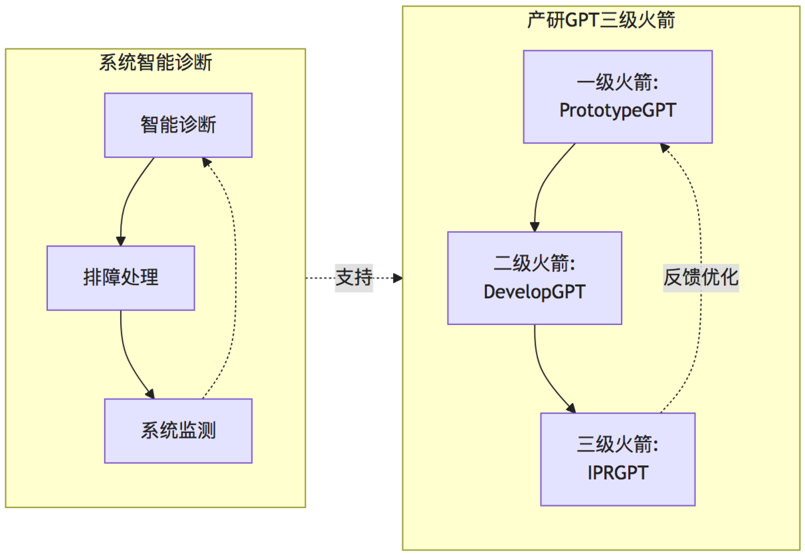
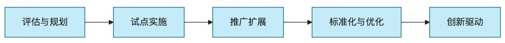

# AI 研发方法论

## 1. 引言

随着人工智能技术特别是大型语言模型(LLM)的快速发展，软件研发流程正在经历深刻变革。本文档提出 **AI驱动的研发方法论**，旨在系统化地指导研发团队如何有效集成AI能力，实现研发全流程的质量提升、效率增强和创新加速。

本方法论植根于"**先用AI，先进起来**"的核心理念，强调务实应用、渐进式转型和持续优化，帮助团队在不断变化的技术环境中保持竞争力。

## 2. 核心原则

### 2.1 AI与人类协同原则

* **互补性原则**：AI擅长数据处理、模式识别和规律性任务；人类擅长创造性思维、价值判断和复杂决策
* **最佳分工**：将重复性、标准化工作交给AI；将创造性、判断性工作保留给人类
* **迭代协作**：人类指导AI、AI辅助人类的良性循环，共同提升成果质量

### 2.2 全流程赋能原则

* **端到端覆盖**：从需求分析到知识产权保护，AI全流程参与
* **无缝集成**：AI工具与现有开发流程自然融合，降低使用门槛
* **适度自动化**：根据任务复杂度和重要性，确定合适的自动化程度

### 2.3 渐进式应用原则

* **先易后难**：从单点、低风险场景开始，逐步扩展到复杂场景
* **示范效应**：以成功案例驱动团队接受度和参与度
* **持续优化**：根据实践反馈不断调整方法和工具

## 3. "产研GPT三级火箭"框架

"产研GPT三级火箭"是PersonalAI项目提出的核心方法论框架，将AI赋能研发流程划分为三个递进阶段，同时配合系统智能诊断形成完整闭环。

### 3.1 PrototypeGPT：快速系统原型化

**核心目标**：通过AI大模型（多模态）、Prompt工程、AI Agent自动化，快速实现从需求描述到可演示的Demo原型系统。

**主要流程**：
1. 需求文档理解与分析
2. 用户故事与场景提取
3. 界面原型与交互流程设计
4. 快速Demo构建与演示
5. 反馈收集与迭代优化

**价值体现**：
- 加速需求理解与澄清，降低沟通成本
- 快速验证产品理念，减少投资风险
- 提升客户参与度，增强需求准确性
- 缩短产品定义周期，加速市场响应

### 3.2 DevelopGPT：快速系统设计和实现

**核心目标**：通过AI大模型（CodeLLM）、Prompt工程等快速实现60%+的文档和架构实现，满足设计约束、规范和已有参考实现。

**主要流程**：
1. 系统架构设计与评估
2. 代码框架生成与审核
3. 接口设计与组件实现
4. 测试用例生成与执行
5. 文档注释自动化生成

**价值体现**：
- 提高代码生成效率，缩短开发周期
- 确保架构与代码质量，降低技术债务
- 实现高测试覆盖率，提升系统可靠性
- 标准化文档与注释，便于维护与交接

### 3.3 IPRGPT：快速知识产权草案生成

**核心目标**：通过AI大模型和原始代码/工程资料生成专利、软著等知识产权文档，辅助创新提示与技术保护。

**主要流程**：
1. 技术创新点提取与分析
2. 相似技术检索与差异化分析
3. 专利文档草案自动生成
4. 技术保护策略优化建议
5. 持续创新方向指导

**价值体现**：
- 加速知识产权保护，降低专利申请门槛
- 提高专利质量，增强技术壁垒
- 促进技术创新意识，挖掘潜在价值点
- 沉淀组织知识资产，形成技术积累

### 3.4 系统智能诊断与优化

**核心目标**：通过AI技术实现系统智能诊断、排障和检测，确保系统质量与稳定性。

**主要流程**：
1. 系统日志与数据智能分析
2. 问题根因自动推理与定位
3. 解决方案智能推荐与评估
4. 系统健康状态实时监测
5. 潜在风险预警与预防

**价值体现**：
- 加速问题定位与解决，减少系统宕机时间
- 降低运维复杂度，提升系统可靠性
- 知识沉淀与经验复用，减少专家依赖
- 实现主动预防，避免问题扩大化

## 4. 实施方法学

### 4.1 组织准备

**团队角色与能力建设**：
- **AI产品负责人**：负责AI应用的整体规划与价值评估
- **提示工程师**：专注于提示词优化与AI交互设计
- **AI工程师**：负责AI工具开发与现有流程集成
- **质量验证专家**：评估AI输出质量，设计验证机制

**基础设施准备**：
- AI模型访问与部署（云服务或本地部署）
- 提示词模板库与知识库构建
- 开发与测试环境适配
- 安全与合规保障机制

### 4.2 阶段实施策略

#### 第一阶段：评估与规划
- 识别AI应用机会点与价值潜力
- 评估现有流程与AI融合点
- 确定优先实施场景与目标
- 制定实施路线图与资源计划

#### 第二阶段：试点实施
- 选择低风险、高价值场景进行试点
- 应用小规模团队先行尝试
- 收集反馈并进行必要调整
- 量化试点成效，形成案例

#### 第三阶段：推广扩展
- 基于试点经验扩大应用范围
- 培训更多团队成员掌握AI工具
- 优化工作流程与协作模式
- 建立共享资源与最佳实践

#### 第四阶段：标准化与优化
- 制定AI应用的标准流程与规范
- 集成到正式开发流程与工具链
- 建立评估与反馈机制
- 持续优化模型与提示策略

#### 第五阶段：创新驱动
- 探索AI驱动的新型研发范式
- 培育"AI原生"的创新文化
- 构建可持续的学习与进化机制
- 引领行业AI应用最佳实践

### 4.3 有效性评估框架

有效评估AI应用效果对于持续改进至关重要，本框架提供全面的指标体系：

**效率指标**：
- 研发周期缩短比例
- 人均代码产出提升
- 文档生成速度提升
- 问题解决时间缩短

**质量指标**：
- 代码质量评分变化
- 缺陷密度下降比例
- 测试覆盖率提升
- 用户满意度变化

**创新指标**：
- 专利申请数量增长
- 新功能开发速度
- 技术创新点识别数
- 创新方案生成质量

**成本效益指标**：
- AI工具投入回报率
- 人力成本节约比例
- 维护成本变化
- 市场响应能力提升

## 5. 实践指南与最佳实践

### 5.1 提示工程关键技巧

有效的提示工程(Prompt Engineering)是AI驱动研发的基础能力：

1. **清晰定义目标与约束**
   - 明确指出期望的输出格式、内容与质量要求
   - 提供必要的背景信息与上下文
   - 指明需遵循的标准、规范或模式

2. **结构化输入设计**
   - 采用角色设定提升回答专业性
   - 使用分步骤指导保证输出完整性
   - 设计示例引导AI理解预期

3. **迭代优化策略**
   - 从简单到复杂逐步构建提示
   - 根据输出质量持续调整提示
   - 保存高效提示模板便于复用

### 5.2 AI与传统开发流程融合

AI工具不是替代传统流程，而是增强其效率与价值：

1. **需求管理增强**
   - AI辅助需求分析与优先级排序
   - 自动检测需求冲突与不一致性
   - 需求与场景的可视化呈现

2. **设计过程增强**
   - 架构方案快速生成与评估
   - 设计模式智能推荐与应用
   - 接口设计自动化与一致性检查

3. **开发过程增强**
   - 代码框架与模板智能生成
   - 复杂算法实现辅助
   - 代码优化与重构建议

4. **测试过程增强**
   - 测试用例自动生成与管理
   - 边界条件与异常场景识别
   - 测试结果智能分析与问题分类

5. **发布与运维增强**
   - 发布说明自动生成
   - 系统监控数据智能分析
   - 故障诊断与恢复辅助

### 5.3 常见陷阱与规避策略

在应用AI驱动研发过程中，需警惕以下常见陷阱：

1. **过度依赖陷阱**
   - **现象**：团队过度依赖AI输出，减少人工验证
   - **风险**：导致"幻觉"内容混入产品，降低系统可靠性
   - **对策**：建立严格的人工审核机制，明确AI决策权限范围

2. **能力误判陷阱**
   - **现象**：高估或低估AI能力，任务分配不合理
   - **风险**：简单任务过度人工干预，复杂任务盲目信任AI
   - **对策**：建立任务分级制度，明确AI与人类职责界限

3. **表面优化陷阱**
   - **现象**：只关注指标表面提升，忽视实质性价值创造
   - **风险**：形成"指标好看，价值有限"的应用泡沫
   - **对策**：建立端到端价值评估体系，关注实际业务影响

4. **技能退化陷阱**
   - **现象**：团队对基础能力训练减少，过度依赖AI辅助
   - **风险**：核心技能逐步弱化，应对复杂问题能力下降
   - **对策**：保持核心能力训练，将AI视为增强工具而非替代品

## 6. 案例研究

### 6.1 PrototypeGPT应用案例

**案例背景**：某金融科技企业需要快速开发一个投资组合分析系统的原型，以验证新的分析方法可行性。

**应用流程**：
1. 将业务需求文档与分析方法论文输入PrototypeGPT
2. AI生成用户故事与关键场景清单
3. 根据场景自动生成UI原型与交互流程图
4. 基于原型反馈进行两轮迭代优化
5. 生成可交互Demo用于客户演示

**成效分析**：
- 原型设计周期从3周缩短至3天
- 首轮原型即捕获了80%的关键需求
- 大幅提升了客户参与度与反馈质量
- 最终产品与原型一致性达到90%以上

### 6.2 DevelopGPT应用案例

**案例背景**：某云服务提供商需要对现有微服务架构进行重构，提高系统性能与可扩展性。

**应用流程**：
1. 输入现有系统架构文档与性能瓶颈分析
2. AI生成新架构方案与组件拆分建议
3. 根据新架构自动生成核心服务代码框架
4. 基于参考实现智能生成数据模型与接口
5. 自动生成测试用例与性能测试脚本

**成效分析**：
- 架构设计时间缩短60%
- 基础代码自动生成率达到75%
- 测试覆盖率从65%提升至92%
- 系统性能提升40%，可扩展性显著增强

### 6.3 IPRGPT应用案例

**案例背景**：某数据分析平台开发团队完成新算法实现，需要进行知识产权保护。

**应用流程**：
1. 输入算法实现代码与技术文档
2. AI提取关键技术创新点与实现特征
3. 自动检索相似专利并进行差异化分析
4. 生成专利申请文档草案与权利要求
5. 提供技术保护策略建议与创新方向

**成效分析**：
- 专利撰写时间从2周缩短至2天
- 识别出3个被开发团队忽视的创新点
- 专利质量评分比团队历史平均高25%
- 最终获得授权速度比往常快30%

## 7. 未来展望

AI驱动的研发方法论将持续发展，以下趋势值得关注：

### 7.1 技术趋势

- **多模态融合**：结合代码、图像、语音等多种模态，实现更全面的理解与生成
- **符号-神经混合系统**：结合符号推理与神经网络，提升逻辑推理与规范遵循能力
- **自主Agent系统**：多个专业化AI智能体协同工作，形成完整研发助手生态系统
- **领域特定优化模型**：针对特定技术栈或业务领域的专业化模型，提升专业度与准确性

### 7.2 方法论演进

- **"AI原生"研发范式**：从根本上重构研发流程，形成适应AI优势的全新工作方式
- **组织角色重塑**：研发组织结构与角色定位的根本变革，形成人机高效协作新模式
- **创造性增强**：AI从辅助实现转向辅助创造，激发人类创新能力的质变
- **知识闭环自优化**：研发知识持续积累与优化，形成组织级智能资产

## 8. 参考资料

[1] Prompt Engineering Guide. https://www.promptingguide.ai/

[2] AI-Assisted Software Development: A Systematic Literature Review. IEEE Access, 2023.

[3] DevChat - 开源智能IDE插件. https://www.devchat.ai/

[4] GoPool - 生成式AI驱动的高性能工作池库. https://pro.devchat.ai/devchat-ai/gopool/

[5] Model Context Protocol Specification. https://github.com/punkpeye/awesome-mcp-servers