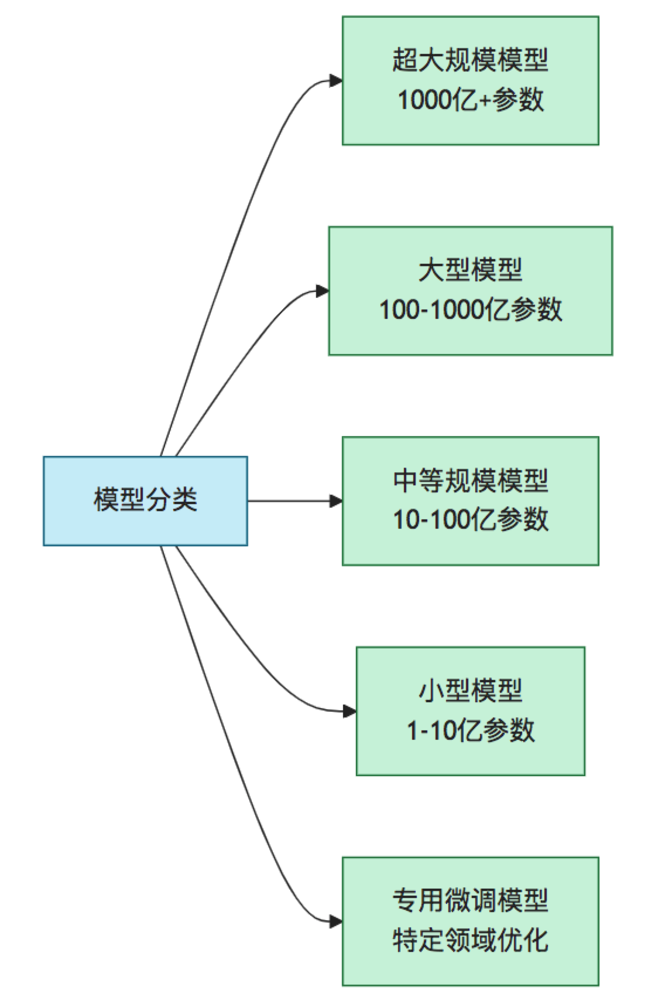
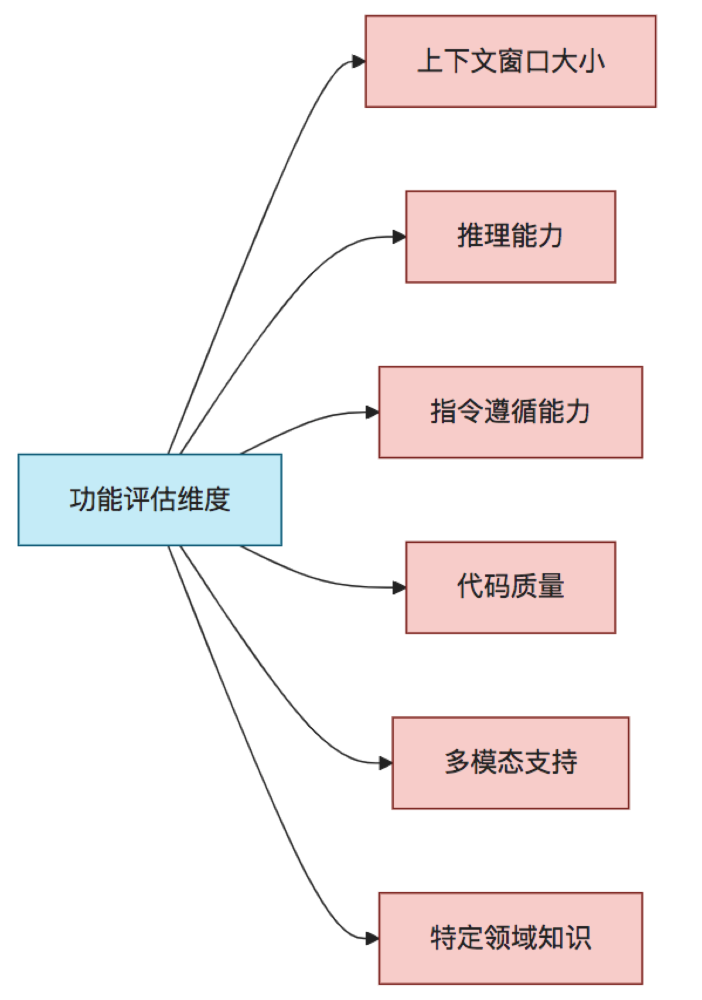
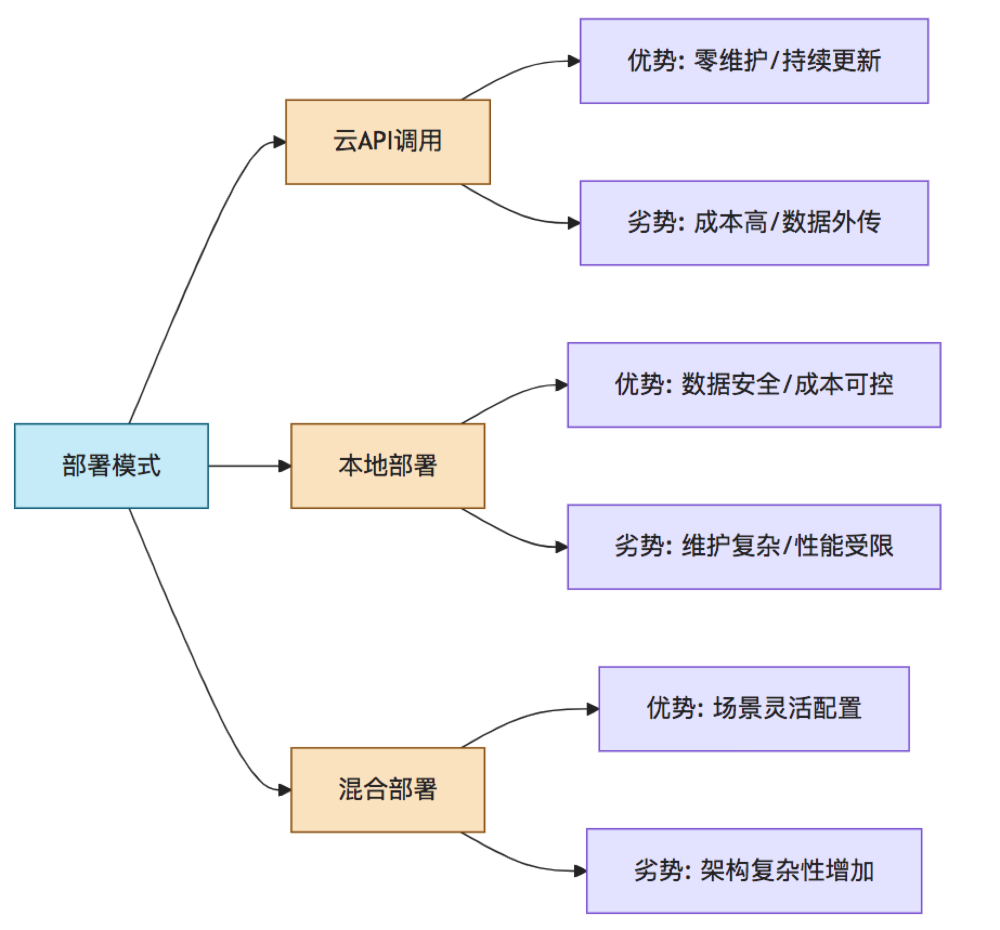
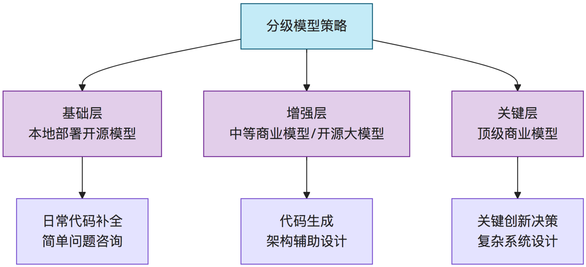

# 模型选择指南

## 1. 引言

随着人工智能技术的快速发展，选择适合研发需求的AI模型变得日益复杂却又至关重要。本指南旨在帮助技术团队在众多可用选项中做出明智的模型选择决策，实现效能、成本与质量的最佳平衡。

本文档基于实践经验，提供系统化的模型评估框架，覆盖从商业模型到开源方案的全面比较，以及针对不同研发场景的具体建议。理解模型的差异性对于充分发挥"产研GPT三级火箭"的潜力至关重要。

## 2. 模型分类与特点

### 2.1 按规模与能力分类

| 模型类型 | 代表模型 | 主要特点 | 适用场景 |
|---------|---------|---------|---------|
| 超大规模模型 | GPT-4/Claude 3 Opus | 全面的能力、强大的推理、多模态支持 | 复杂系统设计、创新方案生成 |
| 大型模型 | GPT-3.5/Claude 3 Sonnet/DeepSeek-V2 | 良好的通用能力、较强的代码生成 | 日常开发辅助、文档生成 |
| 中等规模模型 | Llama 3/Mistral/Mixtral 8x7B | 平衡的性能与资源消耗 | 团队内部工具、中等复杂度任务 |
| 小型模型 | CodeLlama/WizardCoder | 专注特定能力、资源需求低 | 特定领域任务、边缘计算环境 |
| 专用微调模型 | 领域定制模型 | 特定领域超高性能 | 垂直领域特殊任务 |

### 2.2 按模态能力分类

| 模态类型 | 能力描述 | 研发应用场景 |
|---------|---------|------------|
| 纯文本模型 | 处理和生成文本内容 | 代码生成、文档撰写、需求分析 |
| 多模态模型 | 理解文本、图像、音频等 | UI/UX设计、视觉缺陷检测、图表生成 |
| 代码专精模型 | 专注代码生成与理解 | 编程辅助、代码优化、自动化测试 |
| 领域专精模型 | 特定技术领域知识增强 | 特定技术栈开发、行业规范合规性 |

## 3. 关键选择因素

### 3.1 功能因素

| 评估维度 | 重要性 | 评估方法 |
|---------|-------|---------|
| 上下文窗口大小 | 决定处理代码库能力 | 测试不同大小文件处理能力 |
| 推理能力 | 影响复杂问题解决质量 | 设计递进复杂度测试案例 |
| 指令遵循能力 | 影响输出格式控制 | 测试特定格式要求的响应准确度 |
| 代码质量 | 直接影响开发效率 | 代码正确性、可维护性、性能测试 |
| 多模态支持 | 影响UI/UX设计能力 | 测试图文混合理解与生成能力 |
| 特定领域知识 | 影响专业输出质量 | 针对特定技术领域的知识测试 |

### 3.2 非功能因素

| 评估维度 | 考量要点 | 建议 |
|---------|---------|------|
| 成本结构 | API调用费用、硬件需求 | 根据使用频率和预算评估总体拥有成本 |
| 访问可靠性 | 服务SLA、稳定性 | 评估关键任务对可用性的要求 |
| 延迟表现 | 响应速度、批处理能力 | 测试不同规模请求的响应时间 |
| 数据隐私 | 模型训练数据政策、数据处理方式 | 审查供应商数据处理协议 |
| 安全合规 | 信息安全标准、行业监管要求 | 咨询法务部门确认合规要求 |
| 可部署性 | 云服务、本地部署、混合部署选项 | 考虑组织IT基础设施和政策 |
| 可定制性 | 微调能力、参数调整范围 | 评估特定场景的定制需求 |

## 4. 商业模型 vs 开源模型

### 4.1 全面比较

| 比较维度 | 商业模型 | 开源模型 |
|---------|---------|---------|
| 性能表现 | 通常领先（尤其是最新版本） | 差距逐渐缩小，特定领域可能优于商业模型 |
| 成本结构 | 基于API调用计费，成本可预测 | 前期硬件投入大，长期使用更经济 |
| 部署灵活性 | 受限于供应商API和政策 | 高度灵活，支持多种部署方案 |
| 数据隐私 | 依赖供应商政策和协议 | 完全自主控制，适合敏感信息 |
| 更新频率 | 定期更新，自动获取改进 | 取决于社区活跃度，可能需自行跟进 |
| 技术支持 | 专业支持，SLA保障 | 社区支持，质量参差不齐 |
| 合规要求 | 供应商负责部分合规性 | 组织需承担全部合规责任 |

### 4.2 主要商业模型对比

| 模型系列 | 优势 | 局限性 | 最适用场景 |
|---------|------|-------|-----------|
| OpenAI GPT系列 | 全面的能力、定期更新、生态完善 | 成本较高、高峰期可能拥堵 | 通用开发辅助、复杂问题解决 |
| Anthropic Claude系列 | 长上下文支持、伦理对齐佳 | API访问限制、编程能力略逊 | 长文档处理、复杂推理任务 |
| Google Gemini系列 | 多模态能力强、搜索集成 | 国内访问受限、版本差异大 | 结合搜索的研发辅助 |
| 国内商业模型（百度/智谱等） | 中文处理优势、本地化支持 | 英文能力可能较弱 | 本地化产品开发、中文内容生成 |

### 4.3 主要开源模型对比

| 模型系列 | 优势 | 局限性 | 最适用场景 |
|---------|------|-------|-----------|
| Meta Llama系列 | 社区活跃、持续改进、多种变体 | 最新版授权限制增加 | 本地部署的通用开发辅助 |
| Mistral系列 | 性能/规模比优异、商业许可友好 | 规模相对较小 | 资源受限环境中的开发辅助 |
| CodeLlama/WizardCoder | 代码生成特别优化 | 通用能力有限 | 专注代码生成的场景 |
| 清华/复旦/智源开源模型 | 中文能力强、学术支持 | 商业支持有限 | 学术研究、中文应用开发 |

## 5. 部署选项评估

### 5.1 部署模式对比

### 5.2 硬件要求与规划

| 模型规模 | GPU内存需求 | 推荐配置 | 估算成本 |
|---------|-----------|---------|---------|
| 7B-13B参数 | 16-32GB | NVIDIA RTX 4090/A5000 | $2,000-$5,000/卡 |
| 30-70B参数 | 48-80GB | NVIDIA A40/A100 | $5,000-$10,000/卡 |
| 混合专家模型 | 80GB+ | 多卡A100配置 | $10,000-$40,000/系统 |
| 量化模型(INT8/INT4) | 降低50-75% | 可使用中端GPU | 根据基础配置折算 |

### 5.3 服务架构考量

对于本地或混合部署，需考虑以下架构层面:

- **推理服务层**: 选择适合的推理引擎(如vLLM, TGI, FastAPI等)
- **资源管理层**: GPU资源调度、负载均衡
- **API网关层**: 请求路由、速率限制、身份验证
- **监控与日志层**: 性能监控、异常捕获、使用统计
- **缓存层**: 减少重复计算、提升响应速度

## 6. 三级火箭场景模型选择

### 6.1 PrototypeGPT最佳模型选择

| 应用场景 | 推荐模型类型 | 具体推荐 | 选择理由 |
|---------|------------|---------|---------|
| 需求分析与澄清 | 超大规模多模态 | GPT-4V/Claude 3 Opus | 强大的理解能力和推理能力 |
| 用户流程设计 | 大型通用模型 | Claude 3 Sonnet/GPT-4 | 良好的逻辑推理和创意生成 |
| UI/UX草图生成 | 专门的多模态 | Midjourney+GPT协作 | 视觉创意与功能描述结合 |
| 交互原型构建 | 代码+视觉模型 | GPT-4V/本地CodeLlama | 理解设计意图并转化为代码 |
| 客户演示准备 | 多模态+文档 | Claude 3/GPT-4 | 内容组织和表达能力强 |

### 6.2 DevelopGPT最佳模型选择

| 应用场景 | 推荐模型类型 | 具体推荐 | 选择理由 |
|---------|------------|---------|---------|
| 架构设计 | 超大规模模型 | GPT-4/Claude 3 | 系统思维和复杂推理能力 |
| 代码生成 | 代码专精模型 | DeepSeek Coder/WizardCoder | 代码质量高、技术准确性强 |
| 单元测试生成 | 中等规模代码模型 | CodeLlama/StarCoder2 | 平衡效率与质量的需要 |
| 文档生成 | 长上下文模型 | Claude 3/GPT-3.5 | 处理大规模代码与生成文档 |
| 代码优化 | 代码专精模型 | DeepSeek Coder/本地Llama部署 | 理解性能考量和最佳实践 |
| 持续集成支持 | 轻量级模型 | 本地部署Llama 3/Mistral | 频繁调用、响应速度要求高 |

### 6.3 IPRGPT最佳模型选择

| 应用场景 | 推荐模型类型 | 具体推荐 | 选择理由 |
|---------|------------|---------|---------|
| 技术创新点提取 | 深度推理模型 | Claude 3 Opus/GPT-4 | 复杂文本理解和洞察力 |
| 专利文档生成 | 长文本生成模型 | Claude 3/GPT-4 | 处理复杂格式和专业术语 |
| 专利检索与比对 | 大规模检索增强模型 | GPT-4+RAG/Claude+检索 | 知识广度和比较分析能力 |
| 创新方向建议 | 超大规模推理模型 | GPT-4/Claude 3 Opus | 跨领域联想和创新能力 |
| 技术文档标准化 | 规范型模型 | Claude 3 Sonnet/本地Llama | 遵循规范的能力强 |

### 6.4 系统智能诊断模型选择

| 应用场景 | 推荐模型类型 | 具体推荐 | 选择理由 |
|---------|------------|---------|---------|
| 日志分析 | 长上下文专业模型 | Claude/本地部署Llama | 处理大规模日志的能力 |
| 根因推理 | 高推理能力模型 | GPT-4/Claude 3 Opus | 复杂系统问题的推理能力 |
| 解决方案生成 | 代码+系统知识模型 | DeepSeek/本地部署CodeLlama | 对系统问题提供实用解决方案 |
| 健康监测分析 | 轻量实时模型 | 本地部署Mistral/Llama | 低延迟、高可用性要求 |
| 预警规则生成 | 专业领域模型 | 领域微调模型/GPT-4 | 特定系统的专业知识要求 |

## 7. 成本与性能平衡策略

### 7.1 分级模型应用原则

采用"能力分层、场景匹配"原则优化成本:

1. **基础层**：日常辅助使用较小/成本低的模型
2. **增强层**：重要场景使用中等规模/性能模型
3. **关键层**：核心决策使用最高性能模型

### 7.2 成本优化技术

| 技术策略 | 实施方法 | 潜在节省 |
|---------|---------|---------|
| 提示工程优化 | 精简提示、减少轮次、控制输出 | 15-30% |
| 缓存与结果复用 | 常见查询缓存、类似问题结果复用 | 20-50% |
| 模型蒸馏部署 | 使用小型蒸馏模型处理标准任务 | 30-70% |
| 批量处理 | 合并相似请求、非实时任务批处理 | 10-25% |
| 混合部署策略 | 针对不同场景选择最经济的部署方式 | 20-40% |

### 7.3 投资回报计算框架

评估AI模型投资时，考虑以下回报测量指标:

1. **直接成本节省**：(原人工成本 - AI辅助下的成本) - AI使用成本
2. **时间价值**：周期缩短带来的市场价值和机会成本节约
3. **质量提升**：缺陷减少带来的维护成本节约和品牌价值提升
4. **创新增强**：新增创新形成的知识产权和市场竞争力

## 8. 未来趋势与选择策略

### 8.1 模型技术发展趋势

- **混合专家模型**：MoE架构将成主流，提供更高性价比
- **小型高性能模型**：通过优化技术，小模型能力持续提升
- **定制化专精模型**：针对特定行业和任务的垂直优化
- **多模态深度整合**：代码、图像、音频无缝协作能力增强
- **端侧部署突破**：更多能力下放到开发者本地环境

### 8.2 策略性建议

1. **投资组合策略**：不要押注单一模型或供应商，保持技术多元性
2. **能力抽象层**：构建模型无关的抽象接口，降低切换成本
3. **持续评估机制**：定期测试新模型能力，量化性能与成本对比
4. **内部知识增强**：通过微调和RAG，强化模型对内部知识的理解
5. **超前规划原则**：预留技术演进空间，基础设施需要前瞻性设计

## 9. 参考资料

[1] State of AI Report 2023. https://www.stateof.ai/

[2] Model Evaluation Framework: Parameters vs. Performance. Stanford HAI, 2023.

[3] Practical LLM Deployment Strategies. Hugging Face, 2023. 

[4] DeepSeek API Integration Guide. https://github.com/Doriandarko/deepseek-engineer

[5] DevChat AI Selection Guidelines. https://www.devchat.ai/docs

[6] Cost Analysis of Open Source LLM Deployment. EleutherAI, 2023.

[7] 模型上下文协议服务器列表. https://github.com/punkpeye/awesome-mcp-servers