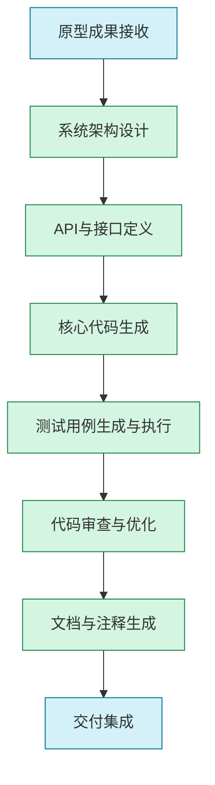

# DevelopGPT：快速系统设计与实现指南

## 1. 概述

DevelopGPT是"产研GPT三级火箭"的第二级，专注于利用大型语言模型（特别是代码生成模型）实现从系统设计到实际代码实现的加速过程。它在PrototypeGPT的原型基础上，将概念转化为可工作的系统，大幅提升开发效率与代码质量。

### 1.1 核心价值

- **架构设计辅助**：生成合理的系统架构方案与组件设计
- **代码智能生成**：实现60%+常规代码的自动化生成
- **单元测试覆盖**：自动生成全面的测试用例与测试代码
- **开发周期缩短**：显著减少从设计到实现的时间
- **文档自动化**：代码与文档同步生成，保持一致性

### 1.2 应用场景

- 新系统快速开发与构建
- 遗留系统现代化与重构
- 微服务与组件化开发
- API设计与实现
- 全栈应用开发

## 2. DevelopGPT工作流程

DevelopGPT采用分阶段的系统化开发流程，充分发挥AI在代码生成与优化环节的优势：



### 2.1 原型成果接收

**目标**：接收PrototypeGPT阶段的成果，转化为开发需求

**实施方法**：
- 分析原型文档与交互流程
- 明确功能规格与技术要求
- 识别技术约束与依赖关系
- 确定开发优先级与里程碑

**AI辅助方式**：
- 自动提取功能需求清单
- 转化用户流程为技术任务
- 识别潜在的技术风险点
- 生成开发计划与任务拆分

### 2.2 系统架构设计

**目标**：设计清晰、可扩展的系统架构

**实施方法**：
- 确定整体架构风格(单体/微服务等)
- 设计核心组件与模块划分
- 规划数据流与状态管理
- 确定技术栈选择与依赖

**关键提示词策略**：

```
【角色】系统架构师
【任务】设计以下系统的软件架构：

【系统需求】
{功能需求与非功能需求}

【技术约束】
{技术栈、部署环境等约束}

【性能要求】
{性能、可伸缩性等要求}

【输出要求】
1. 系统整体架构图与模块划分
2. 核心组件设计与职责描述
3. 技术栈选择与理由
4. 关键接口与数据流定义
5. 扩展性与维护性考量
6. 潜在风险与缓解策略
```

### 2.3 API与接口定义

**目标**：设计清晰、一致、可测试的API

**实施方法**：
- 定义RESTful/GraphQL等API规范
- 设计请求/响应格式与错误处理
- 规划权限与安全控制
- 创建API文档与示例

**AI辅助方式**：
- 生成完整API定义与规范
- 创建接口文档与使用示例
- 设计数据模型与验证规则
- 生成API测试用例

**关键提示词策略**：

```
【角色】API设计专家
【任务】为以下功能设计RESTful API：

【功能描述】
{功能与数据需求描述}

【用户角色】
{使用API的用户角色与权限}

【技术要求】
{技术栈、认证方式等}

【输出要求】
1. 完整的API端点列表与HTTP方法
2. 每个端点的请求/响应模式(包含字段描述)
3. 错误处理与状态码规范
4. 认证与授权机制
5. OpenAPI(Swagger)格式的接口文档
```

### 2.4 核心代码生成

**目标**：高效生成高质量的代码实现

**实施方法**：
- 按组件/模块拆分代码生成任务
- 遵循代码规范与设计模式
- 实现业务逻辑与数据处理
- 处理异常情况与边界条件

**AI辅助方式**：
- 生成组件框架与基础代码
- 提供业务逻辑实现方案
- 生成数据操作与处理代码
- 实现算法与复杂功能

**关键提示词策略**：

```
【角色】高级软件工程师
【任务】为以下功能实现代码：

【功能规格】
{详细功能描述与逻辑}

【技术栈】
编程语言: {编程语言}
框架: {框架}
数据库: {数据库技术}

【代码规范】
{编码规范与风格要求}

【输出要求】
1. 完整可运行的代码实现
2. 关键部分的注释说明
3. 异常处理与边界情况考虑
4. 遵循设计模式与最佳实践
5. 性能与安全性考量
```

### 2.5 测试用例生成与执行

**目标**：确保代码质量与功能正确性

**实施方法**：
- 设计单元测试与集成测试策略
- 生成测试用例与测试数据
- 实现自动化测试脚本
- 执行测试并分析结果

**AI辅助方式**：
- 自动生成单元测试代码
- 创建测试数据与边界用例
- 设计集成测试场景
- 分析测试覆盖率与改进建议

**关键提示词策略**：

```
【角色】测试工程师
【任务】为以下代码生成单元测试：

【代码实现】
 - {编程语言}
 - {粘贴代码实现}


【测试要求】
- 测试框架: {测试框架}
- 目标覆盖率: {覆盖率要求}
- 边界情况: {需要测试的边界条件}

【输出要求】
1. 完整的测试用例实现
2. 主要功能点的测试覆盖
3. 边界条件与异常情况测试
4. 模拟与依赖处理策略
5. 测试运行说明
```

### 2.6 代码审查与优化

**目标**：提升代码质量和性能

**实施方法**：
- 执行代码静态分析
- 检查代码规范与最佳实践
- 识别性能瓶颈与优化机会
- 重构复杂或冗余代码

**AI辅助方式**：
- 提供代码质量分析报告
- 识别潜在bugs与安全问题
- 推荐代码优化与重构方案
- 生成性能优化建议

**关键提示词策略**：

```
【角色】代码审查专家
【任务】审查并优化以下代码：

【代码实现】
 - {编程语言}
 - {粘贴代码实现}

【审查重点】
{代码质量、性能、安全等关注点}

【输出要求】
1. 代码问题清单与严重程度评级
2. 详细的改进建议与理由
3. 优化后的代码示例
4. 性能与安全性增强建议
5. 遵循最佳实践的检查结果
```

### 2.7 文档与注释生成

**目标**：创建完整的技术文档与代码注释

**实施方法**：
- 生成API文档与使用说明
- 添加代码内注释与文档字符串
- 创建架构与设计文档
- 编写开发者指南与示例

**AI辅助方式**：
- 自动生成代码注释与文档
- 创建API使用示例与说明
- 生成架构图与组件关系
- 整合技术文档与知识库

**关键提示词策略**：

```
【角色】技术文档专家
【任务】为以下代码生成文档与注释：

【代码实现】
 - {编程语言}
 - {粘贴代码实现}


【文档要求】
{文档格式与详细程度要求}

【目标受众】
{文档使用者角色}

【输出要求】
1. 带完整注释的代码版本
2. API使用文档与示例
3. 模块功能与架构描述
4. 关键算法与逻辑说明
5. 配置与部署指南(如适用)
```

## 3. 提示工程最佳实践

高质量的提示工程是DevelopGPT效果的关键。以下是针对代码生成与系统开发的提示词优化策略：

### 3.1 系统提示模板

针对代码生成任务的通用系统提示模板：

```
您是一位经验丰富的高级软件工程师，精通软件架构设计、代码实现和测试。您的代码注重可读性、可维护性和性能，并始终遵循软件工程最佳实践。

请基于我提供的需求和规范，提供高质量的技术解决方案。您的回答应该：
1. 展示深刻的技术理解和系统思维
2. 考虑扩展性、安全性和性能需求
3. 遵循行业标准和设计模式
4. 包含清晰的解释和必要的文档
5. 关注边缘情况和异常处理

当我提供代码片段或要求您生成代码时，请确保代码符合现代编程实践，有适当的错误处理、日志记录和注释。
```

### 3.2.多轮对话策略

系统开发通常需要多轮迭代，使用以下对话策略提高效率：

1. **渐进细化**：从高层架构逐步细化到具体实现
   ```
   让我们先确定整体架构，然后再逐层细化到具体模块和实现细节。首先，请基于需求设计系统的高层架构。
   ```

2. **分块生成**：将大型代码任务分解为可管理的块
   ```
   让我们把这个功能拆分为几个关键组件来实现。首先设计数据模型，然后是业务逻辑层，最后是API控制器。
   ```

3. **引导式改进**：针对性地优化生成的代码
   ```
   这个实现基本正确，但我有几点需要改进：
   1. 请优化数据库查询性能
   2. 增强错误处理逻辑
   3. 添加单元测试覆盖边界条件
   ```

4. **增量迭代**：在已有代码基础上持续改进
   ```
   基于上一轮生成的代码，我们需要添加用户认证功能。请保留核心业务逻辑，添加认证相关代码。
   ```

### 3.3 提示词细化技巧

针对不同开发阶段的提示词细化建议：

| 阶段 | 优化技巧 | 示例 |
|------|---------|------|
| 架构设计 | 提供完整约束与目标 | "系统需支持{并发量}，存储{数据规模}，部署于{环境}，关键指标是{性能要求}" |
| API设计 | 明确详细的交互流程 | "用户认证流程包含：注册、登录、刷新令牌、找回密码，每步需详细API定义" |
| 代码生成 | 指定框架与设计模式 | "使用{框架}实现，采用仓储模式处理数据访问，使用依赖注入管理服务" |
| 测试生成 | 明确测试策略与覆盖 | "生成单元测试覆盖所有公共方法，模拟外部依赖，测试至少3个边界条件" |
| 文档生成 | 指定文档格式与深度 | "生成符合JSDoc格式的注释，包含参数类型、返回值和异常说明，并提供使用示例" |

## 4. 技术栈与场景优化

根据不同技术栈和应用场景，调整DevelopGPT的应用策略：

### 4.1 Web应用开发

**技术栈考量**：

**前端**:
- React/Vue/Angular框架选择
- 状态管理(Redux, Vuex等)
- UI组件库与样式方案
- 构建工具与优化策略

**后端**:
- 语言与框架(Node.js, Java Spring, Python Django等)
- API设计(REST, GraphQL)
- 数据库选择与ORM
- 认证与授权方案

**AI应用策略**：
- 使用AI生成前端组件与交互逻辑
- 生成API实现与数据模型
- 创建表单验证与状态管理代码
- 实现常见功能模板(认证、配置、日志等)

**关键提示示例**：
```
【角色】全栈开发工程师
【任务】实现以下Web功能模块：

【功能描述】
{功能详细描述}

【技术栈】
前端: React + Redux + Tailwind CSS
后端: Node.js + Express + MongoDB
认证: JWT

【实现要求】
1. 组件化设计，符合React最佳实践
2. RESTful API设计与实现
3. 状态管理与数据流设计
4. 响应式UI与表单验证
5. 完整的认证流程实现
```

### 4.2 移动应用开发

**技术栈考量**：
- 原生(iOS/Android)vs跨平台(React Native/Flutter)
- 状态管理与数据持久化
- 设备功能集成(相机、位置等)
- 离线功能与数据同步

**AI应用策略**：
- 生成UI组件与页面导航
- 实现设备API集成代码
- 创建数据本地存储与同步逻辑
- 优化移动端性能与电池使用

**关键提示示例**：
```
【角色】移动应用开发专家
【任务】使用Flutter实现以下功能：

【功能描述】
{功能详细描述}

【技术要求】
框架: Flutter 3.0+
状态管理: Provider/Bloc
存储: Hive/SQLite
网络: Dio/http

【输出要求】
1. Flutter Widget实现与状态管理
2. 响应式布局(支持手机/平板)
3. 离线功能与数据同步机制
4. 设备API(相机/位置等)集成
5. 性能优化考量
```

### 4.3 后端系统与API

**技术栈考量**：
- 微服务vs单体架构
- 同步vs异步通信
- 消息队列与事件驱动设计
- 水平扩展与高可用性

**AI应用策略**：
- 设计微服务边界与通信
- 生成API网关与服务发现代码
- 实现消息队列集成
- 创建容错与熔断机制

**关键提示示例**：
```
【角色】后端架构师
【任务】设计并实现以下微服务架构：

【系统需求】
{系统功能与非功能需求}

【技术栈】
语言: Java/Kotlin
框架: Spring Boot/Spring Cloud
数据库: PostgreSQL + Redis
消息: Kafka

【输出要求】
1. 微服务拆分与边界定义
2. 服务间通信与数据一致性策略
3. API网关设计与实现
4. 容错与弹性设计
5. 服务发现与配置管理
```

### 4.4 DevOps与基础设施

**技术栈考量**：
- 容器化与编排(Docker, Kubernetes)
- CI/CD流程与工具
- 基础设施即代码(Terraform, Ansible)
- 监控与日志(Prometheus, ELK)

**AI应用策略**：
- 生成Docker配置与Kubernetes资源
- 创建CI/CD流程脚本
- 实现基础设施代码
- 设计监控与告警策略

**关键提示示例**：
```
【角色】DevOps工程师
【任务】为以下应用设计DevOps流程与基础设施：

【应用描述】
{应用技术栈与部署需求}

【环境要求】
{开发/测试/生产环境描述}

【非功能需求】
{可用性、可伸缩性、安全性要求}

【输出要求】
1. Dockerfile与docker-compose配置
2. Kubernetes部署清单(YAML)
3. CI/CD流程设计(GitHub Actions/Jenkins)
4. 基础设施即代码(Terraform)
5. 监控与日志方案
```

## 5. AI辅助开发工具集成

DevelopGPT可与多种现有开发工具协同工作，提升效率：

### 5.1 代码编辑器与IDE

| 工具 | AI集成方式 | 应用场景 |
|-----|-----------|---------|
| VSCode + GitHub Copilot | 内联代码补全与生成 | 实时代码编写与补全 |
| JetBrains IDE + AI助手 | 智能代码建议与重构 | 复杂重构与代码优化 |
| Neovim + AI插件 | 命令式代码生成 | 快速原型与脚本开发 |
| DevChat | AI辅助代码编写与解释 | 多轮代码讨论与改进 |

### 5.2 开发管理与协作工具

| 工具类型 | 代表工具 | AI增强方式 |
|---------|---------|-----------|
| 项目管理 | Jira, Asana | 任务自动分解与估算 |
| 代码仓库 | GitHub, GitLab | PR描述生成与代码审查 |
| 文档协作 | Notion, Confluence | 技术文档自动生成 |
| API设计 | Postman, Swagger | API定义与文档生成 |

### 5.3 开发流程自动化

| 流程环节 | 自动化方式 | 示例提示词 |
|---------|-----------|-----------|
| 代码生成管道 | 从规范到代码的自动化流程 | "基于这个API规范，生成Spring Boot控制器、服务层和数据访问层代码" |
| 测试自动化 | 测试用例生成与执行 | "为这个Java类生成JUnit测试用例，覆盖所有公共方法和边界条件" |
| CI集成 | 构建脚本与质量检查 | "为这个Node.js项目创建GitHub Actions工作流，包含lint、测试和构建步骤" |
| 文档同步 | 代码变更时更新文档 | "更新这份API文档以匹配最新的代码变更，包括新增的两个端点" |

## 6. 实例案例分析

### 6.1 电子商务平台开发

**项目背景**：
某企业需要开发一个现代化电子商务平台，包含商品管理、订单处理、支付集成和客户管理等核心功能。

**挑战**：
- 复杂的产品分类与属性系统
- 多支付渠道集成与订单状态管理
- 高并发访问与性能需求
- 多端支持(Web、移动客户端)

**DevelopGPT应用流程**：

1. **架构设计**
   - 分析业务领域与边界，设计微服务架构
   - 规划数据模型与存储策略
   - 设计API网关与服务通信
   - 制定安全与性能策略

2. **API设计**
   - 定义RESTful API与GraphQL查询
   - 设计认证与权限控制
   - 创建API文档与测试计划
   - 规划版本管理与兼容性策略

3. **核心代码实现**
   - 生成微服务骨架代码与配置
   - 实现产品、订单、用户服务
   - 集成支付网关与通知系统
   - 实现缓存策略与性能优化

4. **测试与质量保障**
   - 生成单元测试与集成测试
   - 实现性能测试与负载测试
   - 创建安全测试用例
   - 构建CI/CD流程自动化测试

**成果**：
- 开发周期从6个月缩短至2个月
- 代码质量评分提升35%
- 测试覆盖率达到90%以上
- 性能提升50%，支持更高并发

**关键提示词示例**：
```
【角色】电商系统架构师
【任务】设计以下电商平台的微服务架构：

【业务需求】
- 产品管理(包含复杂属性体系)
- 订单处理与状态管理
- 多支付渠道集成
- 会员系统与促销管理
- 库存与物流跟踪

【非功能需求】
- 支持峰值10000 QPS
- 99.9%可用性
- 订单数据一致性保证
- 支持水平扩展

【输出要求】
1. 微服务拆分方案与职责定义
2. 数据管理策略(分库/分表/缓存)
3. 服务间通信与事务处理机制
4. 部署架构与扩展策略
5. 关键性能优化点建议
```

### 6.2 企业管理系统重构

**项目背景**：
某企业需要将传统单体架构的企业资源管理(ERP)系统重构为现代化架构，同时增强功能并改善用户体验。

**挑战**：
- 复杂的遗留代码与数据结构
- 业务连续性要求与平滑迁移
- 历史数据保留与迁移
- 多模块间的复杂依赖关系

**DevelopGPT应用流程**：

1. **系统分析与评估**
   - 分析遗留系统结构与数据流
   - 识别业务规则与核心逻辑
   - 评估技术债务与改进机会
   - 制定分阶段重构计划

2. **架构现代化设计**
   - 设计领域驱动的新架构
   - 规划服务边界与通信
   - 设计数据库重构策略
   - 创建新旧系统并行运行方案

3. **渐进式代码重构**
   - 实现核心领域模型与业务逻辑
   - 构建新API层与服务实现
   - 创建数据迁移脚本与工具
   - 实现遗留系统适配器

4. **测试与切换**
   - 生成全面的回归测试套件
   - 实施并行验证与数据一致性检查
   - 创建灰度发布与切换策略
   - 系统性能与负载测试

**成果**：
- 系统响应时间提升70%
- 代码可维护性评分翻倍
- 新功能开发周期缩短60%
- 成功保留历史数据与业务连续性

**关键提示词示例**：
```
【角色】遗留系统现代化专家
【任务】为以下ERP系统设计重构策略：

【当前系统】
{遗留系统描述、技术栈与问题}

【业务约束】
- 业务不中断要求
- 关键功能优先级
- 必须保留的兼容性
- 分阶段交付需求

【目标架构】
{目标技术栈与架构风格}

【输出要求】
1. 系统分析与评估报告
2. 分阶段重构策略与路线图
3. 领域模型重构建议
4. 数据迁移策略与验证方法
5. 风险管理与应对计划
```

## 7. 陷阱与规避策略

使用DevelopGPT过程中需注意以下常见陷阱：

### 7.1 代码质量与可维护性

**陷阱**：AI生成的代码可能缺乏长期可维护性考虑

**规避策略**：
- 定义明确的代码规范与架构指南
- 建立代码审查流程与质量门禁
- 使用静态分析工具验证生成代码
- 优化提示词强调可维护性与最佳实践

### 7.2 安全漏洞与最佳实践

**陷阱**：AI可能生成包含安全漏洞或过时实践的代码

**规避策略**：
- 集成安全扫描工具检查生成代码
- 明确安全要求与合规标准
- 保持对生成代码的人工审查
- 建立安全最佳实践知识库

### 7.3 依赖与集成复杂性

**陷阱**：复杂系统的外部依赖与集成可能被简化处理

**规避策略**：
- 明确列出所有外部依赖与集成点
- 创建集成测试验证实际连接
- 模拟与存根外部服务进行测试
- 关注异常处理与故障恢复

### 7.4 性能与扩展性考量

**陷阱**：AI可能忽略长期性能与扩展性需求

**规避策略**：
- 明确定义性能指标与扩展需求
- 进行性能测试与负载测试
- 审查数据访问模式与缓存策略
- 优化提示词强调性能关键路径

## 8. 与三级火箭其他阶段的衔接

### 8.1 从PrototypeGPT接收

有效对接PrototypeGPT的成果是顺利启动开发的关键：

- **需求映射**：将原型功能映射为技术任务
- **技术约束**：确定原型中隐含的技术假设与限制
- **优先级清单**：确立功能实现的优先级与依赖
- **用户体验基线**：建立UI/UX基线与一致性标准
- **持续验证**：在开发过程中持续与原型比对校验

### 8.2 向IPRGPT交付

为确保DevelopGPT的成果能有效支持IPRGPT阶段：

- **创新点标记**：明确标记系统中的技术创新点
- **技术文档**：完善架构与实现文档
- **关键算法**：详细记录核心算法与设计决策
- **差异化分析**：与现有技术解决方案的对比分析
- **未来扩展**：标注潜在的扩展方向与机会

## 9. 工具与资源

### 9.1 推荐AI模型

| 使用场景 | 推荐模型 | 优势 |
|---------|---------|------|
| 架构设计 | GPT-4/Claude 3 | 系统思维与复杂推理能力 |
| 代码生成 | DeepSeek Coder/WizardCoder | 代码质量高，技术准确性强 |
| 测试生成 | GitHub Copilot/CodeLlama | 上下文理解与代码补全 |
| 文档生成 | Claude/GPT-4 | 结构化内容与表达能力 |

### 9.2 开发工具生态

| 工具类型 | 推荐工具 | 用途 |
|---------|---------|------|
| 代码生成工具 | GitHub Copilot/Codeium | 内联代码补全与生成 |
| 架构设计工具 | Draw.io/C4模型工具 | 架构图与系统设计 |
| API开发工具 | Postman/Swagger | API设计与测试 |
| 代码质量工具 | SonarQube/ESLint | 代码质量监控与改进 |
| CI/CD工具 | Jenkins/GitHub Actions | 自动化构建与部署 |

## 10. 参考资料

[1] Clean Architecture: A Craftsman's Guide to Software Structure and Design - Robert C. Martin

[2] Designing Data-Intensive Applications - Martin Kleppmann

[3] Building Microservices - Sam Newman

[4] Domain-Driven Design - Eric Evans

[5] DevChat: AI-Enhanced Software Development Workflows, 2023

[6] The Impact of AI on Software Development Lifecycles, IEEE Software, 2023

[7] GoPool: 生成式AI驱动的高性能工作池库, https://pro.devchat.ai/devchat-ai/gopool/
