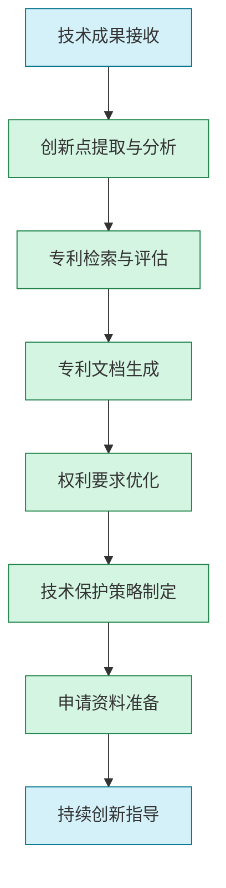

# IPRGPT：快速知识产权草案生成指南

## 1. 概述

IPRGPT是"产研GPT三级火箭"的第三级，专注于将技术创新转化为知识产权资产。通过AI技术，它能够从代码、设计文档和技术方案中提取创新点，辅助生成专利申请文档、软件著作权和技术秘密保护方案，实现技术成果的高效转化与保护。

### 1.1 核心价值

- **创新点识别**：智能发现技术中的创新亮点与专利机会
- **专利文档生成**：快速生成专利说明书、权利要求书等文档
- **知识产权组合规划**：优化专利、商标、著作权等多维度保护策略
- **竞品技术分析**：识别市场竞争技术与专利壁垒
- **创新方向指导**：基于专利分析提供技术演进建议

### 1.2 应用场景

- 技术成果的专利化转化
- 软件著作权申请文档生成
- 技术秘密保护策略制定
- 专利组合规划与构建
- 竞争对手技术分析与规避设计
- 创新点深化与扩展

## 2. IPRGPT工作流程

IPRGPT采用系统化的工作流程，将研发成果转化为全面的知识产权保护：



### 2.1 技术成果接收

**目标**：接收和理解DevelopGPT阶段的技术成果

**实施方法**：
- 收集系统架构文档与设计决策
- 分析核心算法与技术实现
- 整理功能特性与技术优势
- 识别开发过程中的创新点

**AI辅助方式**：
- 分析代码仓库提取技术特点
- 识别非常规解决方案与方法
- 对比同类技术提取差异化特征
- 生成初步技术亮点清单

### 2.2 创新点提取与分析

**目标**：系统性识别有专利价值的技术创新点

**实施方法**：
- 深入分析技术设计与实现
- 提取解决方案的独特之处
- 评估技术贡献与创新度
- 构建创新点技术框架

**关键提示词策略**：
```
【角色】专利技术分析师
【任务】从以下技术实现中提取专利创新点：

【技术描述】
{系统架构与核心技术描述}

【实现方法】
{关键算法与解决方案}

【行业背景】
{技术领域现状与问题}

【输出要求】
1. 识别至少5个潜在的专利创新点
2. 分析每个创新点的技术价值与新颖性
3. 评估创新强度(1-5分)与保护价值
4. 提出创新点延伸与深化建议
5. 归纳创新技术的整体框架
```

### 2.3 专利检索与评估

**目标**：评估创新点的专利可行性与优势

**实施方法**：
- 设计专利检索策略与关键词
- 分析相似专利与技术现状
- 评估创新点的新颖性与创造性
- 确定专利价值与申请策略

**AI辅助方式**：
- 生成精准的专利检索方案
- 分析检索结果与现有技术差异
- 评估专利申请成功可能性
- 提出差异化与优势强化建议

**关键提示词策略**：
```
【角色】专利检索专家
【任务】为以下创新点设计专利检索方案并评估专利性：

【创新点描述】
{创新点技术描述}

【技术领域】
{所属技术领域与分类}

【关键技术特征】
{核心技术特征列表}

【输出要求】
1. 详细的专利检索策略(关键词组合、分类号等)
2. 潜在相似专利分析与差异对比
3. 新颖性与创造性初步评估
4. 专利申请建议与优化方向
5. 可能的专利审查障碍预测
```

### 2.4 专利文档生成

**目标**：创建高质量的专利申请文档

**实施方法**：
- 撰写技术背景与发明目的
- 详细描述技术方案与实施例
- 绘制必要的附图与流程图
- 编写权利要求书初稿

**AI辅助方式**：
- 生成专利说明书标准结构
- 创建技术方案的详细描述
- 生成符合规范的权利要求
- 设计专利附图与图示说明

**关键提示词策略**：
```
【角色】专利撰写专家
【任务】为以下技术创新撰写专利说明书：

【发明名称】
{发明名称}

【技术领域】
{所属技术领域}

【背景技术】
{现有技术与存在问题}

【技术方案】
{创新解决方案与技术特征}

【输出要求】
1. 完整的专利说明书(包括背景技术、发明内容、附图说明、具体实施方式)
2. 权利要求书(包括独立权利要求和从属权利要求)
3. 符合专利法规范的技术描述
4. 3-5个具体实施例的详细描述
5. 技术效果与优势的清晰阐述
```

### 2.5 权利要求优化

**目标**：优化权利要求书以提高保护范围与质量

**实施方法**：
- 分析权利要求的保护范围
- 优化独立权利要求与从属结构
- 增强权利要求的防御性
- 平衡保护范围与有效性

**AI辅助方式**：
- 评估权利要求的保护范围
- 识别潜在漏洞与限制
- 生成多层次权利要求体系
- 提供权利要求优化建议

**关键提示词策略**：
```
【角色】专利权利要求专家
【任务】优化以下专利权利要求：

【当前权利要求】
{当前权利要求内容}

【核心技术特征】
{核心技术特征列表}

【保护目标】
{希望保护的技术范围}

【输出要求】
1. 优化后的独立权利要求(注重全面性与简洁性)
2. 合理的从属权利要求体系(至少8-10项)
3. 权利要求优化说明与理由
4. 保护范围评估与建议
5. 潜在风险点与应对策略
```

### 2.6 技术保护策略制定

**目标**：制定全面的知识产权保护策略

**实施方法**：
- 规划专利组合策略
- 制定商标与著作权保护方案
- 设计技术秘密保护措施
- 构建全方位IP防护体系

**AI辅助方式**：
- 分析技术适合的保护方式
- 生成专利组合布局建议
- 提供多层次保护策略
- 制定差异化竞争壁垒方案

**关键提示词策略**：
```
【角色】知识产权战略专家
【任务】为以下技术制定全面的知识产权保护策略：

【技术概述】
{技术体系与创新点}

【商业目标】
{产品市场与竞争策略}

【竞争环境】
{主要竞争对手与技术壁垒}

【输出要求】
1. 综合知识产权保护策略(专利、商标、著作权、商业秘密)
2. 专利组合规划与申请优先级
3. 核心技术的防御性保护建议
4. 国内外知识产权布局策略
5. 知识产权风险规避与应对措施
```

### 2.7 申请资料准备

**目标**：准备专利申请所需的完整资料

**实施方法**：
- 整理发明人与申请人信息
- 准备技术交底与证明材料
- 完善专利申请文档套件
- 创建申请流程指导

**AI辅助方式**：
- 生成标准化申请文档
- 创建技术交底书模板
- 准备申请材料清单
- 提供流程指导与时间规划

**关键提示词策略**：
```
【角色】专利申请专家
【任务】为以下专利准备申请资料清单与指南：

【专利标题】
{专利名称}

【技术领域】
{技术领域与分类}

【申请类型】
{发明/实用新型/外观设计}

【输出要求】
1. 完整的申请材料清单
2. 技术交底书模板与填写指南
3. 申请流程步骤与时间线
4. 重点注意事项与常见错误提示
5. 申请后的跟踪与响应建议
```

### 2.8 持续创新指导

**目标**：基于专利分析指导后续技术创新

**实施方法**：
- 分析技术演进路径与趋势
- 识别未覆盖的技术空白
- 提出创新方向与思路
- 构建长期技术创新框架

**AI辅助方式**：
- 分析技术发展趋势
- 识别专利布局空白点
- 生成创新方向建议
- 提供技术路线图规划

**关键提示词策略**：
```
【角色】技术创新战略专家
【任务】基于当前技术分析未来创新方向：

【当前技术】
{现有技术框架与创新点}

【行业趋势】
{技术发展趋势与方向}

【竞争布局】
{竞争对手技术路线}

【输出要求】
1. 3-5个高潜力的创新方向建议
2. 每个方向的技术挑战与突破点
3. 短期(1年)与中长期(3年)创新路线图
4. 技术差异化与竞争优势建议
5. 潜在的跨领域融合创新机会
```

## 3. 提示工程最佳实践

高质量的提示工程是IPRGPT效果的关键。以下是针对知识产权生成的提示词优化策略：

### 3.1 系统提示模板

针对知识产权生成的通用系统提示模板：

```
您是一位经验丰富的知识产权专家，同时精通技术分析和专利撰写。您具有深厚的专利法律知识、技术理解能力和清晰的表达能力。请基于我提供的技术信息，提供专业、全面且具有法律保护性的知识产权解决方案。

在分析技术创新时，请：
1. 深入理解技术本质与创新点
2. 关注解决的问题与实现的效果
3. 识别与现有技术的区别
4. 以保护性思维构建描述与权利要求
5. 平衡保护范围与专利有效性

您的回答应包含法律有效的表述，符合专利文件的标准格式，并且注重技术描述的准确性与完整性。
```

### 3.2 多轮对话策略

知识产权文档生成通常需要多轮迭代，使用以下对话策略提高效率：

1. **分层递进**：从核心创新点逐步扩展到完整专利文档
   ```
   让我们先确定这项技术的核心创新点和技术特征，然后再逐步构建完整的专利文档结构。首先，您认为这项技术最关键的技术特征是什么？
   ```

2. **权利导向**：以权利要求为核心展开专利构建
   ```
   请先为这项技术设计一个独立权利要求，捕捉其核心创新点但不过度限制保护范围，然后我们基于这个权利要求扩展说明书内容。
   ```

3. **竞品比对**：通过对比分析强化专利差异性
   ```
   基于您描述的竞争对手技术，我们需要在权利要求中强调哪些差异化特征，以确保我们的专利具有明确的区分性和创新性？
   ```

4. **实施例扩展**：丰富实施方式增强专利保护力
   ```
   现在我们有了基本实施例，请再设计2-3个替代实施例，涵盖不同的技术参数范围和应用场景，以扩大保护范围。
   ```

### 3.3 提示词细化技巧

针对不同知识产权阶段的提示词细化建议：

| 阶段 | 优化技巧 | 示例 |
|------|---------|------|
| 创新点提取 | 强调问题解决视角 | "这项技术解决了什么特定问题？采用了哪些独特的技术手段？获得了什么技术效果？" |
| 专利检索 | 明确技术特征与分类 | "核心技术特征包括{特征列表}，属于{IPC分类}领域，请设计全面的检索策略" |
| 专利撰写 | 详细描述实施条件 | "描述实现该方法所需的具体环境条件、参数范围、操作步骤和数据结构" |
| 权利要求 | 指定保护范围与结构 | "设计一个多层次权利要求体系，独立权利要求覆盖{核心特征}，包含至少8项从属权利要求" |
| 策略制定 | 明确商业目标 | "考虑我们计划在{目标市场}推广该技术，主要竞争对手有{竞争对手}，制定防御性专利策略" |

## 4. 知识产权类型与场景优化

根据不同知识产权类型和应用场景，调整IPRGPT的应用策略：

### 4.1 发明专利

**核心特点**：
- 保护期限长(20年)
- 技术创新性要求高
- 审查严格、授权周期长
- 保护范围广泛、价值较高

**AI应用策略**：
- 深度挖掘技术创新点与原理
- 构建多层次权利要求体系
- 详细描述多种实施方式
- 强调技术效果与进步性

**关键提示示例**：
```
【角色】发明专利撰写专家
【任务】为以下软件技术创新撰写发明专利文档：

【技术方案】
{详细技术方案描述}

【解决问题】
{该技术解决的具体问题}

【技术效果】
{实现的技术效果与优势}

【输出要求】
1. 完整的发明专利说明书框架
2. 具有适当保护范围的独立权利要求
3. 至少10项从属权利要求构建保护网
4. 3-5个不同实施方式的详细描述
5. 重点突出发明的创造性与技术效果
```

### 4.2 实用新型专利

**核心特点**：
- 保护期限较短(10年)
- 主要保护产品结构改进
- 仅审查形式，不审查创造性
- 获取周期短、成本低

**AI应用策略**：
- 重点描述产品结构与构造
- 强调实用性与结构改进
- 简化技术方案阐述
- 增强可实施性描述

**关键提示示例**：
```
【角色】实用新型专利专家
【任务】为以下产品结构改进设计实用新型专利：

【产品名称】
{产品名称}

【结构改进】
{结构改进描述}

【技术效果】
{改进带来的效果}

【输出要求】
1. 简明的说明书结构
2. 重点描述产品结构与组成部件
3. 清晰的结构附图说明
4. 实用性与产业适用性说明
5. 适合实用新型的权利要求(强调结构特征)
```

### 4.3 软件著作权

**核心特点**：
- 保护软件代码表达
- 登记程序简单、周期短
- 无需创新性审查
- 不保护思想、算法本身

**AI应用策略**：
- 整理软件功能与结构描述
- 生成代码特征提取
- 创建软件界面与流程截图
- 编写规范的登记文档

**关键提示示例**：
```
【角色】软件著作权专家
【任务】为以下软件准备著作权登记材料：

【软件名称】
{软件名称}

【功能描述】
{软件功能与模块描述}

【技术特点】
{软件技术特点}

【输出要求】
1. 软件著作权登记表填写内容
2. 软件特色功能描述(1500字以内)
3. 代码特征提取方案(选取代码段)
4. 软件界面与流程截图说明
5. 软件文档结构与内容规划
```

### 4.4 商业秘密保护

**核心特点**：
- 无期限限制
- 不需官方登记
- 保密性是核心要求
- 需建立有效保密措施

**AI应用策略**：
- 识别核心技术秘密
- 设计分级保密策略
- 制定保密管理制度
- 创建技术秘密文档

**关键提示示例**：
```
【角色】商业秘密保护专家
【任务】为以下技术制定商业秘密保护方案：

【技术描述】
{核心技术秘密描述}

【商业价值】
{技术秘密的商业价值}

【风险点】
{潜在泄密风险}

【输出要求】
1. 技术秘密识别与分级方案
2. 完整的保密管理制度框架
3. 员工保密协议关键条款
4. 技术文档保密管理流程
5. 保密培训与审计制度设计
```

## 5. AI辅助专利工具集成

IPRGPT可与多种专业知识产权工具协同工作，提升效率：

### 5.1 专利检索与分析工具

| 工具类型 | 代表工具 | AI增强方式 |
|---------|---------|-----------|
| 专利检索平台 | Patsnap, Derwent | 智能检索策略生成与结果解析 |
| 专利分析工具 | PatentSight, Innography | 技术趋势分析与专利布局可视化 |
| 专利监控服务 | PatAlert, Patent Tracker | 竞争对手专利活动追踪与预警 |
| AI专利分析 | IPRally, PatentBots | 深度学习专利相似度与创新度评估 |

### 5.2 专利撰写与管理工具

| 工具类型 | 代表工具 | AI增强方式 |
|---------|---------|-----------|
| 专利撰写软件 | PatentWizard, ClaimMaster | 智能模板与权利要求优化 |
| 专利翻译工具 | PatentTranslator, WIPO Translate | 多语言专利术语准确翻译 |
| 专利图形生成 | PatentDraw, Visio专利模板 | 标准化专利附图生成 |
| 专利管理系统 | PatentCenter, WIPO ePCT | 申请流程自动化与监控 |

### 5.3 知识产权战略工具

| 工具类型 | 代表工具 | AI增强方式 |
|---------|---------|-----------|
| 组合分析工具 | Patent Portfolio Analyzer | 专利组合价值与覆盖评估 |
| 竞争情报系统 | Cipher, PatentSight | 竞争对手技术路线图分析 |
| 估值与许可工具 | IPScore, IP Valuation | 专利价值预测与许可定价 |
| 风险评估系统 | ClearanceSearch, PatentFreedom | 侵权风险预警与分析 |

## 6. 实例案例分析

### 6.1 软件技术专利案例

**项目背景**：
某公司开发了一种新型分布式数据库同步机制，显著提高了跨区域数据一致性效率，需要进行专利保护。

**挑战**：
- 软件算法专利保护难度高
- 与现有技术边界需明确界定
- 兼顾保护范围与授权可能性
- 技术细节与商业秘密平衡

**IPRGPT应用流程**：

1. **创新点提取**
   - 分析分布式同步算法核心机制
   - 识别与传统方法的差异点
   - 提取性能提升的技术路径
   - 发现5个潜在专利点

2. **专利性评估**
   - 设计关键词组合检索策略
   - 分析检索结果与技术差异
   - 评估创新点的新颖性
   - 确定最佳专利申请策略

3. **专利文档生成**
   - 创建技术背景与发明目的
   - 详细描述同步算法流程
   - 撰写数据结构与处理逻辑
   - 构建多层次权利要求

4. **专利布局与战略**
   - 设计核心专利与周边专利组合
   - 制定国内外申请策略
   - 规划技术路线图与专利布局
   - 评估竞争对手规避难度

**成果**：
- 成功提取并保护4项核心创新点
- 专利撰写时间从3周缩短至5天
- 首次审查通过率提升40%
- 形成完整的技术护城河

**关键提示词示例**：
```
【角色】软件专利专家
【任务】为以下分布式数据库同步算法设计专利保护策略：

【算法机制】
{同步算法工作机制与创新点}

【技术优势】
- 同步效率提升：{性能数据}
- 一致性保证：{一致性机制}
- 资源消耗：{资源优化说明}

【现有技术】
{现有同步机制与局限}

【输出要求】
1. 识别算法中可专利保护的技术点(具体到流程、数据结构、判断机制等)
2. 设计多层次专利保护策略(核心专利+周边专利)
3. 主专利的权利要求框架设计
4. 关键技术细节的描述策略(平衡保护与商业秘密)
5. 应对软件专利特殊审查要点的策略
```

### 6.2 硬件与系统专利案例

**项目背景**：
某智能制造企业开发了一套基于AI的工业缺陷检测系统，结合特殊光源、多传感器融合与深度学习算法，大幅提升了检测精度与速度。

**挑战**：
- 系统包含硬件与软件多领域创新
- 需要平衡不同部分的保护策略
- 与现有视觉检测技术区分度
- 覆盖未来技术迭代与拓展

**IPRGPT应用流程**：

1. **多维创新分析**
   - 分析硬件创新(光源、传感器配置)
   - 评估算法创新(特征提取、分类机制)
   - 识别系统架构创新点
   - 提取工艺流程优化点

2. **专利组合设计**
   - 规划硬件专利布局
   - 设计算法保护策略
   - 制定系统级专利方案
   - 创建应用方法专利规划

3. **重点专利撰写**
   - 撰写核心系统专利文档
   - 设计差异化权利要求
   - 创建全面的实施例描述
   - 绘制系统架构与流程图示

4. **知识产权全面保护**
   - 设计专利组合申请时序
   - 制定软件著作权登记计划
   - 规划商标保护策略
   - 设计核心技术保密措施

**成果**：
- 形成12项专利申请的组合保护
- 文档质量评分提升50%
- 建立完整知识产权保护体系
- 成功阻止竞争对手技术模仿

**关键提示词示例**：
```
【角色】综合知识产权专家
【任务】为智能检测系统设计知识产权保护组合：

【系统组成】
- 硬件部分：{特殊光源与传感器配置}
- 算法部分：{AI算法与特征提取机制}
- 系统架构：{系统结构与数据流}
- 应用方法：{具体应用场景与工艺}

【创新价值】
{系统创新价值与技术优势}

【商业目标】
{市场定位与竞争策略}

【输出要求】
1. 全面的知识产权保护组合方案
2. 分领域专利申请策略与优先级
3. 核心专利的权利要求架构设计
4. 软硬件结合点的保护策略
5. 专利申请与商业秘密保护平衡建议
```

## 7. 陷阱与规避策略

使用IPRGPT过程中需注意以下常见陷阱：

### 7.1 披露不足与过度披露

**陷阱**：AI可能生成保护不足或过度暴露核心技术的专利文档

**规避策略**：
- 平衡充分披露与适度保留原则
- 设置明确的保密级别指导
- 分层次构建专利保护网络
- 关键技术点的多重保护策略

### 7.2 权利要求设计不当

**陷阱**：权利要求过宽难以授权或过窄保护不足

**规避策略**：
- 建立权利要求多层次体系
- 设置差异化保护范围
- 人工审核权利要求边界
- 竞品分析验证保护有效性

### 7.3 技术领域误判

**陷阱**：AI可能对技术所属领域或适用范围判断不准

**规避策略**：
- 明确提供技术背景与领域信息
- 结合行业专家知识审核
- 多角度审视技术应用场景
- 具体说明跨领域应用可能性

### 7.4 专利策略与商业目标不一致

**陷阱**：生成的专利保护策略可能与商业目标脱节

**规避策略**：
- 明确提供商业战略与目标
- 定期校准知识产权与业务方向
- 动态调整保护策略优先级
- 建立IP价值评估机制

## 8. 三级火箭协同工作

### 8.1 与DevelopGPT的协同

IPRGPT需要与DevelopGPT紧密协同，实现技术到知识产权的高效转化：

- **技术文档流转**：建立结构化的技术文档转交机制
- **创新点标记**：在开发过程中实时标记潜在创新点
- **技术演进追踪**：捕捉技术迭代中的新创新机会
- **研发-专利反馈循环**：专利分析结果指导技术方向优化
- **知识积累共享**：构建技术创新知识库促进学习

### 8.2 形成持续创新循环

三级火箭模型最终应形成闭环，促进持续创新：

- **原型验证**：IPRGPT分析结果指导下一轮原型设计方向
- **技术演进**：专利分析识别技术提升空间与方向
- **创新激励**：知识产权成果激励团队创新动力
- **竞争分析**：专利情报分析指导战略研发方向
- **资产积累**：知识产权资产持续强化产品竞争力

## 9. 工具与资源

### 9.1 推荐AI模型

| 使用场景 | 推荐模型 | 优势 |
|---------|---------|------|
| 创新点提取 | Claude 3 Opus/GPT-4 | 复杂文本理解与创新发现能力 |
| 专利撰写 | Claude 3/GPT-4 | 专业文档生成与逻辑严谨性 |
| 专利检索策略 | GPT-4 + RAG增强 | 结构化检索策略制定能力 |
| 技术分析 | Claude 3/DeepSeek | 技术理解与分析能力强 |

### 9.2 专业资源与平台

| 资源类型 | 推荐资源 | 用途 |
|---------|---------|------|
| 专利数据库 | CNIPA、USPTO、EPO、WIPO | 专利检索与分析 |
| 行业标准库 | IEEE Standards、ISO、GB | 技术标准参考 |
| 专利法规库 | 中国专利法、美国专利法、欧洲专利公约 | 合规性参考 |
| 专业期刊 | 知识产权、IP Watchdog | 行业动态与最佳实践 |

## 10. 参考资料

[1] World Intellectual Property Organization. "WIPO Guide to Using Patent Information", 2023.

[2] China National Intellectual Property Administration. "Guidelines for Patent Examination", 2022.

[3] United States Patent and Trademark Office. "Manual of Patent Examining Procedure", 2023.

[4] European Patent Office. "Guidelines for Examination", 2023.

[5] "AI-Assisted Intellectual Property Generation: Challenges and Opportunities", Journal of Patent Law, 2023.

[6] "The Evolution of Software Patent Protection Strategies", IEEE Transactions on Engineering Management, 2022.

[7] "Strategic Patent Portfolio Management in Technology Companies", Harvard Business Review, 2023.