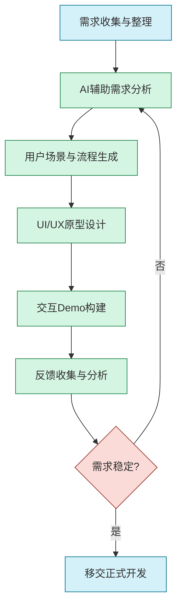

# PrototypeGPT：快速系统原型化指南

## 1. 概述

PrototypeGPT是"产研GPT三级火箭"的第一级，专注于利用大型语言模型和多模态AI能力实现从需求到可演示Demo的快速原型开发过程。它通过AI技术大幅缩短需求理解与原型构建的周期，提升沟通效率并降低前期投资风险。

### 1.1 核心价值

- **需求快速理解与澄清**：降低沟通成本，减少理解偏差
- **交互原型快速构建**：从文字需求到可视化原型的高效转化
- **迭代周期显著缩短**：加速反馈收集与方案优化
- **多方协作效率提升**：促进产品、设计、技术团队的高效协同
- **投资风险早期控制**：在低成本阶段验证产品概念可行性

### 1.2 应用场景

- 新产品概念验证与早期演示
- 现有系统功能增强与改进规划
- 用户体验流程设计与优化
- 客户需求理解与确认
- 跨团队沟通与愿景对齐

## 2. PrototypeGPT工作流程

PrototypeGPT采用迭代式工作流程，充分发挥AI在需求理解和原型生成环节的优势：



### 2.1 需求收集与整理

**目标**：获取并组织原始需求信息

**实施方法**：
- 收集需求文档、竞品分析、用户反馈等原始资料
- 组织结构化问题清单，明确不确定点
- 准备领域术语表和背景资料

**AI辅助方式**：
- 使用AI分析非结构化需求文档，提取关键点
- 生成需求问题清单，标记潜在的模糊点
- 构建需求主题的知识图谱

### 2.2 AI辅助需求分析

**目标**：深入理解需求，消除歧义，形成清晰定义

**实施方法**：
- 与AI交互分析需求的完整性与一致性
- 识别隐含假设与约束条件
- 明确功能优先级与核心价值点

**关键提示词策略**：
```
【角色】需求分析专家
【任务】分析以下需求文档，识别：
1. 核心用户需求与痛点
2. 功能优先级建议
3. 潜在的需求冲突或不清晰之处
4. 隐含的业务规则与约束

【需求文档】
{粘贴需求文档}

【输出格式】请提供结构化分析报告，包含以上各点及建议澄清的问题清单。
```

### 2.3 用户场景与流程生成

**目标**：构建用户旅程、交互流程和核心场景

**实施方法**：
- 定义典型用户角色与特征
- 构建主要用户旅程路径
- 详细描述关键交互场景
- 绘制业务流程图与状态转换图

**AI辅助方式**：
- 自动生成用户角色画像与场景描述
- 构建详细的用户旅程地图
- 生成交互流程图与状态图
- 识别边界条件与异常场景

**关键提示词策略**：
```
【角色】用户体验设计师
【任务】基于以下需求，生成核心用户旅程地图：

【需求概要】
{经过分析的需求概要}

【用户角色】
{目标用户角色清单}

【输出要求】
1. 为每个主要用户角色创建端到端体验旅程
2. 标明每个步骤的目标、触点、痛点和机会
3. 以流程图形式呈现主路径和备选路径
4. 标注关键决策点和潜在的体验问题
```

### 2.4 UI/UX原型设计

**目标**：将用户流程转化为可视化界面设计

**实施方法**：
- 生成关键页面布局与导航结构
- 设计核心UI元素与交互模式
- 构建低保真到中保真原型
- A/B方案对比与评估

**AI辅助方式**：
- 使用多模态模型生成UI线框图
- 根据描述绘制界面布局与元素
- 提供交互设计建议与最佳实践
- 生成多种设计方案供比较

**关键提示词策略**：
```
【角色】UI/UX设计师
【任务】根据以下用户流程，设计关键界面线框图：

【用户流程】
{粘贴用户流程描述}

【页面清单】
1. {页面1名称和功能}
2. {页面2名称和功能}
...

【设计风格】
{产品设计风格简述}

【输出要求】
1. 为每个关键页面提供详细的线框图描述
2. 说明主要UI元素、布局结构和交互模式
3. 提供界面间的导航关系
4. 特别标注创新或差异化的设计点
```

### 2.5 交互Demo构建

**目标**：创建可交互的原型系统演示

**实施方法**：
- 选择合适的原型工具平台
- 构建页面间的导航与交互逻辑
- 实现关键功能的交互效果
- 准备演示脚本与场景

**AI辅助方式**：
- 生成原型工具代码(如Figma,Axure等)
- 提供交互逻辑伪代码与实现建议
- 生成前端实现代码(HTML/CSS/JS)
- 创建演示脚本与用例

**关键提示词策略**：
```
【角色】原型开发专家
【任务】为以下UI设计创建交互原型代码：

【UI设计描述】
{UI设计描述或线框图}

【交互要求】
{描述关键交互行为和效果}

【技术要求】
- 目标平台：{Figma/网页/其他平台}
- 交互层次：{需要实现的交互复杂度}

【输出要求】
1. 提供完整实现代码
2. 解释关键交互实现逻辑
3. 标注需要特别关注的技术点
```

### 2.6 反馈收集与分析

**目标**：获取并分析利益相关者的反馈

**实施方法**：
- 设计有针对性的反馈问题
- 组织演示与反馈会议
- 整合多方意见并分析
- 确定需要调整的优先项

**AI辅助方式**：
- 生成结构化反馈收集模板
- 分析非结构化反馈内容
- 总结反馈主题与模式
- 提出调整建议与优先级

**关键提示词策略**：
```
【角色】用户研究分析师
【任务】设计原型反馈收集问卷并分析以下反馈：

【原型概述】
{原型系统简述}

【目标受众】
{反馈收集的目标群体}

【收集到的反馈】
{已收集的反馈内容}

【输出要求】
1. 结构化反馈问卷设计
2. 反馈主题分类与模式识别
3. 关键问题与机会点分析
4. 建议的优先调整项与理由
```

## 3. 提示工程最佳实践

高质量的提示工程是PrototypeGPT效果的关键。以下是针对原型开发各阶段的提示词优化策略：

### 3.1 系统提示模板

使用一致的系统提示可以显著提升AI输出质量：

```
您是一位经验丰富的产品原型设计专家，精通需求分析、用户体验设计和原型开发。请基于以下信息提供专业、详细且符合现代设计原则的建议。请考虑用户体验、技术可行性和业务目标平衡。回答应具体、实用且适合实际实施。

当我提供需求或设计挑战时，请：
1. 首先确保您理解需求的核心目标和约束
2. 分析潜在的用户需求和使用场景
3. 提供清晰、结构化的解决方案
4. 考虑边缘案例和异常情况
5. 使用专业术语，同时保持表达清晰

请保持回答的实用性和可操作性，避免过于理论化的内容。
```

### 3.2 多轮对话策略

原型设计通常需要多轮迭代，使用以下对话策略提高效率：

1. **逐层深入**：先讨论高层概念，再逐步细化
   ```
   让我们从整体功能架构开始，然后再深入到具体页面设计。首先，您认为这个系统应该包含哪些主要功能模块？
   ```

2. **假设与验证**：提出假设并让AI评估
   ```
   我假设用户会主要通过移动端访问此功能。基于这个假设，UI设计应该如何优化？这个假设合理吗？
   ```

3. **比较多方案**：请求多个备选方案对比
   ```
   请提供两种不同的导航设计方案，并分析各自的优缺点。一种偏向简洁效率，另一种偏向功能完备。
   ```

4. **引导式修改**：明确指出需要改进的方向
   ```
   这个设计很好，但我觉得用户注册流程过于复杂。请简化为最多3个步骤，同时保留必要的信息收集。
   ```

### 3.3 提示词细化技巧

针对不同阶段的提示词细化建议：

| 阶段 | 优化技巧 | 示例 |
|------|---------|------|
| 需求分析 | 明确业务背景和目标 | "这是一个面向{目标用户}的{产品类型}，主要目标是解决{核心问题}" |
| 用户流程 | 提供明确的用户特征 | "主要用户是{年龄段}的{职业}，他们的典型目标是{用户目标}" |
| UI设计 | 明确设计风格与参考 | "设计风格偏向{风格描述}，参考产品有{参考产品}，品牌色为{色彩代码}" |
| 交互原型 | 具体化交互细节 | "当用户点击{元素}时，应该{具体行为}，并显示{反馈方式}" |
| 反馈分析 | 提供结构化反馈内容 | "我们收到的主要反馈包括：{分点列出反馈}，请分析这些反馈的模式" |

## 4. 常见原型类型与AI应用策略

根据不同的原型目标，调整AI应用策略：

### 4.1 概念验证原型 (PoC)

**目标**：验证关键功能可行性与技术路径

**AI应用策略**：
- 使用AI分析技术可行性与实现复杂度
- 生成核心功能流程与技术架构图
- 重点关注差异化功能与创新点
- 快速构建最小可行实现

**关键提示示例**：
```
【角色】技术架构师
【任务】为以下创新功能设计概念验证原型：

【功能描述】
{创新功能描述}

【技术约束】
{技术栈与环境约束}

【输出要求】
1. 最小化可行实现方案
2. 关键技术路径与风险分析
3. 概念验证的评估标准
4. 实现伪代码或关键算法
```

### 4.2 用户体验原型

**目标**：优化用户体验与交互流程

**AI应用策略**：
- 生成多样化的UX方案供比较
- 详细设计关键用户旅程与交互模式
- 创建信息架构与导航体系
- 设计交互元素与反馈机制

**关键提示示例**：
```
【角色】UX设计专家
【任务】优化以下产品的用户体验设计：

【产品描述】
{产品功能与目标}

【用户挑战】
{当前体验痛点}

【输出要求】
1. 信息架构优化方案
2. 关键用户旅程改进设计
3. 交互模式与导航体系设计
4. 低保真线框图表达新体验
```

### 4.3 视觉设计原型

**目标**：展现产品视觉风格与品牌调性

**AI应用策略**：
- 使用多模态模型生成视觉参考与灵感
- 设计色彩方案、字体系统与图标风格
- 创建组件库与设计系统
- 生成高保真界面设计

**关键提示示例**：
```
【角色】UI视觉设计师
【任务】为以下产品创建视觉设计系统：

【产品简介】
{产品定位与目标用户}

【品牌特质】
{品牌形容词与调性描述}

【输出要求】
1. 色彩系统（主色、辅助色、功能色）
2. 排版系统（字体、大小、层级）
3. 组件视觉风格（按钮、卡片、表单等）
4. 关键页面视觉效果描述
```

### 4.4 功能演示原型

**目标**：演示核心功能与产品价值

**AI应用策略**：
- 设计功能演示流程与场景
- 生成演示数据与内容
- 创建引导式用户任务流程
- 设计反馈收集机制

**关键提示示例**：
```
【角色】产品演示专家
【任务】设计以下产品的功能演示原型：

【产品核心功能】
{核心功能清单}

【目标受众】
{演示对象与关注点}

【输出要求】
1. 演示流程设计（3-5分钟最佳）
2. 关键功能演示场景设计
3. 演示数据与内容建议
4. 有效的功能亮点展示方式
```

## 5. AI辅助原型工具集成

PrototypeGPT可与多种现有工具协同工作，提升效率：

### 5.1 设计工具集成

| 工具类型 | 代表工具 | AI增强方式 | 集成提示示例 |
|---------|---------|-----------|------------|
| 线框图工具 | Figma, Sketch | 生成组件代码, 设计建议 | "生成Figma组件代码，实现以下功能：{功能描述}" |
| 原型工具 | Axure, Adobe XD | 交互逻辑设计, 状态流转 | "设计Axure交互原型，包含以下状态：{状态列表}" |
| 流程图工具 | Miro, Lucidchart | 业务流程生成, 决策路径 | "创建用户注册流程的Miro流程图，包含验证逻辑" |
| 设计系统 | Design System | 组件规范, 样式指南 | "根据这个品牌调性，生成设计系统的核心组件规范" |

### 5.2 代码原型工具

| 工具类型 | 代表工具 | AI增强方式 | 集成提示示例 |
|---------|---------|-----------|------------|
| 前端框架 | React, Vue | 组件代码生成, 状态管理 | "生成React函数组件代码，实现以下交互功能：{功能描述}" |
| 低代码平台 | Webflow, Bubble | 配置指导, 逻辑设计 | "提供Webflow实现这个表单验证逻辑的步骤" |
| API模拟 | Postman, MockAPI | 接口定义, 测试数据 | "设计以下功能所需的REST API，包含端点和数据结构" |
| 移动原型 | Flutter, React Native | 跨平台UI代码 | "生成Flutter Widget代码，实现这个自定义列表效果" |

## 6. 实例案例分析

### 6.1 金融科技应用原型

**项目背景**：
某银行需要开发一个针对中小企业的融资申请流程简化应用，旨在将传统的多步骤申请过程数字化，提升体验并降低放弃率。

**挑战**：
- 复杂的业务规则与合规要求
- 多角色参与的审批流程
- 需求方对数字化流程缺乏清晰认知

**PrototypeGPT应用流程**：

1. **需求分析**
   - 输入现有流程文档与痛点调研
   - AI分析并提取关键步骤与决策点
   - 生成数字化后的流程优化建议

2. **用户旅程设计**
   - 为企业主、银行客户经理等角色设计旅程
   - 创建端到端申请流程图
   - 设计异常处理与救援流程

3. **UI/UX原型**
   - 设计移动端与Web端界面
   - 创建表单设计与分步指引
   - 设计文件上传与审核界面

4. **交互原型构建**
   - 使用Figma创建可交互原型
   - 实现条件分支与状态反馈
   - 添加进度追踪与智能提示

**成果**：
- 原型开发周期从6周缩短至1周
- 最终产品审批通过率提升30%
- 用户放弃率下降超过50%
- 需求确认会议减少80%

**关键提示词示例**：
```
【角色】金融流程优化专家
【任务】分析并数字化以下企业融资申请流程：

【现有流程】
{现有申请流程描述}

【痛点清单】
{已识别的痛点与问题}

【合规要求】
{必须遵循的法规与政策}

【输出要求】
1. 优化后的端到端数字流程图
2. 每个步骤的简化建议与数字化方式
3. 关键决策点与自动化潜力分析
4. 用户体验改进重点与效果预估
```

### 6.2 医疗健康应用原型

**项目背景**：
某医疗科技公司需要设计一款患者健康管理应用，连接患者、医生和健康数据，提供个性化健康管理方案。

**挑战**：
- 数据隐私与安全合规要求高
- 多种健康设备数据集成复杂
- 专业信息需通俗化展示给患者

**PrototypeGPT应用流程**：

1. **需求与场景分析**
   - 分析用户健康管理场景与需求
   - 明确不同用户角色的期望与权限
   - 设计数据隐私保护与共享机制

2. **功能架构设计**
   - 构建核心功能模块与关系图
   - 设计数据流转与处理架构
   - 明确API与集成需求

3. **界面与交互设计**
   - 设计直观的健康数据可视化界面
   - 创建医患沟通与提醒机制
   - 设计无障碍适用的操作流程

4. **原型验证与优化**
   - 模拟多角色使用场景测试
   - 收集医生与患者反馈
   - 迭代优化关键功能与流程

**成果**：
- 用户满意度测试提升40%
- 医生采纳意愿提高50%
- 跨平台一致性体验提升
- 开发偏差减少35%

**关键提示词示例**：
```
【角色】医疗产品体验设计师
【任务】设计以下健康管理应用的用户体验：

【产品定位】
{产品定位与目标}

【用户群体】
- 患者：{患者特征与需求}
- 医生：{医生特征与需求}

【数据类型】
{需处理的健康数据类型}

【输出要求】
1. 患者端与医生端信息架构设计
2. 健康数据可视化与交互方案
3. 关键功能流程设计（至少5个）
4. 隐私保护与数据共享机制设计
```

## 7. 陷阱与规避策略

使用PrototypeGPT过程中需注意以下常见陷阱：

### 7.1 需求过度解读

**陷阱**：AI可能对模糊需求做过度解读或假设

**规避策略**：
- 明确标记假设与解读部分
- 设置多个备选方案比较
- 创建假设验证清单
- 定期与利益相关者确认理解

### 7.2 复杂度低估

**陷阱**：AI生成的方案可能低估实现复杂度

**规避策略**：
- 邀请技术专家评估可行性
- 对关键功能进行技术探索
- 制定风险等级评估标准
- 设置复杂度阈值与预警

### 7.3 过度依赖AI创意

**陷阱**：过度依赖AI创意导致产品同质化

**规避策略**：
- 使用AI作为创意启发而非决策者
- 融合人类设计师独特视角
- 建立差异化评估标准
- 强化品牌独特性要求

### 7.4 忽视用户验证

**陷阱**：仅基于AI反馈迭代，缺乏真实用户验证

**规避策略**：
- 设定用户验证必经环节
- 建立真实用户反馈收集机制
- 平衡AI建议与用户反馈
- 使用数据驱动的决策流程

## 8. 原型交付与后续发展

### 8.1 原型交付清单

成功的原型交付应包含以下要素：

- **原型产物**：
  - 可交互的原型系统
  - 线框图与视觉设计资源
  - 用户流程与导航地图
  - 演示脚本与场景

- **设计决策记录**：
  - 关键设计决策与理由
  - 考虑过的备选方案
  - 设计假设与约束
  - 待验证的关键问题

- **验证结果**：
  - 用户测试摘要
  - 利益相关者反馈综述
  - 需求实现对照表
  - 已识别的改进机会

### 8.2 移交给DevelopGPT

PrototypeGPT的成果需无缝对接到"产研GPT三级火箭"第二级DevelopGPT，关注以下要点：

- **产出物标准化**：确保设计规范与组件可被开发团队理解
- **技术可行性确认**：明确标注技术探索结果与实现路径
- **优先级标记**：清晰标记功能实现的优先级与依赖关系
- **验收标准预设**：提前定义功能完成的验收标准
- **技术债务预警**：标记可能形成的技术债务与规避方案

### 8.3 连续改进策略

原型设计是持续迭代的过程，建立以下机制确保持续改进：

- **原型库管理**：建立版本化的原型资产库
- **设计模式积累**：提炼可复用的交互模式与组件
- **AI提示词优化**：记录高效提示词并持续优化
- **跨项目经验传承**：建立设计决策与经验的知识库
- **效果评估体系**：构建原型到产品的效果跟踪机制

## 9. 工具与资源

### 9.1 推荐AI模型

| 使用场景 | 推荐模型 | 优势 |
|---------|---------|------|
| 需求分析与流程设计 | GPT-4/Claude 3 | 强大的理解能力与逻辑推理 |
| UI/UX设计生成 | Midjourney+GPT-4V | 视觉创意与功能描述结合 |
| 交互原型代码 | GitHub Copilot/CodeLlama | 高质量代码生成与补全 |
| 文档与演示生成 | GPT-4/Claude 3 | 结构化内容与表达能力 |

### 9.2 补充工具

| 工具类型 | 推荐工具 | 用途 |
|---------|---------|------|
| 原型设计 | Figma, Sketch, Adobe XD | 专业UI/UX设计与原型制作 |
| 流程图 | Miro, Lucidchart, Draw.io | 流程设计与可视化 |
| 代码原型 | CodePen, JSFiddle, Replit | 快速代码原型与测试 |
| 协作平台 | Notion, Confluence, Airtable | 需求与设计文档管理 |
| 用户测试 | UserTesting, Maze, Hotjar | 原型用户测试与反馈收集 |

## 10. 参考资料

[1] Nielsen Norman Group. "Prototyping: The Comprehensive Guide", 2023.

[2] Cooper, A. "About Face: The Essentials of Interaction Design", 4th Edition.

[3] Knapp, J. "Sprint: How to Solve Big Problems and Test New Ideas in Just Five Days".

[4] AI-Driven Design: Emerging Practices in UX Prototyping. ACM CHI Conference, 2023.

[5] The State of AI Augmented Design. Adobe Design Research, 2023.