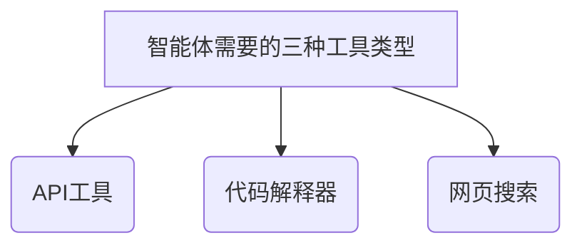
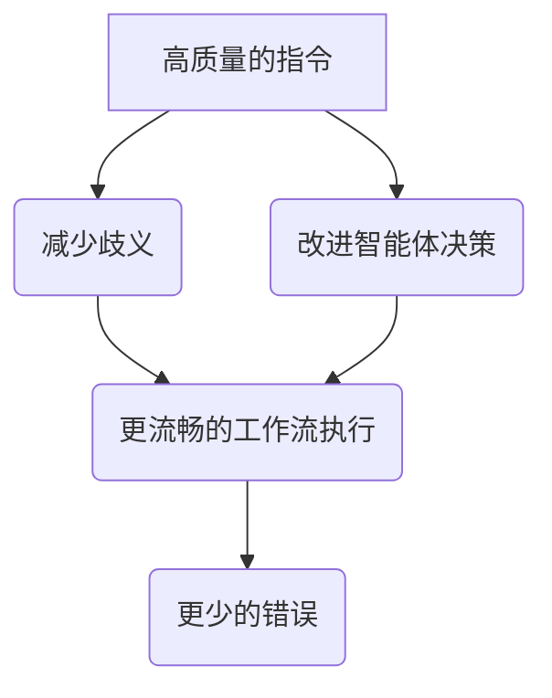
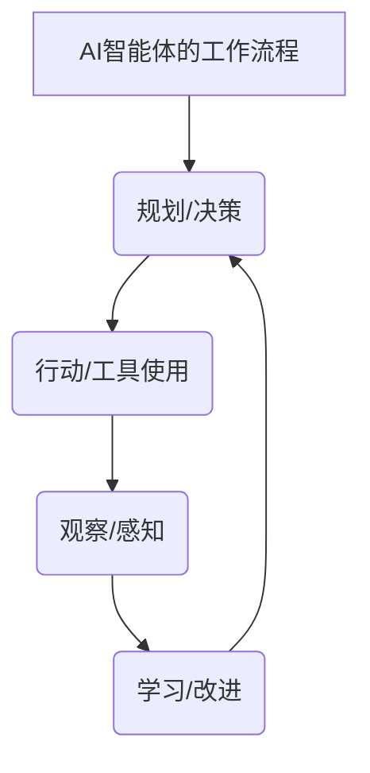
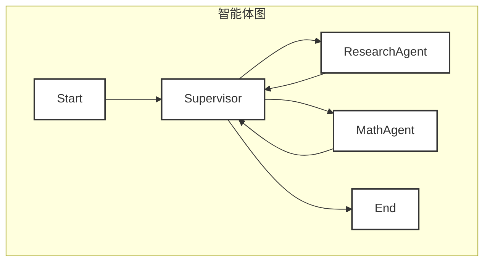
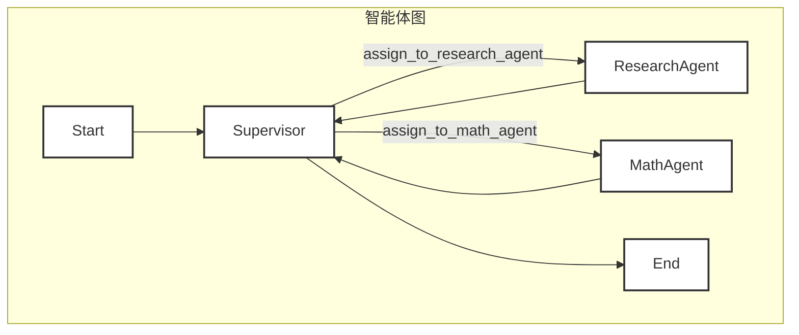

## 1. 导言

在评估智能体能带来价值的领域时，优先考虑那些以前难以自动化、特别是传统方法遇到摩擦的工作流：

* **复杂决策：** 涉及细致判断、例外情况或上下文敏感决策的工作流，例如客户服务工作流中的退款审批。
* **难以维护的规则：** 由于规则集庞大而复杂，导致更新成本高昂或容易出错的系统，例如执行供应商安全审查。
* **严重依赖非结构化数据：** 涉及解释自然语言、从文档中提取意义或与用户进行对话的场景，例如处理房屋保险索赔。

在决定构建智能体之前，请明确验证您的用例是否符合这些标准。否则，确定性解决方案可能就足够了。

## 2. 智能体设计组件

在其最基本的形式中，一个智能体由三个核心组件组成：

1. **模型：** 为智能体的推理和决策提供动力的LLM（大型语言模型）。
2. **工具：** 智能体可以用于执行操作的外部函数或API。
3. **指令：** 定义智能体行为方式的明确指南和护栏。

### 2.1 选择模型

不同的模型在任务复杂性、延迟和成本方面具有不同的优势和权衡。并非所有任务都需要最智能的模型——简单的检索或意图分类任务可能由较小、较快的模型处理，而像决定是否批准退款这样的更困难任务可能受益于更强大的模型。

一个行之有效的方法是，针对每项任务都使用最强大的模型构建智能体原型，以建立性能基线。在此基础上，尝试替换更小的模型，看看它们是否仍能达到可接受的结果。这样，您就不会过早地限制智能体的能力，并且可以诊断出更小的模型何时成功或失败。

总而言之，选择模型的原则很简单：

* 设置评估以建立性能基线。
* 专注于使用现有最佳模型达到您的准确性目标。
* 在可能的情况下，通过用更小的模型替换更大的模型来优化成本和延迟。

**哪种小型模型最适合函数调用？**

**鸣谢：** [https://gorilla.cs.berkeley.edu/leaderboard.html](https://gorilla.cs.berkeley.edu/leaderboard.html)

总是可以从任何开源模型开始，如Llama、Mistral、Qwen、Claude Opus等。

### 2.2 定义工具

函数调用是我们使大型语言模型（LLM）与工具交互的主要方式。您经常会看到“函数”和“工具”互换使用，因为“函数”（可重用的代码块）是智能体执行任务所使用的“工具”。

工具通过使用底层应用程序或系统的API来扩展智能体的能力。对于没有API的遗留系统，智能体可以依靠计算机使用模型直接通过Web和应用程序UI与这些应用程序和系统交互，就像人类一样。每个工具都应具有标准化定义，从而实现工具与智能体之间灵活的多对多关系。文档完善、经过彻底测试且可重用的工具可以提高可发现性，简化版本管理并防止冗余定义。

广义上讲，智能体需要三种类型的工具：




**说明：** 此图描绘了智能体通常需要的API工具、代码解释器和网页搜索工具。

例如，下面是如何在使用Agents SDK时为上述定义的智能体配备一系列工具：

```python
from agents import Agent, WebSearchTool, function_tool
import datetime

@function_tool
def save_results(output):
    # db.insert({"output": output, "timestamp": datetime.datetime.now()}) # Assuming db is defined
    print(f"Saving results: {output} at {datetime.datetime.now()}")
    return "File saved"

search_agent = Agent(
    name="Search agent",
    instructions="Help the user search the internet and save results if asked.",
    tools=[WebSearchTool(), save_results],
)
```

随着所需工具数量的增加，请考虑将任务拆分给多个智能体。

### 2.3 配置指令

高质量的指令对于任何LLM驱动的应用程序都至关重要，但对智能体而言尤为关键。清晰的指令可以减少歧义并改进智能体的决策，从而实现更流畅的工作流执行和更少的错误。




**说明：** 此图表示高质量的指令如何通过减少歧义和改进智能体决策，最终带来更流畅的工作流执行和更少的错误。

您可以使用高级模型，如o1或o3-mini，从现有文档自动生成指令。以下是说明此方法的示例提示：

```
"你是一个文档智能体。你是一名经验丰富的项目经理，擅长将复杂的技术文档提炼成简洁且可操作的指令。你的任务是审查提供的文档，并为AI智能体提取核心指令。确保指令清晰、具体、可执行，并且符合AI智能体的目的。将这些指令封装在一个简明的JSON对象中，键为'instructions'。

文档：[此处是文档内容]
"
```

## 3. 编排

有了基础组件后，您可以考虑编排模式，以使您的智能体能够有效地执行工作流。

多智能体系统可以建模为图，其中智能体表示为节点。在**管理器**和**主管**模式中，边表示工具调用，而在**去中心化**和**群组**模式中，边表示智能体之间转移执行权的**交接**。

AI智能体的工作过程通常遵循以下4个步骤。




**说明：** 此图展示了AI智能体工作的一般四个步骤：规划/决策、行动/工具使用、观察/感知、学习/改进，形成一个循环。

无论采用何种编排模式，都适用相同的原则：保持组件的灵活性、可组合性，并由清晰、结构良好的提示驱动。

主管模式与群组模式的关键区别

在**去中心化**模式中，智能体可以相互“交接”工作流执行。交接是一种单向转移，允许一个智能体委托给另一个智能体。

## 4. 实现：主管模式

创建一个主管智能体来编排多个专业智能体。

```bash
pip install langgraph-supervisor langchain-openai
export OPENAI_API_KEY=<your_api_key>
```

```python
from langchain_openai import ChatOpenAI
from langgraph.graph import START, END
from langchain_community.tools.tavily_search import TavilySearchResults
from langgraph.prebuilt import create_react_agent
from langgraph_supervisor import create_supervisor
from IPython.display import Image, display
import os

# 选择LLM
model = ChatOpenAI(model="gpt-4o", api_key=os.getenv("OPENAI_API_KEY"))

# 定义工具
def add(a: float, b: float) -> float:
    """Add two numbers."""
    return a + b

def multiply(a: float, b: float):
    """Multiply two numbers."""
    return a * b

def divide(a: float, b: float):
    """Divide two numbers."""
    return a / b

tavily_api_key = os.getenv("TAVILY_API_KEY", "your_tavily_api_key")
web_search = TavilySearchResults(max_results=3, tavily_api_key=tavily_api_key)

# 创建工作智能体
research_agent = create_react_agent(
    model=model,
    tools=[web_search],
    name="research_agent",
    prompt=(
        "You are a research agent.\n\n"
        "INSTRUCTIONS:\n"
        "- Assist ONLY with research-related tasks, DO NOT do any math\n"
        "- After you're done with your tasks, respond to the supervisor directly\n"
        "- Respond ONLY with the results of your work, do NOT include ANY other text."
    )
)

math_agent = create_react_agent(
    model=model,
    tools=[add, multiply, divide],
    name="math_agent",
    prompt=(
        "You are a math agent.\n\n"
        "INSTRUCTIONS:\n"
        "- Assist ONLY with math-related tasks\n"
        "- After you're done with your tasks, respond to the supervisor directly\n"
        "- Respond ONLY with the results of your work, do NOT include ANY other text."
    )
)

# 创建主管智能体
supervisor_agent = create_supervisor(
    model=model,
    agents=[research_agent, math_agent],
    prompt=(
        "You are a supervisor managing two agents:\n"
        "- a research agent. Assign research-related tasks to this agent\n"
        "- a math agent. Assign math-related tasks to this agent\n"
        "Assign work to one agent at a time, do not call agents in parallel.\n"
        "Do not do any work yourself."
    ),
    add_handoff_back_messages=True,
    output_mode = "full_history",
).compile()

# display(Image(supervisor_agent.get_graph().draw_mermaid_png()))
# 由于无法直接生成图片，这里用Mermaid描述图的结构
```

**主管模式图**



**说明：** 此图表示一个主管模式的多智能体系统。`Start` 节点开始执行，`Supervisor` 智能体负责协调。`Supervisor` 可以将任务分配给 `ResearchAgent` 或 `MathAgent`。完成任务后，`ResearchAgent` 和 `MathAgent` 都会将控制权交还给 `Supervisor`，然后 `Supervisor` 可以决定下一步操作或结束流程。

我们将使用`pretty_print_messages`帮助函数来美观地渲染流式智能体输出。

```python
from langchain_core.messages import convert_to_messages

def pretty_print_message(message, indent=False):
    pretty_message = message.pretty_repr(html=True)
    if not indent:
        print(pretty_message)
        return

    indented = "\n".join("\t" + c for c in pretty_message.split("\n"))
    print(indented)

def pretty_print_messages(update, last_message=False):
    is_subgraph = False
    if isinstance(update, tuple):
        ns, update = update
        # skip parent graph updates in the printouts
        if len(ns) == 0:
            return

        graph_id = ns[-1].split(":")[0]
        print(f"Update from subgraph {graph_id}:")
        print("\n")
        is_subgraph = True

    for node_name, node_update in update.items():
        update_label = f"Update from node {node_name}:"
        if is_subgraph:
            update_label = "\t" + update_label

        print(update_label)
        print("\n")

        messages = convert_to_messages(node_update["messages"])
        if last_message:
            messages = messages[-1:]

        for m in messages:
            pretty_print_message(m, indent=is_subgraph)
        print("\n")
```

为了测试流程：

```python
def test_supervisor_functionality():
    """Test the supervisor pattern with a specific GDP query to validate handoffs."""
    print(f"Query: find US and New York state GDP in 2024. what % of US GDP was New York state?")
    print("-" * 80)
    try:
        for chunk in supervisor_agent.stream(
            {
                "messages": [
                    {
                        "role": "user",
                        "content": "find US and New York state GDP in 2024. what % of US GDP was New York state?",
                    }
                ]
            },
            subgraphs=False
        ):
            pretty_print_messages(chunk, last_message=True)
        print(f"Test completed successfully")
    except Exception as e:
        print(f"Test failed with error: {str(e)}")
    print("=" * 80)

# Run
if __name__ == "__main__" or True:
    test_supervisor_functionality()
```

**输出：**

```
Query: find US and New York state GDP in 2024. what % of US GDP was New York state?
--------------------------------------------------------------------------------
Update from node supervisor:


================================= Tool Message =================================
Name: transfer_to_research_agent

Successfully transferred to research_agent


Update from node research_agent:


================================= Tool Message =================================
Name: transfer_back_to_supervisor

Successfully transferred back to supervisor


Update from node supervisor:


================================= Tool Message =================================
Name: transfer_to_math_agent

Successfully transferred to math_agent


Update from node math_agent:


================================= Tool Message =================================
Name: transfer_back_to_supervisor

Successfully transferred back to supervisor


Update from node supervisor:


================================== Ai Message ==================================
Name: supervisor
In 2024, New York State's GDP was approximately 8.15% of the US GDP.


Test completed successfully
================================================================================
```

### 4.1 消息历史管理

您可以控制智能体消息如何添加到多智能体系统的整体对话历史中：

**包含智能体的完整消息历史：**

```python
supervisor = create_supervisor(
    agents=[agent1, agent2],
    output_mode="full_history"
)
```

**仅包含最终智能体响应：**


```python
supervisor = create_supervisor(
    agents=[agent1, agent2],
    output_mode="last_message"
)
```

### 4.2 多级层级结构

您可以通过创建一个管理多个主管的主管来创建多级分层系统。

```python
research_team = create_supervisor(
    [research_agent, math_agent],
    model=model,
    supervisor_name="research_supervisor"
).compile(name="research_team")

writing_team = create_supervisor(
    [writing_agent, publishing_agent],
    model=model,
    supervisor_name="writing_supervisor"
).compile(name="writing_team")

top_level_supervisor = create_supervisor(
    [research_team, writing_team],
    model=model,
    supervisor_name="top_level_supervisor"
).compile(name="top_level_supervisor")
```

### 4.3 定制化交接工具

默认情况下，主管使用预构建的`create_handoff_tool`创建的交接工具。您也可以创建自己的自定义交接工具。以下是一些修改默认实现的想法：

* 更改工具名称和/或描述
* 为LLM添加工具调用参数以进行填充，例如下一个智能体的任务描述
* 更改作为交接一部分传递给子智能体的数据：默认情况下，`create_handoff_tool`传递完整的消息历史（到目前为止在主管中生成的所有消息），以及指示成功交接的工具消息。

以下是一个如何将自定义交接工具传递给`create_supervisor`的示例：

```python
from langgraph_supervisor import create_handoff_tool

workflow = create_supervisor(
    [research_agent, math_agent],
    tools=[
        create_handoff_tool(agent_name="math_expert", name="assign_to_math_expert", description="Assign task to math expert"),
        create_handoff_tool(agent_name="research_expert", name="assign_to_research_expert", description="Assign task to research expert")
    ],
    model=model,
)
```

您还可以控制是否将交接工具调用消息添加到状态中。默认情况下，它们是添加的（`add_handoff_messages=True`），但如果您希望历史更简洁，可以禁用此功能：

```python
workflow = create_supervisor(
    [research_agent, math_agent],
    model=model,
    add_handoff_messages=False
)
```

此外，您可以自定义自动生成的交接工具所使用的前缀：

```python
workflow = create_supervisor(
    [research_agent, math_agent],
    model=model,
    handoff_tool_prefix="delegate_to"
)
# 这将创建名为：delegate_to_research_expert, delegate_to_math_expert 的工具
```

以下是自定义交接工具可能的样子：

```python
from typing import Annotated
from langchain_core.tools import tool, InjectedToolCallId
from langgraph.prebuilt import InjectedState
from langgraph.graph import StateGraph, START, MessagesState, END
from langgraph.types import Command
from IPython.display import display, Image

def create_handoff_tool(*, agent_name: str, description: str | None = None):
    name = f"transfer_to_{agent_name}"
    description = description or f"Ask {agent_name} for help."

    @tool(name, description=description)
    def handoff_tool(
        state: Annotated[MessagesState, InjectedState],
        tool_call_id: Annotated[str, InjectedToolCallId],
    ) -> Command:
        tool_message = {
            "role": "tool",
            "content": f"Successfully transferred to {agent_name}",
            "name": name,
            "tool_call_id": tool_call_id,
        }
        return Command(
            goto=agent_name,
            update={**state, "messages": state["messages"] + [tool_message]},
            graph=Command.PARENT,
        )
    return handoff_tool

# 交接
assign_to_research_agent = create_handoff_tool(
    agent_name="research_agent",
    description="Assign task to a researcher agent.",
)

assign_to_math_agent = create_handoff_tool(
    agent_name="math_agent",
    description="Assign task to a math agent.",
)

supervisor_agent = create_react_agent(
    model="openai:gpt-4o-mini",
    tools=[assign_to_research_agent, assign_to_math_agent],
    prompt=(
        "You are a supervisor managing two agents:\n"
        "- a research agent. Assign research-related tasks to this agent\n"
        "- a math agent. Assign math-related tasks to this agent\n"
        "Assign work to one agent at a time, do not call agents in parallel.\n"
        "Do not do any work yourself."
    ),
    name="supervisor",
)

# 定义多智能体主管图
supervisor = (
    StateGraph(MessagesState)
    # 注意: `destinations` 仅用于可视化，不影响运行时行为
    .add_node(supervisor_agent, destinations=("research_agent", "math_agent", END))
    .add_node(research_agent)
    .add_node(math_agent)
    .add_edge(START, "supervisor")
    # 总是返回给主管
    .add_edge("research_agent", "supervisor")
    .add_edge("math_agent", "supervisor")
    .compile()
)

# display(Image(supervisor.get_graph().draw_mermaid_png()))
# 由于无法直接生成图片，这里用Mermaid描述图的结构
```

**自定义交接工具主管图**



**说明：** 此图表示一个使用自定义交接工具的主管模式多智能体系统。`Start` 节点开始执行，`Supervisor` 智能体负责协调。`Supervisor` 可以通过调用 `assign_to_research_agent` 工具将任务分配给 `ResearchAgent`，或通过 `assign_to_math_agent` 工具分配给 `MathAgent`。完成任务后，`ResearchAgent` 和 `MathAgent` 都会将控制权交还给 `Supervisor`，然后 `Supervisor` 可以决定下一步操作或结束流程。

**输出：**

```python
for chunk in supervisor.stream(
    {
        "messages": [
            {
                "role": "user",
                "content": "find US and New York state GDP in 2024. what % of US GDP was New York state?",
            }
        ]
    },
):
    pretty_print_messages(chunk, last_message=True)

final_message_history = chunk["supervisor"]["messages"]
```

```
Update from node supervisor:


================================= Tool Message =================================
Name: transfer_to_research_agent

Successfully transferred to research_agent


Update from node research_agent:


================================== Ai Message ==================================
Name: research_agent

- US GDP in 2024: Approximately $28.18 trillion USD (Statista).
- New York State GDP in 2024: The specific GDP number for New York State in 2024 has not been directly located, but relevant forecasts are provided in the state assembly reports.

For calculations regarding the percentage of the US GDP that New York State comprises, specific figures would need to be sourced.


Update from node supervisor:


================================= Tool Message =================================
Name: transfer_to_math_agent

Successfully transferred to math_agent


Update from node math_agent:


================================== Ai Message ==================================
Name: math_agent
5.93%


Update from node supervisor:


================================== Ai Message ==================================
Name: supervisor

In 2024, the approximate GDP of the United States is $28.18 trillion USD. New York State's GDP is estimated to be around $1.671 trillion USD. Therefore, New York State contributes about 5.93% of the total US GDP.
```

我们已经获得了上面的`final_message_history`。现在，让我们检查一下完整的消息历史：

```python
for message in final_message_history:
    message.pretty_print()
```

**输出：**

```
================================ Human Message =================================

find US and New York state GDP in 2024. what % of US GDP was New York state?
================================== Ai Message ==================================
Name: supervisor
Tool Calls:
transfer_to_research_agent (call_9Innk7roc0BYXdvTnvljH267)
Call ID: call_9Innk7roc0BYXdvTnvljH267
Args:
{}
================================= Tool Message =================================
Name: transfer_to_research_agent

Successfully transferred to research_agent
================================== Ai Message ==================================
Name: research_agent
Tool Calls:
tavily_search_results_json (call_6rXCVDfY6Rg9FiWHsxbyBxQG)
Call ID: call_6rXCVDfY6Rg9FiWHsxbyBxQG
Args:
query: US GDP 2024 forecast
tavily_search_results_json (call_hAsCKkl3tMIFwixTTp7eh0zt)
Call ID: call_hAsCKkl3tMIFwixTTp7eh0zt
Args:
query: New York state GDP 2024 forecast
================================= Tool Message =================================
Name: tavily_search_results_json

[{"title": "GDP forecast U.S. 2034 - Statista", "url": "https://www.statista.com/statistics/216985/forecast-of-us-gross-domestic-product/", "content": "[](https://www.statista.com/statistics/216985/forecast-of-us-gross-domestic-product/#statisticContainer) This graph shows a forecast of the gross domestic product of the United States of America for fiscal years 2024 to 2034. GDP refers to the market value of all final goods and services produced within a country in a given period. According to the CBO, the United States GDP will increase steadily over the next decade from 28.18 trillion U.S. dollars in 2023 to 41.65 trillion U.S. dollars in [...] * [Economy & Politics](https://www.statista.com/markets/2535/economy-politics/)›\n* [Economy](https://www.statista.com/markets/2535/topic/970/economy/)\n\nU.S. GDP forecast 2024-2034\n===========================\n\n Published by \n\n[Abigail Tierney](https://www.statista.com/aboutus/our-research-commitment/3508/abigail-tierney), \n\n Jul 5, 2024 [...] .%20dollars)%C2%A0https://www.statista.com/statistics/216985/forecast-of-us-gross-domestic-product/)[](mailto:?subject=Statista%C2%A0-%C2%A0Forecast%20of%20the%20gross%20domestic%20product%20of%20the%20United%20States%20from%20fiscal%20year%202024%20%20to%20fiscal%20year%202034%20(in%20billion%20U.S.%20dollars)&body=This%20graph%20shows%20a%20forecast%20of%20the%20gross%20domestic%20product%20of%20the%20United%20States%20of%20America%20for%20fiscal%20years%202024%20to%202034", "score": 0.9245858}, {"title": "United States GDP Growth Rate - Trading Economics", "url": "https://tradingeconomics.com/united-states/gdp-growth", "content": "| [GDP from Services](https://tradingeconomics.com/united-states/gdp-from-services) | 17050.50 | 16949.30 | USD Billion | Dec 2024 |\n| [GDP from Transport](https://tradingeconomics.com/united-states/gdp-from-transport) | 730.50 | 721.40 | USD Billion | Dec 2024 |\n| [GDP from Utilities](https://tradingeconomics.com/united-states/gdp-from-utilities) | 350.80 | 341.40 | USD Billion | Dec 2024 | [...] | [GDP from Manufacturing](https://tradingeconomics.com/united-states/gdp-from-manufacturing) | 2406.80 | 2402.80 | USD Billion | Dec 2024 |\n| [GDP from Mining](https://tradingeconomics.com/united-states/gdp-from-mining) | 343.60 | 337.60 | USD Billion | Dec 2024 |\n| [GDP from Public Administration](https://tradingeconomics.com/united-states/gdp-from-public-administration) | 2653.10 | 2635.50 | USD Billion | Dec 2024 | [...] | [Gross Fixed Capital Formation](https://tradingeconomics.com/united-states/gross-fixed-capital-formation) | 4346.50 | 4265.90 | USD Billion | Mar 2025 |\n| [Gross National Product](https://tradingeconomics.com/united-states/gross-national-product) | 23620.90 | 23427.70 | USD Billion | Dec 2024 |\n| [Real Consumer Spending](https://tradingeconomics.com/united-states/real-consumer-spending) | 1.20 | 4.00 | percent | Mar 2025 |", "score": 0.8458536}, {"title": "A post-cycle economy faces greater policy uncertainty", "url": "https://am.jpmorgan.com/us/en/asset-management/adv/insights/market-insights/investment-outlook/us-economic-outlook/", "content": "This year, the economy saw surprisingly robust growth with real GDP on track to expand at a 1.8% annualized rate in the fourth quarter, closing 2024 with 2.3% annual growth, by our estimates. The biggest driver of this strength has been consumer spending, which contributed an average 78% of real GDP growth in the first three quarters. Despite pushing back on high retail prices, a thriftier consumer managed to stretch their budget and still expand their shopping cart. Inflation-adjusted consumer", "score": 0.83290404}]
================================= Tool Message =================================
Name: tavily_search_results_json

[{"title": "Annual State of the City's Economy and Finances 2024", "url": "https://comptroller.nyc.gov/reports/annual-state-of-the-citys-economy-and-finances-2024/", "content": "[[1]](https://comptroller.nyc.gov/reports/annual-state-of-the-citys-economy-and-finances-2024/#_ftnref1) At that time, the Comptroller's Office expected five-year cumulative real GDP growth, 2020 to 2024, of 8.7 percent while the mayor expected 9.5 percent.\n\n[[2]](https://comptroller.nyc.gov/reports/annual-state-of-the-citys-economy-and-finances-2024/#_ftnref2) U.S. Bureau of Labor Statistics Local Area Unemployment Statistics (LAUS). [...] Nationally, the economy is expected to grow by 2.3 percent in 2025, stronger than the 1.6 percent that was last forecast in May, according to the Office of the New York City Comptroller's forecast. Short-term interest rates are projected to decline more rapidly over the next few years, reaching 3 percent by early 2026, while inflation remains near targeted levels. Average wages and overall employment levels in New York City are estimated to have been stronger than had been forecast in 2024. The [...] (constant 2019 dollars)**22,550 15,322 13,596 19,451 21,211 21,096\n**_% change_**(32.1%)(11.3%)43.1%9.0%(0.5%)\n\nSource: NY State Department of Taxation and Finance and Office of the New York City Comptroller", "score": 0.882276}, {"title": "New York by the Numbers Monthly Economic and Fiscal Outlook", "url": "https://comptroller.nyc.gov/newsroom/newsletter/new-york-by-the-numbers-monthly-economic-and-fiscal-outlook-no-101-may-2025/", "content": "| A | Current (2024-25) | Year Earlier (2023-24) | Pre-Pandemic* | E |\n| --- | --- | --- | --- | --- |\n| Jan-24 | 1,335 | 1,810 | 1,307 | |\n| Feb-24 | 1,937 | 1,292 | 1,316 | |\n| Mar-24 | 1,641 | 1,232 | 884 | |\n| Apr-24 | 1,360 | 929 | 947 | |\n| May-24 | 652 | 1,377 | 1,020 | |\n| Jun-24 | 665 | 1,200 | 1,265 | |\n| Jul-24 | 529 | 905 | 1,232 | |\n| Aug-24 | 516 | 754 | 935 | |\n| Sep-24 | 355 | 805 | 806 | |\n| Oct-24 | 375 | 844 | 1,026 | |\n| Nov-24 | 431 | 801 | 1,476 | | [...] | 26-Oct-24 | 5.30% | 12.50% |\n| 2-Nov-24 | 9.40% | 6.90% |\n| 9-Nov-24 | 3.40% | 0.30% |\n| 16-Nov-24 | 6.50% | -1.00% |\n| 23-Nov-24 | 5.20% | -1.20% |\n| 30-Nov-24 | -2.90% | -1.10% |\n| 7-Dec-24 | 3.30% | 5.00% |\n| 14-Dec-24 | 3.50% | 6.20% |\n| 21-Dec-24 | -1.80% | 6.70% |\n| 28-Dec-24 | 2.60% | 7.30% |\n| 4-Jan-25 | -5.00% | 2.90% |\n| 11-Jan-25 | -4.90% | 4.70% |\n| 18-Jan-25 | -2.90% | 5.60% |\n| 25-Jan-25 | -5.60% | 2.40% |\n| 1-Feb-25 | -4.60% | 2.40% |\n| 8-Feb-25 | -5.60% | -0.70% | [...] | 6-Jul-24 | -16.10% | -5.40% |\n| 13-Jul-24 | -14.80% | -1.10% |\n| 20-Jul-24 | -11.70% | 0.60% |\n| 27-Jul-24 | -12.40% | 4.40% |\n| 3-Aug-24 | -5.90% | 4.00% |\n| 10-Aug-24 | -2.50% | 0.90% |\n| 17-Aug-24 | -2.80% | -0.50% |\n| 24-Aug-24 | -0.60% | -2.60% |\n| 31-Aug-24 | 0.30% | 0.30% |\n| 7-Sep-24 | 0.70% | 2.80% |\n| 14-Sep-24 | 1.40% | 5.20% |\n| 21-Sep-24 | 2.00% | 6.60% |\n| 28-Sep-24 | 2.70% | 7.30% |\n| 5-Oct-24 | -0.50% | 12.10% |\n| 12-Oct-24 | 4.20% | 14.70% |\n| 19-Oct-24 | 0.10% | 14.80% |", "score": 0.8576849}]
================================== Ai Message ==================================
Name: research_agent
Tool Calls:
tavily_search_results_json (call_WwAmuE7MF6MvQRUPZ7SrBaT3)
Call ID: call_WwAmuE7MF6MvQRUPZ7SrBaT3
Args:
query: New York state GDP 2024 forecast in dollars
================================= Tool Message =================================
Name: tavily_search_results_json

[{"title": "[PDF] New York State Economic and Revenue Report", "url": "https://nyassembly.gov/Reports/WAM/2025economic_revenue/2025_report.pdf?v=1740533306", "content": "New York State Economic Outlook (Percent Change) Actual Estimate Forecast Forecast 2023-24 2024-25 2025-26 2026-27 Employment Percent Change 1.8 1.5 1.0 0.8 Level (Thousands) 9,441.6 9,589.7 9,694.3 9,773.6 Personal Income Percent Change 5.2 5.8 4.6 4.4 Level (Billions) 1,581.5 1,671.1 1,754.9 1,835.0 Total Wages Percent Change 4.2 6.7 4.4 4.0 Level (Billions) 864.0 915.9 964.3 1,005.1 Base Wages Percent Change 5.1 5.4 4.4 4.3 Level (Billions) 764.0 803.1 840.7 876.6 Variable Compensation [...] Sources: Federal Reserve; NYS Assembly Ways and Means Committee staff. NYS ASSEMBLY| U.S. ECONOMIC FORECAST AT A GLANCE| 15 Actual Actual Actual Forecast Forecast 2022 2023 2024 2025 2026 Real GDP 2.5 2.9 2.8 2.4 2.1 Consumption 3.0 2.5 2.8 2.7 2.1 Investment 6.0 0.1 4.0 3.1 3.8 Exports 7.5 2.8 3.2 2.4 1.1 Imports 8.6 (1.2) 5.4 3.5 1.3 Government (1.1) 3.9 3.4 1.5 0.1 Federal (3.2) 2.9 2.5 1.7 0.2 State and Local 0.2 4.4 3.9 1.4 0.1 Personal Income 3.1 5.9 5.5 5.0 4.9 Wages & Salaries 7.8 5.4 [...] three-month moving average of 2.5 million in December 2023 to 872,000 in December 2024. The ratio of job openings to unemployed persons, another key metric for assessing the balance between labor demand and supply, has also steadily declined in recent months. By December 2024, this ratio had dropped to 1.10, down from its peak of 2.03 in March 2022. 24 | U.S. ECONOMIC FORECAST ANALYSIS | NYS ASSEMBLY With diminishing supply shortages in the labor market, growth of labor and other incomes will", "score": 0.83290404}, {"title": "Annual State of the City's Economy and Finances 2024", "url": "https://comptroller.nyc.gov/reports/annual-state-of-the-citys-economy-and-finances-2024/", "content": "(constant 2019 dollars)**22,550 15,322 13,596 19,451 21,211 21,096\n**_% change_**(32.1%)(11.3%)43.1%9.0%(0.5%)\n\nSource: NY State Department of Taxation and Finance and Office of the New York City Comptroller [...] [[1]](https://comptroller.nyc.gov/reports/annual-state-of-the-citys-economy-and-finances-2024/#_ftnref1) At that time, the Comptroller's Office expected five-year cumulative real GDP growth, 2020 to 2024, of 8.7 percent while the mayor expected 9.5 percent.\n\n[[2]](https://comptroller.nyc.gov/reports/annual-state-of-the-citys-economy-and-finances-2024/#_ftnref2) U.S. Bureau of Labor Statistics Local Area Unemployment Statistics (LAUS). [...] | Retail Trade | 301,565 | $56,208 | 14.4 | (0.6) | (5.2) | 2.7 | 2.9 | 2.2 | 2.1 |\n| Leisure & Hospitality | 431,227 | $56,086 | 96.2 | 32.4 | 15.4 | 8.9 | 3.8 | 4.5 | 7.3 |\n| **Total: Low Wage Sectors** | **1,997,491** | **$62,185** | **184.6** | **102.2** | **91.6** | **62.7** | **32.0** | **26.8** | **29.3** |\n| **Total NYC Employment** | **4,485,695** | **$114,294** | **307.7** | **119.9** | **78.1** | **88.0** | **65.1** | **53.2** | **51.4** |", "score": 0.81979275}]
================================== Ai Message ==================================
Name: research_agent

- US GDP in 2024: Approximately $28.18 trillion USD (Statista).
- New York State GDP in 2024: The specific GDP number for New York State in 2024 has not been directly located, but relevant forecasts are provided in the state assembly reports.

For calculations regarding the percentage of the US GDP that New York State comprises, specific figures would need to be sourced.
================================== Ai Message ==================================
Name: supervisor
Tool Calls:
transfer_to_math_agent (call_oaEpCKr9zw496FBNjBB5dujp)
Call ID: call_oaEpCKr9zw496FBNjBB5dujp
Args:
{}
================================= Tool Message =================================
Name: transfer_to_math_agent

Successfully transferred to math_agent
================================== Ai Message ==================================
Name: math_agent
Tool Calls:
divide (call_e6Z
```
