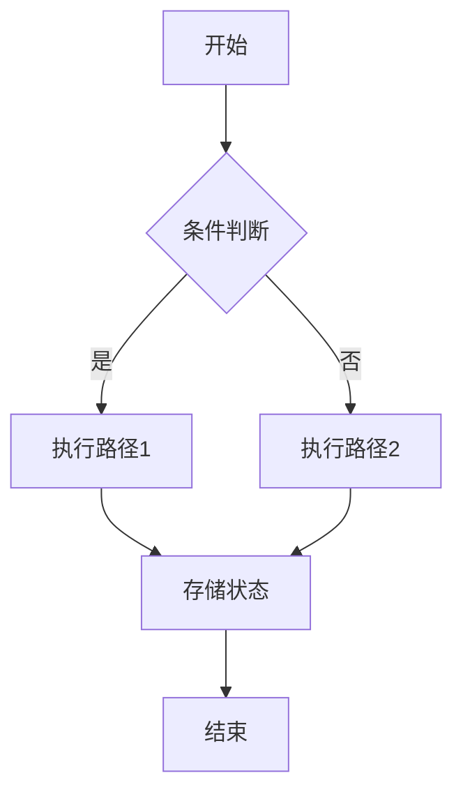
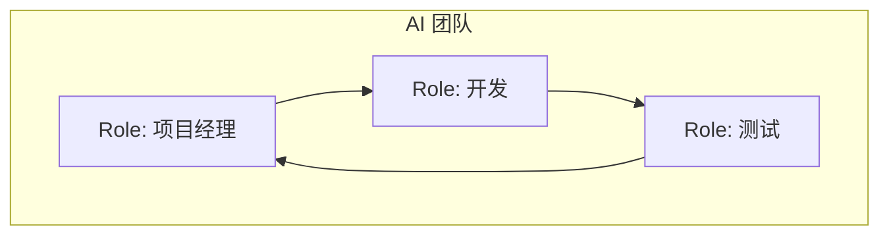
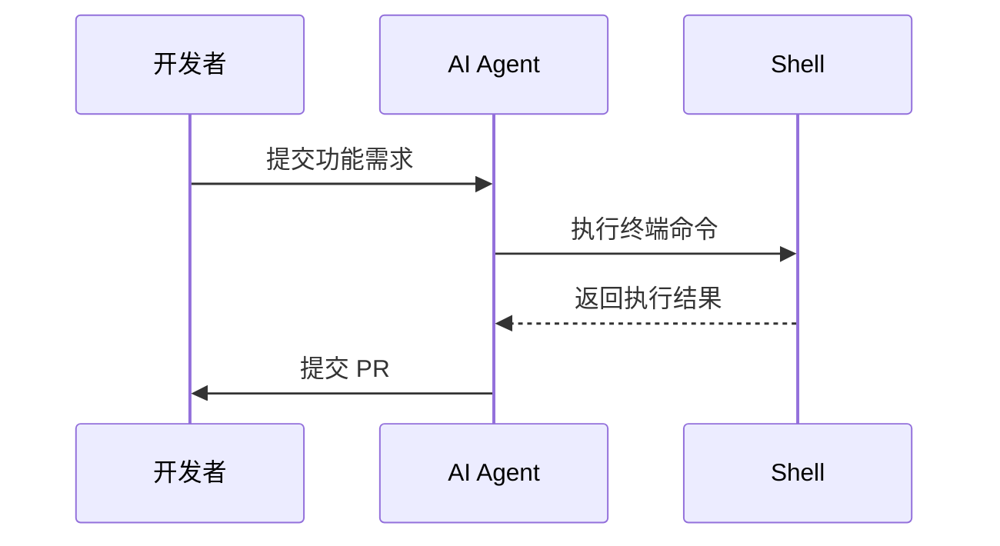
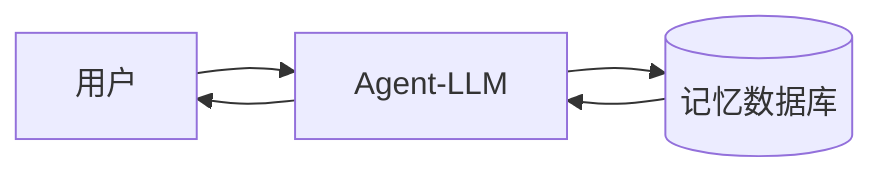
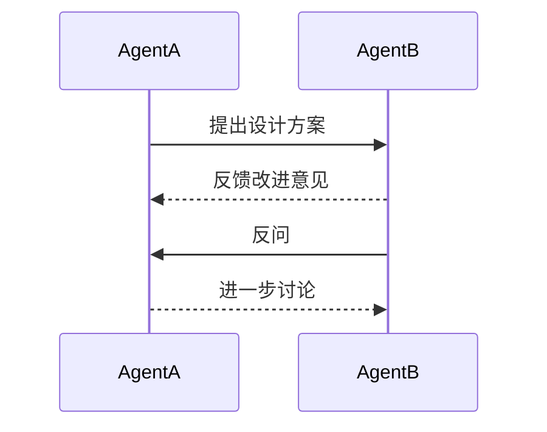
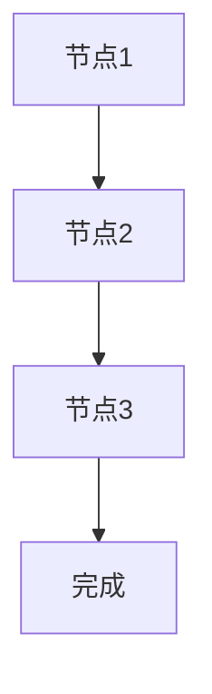
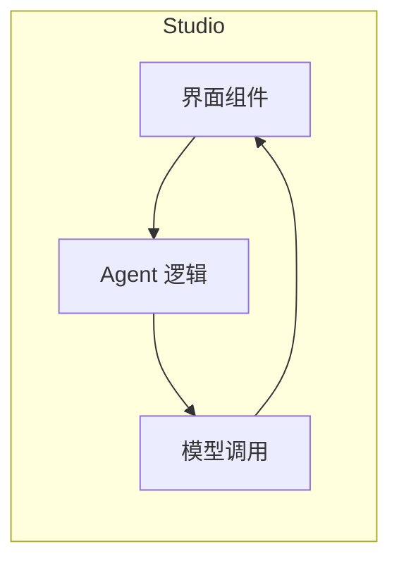
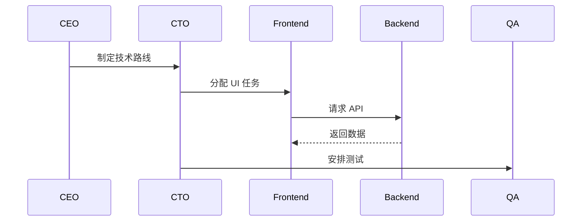

# Top 10 开源工具：构建强大 AI Agent

---

## 1. Superagent

🔍 **是什么**：即插即用的系统，通过 API 部署 AI Agent，快速、简洁，不会让你大脑打结。

💥 **亮点**：

- 几分钟即可完成安装
- 类似于 Zapier + 大语言模型
- 为不想处理复杂基础设施的开发者量身打造

👉 **何时使用**：

- 想要**今天**就快速上线
- 构建需要对话或执行任务的工具

```mermaid
graph LR
  subgraph Superagent 系统
    A[客户端请求] --> B[Superagent API]
    B --> C[LLM 引擎]
    C --> D[任务执行器]
    D --> E[外部服务]
    D --> F[数据库/存储]
  end
````

[GitHub 链接](https://github.com/superagent-ai/superagent?utm_source=chatgpt.com)

---

## 2. AutoGen

🔍 **是什么**：构建可相互对话、分配任务，甚至可邀请人类参与的 AI Agent 团队，就像组建 AI 复仇者联盟。

💥 **亮点**：

* 支持多步骤复杂项目
* 适用于单个 Agent 无法胜任的工作流

👉 **何时使用**：

* 构建比小组项目伙伴更聪明的工具
* 需要 Agent 之间真正协作，而不仅仅是执行

```mermaid
sequenceDiagram
  participant Manager
  participant AgentA
  participant AgentB
  Manager->>AgentA: 分配任务1
  AgentA->>AgentB: 请求协助
  AgentB-->>Manager: 完成子任务
  Manager->>Human: 需要人工审核
  Human-->>Manager: 审核通过
```

[GitHub 链接](https://github.com/microsoft/autogen?utm_source=chatgpt.com)

---

## 3. LangGraph

🔍 **是什么**：像画思维导图一样设计 Agent 工作流，支持暂停、记忆、重启，构建更接近人类思考的系统。

💥 **亮点**：

* 精美的状态管理
* 构建能自适应且不易崩溃的系统

👉 **何时使用**：

* 喜欢可视化思考
* 构建不止一行 Prompt 的复杂 Agent



[GitHub 链接](https://github.com/langchain-ai/langgraph?utm_source=chatgpt.com)

---

## 4. CrewAI

🔍 **是什么**：给多个 Agent 分配角色，让它们处理不同业务或流程，就像更聪明的实习生团队。

💥 **亮点**：

* 超轻量，无臃肿
* Agent 拥有角色、目标和上下文

👉 **何时使用**：

* 构建 AI 团队而非单一机器人
* 需要掌控而不混乱



[GitHub 链接](https://github.com/crewAIInc/crewAI?utm_source=chatgpt.com)

---

## 5. OpenHands

🔍 **是什么**：AI 开发环境，Agent 可以修改代码、运行终端、浏览器调用 API，就像一个不会抱怨的 AI 编程搭档。

💥 **亮点**：

* 真正可用于实际编码任务
* 注重产出而非生成占位文本

👉 **何时使用**：

* 需要 AI 助手编写和运行代码
* 构建面向开发者的工具



[GitHub 链接](https://github.com/All-Hands-AI/OpenHands?utm_source=chatgpt.com)

---

## 6. Agent-LLM

🔍 **是什么**：拥有长期记忆的 Agent，能记住你昨天告诉它的事情。

💥 **亮点**：

* 适合需要长时记忆的任务
* 易于扩展和定制

👉 **何时使用**：

* 厌倦了健忘的聊天机器人
* 需要上下文丰富、动态演进的交互



[GitHub 链接](https://github.com/idosal/AgentLLM?utm_source=chatgpt.com)

---

## 7. CAMEL-AI

🔍 **是什么**：让两个 AI Agent 对话、辩论、模拟工作，甚至设计产品，就像观看 AI 实习生头脑风暴。

💥 **亮点**：

* 研究 Agent 行为的有趣工具
* 实验性强、极具乐趣

👉 **何时使用**：

* 想探索 Agent 思维
* 对研究或混乱感兴趣



[GitHub 链接](https://github.com/camel-ai/camel?utm_source=chatgpt.com)

---

## 8. Flowise

🔍 **是什么**：无需或少量编码即可构建 AI Agent 流程的可视化工具，拖拽即可实现自动化。

💥 **亮点**：

* 最快获得结果的方法
* 优秀的 UI，非编码者友好

👉 **何时使用**：

* 快速原型设计
* 讨厌 YAML 和配置文件



[GitHub 链接](https://github.com/FlowiseAI/Flowise?utm_source=chatgpt.com)

---

## 9. AutogenStudio

🔍 **是什么**：可视化构建多 Agent 团队的工具，Agent 之间对话、解决问题、构建方案。

💥 **亮点**：

* 类似 Figma 的体验融入 Agent
* 无代码与完全控制兼备

👉 **何时使用**：

* 想更容易地进行实验
* 不想为“Hello World”写 200 行代码



[GitHub 链接](https://microsoft.github.io/autogen/stable//index.html?utm_source=chatgpt.com)

---

## 10. ChatDev

🔍 **是什么**：想象一个完全由 AI Agent 运转的初创团队：CEO、CTO、前端、后端开发。

💥 **亮点**：

* 每个 Agent 扮演真实开发角色
* 获得完整的 AI 风格项目构建

👉 **何时使用**：

* 想模拟 AI 如何运营开发公司
* 好奇全栈自主工作



[GitHub 链接](https://microsoft.github.io/autogen/stable//index.html?utm_source=chatgpt.com)


