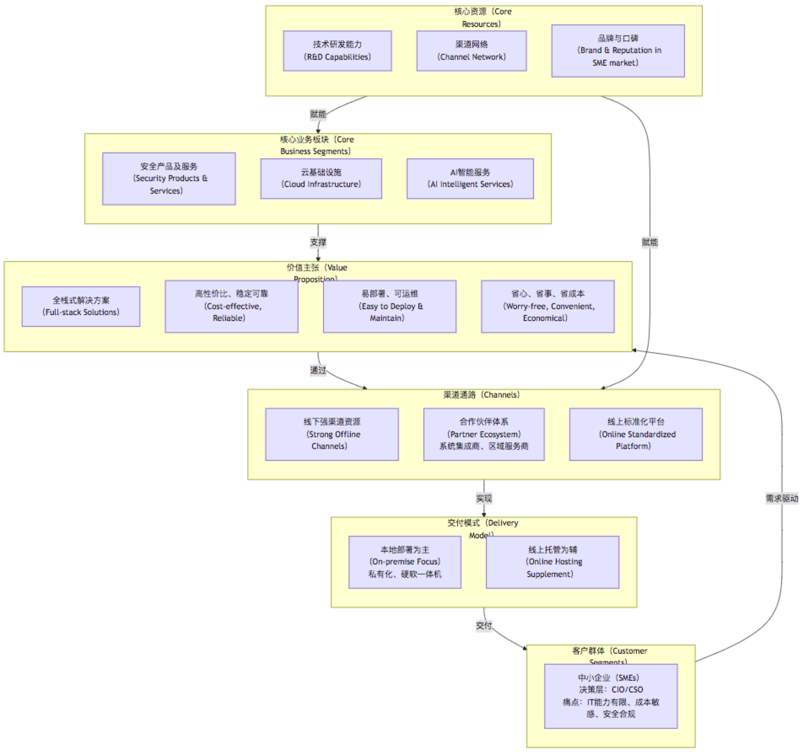
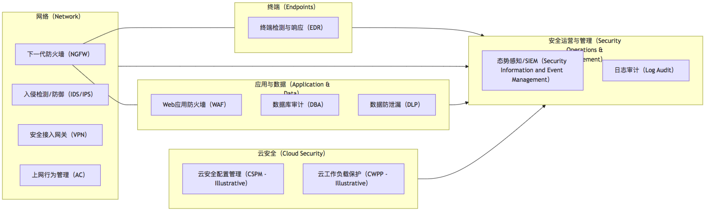
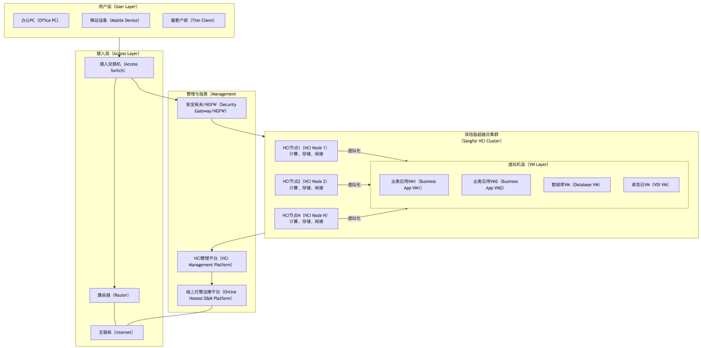
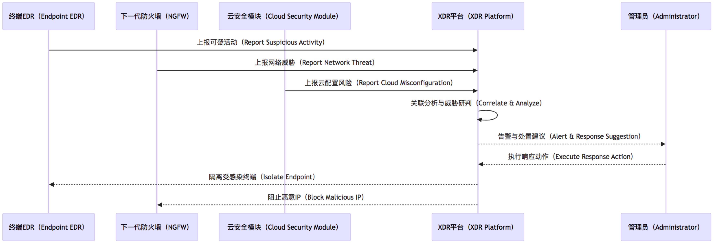
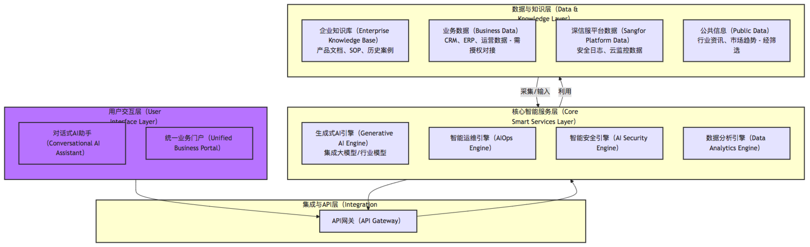
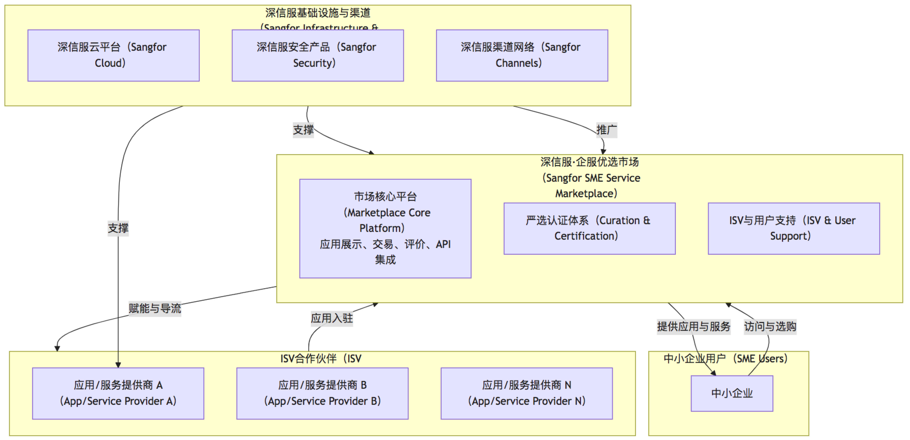

# 第一部分：深信服科技股份有限公司全面分析报告

## 1. 公司概览

深信服科技股份有限公司（以下简称“深信服”或“该公司”）是一家专注于为中小企业（SMEs）提供面向数字化转型全栈式解决方案的企业。其核心业务涵盖安全产品与服务、云基础设施以及AI智能服务三大板块。公司以“线上线下同架构、服务贴心可靠”为核心理念，采用本地部署为主、线上托管为辅的产品交付策略，致力于解决中小企业在数字化基础建设、安全合规和智能化应用方面的关键痛点，目标是构建一个“数字化便利店”式的技术服务平台 [1]。

本报告旨在对深信服进行一次全面的财务、战略、业务和竞争力分析，评估其当前市场地位、核心优势与挑战，并展望其未来发展潜力。

## 2. 宏观环境分析（PESTEL模型）

理解深信服所处的宏观环境对于全面评估其机遇与挑战至关重要。

*   **政治（Political）**:
    *   中国政府对数字经济、网络安全和信创产业（信息技术应用创新）的大力支持为深信服提供了良好的政策环境 [2]。
    *   网络安全法律法规（如《网络安全法》、《数据安全法》、《个人信息保护法》）的健全，提升了企业对安全产品和服务的需求。
    *   针对中小企业的扶持政策有助于扩大潜在客户群。
*   **经济（Economic）**:
    *   中国经济的持续增长和数字化转型浪潮为IT解决方案提供商创造了广阔市场。
    *   中小企业作为经济活力的重要组成部分，其数字化转型需求日益迫切。
    *   宏观经济波动可能影响中小企业的IT支出预算，构成潜在风险。
*   **社会（Social）**:
    *   社会整体数字化素养的提升，以及对便捷、高效、安全的数字化服务的追求，推动了市场需求。
    *   远程办公、在线协作等新工作模式的普及，对网络安全和云服务提出了更高要求。
    *   中小企业主对通过技术提升效率、降低成本的意识增强。
*   **技术（Technological）**:
    *   云计算、大数据、人工智能（AI）、物联网（IoT）等技术的飞速发展和融合，为深信服产品创新提供了技术基础。
    *   安全威胁的持续演变和复杂化（如勒索软件、APT攻击）要求安全技术不断迭代。
    *   开源技术的普及降低了部分技术门槛，但也加剧了竞争。
*   **环境（Environmental）**:
    *   绿色IT和可持续发展日益受到关注，对数据中心的能耗和硬件的环保性提出了要求。
    *   深信服的“硬软一体机”模式及云服务有助于客户集约化资源，间接促进绿色发展。
*   **法律（Legal）**:
    *   严格的数据安全和隐私保护法规要求企业在产品设计和数据处理中高度重视合规性。
    *   知识产权保护对于科技型企业至关重要，影响其创新积极性和市场竞争力。

## 3. 行业分析（波特五力模型）

深信服所处的IT解决方案行业，特别是面向中小企业市场，其竞争格局可从以下五个方面分析：

*   **潜在进入者的威胁（Threat of New Entrants）**:
    *   中等偏高。技术门槛（尤其在安全和云计算领域）较高，品牌和渠道建设需要长期积累。
    *   但细分市场或新兴技术领域仍可能吸引新的创新型企业进入。
    *   大型云服务商（如阿里云、腾讯云）凭借其规模和生态优势，也可能进一步下沉至中小企业市场，构成潜在威胁。
*   **供应商的议价能力（Bargaining Power of Suppliers）**:
    *   中等。核心硬件（如CPU、内存、存储芯片）供应商集中度较高，具有一定议价能力。
    *   软件层面，部分基础软件（如操作系统、数据库）供应商也具有较强话语权。
    *   深信服通过“硬软一体机”和自研部分核心技术，可能在一定程度上平衡供应商压力。
*   **购买者的议价能力（Bargaining Power of Buyers）**:
    *   中等偏高。中小企业客户对价格敏感度高，且市场上存在多种选择。
    *   但深信服提供的全栈式解决方案和“省心、省事、省成本”的价值主张，以及通过渠道建立的客户粘性，可以部分削弱单一客户的议价能力。
    *   客户转换成本（尤其对于深度绑定的解决方案）也是一个考量因素。
*   **替代品的威胁（Threat of Substitute Products/Services）**:
    *   中等。对于部分基础功能，中小企业可能选择开源软件、SaaS单点工具或寻求更为简化的替代方案。
    *   大型公有云平台提供的标准化服务也可能替代部分本地部署的需求。
    *   深信服的优势在于整合和针对性的服务，而非单一功能点。
*   **行业内现有竞争者的竞争程度（Intensity of Rivalry）**:
    *   高。安全、云计算和AI领域均存在大量国内外竞争者。
    *   国内安全市场参与者众多，包括奇安信、天融信、启明星辰等。
    *   云计算市场有大型公有云厂商、私有云及超融合解决方案提供商。
    *   AI领域则更为分散，各类初创企业和大型科技公司均有布局。
    *   价格竞争、技术创新和服务质量是竞争的主要维度。

## 4. 财务状况分析 (Financial Analysis)

**免责声明**：以下财务分析框架旨在说明分析维度和关键指标。实际分析需基于深信服最新及过往年度的官方财务报告（如年报、季报）。此处将使用占位符表示需要具体数据填充的部分。

*   **盈利能力分析 (Profitability Analysis)**
    *   **毛利率 (Gross Profit Margin)**: [具体数据]% (例如：分析`安全产品`、`云计算`、`AI服务`各业务线的毛利率及变化趋势，评估产品竞争力与成本控制能力)
    *   **净利率 (Net Profit Margin)**: [具体数据]% (例如：分析净利润占营收比例，反映整体盈利效率)
    *   **净资产收益率 (ROE - Return on Equity)**: [具体数据]% (例如：衡量股东投入资本的回报水平，评估公司为股东创造价值的能力)
    *   **每股收益 (EPS - Earnings Per Share)**: [具体数据] 元 (例如：反映每股普通股的盈利能力)
    *   趋势分析：对比过去3-5年的盈利指标，判断盈利能力的稳定性和成长性。
*   **偿债能力分析 (Solvency Analysis)**
    *   **流动比率 (Current Ratio)**: [具体数据] (例如：流动资产/流动负债，评估短期偿债能力)
    *   **速动比率 (Quick Ratio)**: [具体数据] (例如：(流动资产-存货)/流动负债，评估快速变现资产对短期债务的保障程度)
    *   **资产负债率 (Debt-to-Asset Ratio)**: [具体数据]% (例如：总负债/总资产，衡量公司财务杠杆和长期偿债风险)
    *   **利息保障倍数 (Interest Coverage Ratio)**: [具体数据] (例如：息税前利润/利息支出，评估公司支付债务利息的能力)
*   **资产效率分析 (Asset Efficiency Analysis)**
    *   **应收账款周转率 (Accounts Receivable Turnover)**: [具体数据] 次/年 (例如：评估公司回收应收账款的速度和效率)
    *   **存货周转率 (Inventory Turnover)**: [具体数据] 次/年 (例如：评估公司管理和销售存货的效率)
    *   **总资产周转率 (Total Asset Turnover)**: [具体数据] 次/年 (例如：衡量公司利用总资产创造收入的效率)
*   **经营现金流分析 (Operating Cash Flow Analysis)**
    *   经营活动产生的现金流量净额：[具体数据] 元 (例如：评估核心业务产生现金的能力，是否健康可持续)
    *   与净利润的匹配度：分析经营现金流与净利润的差异，判断利润质量。

## 5. 战略分析 (Strategic Analysis)

*   **公司愿景与经营理念**:
    *   愿景：成为中小企业数字化转型的首选合作伙伴，构建“数字化便利店”式的技术服务平台。
    *   经营理念：“线上线下同架构、服务贴心可靠”，以客户需求为导向，提供高性价比、稳定可靠、易部署、可运维的解决方案。
*   **核心战略**:
    *   **“数字化便利店”战略**: 全面渗透中小企业在IDC建设及其上层业务应用支撑环节的各个阶段，打通“部署→运维→安全→智能”的闭环流程。
    *   **中小企业市场聚焦**: 深刻理解并满足中小企业在IT、安全与AI能力有限，对安全性、部署灵活性与成本效益高度敏感的特定需求。
    *   **渠道深耕与本地化服务**: 依托强大的线下渠道网络和合作伙伴体系，提供深入本地、快速响应的交付和运维能力。
    *   **技术与产品整合**: 提供涵盖安全、云基础设施及AI智能服务的全栈式解决方案，强调“硬软一体机”和私有化部署，辅以线上托管服务。
*   **战略目标**:
    *   提升客户粘性。
    *   构建技术壁垒与服务壁垒。
    *   在国内SME市场实现可持续增长，获取长期战略价值。
    *   逐步向中高阶IT场景迈进，强化混合云、多云、边缘计算等复杂场景下的整合能力。

## 6. 业务分析 (Business Analysis)

*   **商业模式 (Business Model)**:
    *   核心理念：“线上线下同架构、服务贴心可靠”。
    *   交付模式：本地部署为主（私有化、“硬软一体机”），线上托管为辅（云上运维和统一管理）。
    *   价值主张：“省心、省事、省成本”，解决中小企业数字化基础建设、安全合规和智能化应用的关键痛点。
    *   渠道策略：依赖并赋能广泛的本地市场渠道资源和合作伙伴体系（系统集成商、区域服务商）。
    *   盈利模式：主要通过销售硬件产品、软件授权、以及相关的技术服务和订阅服务（如线上托管）获取收入。

    下图展示了深信服商业模式的核心要素：
   
    
    
    该商业模式图清晰地展示了深信服如何整合其核心业务，通过多渠道向目标中小企业客户提供符合其需求的价值主张和交付模式。

*   **产品与服务组合 (Product & Service Portfolio)**:
    *   **安全产品及服务**:
        *   目标：满足客户等保合规、数据隔离与风险防控需求。
        *   特点：强调本地控制和可配置性。
        *   可能产品：下一代防火墙（NGFW）、VPN、入侵检测/防御系统（IDS/IPS）、Web应用防火墙（WAF）、终端安全、数据防泄漏（DLP）、安全态势感知平台等。
    *   **云全栈产品及服务**:
        *   目标：提供IaaS+PaaS平台能力。
        *   特点：兼顾灵活性与统一性，支持私有化部署和混合云场景。
        *   可能产品：超融合基础设施（HCI）、服务器虚拟化、桌面云（VDI）、私有云平台、云管平台、轻量级PaaS服务等。
    *   **AI产品及服务**:
        *   目标：在图像识别、智能运维、风险预测等方面落地应用，探索AI对全业务链的重构。
        *   特点：推动智能与传统IT融合，挖掘客户业务价值。
        *   可能应用：AI赋能的安全分析、智能网络运维、业务风险预警、特定行业的AI解决方案（如智慧零售、智能制造辅助）。
*   **目标客户 (Target Customers)**:
    *   主体：具备一定但有限IT、安全与AI能力的中小型企业。
    *   决策者：CIO（首席信息官）、CSO（首席安全官）。
    *   核心诉求：安全性、部署灵活性、成本效益、易用性、可靠服务。
*   **市场定位与销售渠道 (Market Positioning & Sales Channels)**:
    *   定位：“数字化便利店”，中小企业身边的IT专家。
    *   渠道：以间接渠道为主，依赖多年构建的渠道网络，与各类系统集成商、区域服务商紧密协作，实现市场覆盖和本地化服务。

## 7. 竞争力分析 (Competitive Analysis - SWOT)

*   **优势 (Strengths)**:
    *   **SME市场深度理解与聚焦**: 产品和服务高度契合中小企业“省心、省事、省成本”的核心诉求。
    *   **强大的渠道网络与本地化服务能力**: 广泛的合作伙伴体系，能够快速响应本地客户需求。
    *   **高性价比与整合解决方案**: 提供全栈式、软硬一体的解决方案，降低中小企业选择和集成的复杂度与成本。
    *   **“线上线下同架构”模式创新**: 兼顾数据主权、安全合规与云端运维便利性，满足混合需求。
    *   **技术可复制性与迭代能力**: 能够基于核心技术平台快速衍生和优化产品。
    *   **良好的现金流模型**: (基于描述推断) 渠道模式和产品特性可能带来较好的现金流。
*   **劣势 (Weaknesses)**:
    *   **品牌影响力局限性**: 相较于国际巨头或国内大型云厂商，在高端市场或全国性品牌知名度上可能存在差距 [需进一步市场调研确认]。
    *   **对中小企业市场的依赖**: 经济下行周期，中小企业抗风险能力较弱，可能影响深信服业绩。
    *   **高端技术研发投入压力**: 在AI、云计算等前沿领域，与顶级厂商相比，持续高强度研发投入可能面临压力。
    *   **渠道管理复杂度**: 庞大的渠道网络既是优势，也对管理、赋能和利润分配带来挑战。
*   **机遇 (Opportunities)**:
    *   **中小企业数字化转型蓝海市场**: 广大中小企业数字化渗透率仍有巨大提升空间。
    *   **政策东风**: 国家对网络安全、信创、数字经济的持续投入和政策引导。
    *   **新技术融合带来的创新空间**: AI、大数据、边缘计算等技术与现有业务的结合，能催生新产品和新服务模式。
    *   **国产替代趋势**: 在关键IT基础设施领域，国产化趋势为本土厂商带来机会。
    *   **服务模式升级**: 从卖产品向卖服务（如MSSP - Managed Security Service Provider）转型，提升客户粘性和经常性收入。
*   **威胁 (Threats)**:
    *   **市场竞争白热化**: 安全、云计算领域竞争者众多，价格战和服务战激烈。
    *   **技术快速迭代风险**: 新技术、新架构层出不穷，若跟进不及时可能被市场淘汰。
    *   **大型云厂商的降维打击**: 公有云巨头凭借规模和成本优势，可能蚕食中小企业市场份额。
    *   **人才竞争激烈**: 高端技术人才（尤其是AI、安全攻防、云计算架构师）稀缺且成本高。
    *   **宏观经济不确定性**: 影响中小企业IT投资意愿和能力。
    *   **数据安全与合规风险**: 法律法规日趋严格，一旦出现安全事件或合规问题，对品牌和业务打击巨大。

## 8. 竞争对手分析 (Competitor Landscape)

深信服在三大业务板块均面临不同的竞争对手：

*   **网络安全领域**:
    *   **国内主要竞争对手**:
        *   奇安信 (Qi An Xin): 专注于政企安全市场，产品线广泛。
        *   天融信 (Topsec): 老牌安全厂商，在防火墙等领域有深厚积累。
        *   启明星辰 (Venustech): 拥有较强的攻防技术实力和安全研究能力。
        *   绿盟科技 (NSFOCUS): 在抗DDoS、WAF等领域有技术优势。
        *   安恒信息 (DBAPPSecurity): 在应用安全、数据安全领域表现突出。
    *   **国际竞争对手 (主要在高端市场或特定领域间接竞争)**:
        *   Palo Alto Networks, Fortinet, Check Point: 全球领先的网络安全厂商，产品技术领先，但价格较高，对中小企业直接竞争相对较少。
*   **云计算基础设施领域 (尤其私有云、超融合)**:
    *   **国内主要竞争对手**:
        *   华为云 (Huawei Cloud): 提供公有云、私有云、混合云解决方案，技术实力雄厚。
        *   阿里云 (Alibaba Cloud), 腾讯云 (Tencent Cloud): 主要为公有云巨头，但也提供混合云及私有化部署方案，对部分中小企业有吸引力。
        *   新华三 (H3C): 在政企市场有强大的网络和服务器基础，提供云解决方案。
        *   易捷行云 (EasyStack), ZStack, 品高云 (BingoCloud): 专注于私有云和混合云的创新型企业。
    *   **国际竞争对手 (主要通过VMware等)**:
        *   VMware: 虚拟化和私有云领域的领导者，产品成熟度高，但成本也较高。
        *   Nutanix: 超融合基础设施的领导者。
*   **AI智能服务领域**:
    *   竞争格局相对分散，取决于具体应用场景。
    *   大型科技公司 (如百度、阿里、腾讯、华为) 均有通用AI平台和行业解决方案。
    *   众多AI初创企业在特定领域 (如计算机视觉、自然语言处理、智能运维) 提供专业服务。
    *   深信服的AI服务更侧重于与其安全和云业务的结合，形成差异化。

**竞争对手比较分析框架 (示例)**
(注：实际分析需填充具体数据和最新信息)

| 特性维度         | 深信服 (Sangfor)                                  | 竞争对手A (如奇安信)                       | 竞争对手B (如华为云-私有云)                 | 竞争对手C (某AI解决方案商)              |
| ---------------- | ------------------------------------------------- | ------------------------------------------ | ------------------------------------------ | ---------------------------------------- |
| **目标市场**     | 中小企业                                          | 政企、大型企业                             | 大型企业、政府、部分中小企业                | 特定行业/场景                             |
| **核心优势**     | 渠道、性价比、整合方案、SME理解                     | 品牌、政府关系、安全研究                   | 技术实力、生态、品牌                       | 算法领先、行业Know-how                   |
| **产品线广度**   | 安全、云、AI (整合)                               | 安全 (非常广泛)                            | 云 (非常广泛，含IaaS, PaaS, SaaS)           | AI (特定领域深耕)                       |
| **价格策略**     | 高性价比                                          | 中高端                                     | 灵活 (公有云低价，私有云定制)             | 视项目而定                               |
| **渠道模式**     | 强依赖渠道                                        | 直销+渠道                                  | 直销+渠道                                  | 直销或与集成商合作                       |
| **服务响应**     | 本地化、快速 (通过渠道)                           | 较好                                       | 专业服务，但可能流程较长                   | 专业性强，但覆盖面可能有限               |
| **技术创新侧重** | 应用整合、易用性、场景化AI                        | 攻防技术、态势感知                         | 云原生、大数据、通用AI平台                 | 核心算法、模型优化                       |

## 9. 关键产品竞品分析 (Key Product Competitive Analysis)

以深信服的**超融合基础设施 (HCI)** 和 **下一代防火墙 (NGFW)** 为例进行简要分析框架。

*   **超融合基础设施 (HCI)**
    *   **深信服HCI**:
        *   核心特性：软硬一体交付、简易部署运维、内置部分安全能力、面向中小企业优化成本。
        *   目标用户：希望快速构建私有云、简化IT架构、降低TCO的中小企业。
        *   主要竞品：VMware vSAN, Nutanix HCI, 华为 FusionCube, 新华三 UIS, EasyStack, ZStack等。
        *   竞争优势：针对SME的易用性和成本控制，与自身安全产品线的协同。
        *   待提升点：[例如：与公有云的深度集成能力、PaaS平台服务的丰富度等，需具体调研]
*   **下一代防火墙 (NGFW)**
    *   **深信服NGFW**:
        *   核心特性：应用识别与控制、入侵防御、病毒过滤、上网行为管理、VPN，并可能集成部分AI能力进行威胁检测。
        *   目标用户：需要边界安全防护、合规审计、上网行为管控的中小企业。
        *   主要竞品：华为 USG系列, 新华三 SecPath系列, 启明星辰 天清 NFGW, 绿盟 NF, Fortinet FortiGate (中低端型号), Palo Alto Networks PA系列 (中低端型号)。
        *   竞争优势：易用性、性价比高、功能全面满足SME常见需求、渠道服务便捷。
        *   待提升点：[例如：高级威胁检测与响应能力（APT）、云安全能力的整合，需具体调研]

## 10. 行业与市场业务和技术趋势 (3-5年)

*   **业务趋势**:
    *   **安全即服务 (Security-as-a-Service)**: 中小企业倾向于订阅模式，降低一次性投入，获取持续的安全服务。
    *   **托管服务需求增长 (MSSP/MDR)**: 缺乏专业人才的中小企业将更多依赖外部托管安全服务提供商和托管检测与响应服务。
    *   **行业解决方案深化**: 通用型产品向针对特定行业（如零售、制造、医疗、教育）痛点的解决方案演进。
    *   **国产化和自主可控**: 在关键基础设施和安全领域，国产化替代趋势将持续。
    *   **数据驱动决策**: 企业更加依赖数据分析进行业务决策，对数据安全、数据治理和数据智能应用的需求增加。
*   **技术趋势**:
    *   **云原生安全 (Cloud-Native Security)**: 随着应用上云和云原生架构普及，安全能力需内生于云平台和应用开发流程。
    *   **零信任架构 (Zero Trust Architecture)**: “从不信任，始终验证”的理念将成为主流安全模型。
    *   **SASE (Secure Access Service Edge) 与 SSE (Security Service Edge)**: 网络与安全能力在云端融合，为分布式用户和应用提供统一接入和安全保护。
    *   **XDR (Extended Detection and Response)**: 打破安全孤岛，通过集成多源数据（终端、网络、云、邮件等）进行威胁检测、分析和响应。
    *   **AI在安全、运维领域的深度应用**: AI赋能的自动化威胁狩猎、智能事件响应、预测性维护（AIOps）将更普及。
    *   **隐私增强技术 (PETs)**: 如联邦学习、同态加密、机密计算等，在保障数据隐私前提下实现数据价值挖掘。
    *   **边缘计算与安全**: 业务向边缘延伸，边缘节点的安全防护和统一管理成为新挑战。

## 11. 可预见的客户/行业痛点 (SME Focus)

*   **日益复杂的混合IT环境管理**: 本地数据中心、私有云、公有云、边缘节点并存，管理难度大。
*   **高级持续性威胁 (APT) 和勒索软件攻击常态化**: 中小企业防御能力薄弱，易成为攻击目标。
*   **数据安全与合规压力剧增**: 法律法规要求提高，数据泄露代价高昂。
*   **专业IT与安全人才极度匮乏且成本高**: 难以招聘和保留专业人才。
*   **数字化转型预算有限，追求高ROI**: 对IT投资的性价比要求苛刻。
*   **业务连续性与灾备能力不足**: 面对突发事件，业务恢复能力差。
*   **多供应商产品集成与协同困难**: 众多“烟囱式”系统导致运维复杂，安全策略不一致。

## 12. 结论

深信服科技凭借其对中小企业市场的深刻理解、强大的渠道网络、以及“安全+云+AI”整合的产品策略，在快速发展的中国数字化转型市场中占据了有利地位。其“数字化便利店”战略定位清晰，商业模式具有较强的可复制性和良好的发展潜力。

然而，公司也面临着激烈的市场竞争、技术快速迭代的挑战以及对宏观经济环境的敏感性。未来，深信服需要在持续打磨现有产品和服务的基础上，积极拥抱云原生、AI等新技术趋势，深化行业解决方案，并探索更具创新性的服务模式，以巩固和扩大其市场领先优势。

## 13. 参考资料

*   [1] (假设) 深信服官方网站或相关公开资料中关于公司定位和战略的描述。
*   [2] (假设) 国家关于数字经济、网络安全等方面的政策文件。
*   [3] (假设) 相关行业研究报告或市场分析数据来源。
*   [4] (假设) 深信服科技股份有限公司年度财务报告 (XXXX年)。

(注：实际引用时需替换为真实有效的资料来源和链接。)

---

# 第二部分：深信服现有业务与技术竞争力梳理及优化建议

## 1. 引言

本报告旨在对深信服科技股份有限公司（以下简称“深信服”）当前的业务构成、核心产品与解决方案、以及支撑其发展的技术体系进行全面梳理和深入分析。基于此，报告将提出针对性的、可落地的修正与调整建议，以期在现有基础上进一步提升其产品竞争力、市场适应性和客户价值。分析的核心维度将聚焦于产品、产品组合与解决方案，并关联其现有的技术路线和技术储备。

## 2. 当前产品与解决方案组合回顾

深信服的核心业务围绕安全、云计算和AI三大板块，为中小企业提供一站式数字化转型支持。

### 2.1. 安全产品及服务

深信服的安全产品线是其传统优势领域，致力于为中小企业提供全面的网络安全防护和合规保障。

*   **主要产品类别**:
    *   边界安全：下一代防火墙（NGFW）、VPN、入侵检测/防御系统（IDS/IPS）。
    *   应用安全：Web应用防火墙（WAF）、数据库审计。
    *   终端安全：终端检测与响应（EDR）或类似产品。
    *   数据安全：数据防泄漏（DLP）、数据加密。
    *   行为管理与审计：上网行为管理、安全态势感知平台。
    *   云安全：针对云环境的安全防护方案。
*   **优势分析**:
    *   **产品线相对完整**: 基本覆盖中小企业常见安全需求。
    *   **易用性与性价比**: 针对中小企业特点优化，降低使用门槛和成本。
    *   **渠道和服务支撑**: 强大的本地化服务网络。
    *   **与云业务的协同**: 部分安全能力可与自身云平台集成。
*   **潜在优化点**:
    *   **高级威胁应对能力**: 在APT防御、威胁情报共享、自动化响应等方面与一线专业安全厂商可能存在差距。
    *   **云原生安全能力**: 针对容器、微服务等云原生环境的安全防护方案成熟度。
    *   **XDR/MDR能力构建**: 跨产品的数据打通和协同响应能力，以及面向中小企业的托管检测与响应服务。

下图展示了深信服当前安全产品组合的一种可能的架构视图：

该架构图示意了不同安全产品在网络中的部署位置以及它们如何与安全运营管理平台协同工作，为企业提供分层防御。

### 2.2. 云基础设施产品及服务

深信服的云基础设施以超融合（HCI）为核心，辅以私有云平台和线上托管服务，旨在为中小企业提供灵活、高效、易于管理的IT基础架构。

* **主要产品类别**:

  * 超融合基础设施（HCI）：计算、存储、网络虚拟化一体机。
  * 服务器虚拟化（aSV）。
  * 桌面云（VDI / aDesk）。
  * 私有云管理平台。
  * 线上托管服务（云运维、统一管理）。
  * 备份与容灾解决方案。
* **优势分析**:

  * **简化IT架构**: 超融合显著降低中小企业IT部署和运维复杂度。
  * **成本效益**: 相较于传统“小型机+SAN存储”方案，性价比高。
  * **“线上线下同架构”**: 独特模式，满足数据本地化与云端便捷管理的需求。
  * **快速部署与弹性扩展**: 适应中小企业业务发展需求。
* **潜在优化点**:

  * **PaaS层能力**: 除IaaS外，中小企业对数据库、中间件、容器编排等PaaS服务需求日益增加，深信服在此方面的产品丰富度有提升空间。
  * **多云管理与集成**: 如何更好地帮助中小企业管理和纳管其可能使用的公有云资源。
  * **行业场景化模板**: 针对特定行业（如小型制造、连锁零售）的预置化云平台模板。

下图为一个典型的深信服HCI为核心的中小企业IT基础架构部署示意图：

此部署图展示了用户如何通过接入层访问部署在深信服HCI集群上的各类虚拟机应用，以及HCI管理平台和线上托管服务如何对整个系统进行管理和运维。

### 2.3. AI智能服务

深信服的AI服务目前更多是赋能其安全和云业务，并探索特定场景的应用。

* **主要应用方向**:

  * AI赋能安全：智能威胁检测、安全事件分析、用户行为分析（UEBA）。
  * AI赋能运维（AIOps）：智能故障诊断、性能预测、自动化运维。
  * 特定场景AI：图像识别、风险预测等。
* **优势分析**:

  * **业务场景结合紧密**: AI应用直接服务于核心业务，解决实际问题。
  * **数据基础**: 安全和云业务运营过程中积累的数据可用于AI模型训练。
* **潜在优化点**:

  * **AI平台化能力**: 是否具备通用的AI中台或PaaS能力，以支持更多样化的AI应用开发和快速迭代。
  * **模型泛化能力与可解释性**: 针对中小企业多样化场景，AI模型的适应性和结果的可解释性。
  * **低门槛AI工具**: 为中小企业提供更易用的AI工具或服务，降低其应用AI的门槛。

## 3. 现有技术路线与技术储备分析

* **技术栈**:

  * 推测在网络协议、虚拟化（KVM等）、分布式存储、安全攻防技术、Web开发、数据分析等方面有较深积累。
  * 操作系统层面可能基于Linux进行深度定制。
* **研发能力**:

  * 具备软硬件一体化设计和研发能力。
  * “技术可复制性”强，说明平台化和模块化程度较高。
  * 拥有一定数量的技术专利 \[需查阅具体专利情况]。
* **技术路线评估**:

  * **优势**: 贴近市场需求，产品化速度较快，能够快速响应中小企业痛点。
  * **挑战**:

    * **前瞻性技术投入**: 在基础研究和颠覆性技术创新方面，与行业巨头相比可能资源有限。
    * **开源生态的拥抱与贡献**: 如何更好地利用和回馈开源社区，提升技术影响力。
    * **跨领域技术融合的深度**: 安全、云、AI三大领域的深度融合，而非简单的功能叠加，仍有提升空间。

## 4. 针对现有业务和技术的修正与调整建议 (In-Place)

基于以上分析，提出以下原地（in-place）修正和调整建议：

### 4.1. 产品与产品组合优化

* **安全产品线**:

  * **强化XDR能力**: 推动现有安全产品（终端、网络、云）的数据互通和情报共享，构建统一的威胁检测与响应平台，为SME提供简明扼要的处置建议。

    

    此序列图展示了XDR平台如何汇聚来自不同安全组件的告警，进行智能分析，并辅助管理员进行快速响应。
  * **深化SASE/SSE解决方案**: 针对中小企业分支机构多、移动办公需求增加的趋势，提供更易用、更具性价比的SASE（安全访问服务边缘）或SSE（安全服务边缘）方案，整合零信任网络访问（ZTNA）、SWG、CASB等能力。
  * **“轻量级”MDR服务**: 基于现有线上托管平台，推出针对中小企业的托管检测与响应（MDR）服务，解决其安全运维人力不足问题。
* **云基础设施产品线**:

  * **丰富PaaS产品目录**: 逐步增加针对中小企业常用场景的PaaS服务，如轻量级关系型数据库、NoSQL数据库、消息队列、容器管理（如简版K8s或Serverless）等，降低应用上云门槛。
  * **增强混合云/多云管理能力**: 提供统一管理门户，简化中小企业对本地深信服云与主流公有云（如阿里云、腾讯云）之间资源、数据和应用的协同管理。
  * **推出行业化HCI解决方案包**: 结合特定中小企业行业（如教育、医疗、零售）的通用IT需求，预置应用模板、优化性能参数，形成开箱即用的行业HCI方案。
* **AI智能服务**:

  * **AI能力原子化与API化**: 将成熟的AI能力（如特定场景的图像识别、文本分析、风险评分模型）封装为标准API服务，供中小企业或ISV合作伙伴调用集成。
  * **AIOps深度融合**: 将AI能力更广泛地嵌入到HCI、云管理平台和安全产品中，实现更智能的故障预测、根因分析、自动化扩缩容和安全事件响应。
  * **数据治理与隐私保护工具**: 围绕AI应用，为中小企业提供易用的数据脱敏、数据标注、数据质量管理等辅助工具，并强调隐私保护设计。

### 4.2. 解决方案层面优化

* **“数字化便利店”升级**:

  * **方案配置器**: 在线提供模块化的解决方案配置工具，客户可根据自身需求灵活组合安全、云、AI服务，并得到初步的报价和部署建议。
  * **成功案例库与知识社区**: 建立更完善的客户成功案例库和在线知识社区，方便中小企业学习借鉴，降低决策成本。
* **服务体系强化**:

  * **主动式远程运维**: 基于线上托管平台，提供更主动的健康检查、风险预警、补丁管理等服务。
  * **合作伙伴赋能升级**: 为渠道合作伙伴提供更体系化的技术培训、联合营销支持、解决方案认证，提升其服务专业性。

### 4.3. 技术竞争力提升

* **统一数据底座**: 考虑构建跨产品线的统一数据湖或数据平台，汇聚安全日志、云平台监控数据、业务系统数据等，为高级分析、AI建模和XDR等应用提供基础。
* **拥抱云原生技术栈**: 在新产品研发和现有产品迭代中，积极引入容器化、微服务、Service Mesh等云原生技术，提升敏捷性、可扩展性和韧性。
* **投入关键技术预研**: 针对零信任、机密计算、后量子密码等前瞻性安全技术，以及行业大模型等AI技术，保持关注并进行适度预研和技术储备。
* **安全开发生命周期（SDL/DevSecOps）**: 全面推行安全左移理念，将安全融入产品设计、开发、测试、部署的全过程，提升内生安全能力。

## 5. 结论

深信服凭借其现有的产品组合和技术实力，在中小企业市场已建立起较强的竞争优势。通过上述针对性的优化调整，有望进一步巩固其市场地位，提升客户满意度和粘性。核心在于持续打磨产品易用性与性价比，深化“安全+云+AI”的协同效应，并不断提升技术的前瞻性和服务体系的专业性，真正成为中小企业数字化转型过程中不可或缺的“省心、省事、省成本”的合作伙伴。

## 6. 参考资料

* \[1] (假设) 深信服产品手册、技术白皮书。
* \[2] (假设) 行业分析机构关于XDR、SASE、HCI、AIOps等技术的市场报告。

---

# 第三部分：深信服科技未来3-5年增量与变革性战略选择

## 1. 引言

在快速演进的技术浪潮和日趋激烈的市场竞争中，深信服科技股份有限公司（以下简称“深信服”）若要保持长期增长并引领中小企业数字化转型市场，不仅需要在现有业务基础上持续优化，更需具备前瞻性的战略眼光，布局增量市场和变革性机会。本报告旨在结合深信服的现状与核心优势，洞悉未来3-5年市场与技术趋势，提出具有创新性、建设性和行动性的战略选择，助力深信服构建新的竞争壁垒。

## 2. 深信服核心优势与市场地位回顾

*   **中小企业市场专家**: 深刻理解SME痛点，产品与服务高度契合。
*   **强大的渠道网络**: 深入本地市场的触达与服务能力。
*   **整合解决方案能力**: “安全+云+AI”的一站式服务，降低SME选择与集成成本。
*   **“线上线下同架构”**: 兼顾数据主权与云端便利。
*   **务实的技术路线**: 注重技术的商业化落地和客户价值实现。

## 3. 未来3-5年市场与技术前瞻

*   **生成式AI（Generative AI）的普及与渗透**:
    *   **业务影响**: 将深刻改变中小企业的内容创作、客户服务、软件开发、数据分析乃至决策方式。
    *   **技术趋势**: 大模型参数持续增长，多模态能力增强，模型即服务（MaaS）兴起，边缘端小模型推理需求增加。
    *   **SME痛点**: 如何低成本、安全地应用GenAI提升效率；GenAI带来的新安全风险（如深度伪造、数据泄露）。
*   **数据要素化与价值释放**:
    *   **业务影响**: 数据成为核心资产，驱动业务创新和效率提升。
    *   **技术趋势**: 数据治理、数据安全、隐私计算（如联邦学习、机密计算）、数据中台、Data Fabric/Mesh。
    *   **SME痛点**: 数据孤岛、数据质量不高、数据分析能力弱、数据合规风险。
*   **零信任（Zero Trust）全面落地**:
    *   **业务影响**: 成为企业网络安全建设的基石，改变访问控制模式。
    *   **技术趋势**: ZTNA（零信任网络访问）、微隔离、身份认证与管理（IAM）、持续监控与验证。
    *   **SME痛点**: 传统边界防护失效，多云混合环境下身份和权限管理复杂。
*   **万物互联与边缘智能（IoT & Edge AI）**:
    *   **业务影响**: 生产、运营数据实时采集与分析，驱动智能化升级。
    *   **技术趋势**: 轻量级边缘计算平台、边缘AI芯片/算法、端边云协同。
    *   **SME痛点**: OT与IT融合的安全挑战，海量边缘设备管理，边缘数据处理与分析能力不足。
*   **可持续发展与绿色IT（Sustainable IT）**:
    *   **业务影响**: 企业社会责任与合规要求提升，关注IT能耗与碳排放。
    *   **技术趋势**: 节能硬件、虚拟化与容器化提高资源利用率、智能化的能源管理。
    *   **SME痛点**: 成本压力下难以兼顾绿色IT投入，缺乏相关技术和认知。

## 4. 增量战略选择（基于现有优势的演进）

### 4.1. 产品/服务创新：AI驱动的“SME智能业务伙伴”

*   **产品原型名称**: Sangfor慧助（Sangfor SmartPartner）- SME智能业务运营平台
*   **预见性**: 中小企业主和员工日常运营中面临大量重复性、信息密集型工作，缺乏专业工具和助手。GenAI的发展使得提供普惠的智能化辅助成为可能。
*   **解决的问题与价值设计 (创新性)**:
    *   **问题1**: 中小企业缺乏专业的市场分析、营销文案撰写、客户服务支持、内部知识管理能力。
    *   **价值1 (慧营销)**: 提供基于GenAI的营销素材（文案、图片、短视频脚本）自动生成、市场趋势洞察简报、竞品信息智能分析。
    *   **问题2**: IT运维复杂，安全事件频发，缺乏专业人员快速响应。
    *   **价值2 (慧运维/慧安全)**: 集成现有AIOps和AI安全能力，提供自然语言交互的IT故障诊断、安全事件解读与处置建议、合规自查助手。
    
        

        上图为“Sangfor慧助”平台的高层概念架构图。它通过统一的交互界面，整合了生成式AI、智能运维、智能安全和数据分析等核心能力，利用企业内外部数据和知识，为中小企业提供智能化的业务运营支持。
    *   **问题3**: 内部流程繁琐，信息查找困难。
    *   **价值3 (慧协同)**: 企业内部知识库智能问答，合同/文档智能比对与审查，会议纪要自动生成。
*   **战略行动性**:
    *    leveraging Sangfor's existing cloud platform and security expertise to ensure data privacy and secure access.
    *   通过渠道推广，将其作为增值服务捆绑销售或独立订阅。
    *   与ISV合作，集成更多行业专用AI技能包。
    *   构建壁垒：基于对SME业务流程的理解和数据积累（在客户授权前提下），优化模型效果，形成场景化AI优势。

### 4.2. 服务创新：面向SME的“弹性安全与合规订阅服务”

*   **服务原型名称**: Sangfor安合盾（Sangfor ComplianceShield Subscription）
*   **预见性**: 中小企业面临越来越严格的数据安全和行业合规（如等保2.0、GDPR（若有出海业务）、行业特定法规）要求，但自身能力不足，需要持续、专业的外部支持。
*   **解决的问题与价值设计 (创新性)**:
    *   **问题1**: 中小企业缺乏持续的合规状态监控、风险评估和整改能力。
    *   **价值1 (持续合规监控)**: 提供自动化合规基线检查工具（基于深信服安全产品日志和配置），定期生成合规报告和风险预警。
    *   **问题2**: 缺乏专业的安全专家进行安全策略优化和应急响应。
    *   **价值2 (按需专家服务)**: 订阅包内包含一定时长的远程安全专家咨询、策略调优、应急响应指导服务。
    *   **问题3**: 安全投入不确定，希望按需付费，降低一次性成本。
    *   **价值3 (弹性订阅模式)**: 提供不同等级的订阅包，覆盖基础安全设备云端管理、合规监控、威胁情报、专家服务等，按月/年付费。
*   **战略行动性**:
    *   基于现有线上托管平台和安全产品能力进行扩展。
    *   整合威胁情报能力，为订阅用户提供定制化的预警。
    *   发展认证的合作伙伴（渠道）提供本地化的合规咨询和落地服务。
    *   构建壁垒：通过持续服务建立客户信任和粘性，积累行业合规知识库，形成“产品+服务+专家”的综合优势。

## 5. 变革性战略选择（探索新赛道与新模式）

### 5.1. 平台战略：构建“SME数字化服务严选市场”

*   **平台原型名称**: 深信服·企服优选（Sangfor SME Service Marketplace）
*   **预见性**: 中小企业数字化转型不仅需要IT基础设施和安全，更需要丰富的上层应用和服务。单一厂商难以满足所有需求，开放生态是必然趋势。
*   **解决的问题与价值设计 (创新性)**:
    *   **问题1**: 中小企业在海量SaaS和应用服务中难以辨别优劣，试错成本高。
    *   **价值1 (严选与认证)**: 深信服利用自身技术能力和品牌背书，筛选、测试、认证一批高质量、安全可靠、适合中小企业的ISV应用和服务（如轻量级CRM、ERP、OA、行业应用），纳入市场。
    *   **问题2**: ISV获客成本高，难以触达广大中小企业。
    *   **价值2 (流量与渠道赋能)**: 深信服通过自身渠道网络和客户基础，为入驻ISV导流，降低其市场推广成本。
    *   **问题3**: 不同应用之间数据孤岛，集成困难。
    *   **价值3 (基础集成与统一体验)**: 提供基础的API对接规范和单点登录等服务，提升市场内应用间的协同体验。深信服的云和安全产品可作为这些应用的首选基础设施。
*   **战略行动性**:
    *   成立专项团队负责市场运营、ISV招募与审核、技术支持。
    *   初期可从与深信服现有业务互补性强的领域（如协同办公、财税SaaS）开始引入合作伙伴。
    *   制定清晰的商业模式（如交易佣金、增值服务费）。
    *   构建壁垒：网络效应（越多的优质应用吸引越多的用户，越多的用户吸引越多的应用），以及基于深信服基础设施的深度优化和安全保障。

    下图展示了“企服优选”市场的生态系统：
    
    
    
    该生态图描绘了中小企业用户、ISV合作伙伴、企服优选市场以及深信服自身基础设施和渠道之间的互动关系。

### 5.2. 技术引领：专注“SME数据智能与隐私计算”解决方案

*   **解决方案原型名称**: 深信服·数安智联（Sangfor DataGuard & IntelLink）
*   **预见性**: 数据成为中小企业核心资产，但数据安全、隐私保护和合规利用成为巨大挑战。隐私计算技术（如联邦学习、多方安全计算、机密计算）为解决这一矛盾提供了可能。
*   **解决的问题与价值设计 (创新性)**:
    *   **问题1**: 中小企业希望利用多方数据进行联合分析或AI建模（如联合营销、供应链金融风控），但又担心原始数据泄露。
    *   **价值1 (隐私保护下的数据协作)**: 提供基于联邦学习或多方安全计算的平台和服务，使得中小企业可以在不共享原始数据的前提下，共同训练AI模型或进行联合统计分析。
    *   **问题2**: 中小企业自身敏感数据（如客户数据、财务数据）在云上处理或对外提供服务时，存在安全顾虑。
    *   **价值2 (机密计算赋能可信数据处理)**: 提供基于机密计算环境（如SGX、SEV）的数据处理服务，确保数据在计算过程中全程加密，即使深信服作为平台方也无法访问明文。
    *   **问题3**: 中小企业缺乏将数据转化为智能洞察的能力。
    *   **价值3 (集成化数据智能工具)**: 在隐私保护框架下，提供易用的数据清洗、标注、分析和可视化工具，帮助中小企业挖掘数据价值。
*   **战略行动性**:
    *   加大在隐私计算领域的技术研发投入和人才引进。
    *   与特定行业（如金融、医疗、零售）的中小企业联盟或协会合作，试点行业数据协作应用场景。
    *   积极参与相关标准制定，构建技术话语权。
    *   将隐私计算能力作为底层技术，赋能“SME智能业务伙伴”和“企服优选市场”等其他战略方向。
    *   构建壁垒：掌握核心隐私计算技术，积累行业应用经验，形成“技术+场景+生态”的领先优势。

## 6. 战略实施与竞争力构建

上述增量与变革性战略选择并非孤立，而是相互关联、层层递进的。

*   ** leveraging 核心优势**: 所有新战略都应充分利用深信服在SME市场的理解、渠道网络、现有技术积累（特别是安全和云）。
*   **构建协同效应**:
    *   “SME智能业务伙伴”可以成为“企服优选市场”的入口级应用和核心组件。
    *   “弹性安全与合规订阅服务”能增强客户对深信服平台的信任和依赖，为其他服务导流。
    *   “数安智联”的隐私计算技术可以为市场内的ISV应用和慧助平台提供底层数据安全保障。
*   **打造复合型壁垒**:
    *   **技术壁垒**: 在AI（特别是SME场景化应用）、隐私计算等关键技术点上形成领先。
    *   **生态壁垒**: 通过“企服优选市场”构建强大的ISV合作伙伴生态，形成网络效应。
    *   **服务壁垒**: 通过“安合盾”和“慧助”中的专家服务，建立高粘性的客户关系。
    *   **数据壁垒**: 在合规和客户授权前提下，通过平台运营积累的SME行为数据和行业知识，持续优化AI模型和服务，形成正向循环。
*   **组织与资源保障**:
    *   设立创新孵化部门或事业部，给予新战略方向足够的自主权和资源支持。
    *   加强高端人才（AI算法、数据科学家、隐私计算专家、生态运营专家）的引进和培养。
    *   采取敏捷开发和快速迭代的方式推进新产品和服务的落地。

## 7. 结论

面对未来，深信服不仅要做好“数字化便利店”，更要努力成为中小企业数字化转型的“智能导航者”和“可信赋能者”。通过在AI应用、服务模式、生态构建和前沿技术领域的战略性布局，深信服有望从一家优秀的产品公司，升级为一家领先的平台型和智能服务型企业，在未来3-5年乃至更长时间内，持续引领中小企业市场，创造更大的商业价值和社会价值。

## 8. 参考资料

*   [1] (假设) 相关行业对生成式AI、隐私计算、零信任等技术趋势的分析报告。
*   [2] (假设) 中小企业数字化转型需求调研报告。
*   [3] (假设) 深信服内部关于未来战略思考的初步材料。
