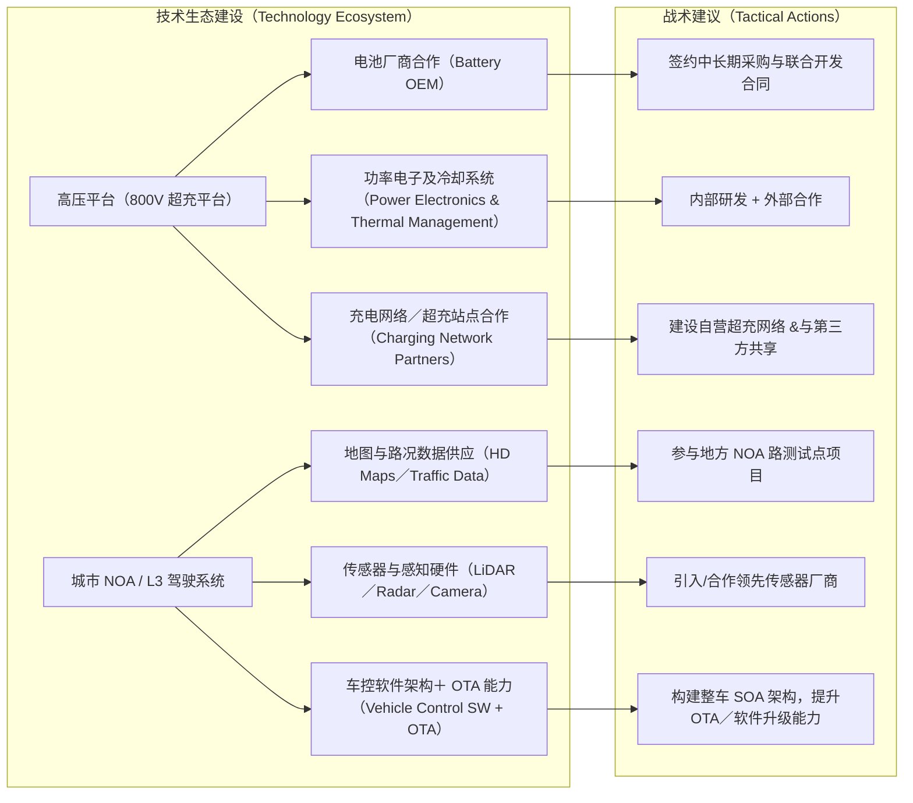

## 一、背景与行业／市场趋势（2025-2030）

### 1. 全球及中国乘用车和商用车市场趋势

* 新能源汽车 (NEV) 在中国市场连续多年增长。2025 年上半年，中国新能源汽车销量同比增长显著，渗透率已超过 40%（乘用车＋商用车合计）。5月新能源汽车月度渗透率在 A、H 股主要车企中约 **55.2％**。([21经济网][1])
* 商用车领域新能源转型加快。2025 年上半年，中国商用车市场销量约为 **212.2 万辆**，同比增长 ~2.6%。其中新能源商用车销量约 **40.2 万辆**，同比增长 ~66.5%。([上海证券报][2])
* 出口与国际化压力与机会并存。一方面，全球贸易环境复杂，经贸摩擦、关税政策、碳边境调节税等因素增加不确定性；另一方面，国内竞争加剧促使头部车企通过设立海外工厂、出口增长来分散风险。([上海证券报][2])

### 2. 技术趋势与客户／行业痛点

* **续航与快充／高压平台**要求提升。消费者对纯电动车的续航里程要求越来越高，同时快充便利性成为购买决策中的关键因素。800V 高压平台、5C 超充、10 分钟补能 400 公里已成为技术竞争方向之一。

* **智能网联与辅助驾驶功能**成为差异化关键。城市 NOA、L3/L3+ 自动驾驶、整车智慧体／智能座舱提升用户体验。法规许可、软件与传感器匹配、路线能力及安全性成为行业痛点。

* **成本与盈利能力压力**增强。原材料（尤其电池材料）、物流、人力、营销及渠道成本不断上升。规模与结构效应成为盈利的关键杠杆。中低端车型利润空间越来越压缩。

* **规制风险与政策导向显著**。政府对补贴政策、排放标准、能耗标准、碳中和目标要求日益严格，城市交通管理与自动驾驶法规不断完善。政策支持（如以旧换新、购车补贴、税收优惠）仍是市场增长重要驱动因素。

* **客户需求变化**。用户越来越关注车辆的全生命周期成本（TCO），包括补能成本、维修保养、软件与服务；品牌体验、科技配置与自动驾驶功能成为影响溢价的要素；共享出行及智能网约车服务推动车型和配置要求变化。

---

## 二、北汽集团（含北汽蓝谷／北汽福田等）现状汇总

### 1. 核心业务板块与产品线

| 业务板块            | 产品与品牌定位                               | 最新进展                                       |
| --------------- | ------------------------------------- | ------------------------------------------ |
| 乘用车（自主新能源与传统燃油） | 极狐（ARCFOX）高端新能源；北京越野系列硬派 SUV；北京品牌面向大众 | 北汽蓝谷作为新能源乘用车核心板块，上半年销量 &营收增长强劲。([雪球股票][3]) |
| 商用车             | 北汽福田为主线，覆盖重卡、轻卡、新能源物流车等； “银河”技术品牌     | 福田新能源商用车销量大幅增长，重卡／轻卡新能源产品推广加快。([财务文件][4])  |
| 合资业务            | 北京奔驰、北京现代等                            | 公开资料中合资业务仍为北汽集团重要收入与利润来源，虽新能源向合资品牌渗透速度略慢。  |
| 创新服务 / 新出行      | 在共享出行、智能驾驶软件／座舱等方面有布局，但目前核心仍在产品和制造端   | 北汽蓝谷报告中提及管理层对未来风险与技术投入的重视。([雪球股票][3])      |

### 2. 财务状况（截至 2025 年上半年）

| 指标            | 北汽蓝谷 /其他板块重要数据                                     | 解读 |
| ------------- | -------------------------------------------------- | -- |
| 销量（新能源乘用车／蓝谷） | 上半年销量约 **67,152 辆**，同比增长约 **139.73%**。([新华网][5])   |    |
| 营业收入（蓝谷）      | 上半年营业收入约 **95.17 亿元**，同比增长约 **154.38%**。([新华网][5]) |    |
| 净利润／亏损情况      | 蓝谷上半年归母净利润约 **−23.08 亿元**，亏损有所收窄。([雪球股票][3])       |    |
| 商用车板块（北汽福田）   | 上半年整体商用车销量及占有率提升，新能源车型销量增长强劲；出口销量稳定增长。([上海证券报][2]) |    |
| 新能源销量（福田轻型车）  | 50,142 辆，同比增长 **151%**，占有率约 **12.5%**。([财务文件][4])  |    |

### 3. 比较优势与劣势

| 优势                                      | 劣势 / 痛点                                   |
| --------------------------------------- | ----------------------------------------- |
| 品牌与资源基础雄厚：拥有多个自主品牌＋合资品牌组合，可覆盖大众、高端与商用市场 | 新能源乘用车板块尚未盈利，需要进一步提升毛利率与成本控制能力            |
| 技术投入与路径明确：800V、高压平台、智能驾驶、整车智慧体等方向已有明确规划 | 技术成果（如 NOA、快速充电平台等）的量产稳定性、法规许可、软件生态尚未完全成熟 |
| 商用车板块在新能源＋出口端增长迅速                       | 出口面临的当地政策、贸易壁垒、物流成本、汇率等不确定因素较多            |
| 政策支持与国内市场基础强：以旧换新、补贴、国家／地方新能源战略有利       | 内部组织效率、渠道网络成本和品牌溢价能力与领先竞争者仍有差距            |

---

## 三、竞争对手与竞品比较

### 1. 国内／国外竞争对手矩阵

| 公司                     | 业务规模／产品线优势                                   | 技术或战略特色                                        | 与北汽的主要差距                                  |
| ---------------------- | -------------------------------------------- | ---------------------------------------------- | ----------------------------------------- |
| 比亚迪                    | 新能源乘用车与商用车双线发力，规模大、盈利稳定；品牌覆盖广                | 电池、电驱系统成熟；智能驾驶，也在快充与平台化方面加速                    | 更强成本控制能力；更成熟的生态与供应链；更大海外市场布局              |
| 吉利、长城、蔚来               | 吉利与长城在细分市场（SUV、家轿等）占据稳定市场份额；蔚来偏向高端用户体验与品牌溢价  | 蔚来在用户服务体验、换电／服务网络方面有特色；吉利在合资＋自主品牌组合中资源丰富       | 北汽在品牌高端形象与用户服务体验方面需加强；在细分定位与产品定位清晰度上有提升空间 |
| 特斯拉、丰田、大众              | 在全球市场已有成熟渠道、品牌与技术积淀；尤其特斯拉在电动＋自动驾驶软件生态具有全球影响力 | 特斯拉的软件 OTA 能力强；大众、丰田在混合动力、氢能源等方面技术深厚           | 北汽与这些品牌比在软件平台、品牌国际影响力、产品出口综合成本还存在间距       |
| 跨界／新势力对手（如华为、小米、宁德时代等） | 在自动驾驶软硬件、智能座舱或电池等环节掌握关键技术 /生态资源              | 它们可能不直接造车或品牌积累较少，但技术组件与生态能力强，可以成为合作方也可能成为潜在竞争者 | 北汽需要在软件生态、平台架构、合作伙伴关系上保持开放与竞争优势，以防被替代或边缘化 |

### 2. 关键产品竞品对比示例：极狐／享界等 vs 比亚迪汉 EV、特斯拉 Model 3 等

以下为竞品维度简表（基于公开参数与市场评价）：

| 产品                 | 续航里程（CLTC 或等效标准）         | 智能驾驶配置／辅助驾驶功能                | 单车售价区间                    | 用户体验／品牌溢价特点                 |
| ------------------ | ------------------------ | ---------------------------- | ------------------------- | --------------------------- |
| 极狐／享界（北汽蓝谷高端新能源车型） | 相对较高，中长续航车型表现好           | 含城市 NOA／高阶辅助驾驶配置（部分车型）       | 较高端，比普通自主品牌定位上浮           | 品牌设计与配置用料重视；但服务网络与用户口碑仍在积累中 |
| 比亚迪汉 EV /高端款式      | 续航普遍在 600-700 公里以上／或等效标准 | 较完善的辅助驾驶 + OTA 更新能力          | 定位相似或稍低；但品牌认知和市场占有率更强     | 服务网络覆盖广；售后支持和补能基础设施更成熟      |
| 特斯拉 Model 3        | 高续航 + 强软件平台 +超级充电网络      | 自动辅助驾驶功能较成熟（如 Autopilot／FSD） | 高端溢价；市场价格高但用户愿意为体验与品牌价值付费 | 品牌号召力强；软件／用户体验标准被视为标杆       |

---

## 四、深度对比：北汽集团 vs 比亚迪

| 对比维度     | 北汽集团近期表现                                               | 比亚迪近期表现                                                     | 差距与学习点                                          |
| -------- | ------------------------------------------------------ | ----------------------------------------------------------- | ----------------------------------------------- |
| 销量与增长率   | 蓝谷新能源乘用车销量同比增长 ~140%；商用车板块新能源销量增长也强劲。([新华网][5])       | 比亚迪销量规模庞大，过去全年度销量几百万台级别增长；盈利能力与现金流强。([AP News][6])          | 北汽在高速增长阶段，但基数较小；比亚迪已实现规模与盈利模型成熟化                |
| 盈利性与成本控制 | 蓝谷亏损但亏损收窄；商用车中新能源车型盈利改善；成本和费用控制已有改善空间但尚未彻底突破           | 比亚迪净利润正，毛利率稳定；在电池、电驱、平台化、供应链上的垂直整合帮助降低单位成本                  | 北汽可加快平台化与零部件自主率提高，提升规模效应；学习比亚迪在电池与能源管理体系上的一体化能力 |
| 技术与生态建设  | 北汽在 L3／NOA、整车智慧体、高压平台等方向已有规划；技术投入大；商用车“银河”品牌等推动技术与品牌整合 | 比亚迪在电池核心材料、快充技术、混动＋纯电双路线的切换能力、软件／OTA 驱动能力较强；在海外建立多个生产基地或合作点 | 北汽需要提升软硬件整合能力，加快软件和服务生态落地；提升国际市场适应性和合规经验        |
| 国际化与市场布局 | 北汽福田出口销量稳定，新产品正在推进海外市场；但乘用车／高端车出口能力与品牌国际认知度还有限         | 比亚迪出口规模扩张速度快，海外市场接受度渐高；海外工厂与合作伙伴在多个市场落地                     | 北汽需加速国际品牌建设与出口能力，同时在地方政策／贸易壁垒、服务本土化等方面增强竞争力     |

---

## 五、关键技术生态建议：以“高压平台＋城市 NOA”组合为核心

为使北汽集团在未来 3-5 年在核心技术与产品竞争中占据更有利位置，针对“高压平台（如 800V 超充）”与“城市 NOA / L3 辅助驾驶能力”生态，可考虑如下策略：

* **供应链与伙伴系统搭建**：与电池、电控、功率电子、冷却系统厂商建立战略联盟或研发合作，以确保高压平台中关键零部件质量与成本可控。
* **充电基础设施同步跟进**：不仅内部车辆性能提升，也需同步推动高速／城市间超充网络建设；同时优化目的地充电、换电／电池租赁等补能方式。
* **法规与安全标准提前布局**：NOA／L3 辅助驾驶功能对应的地方政策、交通法律、试点许可等需提前布局，以减少未来阻碍。
* **软件与数据能力强化**：整车控制软件、OTA 更新能力、地图与路况数据、感知融合等为 NOA 成功落地关键；需加大研发、测试与运营能力。

---

## 六、风险评估与关键不确定性

* 补贴与政策变动风险：若国家／地方补贴政策、税收或购车优惠调整，将直接影响消费需求与销量。
* 成本上涨风险：电池材料（锂、钴、镍等）、稀有资源、运输与能源费用持续波动。
* 技术与质量风险：自动驾驶系统或高压平台若在可靠性、安全性未完全验证前大规模铺开，可能引起召回或信任危机；软件与硬件集成难度大。
* 海外市场风险：关税、贸易摩擦、当地法规／标准、品牌认知、服务网络等是出口与国际化过程中需要克服的障碍。

---

## 七、结论

* 北汽集团在新能源与智能网联化方向的战略定位与投入与行业趋势基本一致，并在商用车和乘用新能源板块已见高速增长迹象。
* 盈利尚未全面实现，但亏损正在收窄；关键在于产品组合优化、成本控制、规模效应、品牌溢价与技术生态成熟度提升。
* 相对于比亚迪等头部竞争者，北汽在规模、伴随平台与零部件自主率、软件与服务生态、国际市场品牌影响力等方面仍有显著差距，但也同时拥有国家背景＋合资资源＋商用车基础等优势可加以利用。

---

## 八、建议方向

* 短期内（1-2 年）：集中突破“乘用新能源盈利性改善”这一环节，通过高端车型拉动 ASP、优化成本、提升销量。
* 中期（3-5 年）：建设强大的技术与软件生态，提升自动驾驶（NOA／L3）能力与高压平台产品竞争力；加快国际市场出口与品牌国际化。

---

## 参考资料

1. 北汽蓝谷新能源科技股份有限公司 2025 年半年度报告；营业收入、销量、亏损等数据。([雪球股票][3])
2. 北汽福田汽车股份有限公司 2025 年半年度报告摘要；商用车销量、出口、重卡／轻卡新能源比重等。([财务文件][4])
3. “A、H 股上市汽车公司 5 月新能源销量”统计数据；北汽蓝谷同比增速等。([21经济网][1])

---

[1]: https://www.21jingji.com/article/20250623/herald/a94a1d876668a45108f3784fc60c9307.html?utm_source=chatgpt.com "【读财报】上市车企5月销量：新能源汽车销量增速超38% 小鹏汽车"

[2]: https://paper.cnstock.com/html/2025-08/28/content_2111830.htm?utm_source=chatgpt.com "北汽福田汽车股份有限公司2025年半年度报告摘要"

[3]: https://stockmc.xueqiu.com/202508/600733_20250816_DS9A.pdf?utm_source=chatgpt.com "[PDF] 北汽蓝谷新能源科技股份有限公司2025 年半年度报告"

[4]: https://file.finance.qq.com/finance/hs/pdf/2025/08/28/1224599676.PDF?utm_source=chatgpt.com "[PDF] 北汽福田汽车股份有限公司2025 年半年度报告摘要 - QQ"

[5]: https://www.news.cn/auto/20250821/0d2f554ef115420da12a8bacfb36c120/c.html?utm_source=chatgpt.com "北汽蓝谷2025上半年业绩亮眼迎高增长拐点 - 新华网"

[6]: https://apnews.com/article/ed166ad35a8a9d6425b85512da8e12c9?utm_source=chatgpt.com "Chinese electric vehicle maker BYD reports 2024 revenue over $100B, topping Tesla's sales"
