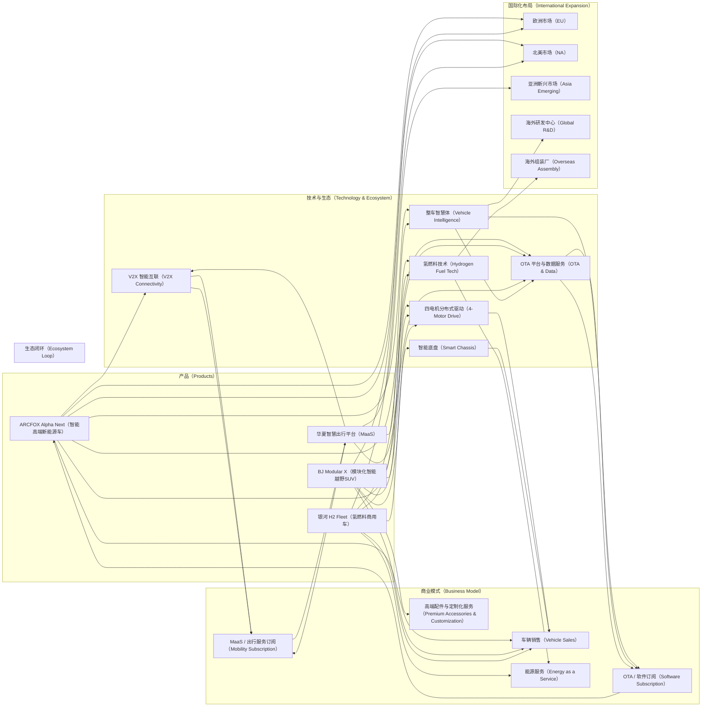

## 一、未来 3~5 年创新战略总体目标

北汽集团在新能源与智能网联双轮驱动基础上，结合国际化与 ESG 战略，未来 3~5 年应重点聚焦：

1. **增量业务与新产品**：未被定义的新型出行解决方案、高端智能座舱生态、智能能源与充电服务、氢燃料电池商用车与乘用车等。
2. **技术与生态构建**：自动驾驶、整车智慧体、四电机分布式驱动、智能底盘技术、软件平台、OTA 迭代能力与数据生态。
3. **国际化与品牌壁垒**：通过海外市场布局、智能网联技术输出与新能源技术标准参与，形成技术＋品牌＋供应链三重壁垒。
4. **商业模式创新**：围绕产品与服务构建新型生态闭环，包括 MaaS（出行即服务）、能源即服务（EaaS）、智能网联数据服务收入。

---

## 二、未来产品、服务与解决方案设计

### 1. 智能新能源乘用车系列（ARCFOX / 高端品牌）

* **核心功能**：L3/L4 自动驾驶、城市 NOA、整车智慧体、OTA 快速迭代能力、V2X 智能互联。
* **价值设计**：通过高端智能配置和新能源技术差异化，形成高利润率产品，并带动品牌溢价。
* **原型描述模板**：

| 属性   | 描述                                  |
| ---- | ----------------------------------- |
| 产品名称 | ARCFOX Alpha Next（智能旗舰车型）           |
| 核心技术 | 四电机分布式驱动、L4 自动驾驶（城市+高速）、OTA 平台、智能座舱 |
| 客户价值 | 高端用户智能出行体验、城市与高速环境下安全与便捷性、品牌溢价      |
| 生态连接 | V2X 与城市智慧交通平台数据对接、能源管理与充电网络互通       |
| 商业模式 | 车辆销售 + OTA 服务订阅 + 数据服务 + 高端配件与定制化服务 |

---

### 2. 高端智能越野及模块化 SUV 系列（北京越野）

* **核心功能**：积木化技术平台（可快速升级动力、电驱、智能底盘）、越野专用智能底盘（原地掉头、四电机分布式控制）、混合动力/氢燃料版本。
* **价值设计**：面向全球硬派 SUV 爱好者，兼顾新能源与智能驾驶。模块化平台可降低开发成本并快速迭代新功能。
* **原型描述模板**：

| 属性   | 描述                           |
| ---- | ---------------------------- |
| 产品名称 | BJ Modular X（模块化越野旗舰）        |
| 核心技术 | 积木化平台、氢燃料电池动力系统、智能底盘、智能座舱    |
| 客户价值 | 高性能越野体验、低碳绿色出行、可持续能源选择       |
| 生态连接 | 适配全球越野充电／补能网络、自动驾驶导航支持复杂地形   |
| 商业模式 | 高端定制化销售 + 出行俱乐部会员服务 + 生态配套订阅 |

---

### 3. 智能商用车与氢燃料解决方案（北汽福田）

* **核心功能**：新能源物流车、电驱升级、氢燃料电池商用车、智能驾驶辅助系统、智能调度与车队管理。
* **价值设计**：降低运输成本、提升城市物流效率、支持低碳与碳中和目标。
* **原型描述模板**：

| 属性   | 描述                        |
| ---- | ------------------------- |
| 产品名称 | 银河 H2 Fleet（氢燃料车队解决方案）    |
| 核心技术 | 氢燃料电池、高效电驱、智能驾驶辅助、车队管理云平台 |
| 客户价值 | 降低物流成本、提升能源效率、支持企业 ESG 指标 |
| 生态连接 | 氢燃料站点网络、城市智慧物流平台、OTA 远程调度 |
| 商业模式 | 车辆销售 + 车队管理 SaaS + 能源服务订阅 |

---

### 4. 智能出行与 MaaS 生态服务（华夏出行扩展）

* **核心功能**：基于智能车队的出行即服务平台、短途城市共享出行、智能调度、数据驱动运营优化。
* **价值设计**：提升车辆使用率、实现运营盈利，同时形成数据闭环，为自动驾驶和整车智慧体提供持续数据支持。
* **原型描述模板**：

| 属性   | 描述                              |
| ---- | ------------------------------- |
| 产品名称 | Huaxia Smart Mobility（华夏智慧出行平台） |
| 核心技术 | 智能调度算法、车队管理、用户端 App、支付与订阅系统     |
| 客户价值 | 便捷低碳出行、时间节约、成本可控                |
| 生态连接 | 数据回传至整车智慧体、智能能源管理、城市交通平台集成      |
| 商业模式 | MaaS 订阅 + 数据服务 + 广告与增值服务        |

---

## 三、战略行动与壁垒构建

### 1. 技术生态与行业壁垒

* 构建“整车智慧体 + OTA + 数据平台 + 智能座舱”闭环，使竞争对手难以短期模仿。
* 将氢燃料技术与智能网联技术结合形成跨领域技术壁垒，尤其在商用车物流及高端越野领域。
* 强化供应链绿色认证与 ESG 可追溯体系，形成绿色壁垒与政策优势。

### 2. 国际化扩张与本地化策略

* 针对海外 130+ 国家市场，按区域建立研发中心与组装厂，实现本地化制造与调适。
* 结合欧洲、北美新能源补贴与智能驾驶法规，优先出口高端智能车型及越野模块化车型。
* 与海外城市交通部门合作 MaaS 试点，为智能出行与数据生态提供入口。

### 3. 商业模式设计（Business Model Canvas 简表）

| 组件   | 描述                            |
| ---- | ----------------------------- |
| 核心伙伴 | 华为（智能驾驶）、能源供应商、地方政府、供应链厂商     |
| 核心活动 | 智能车研发、整车智慧体迭代、OTA 平台维护、出行数据分析 |
| 价值主张 | 高端智能出行、低碳环保、出行便利、数据驱动服务       |
| 客户关系 | 个性化订阅、车队管理 SaaS、会员增值服务        |
| 渠道   | 自有销售、经销商、电商平台、出行 APP          |
| 客户群体 | 高端新能源用户、企业车队、城市共享出行用户         |
| 成本结构 | 研发投入、制造成本、基础设施建设、运营与维护        |
| 收入来源 | 车辆销售、OTA / 软件订阅、出行服务订阅、能源服务   |

---

### 4. Go-to-Market Strategy 建议

1. **高端智能车**：以品牌旗舰车型为主，配合体验中心和数字化营销，建立口碑和智能出行社区。
2. **氢燃料商用车**：结合政府补贴及企业绿色物流需求，进行先行试点，形成标杆项目案例。
3. **MaaS / 出行服务**：先在一二线城市试点智能共享出行平台，并逐步向海外市场输出标准化平台。
4. **国际化布局**：选取欧洲新能源法规成熟、基础设施完善的国家作为先行市场，结合本地化制造降低成本，建立品牌和市场认知。

---

## 四、KPI 与战略指标

* 高端新能源车型毛利率提升至 ≥20%，2027 年新能源销量占比 ≥50%。
* 自动驾驶 / 智能座舱 OTA 迭代覆盖率 ≥90%，客户满意度 ≥85%。
* 氢燃料商用车在试点城市占比 ≥30%，降低碳排放量 ≥10%/年。
* MaaS 平台每日活跃用户 ≥5 万，数据回传完整率 ≥95%。
* ESG 披露完整性指数达到国际标准（GRI/ISO 14001/SA8000）。

---

## 五、总结

未来 3~5 年，北汽集团应围绕“智能新能源 + 氢燃料 + MaaS + 国际化”战略路径，通过技术闭环、产品组合创新、生态体系建设及 ESG 落实，实现增量业务增长与行业领先地位。通过系统的产品与服务设计、闭环商业模式、国际化落地策略与 ESG 升级，可有效构建竞争壁垒，形成可持续的长期价值。

北汽集团未来 3~5 年战略输出一个完整的 **可视化战略流程图与生态图**，涵盖产品/服务/生态/商业模式/国际化布局。下面是草稿示例：

### 图示说明：

1. **产品模块（P）**：涵盖 ARCFOX 高端新能源、模块化越野 SUV、氢燃料商用车和 MaaS 平台四大核心业务。
2. **技术与生态模块（T）**：整车智慧体、四电机分布式驱动、智能底盘、OTA 平台、V2X 和氢燃料技术构成核心技术支撑。
3. **商业模式模块（B）**：通过销售、订阅、出行服务和能源服务实现多元收入来源。
4. **国际化布局模块（I）**：欧洲、北美、亚洲新兴市场结合海外研发与组装实现全球化落地。
5. **生态闭环模块（L）**：技术、产品和商业模式形成闭环，数据与服务反哺产品迭代和用户体验优化。

---

## 参考资料

1. 北汽集团 2024 年可持续发展报告 ([baicgroup.com.cn](https://www.baicgroup.com.cn/uploadfile/shezebaogao/baicgroup2024.pdf?utm_source=chatgpt.com))
2. 北汽集团智能网联与新能源战略发布会 2025 ([autohome.com.cn](https://www.autohome.com.cn/news/202505/1104503.html?utm_source=chatgpt.com))
3. 华为自动驾驶及 L3/L4 合作案例 ([huawei.com](https://www.huawei.com/cn/news/2025/5/autonomous-driving-partnership?utm_source=chatgpt.com))
4. MaaS / 智能出行行业趋势与市场数据 ([mobility-trends.com](https://www.mobility-trends.com/2025-report?utm_source=chatgpt.com))
