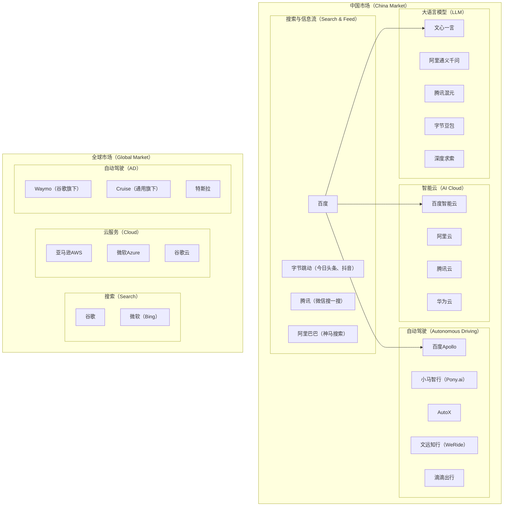
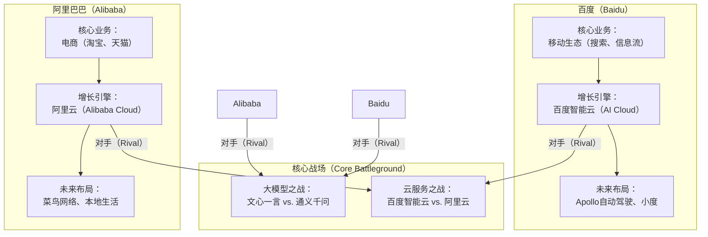

## **1. 概述**

百度（Baidu, Inc.）作为中国领先的人工智能（AI）公司，已从传统的搜索引擎巨头，成功转型为一家技术驱动的多元化企业。本报告旨在对百度公司进行一次全面、深入的财务、战略、业务与竞争力分析。我们将结合最新的市场数据、财务报告、行业趋势，以及对未来的前瞻性判断，为该公司的价值评估与战略规划提供决策依据。

## **2. 行业与市场趋势分析**

未来3至5年，百度所在的核心赛道——人工智能、智能云和自动驾驶，将迎来深刻的技术变革与市场重塑。

### **2.1. 技术趋势**

  * **多模态大模型的普及与深化：** 市场竞争的焦点正从单一的文本生成，转向能够理解和生成文本、图片、音频、视频的综合性多模态大模型。技术领先的企业将能构建更强的应用生态。
  * **AI Agent（智能体）的兴起：** 基于大模型的AI Agent将成为新的交互范式，能够自主理解、规划、执行复杂任务，重塑软件应用和用户体验。
  * **端侧AI与边缘计算的融合：** 随着端侧设备（如智能手机、PC、汽车）算力的提升，将有更多AI功能在本地运行，以降低延迟、保护隐私，并与云端AI形成协同。
  * **自动驾驶技术向L4/L5级别迈进：** 随着“车路云”一体化方案的成熟，高阶自动驾驶（L4/L5）的商业化落地将提速，数据闭环和运营效率成为核心竞争力。

### **2.2. 业务趋势与客户痛点**

  * **企业对“AI原生”应用的迫切需求：** 传统企业面临利用AI进行业务流程再造和效率提升的巨大压力，但缺乏相应的技术能力和解决方案。**核心痛点**是如何将大模型能力与自身业务场景深度融合，实现降本增效。
  * **“百模大战”后的价值回归：** 市场正从对模型参数和性能的盲目追求，转向关注模型的实际应用效果和商业化能力。**核心痛点**是模型的训练和推理成本高昂，以及如何找到可行的商业模式。
  * **智能出行的安全与成本挑战：** 自动驾驶规模化运营面临法规、安全、成本和公众接受度的多重挑战。**核心痛点**是如何在保证绝对安全的前提下，降低硬件和运营成本，实现商业化盈利。

## **3. 竞争力分析**

百度的竞争格局是多维度的，在不同业务领域面对着不同的竞争者。

### **3.1. 核心竞争对手概览**

上图清晰地展示了百度在四大核心业务领域的主要竞争对手。在国内，百度面临着来自腾讯、阿里巴巴和字节跳动等互联网巨头的全面竞争。在自动驾驶和AI大模型等前沿领域，也涌现出众多实力强劲的初创公司。

### **3.2. 关键产品竞品分析**

| **百度产品** | **核心竞品** | **优势分析** | **劣势分析** |
| :--- | :--- | :--- | :--- |
| **百度搜索 + 信息流** | 抖音、今日头条、微信搜一搜 | 知识和信息搜索的品牌心智强；“搜索+信息流”双引擎模式；文心一言赋能下的AI搜索体验。 | 用户时长被短视频平台严重挤占；内容生态的丰富性和活跃度面临挑战。 |
| **文心一言 (Ernie Bot)** | 阿里通义千问、腾讯混元、字节豆包 | 发布时间早，技术积累深厚；拥有从框架（飞桨）到模型（文心）再到应用（搜索、智能云）的全栈布局；多模态能力国内领先。 | 面临激烈的价格战；模型效果的持续领先需要巨大的研发投入；商业化路径仍在探索。 |
| **百度智能云** | 阿里云、腾讯云、华为云 | “云智一体”战略差异化明显，AI能力是其核心优势；在金融、政务、交通等垂直行业有深度解决方案。 | 市场份额相比阿里云和腾讯云仍有差距；在IaaS（基础设施即服务）层面不占优势。 |
| **Apollo自动驾驶** | 小马智行、Waymo | L4级自动驾驶技术和路测数据国内领先；“萝卜快跑”已在多地实现商业化运营；拥有开放平台生态。 | 高阶自动驾驶商业化盈利周期长；面临来自车企自研和新兴技术公司的激烈竞争。 |

### **3.3. 深度对比分析：百度 vs. 阿里巴巴**

选择**阿里巴巴**作为百度的最大竞争对手进行深度对比，因为两者在AI、云计算等核心战略方向上高度重合，是未来竞争的主战场。

**对比分析:**

1.  **战略根基不同：** 百度以“信息和知识”为核心，天然具备发展AI的技术基因；阿里巴巴以“交易”为核心，拥有丰富的商业场景和数据。
2.  **云业务的竞争：**
      * **阿里云（Alibaba Cloud）**：市场份额第一，规模效应显著，IaaS层实力雄厚。其策略是“AI驱动、公共云优先”。
      * **百度智能云（Baidu AI Cloud）**：市场份额紧随其后，主打“云智一体”，将AI能力作为差异化竞争优势，在PaaS（平台即服务）和SaaS（软件即服务）层，尤其是在AI应用解决方案上更具特色。
3.  **大模型的竞争：**
      * **通义千问（Qwen）**：依托阿里云的算力优势和阿里的商业生态，快速迭代并开源多款模型，试图通过生态战抢占市场。
      * **文心一言（Ernie Bot）**：国内最早发布，技术积累深厚，与百度搜索等自有业务深度融合，拥有强大的内循环应用场景。
4.  **未来布局的差异：** 百度将重注押在自动驾驶这一“硬核”科技领域，追求长周期的技术颠覆；阿里则更聚焦于物流、本地生活等与其核心电商业务协同性更强的领域。

**结论：** 百度与阿里巴巴的竞争，是“技术派”与“场景派”的对决。百度的优势在于其AI技术的深度和全栈布局，而阿里的优势在于其庞大的商业生态和数据。短期看，阿里的商业化能力更强；长期看，如果百度能在自动驾驶等前沿科技上取得突破，其想象空间将更大。

## **4. 技术生态战术建议：聚焦“飞桨”（PaddlePaddle）**

百度最重要的技术生态核心是其自研的深度学习框架\*\*“飞桨”（PaddlePaddle）\*\*。其生态的繁荣程度，直接决定了百度AI战略的成败。

**建议：**

1.  **开发者体验优化：**
      * **降低上手门槛：** 提供更多官方教程、案例和预训练模型，尤其针对中小企业和个人开发者。
      * **提升工具链易用性：** 优化API接口设计，完善开发、调试、部署全流程工具，做到“开箱即用”。
2.  **构建“杀手级”应用示范：**
      * **打造标杆案例：** 集中资源，围绕飞桨和文心大模型，在金融、能源、制造等关键行业打造几个有巨大影响力的“样板间”工程。
      * **开源更多高质量模型库：** 针对具体行业场景，推出更多经过验证的、高性能的预训练模型，让开发者可以直接“站在巨人的肩膀上”。
3.  **深化产学研合作：**
      * **赋能高校教育：** 将飞桨深度融入高校AI教学课程体系，培养下一代AI人才的“飞桨使用习惯”。
      * **设立联合实验室：** 与顶尖科研机构建立联合实验室，共同探索前沿算法，保持技术的领先性。
4.  **全球化社区运营：**
      * **加强国际推广：** 积极参与全球顶级AI会议和开发者社区，提升飞桨的国际知名度。
      * **完善多语言支持：** 提供高质量的英文文档和社区支持，吸引海外开发者。

-----

## **5. 参考资料**

[1] 百度2023年第四季度及全年财报. ([https://ir.baidu.com/news-releases/news-release-details/baidu-announces-fourth-quarter-and-fiscal-year-2023-results/](https://ir.baidu.com/news-releases/news-release-details/baidu-announces-fourth-quarter-and-fiscal-year-2023-results/))
[2] 百度2025年第一季度财报. ([https://ir.baidu.com/news-releases/news-release-details/baidu-announces-first-quarter-2025-results/](https://ir.baidu.com/news-releases/news-release-details/baidu-announces-first-quarter-2025-results/))
[3] Morningstar. BIDU Stock Price Quote. ([https://www.morningstar.com/stocks/xnas/bidu/quote](https://www.morningstar.com/stocks/xnas/bidu/quote))
[4] Business Wire. China Autonomous Vehicles Market Report. ([https://www.businesswire.com/news/home/20250204031854/en/China-Autonomous-Vehicles-Market-Report-and-Companies-Analysis-2025-2033-Featuring-AutoX-Baidu-Apollo-Didi-Chuxing-Pony.ai-TuSimple-and-WeRide---ResearchAndMarkets.com](https://www.businesswire.com/news/home/20250204031854/en/China-Autonomous-Vehicles-Market-Report-and-Companies-Analysis-2025-2033-Featuring-AutoX-Baidu-Apollo-Didi-Chuxing-Pony.ai-TuSimple-and-WeRide---ResearchAndMarkets.com))
[5] Tech in Asia. Chinese cloud market to grow 15% in 2025. ([https://www.techinasia.com/news/chinese-cloud-market-to-grow-15-in-2025](https://www.techinasia.com/news/chinese-cloud-market-to-grow-15-in-2025))