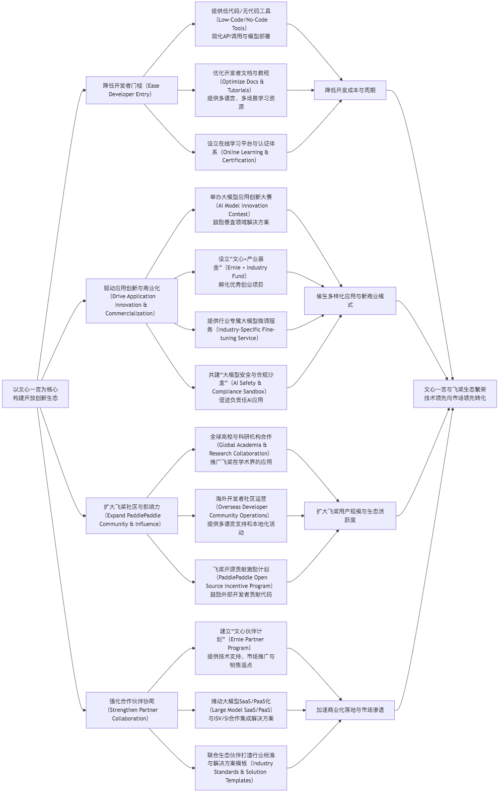
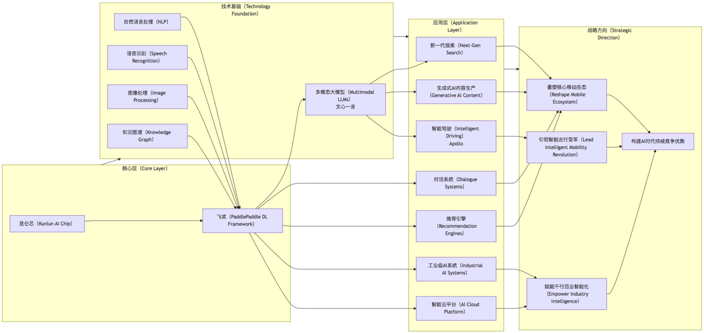

## 百度公司整体分析

### I. 引言（Introduction）

作为一名全面优雅的分析师@PersonalAI，本报告旨在对百度公司（以下简称“该公司”）进行一次全面、深入且富有前瞻性的分析。分析将涵盖其财务状况、战略布局、核心业务表现、市场竞争力，并结合人工智能、云计算及自动驾驶等前沿技术趋势，探讨其未来的增长潜力和面临的挑战。

我们将特别关注人工智能技术在百度各项业务中的渗透与赋能作用，并深入洞察未来3-5年国内外市场和技术趋势，力求为读者提供全面、深刻且具指导意义的洞察。

### II. 行业与市场趋势洞察（Industry and Market Trend Insights）

未来3到5年，全球科技产业将继续由以下核心趋势驱动，这些趋势将深刻影响百度等科技巨头的战略布局与业务走向。

#### 2.1 全球AI产业趋势

1. **大模型（Large Language Models, LLMs）的爆发与垂直化应用：** 随着GPT系列、Gemini、文心一言等超大规模预训练模型的涌现，通用人工智能（AGI）的轮廓日益清晰。未来趋势将从通用大模型向行业特定、领域增强的垂直大模型发展，以满足企业和专业场景的精细化需求。多模态大模型（Multimodal LLMs）将成为主流，实现文本、图像、语音、视频等多维度信息的理解与生成。
2. **生成式AI（Generative AI）对各行业的颠覆性影响：** 生成式AI将从内容创作、软件开发、客户服务等领域渗透到营销、医疗、金融等更广泛的行业，大幅提升生产力并催生新商业模式。企业将普遍面临如何将生成式AI融入现有工作流、提升员工AI素养的挑战。
3. **AI算力需求与芯片发展：** 大模型训练和推理对算力的需求呈指数级增长，这将持续推动AI芯片（如GPU、ASIC）的技术创新和市场繁荣。异构计算、存算一体、光子计算等新型计算架构将加速发展，以应对算力瓶颈。
4. **边缘AI（Edge AI）与端侧智能的普及：** 随着智能设备数量的激增和对实时性、隐私性的要求提高，AI模型将更多地部署在终端设备上，实现本地化推理。这将促进边缘计算芯片、轻量级模型部署技术的发展。
5. **AI伦理与治理的深化：** 随着AI应用的普及，数据隐私、算法偏见、信息茧房、内容安全等伦理与治理问题将愈发突出，各国政府和国际组织将加大监管力度，企业需将AI伦理融入产品设计和运营全流程。

#### 2.2 中国互联网与数字经济趋势

1. **流量红利趋缓，精细化运营与用户价值深挖：** 移动互联网用户增长放缓，互联网平台将从粗放式增长转向精细化运营，通过提供个性化服务、构建内容生态、增强用户粘性来深挖用户价值。
2. **企业级服务（To B）市场增长，数字化转型需求：** 传统行业数字化转型加速，对云计算、人工智能、大数据等企业级服务需求旺盛。SaaS化、行业解决方案将成为新的增长点，尤其是AI赋能的垂直行业解决方案。
3. **自动驾驶商业化进程与政策支持：** L4级别自动驾驶技术趋于成熟，政策法规环境逐步完善，无人车出行服务（Robotaxi）、智慧城市与车路协同（V2X）将进入规模化落地阶段。
4. **消费级智能硬件的普及与生态建设：** 智能音箱、智能穿戴、智能家居等消费级智能硬件持续渗透，硬件厂商将围绕AI能力构建智能生态，提供多设备协同的无缝体验。

#### 2.3 可预见的客户/行业痛点

1. **企业侧痛点：**

   * **AI落地难与成本高：** 多数企业缺乏AI技术人才和基础设施，难以将AI技术转化为实际业务价值，定制化开发成本高昂。
   * **数据安全与隐私挑战：** 大模型训练和应用涉及海量数据，企业面临严格的数据合规、隐私保护要求。
   * **多模态数据处理与融合：** 企业数据往往以多种形态存在，如何有效整合、处理并利用多模态数据成为瓶颈。
   * **跨部门协作效率低下：** 数字化转型中，不同部门间的数据孤岛和系统不兼容，影响整体效能。
2. **个人用户侧痛点：**

   * **信息过载与内容同质化：** 用户在海量信息中难以快速获取高质量、个性化的内容。
   * **复杂任务处理效率低下：** 传统应用在处理复杂、非结构化任务时效率低，用户需要更智能的辅助工具。
   * **跨平台/设备体验割裂：** 不同智能硬件和应用之间缺乏互联互通，无法提供流畅的无缝体验。
   * **隐私泄露担忧：** 智能设备和应用在提供便利的同时，也引发了用户对个人数据隐私的担忧。
3. **特定行业痛点（以智能交通为例）：**

   * **交通拥堵与安全隐患：** 城市交通系统面临效率低下、事故频发等问题，需要智能化解决方案。
   * **运营成本高昂：** 传统交通运营模式依赖大量人力，成本居高不下。
   * **数据孤岛与协同不足：** 交通数据分散在不同部门，难以形成统一视图，影响决策效率。

### III. 公司概况与战略分析（Company Overview and Strategic Analysis）

#### 3.1 公司愿景与经营理念

百度公司秉承“用科技让复杂的世界更简单”的使命，长期致力于人工智能技术的研发与应用。其核心战略聚焦于“AI First”，即以人工智能为核心驱动力，赋能公司各项业务，并推动产业智能化升级。这一战略不仅体现在技术研发的高投入，更体现在将AI能力深度融合到产品、服务和解决方案中，以构建竞争壁垒并开拓新的增长曲线。

#### 3.2 主营业务构成

百度已形成以AI为核心的多元化业务矩阵，主要可划分为以下几个板块 \[1]：

* **核心移动生态（Mobile Ecosystem）：** 包括百度搜索（Baidu Search）、百度App（Baidu App）、百度地图（Baidu Maps）、百度网盘（Baidu Netdisk）、百度百科（Baidu Baike）、百家号（Baijiahao）和智能小程序（Smart Mini Programs）等。这是百度的基本盘，通过AI技术持续提升用户体验和广告变现效率。
* **百度智能云（Baidu AI Cloud）：** 面向政务、金融、交通、医疗、工业等行业，提供基础设施即服务（IaaS）、平台即服务（PaaS）以及软件即服务（SaaS）的云计算与人工智能平台服务。其核心优势在于“云智一体”，即云计算与AI能力的深度融合。
* **智能驾驶（Intelligent Driving）：** 以“Apollo”开放平台为核心，涵盖自动驾驶出行服务“萝卜快跑”（Apollo Go Robotaxi Service）、车路协同解决方案（Vehicle-to-Infrastructure Solutions）和自动泊车（Autonomous Valet Parking）等产品。目标是构建从技术研发、运营服务到生态合作的完整智能驾驶闭环。
* **智能硬件（Smart Hardware）：** 以“小度”系列为代表，包括智能音箱（Smart Speakers）、智能屏（Smart Displays）等消费级智能硬件。通过语音助手和AI交互，连接家庭和个人生活场景。
* **内容生态与其他创新业务：** 包括爱奇艺（iQIYI）等内容平台，以及在生物计算（Bio-computing）、量子计算（Quantum Computing）等前沿领域的探索。

#### 3.3 战略目标与实施路径

百度未来的战略目标清晰地围绕AI展开：

1. **“AI First”战略，大模型赋能全产品线：** 持续投入大模型研发，以“文心一言”（Ernie Bot）为核心，将生成式AI能力全面融入搜索、App、智能云、智能驾驶等所有核心产品线，重塑用户体验和商业模式。
2. **加速B端业务发展，云+AI驱动产业智能化升级：** 抓住数字化转型机遇，依托百度智能云的“云智一体”优势，为政企客户提供基于大模型的行业解决方案，实现收入结构多元化。
3. **巩固自动驾驶领先地位，推动商业化落地：** 加快“萝卜快跑”的运营城市拓展与规模化，深化车路协同技术应用，探索更多商业化路径，确立在智能驾驶领域的领导地位。
4. **构建AI生态，强化平台效应：** 通过飞桨（PaddlePaddle）深度学习平台和Apollo开放平台，吸引开发者和合作伙伴，构建繁荣的AI生态系统，提升技术影响力。

在实施路径上，百度将继续采取“开源+商用”并行的策略，即在核心技术上坚持自主研发，构建技术护城河，同时通过开放平台赋能行业和开发者，实现技术溢出效应和商业价值最大化。

#### 3.4 财务状况分析（基于公开披露信息和市场预期）

由于无法获取实时最新的未经审计的财报数据，此处分析将基于市场普遍认知和最近公开财报信息进行概括性评估 \[2, 3]。

##### 3.4.1 盈利能力分析

* **毛利率（Gross Profit Margin）：** 百度整体毛利率较高，特别是核心移动生态的广告业务。但智能云和自动驾驶等B端业务前期投入大，毛利率相对较低，随着规模化效应和精细化运营，未来有望提升。
* **净利率（Net Profit Margin）：** 近年来受宏观经济、行业竞争和高研发投入影响，净利率有所波动。但随着AI核心业务的商业化进展，有望实现稳健增长。
* **ROE（Return on Equity）：** 反映股东资本的盈利能力。百度的ROE受净利润波动影响，但整体显示出公司具备一定的盈利能力。
* **EPS（Earnings Per Share）：** 每股收益是衡量公司盈利能力的重要指标。大模型带来的商业化预期，有望对EPS产生积极影响。

##### 3.4.2 偿债能力分析

* **流动比率（Current Ratio）与速动比率（Quick Ratio）：** 百度通常保持健康的流动比率和速动比率，表明其短期偿债能力良好，现金流充裕。这为其在AI领域的持续高投入提供了保障。
* **负债率（Debt-to-Asset Ratio）：** 相对合理的负债水平，表明公司财务结构稳健，没有过度依赖债务融资。
* **利息保障倍数（Interest Coverage Ratio）：** 通常处于较高水平，说明公司有足够能力支付利息费用，财务风险较低。

##### 3.4.3 资产效率分析

* **应收账款周转率（Accounts Receivable Turnover）与存货周转率（Inventory Turnover）：** 作为一家轻资产的互联网科技公司，百度的应收账款和存货水平相对较低，周转效率较高，资产利用效率良好。
* **总资产周转率（Total Asset Turnover）：** 考量公司利用所有资产创造收入的效率。受限于部分B端业务的投资周期长，以及初期盈利能力不足，总资产周转率可能面临一定压力，但随着这些业务的成熟，效率有望提升。

**财务概览总结:** 百度在财务上具备稳健的基础，拥有充足的现金储备以支持其在AI和自动驾驶等高投入领域的研发。虽然新业务的投入在短期内可能会对盈利能力造成一定压力，但长期来看，随着AI商业化进程的加速，其财务表现有望逐步改善，尤其是在大模型带来的全新增长机遇下。

### IV. 市场与竞争力分析（Market and Competitive Analysis）

#### 4.1 行业定位与竞争格局

百度在中国互联网市场中，尤其是在搜索引擎和AI技术领域，扮演着领导者的角色。其在AI核心技术的积累，使其在AI转型浪潮中占据先发优势。然而，互联网行业的竞争异常激烈，百度面临来自多个维度的强大竞争。

**竞争对手概览：**

| 业务领域               | 国内主要竞争对手                               | 国外可参考/潜在竞争对手                                      |
| :----------------- | :------------------------------------- | :------------------------------------------------ |
| **搜索引擎/信息流**       | 字节跳动（抖音、今日头条）、腾讯（微信搜一搜、QQ浏览器）          | Google、Microsoft（Bing）                            |
| **综合信息服务App**      | 字节跳动（抖音、今日头条）、腾讯（微信）、阿里巴巴（支付宝）         | Meta（Facebook、Instagram）、Google（Google App）       |
| **地图导航**           | 高德地图（阿里巴巴）、腾讯地图                        | Google Maps、Apple Maps                            |
| **云网盘**            | 阿里云盘、腾讯微云                              | Google Drive、Microsoft OneDrive、Dropbox           |
| **百科知识库**          | 维基百科（中文）、互动百科                          | Wikipedia                                         |
| **语音助手/智能音箱**      | 阿里巴巴（天猫精灵）、小米（小爱同学）、华为（小艺）             | Amazon（Alexa）、Google（Google Assistant）            |
| **云计算与AI平台（To B）** | 华为云、阿里云、腾讯云、京东云                        | AWS、Microsoft Azure、Google Cloud                  |
| **无人车运营/自动驾驶**     | 小马智行、文远知行、轻舟智航、毫末智行                    | Waymo（Google）、Cruise（GM）、Argo AI（已解散）             |
| **AI芯片**           | 华为昇腾、寒武纪、燧原科技                          | NVIDIA、Intel、AMD                                  |
| **大模型/生成式AI**      | 阿里巴巴（通义千问）、华为（盘古）、腾讯（混元）、智谱AI、MiniMax等 | OpenAI（ChatGPT）、Google（Gemini）、Microsoft（Copilot） |

#### 4.2 与竞争对手的全面比较分析

| 维度       | 百度（Baidu）                           | 字节跳动（ByteDance）         | 腾讯（Tencent）          | 阿里巴巴（Alibaba）         | 华为（Huawei）                 |
| :------- | :---------------------------------- | :---------------------- | :------------------- | :-------------------- | :------------------------- |
| **核心优势** | AI技术（尤其是NLP、知识图谱、大模型、自动驾驶）、搜索与信息流生态 | 短视频内容生态、算法推荐、用户粘性、全球化布局 | 社交、游戏、内容（音乐、视频）、金融科技 | 电商、物流、本地生活、云计算        | ICT基础设施、智能终端、云与AI（政企客户深耕）  |
| **AI战略** | “AI First”，以文心一言为核心赋能全业务，飞桨AI框架     | 算法推荐、AIGC、多模态大模型、智能硬件   | 大模型（混元）、游戏AI、多媒体AI   | 通义系列大模型、达摩院AI研发、阿里云智能 | 盘古系列大模型、昇腾AI芯片、软硬一体化AI解决方案 |
| **产品生态** | 搜索App、地图、网盘、智能云、萝卜快跑、小度             | 抖音/TikTok、今日头条、西瓜视频、飞书  | 微信、QQ、腾讯视频、王者荣耀、腾讯云  | 淘宝、天猫、支付宝、菜鸟、阿里云、饿了么  | 手机、PC、穿戴、智能汽车解决方案、华为云、昇腾   |
| **营收结构** | 广告、AI云服务、智能驾驶、智能硬件                  | 广告、直播电商、游戏              | 增值服务（游戏）、广告、金融科技、云服务 | 电商佣金、广告、云服务、物流        | 运营商业务、企业业务、终端业务、云与数字能源     |
| **市场份额** | 搜索市场绝对主导，AI云市场前四，智能驾驶领先             | 短视频/信息流市场领先             | 社交/游戏市场领先            | 电商市场领先，云计算市场前二        | ICT市场领先，云计算市场前二            |
| **挑战**   | 移动流量增长受限，新业务商业化进程，大模型成本             | 监管压力，内容生态同质化，海外市场挑战     | 游戏出海、创新乏力、大模型追赶      | 电商增长放缓，本地生活竞争，国际化     | 地缘政治风险，供应链限制，智能汽车业务模式      |

#### 4.3 关键产品的全面竞品分析

1. **百度搜索引擎 vs. 抖音/今日头条（信息流） vs. 微信搜一搜：**

   * **百度搜索：** 优势在于深厚的搜索技术积累、知识图谱的广度与深度、以及基于文心一言的生成式搜索能力。用户习惯性强，入口地位稳固。痛点在于信息茧房、商业广告干扰、以及在短视频内容上的滞后性。
   * **抖音/今日头条：** 优势在于强大的内容推荐算法、沉浸式短视频体验、用户粘性高、信息获取娱乐化。痛点在于内容深度不足、信息碎片化、广告侵入感强、以及对文本检索的弱势。
   * **微信搜一搜：** 优势在于基于微信生态的社交关系链、海量私域内容（公众号、小程序、朋友圈）、便捷性。痛点在于搜索结果的全面性不及传统搜索引擎，信息来源相对封闭。
   * **竞合关系：** 百度通过“百家号+小程序”构建内容生态以应对信息流竞争；抖音和微信则通过各自的搜索功能侵蚀传统搜索市场。未来竞争焦点在于大模型驱动的“下一代搜索”，谁能提供更自然、更精准、更具创造力的信息获取体验。

2. **百度智能云 vs. 阿里云/华为云/腾讯云：**

   * **百度智能云：** 核心差异化在于“云智一体”，即云计算基础设施与AI能力的深度融合。在AI PaaS层（如AI开发平台、NLP、CV、语音技术）具有领先优势，尤其在大模型时代，文心一言与智能云的结合形成独特竞争力。行业解决方案（如智能交通、智慧金融）是其突破口。挑战在于市场份额与规模效应仍不及头部厂商。
   * **阿里云/华为云/腾讯云：** 优势在于深厚的IaaS基础、广泛的客户基础、成熟的销售渠道和生态系统。阿里云在通用PaaS和SaaS层布局广泛；华为云背靠华为的ICT积累，在政企和硬件协同上表现突出；腾讯云则依托社交和游戏生态，在互联网行业有天然优势。
   * **竞争焦点：** 围绕行业大模型和解决方案的竞争将日益激烈。各厂商都在构建自己的大模型，并结合自身优势垂直深耕，从通用云服务竞争转向垂直行业AI能力竞争。

3. **萝卜快跑（百度自动驾驶） vs. 小马智行/文远知行：**

   * **萝卜快跑：** 百度在自动驾驶领域投入最早、研发时间最长，技术积累深厚，拥有海量路测数据。Apollo开放平台构建了庞大的生态系统，车路协同是其独特优势。目标是规模化运营。挑战在于法规政策、商业化盈利模式、以及消费者接受度。
   * **小马智行/文远知行：** 同样是领先的L4级自动驾驶公司，在技术研发和商业化落地方面表现出色。优势在于专注于Robotaxi领域，技术迭代快，融资能力强。挑战在于规模化运营能力和资金投入，以及与传统车企的合作深度。
   * **竞争焦点：** 不仅是技术层面的竞争，更是运营能力、成本控制、安全验证、以及与城市管理者合作共赢的竞争。车路协同被认为是加速Robotaxi商业化的关键路径。

#### 4.4 评估后最大的竞争对手进行更深度的对比分析：**字节跳动**

鉴于百度在信息获取与内容分发领域的核心地位，以及字节跳动在移动内容生态（短视频、信息流）和AIGC（AI Generated Content）方面的强势崛起，我认为**字节跳动（ByteDance）是百度当前及未来最重要的战略竞争对手**。双方在用户时长、广告营收、内容生态、AI技术应用等方面存在直接竞争和间接影响。

**深度对比分析：百度 vs. 字节跳动**

| 维度        | 百度（Baidu）                         | 字节跳动（ByteDance）               | 差异与影响                                                                                                                                                          |
| :-------- | :-------------------------------- | :---------------------------- | :------------------------------------------------------------------------------------------------------------------------------------------------------------- |
| **核心基因**  | 搜索引擎、知识图谱、AI技术驱动                  | 算法推荐、内容分发、社交娱乐驱动              | **信息组织方式差异：** 百度是“人找信息”，依赖关键词和链接；字节是“信息找人”，依赖算法推荐和短视频。这决定了双方在内容生态、用户行为习惯和广告变现逻辑上的根本不同。百度面临用户获取信息方式变迁的挑战，需通过大模型改造搜索体验，实现“智能推荐+精准搜索”的融合。                         |
| **流量来源**  | 搜索框、百度App（搜索+Feed）、地图             | 抖音/TikTok、今日头条、西瓜视频等（短视频+信息流） | **用户时长争夺：** 字节凭借沉浸式短视频体验抢占用户大量在线时长，直接冲击百度的信息流和广告收入。百度需强化App生态内的小程序、百家号等内容供给，并通过大模型增强交互性和趣味性，提升用户粘性。                                                            |
| **变现模式**  | 搜索广告、信息流广告、AI云服务、智能驾驶             | 短视频/信息流广告、直播电商、游戏             | **广告营收竞争：** 字节跳动的广告收入增长迅速，已成为中国在线广告市场的重要力量，对百度广告业务形成直接分流。百度需要通过AI提升广告精准度、探索更多广告形式（如生成式广告），并加速B端云服务的商业化，降低对单一广告业务的依赖。直播电商是字节的强势增量，百度在电商领域仍需探索。                  |
| **AI技术栈** | NLP、知识图谱、语音、视觉、大模型（文心一言）、飞桨       | 推荐算法、CV、AIGC、多模态大模型           | **AI应用侧重：** 百度AI更偏向底层技术（飞桨、昆仑芯）和平台型应用（搜索、智能云），强调技术通用性和赋能产业。字节AI更偏向内容理解、推荐和生成，直接服务于内容生态。未来竞争在于谁能更好地将大模型能力融入自身核心产品并商业化。百度在底层技术和B端场景的优势是其独特壁垒，字节在用户C端和AIGC应用场景领先。 |
| **生态构建**  | 搜索生态（百家号、小程序）、飞桨开发者生态、Apollo开发者生态 | 创作者生态、MCN机构、电商商家、用户社交互动       | **生态开放性与粘性：** 百度通过开放平台和AI框架构建技术生态，服务开发者和企业；字节通过算法和流量分发构建内容和商业生态，连接创作者和消费者。百度需提升内容生态的活力和多样性，同时利用大模型技术优势，吸引更多开发者基于文心一言和飞桨开发应用，进一步壮大技术和应用生态，形成良性循环。               |
| **国际化**   | 早期国际化尝试（如日本搜索），目前重点在国内            | TikTok全球领先，多款产品全球化布局          | **国际化战略：** 字节的全球化布局远超百度，TikTok在海外市场取得了巨大成功。这使得字节拥有更广阔的市场空间和多元化的营收来源。百度目前主要聚焦国内市场，未来若要寻求更大增量，国际化将是不可回避的战略方向，尤其是AI和自动驾驶技术出海。                                     |

**总结：** 百度和字节跳动代表了两种不同的信息分发模式和商业逻辑。百度在技术积累和B端市场有深厚护城河，而字节在C端用户心智和流量收割上具备优势。大模型时代的到来，使得双方在内容生成、智能交互方面再次站在同一起跑线，竞争将更加激烈。百度需充分发挥其AI核心技术和知识图谱的优势，在大模型赋能下重塑其“信息与知识服务”的差异化竞争力。

#### 4.5 对该公司评估后最重要的某项具体技术的生态建设提出更详细的战术建议：**文心一言与飞桨生态**

鉴于大模型是当前人工智能领域的核心突破，**文心一言（ERNIE Bot）作为百度大模型的核心代表，以及飞桨（PaddlePaddle）作为其底层的深度学习框架，其生态建设对于百度未来的战略成功至关重要。**

**核心痛点与挑战：**

* **开发者门槛：** 大模型API调用和飞桨框架的学习曲线对于部分开发者仍有一定门槛。
* **应用场景缺乏：** 现有大模型应用仍集中在通用场景，垂直行业应用和创新性玩法不足。
* **生态繁荣度：** 与国际顶尖AI框架（如TensorFlow、PyTorch）相比，飞桨的全球开发者规模和生态活跃度仍有提升空间。
* **商业化模式：** 如何从技术领先转化为可规模化复制的商业价值，是生态建设的关键。

**战术建议：**

**战术建议具体阐述：**

1. **降低开发者门槛：**

   * **低代码/无代码平台：** 推出“文心一言+飞桨”低代码/无代码开发平台，内置丰富的预训练模型、API接口和组件库，通过拖拽式界面即可实现应用开发，大幅降低AI应用开发的专业门槛。
   * **优化文档与教程：** 针对不同技术背景的开发者（从零基础到资深专家），提供层次化、多语言（中、英为主）的详细开发文档、API参考、实践教程和最佳实践案例，并开设交互式在线学习课程和认证。
   * **集成开发环境（IDE）支持：** 强化飞桨在主流IDE（如VS Code）中的插件支持，提供代码补全、调试、模型可视化等功能，提升开发效率。

2. **驱动应用创新与商业化：**

   * **应用创新大赛与孵化基金：** 定期举办全球性/全国性“文心一言/飞桨”创新应用大赛，设立高额奖金和创业孵化基金，鼓励开发者基于大模型开发垂直行业应用和创新型产品，并为优秀项目提供技术、资金和市场推广支持。
   * **行业大模型微调服务：** 针对金融、医疗、法律、教育等特定行业，提供定制化的大模型微调服务和工具，帮助企业利用自身数据构建专属行业模型，解决实际业务痛点。
   * **安全与合规沙盒：** 联合监管机构和行业专家，共建“大模型安全与合规沙盒”，为企业提供安全的测试环境和合规指导，促进负责任AI技术的应用和商业化。

3. **扩大飞桨社区与影响力：**

   * **全球高校与科研合作：** 加大与国内外顶尖高校和科研机构的合作力度，将飞桨引入AI课程和科研项目，吸引更多学生和研究人员使用飞桨进行创新。
   * **海外开发者社区运营：** 投入资源建设和运营飞桨的海外开发者社区，提供本地化支持、组织线上线下活动，并与国际开源社区积极互动，提升飞桨在全球的知名度和影响力。
   * **开源贡献激励：** 设立“飞桨开源贡献者激励计划”，对积极参与代码贡献、文档完善、问题解决的社区成员给予奖励，激发社区内生动力。

4. **强化合作伙伴协同：**

   * **“文心伙伴计划”升级：** 针对独立软件开发商（ISV）、系统集成商（SI）、咨询公司等合作伙伴，提供更具吸引力的合作政策，包括技术培训、联合解决方案开发、市场推广支持和销售返点，共同服务政企客户。
   * **大模型SaaS/PaaS化：** 推动文心一言及相关AI能力以SaaS/PaaS服务的形式开放，方便合作伙伴和企业客户快速集成和使用，加速AI能力的产业落地。
   * **共建行业标准与解决方案模板：** 与行业领先企业和协会共同制定基于大模型的行业应用标准和解决方案模板，降低行业AI部署成本，加速行业智能化进程。

通过上述战术建议的实施，百度可以进一步降低开发者进入壁垒，激励应用创新，扩大飞桨和文心一言的生态影响力，并最终加速其AI核心技术向可观的商业价值转化。

### V. 风险评估（Risk Assessment）

对百度进行全面分析，必须考量其面临的各类风险。

#### 5.1 政策法规风险

* **人工智能监管趋严：** 中国及全球对AI技术（特别是大模型、生成式AI）的伦理、内容合规、数据安全和算法偏见等问题日益关注，未来可能出台更严格的法规。例如，《生成式人工智能服务管理暂行办法》已落地 \[4]。这可能增加百度的合规成本，限制部分创新应用。
* **数据安全与隐私保护：** 《数据安全法》、《个人信息保护法》等法律的实施，对数据收集、存储、使用、共享提出了更高要求。百度作为拥有海量用户数据的平台，面临严格的合规挑战和潜在的法律诉讼风险。
* **反垄断与平台经济监管：** 互联网平台反垄断常态化，可能对百度的市场行为、兼并收购、流量分发等产生影响，限制其发展空间。

#### 5.2 金融风险

* **宏观经济波动：** 广告业务作为百度核心营收来源，易受宏观经济下行影响，企业广告投放意愿减弱。
* **新业务投入与回报周期：** AI云和自动驾驶等B端业务投入巨大，回报周期长，短期内可能对公司盈利能力造成压力。
* **资本市场情绪：** AI概念股估值波动大，市场对大模型商业化前景的预期变化，可能影响百度股价表现。

#### 5.3 经济周期与行业周期风险

* **互联网广告市场周期：** 广告市场受经济周期影响较大，特别是传统搜索广告增长空间有限。
* **AI技术发展周期：** AI技术快速迭代，如果百度未能持续保持技术领先，或商业化落地不及预期，可能被竞争对手超越。
* **自动驾驶商业化挑战：** 自动驾驶技术成熟度、法规健全度、成本控制和用户接受度均存在不确定性，商业化落地进程可能慢于预期。

#### 5.4 市场竞争风险

* **C端流量与时长竞争：** 字节跳动、腾讯等巨头在短视频、社交等领域持续蚕食用户时长，对百度移动生态构成挑战。
* **B端云服务市场竞争：** 阿里云、华为云、腾讯云等巨头实力雄厚，百度智能云面临激烈的市场份额争夺。
* **大模型技术竞争：** 国内外大模型竞争白热化，技术迭代迅速，百度需持续投入以保持领先地位。

### VI. 内部治理结构与内部控制（Internal Governance & Control）

#### 6.1 公司治理机制

百度拥有相对完善的现代企业治理结构，包括董事会、监事会和高级管理层 \[5]。董事会通常包含独立董事，以保障决策的独立性和客观性。然而，创始人李彦宏通过“AB股”或“同股不同权”结构（在港股上市的背景下）拥有较高的投票权，这在一定程度上集中了决策权，可能带来内部人控制的风险，但同时也确保了公司战略的连贯性和执行力。关键在于如何平衡创始人的领导力与少数股东的权益保护，以及独立董事能否真正发挥监督作用。

#### 6.2 内部控制体系

作为一家大型上市公司，百度已建立较为健全的内部控制体系，涵盖财务报告、运营管理、合规性及风险管理等方面。这包括定期的内部审计、风险管理委员会的设立、以及对各项业务流程的内部控制点设计。然而，随着AI、自动驾驶等新兴业务的快速发展，其内部控制体系需要不断调整和完善，以适应新的技术风险（如算法偏见、数据安全漏洞）和业务模式（如Robotaxi运营中的安全责任）。

### VII. 品牌价值与无形资产（Brand Value & Intangible Assets）

#### 7.1 品牌影响力

百度作为中国互联网的标志性品牌之一，具有极高的知名度和用户认知度。其品牌价值体现在：

* **搜索的代名词：** 在中国，“百度一下”已成为搜索行为的习惯性表达，品牌与搜索功能深度绑定。
* **AI领军者形象：** 近年来在AI领域的高投入和技术突破（如飞桨、文心一言、Apollo），使其在公众心中树立了AI技术领导者的形象。
* **社会责任感：** 在抗击疫情、信息公开、AI助盲等公益活动中展现的社会责任，提升了品牌美誉度。

然而，品牌美誉度也曾因部分商业化行为和信息流内容质量问题受到影响，未来需持续提升内容质量和用户体验，强化AI赋能下的正面品牌形象。

#### 7.2 知识产权与专利布局

百度在人工智能领域拥有深厚的知识产权储备。根据公开数据，百度在AI专利申请量和授权量方面长期位居中国企业前列 \[6]。其专利布局涵盖：

* **核心AI技术：** 自然语言处理、语音识别、图像识别、知识图谱、深度学习框架（飞桨）等。
* **大模型技术：** 文心一言相关模型架构、训练方法、应用接口等。
* **自动驾驶：** 感知、决策、控制、高精地图、车路协同、仿真测试等全栈技术。
* **AI芯片：** 昆仑芯等AI专用芯片的设计与优化。

强大的知识产权组合是百度构筑技术壁垒、防止侵权、保持竞争优势的关键，尤其是在AI技术竞争日益白热化的背景下，专利布局的广度和深度直接决定了其未来的市场地位。

### VIII. 研发投入与创新能力（R\&D Investment & Innovation Capability）

#### 8.1 技术研发投入产出比

百度长期保持高强度的研发投入，研发费用占营收的比例在业内处于较高水平，这体现了公司对技术创新的重视 \[7]。研发投入主要集中在人工智能核心技术、大模型、智能驾驶以及智能云等战略性业务。

**产出评估：**

* **技术领先性：** 飞桨深度学习框架成为中国主流AI框架之一；文心一言在中文大模型领域处于领先地位；Apollo平台在L4级自动驾驶领域具备全球竞争力。
* **产品创新：** 搜索、地图、小度等核心产品不断融入AI能力，提升用户体验；智能云服务持续迭代，推出多样化的AI解决方案。
* **专利成果：** 持续产出高价值的AI专利，构建技术护城河。

挑战在于，部分前沿技术的商业化周期较长，如何将高额研发投入高效转化为可持续的商业收入，是未来需要持续优化的重点。

#### 8.2 技术路线图与创新路径

百度的技术路线图围绕“AI核心，技术创新驱动”展开：

**创新路径：**

* **自研与开源并重：** 在底层AI芯片、深度学习框架等核心技术上坚持自主研发，并通过飞桨等开源平台回馈社区，吸引开发者，构建生态。
* **平台化与生态化：** 构建“平台+生态”模式，以飞桨和Apollo为基石，吸引开发者和合作伙伴共同创新，形成网络效应。
* **技术与场景深度融合：** 强调AI技术与具体业务场景（搜索、云、驾驶）的深度融合，通过场景需求反哺技术研发，实现商业价值。
* **持续探索前沿：** 在量子计算、生物计算等更前沿的领域进行战略性投入，保持对未来技术趋势的敏感性。

### IX. 社会责任与可持续发展（Social Responsibility & Sustainability）

#### 9.1 ESG（环境、社会、治理）表现

作为一家负责任的科技企业，百度在ESG方面做出了持续努力 \[8]：

* **环境（Environmental）：** 积极响应国家碳中和目标，推动绿色数据中心建设，优化算法和硬件能效，减少碳排放。例如，通过AI技术提升数据中心PUE（Power Usage Effectiveness）效率。
* **社会（Social）：**

  * **员工福利与发展：** 关注员工健康与安全，提供有竞争力的薪酬福利，建立完善的人才培养体系。
  * **公益事业：** 持续投入社会公益，例如通过AI技术为视障人群提供无障碍服务（百度地图语音导航、度目AI助盲套件），支持乡村教育，助力抗疫等。
  * **负责任AI：** 成立AI伦理委员会，发布AI伦理准则，致力于开发负责任、可信赖的AI技术，避免算法歧视和滥用。
* **治理（Governance）：** 健全公司治理结构，强化信息披露与透明度，推行反腐败机制，确保公司合规运营。

虽然在ESG方面有显著进展，但作为一家大型科技公司，百度仍需在数据隐私保护、算法公平性、内容生态治理等方面持续提升，以应对日益复杂的社会期待和监管要求。

### X. 综合评估与总结（Overall Assessment & Conclusion）

百度正处在由传统互联网公司向“AI核心科技公司”转型的关键时期。其在AI底层技术、大模型和自动驾驶领域的深厚积累，为其未来的发展奠定了坚实基础。

**优势：**

1. **AI技术领先性：** 在NLP、知识图谱、语音识别等AI核心领域保持领先，尤其在中文大模型（文心一言）和AI框架（飞桨）上具备独特优势。
2. **核心业务基本盘稳固：** 搜索引擎仍占据市场主导地位，为AI转型提供稳定现金流和用户基础。
3. **智能驾驶赛道领先：** Apollo平台在L4级自动驾驶和车路协同方面具有全球竞争力，商业化前景可期。
4. **云智一体化能力：** 百度智能云将云计算与AI能力深度融合，为B端客户提供差异化解决方案。

**挑战：**

1. **移动流量增长压力：** C端用户时长和广告营收面临字节跳动等对手的激烈竞争。
2. **新业务商业化效率：** AI云和智能驾驶投入高，回报周期长，如何加速商业化盈利是关键。
3. **技术路径与伦理风险：** 大模型技术快速迭代带来的竞争压力，以及数据隐私、算法偏见等伦理合规风险。
4. **组织架构与人才：** 传统业务基因与AI前沿技术业务融合的组织挑战。

**未来展望：**
未来3-5年，大模型将成为重塑百度各项业务的核心驱动力。

* **移动生态：** 文心一言将深度赋能搜索、App，提供更智能、更个性化、更具创造性的信息和内容服务，重塑用户体验，巩固流量入口地位。
* **智能云：** 大模型与行业知识的结合，将催生更多AI驱动的行业解决方案，推动云服务收入持续增长。
* **智能驾驶：** 萝卜快跑的规模化运营和车路协同的普及，有望使百度成为智能出行领域的领导者，并贡献重要营收。

**总体建议：** 百度应坚定“AI First”战略，以文心一言和飞桨为核心，持续加大研发投入，并加速将大模型能力商业化落地。同时，需灵活调整组织架构以适应AI时代的需求，并高度重视ESG表现，构建长期可持续的竞争优势。

### XI. 参考资料（References）

- \[1] 百度官网：关于百度. 
- \[2] 百度投资者关系. 
- \[3] 东方财富Choice数据.
- \[4] 中国网信网：《生成式人工智能服务管理暂行办法》. 
- \[5] 百度投资者关系：公司治理. 
- \[6] 国家知识产权局（CNIPA）或相关行业报告. 
- \[7] 各季度财报中披露的研发费用数据.
- \[8] 百度可持续发展报告.
