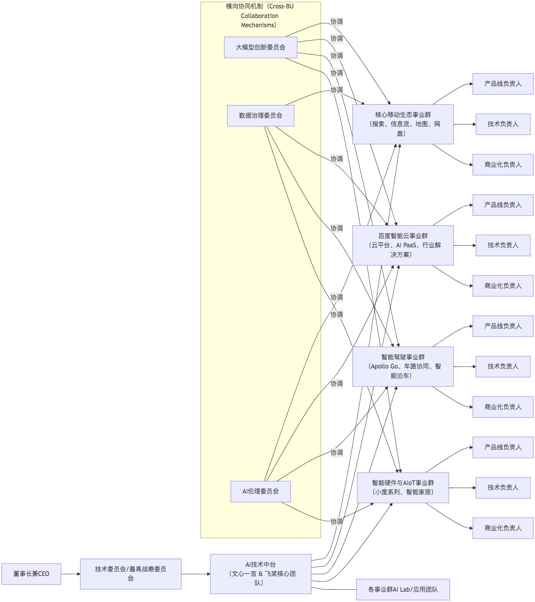
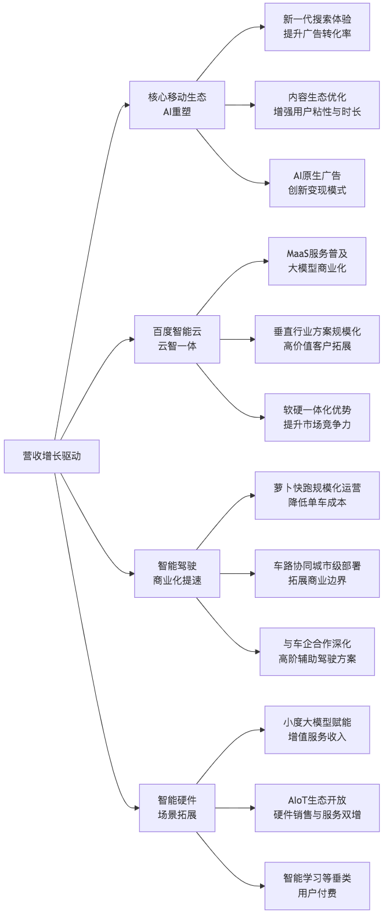

## 百度公司调整分析

### I. 绪论（Introduction）

本文件作为对百度公司全面分析的第二部分，将聚焦于其现有存量业务、产品和技术竞争力的深度修正与优化，并进一步探讨组织架构、ESG表现及财务预测等关键领域。在当前AI大模型技术加速渗透的背景下，百度的核心挑战在于如何将领先的技术优势高效转化为可持续的商业价值，并应对日益复杂的市场竞争与宏观环境。

本报告提出具象化、可操作性的建议，旨在帮助百度在保持现有优势的同时，加速新业务的商业化进程，优化资源配置，提升整体运营效率和长期价值。

### II. 现有业务、产品与技术竞争力优化建议（Optimizing Existing Businesses, Products, and Technological Competitiveness）

#### 2.1 核心移动生态（Mobile Ecosystem）

百度的核心移动生态是其营收的基本盘和流量入口。在大模型时代，重塑搜索和信息流体验、提升用户粘性与商业化效率至关重要。

##### 2.1.1 搜索与信息流

* **痛点与挑战：**

  * 传统搜索体验（关键词匹配）在复杂、多模态、生成性需求上已显不足。
  * 信息流内容同质化严重，用户时长面临抖音、微信等平台的激烈竞争。
  * 广告变现效率有待提升，用户对广告干扰感知较强。
* **修正与调整建议：**

  1. **“下一代搜索”重塑：**

     * **生成式交互与问答：** 以文心一言为核心，将搜索从“关键词检索”升级为“智能问答与生成”，允许用户进行多轮对话、复杂问题求解、内容总结与创作。
     * **多模态搜索：** 支持图片、语音、视频等多模态输入，实现跨模态理解与检索，例如通过图片搜索同款商品，通过语音指令查询路线。
     * **个性化与主动推荐：** 结合用户画像、行为数据和兴趣，通过大模型进行深度个性化内容推荐，实现“不搜即得”的智能服务。
  2. **内容生态优化与品质提升：**

     * **强化百家号优质内容生产：** 扶持专业创作者和机构，通过智能工具（AIGC辅助创作、内容审核）提升内容质量和原创性。
     * **智能小程序生态升级：** 大模型赋能小程序，使其具备更强的交互能力和服务闭环能力，吸引更多开发者入驻并提供场景化服务。
     * **内容治理与可信度：** 加大对虚假信息、低质内容和过度商业化内容的审核力度，利用AI技术提升内容分发的权威性和可信度。
  3. **广告变现效率与体验平衡：**

     * **AI原生广告：** 利用生成式AI为广告主提供更具创意、个性化、与用户内容场景高度融合的广告素材和形式，提升广告转化率。
     * **精准投放与效果优化：** 运用大模型分析用户意图，实现更精细的广告定向与实时优化，提高广告ROI。
     * **创新商业模式：** 探索基于大模型能力的服务订阅模式、知识付费、AI工具付费等非广告营收增长点。

##### 2.1.2 垂类产品（地图、网盘等）

* **痛点与挑战：**

  * 功能趋于同质化，用户粘性有提升空间。
  * 数据价值深度挖掘不足，商业化潜力有待释放。
* **修正与调整建议：**

  1. **百度地图：**

     * **大模型增强智能规划与交互：** 结合文心一言，实现更自然语言的指令交互（如“带我去一个适合亲子活动的公园，且附近有停车场”），提供更智能的路线规划（考虑实时天气、活动信息、个性化偏好）。
     * **AIoT与车机系统深度融合：** 将地图能力与小度车机系统、Apollo自动驾驶能力深度集成，提供车内一站式出行服务，包括智能导航、车内娱乐、智能泊车等。
     * **生活服务与本地化：** 进一步强化本地生活服务入口地位，通过AI推荐个性化商户和优惠信息，形成O2O闭环。
  2. **百度网盘：**

     * **“AI助理”功能：** 利用大模型对网盘内文件进行智能分类、摘要提取、内容问答、文档生成等操作，提升文件管理和内容利用效率。
     * **安全与隐私强化：** 针对企业用户和高价值内容，提供更严格的数据加密、权限管理和审计功能，满足合规性要求。
     * **付费会员增值服务：** 拓展基于AI能力的增值服务（如智能搜索、智能相册整理、音视频内容生成与编辑），提升会员付费意愿和ARPU值。

#### 2.2 百度智能云（Baidu AI Cloud）

* **痛点与挑战：**

  * 市场份额与头部厂商仍有差距，规模效应不足。
  * 通用IaaS层竞争激烈，价格战压力大。
  * 行业解决方案的标准化与复制能力有待提升。
* **修正与调整建议：**

  1. **“云智一体”的极致深化与差异化：**

     * **大模型即服务（MaaS）：** 将文心一言以MaaS形式全面开放，提供API、模型定制、微调工具和行业解决方案模板，成为企业构建大模型应用的优选平台。
     * **垂直行业解决方案深耕：** 聚焦政务、金融、工业制造、智能交通等百度有优势或AI赋能潜力巨大的行业，打造具有高壁垒、高附加值的行业大模型和端到端解决方案。例如，针对工业领域推出“工业大脑”与“质检大模型”，针对金融领域推出“智慧风控大模型”。
     * **软硬一体化优势：** 充分发挥昆仑芯、飞桨与智能云的协同效应，提供从芯片、框架到平台、应用的AI全栈能力，满足企业对AI性能、安全和定制化的需求。
  2. **提升商业化效率与盈利能力：**

     * **聚焦高利润率SaaS与PaaS服务：** 减少低利润的IaaS业务占比，加大高附加值AI PaaS（如AI开发平台、大模型服务）和行业SaaS（如智能客服、数字人）的推广。
     * **强化伙伴生态建设：** 建立更完善的渠道伙伴体系，与ISV、SI和咨询公司深度合作，共同拓展市场，提升解决方案交付能力。
     * **优化成本结构：** 提升数据中心运营效率，通过技术手段（如AI优化调度、节能技术）降低算力成本。

#### 2.3 智能驾驶事业群（Intelligent Driving Group - IDG）

* **痛点与挑战：**

  * Robotaxi商业化进程慢，盈利模式尚不清晰。
  * 高研发投入与运营成本，对财务压力较大。
  * 政策法规和消费者接受度存在不确定性。
* **修正与调整建议：**

  1. **加速“萝卜快跑”规模化运营与降本增效：**

     * **城市拓展与密度提升：** 在现有运营城市（如武汉、重庆）加密运营区域，并稳步拓展至更多高价值城市，形成规模效应。
     * **单车成本优化：** 积极与车企合作，推动量产车型前装自动驾驶系统，降低单车硬件成本；优化运营效率，降低人力成本。
     * **多样化商业模式探索：** 除了Robotaxi出行服务，探索Robotaxi + 货运、自动驾驶赋能公共交通、自动泊车服务（AVP）对外授权等多元化变现路径。
  2. **强化车路协同优势，构建城市级智能交通方案：**

     * **车路云一体化：** 将自动驾驶车辆、路侧感知设备、边缘计算和云端平台深度融合，通过车路协同提升自动驾驶安全性、效率和覆盖范围。
     * **拓展城市级合作：** 与更多城市政府合作，从单点示范走向区域级、城市级智能交通解决方案的整体部署，形成示范效应和业务壁垒。
     * **数据闭环与技术迭代：** 充分利用车路协同产生的海量数据，加速自动驾驶算法的迭代优化和场景覆盖。
  3. **Apollo开放平台持续赋能，引领行业生态：**

     * **深化与主机厂合作：** 不仅限于L4级自动驾驶，也为L2+/L3级别提供高阶辅助驾驶解决方案（如领航辅助驾驶ANP），扩大Apollo的商业化触点。
     * **吸引开发者与生态伙伴：** 持续优化Apollo平台工具链与开发体验，吸引更多开发者和供应商加入，共同推动自动驾驶生态繁荣。

#### 2.4 智能硬件与AIoT（Smart Hardware & AIoT）

* **痛点与挑战：**

  * 智能音箱市场竞争激烈，硬件同质化。
  * 生态系统相对封闭，与其他智能设备的互联互通不足。
  * 商业模式仍以硬件销售为主，服务收入占比低。
* **修正与调整建议：**

  1. **产品差异化与核心竞争力：**

     * **文心一言深度赋能小度：** 将大模型能力融入小度设备，使其成为更智能的“家庭AI助手”，实现多轮自然语言对话、个性化内容推荐、复杂任务处理等。
     * **聚焦场景创新：** 除了智能音箱，重点发展智能屏、智能学习设备、智能车载等高价值、高粘性场景，提供定制化解决方案。
     * **软硬一体化体验：** 强化小度设备与百度App、百度地图等软件服务的无缝协同体验。
  2. **构建开放式AIoT生态：**

     * **开放接入与互联互通：** 扩大与第三方智能硬件厂商的合作，实现小度生态与其他主流智能家居平台的互联互通，打破生态壁垒。
     * **内容与服务生态：** 引入更多优质内容（教育、娱乐、健康）和生活服务，通过会员订阅、内容付费等形式拓展增值服务收入。
  3. **商业模式升级：**

     * **“硬件+服务”模式：** 推动小度设备从单一硬件销售向“硬件+会员订阅+内容服务”的模式转型，提升长期营收。

#### 2.5 整体技术能力：文心一言与飞桨的深层赋能（Overall Technical Capability: Deeper Empowerment by ERNIE Bot & PaddlePaddle）

* **痛点与挑战：**

  * 技术领先优势如何持续转化为市场份额和利润。
  * 大模型研发和运维成本高昂。
  * AI人才竞争激烈，人才流失风险。
* **修正与调整建议：**

  1. **大模型研发与应用双轮驱动：**

     * **前沿模型持续迭代：** 持续投入大模型基础研究，保持文心一言在模型架构、训练效率、多模态能力上的领先性。
     * **规模化应用落地：** 成立跨BU的大模型应用专项组，推动文心一言在搜索、云、驾驶等业务线的深度融合和商业化落地，形成多个标杆应用。
  2. **算力与成本优化：**

     * **昆仑芯生态建设：** 持续投入自研AI芯片昆仑芯的研发与迭代，提升芯片性能和成本效益，减少对外部高端芯片的依赖。
     * **“训推一体”优化：** 优化模型训练和推理流程，利用飞桨框架和昆仑芯的协同优势，降低大模型的运行成本。
  3. **AI人才战略升级：**

     * **人才培养与激励：** 持续加大对AI人才的培养投入（内部培训、外部合作），建立有竞争力的薪酬体系和股权激励机制，吸引并留住顶尖AI人才。
     * **内部知识共享与轮岗：** 促进不同业务单元之间的AI技术共享和人才轮岗，加速AI能力在全公司的渗透。

### III. 组织架构分析与优化建议（Organizational Structure Analysis & Optimization Suggestions）

#### 3.1 现状分析

百度目前的组织架构基本为事业群（BG）制，各业务线相对独立，便于专业化发展和资源聚焦。但在AI转型背景下，也存在以下挑战：

* **跨BU协同不足：** 各业务线在AI技术、数据、用户资源上存在协同壁垒，未能充分发挥AI核心能力的整体效应。
* **资源分散：** 大模型等底层AI能力需要全公司资源的集中投入，但若仍按传统BU制划分，可能导致资源分散和重复建设。
* **人才与文化：** 传统互联网业务和新兴AI业务在人才结构、激励机制、文化上可能存在差异，影响融合。

#### 3.2 优化建议

为更好地承接“AI First”战略，尤其是大模型时代的挑战与机遇，建议百度在现有基础上进行以下组织架构优化：

{ width=\linewidth }

**关键优化点：**

1. **强化AI技术中台的战略地位：**

   * 将**文心一言和飞桨核心团队**提升至AI技术中台，直接向最高战略委员会（或CEO/CTO）汇报，确保其拥有公司级的资源和优先权。
   * AI技术中台负责核心大模型的研发、迭代、算力调度和通用能力输出，避免各BU重复建设，实现**技术资产的最大化复用**。
   * 各事业群（D1-D4）设立**AI Lab/应用团队（E）**，负责将中台输出的AI能力与自身业务深度结合，进行场景化开发和应用创新。
2. **建立高效的跨BU协同机制：**

   * **大模型创新委员会（F）：** 由各事业群核心负责人和AI技术中台代表组成，定期审视大模型在各业务线的应用进展、需求反馈和潜在创新机会，解决跨BU的技术和资源协同问题。
   * **数据治理委员会（G）：** 协调各业务线的数据采集、存储、共享和使用规范，打破数据孤岛，为大模型训练和应用提供高质量、合规的数据。
   * **AI伦理委员会（H）：** 确保所有AI产品和解决方案的设计、开发和部署符合伦理原则，降低潜在的社会和合规风险。
3. **激励机制调整：**

   * 将各事业群的部分考核指标与大模型在自身业务中的应用深度、商业化效果挂钩，激励业务部门主动拥抱AI技术。
   * 对AI技术中台的考核，除了技术领先性，也需关注其赋能各业务线的实际效果和带来的商业价值。
   * 引入更多基于AI成果的股权激励和创新奖励，吸引和留住顶尖AI人才。
4. **精简决策流程，提升敏捷性：** 在AI快速迭代的背景下，适当授权，减少层级，鼓励小团队快速试错和迭代，提升市场响应速度。

### IV. ESG表现深入分析与提升策略（In-depth ESG Analysis & Improvement Strategies）

#### 4.1 环境（Environmental - E）

* **现状分析：** 百度在绿色数据中心、PUE优化方面有显著投入，并响应碳中和目标。
* **痛点与挑战：** AI大模型训练对算力需求巨大，能耗成本高；供应链环节的环境风险管理有待加强。
* **提升策略：**

  1. **深化绿色算力应用：**

     * **加大可再生能源采购：** 设定明确的可再生能源使用比例目标，通过直接采购或绿证等方式，提升数据中心的可再生能源使用比例。
     * **AI能效管理系统：** 研发并应用更先进的AI智能能耗管理系统，对数据中心、办公楼宇的能源消耗进行实时监测、预测和优化。
     * **“无液冷不AI”：** 积极探索和应用液冷技术、余热回收等先进散热技术，降低数据中心PUE值至行业领先水平。
  2. **供应链环境管理：** 建立供应商环境评估体系，优先选择符合环保标准、使用可回收材料、低能耗的供应商，并将环保要求纳入供应商合同。
  3. **赋能产业绿色转型：** 利用百度智能云和AI技术，为工业、交通等高能耗行业提供能耗优化、智能调度等解决方案，助力全社会绿色转型。

#### 4.2 社会（Social - S）

* **现状分析：** 百度在无障碍服务、公益项目、负责任AI伦理准则等方面表现积极。
* **痛点与挑战：** 大模型可能引发的数据隐私、算法公平性、内容偏见、信息安全等问题；员工工作压力与心理健康。
* **提升策略：**

  1. **负责任AI的深度实践：**

     * **数据隐私与安全：** 严格遵循《个人信息保护法》等法规，加强数据脱敏、加密和匿名化处理；定期进行安全审计和隐私影响评估。
     * **算法公平性与透明度：** 建立算法审计机制，定期评估大模型和推荐算法是否存在偏见，确保其决策过程的公平性、可解释性和透明度。
     * **内容安全与伦理：** 投入更多资源进行AIGC内容的识别与治理，严防虚假信息、有害内容传播；建立快速响应机制处理伦理投诉。
  2. **员工关怀与多元化发展：**

     * **员工福祉与心理健康：** 建立完善的员工帮助计划（EAP），提供心理咨询、健康体检和弹性工作制度，减轻员工压力。
     * **多元、平等与包容（DEI）：** 推动职场多元化和包容性文化，消除歧视，为不同背景的员工提供平等发展机会。
     * **技能培训与转型：** 面向全员提供AI技术培训和职业发展规划，帮助员工适应AI时代的新技能要求。
  3. **社区与社会贡献：**

     * **AI For Social Good：** 持续投入AI助盲、AI寻人等公益项目，拓展AI在教育、医疗、环保等领域的社会应用。
     * **知识普及与AI素养：** 积极参与AI科普教育，提升公众对AI的认知和理解，促进AI技术的健康发展。

#### 4.3 治理（Governance - G）

* **现状分析：** 百度拥有董事会、监事会等基本公司治理结构，但同股不同权机制使得创始人控制力较强。
* **痛点与挑战：** 如何平衡创始人控制与股东权益；AI时代下新兴风险的识别与管理；董事会多元化与专业性。
* **提升策略：**

  1. **优化董事会构成与职能：**

     * **提升独立董事比例与专业性：** 增加具备AI、数据安全、ESG、国际业务等背景的独立董事，确保董事会决策的专业性和多元性。
     * **设立专门委员会：** 成立独立的ESG委员会和AI伦理与风险委员会，专门负责监督公司在这些领域的表现和风险管理。
  2. **加强风险管理与合规体系：**

     * **AI风险管理框架：** 建立一套全面的AI风险管理框架，涵盖技术风险（模型漂移、安全漏洞）、运营风险（数据滥用）、声誉风险（伦理争议）和法律合规风险。
     * **内部审计与监督：** 强化内部审计职能，定期对AI业务的研发、部署和运营进行合规性、效率和风险评估。
  3. **强化信息披露与透明度：**

     * **ESG报告质量提升：** 按照国际标准（如SASB、GRI）提高ESG报告的质量和透明度，披露关键绩效指标和目标实现情况。
     * **与投资者沟通：** 主动与投资者就ESG表现、AI风险管理等议题进行沟通，提升市场信任。

### V. 财务预测与盈利能力提升路径（Financial Forecast & Profitability Enhancement Paths）

本部分将基于宏观趋势、公司战略及上述优化建议，对百度未来的财务表现进行趋势性预测与盈利能力提升路径分析。具体的财务模型和数值预测需结合最新财报数据及对市场预期的判断。

#### 5.1 营收增长驱动因素预测

{ width=\linewidth }

**预测趋势：**

* **短期（未来12个月）：** 核心移动生态（广告）仍是主要营收来源，但增速将放缓，主要依靠大模型赋能下的搜索效率提升和广告形式创新来维持增长。智能云和智能驾驶的营收占比将稳步提升，但对整体营收贡献仍有限。
* **中期（1-3年）：** 百度智能云将成为重要的增长引擎，特别是大模型即服务（MaaS）和垂直行业解决方案的落地将带来显著收入增长。智能驾驶“萝卜快跑”的规模化运营有望贡献可观营收，并逐渐展现出商业化盈利潜力。核心移动生态在AI重塑下，有望实现用户体验和商业化效率的双提升。
* **长期（3-5年及以后）：** 百度有望形成“AI云+智能驾驶”双引擎驱动的增长格局，取代对单一广告业务的过度依赖。大模型与AI技术将渗透到所有业务，催生更多创新产品和商业模式，打开新的增长空间。

#### 5.2 盈利能力提升路径

* **核心移动生态：**

  * **效率优先：** 持续优化搜索广告和信息流广告的算法模型，提高广告匹配精度和点击率，从而提升ARPU（平均每用户收入）。
  * **成本控制：** 在用户获取成本（CAC）和内容运营成本上实现精细化管理，利用AI提高审核效率。
  * **非广告收入占比提升：** 积极探索基于大模型能力的服务订阅、内容付费等创新收入模式，降低对广告的依赖，提升盈利的稳定性。
* **百度智能云：**

  * **规模效应与议价能力：** 随着客户数量和用量的增长，摊薄数据中心和研发投入的固定成本，提升毛利率。
  * **高利润产品聚焦：** 将资源优先投入到AI PaaS、行业SaaS等高附加值、高毛利率的产品和服务上，而非单纯的IaaS价格竞争。
  * **定制化与标准化平衡：** 发展标准化、可复制的行业解决方案，降低定制化项目的开发和交付成本。
* **智能驾驶：**

  * **运营效率优化：** 通过AI调度、远程辅助、自动充电等技术降低Robotaxi的单车运营成本和安全员成本。
  * **规模化盈利拐点：** 随着运营城市和车辆数量的增加，以及政策法规的放开，有望在3-5年内看到Robotaxi业务的规模化盈利拐点。
  * **多元化变现：** 除了出行服务，智能驾驶相关技术（如高精地图、自动泊车模块、车路协同方案）对外授权也将贡献利润。
* **研发投入效率：**

  * **投入集中化：** 将研发资源更集中于AI核心技术（大模型、AI芯片）和具有高商业化潜力的战略业务。
  * **研发成果转化：** 提升研发成果向商业产品的转化效率，缩短从技术创新到市场盈利的周期。

#### 5.3 资本开支与效率优化

* **持续投入AI基础设施：** 未来几年仍需在AI算力（服务器、GPU）、数据中心建设上保持高强度资本开支，以支持大模型训练和AI云业务发展。
* **智能驾驶重资产投入优化：** 在自动驾驶车辆采购和运营基础设施建设上，通过与车企、地方政府、运营商等多方合作，探索更轻资产的合作模式，降低自身资本开支压力。
* **精细化资本配置：** 建立更严格的资本开支决策流程，优先投入ROI（投资回报率）高、能形成核心壁垒的项目，避免盲目扩张和低效投资。
* **资产周转率提升：** 通过上述业务和盈利能力优化，加快各项资产的周转，提升资产利用效率，从而改善总资产周转率。

### VI. 总结（Conclusion）

百度正站在历史性的技术变革浪潮之巅，大模型技术为其带来了重塑核心业务、加速新业务增长的巨大机遇。通过对现有业务进行AI深度赋能，优化组织架构以提升协同效率，深化ESG实践以构建长期价值，并有效管理资本开支，百度有望在未来几年实现营收结构的优化和盈利能力的显著提升。

其核心竞争力将不再仅仅是搜索引擎，而是以文心一言和飞桨为核心的AI全栈技术能力，以及这些技术在智能云、智能驾驶等产业智能化场景中的规模化应用。挑战依然存在，但若能坚定执行“AI First”战略，并持续优化运营，百度将有望在大模型时代重塑其市场地位，实现可持续的高质量增长。

### VII. 参考资料（References）

* \[1] 百度集团历年财报与投资者报告
* \[2] 中国信息通信研究院：《202X年中国人工智能发展报告》
* \[3] 各大证券研究机构关于百度及相关行业的最新研究报告
* \[4] 百度智能云官网、Apollo开放平台官网、小度科技官网
* \[5] 百度可持续发展报告
