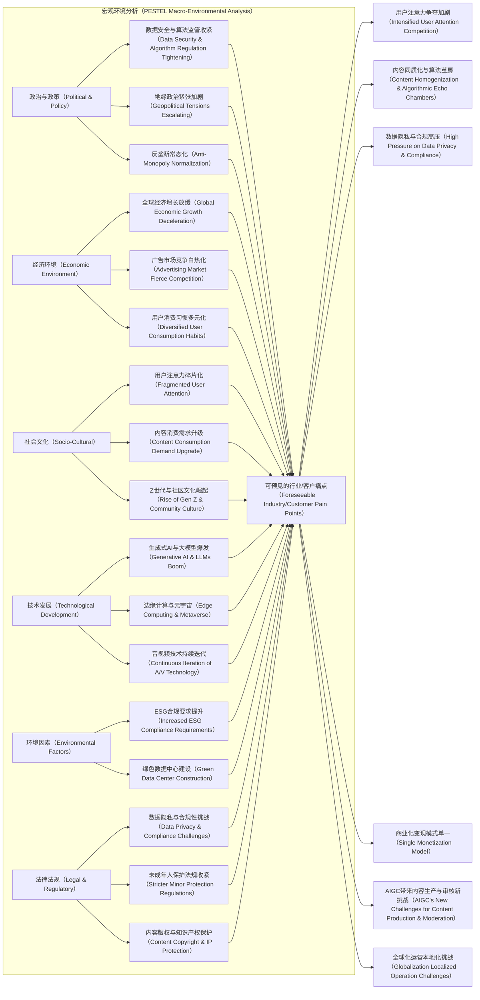
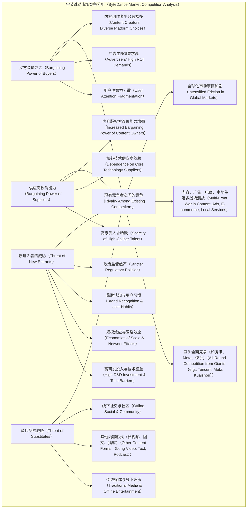
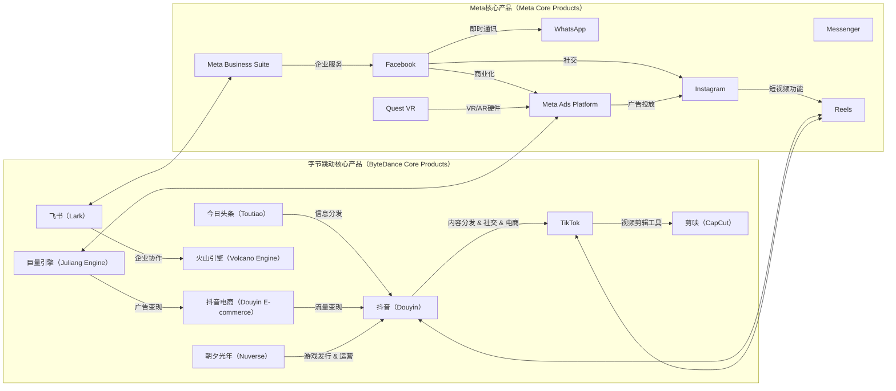
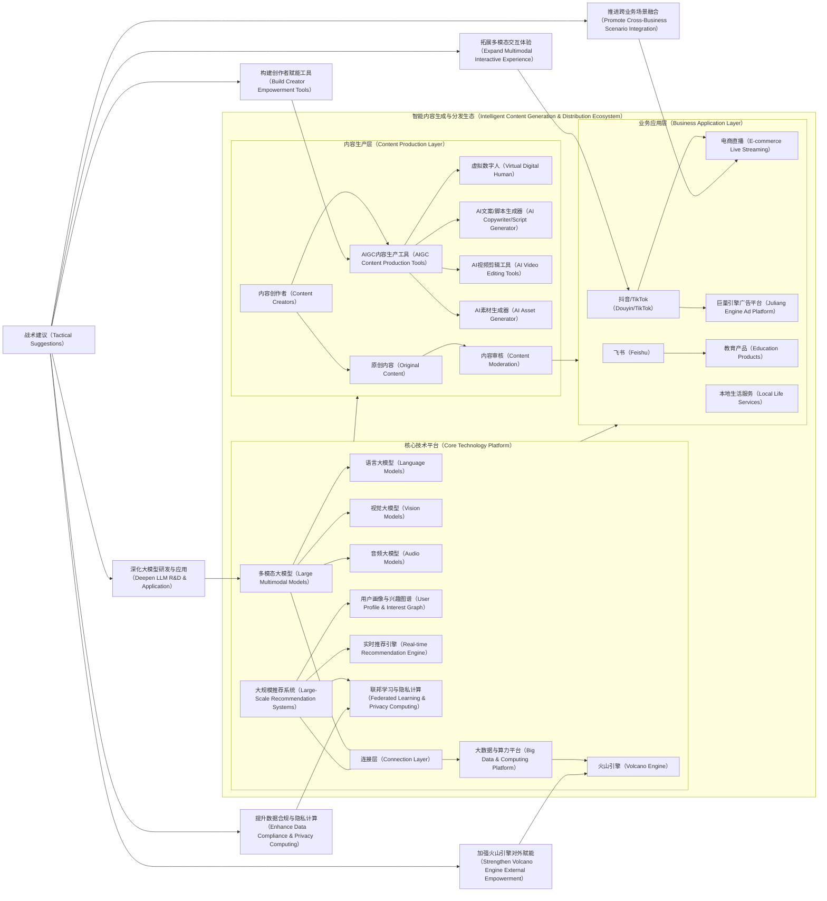

# 字节跳动公司整体分析

## 1. 引言

作为全球领先的科技巨头，字节跳动（ByteDance）以其独特的推荐算法和全球化的产品布局，深刻改变了信息分发、社交互动和内容消费的格局。本次分析报告对字节跳动进行一次全面而深入的评估。我们将不仅关注其已有的市场表现和技术实力，更将结合当前及未来3-5年的行业趋势与技术变革，洞察其发展潜力、面临的挑战以及潜在的战略机遇。

本报告将运用多项成熟的分析框架并在此基础上，对字节跳动及其核心产品线进行全面的竞品分析，识别关键竞争对手并进行深度对比。同时，我们将探讨技术生态建设的重要性，并针对其关键技术提出具体战术建议。

## 2. 字节跳动公司概览

字节跳动，一家以内容平台起家的科技企业，其核心业务已扩展至信息分发、社交媒体、短视频、娱乐、电商和教育等多元领域。代表性产品包括新闻聚合平台“今日头条”、全球短视频平台“抖音”（Douyin）和“TikTok”，以及面向企业的办公协作工具“飞书”（Lark/Feishu）。此外，公司在游戏（朝夕光年）、在线教育（曾推出瓜瓜龙、清北网校）和本地生活服务等领域均有涉猎。

在营收模型方面，字节跳动构建了包括广告投放（巨量引擎）、内容变现、电商直播（抖音电商）和本地商家服务等在内的多元化体系。其全球化布局尤为突出，旗下TikTok在欧美及东南亚市场拥有强大影响力。

技术方面，字节跳动的核心优势集中在大规模推荐系统、人工智能（AI）、自然语言处理（NLP）、计算机视觉（CV）与多媒体处理。公司在内容推荐算法和用户画像建模方面处于行业领先地位，尤其在深度学习和机器学习框架（如自研平台MMedia、XDL）方面实力雄厚。其AI能力广泛应用于信息分发、图像识别、语音交互和内容审核等场景。同时，字节跳动具备强大的基础架构建设能力，包括大数据处理平台（如火山引擎 Volcano Engine）、边缘计算、音视频技术、分布式系统、数据库、云原生服务等。其开放平台“火山引擎”已向外部客户提供技术中台、A/B实验平台、推荐服务和多媒体处理服务，体现了技术产品化和商业化的高水平能力。

## 3. 行业与市场趋势分析

### 3.1 宏观环境分析

我们分析影响字节跳动发展的外部宏观因素及其带来的行业痛点。

**解释：**
PESTEL分析揭示了字节跳动面临的复杂外部环境。政治和法律层面，全球范围内的数据安全、算法监管、反垄断及未成年人保护法规日益收紧，这直接增加了运营成本和合规风险，并可能限制其全球扩张。经济放缓则对广告收入造成压力，也加速了广告市场的竞争白热化。社会文化方面，用户对内容质量、社区氛围、个性化体验的需求不断升级，同时也对“算法茧房”和信息茧房效应提出质疑。技术是字节跳动的核心优势，但生成式AI和大模型的爆发既是机遇也是挑战，需要持续高投入。环境因素虽非直接业务核心，但ESG合规已成为全球企业的重要考量。这些宏观趋势共同构成了字节跳动未来3-5年发展中必须应对的挑战和客户/行业痛点。

### 3.2 行业业务趋势

1. **内容产业的全球化与深度本地化：** 短视频和直播已成为全球主流内容消费形式，其传播超越国界。然而，成功的全球化需兼顾深度本地化运营，包括内容生产、社区管理、商业化模式等，以适应不同国家和地区的文化和法规。
2. **直播电商与本地生活服务的融合爆发：** 直播电商已从补充性销售渠道转变为核心消费场景，并与本地生活服务深度结合，形成“内容+交易+服务”的闭环，是流量变现的重要方向。
3. **泛娱乐生态融合：** 视频、音乐、游戏、文学、动漫等娱乐形式的界限日益模糊，超级平台将整合更多娱乐内容，提供一站式体验，形成更强的用户粘性。
4. **AI驱动的个性化与沉浸式体验：** AI不仅应用于内容推荐，更将深入内容创作（AIGC）、虚拟形象、数字人互动、沉浸式场景（如元宇宙雏形），提供前所未有的个性化和互动体验。
5. **企业服务SaaS化与云化：** 随着企业数字化转型加速，协同办公（如飞书）和云服务（如火山引擎）的市场潜力巨大，技术中台、A/B实验等能力将成为企业降本增效的关键。

### 3.3 行业技术趋势

1. **生成式AI（AIGC）与多模态大模型：** 这是未来3-5年最关键的技术趋势。从文本、图像到视频、音频，AI将深度参与内容的生成、编辑和分发，极大提升内容生产效率和丰富度，并催生新的商业模式。对字节跳动而言，其在大规模数据、算力、推荐算法的积累将是构建自身大模型竞争力的基石。
2. **大规模推荐系统（Recommendation Systems）的演进：** 推荐系统将从基于用户历史行为和内容特征的“匹配”阶段，进入结合实时意图、多模态信息、跨场景协同甚至生成式反馈的“理解与创造”阶段，更注重用户的情绪、意图和长远价值，解决“算法茧房”问题。
3. **计算机视觉（CV）与多媒体处理的融合升级：** 随着VR/AR、元宇宙概念的兴起，对高清、超高清视频处理、实时渲染、三维重建、虚拟形象生成等技术提出更高要求。音视频编解码、传输优化（边缘计算辅助）将持续提升用户体验。
4. **数据智能与隐私计算：** 大数据处理平台将向湖仓一体、实时计算、流批一体方向发展，提升数据分析效率。同时，在日益严格的数据隐私法规下，联邦学习、差分隐私、同态加密等隐私计算技术将成为数据合规利用的必然选择。
5. **基础架构的云原生化与弹性伸缩：** 分布式系统、容器化、微服务、服务网格等云原生技术将进一步普及，提升系统韧性、可扩展性和资源利用效率。火山引擎作为其技术对外输出的窗口，将在这方面发挥关键作用。

## 4. 公司战略分析

### 4.1 愿景与经营理念

字节跳动的愿景是“激发创造，丰富生活”（Inspire Creativity, Enrich Life）。其经营理念的核心在于通过技术驱动，尤其是强大的推荐算法，高效连接信息与用户，并在此基础上构建多元化的内容生态和商业变现模式。公司文化强调“务实敢为”（Always Day 1）、“开放谦逊”、“追求极致”、“坦诚清晰” \[2]。

### 4.2 研发投入与创新能力

字节跳动在研发投入上一直不遗余力，尤其在核心的推荐算法、AI基础研究及应用层面。其创新能力体现在：

* **技术引领：** 大规模推荐系统、AI、NLP、CV等领域持续投入，拥有自主研发的机器学习框架和大规模计算平台。
* **产品创新：** 凭借技术优势，不断推出如“抖音”、“TikTok”等现象级产品，并在短时间内形成全球影响力。
* **生态拓展：** 从信息分发到社交、电商、办公协作、本地生活，不断拓宽业务边界，形成协同效应。
* **技术商业化：** 通过“火山引擎”将内部积累的技术能力对外开放，变技术为产品和服务，构建新的增长曲线。

### 4.3 资本运作与投资策略

字节跳动在资本运作上较为激进，通过大量的投资和并购快速拓展业务边界，例如对Pico（VR）、沐瞳科技（游戏）等的收购。其投资策略倾向于围绕核心业务生态进行上下游布局，补齐短板或增强核心竞争力。在资金筹集方面，作为未上市公司，主要依赖股权融资，其高估值和快速增长吸引了顶级投资机构的青睐。

## 5. 市场与竞争地位分析

### 5.1 行业定位

字节跳动在全球内容平台和移动互联网行业中，已从挑战者成长为领导者之一。在短视频领域，“抖音”和“TikTok”在全球范围内占据绝对的市场主导地位。在信息分发领域，“今日头条”在中国市场仍有稳固的用户基础。在企业协作SaaS领域，“飞书”是新兴的有力竞争者。

### 5.2 市场竞争环境

我们运用波特五力模型，分析字节跳动所处的市场竞争态势。

**解释：**

* **买方议价能力（高）：** 用户注意力稀缺，广告主对ROI要求极高，内容创作者在多个平台之间有选择权，这都增加了字节跳动的用户和商业化压力。
* **供应商议价能力（中高）：** 稀缺的高素质AI和技术人才、部分核心技术（如芯片、云计算基础设施）的依赖性，以及头部内容创作者和版权方的议价能力，是字节跳动需要平衡的方面。
* **新进入者的威胁（中低）：** 建立像字节跳动这样拥有海量用户、强大技术、复杂生态的平台，需要巨大的研发投入、数据积累和网络效应，同时面临严格的政策监管，进入壁垒较高。然而，垂直领域的创新者仍可能带来冲击。
* **替代品的威胁（中）：** 传统媒体、长视频、播客、线下社交等仍是用户可选的替代品，但字节跳动通过不断丰富内容形式和扩展服务边界，有效降低了替代威胁。
* **现有竞争者之间的竞争（极高）：** 这是字节跳动面临最激烈的竞争。国内外巨头如腾讯（微信视频号、游戏）、Meta（Facebook、Instagram、Reels）、谷歌（YouTube）、快手（Kuaishou）、亚马逊（Amazon）等，在内容、广告、电商、社交等多个战场展开全面竞争。

### 5.3 市场需求与趋势

1. **个性化与沉浸式体验：** 用户期待更精准的内容推荐、更丰富的互动形式和更沉浸的体验（如VR/AR、元宇宙），这将是字节跳动继续深化AI能力和多媒体技术投入的方向。
2. **“内容即服务”与“即看即买”：** 消费者从被动接收内容转向主动参与和消费，内容与商业的融合（直播电商、短视频带货、本地生活）是主要趋势。
3. **泛娱乐与知识消费：** 除了娱乐消遣，用户对有深度、有价值的知识内容需求日益增长，知识付费、专业内容分发将是新的增长点。
4. **工作流数字化与智能化：** 随着远程办公和混合办公成为常态，企业对高效、智能的协同办公工具需求旺盛，飞书将面临巨大的市场机遇。
5. **全球化与本地化平衡：** 在全球市场，文化、政策、用户习惯的差异要求公司在保持产品全球一致性的同时，进行深入的本地化调整。

## 6. 与竞争对手的全面比较分析

字节跳动在全球范围内面临来自不同领域的强大竞争对手。我们将从以下几个维度进行全面比较：

### 6.1 核心产品线竞品分析

| 产品线        | 字节跳动主要产品/业务          | 核心竞争对手及竞品                                                                                                                                      | 竞争优势与劣势分析                                                                                                                                                                                                                                                                                                      |
| :--------- | :------------------- | :--------------------------------------------------------------------------------------------------------------------------------------------- | :------------------------------------------------------------------------------------------------------------------------------------------------------------------------------------------------------------------------------------------------------------------------------------------------------------- |
| **短视频/社交** | 抖音（Douyin）、TikTok    | 1. 快手（Kuaishou）：抖音的国内最大竞品。 2. Meta（Facebook, Instagram Reels）：全球范围内TikTok的最大竞品。 3. YouTube Short：谷歌的短视频产品。 4. Snapchat、Pinterest等。 | **字节跳动优势：** - **算法推荐领先：** 强大的“兴趣电商”能力，基于海量用户数据和深度学习的个性化推荐算法，实现高用户粘性和高效率分发。 - **全球化布局：** TikTok率先在全球市场取得突破，形成先发优势和品牌影响力。 - **内容生态丰富：** 泛娱乐内容、专业PGC、UGC并重，内容生产和消费效率高。 **字节跳动劣势：** - **监管压力：** 国内外数据安全、内容审核、反垄断等政策风险高。 - **社交关系链薄弱：** 相较于微信、Facebook等，字节跳动的核心优势是“信息找人”，而非“人找人”，社交关系链沉淀较弱。 |
| **信息分发**   | 今日头条                 | 1. 腾讯新闻、新浪新闻等传统新闻门户。 2. 百度百家号、搜狐号等自媒体平台。 3. 微信公众号、视频号。                                                                                 | **字节跳动优势：** - **个性化推荐：** 今日头条在新闻聚合领域的个性化推荐仍具优势。 - **内容生态：** 搭建了庞大的内容创作者生态。 **字节跳动劣势：** - **用户增长瓶颈：** 在国内新闻资讯市场趋于饱和，用户增长面临瓶颈。 - **流量分散：** 流量向短视频、社交媒体倾斜，对今日头条形成分流。 - **商业模式单一：** 主要依赖广告，变现模式相对单一。                                                                                       |
| **电商**     | 抖音电商                 | 1. 阿里巴巴（淘宝、天猫）：传统电商巨头。 2. 京东（JD.com）：以自营物流和高品质著称。 3. 拼多多：以社交裂变和低价策略崛起。 4. 腾讯（微信小程序电商）：社交电商。                                        | **字节跳动优势：** - **内容场域：** 抖音的巨大流量和内容属性，实现“兴趣电商”和“即看即买”，转化效率高。 - **直播带货：** 建立了成熟的直播带货机制和达人矩阵。 - **用户基数：** 庞大的短视频用户群体是其电商业务的天然流量池。 **字节跳动劣势：** - **供应链和物流：** 缺乏自建物流和完善的供应链体系，依赖第三方服务。 - **信任体系：** 相较于传统电商，消费者对平台信任度、售后服务体系仍需提升。 - **商品品类丰富度：** 仍需拓展和优化。                                |
| **企业服务**   | 飞书（Lark/Feishu）、火山引擎 | 1. 钉钉（DingTalk）、企业微信：中国本土协同办公巨头。 2. 腾讯云、阿里云、华为云：中国云服务市场巨头。 3. Microsoft Teams、Google Workspace：全球协同办公软件。                               | **字节跳动优势：** - **产品体验：** 飞书在用户体验、协作效率方面口碑较好，尤其受到新兴互联网企业的青睐。 - **技术输出：** 火山引擎作为技术中台，将核心技术能力商业化，具备差异化竞争优势。 - **内部验证：** 飞书和火山引擎均在字节跳动内部得到大规模验证，技术和产品成熟度高。 **字节跳动劣势：** - **市场份额：** 相较于先行者，市场份额仍小，品牌认知度需进一步提升。 - **客户群体：** 早期主要服务互联网及科技企业，拓展传统企业市场需投入更多。 - **生态建设：** 生态合作伙伴和应用市场仍需完善。    |
| **游戏**     | 朝夕光年（Nuverse）        | 1. 腾讯游戏：全球最大游戏公司。 2. 网易游戏：中国领先的游戏开发商。 3. Sony、Microsoft、任天堂等传统游戏巨头。                                                                    | **字节跳动优势：** - **流量导入：** 抖音/TikTok等平台拥有巨大的游戏宣发和用户导入能力。 - **休闲游戏发行：** 在休闲游戏领域积累了一定经验。 **字节跳动劣势：** - **自研能力：** 缺乏3A级大作或核心IP的自研能力。 - **发行经验：** 相比腾讯等巨头，游戏发行和运营经验仍显不足，且对版号政策敏感。 - **竞争激烈：** 游戏市场竞争异常激烈，头部效应明显。                                                                              |

### 6.2 评估后最大的竞争对手：Meta（Facebook, Instagram, WhatsApp, Reels）深度对比分析

在全球短视频和社交媒体领域，字节跳动与Meta是直接且最激烈的竞争对手。两者都在争夺用户注意力、广告预算和内容创作者。

**6.2.1 战略对比**

| 战略维度      | 字节跳动（ByteDance）                                                   | Meta（Facebook）                                                                   | 深度对比分析                                                                                                                                  |
| :-------- | :---------------------------------------------------------------- | :------------------------------------------------------------------------------- | :-------------------------------------------------------------------------------------------------------------------------------------- |
| **核心战略**  | **兴趣导向，技术驱动，快速扩张。** 通过算法连接内容与人，以短视频为核心，向电商、本地生活、企业服务多元化扩张，并积极全球化。 | **社交关系链为核心，生态闭环，元宇宙转型。** 以Facebook、Instagram为支柱构建社交图谱，并通过AR/VR布局未来元宇宙，寻求下一代计算平台。 | **异曲同工，重心不同：** 两者都重视用户连接和内容消费，但字节跳动更侧重“人找信息”的效率和内容消费的广度，Meta更侧重“人找人”的社交关系链和熟人社交的深度。Meta对元宇宙的投入是孤注一掷的未来押注，字节跳动则更注重现有业务的商业化拓展和技术赋能。       |
| **技术策略**  | **大规模推荐算法、AI应用。** 自研机器学习框架，AI能力广泛应用于内容推荐、审核、生成。技术中台火山引擎对外开放。      | **AI、AR/VR、区块链。** 在AI领域大量投入，服务于内容推荐和用户体验。AR/VR是其元宇宙战略核心，区块链技术也在探索应用。             | **各有侧重，相互学习：** 字节跳动在短视频推荐算法、内容审核、音视频处理方面更具优势。Meta在通用AI基础研究、AR/VR硬件及软件生态方面投入更多。双方都在学习和借鉴对方的成功经验，例如Meta推出Reels对标TikTok，字节跳动也在探索AR/VR相关内容。 |
| **商业化模式** | **广告（巨量引擎）+电商（抖音电商）+本地生活+游戏+企业服务。** 多元化营收，电商增长迅速。                 | **广告（社交广告）+元宇宙硬件/软件。** 广告收入仍是绝对支柱，元宇宙业务仍处于亏损烧钱阶段。                                | **字节跳动更具灵活性：** 字节跳动的商业化模式更加多元且成熟，电商和本地生活服务为其带来了新的增长极。Meta的收入来源相对单一，高度依赖广告，且元宇宙业务短期内难以贡献利润。这使得字节跳动在经济下行周期中，收入结构更具韧性。                     |
| **全球化**   | **激进且成功，TikTok全球影响力巨大。** 通过本地化运营和全球统一的算法框架，实现快速扩张。                | **成熟但受限，Facebook/Instagram已是全球巨头。** 但在特定市场（如中国）受限，且面临日益严格的数据主权和反垄断挑战。            | **TikTok的挑战者姿态：** TikTok的崛起打破了Meta在全球社交媒体的垄断地位，尤其在年轻用户群体中影响力巨大。然而，TikTok也面临更严峻的全球政策和文化冲突风险。Meta的全球化基础更深厚，但增长空间受限。                       |

**6.2.2 产品对比**

**解释：**
字节跳动的核心产品以“内容”和“兴趣”为驱动，强调信息流的效率和内容的消费体验。抖音和TikTok通过短视频和算法推荐构建了庞大的用户池，并以此为基础拓展了电商和本地生活服务，形成了“流量+内容+交易”的闭环。飞书和火山引擎则代表了其在B端市场的布局，将内部技术能力产品化。

Meta的核心产品以“社交关系链”为基础，强调“人与人”的连接。Facebook、Instagram、WhatsApp构建了全球最大的社交图谱。尽管Meta通过Reels积极追赶短视频潮流，但其在算法推荐的效率上仍略逊于字节跳动，且其商业模式高度依赖社交广告。Meta对元宇宙（Quest VR）的投入，是其对下一代计算平台的愿景，但目前仍处于早期烧钱阶段。

**核心差异点：**

1. **用户心智：** 字节跳动是“内容娱乐消费”平台，Meta是“社交连接”平台。
2. **流量分发逻辑：** 字节跳动是“算法找人”的兴趣分发，Meta是“关系链分发”与“算法分发”并存。
3. **商业模式成熟度：** 字节跳动在电商、本地生活等变现路径上探索得更深入，多元化收入结构更健康。Meta仍在寻求广告之外的第二增长曲线。
4. **全球化风险：** TikTok在全球受到的政治和监管审查，远超Meta在全球面临的挑战。

### 6.3 财务状况对比（定性分析，基于公开信息和市场普遍认知）

由于字节跳动是未上市公司，缺乏公开的详细财务数据，我们将基于市场普遍认知和行业分析报告进行定性对比。

* **营收规模与增长：** 字节跳动近年来营收增长迅猛，尤其在短视频和电商业务的带动下。虽然具体数字未公开，但市场普遍认为其已达到千亿美元量级，并保持较高增长率。Meta作为上市公司，营收规模巨大，但近年来增长受宏观经济和竞争压力影响有所放缓，元宇宙业务（Reality Labs）持续高额亏损，侵蚀了整体利润。
* **盈利能力：** 字节跳动核心业务（如抖音、TikTok广告及电商）盈利能力强劲，但新业务（如游戏、教育、飞书早期投入）可能仍在投入期。Meta核心广告业务盈利能力极强，但因元宇宙的巨额投入导致整体利润承压。
* **现金流：** 两者核心业务均具备强大的现金流创造能力，但字节跳动在资本开支和新业务投入上可能更显激进，而Meta的现金流则需大量用于元宇宙的研发和基础设施建设。
* **估值与融资：** 字节跳动作为非上市公司，估值波动较大，但一直维持在较高水平，反映市场对其增长潜力的认可。Meta市值受元宇宙战略和宏观经济影响，波动较大。

**总结：** 字节跳动在业务增长势头和多元化变现上更具活力和韧性，但在全球化合规风险和基础研发投入（尤其是通用大模型）上需持续关注。Meta则在社交关系链和基础AI研究上有深厚积累，但元宇宙的巨大投入对其短期财务表现构成压力。

## 7. 评估后最重要的某项具体技术的生态建设建议

根据字节跳动的核心优势和未来趋势，我们评估其最重要的技术是**大规模推荐系统（Large-Scale Recommendation Systems）与生成式AI（Generative AI）融合**。这两项技术的融合将是字节跳动在内容、电商、社交乃至企业服务领域保持竞争力的核心。

### 7.1 技术融合与生态建设必要性

字节跳动以推荐系统起家，对用户兴趣的理解和内容的精准分发是其护城河。随着AIGC和大模型的发展，内容生产将变得更加高效和个性化。将强大的推荐能力与先进的生成式AI结合，可以实现：

1. **内容智能生产与分发闭环：** AI生成内容，推荐系统精准分发，用户反馈再优化AI生成。
2. **广告与电商效率提升：** AI生成个性化广告素材、商品描述，推荐系统精准匹配用户，提高转化率。
3. **用户体验革命性升级：** 虚拟人直播、智能客服、个性化互动叙事等沉浸式体验。
4. **技术产品化竞争力增强：** 火山引擎可向外部客户提供更高级的“AI推荐+AIGC”一体化解决方案。

### 7.2 战术建议：构建“智能内容生成与分发”生态

我们将通过一个架构图来展示这一生态的建设路径。

**7.2.1 战术建议详解**

1. **深化多模态大模型研发与应用：**

   * **战略投入：** 持续投入重金和顶级人才，自研或合作研发具有行业领先水平的多模态大模型，特别是针对短视频、直播、图像、音频等垂直领域的模型优化。
   * **数据飞轮：** 利用字节跳动海量的用户行为数据、内容数据（包括多模态数据）以及反馈数据，构建数据飞轮，不断训练和优化大模型，形成数据壁垒。
   * **模型轻量化与边缘部署：** 针对移动端应用场景，研发轻量化模型和边缘计算技术，确保AIGC和推荐算法在用户设备上实现低延迟、高性能运行。

2. **构建创作者赋能工具：**

   * **AIGC创作平台：** 将AIGC能力封装成易用的创作工具（如剪映升级AIGC能力），赋能内容创作者，降低内容生产门槛，提升内容产出效率和多样性（例如：AI一键生成短视频脚本、AI配音、AI剪辑、AI虚拟形象）。
   * **智能审核与合规：** 利用AI技术提高内容审核效率和准确性，应对AIGC可能带来的内容合规新挑战，保障平台内容健康。
   * **激励机制：** 设立专项基金或奖励计划，鼓励创作者使用AIGC工具进行创作，并根据内容效果给予额外流量倾斜或商业化支持。

3. **拓展多模态交互体验：**

   * **虚拟数字人/AI主播：** 在直播电商、娱乐、教育等场景，推出高度拟人化的虚拟数字人/AI主播，提供24小时不间断、高度个性化的直播和互动服务。
   * **智能推荐交互：** 探索基于语音、手势、眼动等更自然的交互方式，让推荐系统更好地理解用户隐性需求，提供更沉浸、更自然的体验。
   * **AR/VR内容融合：** 结合Pico等VR硬件布局，探索AI生成的3D内容、虚拟场景在元宇宙概念下的应用，构建沉浸式娱乐体验。

4. **提升数据合规与隐私计算能力：**

   * **构建隐私计算平台：** 在火山引擎中集成联邦学习、差分隐私、多方安全计算等技术，在数据不出域的前提下，实现用户数据价值的挖掘和推荐算法的优化。
   * **透明化与用户授权：** 增强算法推荐的透明度，向用户提供更多关于推荐逻辑的解释和数据使用权限的控制，提升用户信任度，应对全球数据隐私监管要求。
   * **数据脱敏与去标识化：** 严格执行数据脱敏和去标识化流程，确保在算法训练和数据分析过程中用户隐私得到最高级别的保护。

5. **加强火山引擎对外赋能：**

   * **“AI推荐+AIGC”一体化解决方案：** 将内部成熟的推荐算法与AIGC能力打包成标准化的产品和解决方案，通过火山引擎向外部企业客户（特别是电商、媒体、娱乐等行业）提供服务。
   * **行业定制化服务：** 针对不同行业的特点和需求，提供定制化的推荐系统和AIGC模型训练服务，帮助客户构建自己的智能内容生态。
   * **开发者生态：** 搭建友好的开发者平台和社区，吸引第三方开发者基于火山引擎的AI和推荐能力，开发更多应用和工具。

6. **推进跨业务场景融合：**

   * **兴趣电商深化：** AIGC应用于商品详情页、直播脚本、营销文案的自动生成，推荐系统更精准地匹配商品与用户，实现“货找人”效率最大化。
   * **本地生活智能化：** AIGC生成本地商家探店视频、图文攻略，推荐系统基于用户地理位置和兴趣，精准推荐本地服务。
   * **飞书AI赋能：** 将大模型应用于飞书，提升文档智能摘要、会议纪要自动生成、代码辅助开发、智能知识库问答等功能，提高企业协作效率。

这些战术建议将帮助字节跳动在核心技术领域构筑更深的护城河，并将其技术优势转化为更强的商业化能力，以应对未来的市场竞争和技术变革。

---

**参考资料**
- \[1] ByteDance Official Website.
- \[2] ByteDance Culture & Values.
- \[3] Volcano Engine Official Website.
- \[4] Meta Platforms Inc. Investor Relations.
- \[5] 快手科技（Kuaishou Technology）投资者关系.
- \[6] Google Investor Relations.
- \[7] 行业研究报告.
- \[8] 媒体报道与分析.