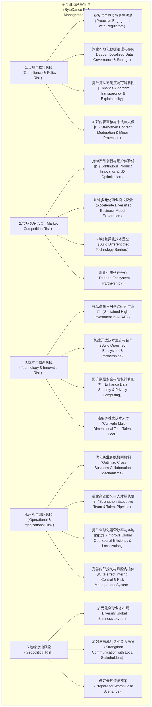

# 字节跳动公司调整分析

## 1. 引言

基于对字节跳动公司在宏观环境、行业趋势、竞争格局及现有业务布局的深入分析（详见`01-overview.md`），本报告将聚焦于识别当前及未来发展中的关键挑战与潜在痛点，并提出一系列切实可行的短期调整与中长期优化建议。这些建议旨在帮助字节跳动在日益复杂和竞争激烈的市场环境中，持续保持领先地位，增强企业韧性，并抓住新兴技术与业务机遇，实现可持续增长。

## 2. 企业诊断与关键问题识别

从第一份报告的全面分析中，我们识别出字节跳动当前面临的以下核心挑战与问题：

1. **全球化运营的合规与地缘政治风险：** 尤其是TikTok，在全球范围内面临日益严格的数据安全、内容监管及地缘政治审查，这直接影响其市场拓展和商业化进程。
2. **核心广告业务增长瓶颈与变现多元化压力：** 尽管广告收入依然强劲，但宏观经济下行和市场竞争加剧导致增长趋缓，公司亟需在新兴业务（电商、本地生活、企业服务）上加速盈利，实现收入结构多元化。
3. **内容生态的深度与用户黏性挑战：** 随着用户注意力碎片化和内容同质化加剧，如何突破“算法茧房”，提升内容的深度、互动性和社区归属感，是保持用户活跃度和忠诚度的关键。
4. **AIGC时代的技术领先性与成本控制：** 生成式AI和大模型的爆发既是巨大机遇，也是技术和资本密集型挑战。如何保持在AI领域的领先优势，同时有效控制大模型训练和运营的高昂成本，是战略性考量。
5. **组织架构与人才管理适应性：** 作为一家快速扩张、业务线众多的科技巨头，如何构建适应多业务协同发展、鼓励创新的组织架构和人才梯队，是支持其长期发展的核心。
6. **ESG表现与社会责任：** 随着公司规模的扩大和全球影响力增强，社会各界对其在内容审核、数据隐私、员工福利、环境保护等方面的ESG表现提出更高要求。

## 3. 短期调整建议（0-1年）

针对上述关键问题，以下为未来6-12个月内可立即着手实施的短期调整建议：

### 3.1 强化全球化运营韧性与合规能力

1. **建立跨区域合规专家团队：**

   * **行动：** 成立由法律、政策、数据安全、公共关系专家组成的跨区域合规智囊团，直接向最高管理层汇报。
   * **目标：** 实时跟踪全球主要市场（尤其北美、欧洲、东南亚）的政策法规变化，预判风险，快速响应监管问询。
2. **深化本地化数据治理与存储方案：**

   * **行动：** 在关键市场探索并落实数据本地化存储（如TikTok项目“Project Texas”），同时确保数据处理和访问流程符合当地隐私法规（如GDPR、CCPA）。
   * **目标：** 降低数据跨境传输风险，增强用户数据安全信任，减少政治干预压力。
3. **提升危机公关与透明度：**

   * **行动：** 建立完善的全球危机公关预案，与当地政府、媒体、智库保持常态化沟通。适度增加产品和算法透明度，主动回应外界关切。
   * **目标：** 提升企业声誉，争取更友好的外部环境。

### 3.2 提升核心业务变现效率与精细化运营

1. **深化巨量引擎广告解决方案：**

   * **行动：** 针对广告主痛点，推出更多行业定制化、效果导向的广告产品（如AI生成创意素材、智能投放优化）。强化与中小商家的合作，降低广告投放门槛。
   * **目标：** 提升广告主ROI，稳固广告基本盘，吸引更多长尾客户。
2. **加速抖音电商与本地生活服务闭环：**

   * **行动：** 优化商家入驻与管理流程，加强平台物流与售后服务体系建设。加大对优质内容创作者（带货达人、探店达人）的扶持力度和商业化培训。
   * **目标：** 提升用户在平台内的交易转化率和复购率，增加GMV和平台服务收入。
3. **探索AI驱动的增值服务：**

   * **行动：** 利用AIGC能力，为广告主和内容创作者提供低成本、高效率的素材生成、文案撰写、虚拟人直播等增值服务，并进行商业化探索。
   * **目标：** 开拓新的营收点，提升生态伙伴生产力。

### 3.3 优化内容生态与用户体验

1. **推行“兴趣+关系”双轮驱动：**

   * **行动：** 在核心产品中加强社交属性，鼓励用户分享、评论和互动，增强用户间的连接和社区归属感。
   * **目标：** 补充算法推荐的“深度”不足，缓解“算法茧房”，提升用户粘性。
2. **扶持多元化、高质量内容：**

   * **行动：** 加大对PGC（专业生产内容）和PUGC（专业用户生产内容）的扶持，引入更多知识、教育、纪录片等高质量内容，平衡娱乐化。
   * **目标：** 提升平台内容价值感，吸引更广泛的用户群体。
3. **提升算法透明度与用户控制权：**

   * **行动：** 研发并测试向用户解释推荐逻辑的功能（如“为什么推荐这个”），并提供更细致的兴趣偏好设置和内容过滤选项。
   * **目标：** 增强用户信任，减少算法争议，提升用户体验满意度。

## 4. 中长期优化建议（1-3年）

### 4.1 战略层面：构建以AI为核心的未来增长曲线

1. **深化多模态大模型战略地位：**

   * **行动：** 将多模态大模型作为公司未来核心竞争力，持续高额投入，确保在模型架构、训练数据、算力资源和工程化应用方面保持全球领先。
   * **目标：** 支撑所有业务线的智能化升级，从“推荐”到“生成”，引领下一代内容与交互范式。
2. **推进“内容+商业+服务”生态一体化：**

   * **行动：** 打通抖音/TikTok、电商、本地生活、飞书等业务线的数据与技术中台，构建更为紧密的生态协同。例如，飞书可作为企业直播、电商后台管理的入口。
   * **目标：** 形成强大的网络效应和数据飞轮，提升用户全生命周期价值，降低获客成本。
3. **全球化战略的本地化纵深：**

   * **行动：** 在核心海外市场设立更多本地研发中心和运营团队，深入理解当地文化和用户习惯，推行更具区域特色的产品功能和商业模式。
   * **目标：** 提升全球运营的灵活性和韧性，降低地缘政治风险，实现可持续的海外增长。

### 4.2 业务层面：深化垂直领域创新与拓展

1. **创新性内容消费体验：**

   * **行动：** 结合VR/AR、元宇宙、空间计算等新兴技术，探索超高清、沉浸式、交互性更强的内容形式和社交场景。例如，VR演唱会、AI伴随式观影。
   * **目标：** 抢占未来内容消费的制高点，构建差异化竞争优势。
2. **企业服务：火山引擎与飞书的协同爆发：**

   * **行动：** 火山引擎作为技术输出平台，应深度结合AIGC和推荐系统能力，面向金融、零售、制造等传统行业，提供场景化的AI解决方案。飞书则可借力AI，深化智能办公和知识管理，拓展中大型企业市场。
   * **目标：** 打造新的千亿级营收增长极，提升企业服务SaaS的市场份额和品牌影响力。
3. **游戏业务的IP孵化与生态构建：**

   * **行动：** 从流量导向转向IP驱动，加大对自研和外部优秀IP的投资与合作，逐步提升3A级游戏研发能力。利用短视频平台优势，构建游戏宣发和玩家社区闭环。
   * **目标：** 在核心游戏领域形成竞争力，与流量优势协同，实现长期稳定的游戏营收。

### 4.3 组织与人才：构建高韧性与创新力的组织

1. **强化“One ByteDance”的协同机制：**

   * **行动：** 优化内部组织架构，破除业务线壁垒，鼓励跨部门、跨业务线的协同创新项目。例如，设立创新实验室，鼓励员工内部轮岗。
   * **目标：** 提升资源利用效率，加速新业务孵化，形成内部合力。
2. **核心人才的激励与留存：**

   * **行动：** 针对AI、大模型、全球化运营等核心稀缺人才，提供具有竞争力的薪酬、股权激励、职业发展路径和创新平台。
   * **目标：** 确保核心人才队伍的稳定性和高水平，持续驱动技术和业务创新。
3. **企业文化的全球化融合：**

   * **行动：** 在保持“务实敢为”等核心文化的同时，鼓励和吸纳全球多元文化元素，推行更包容、开放的价值观，适应全球化团队的管理。
   * **目标：** 增强全球员工的归属感和凝聚力，提升海外团队的战斗力。

## 5. 风险管理与应对策略

以下是我们对字节跳动未来3-5年可能面临的主要风险，并提出相应应对策略的可视化图。

**解释：**

* **合规与政策风险：** 字节跳动在全球范围内面临的政策法规风险日益严峻。应对策略包括加强与监管机构的沟通，确保数据治理符合各地法规，并提升算法透明度，增强未成年人保护。
* **市场竞争风险：** 面对国内外巨头的全面竞争，持续的产品创新、用户体验优化、多元化商业模式探索以及构建差异化技术壁垒至关重要。
* **技术与创新风险：** 尤其是在AIGC大模型时代，需持续高投入AI基础研究，构建开放技术生态，并提升数据安全和隐私计算能力，以保持技术领先。
* **运营与组织风险：** 快速扩张带来组织效率挑战，需优化跨业务线协同，强化人才梯队建设，提升全球化运营的精细化管理能力。
* **地缘政治风险：** 尤其是TikTok，需考虑多元化全球业务布局，降低对单一市场的依赖，并加强与当地利益相关方的沟通，以应对潜在的政治不确定性。

## 6. ESG表现优化建议

作为一家全球性科技公司，字节跳动在环境（Environmental）、社会（Social）和公司治理（Governance）方面的表现日益受到关注。

### 6.1 环境（E）

1. **提升数据中心能源效率与清洁能源使用：**

   * **行动：** 投资绿色数据中心技术，提高PUE（电力使用效率），逐步引入可再生能源供电比例，减少碳排放。
   * **目标：** 响应全球气候变化倡议，提升企业社会责任形象。
2. **推动供应链可持续发展：**

   * **行动：** 与供应商合作，推动其采用环保材料和生产工艺，降低产业链整体碳足迹。

### 6.2 社会（S）

1. **加强用户数据隐私保护与透明度：**

   * **行动：** 严格遵守全球数据隐私法规（如GDPR、CCPA），持续投资隐私计算技术，提高数据使用透明度，赋能用户数据控制权。
   * **目标：** 建立用户信任，降低数据安全风险。
2. **保障内容健康与未成年人保护：**

   * **行动：** 持续投入内容审核技术与人工团队，打击有害信息、虚假信息。加强未成年人防沉迷系统建设，优化青少年模式，与家长、教育机构合作，共同营造健康网络环境。
   * **目标：** 承担平台责任，维护社会公共利益。
3. **优化员工福利与职业发展：**

   * **行动：** 提供有竞争力的薪酬福利，关注员工身心健康，完善职业发展路径和培训体系。
   * **目标：** 吸引和保留顶尖人才，提升员工满意度和忠诚度。
4. **积极参与社会公益：**

   * **行动：** 结合自身平台优势，在教育、扶贫、文化传承等领域开展更多公益项目，鼓励员工参与志愿活动。
   * **目标：** 提升企业社会形象和影响力。

### 6.3 公司治理（G）

1. **完善全球公司治理结构：**

   * **行动：** 鉴于其全球化业务，可考虑逐步引入更多独立董事，优化董事会构成，提升决策透明度和独立性。
   * **目标：** 降低治理风险，提升国际资本市场认可度（为未来上市做准备）。
2. **加强内部审计与风险控制：**

   * **行动：** 建立更健全的内部审计机制和风险管理体系，尤其是在全球化运营、数据合规、业务拓展等领域。
   * **目标：** 确保公司运营的规范性与可持续性。
3. **反腐与道德建设：**

   * **行动：** 建立完善的反腐败机制和举报通道，加强员工职业道德培训，营造清廉的企业文化。
   * **目标：** 维护公司声誉和长期健康发展。

## 7. 总结

字节跳动作为一家技术驱动的全球化科技巨头，在过去取得了令人瞩目的成就。然而，面对日趋复杂的外部环境和激烈的市场竞争，持续的自我诊断、敏捷的调整能力和前瞻性的战略规划至关重要。本报告提出的短期调整和中长期优化建议，旨在从战略、业务、组织、技术和ESG等多个维度，为字节跳动未来3-5年的发展提供指引，帮助其在不确定性中抓住机遇，构建更强大的核心竞争力与韧性，实现“激发创造，丰富生活”的愿景。

---

**参考资料**
- \[1] ByteDance Official Website.
- \[2] ByteDance Culture & Values.
- \[3] Volcano Engine Official Website.
- \[4] Meta Platforms Inc. Investor Relations.
- \[5] 行业研究报告
- \[6] 媒体报道与分析