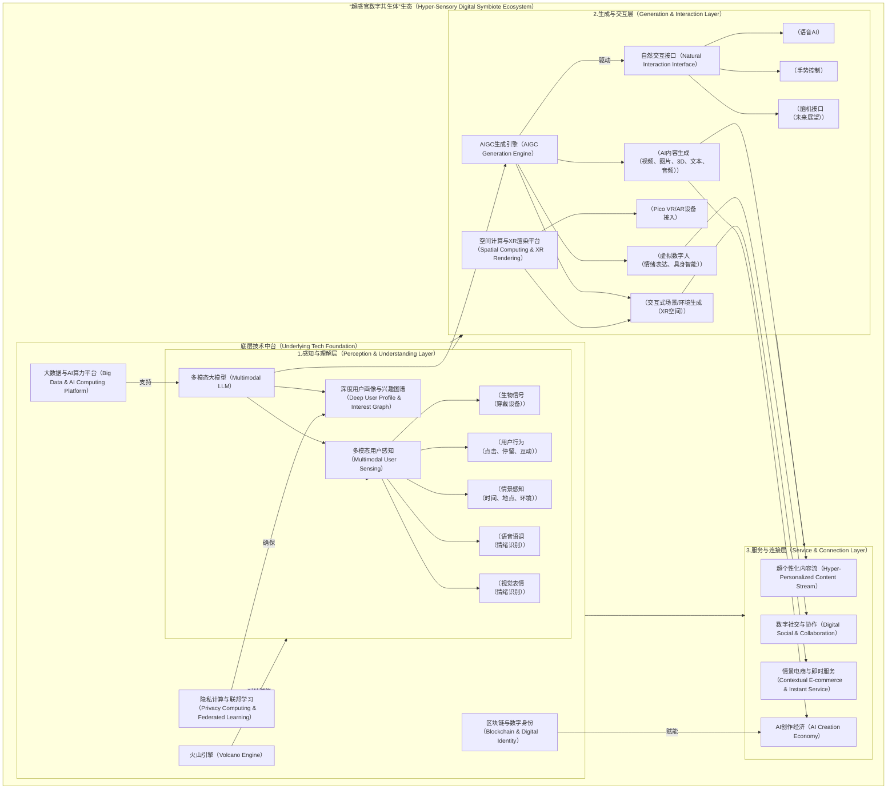
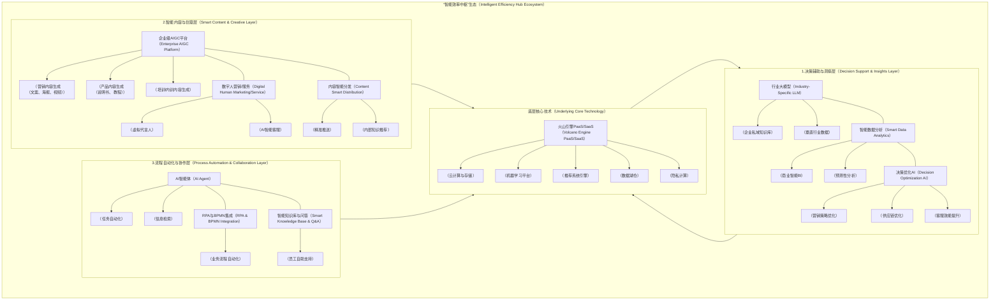

# 字节跳动公司未来变革分析

## 1. 引言

在对字节跳动（ByteDance）的宏观环境、行业趋势、竞争格局及其现有业务（详见`01-overview.md`）进行全面剖析，并提出短期调整与中长期优化建议（详见`02-adjust.md`）之后，本报告将进一步跳脱现有框架，展望未来3-5年乃至更远的十年，提出两项具备革命性潜力且高度依赖前沿AI技术驱动的增量战略。这两项战略将帮助字节跳动从现有内容平台和工具提供商的角色，升级为更具未来感、更深刻嵌入用户生活和企业运营的“数字共生体”和“智能效率中枢”。

这两项战略将是字节跳动在后短视频时代，面对AIGC浪潮、元宇宙趋势和全球化挑战，实现再次飞跃的关键。它们不仅是对现有业务的简单延伸，更是对公司核心能力（AI、推荐系统、多模态内容处理）的极致化应用与全新商业模式的构建。

## 2. 革命性增量战略一： “超感官数字共生体”（Hyper-Sensory Digital Symbiote - HSDS）

### 2.1 概念与愿景

“超感官数字共生体”（HSDS）旨在将用户在字节跳动生态内的被动“内容消费”升级为主动的“数字共生”与“情景互动”。这超越了简单的虚拟现实，而是通过整合多模态AI、空间计算、生物感知技术与现有内容生态，为用户打造一个\*\*“总能理解你、总能生成你所需、总能连接你所想”\*\*的智能数字伴侣和情景化服务入口。它不是一个单一应用，而是一种渗透式、服务化的存在。

**愿景：** 成为每个用户在数字世界中的“第二大脑”和“超感官延伸”，连接物理与数字世界，实现无缝、个性化、沉浸式的“信息-内容-服务-社交”一体化体验。

### 2.2 核心构成与技术支撑

HSDS由三个核心层级构成，并由字节跳动强大的技术中台支撑：

1. **感知与理解层（Perception & Understanding Layer）：**

   * **核心：** 强大的多模态大模型（LLM+VLM+ALM+多感官融合模型），深度学习用户偏好、情绪、行为、上下文。
   * **技术：**

     * **多模态大模型：** 融合文本、图像、音视频、行为数据、甚至穿戴设备生理信号（如心率、眼动、脑电初步数据）进行实时理解。
     * **情景感知AI：** 基于时间、地点、天气、人物关系、设备状态等，判断用户当前情景和潜在需求。
     * **情绪识别与共情AI：** 通过语音语调、面部表情、文字情感分析，识别用户情绪并进行情境适应性响应。

2. **生成与交互层（Generation & Interaction Layer）：**

   * **核心：** 基于用户理解，实时生成个性化内容、场景、对话和数字实体，并提供自然的交互方式。
   * **技术：**

     * **AIGC引擎：** 实时生成超高清图片、视频、3D模型、音乐、剧本、文案。
     * **具身智能与虚拟数字人：** 高度拟真的虚拟数字人作为用户代理或伴侣，具备情感表达和自然语言交互能力。
     * **空间计算与XR渲染：** 结合Pico硬件优势，实现虚拟内容与物理世界的融合叠加（AR），或构建完全沉浸式虚拟空间（VR）。
     * **神经渲染/光场技术：** 实现极致逼真和灵活的数字内容生成与呈现。

3. **服务与连接层（Service & Connection Layer）：**

   * **核心：** 将生成的个性化内容和服务无缝集成到现有业务中，并拓展新的商业场景。
   * **技术/商业模式：**

     * **超个性化内容流：** 不仅仅是推荐，更是AI实时生成并适配用户当前情景的内容（如：AI根据你情绪生成舒缓音乐和治愈视频）。
     * **情景电商与即时服务：** AI感知用户需求，主动推荐商品/服务，甚至生成虚拟试穿、场景化购物体验。
     * **数字社交与协作：** 虚拟分身社交、AI辅助创作、共同体验虚拟场景。
     * **数字资产与经济：** 赋能用户创建和拥有AI生成内容（UGC/AIGC）的数字产权，形成AI创作经济。

### 2.3 架构原型描述（Mermaid Diagram）

### 2.4 商业模式画布（Business Model Canvas）

**商业模式画布：超感官数字共生体（HSDS）**

| 关键伙伴（Key Partners）       | 核心活动（Key Activities）                              | 核心资源（Key Resources） | 价值主张（Value Propositions）               | 客户关系（Customer Relationships） | 客户细分（Customer Segments） |
| :----------------------- | :------------------------------------------------ | :------------------ | :------------------------------------- | :--------------------------- | :---------------------- |
| - VR/AR硬件制造商（Pico）       | - 多模态大模型研发与优化                                     | - 顶级AI科学家与工程师       | - **超个性化内容与服务：** 实时感知用户情境，AI生成适配内容与服务。 | - 高度定制化AI伴侣服务                | - 追求沉浸式、个性化体验的年轻用户（Z世代） |
| - 生物感知设备制造商              | - AIGC引擎开发与迭代                                     | - 海量用户行为与内容数据（多模态）  | - **无缝数字共生体验：** 数字分身、虚拟环境与现实无缝衔接。      | - 强交互、高黏性数字共生关系              | - 期望提升数字社交体验的用户         |
| - 顶级内容IP方（影视、游戏）         | - 空间计算与XR平台建设                                     | - 强大的AI算力与分布式架构     | - **情感连接与共情：** AI伴侣具备情感理解与共情能力。        | - 社区共建与激励机制                  | - 寻求创新内容创作与变现的创作者       |
| - 区块链基础设施提供商             | - 用户数据隐私计算与合规                                     | - 核心算法与专利技术         | - **AI创作经济赋能：** 赋能用户生成、拥有和交易数字资产。      | - 开发者社区构建（开放API）             | - 关注数字资产与Web3.0的尝鲜者     |
| - 垂直领域服务商（医疗、教育）         | - 生态伙伴合作与开放平台建设                                   | - 核心产品平台（抖音、TikTok） | - **颠覆性社交与协作：** 虚拟分身互动、AI辅助协作。         |                              |                         |
|                          |                                                   |                     | - **情景化生活服务：** AI主动提供衣食住行全方位建议与服务。     |                              |                         |
| **成本结构（Cost Structure）** | **收入来源（Revenue Streams）**                         |                     |                                        |                              |                         |
| - 研发投入（AI、大模型、XR）        | - **增值服务订阅费：** 高级AI伴侣功能、定制化虚拟场景订阅。                |                     |                                        |                              |                         |
| - 算力与基础设施运营成本            | - **数字资产交易佣金：** 用户在AI创作经济中交易数字内容/虚拟资产的平台佣金。       |                     |                                        |                              |                         |
| - 内容版权与IP授权费用            | - **场景化广告与精准营销：** 基于用户情景和AI理解的超精准、非侵入式广告（由AI生成）。  |                     |                                        |                              |                         |
| - 全球合规与法律费用              | - **虚拟物品销售：** 虚拟形象、虚拟道具、虚拟空间等销售。                  |                     |                                        |                              |                         |
| - 人才获取与维护成本              | - **API接口调用费用：** 将HSDS核心AI能力通过火山引擎开放给第三方开发者收取调用费。 |                     |                                        |                              |                         |
| - 市场推广与用户教育成本            |                                                   |                     |                                        |                              |                         |

### 2.5 挑战与风险

1. **技术成熟度：** 多模态AI、通用人工智能、脑机接口等仍处于早期阶段，实现愿景需突破大量技术瓶颈。
2. **用户接受度与伦理：** 深度个性化和AI共生可能引发隐私、算法偏见、过度依赖、甚至情感伦理问题，需严格把控。
3. **商业化路径：** 早期投入巨大，回报周期长，如何平衡技术投入与商业化变现是关键。
4. **监管与法律：** 涉及到生物信号、AI生成内容版权、虚拟资产交易等新领域，将面临大量未知的法律法规挑战。
5. **竞争：** Meta（元宇宙）、谷歌（AI）、苹果（空间计算）等巨头均在此领域布局，竞争激烈。

## 3. 革命性增量战略二： “智能效率中枢”（Intelligent Efficiency Hub - IEH）

### 3.1 概念与愿景

“智能效率中枢”（IEH）是字节跳动企业服务能力的终极形态，旨在将公司在AI、推荐系统、多媒体处理、大规模工程实践方面的优势，升级为面向企业客户的\*\*“决策辅助+内容生产+运营优化”一体化智能大脑\*\*。它超越了传统的SaaS工具或云服务，而是作为企业内部的智能中枢，赋能企业实现全链路的智能化运营和决策。

**愿景：** 成为企业数字化转型和智能化升级的“超级助手”，通过AI赋能企业员工和业务流程，极大提升效率、降低成本、驱动创新。

### 3.2 核心构成与技术支撑

IEH将基于火山引擎现有基础，深度融合AI能力，并向垂直行业拓展：

1. **决策辅助与洞察层：**

   * **核心：** 基于行业大模型和企业私域数据，提供深度分析和智能决策建议。
   * **技术：**

     * **行业大模型：** 在通用大模型基础上，针对金融、零售、制造、医疗等行业进行垂直领域知识图谱构建和模型微调。
     * **智能数据分析：** 结合实时数据流与历史数据，进行商业智能BI、用户行为预测、市场趋势洞察。
     * **决策优化AI：** 为营销、供应链、生产、客服等业务环节提供AI驱动的优化方案和自动化决策。

2. **智能内容与创意层：**

   * **核心：** 自动化生成企业所需的各类内容（营销、产品、培训），并进行智能分发。
   * **技术：**

     * **企业级AIGC平台：** 生成营销文案、广告素材、短视频、产品说明、培训课件等，并支持多语言、多风格定制。
     * **数字人营销/服务：** 为企业提供定制化虚拟主播、数字客服，支持24/7在线服务和个性化互动。
     * **内容智能分发：** 结合企业客户的用户画像和业务场景，将生成内容通过AI推荐系统精准触达目标用户。

3. **流程自动化与协作层：**

   * **核心：** 结合飞书的协作能力，通过AI实现企业内部工作流的自动化和智能化。
   * **技术：**

     * **AI Agent：** 智能体机器人，自动执行重复性任务、辅助信息检索、进行数据分析。
     * **RPA与BPMN集成：** 机器人流程自动化与业务流程管理工具集成，实现端到端的业务流程自动化。
     * **智能知识库与问答：** 飞书深度集成企业私有知识，员工通过自然语言提问获取信息和解决方案。

### 3.3 架构原型描述（Mermaid Diagram）

### 3.4 商业模式画布（Business Model Canvas）

**商业模式画布：智能效率中枢（IEH）**

| 关键伙伴（Key Partners）       | 核心活动（Key Activities）                                    | 核心资源（Key Resources） | 价值主张（Value Propositions）         | 客户关系（Customer Relationships） | 客户细分（Customer Segments）   |
| :----------------------- | :------------------------------------------------------ | :------------------ | :------------------------------- | :--------------------------- | :------------------------ |
| - 行业解决方案集成商              | - 垂直行业大模型训练与微调                                          | - 丰富的行业数据与知识        | - **全链路效率提升：** 通过AI赋能企业运营、营销、决策。 | - 大客户定制化服务                   | - 大型企业（金融、零售、制造）需要深度定制与集成 |
| - 顶级AI算法研究机构             | - 企业级AIGC能力开发                                           | - 行业专家与AI科学家        | - **AI驱动的创新：** 自动化内容生产、智能决策辅助。   | - 中小客户标准化产品订阅                | - 中小型企业（电商、内容MCN）追求降本增效   |
| - RPA/BPMN软件厂商           | - 隐私计算与数据安全合规                                           | - 火山引擎PaaS/SaaS基础能力 | - **成本显著降低：** 自动化重复任务，减少人力成本。    | - 合作伙伴生态建设                   | - 政府与公共服务机构（数据安全与效率）      |
| - 垂直行业数据源                | - 飞书与火山引擎深度融合                                           | - 大规模AI算力与模型管理平台    | - **数据驱动的洞察：** 从海量数据中提炼商业智能。     | - 开发者社区与API支持                |                           |
|                          | - 客户成功与服务支持                                             | - 成功案例与行业解决方案       | - **提升员工体验与协作效率：** 智能辅助员工工作。     |                              |                           |
| **成本结构（Cost Structure）** | **收入来源（Revenue Streams）**                               |                     |                                  |                              |                           |
| - 研发投入（垂直大模型、AIGC）       | - **订阅服务费：** 按照模块、用户数、调用量等阶梯计费的SaaS/PaaS订阅。             |                     |                                  |                              |                           |
| - 算力与基础设施成本              | - **定制化解决方案费用：** 为大型企业提供的行业大模型定制化训练、系统集成服务。             |                     |                                  |                              |                           |
| - 销售与市场推广成本              | - **API接口调用费：** 将核心AI能力（如AIGC生成、智能分析API）开放给第三方开发者收取调用费。 |                     |                                  |                              |                           |
| - 客户成功与服务支持成本            | - **增值服务费：** 如AI运维、数据治理咨询、专属模型优化服务。                     |                     |                                  |                              |                           |
| - 人才薪酬与福利                |                                                         |                     |                                  |                              |                           |

### 3.5 挑战与风险

1. **数据安全与隐私：** 涉及到企业核心数据，数据泄露或滥用将带来灾难性后果，需最高标准的数据安全与隐私保护。
2. **行业壁垒与专业度：** 深入垂直行业需要极高的专业知识和行业经验，非简单技术复制。
3. **客户教育与迁移成本：** 传统企业对AI接受度有限，现有流程改造和员工培训成本高昂。
4. **市场竞争：** 阿里云、腾讯云、华为云、微软、SAP等传统企业服务巨头均在AI和SaaS领域布局，竞争激烈。
5. **技术落地与效果：** AI模型在复杂真实企业场景中的效果稳定性、可解释性面临挑战。

## 4. 总结与战略融合

“超感官数字共生体”和“智能效率中枢”这两项革命性增量战略，代表了字节跳动面向消费级和企业级市场的两大未来发展方向。它们并非孤立存在，而是可以形成深度的技术与数据协同。

* **技术协同：** HSDS和IEH的核心都依赖于字节跳动在多模态大模型、大规模推荐系统、隐私计算和底层算力基础设施上的深厚积累。这些底层技术的投入将同时赋能C端和B端业务。火山引擎作为技术中台，将是两者共享技术能力和对外商业化的重要枢纽。
* **数据飞轮：** C端用户在使用HSDS过程中产生的大量用户行为数据、生成内容数据，可以反哺IEH中的行业大模型训练；反之，IEH在服务企业过程中积累的行业洞察和业务流程数据，也能为HSDS提供更丰富的服务场景和商业化机会。
* **人才共享：** 顶尖AI科学家、工程师和产品专家可在两个战略方向上共享，形成合力。

然而，这两项战略的实施对字节跳动而言，意味着前所未有的投入和挑战。公司需要：

1. **持续巨额研发投入：** 尤其是在通用人工智能和多模态大模型领域，这需要长期且坚定的战略决心。
2. **构建更强大的全球化合规能力：** 尤其在数据隐私、AI伦理、数字资产等新领域，需走在监管前沿。
3. **组织架构的深度变革：** 需要打破现有业务线的壁垒，形成更灵活、更跨界的创新团队。
4. **开放的生态合作：** 不可能单打独斗，需与硬件厂商、行业巨头、AI研究机构、内容IP方等建立深度合作关系。

若能成功实施，这两项革命性战略将使字节跳动从一家“内容分发公司”升级为“AI驱动的未来生活与生产力服务提供商”，具备在数字经济和智能时代的核心竞争力，形成难以被模仿的“技术+生态”护城河。这将是一次真正的“革命”，而非简单的“调整”。

---

**参考资料**
* \[1] ByteDance Official Website.
* \[2] Volcano Engine Official Website.
* \[3] Meta Platforms Inc. Investor Relations.
* \[4] Google AI Blog.
* \[5] OpenAI Research.
* \[6] 各大咨询机构关于AI、元宇宙、企业SaaS、未来工作趋势报告.
* \[7] 科技媒体关于最新技术进展和行业趋势的深度报道。