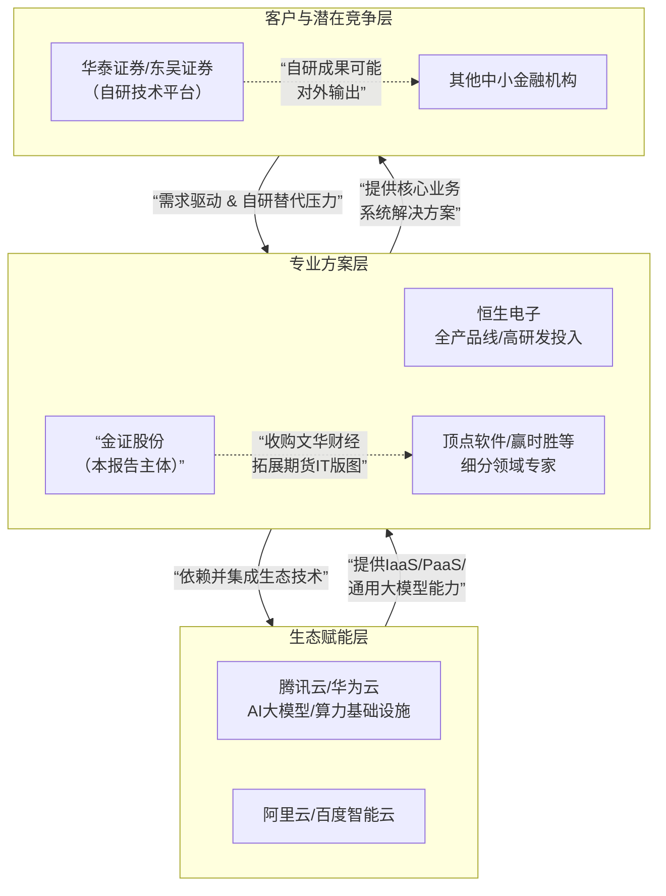

# **金证股份深度公司分析**

## **1. 执行摘要**

本报告旨在对深圳市金证科技股份有限公司进行全面的公司分析。分析显示，金证股份作为中国金融科技领域的核心厂商，正处在一个关键的战略转型期。公司拥有坚实的核心业务基本盘，在证券交易结算系统、投资管理系统等核心领域市场地位稳固。其以金证开放云原生平台（KOCA）为底座，推动FS2.5、A8等新一代核心系统升级的战略方向清晰。

然而，公司面临多维挑战：**传统竞争对手的持续压制、跨界科技巨头的生态挤压、以及头部金融机构自研能力提升带来的“脱媒”风险**。尽管公司已积极布局AI大模型，但其研发投入强度、AI价值落地深度及对颠覆性技术趋势的响应速度，与市场对其的期望及行业最前沿实践相比，仍有提升空间。

未来3-5年，金融科技的核心驱动力将从“流程线上化”转变为 **“数据资产化”和“决策智能化”** 。金证的胜负手在于：能否基于KOCA平台，真正构建一个开放的、数据与智能驱动的金融业务操作系统，并将其AI能力从“功能点缀”升级为驱动核心业务流重构的 **“原生智能体（AI-Native Agent）”** 。本报告将从行业趋势、财务、战略、业务、竞争及技术生态等维度展开深度剖析。

## **2. 宏观环境、行业趋势与客户痛点分析**

### **2.1 宏观环境分析**
*   **政治（P）**：金融信创进入全面推广阶段，要求核心系统实现从芯片、服务器、操作系统、数据库到应用软件的全栈自主可控。这既是政策性强制要求，也是金证等国产厂商巩固市场地位的历史性机遇[1]。同时，数据安全法、个人信息保护法等法规对金融数据处理提出更高要求。
*   **经济（E）**：资本市场改革深化（如全面注册制）、财富管理市场持续增长、资管新规落地后行业规范化发展，为金融IT投入提供了持续的业务需求。宏观经济波动可能影响金融机构的短期IT预算，但数字化转型作为长期战略，其投入具备刚性。
*   **社会（S）**：投资者机构化、年轻化趋势明显，对投资工具的智能化、个性化、用户体验提出更高要求。零售客户财富管理意识觉醒，从单纯交易转向资产配置，催生对投顾服务的需求。
*   **技术（T）**：**云原生、微服务架构成为新一代金融系统的事实标准。AI大模型，特别是面向金融垂直领域的多模态、推理增强型大模型，正从营销概念走向生产系统，在投研、风控、合规、客服等场景开始产生实际业务价值**。区块链技术在跨境支付、数字资产（RWA）、存证等领域有明确落地场景。高性能计算（HPC）和低时延技术是量化交易等尖端领域的竞争壁垒。
*   **环境（E）**：金融机构的绿色金融业务发展，对ESG数据管理、绿色信贷系统等提出IT需求。数据中心能耗问题受到关注，推动云化、集约化部署。
*   **法律（L）**：金融监管科技（RegTech）要求趋严，反洗钱、交易监控、合规报送等系统的智能化、实时化升级需求迫切。

### **2.2 未来3-5年核心业务与技术趋势**
1.  **核心系统信创化与云原生重构双浪叠加**：金融机构面临“在迁移至信创环境的同时，完成架构云原生升级”的双重任务。能够提供平滑、高性能、全栈信创解决方案的厂商将获得显著优势。
2.  **财富管理从“产品销售”到“客户账户全景视图与智能投顾”的深化**：系统需要整合客户跨账户、跨品类、全生命周期的资产与行为数据，为投顾提供智能决策支持，而不仅仅是交易和产品管理。
3.  **机构服务与场外业务复杂化**：机构客户对算法交易、一站式主经纪商（PB）服务、场外衍生品定价与风险管理系统的需求增长迅速，要求系统具备极强的计算能力、灵活性和专业性。
4.  **AI从“感知”走向“决策”与“生成”**：超越OCR、语音质检等传统AI应用，生成式AI将在**智能投研报告生成、自动化合规代码/文档编写、交互式数据查询与分析（代替传统BI）、交易策略草图生成与回测**等场景深度渗透，成为生产力工具。
5.  **数据架构从“数仓”向“实时数据平台与数据产品”演进**：为支持实时风控、实时营销和智能决策，流批一体的实时数据平台成为刚需。数据不再仅为内部报表服务，更作为产品赋能业务前端（如面向投顾的客户洞察数据产品）。

### **2.3 可预见的客户/行业痛点**
*   **技术债沉重，迁移风险高**：众多金融机构核心系统老旧，向云原生和信创平台迁移成本高、周期长、业务连续性风险大。
*   **数据孤岛严重，智能决策无据**：前中后台数据割裂，缺乏统一的客户视图和资产视图，导致投顾服务、精准营销和风险管理缺乏高质量数据基础。
*   **系统烟囱林立，运维复杂**：各业务线系统独立建设，集成难度大，运维成本高昂，难以快速响应新业务需求。
*   **AI应用碎片化，价值难衡量**：AI应用多为单点工具，未与核心业务流程深度融合，投入产出比（ROI）不清晰。
*   **高端人才短缺，自研进退维谷**：金融机构在招募和保留顶尖AI、量化人才方面面临互联网公司竞争，完全自研投入巨大且存在不确定性。

## **3. 财务与经营状况分析**

（注：以下分析基于金证股份2023年年报、2024年半年报及2025年半年报等公开信息[2][3]）
*   **盈利能力分析**：近年来，公司营收规模有所波动，2025年上半年营业收入同比下降48.55%，公司解释为主要因主动收缩非金融IT业务，聚焦金融科技主业所致。**值得关注的是，同期归母净利润同比大幅增长142.34%，毛利率显著提升**。这反映了公司 **“提质增效”** 战略初显成效，高毛利的金融软件业务占比提升，成本费用控制加强。但长期看，营收增长动能需依赖金融主业的持续突破。
*   **偿债能力与运营效率**：公司资产负债结构相对稳健，无重大偿债风险。作为软件企业，应收账款周转率是需要关注的指标，反映了其对下游金融机构的议价能力和回款管理效率。
*   **研发投入分析**：这是关键对比项。与主要竞争对手恒生电子（2022年研发费用率超36%）相比，金证股份历史上的研发投入强度（约10%）有显著差距[4]。尽管公司强调对KOCA、AI等方向的投入，但绝对强度和持续性需在财务上得到更充分的体现，以支撑其技术领先战略。

## **4. 竞争格局与对手深度对比分析**

当前竞争格局已演变为 **“生态层-方案层-客户层”** 的多圈层动态博弈。

**选择恒生电子作为最主要竞争对手进行深度对比分析：**

| 维度 | **金证股份** | **恒生电子** | **对比分析与洞察** |
| :--- | :--- | :--- | :--- |
| **财务与规模** | 营收规模相对较小，近期聚焦主业，利润端改善明显。 | 营收与市值规模长期领先，盈利能力强，现金流稳定。 | 恒生在整体规模和财务健康度上占优。金证需在细分领域或新产品周期中寻求弯道超车机会。 |
| **产品线与市场** | **核心优势**在证券交易结算（FS系列）、投资交易管理（A8）。通过收购文华财经切入期货IT。产品体系围绕“三大业务板块”。 | 产品线覆盖最广，从证券、基金、银行、信托到私募，几乎涵盖所有资管领域。在基金、资管核心系统市场占有率极高。 | 恒生产品生态更完整，客户粘性高。金证在证券核心交易系统有深厚积累，是基本盘。期货领域整合效果待观察。 |
| **技术战略** | 推出 **KOCA开放云原生平台**，强调“一个技术底座”，整合低时延（LDP）、AI、大数据（DIDA）等组件。发布FS2.5、A8等新一代产品。 | 推出 **i2.0信创体系、JRES3.0技术中台、Light云平台**。同样强调云原生、微服务。在**高性能计算、UF3.0分布式框架**上投入显著。 | 双方技术路线高度相似，均押注云原生和信创。**关键差异点在于执行力度、研发投入和生态开放度**。恒生UF3.0在超低时延领域有很强口碑。 |
| **AI布局** | 构建 **KOCA-AI大模型应用平台**，发布K-GPT、K-CODE模型，推出集成AI Agent的条件单2.0。强调AI与核心系统融合。 | 发布金融智能助手 **“光子”**、**LightGPT**金融大模型，并在智能投研、智能客服、智能运维等多场景有系列产品落地。与各大云厂商AI模型合作紧密。 | 双方均在AI领域重兵布局。恒生行动更早，产品化场景更丰富，且与外部大模型生态连接更活跃。金证需证明其AI应用能带来更深的业务价值穿透。 |
| **生态与合作** | 与腾讯云、华为鲲鹏等有深度合作。战略上强调“金融科技与数字经济双循环”。 | 与阿里云、中金公司等合作紧密，参与发起金融行业开源社区。生态构建较为开放。 | 恒生在构建产业联盟和开源生态上更为积极。金证与腾讯云的合作是其差异化优势，需转化为不可替代的联合解决方案。 |

**核心结论**：恒生电子是全面且强大的对手。金证股份无法在“大而全”的层面与其正面竞争，必须采取 **“聚焦与差异化”** 策略：**强化在证券核心交易、特定机构业务（如量化、衍生品）的技术深度；将AI与具体业务场景（如清算、合规）做更深度的原生融合；并利用与腾讯云的独特合作，在云原生交付和联合创新上打造样板。**

## **5. 关键产品竞品分析：以证券核心系统FS2.5为例**

*   **对标产品**：恒生电子UF3.0分布式核心系统、顶点软件A5信创版。
*   **核心功能对比**：
    *   **架构**：三者均基于微服务、分布式架构，支持云原生部署和全栈信创。这是当前市场的准入标准。
    *   **性能**：恒生UF3.0在极速交易场景下有多年积累和口碑。金证FS2.5凭借KOCA-LDP和HARE（宣称端到端时延<1.1微秒）发起挑战。顶点软件在部分券商也有成功案例。**性能指标需在真实生产环境、全链路信创环境下验证**。
    *   **可扩展性与开放性**：FS2.5基于KOCA平台，理论上在低代码开发（LCP）、大数据集成（DIDA）方面具备平台化优势。但恒生、顶点的平台同样具备类似能力。胜负在于 **“开发者体验”和“生态丰富度”**——能否吸引更多ISV（独立软件开发商）在其平台上开发应用。
    *   **智能化集成**：FS2.5强调与KOCA-AI融合。竞品也在集成各自的AI能力。差异化在于：AI是作为外挂组件，还是深度重构了业务逻辑？例如，能否利用AI动态优化订单路由、实时识别并拦截异常交易模式？
*   **竞争态势**：核心交易系统替换成本极高，客户决策谨慎。金证FS2.5的市场突破取决于：1) 在标杆客户（如头部券商）的成功上线案例；2) 在信创迁移中表现出比竞品更平滑、风险更低的过渡能力；3) 在“业务敏捷性”上提供独特价值，如通过低代码平台让券商能更快自行开发创新业务功能。

## **6. 技术生态建设战术建议：将KOCA-AI打造为“金融智能体工厂”**

金证的KOCA-AI平台不应仅是模型API的集合。建议其升级为 **“金融智能体（Financial AI Agent）工厂”** ，具体战术如下：

1.  **定义标准智能体框架**：在KOCA-AI中内置面向金融工作流的**智能体框架**，明确规划（Planning）、工具调用（Tool Use）、记忆（Memory）、决策（Decision）等组件的标准和接口。这能降低开发者构建专业Agent的门槛。
2.  **构建高质量“金融工具链”**：将FS2.5、A8等核心系统的业务能力（如查询持仓、执行交易、风险试算）封装成标准化、可被AI Agent安全调用的 **“工具（Tools）”** 。这是将AI与核心业务打通的关键。
3.  **推出“场景化智能体应用模板”**：针对高频场景（如：**上市公司公告即时解读与影响分析Agent、机构客户服务问答Agent、反洗钱可疑交易调查辅助Agent**），提供开箱即用、可配置的Agent模板，加速客户落地。
4.  **建立“数据+算法”飞轮**：在符合数据安全规范的前提下，设计联邦学习或隐私计算方案，使部署在不同客户的Agent能在保护数据隐私的同时，持续优化共享模型，提升全行业智能水平。
5.  **启动“KOCA-AI开发者计划”**：提供沙箱环境、开发工具包、认证体系和收益分成机制，吸引金融科技开发者、券商IT部门乃至高校研究团队，基于KOCA-AI创建和分享Agent应用，构建活跃生态。

## **7. 核心问题分析**

金证股份当前最紧要的排序问题在于：**在“稳固传统业务基本盘”、“完成云原生/信创产品换代”和“抢占AI时代制高点”这三大战略任务之间，资源（尤其是顶尖人才和研发预算）的分配面临紧张，且存在战略执行重心漂移的风险。**

具体表现为：
1.  **技术投入的“追赶”与“引领”矛盾**：KOCA平台的构建是对主流技术趋势的必要跟进，但投入强度不足可能使其始终处于追赶状态。在AI等颠覆性领域，需要更激进、更聚焦的“压强式”投入，而非均衡布局。
2.  **产品思维的“项目化”与“平台化”惯性**：公司历史上具有深厚的项目定制能力，但向“平台化、产品化”转型需要不同的组织架构、考核机制和人才结构。当前是否彻底完成了这一转变存疑。
3.  **应对“客户自研”的定位模糊**：面对华泰、东吴等券商的自研，金证需重新定义价值主张。是提供他们无法自研的“尖端组件”（如超低时延引擎、复杂衍生品定价内核）？还是提供能整合其自研应用的“开放平台”（KOCA）？这一战略选择需要清晰，并据此重构产品与销售策略。
4.  **AI战略的“场景深度”不足**：目前的AI应用展示多集中于条件单、客服等外围或改进型场景。**尚未看到AI如何深刻重构核心业务流程**（例如：用AI Agent重构思路上报与合规审批流程、用生成式AI实时生成动态对冲策略）。缺乏一个能让市场为之兴奋的、“非AI不可”的杀手级应用场景。

**参考结论**：金证股份站在一个“守成”与“创新”的十字路口。其传统优势是护城河，但也可能成为路径依赖。公司亟需在巩固基本盘的同时，以破釜沉舟的决心，将AI等新兴技术与其最核心、最具价值的业务环节进行“转基因”式的融合，从而在下一个金融科技周期中，从重要的“参与者”蜕变为关键的“定义者”。

---
### **参考资料**
* [1] 金融信创产业发展报告（2023）. 零壹智库.
* [2] 金证股份（600446）2023年年度报告. 上海证券交易所.
* [3] 金证股份（600446）2025年半年度报告. 上海证券交易所.
* [4] 恒生电子（600570）2022年年度报告. 上海证券交易所.
* [5] IDC FinTech Rankings Top 100. IDC. 2024.
* [6] 金证股份官网新闻与产品白皮书.
* [7] 恒生电子官网新闻与产品介绍.

*（注：部分洞察基于对上述公开资料的交叉分析与行业常识推理）*