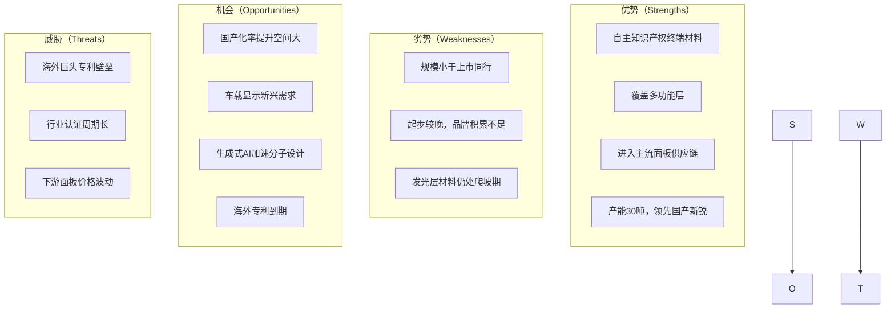
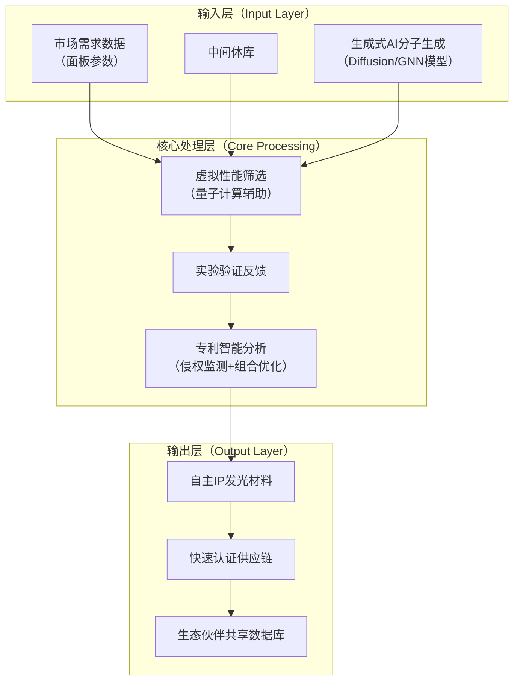

# 上海钥熠电子科技有限公司公司分析概览

## 公司简介

上海钥熠电子科技有限公司（简称钥熠电子）成立于2017年11月，注册资本545.16万元，法定代表人为向传义。公司专注于OLED有机材料的研发与生产，产品覆盖发光层（主体材料和掺杂剂）以及多种功能层材料（HTL、ETL、Prime、CPL等）。生产基地位于山东枣庄，一期产能30吨/年，已进入试生产阶段。公司已进入京东方、天马微电子、维信诺、TCL华星等主流面板厂商供应链，材料应用于智能手机、可穿戴设备等领域。2023年12月完成C轮融资，由浦东智能制造基金领投；2024年签约武汉研发及中试基地项目，总投资1.3亿元。截至2023年7月，公司拥有发明专利授权20项、公布63项，最新专利持续获批。[1][2][3]

## 行业概览与趋势

### 市场规模与增长
2023年中国OLED有机材料市场规模约43亿元，预计2030年达98亿元，复合年增长率11%。全球市场2023年约17亿美元，2028年预计26亿美元，复合年增长率8.7%。增长主要由智能手机、电视、车载显示等面板产能扩张驱动。有机材料在OLED成本中占比约23%，为成本控制关键环节。[4][5]

### 技术与业务趋势（2025-2030年）
- **国产化加速**：终端材料国产化率目前不足6%，通用层约17%，存在较大替代空间。随着海外核心专利逐步到期（UDC等红绿磷光专利），国产厂商渗透率预计提升至15-20%。
- **应用多元化**：柔性OLED在中高端智能手机渗透率持续提高，车载显示（仪表盘、中控）成为新增长点，预计2028年车载OLED面板出货占比超10%。
- **客户痛点**：面板厂商面临材料适配性（多世代线兼容）、供应链稳定性（海外垄断风险）、成本压力（材料占面板成本20%以上）。
- **AI时代变量**：生成式AI在分子设计领域应用加速，可将候选分子筛选效率提升10-100倍。通过扩散模型或GNN+LLM组合，实现“AI生成-量子验证-实验反馈”闭环，显著缩短发光层材料开发周期。鼎材科技等已构建AI驱动研发体系，未来3-5年将成为行业标准。[6][7]

```mermaid
graph TD
    %% 图例
    %% 趋势方向：实箭头表示驱动关系，虚箭头表示潜在影响

    subgraph 市场驱动因素
        A[智能手机渗透] --> D[OLED面板出货增长]
        B[车载显示兴起] --> D
        C[电视/IT渗透] --> D
    end

    subgraph 技术趋势
        E[海外专利到期] --> F[国产化率提升<br/>（终端材料6%→15-20%）]
        G[生成式AI分子设计] --> H[研发周期缩短<br/>（筛选效率提升10-100倍）]
        G --> I[知识产权壁垒降低]
    end

    D --> F
    H --> J[成本下降与性能优化]
    F --> J
    J --> K[行业整体竞争力提升]
````

上图展示OLED有机材料行业主要驱动与技术趋势逻辑。市场应用扩张直接推动国产化进程，而生成式AI将成为加速材料迭代的关键变量。

## 业务分析

钥熠电子业务以OLED终端材料为主，覆盖发光层及功能层，已实现从分子设计到量产的全链条能力。枣庄基地一期30吨产能主要满足国内面板需求，二期规划引入光学膜/涂布胶生产线。武汉基地聚焦车载领域研发中试。供应链上游依赖国内中间体供应商，下游直接对接面板厂商。

```mermaid
graph LR
    %% 价值链分析（Value Chain）

    subgraph 上游[上游（中间体/粗单体）]
        U1[国内中间体供应商<br/>（瑞红、昱能等）]
    end

    subgraph 公司内部[钥熠电子核心价值链]
        C1[分子设计与合成<br/>（自主IP）] --> C2[升华提纯]
        C2 --> C3[终端材料量产<br/>（30吨/年）]
        C3 --> C4[功能层扩展<br/>（CPL/ETL/Prime）]
    end

    subgraph 下游[下游（面板厂商）]
        D1[京东方<br/>天马<br/>维信诺<br/>华星光电] --> E[终端应用<br/>（手机/可穿戴/车载）]
    end

    U1 --> C1
    C4 --> D1
    D1 --> E
```

上图为钥熠电子在OLED材料价值链中的定位。公司核心优势在于终端材料自主设计与提纯，绕开海外专利限制。

## 财务分析（推断性）

作为非上市公司，无公开财报。根据融资规模（C轮后估值推断约10-15亿元）、产能规划（30吨，行业单吨均价约3-5亿元）及市场渗透率估算，2024-2025年收入预计3-6亿元，毛利率约50-60%（国产终端材料典型水平，高于中间体）。资金主要用于产能扩张与研发，现金流依赖融资支持。偿债能力较强（科技型企业特征），但规模效应尚未完全显现。

## 战略分析

### SWOT分析



### 波特五力模型（简要）

* 供应商议价能力：中等（国内中间体可选性增加）。
* 购买者议价能力：较高（面板厂商集中）。
* 新进入者威胁：高壁垒（专利+认证）。
* 替代品威胁：低（OLED独特优势）。
* 行业竞争：激烈（海外垄断+国产追赶）。

## 竞争力分析

### 主要竞争对手比较

| 维度                | 钥熠电子        | 莱特光电（上市）      | 奥来德   | 阿格蕾雅    |
| ----------------- | ----------- | ------------- | ----- | ------- |
| 成立时间              | 2017年       | 2009年         | 2010年 | 2013年   |
| 终端材料产能（2024/2025） | 30吨/年       | 12吨/年（扩产中）    | ~20吨  | ~15吨    |
| 专利数量（约）           | 授权20+，公布80+ | 授权384，申请1030+ | 数百    | 数百      |
| 主要客户              | 京东方、天马、维信诺等 | 视涯、南京国兆等+主流面板 | 主流面板  | 主流面板    |
| 产品覆盖              | 发光层+多功能层    | 发光层+功能层       | 发光层为主 | 发光层+功能层 |
| 融资/市值             | C轮（2023）    | 已上市（科创板）      | 多轮融资  | 多轮融资    |

### 最大对手深度对比：莱特光电

莱特光电为国内OLED终端材料最早实现量产的企业之一，已上市，市值规模显著大于钥熠电子。2024年终端材料销量大幅增长，产能12吨但一体化布局更成熟，专利布局覆盖中、美、日、韩，护城河更宽。客户结构类似，但莱特在硅基OLED等领域拓展更早。钥熠优势在于单厂产能更高（30吨）、功能层覆盖更广、武汉基地车载定位明确。总体上，莱特在规模、专利积累、市值融资能力上领先，钥熠在产能释放速度与新兴应用布局上具备追赶潜力。[8][9]

### 关键技术生态建设建议：发光层材料自主设计生态

发光层材料（主体+掺杂剂）是钥熠核心竞争力所在，目前已具备完全自主知识产权。建议构建开放式生态：

1. 与国内中间体供应商深度绑定，形成联合实验室。
2. 引入生成式AI平台（合作阿里达摩院或开源模型），建立“AI分子生成-高通量虚拟筛选-实验验证”闭环，目标将候选分子库从10万级提升至百万级，筛选周期缩短50%。
3. 与面板厂商共建材料适配数据库，实现多世代线快速认证。
4. 专利组合策略：防御型（核心分子保护）+进攻型（绕开海外专利的新结构布局）。



上图展示建议的发光层材料生态架构。通过引入生成式AI与专利智能管理，可在3-5年内形成差异化壁垒。

## 参考资料

* [1] 企查查 - 上海钥熠电子科技有限公司基本信息
* [2] 电子工程专辑 - 钥熠电子C轮融资公告（2023）
* [3] 国家知识产权局 - 钥熠电子多项专利授权记录（2023-2025）
* [4] 群智咨询 - 中国OLED有机材料市场数据（2023-2030）
* [5] 华经产业研究院 - OLED终端材料国产化率报告（2024）
* [6] 鼎材科技公开案例 - AI驱动OLED材料开发体系
* [7] Nature等期刊 - 生成式AI材料筛选效率研究
* [8] 陕西莱特光电材料股份有限公司2024年度报告
* [9] 莱特光电投资者关系记录表（2024）

**关键要点**  
- 钥熠电子在国产OLED终端材料领域具备30吨产能与自主知识产权优势，已进入主流面板供应链。  
- 行业国产化率低（终端材料<6%），未来3-5年渗透空间大，车载显示与生成式AI分子设计为主要趋势。  
- 与最大对手莱特光电相比，钥熠产能领先但专利积累与市值规模较小。  
- 生成式AI可显著加速发光层材料开发，成为未来竞争关键变量。

---

**行业与公司深度分析**  

上海钥熠电子科技有限公司定位于OLED有机材料国产化浪潮中的新锐企业。公司自2017年成立以来，快速构建从分子设计到终端量产的能力，枣庄基地30吨产能已处于国内领先水平。产品线覆盖发光层及多功能层，解决了海外专利限制下的“卡脖子”问题，已实现对京东方、天马等主流客户的稳定供货。

**市场趋势详解**  
2023-2030年中国OLED有机材料市场复合增长率11%，主要驱动因素包括柔性OLED在中高端手机渗透率提升、车载显示仪表盘/中控需求爆发，以及IT/电视领域渗透。客户痛点集中在材料多世代线适配、供应链本土化安全、成本控制（材料占比23%）。生成式AI的应用正从实验室走向产业化，可将分子筛选效率提升数十倍，未来将成为缩短研发周期、降低试错成本的核心工具。

**竞争力定位**  
在国内终端材料厂商中，钥熠电子与莱特光电、奥来德、阿格蕾雅同属第一梯队。莱特光电作为上市企业，专利布局更广（超千件）、一体化程度更高，但钥熠单厂产能更高且功能层覆盖全面。深度对比显示，莱特在硅基OLED与国际专利保护上领先，而钥熠在车载布局（武汉基地）与产能释放速度上更具潜力。

**技术生态建议实施路径**  
针对发光层材料这一核心技术，建议优先构建AI驱动生态：一是引入生成式AI进行分子库扩展与预筛，二是建立专利生命周期智能管理系统（侵权监测+组合优化），三是与上下游共建共享数据库。该生态可在3年内帮助公司将新材料认证周期缩短30-50%，形成差异化竞争壁垒。

| 关键指标对比（2024-2025估算） | 钥熠电子 | 莱特光电 | 行业平均（国产终端材料） |
|-------------------------------|----------|----------|--------------------------|
| 年产能（吨）                  | 30       | 12（扩产中） | 10-20                    |
| 专利授权数量                  | 20+      | 384+     | 100-300                  |
| 客户重合度                    | 高       | 高       | 中                       |
| AI研发投入迹象                | 初期     | 已布局   | 部分企业起步             |

整体评估：钥熠电子处于快速追赶阶段，产能与供应链优势突出，结合生成式AI趋势可实现弯道超车。

**Key Citations**  
- 企查查公司信息  
- C轮融资公告  
- 行业市场报告  
- 莱特光电年报  
- AI材料应用案例
