# ClickHouse到StarRocks全场景迁移方案设计

## 1. 整体架构与迁移策略概览

### 1.1 三种迁移模式总体架构

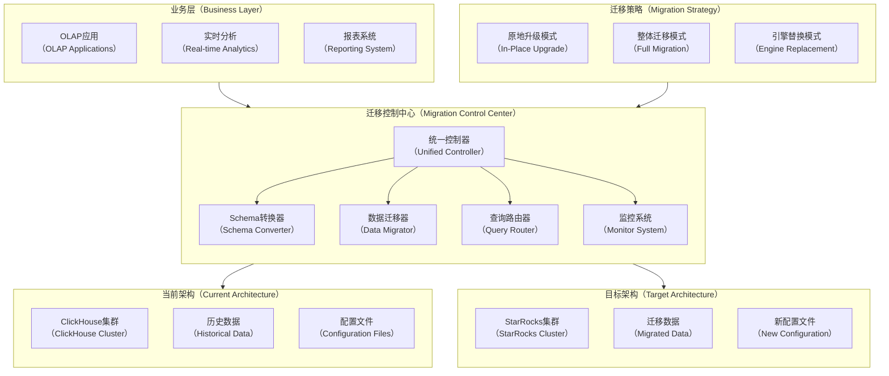
```mermaid
graph TB
%% 三种迁移模式总体架构图
subgraph MS[迁移策略（Migration Strategy）]
    direction TB
    MS1[原地升级模式<br/>（In-Place Upgrade）]
    MS2[整体迁移模式<br/>（Full Migration）]
    MS3[引擎替换模式<br/>（Engine Replacement）]
end

subgraph CA[当前架构（Current Architecture）]
    direction TB
    CH_CLUSTER[ClickHouse集群<br/>（ClickHouse Cluster）]
    CH_DATA[历史数据<br/>（Historical Data）]
    CH_CONFIG[配置文件<br/>（Configuration Files）]
end

subgraph TA[目标架构（Target Architecture）]
    direction TB
    SR_CLUSTER[StarRocks集群<br/>（StarRocks Cluster）]
    SR_DATA[迁移数据<br/>（Migrated Data）]
    SR_CONFIG[新配置文件<br/>（New Configuration）]
end

subgraph MC[迁移控制中心（Migration Control Center）]
    direction TB
    MCC[统一控制器<br/>（Unified Controller）]
    SCH[Schema转换器<br/>（Schema Converter）]
    DM[数据迁移器<br/>（Data Migrator）]
    QR[查询路由器<br/>（Query Router）]
    MON[监控系统<br/>（Monitor System）]
end

subgraph BL[业务层（Business Layer）]
    direction TB
    APP1[OLAP应用<br/>（OLAP Applications）]
    APP2[实时分析<br/>（Real-time Analytics）]
    APP3[报表系统<br/>（Reporting System）]
end

%% 连接关系
BL --> MC
MC --> CA
MC --> TA
MS --> MC
MCC --> SCH
MCC --> DM
MCC --> QR
MCC --> MON
```

本架构设计支持三种不同的迁移模式，每种模式都通过统一的迁移控制中心进行管理。迁移控制中心包含Schema转换、数据迁移、查询路由和监控等核心组件，确保各种迁移场景下的统一管理和风险控制。

### 1.2 迁移模式选择决策树

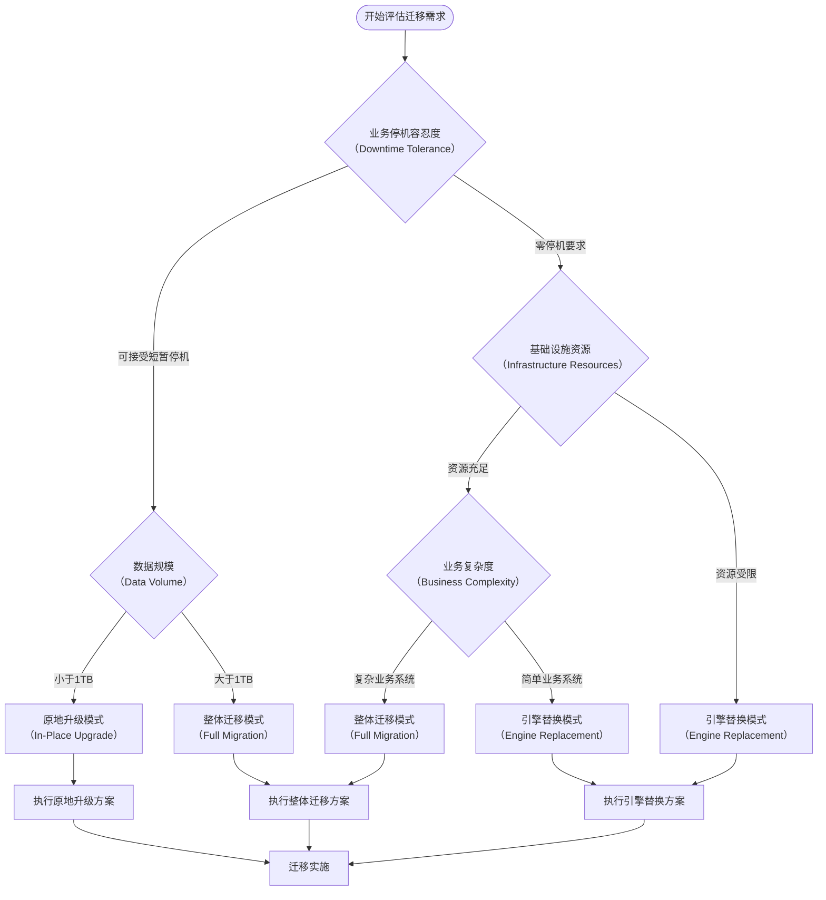
```mermaid
flowchart TD
%% 迁移模式选择决策树
Start([开始评估迁移需求]) --> A1{业务停机容忍度<br/>（Downtime Tolerance）}

A1 -->|可接受短暂停机| B1{数据规模<br/>（Data Volume）}
A1 -->|零停机要求| B2{基础设施资源<br/>（Infrastructure Resources）}

B1 -->|小于1TB| C1[原地升级模式<br/>（In-Place Upgrade）]
B1 -->|大于1TB| C2[整体迁移模式<br/>（Full Migration）]

B2 -->|资源充足| D1{业务复杂度<br/>（Business Complexity）}
B2 -->|资源受限| D2[引擎替换模式<br/>（Engine Replacement）]

D1 -->|复杂业务系统| E1[整体迁移模式<br/>（Full Migration）]
D1 -->|简单业务系统| E2[引擎替换模式<br/>（Engine Replacement）]

C1 --> F1[执行原地升级方案]
C2 --> F2[执行整体迁移方案]
D2 --> F3[执行引擎替换方案]
E1 --> F2
E2 --> F3

F1 --> End[迁移实施]
F2 --> End
F3 --> End
```

决策树帮助企业根据具体情况选择最适合的迁移策略。原地升级适合小规模、可容忍停机的场景；整体迁移适合大规模、复杂业务系统；引擎替换适合资源受限但需要零停机的场景。

## 2. 原地升级模式设计

### 2.1 原地升级架构设计

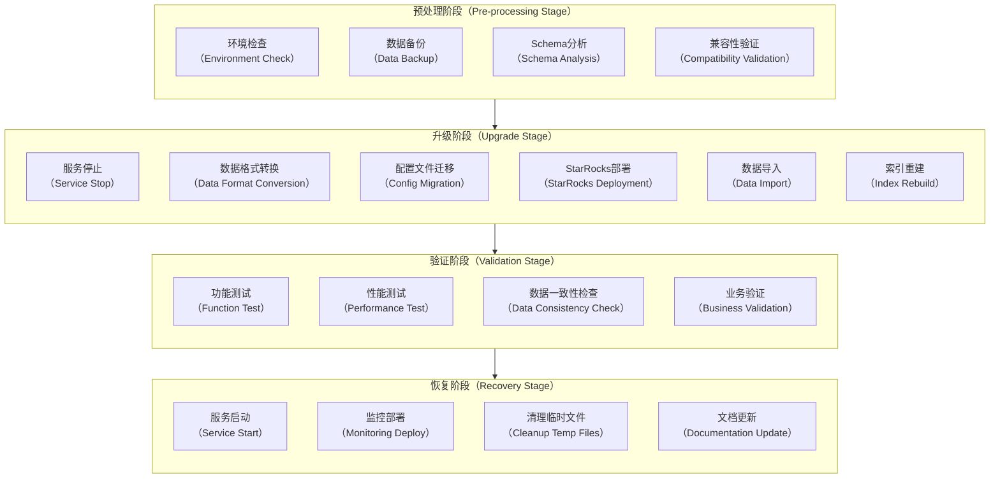
```mermaid
graph TB
%% 原地升级架构设计
subgraph PS[预处理阶段（Pre-processing Stage）]
    direction TB
    PS1[环境检查<br/>（Environment Check）]
    PS2[数据备份<br/>（Data Backup）]
    PS3[Schema分析<br/>（Schema Analysis）]
    PS4[兼容性验证<br/>（Compatibility Validation）]
end

subgraph US[升级阶段（Upgrade Stage）]
    direction TB
    US1[服务停止<br/>（Service Stop）]
    US2[数据格式转换<br/>（Data Format Conversion）]
    US3[配置文件迁移<br/>（Config Migration）]
    US4[StarRocks部署<br/>（StarRocks Deployment）]
    US5[数据导入<br/>（Data Import）]
    US6[索引重建<br/>（Index Rebuild）]
end

subgraph VS[验证阶段（Validation Stage）]
    direction TB
    VS1[功能测试<br/>（Function Test）]
    VS2[性能测试<br/>（Performance Test）]
    VS3[数据一致性检查<br/>（Data Consistency Check）]
    VS4[业务验证<br/>（Business Validation）]
end

subgraph RS[恢复阶段（Recovery Stage）]
    direction TB
    RS1[服务启动<br/>（Service Start）]
    RS2[监控部署<br/>（Monitoring Deploy）]
    RS3[清理临时文件<br/>（Cleanup Temp Files）]
    RS4[文档更新<br/>（Documentation Update）]
end

PS --> US
US --> VS
VS --> RS
```

原地升级模式在现有服务器上直接替换ClickHouse为StarRocks，适用于数据量较小、可以接受短暂停机的场景。该模式的优势是节省硬件资源，缺点是存在一定的风险，需要充分的备份和验证措施。

### 2.2 原地升级数据转换流程

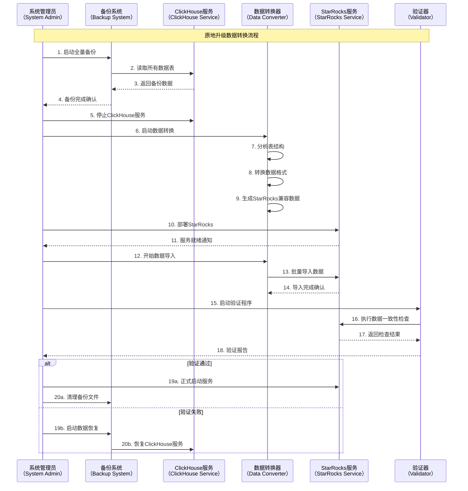
```mermaid
sequenceDiagram
%% 原地升级数据转换时序图
participant ADMIN as 系统管理员<br/>（System Admin）
participant BCK as 备份系统<br/>（Backup System）
participant CH as ClickHouse服务<br/>（ClickHouse Service）
participant CONV as 数据转换器<br/>（Data Converter）
participant SR as StarRocks服务<br/>（StarRocks Service）
participant VAL as 验证器<br/>（Validator）

Note over ADMIN,VAL: 原地升级数据转换流程

ADMIN->>BCK: 1. 启动全量备份
BCK->>CH: 2. 读取所有数据表
CH-->>BCK: 3. 返回备份数据
BCK-->>ADMIN: 4. 备份完成确认

ADMIN->>CH: 5. 停止ClickHouse服务
ADMIN->>CONV: 6. 启动数据转换
CONV->>CONV: 7. 分析表结构
CONV->>CONV: 8. 转换数据格式
CONV->>CONV: 9. 生成StarRocks兼容数据

ADMIN->>SR: 10. 部署StarRocks
SR-->>ADMIN: 11. 服务就绪通知
ADMIN->>CONV: 12. 开始数据导入
CONV->>SR: 13. 批量导入数据
SR-->>CONV: 14. 导入完成确认

ADMIN->>VAL: 15. 启动验证程序
VAL->>SR: 16. 执行数据一致性检查
SR-->>VAL: 17. 返回检查结果
VAL-->>ADMIN: 18. 验证报告

alt 验证通过
    ADMIN->>SR: 19a. 正式启动服务
    ADMIN->>BCK: 20a. 清理备份文件
else 验证失败
    ADMIN->>BCK: 19b. 启动数据恢复
    BCK->>CH: 20b. 恢复ClickHouse服务
end
```

## 3. 整体迁移模式设计

### 3.1 整体迁移双集群架构

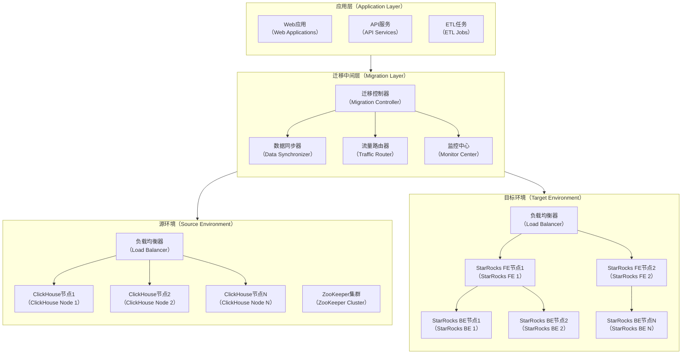
```mermaid
graph TB
%% 整体迁移双集群架构
subgraph SRC[源环境（Source Environment）]
    direction TB
    SRC_LB[负载均衡器<br/>（Load Balancer）]
    SRC_CH1[ClickHouse节点1<br/>（ClickHouse Node 1）]
    SRC_CH2[ClickHouse节点2<br/>（ClickHouse Node 2）]
    SRC_CH3[ClickHouse节点N<br/>（ClickHouse Node N）]
    SRC_ZK[ZooKeeper集群<br/>（ZooKeeper Cluster）]
end

subgraph TGT[目标环境（Target Environment）]
    direction TB
    TGT_LB[负载均衡器<br/>（Load Balancer）]
    TGT_SR1[StarRocks FE节点1<br/>（StarRocks FE 1）]
    TGT_SR2[StarRocks FE节点2<br/>（StarRocks FE 2）]
    TGT_BE1[StarRocks BE节点1<br/>（StarRocks BE 1）]
    TGT_BE2[StarRocks BE节点2<br/>（StarRocks BE 2）]
    TGT_BE3[StarRocks BE节点N<br/>（StarRocks BE N）]
end

subgraph MIG[迁移中间层（Migration Layer）]
    direction TB
    MIG_CTRL[迁移控制器<br/>（Migration Controller）]
    MIG_SYNC[数据同步器<br/>（Data Synchronizer）]
    MIG_ROUTE[流量路由器<br/>（Traffic Router）]
    MIG_MON[监控中心<br/>（Monitor Center）]
end

subgraph APP[应用层（Application Layer）]
    direction TB
    APP_WEB[Web应用<br/>（Web Applications）]
    APP_API[API服务<br/>（API Services）]
    APP_ETL[ETL任务<br/>（ETL Jobs）]
end

%% 连接关系
APP --> MIG
MIG --> SRC
MIG --> TGT
SRC_LB --> SRC_CH1
SRC_LB --> SRC_CH2
SRC_LB --> SRC_CH3
TGT_LB --> TGT_SR1
TGT_LB --> TGT_SR2
TGT_SR1 --> TGT_BE1
TGT_SR1 --> TGT_BE2
TGT_SR2 --> TGT_BE3
MIG_CTRL --> MIG_SYNC
MIG_CTRL --> MIG_ROUTE
MIG_CTRL --> MIG_MON
```

整体迁移模式通过建立独立的StarRocks集群，与现有ClickHouse集群并行运行。迁移中间层负责数据同步、流量路由和监控管理，确保迁移过程中业务的连续性和数据一致性。

### 3.2 整体迁移分阶段实施流程

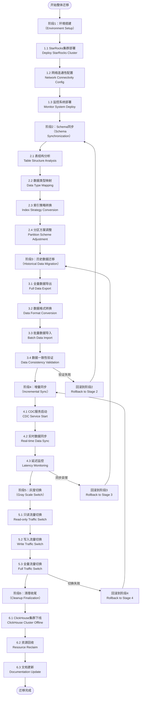
```mermaid
flowchart TD
%% 整体迁移分阶段实施流程
Start([开始整体迁移]) --> P1[阶段1：环境搭建<br/>（Environment Setup）]

P1 --> P1_1[1.1 StarRocks集群部署<br/>Deploy StarRocks Cluster]
P1_1 --> P1_2[1.2 网络连通性配置<br/>Network Connectivity Config]
P1_2 --> P1_3[1.3 监控系统部署<br/>Monitor System Deploy]
P1_3 --> P2[阶段2：Schema同步<br/>（Schema Synchronization）]

P2 --> P2_1[2.1 表结构分析<br/>Table Structure Analysis]
P2_1 --> P2_2[2.2 数据类型映射<br/>Data Type Mapping]
P2_2 --> P2_3[2.3 索引策略转换<br/>Index Strategy Conversion]
P2_3 --> P2_4[2.4 分区方案调整<br/>Partition Scheme Adjustment]
P2_4 --> P3[阶段3：历史数据迁移<br/>（Historical Data Migration）]

P3 --> P3_1[3.1 全量数据导出<br/>Full Data Export]
P3_1 --> P3_2[3.2 数据格式转换<br/>Data Format Conversion]
P3_2 --> P3_3[3.3 批量数据导入<br/>Batch Data Import]
P3_3 --> P3_4[3.4 数据一致性验证<br/>Data Consistency Validation]
P3_4 --> P4[阶段4：增量同步<br/>（Incremental Sync）]

P4 --> P4_1[4.1 CDC服务启动<br/>CDC Service Start]
P4_1 --> P4_2[4.2 实时数据同步<br/>Real-time Data Sync]
P4_2 --> P4_3[4.3 延迟监控<br/>Latency Monitoring]
P4_3 --> P5[阶段5：灰度切换<br/>（Gray Scale Switch）]

P5 --> P5_1[5.1 只读流量切换<br/>Read-only Traffic Switch]
P5_1 --> P5_2[5.2 写入流量切换<br/>Write Traffic Switch]
P5_2 --> P5_3[5.3 全量流量切换<br/>Full Traffic Switch]
P5_3 --> P6[阶段6：清理收尾<br/>（Cleanup Finalization）]

P6 --> P6_1[6.1 ClickHouse集群下线<br/>ClickHouse Cluster Offline]
P6_1 --> P6_2[6.2 资源回收<br/>Resource Reclaim]
P6_2 --> P6_3[6.3 文档更新<br/>Documentation Update]
P6_3 --> End([迁移完成])

%% 异常处理流程
P3_4 -->|验证失败| Rollback1[回滚到阶段2<br/>Rollback to Stage 2]
P4_3 -->|同步异常| Rollback2[回滚到阶段3<br/>Rollback to Stage 3]
P5_3 -->|切换失败| Rollback3[回滚到阶段4<br/>Rollback to Stage 4]

Rollback1 --> P2
Rollback2 --> P3
Rollback3 --> P4
```

## 4. 引擎替换模式设计

### 4.1 引擎替换透明代理架构

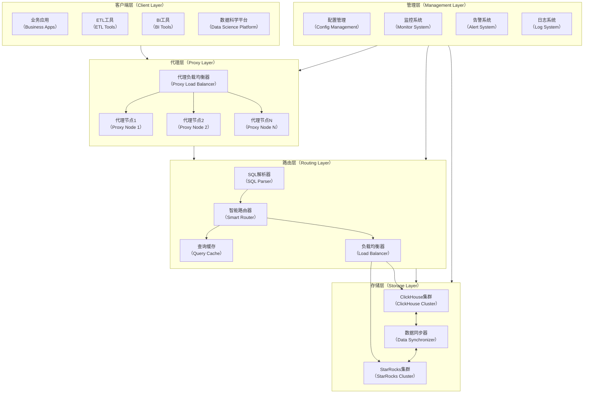
```mermaid
graph TB
%% 引擎替换透明代理架构
subgraph CL[客户端层（Client Layer）]
    direction TB
    CL1[业务应用<br/>（Business Apps）]
    CL2[ETL工具<br/>（ETL Tools）]
    CL3[BI工具<br/>（BI Tools）]
    CL4[数据科学平台<br/>（Data Science Platform）]
end

subgraph PL[代理层（Proxy Layer）]
    direction TB
    PL_LB[代理负载均衡器<br/>（Proxy Load Balancer）]
    PL_P1[代理节点1<br/>（Proxy Node 1）]
    PL_P2[代理节点2<br/>（Proxy Node 2）]
    PL_P3[代理节点N<br/>（Proxy Node N）]
end

subgraph RL[路由层（Routing Layer）]
    direction TB
    RL_PARSER[SQL解析器<br/>（SQL Parser）]
    RL_ROUTER[智能路由器<br/>（Smart Router）]
    RL_CACHE[查询缓存<br/>（Query Cache）]
    RL_BALANCE[负载均衡器<br/>（Load Balancer）]
end

subgraph SL[存储层（Storage Layer）]
    direction TB
    SL_CH[ClickHouse集群<br/>（ClickHouse Cluster）]
    SL_SR[StarRocks集群<br/>（StarRocks Cluster）]
    SL_SYNC[数据同步器<br/>（Data Synchronizer）]
end

subgraph ML[管理层（Management Layer）]
    direction TB
    ML_CONFIG[配置管理<br/>（Config Management）]
    ML_MONITOR[监控系统<br/>（Monitor System）]
    ML_ALERT[告警系统<br/>（Alert System）]
    ML_LOG[日志系统<br/>（Log System）]
end

%% 连接关系
CL --> PL
PL --> RL
RL --> SL
ML --> PL
ML --> RL
ML --> SL

PL_LB --> PL_P1
PL_LB --> PL_P2
PL_LB --> PL_P3

RL_PARSER --> RL_ROUTER
RL_ROUTER --> RL_CACHE
RL_ROUTER --> RL_BALANCE

RL_BALANCE --> SL_CH
RL_BALANCE --> SL_SR
SL_CH <--> SL_SYNC
SL_SYNC <--> SL_SR
```

引擎替换模式通过透明代理层实现业务无感知的数据库引擎切换。代理层包含SQL解析器、智能路由器、查询缓存等组件，可以根据配置策略智能地将查询请求路由到不同的存储后端。

### 4.2 引擎替换渐进式切换流程

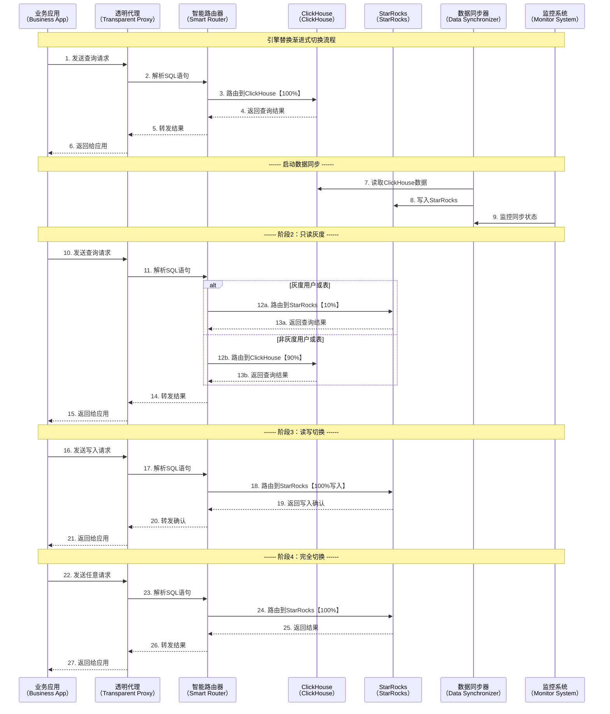
```mermaid
sequenceDiagram
%% 引擎替换渐进式切换时序图
participant APP as 业务应用<br/>（Business App）
participant PROXY as 透明代理<br/>（Transparent Proxy）
participant ROUTER as 智能路由器<br/>（Smart Router）
participant CH as ClickHouse<br/>（ClickHouse）
participant SR as StarRocks<br/>（StarRocks）
participant SYNC as 数据同步器<br/>（Data Synchronizer）
participant MON as 监控系统<br/>（Monitor System）

Note over APP,MON: 引擎替换渐进式切换流程

%% 阶段1：初始状态
APP->>PROXY: 1. 发送查询请求
PROXY->>ROUTER: 2. 解析SQL语句
ROUTER->>CH: 3. 路由到ClickHouse【100%】
CH-->>ROUTER: 4. 返回查询结果
ROUTER-->>PROXY: 5. 转发结果
PROXY-->>APP: 6. 返回给应用

Note over APP,MON: ------ 启动数据同步 ------

SYNC->>CH: 7. 读取ClickHouse数据
SYNC->>SR: 8. 写入StarRocks
MON->>SYNC: 9. 监控同步状态

Note over APP,MON: ------ 阶段2：只读灰度 ------

APP->>PROXY: 10. 发送查询请求
PROXY->>ROUTER: 11. 解析SQL语句
alt 灰度用户或表
    ROUTER->>SR: 12a. 路由到StarRocks【10%】
    SR-->>ROUTER: 13a. 返回查询结果
else 非灰度用户或表
    ROUTER->>CH: 12b. 路由到ClickHouse【90%】
    CH-->>ROUTER: 13b. 返回查询结果
end
ROUTER-->>PROXY: 14. 转发结果
PROXY-->>APP: 15. 返回给应用

Note over APP,MON: ------ 阶段3：读写切换 ------

APP->>PROXY: 16. 发送写入请求
PROXY->>ROUTER: 17. 解析SQL语句
ROUTER->>SR: 18. 路由到StarRocks【100%写入】
SR-->>ROUTER: 19. 返回写入确认
ROUTER-->>PROXY: 20. 转发确认
PROXY-->>APP: 21. 返回给应用

Note over APP,MON: ------ 阶段4：完全切换 ------

APP->>PROXY: 22. 发送任意请求
PROXY->>ROUTER: 23. 解析SQL语句
ROUTER->>SR: 24. 路由到StarRocks【100%】
SR-->>ROUTER: 25. 返回结果
ROUTER-->>PROXY: 26. 转发结果
PROXY-->>APP: 27. 返回给应用
```

## 5. Schema兼容性深度分析

### 5.1 数据类型兼容性矩阵

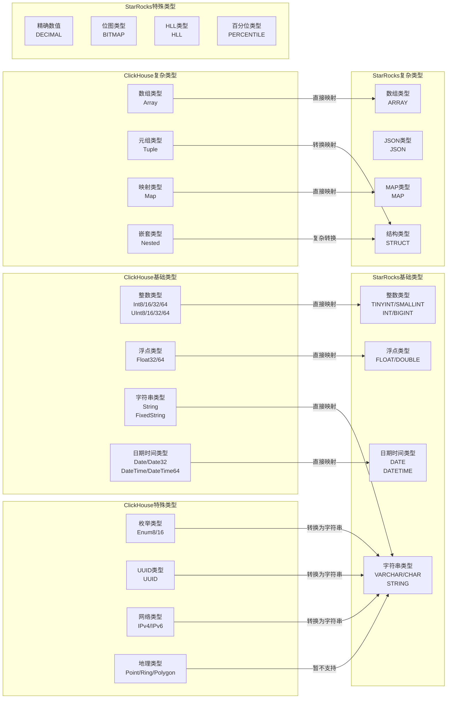
```mermaid
graph LR
%% 数据类型兼容性映射图
subgraph CH_BASIC[ClickHouse基础类型]
    direction TB
    CH_INT[整数类型<br/>Int8/16/32/64<br/>UInt8/16/32/64]
    CH_FLOAT[浮点类型<br/>Float32/64]
    CH_STR[字符串类型<br/>String<br/>FixedString]
    CH_DATE[日期时间类型<br/>Date/Date32<br/>DateTime/DateTime64]
end

subgraph CH_COMPLEX[ClickHouse复杂类型]
    direction TB
    CH_ARRAY[数组类型<br/>Array]
    CH_TUPLE[元组类型<br/>Tuple]
    CH_MAP[映射类型<br/>Map]
    CH_NESTED[嵌套类型<br/>Nested]
end

subgraph CH_SPECIAL[ClickHouse特殊类型]
    direction TB
    CH_ENUM[枚举类型<br/>Enum8/16]
    CH_UUID[UUID类型<br/>UUID]
    CH_IPV4[网络类型<br/>IPv4/IPv6]
    CH_GEO[地理类型<br/>Point/Ring/Polygon]
end

subgraph SR_BASIC[StarRocks基础类型]
    direction TB
    SR_INT[整数类型<br/>TINYINT/SMALLINT<br/>INT/BIGINT]
    SR_FLOAT[浮点类型<br/>FLOAT/DOUBLE]
    SR_STR[字符串类型<br/>VARCHAR/CHAR<br/>STRING]
    SR_DATE[日期时间类型<br/>DATE<br/>DATETIME]
end

subgraph SR_COMPLEX[StarRocks复杂类型]
    direction TB
    SR_ARRAY[数组类型<br/>ARRAY]
    SR_JSON[JSON类型<br/>JSON]
    SR_MAP[MAP类型<br/>MAP]
    SR_STRUCT[结构类型<br/>STRUCT]
end

subgraph SR_SPECIAL[StarRocks特殊类型]
    direction TB
    SR_DECIMAL[精确数值<br/>DECIMAL]
    SR_BITMAP[位图类型<br/>BITMAP]
    SR_HLL[HLL类型<br/>HLL]
    SR_PERCENT[百分位类型<br/>PERCENTILE]
end

%% 兼容性映射关系
CH_INT -->|直接映射| SR_INT
CH_FLOAT -->|直接映射| SR_FLOAT
CH_STR -->|直接映射| SR_STR
CH_DATE -->|直接映射| SR_DATE
CH_ARRAY -->|直接映射| SR_ARRAY
CH_TUPLE -->|转换映射| SR_STRUCT
CH_MAP -->|直接映射| SR_MAP
CH_NESTED -->|复杂转换| SR_STRUCT
CH_ENUM -->|转换为字符串| SR_STR
CH_UUID -->|转换为字符串| SR_STR
CH_IPV4 -->|转换为字符串| SR_STR
CH_GEO -->|暂不支持| SR_STR
```

### 5.2 表引擎兼容性转换策略

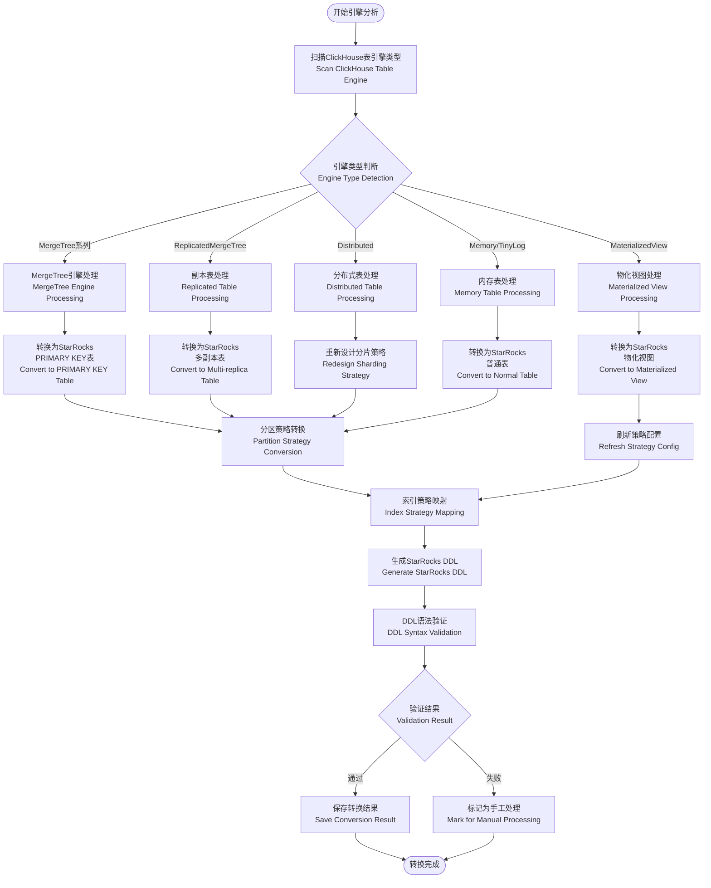
```mermaid
flowchart TD
%% 表引擎兼容性转换决策流程
Start([开始引擎分析]) --> A1[扫描ClickHouse表引擎类型<br/>Scan ClickHouse Table Engine]

A1 --> B1{引擎类型判断<br/>Engine Type Detection}

B1 -->|MergeTree系列| C1[MergeTree引擎处理<br/>MergeTree Engine Processing]
B1 -->|ReplicatedMergeTree| C2[副本表处理<br/>Replicated Table Processing]
B1 -->|Distributed| C3[分布式表处理<br/>Distributed Table Processing]
B1 -->|MaterializedView| C4[物化视图处理<br/>Materialized View Processing]
B1 -->|Memory/TinyLog| C5[内存表处理<br/>Memory Table Processing]

C1 --> D1[转换为StarRocks<br/>PRIMARY KEY表<br/>Convert to PRIMARY KEY Table]
C2 --> D2[转换为StarRocks<br/>多副本表<br/>Convert to Multi-replica Table]
C3 --> D3[重新设计分片策略<br/>Redesign Sharding Strategy]
C4 --> D4[转换为StarRocks<br/>物化视图<br/>Convert to Materialized View]
C5 --> D5[转换为StarRocks<br/>普通表<br/>Convert to Normal Table]

D1 --> E1[分区策略转换<br/>Partition Strategy Conversion]
D2 --> E1
D3 --> E1
D4 --> E2[刷新策略配置<br/>Refresh Strategy Config]
D5 --> E1

E1 --> F1[索引策略映射<br/>Index Strategy Mapping]
E2 --> F1

F1 --> G1[生成StarRocks DDL<br/>Generate StarRocks DDL]
G1 --> H1[DDL语法验证<br/>DDL Syntax Validation]

H1 --> I1{验证结果<br/>Validation Result}
I1 -->|通过| J1[保存转换结果<br/>Save Conversion Result]
I1 -->|失败| K1[标记为手工处理<br/>Mark for Manual Processing]

J1 --> End([转换完成])
K1 --> End
```

## 6. 典型业务场景迁移设计

### 6.1 实时数据仓库场景迁移架构

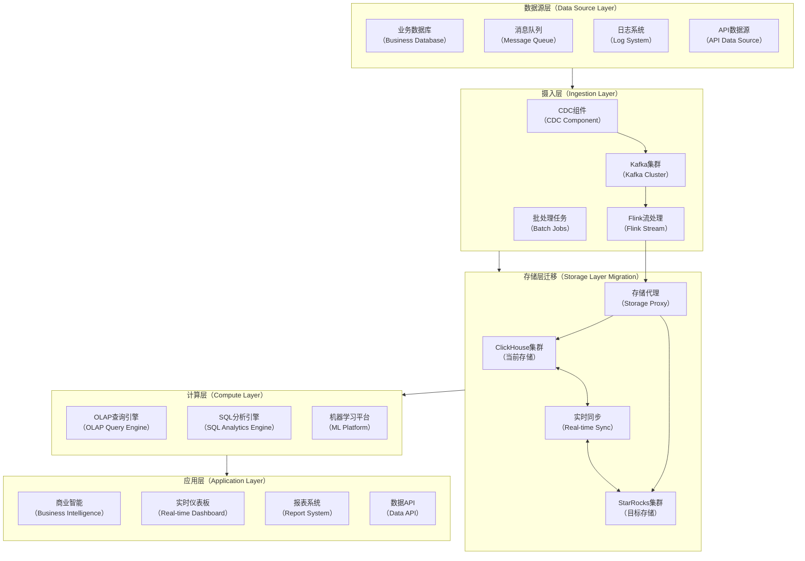
```mermaid
graph TB
%% 实时数据仓库场景迁移架构
subgraph DS[数据源层（Data Source Layer）]
    direction TB
    DS_DB[业务数据库<br/>（Business Database）]
    DS_MQ[消息队列<br/>（Message Queue）]
    DS_LOG[日志系统<br/>（Log System）]
    DS_API[API数据源<br/>（API Data Source）]
end

subgraph IL[摄入层（Ingestion Layer）]
    direction TB
    IL_CDC[CDC组件<br/>（CDC Component）]
    IL_KAFKA[Kafka集群<br/>（Kafka Cluster）]
    IL_FLINK[Flink流处理<br/>（Flink Stream）]
    IL_BATCH[批处理任务<br/>（Batch Jobs）]
end

subgraph SL[存储层迁移（Storage Layer Migration）]
    direction TB
    SL_CH[ClickHouse集群<br/>（当前存储）]
    SL_SR[StarRocks集群<br/>（目标存储）]
    SL_PROXY[存储代理<br/>（Storage Proxy）]
    SL_SYNC[实时同步<br/>（Real-time Sync）]
end

subgraph CL[计算层（Compute Layer）]
    direction TB
    CL_OLAP[OLAP查询引擎<br/>（OLAP Query Engine）]
    CL_SQL[SQL分析引擎<br/>（SQL Analytics Engine）]
    CL_ML[机器学习平台<br/>（ML Platform）]
end

subgraph AL[应用层（Application Layer）]
    direction TB
    AL_BI[商业智能<br/>（Business Intelligence）]
    AL_DASH[实时仪表板<br/>（Real-time Dashboard）]
    AL_RPT[报表系统<br/>（Report System）]
    AL_API[数据API<br/>（Data API）]
end

%% 数据流向
DS --> IL
IL --> SL
SL --> CL
CL --> AL

%% 内部连接
IL_CDC --> IL_KAFKA
IL_KAFKA --> IL_FLINK
IL_FLINK --> SL_PROXY
SL_PROXY --> SL_CH
SL_PROXY --> SL_SR
SL_CH <--> SL_SYNC
SL_SYNC <--> SL_SR
```

实时数据仓库场景是最常见的迁移场景之一。该架构通过存储代理层实现双写和智能路由，确保迁移过程中数据的实时性和一致性。Flink流处理同时向两个存储系统写入数据，通过实时同步组件保证数据一致性。

### 6.2 多租户SaaS平台场景迁移

```mermaid
%% 多租户SaaS平台场景迁移架构
subgraph TM[租户管理（Tenant Management）]
   direction TB
   TM_REG[租户注册<br/>（Tenant Registry）]
   TM_AUTH[认证授权<br/>（Authentication）]
   TM_QUOTA[资源配额<br/>（Resource Quota）]
   TM_ISOLATE[租户隔离<br/>（Tenant Isolation）]
end

subgraph AP[应用代理（Application Proxy）]
   direction TB
   AP_GATEWAY[API网关<br/>（API Gateway）]
   AP_LB[负载均衡<br/>（Load Balancer）]
   AP_ROUTE[租户路由<br/>（Tenant Router）]
   AP_CACHE[查询缓存<br/>（Query Cache）]
end

subgraph DL[数据层（Data Layer）]
   direction TB
   DL_CH_T1[ClickHouse租户1<br/>（CH Tenant 1）]
   DL_CH_T2[ClickHouse租户2<br/>（CH Tenant 2）]
   DL_SR_T1[StarRocks租户1<br/>（SR Tenant 1）]
   DL_SR_T2[StarRocks租户2<br/>（SR Tenant 2）]
   DL_MIGRATE[迁移控制器<br/>（Migration Controller）]
end

subgraph ML[监控层（Monitor Layer）]
   direction TB
   ML_METRIC[租户指标<br/>（Tenant Metrics）]
   ML_ALERT[告警系统<br/>（Alert System）]
   ML_AUDIT[审计日志<br/>（Audit Log）]
   ML_REPORT[迁移报告<br/>（Migration Report）]
end

%% 连接关系
TM --> AP
AP --> DL
DL --> ML
AP_ROUTE --> DL_CH_T1
AP_ROUTE --> DL_CH_T2
AP_ROUTE --> DL_SR_T1
AP_ROUTE --> DL_SR_T2
DL_MIGRATE --> DL_CH_T1
DL_MIGRATE --> DL_CH_T2
DL_MIGRATE --> DL_SR_T1
DL_MIGRATE --> DL_SR_T2
```

多租户SaaS平台需要按租户维度进行精细化迁移管理。每个租户可以独立进行迁移，互不影响。租户路由器根据租户ID和迁移状态智能地将请求路由到对应的存储后端。

### 6.3 大数据分析平台场景迁移时序

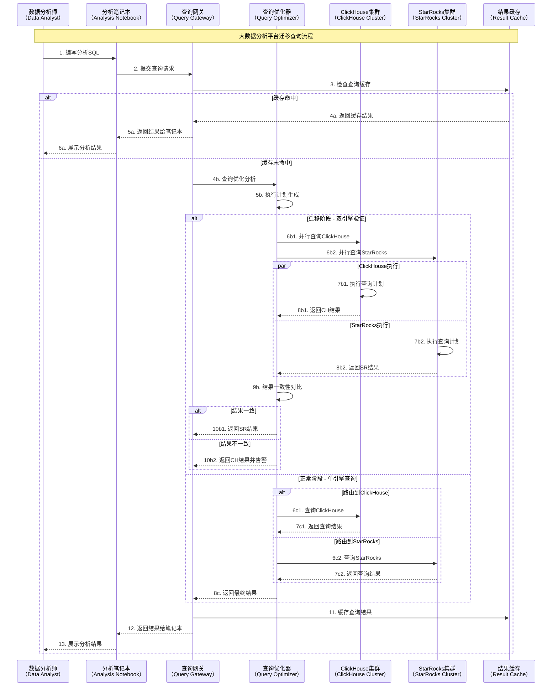
```mermaid
sequenceDiagram
%% 大数据分析平台场景迁移时序图
participant USER as 数据分析师<br/>（Data Analyst）
participant NOTEBOOK as 分析笔记本<br/>（Analysis Notebook）
participant GATEWAY as 查询网关<br/>（Query Gateway）
participant OPTIMIZER as 查询优化器<br/>（Query Optimizer）
participant CH as ClickHouse集群<br/>（ClickHouse Cluster）
participant SR as StarRocks集群<br/>（StarRocks Cluster）
participant CACHE as 结果缓存<br/>（Result Cache）

Note over USER,CACHE: 大数据分析平台迁移查询流程

USER->>NOTEBOOK: 1. 编写分析SQL
NOTEBOOK->>GATEWAY: 2. 提交查询请求
GATEWAY->>CACHE: 3. 检查查询缓存
alt 缓存命中
    CACHE-->>GATEWAY: 4a. 返回缓存结果
    GATEWAY-->>NOTEBOOK: 5a. 返回结果给笔记本
    NOTEBOOK-->>USER: 6a. 展示分析结果
else 缓存未命中
    GATEWAY->>OPTIMIZER: 4b. 查询优化分析
    OPTIMIZER->>OPTIMIZER: 5b. 执行计划生成
    
    alt 迁移阶段 - 双引擎验证
        OPTIMIZER->>CH: 6b1. 并行查询ClickHouse
        OPTIMIZER->>SR: 6b2. 并行查询StarRocks
        par ClickHouse执行
            CH->>CH: 7b1. 执行查询计划
            CH-->>OPTIMIZER: 8b1. 返回CH结果
        and StarRocks执行
            SR->>SR: 7b2. 执行查询计划  
            SR-->>OPTIMIZER: 8b2. 返回SR结果
        end
        OPTIMIZER->>OPTIMIZER: 9b. 结果一致性对比
        alt 结果一致
            OPTIMIZER-->>GATEWAY: 10b1. 返回SR结果
        else 结果不一致
            OPTIMIZER-->>GATEWAY: 10b2. 返回CH结果并告警
        end
    else 正常阶段 - 单引擎查询
        alt 路由到ClickHouse
            OPTIMIZER->>CH: 6c1. 查询ClickHouse
            CH-->>OPTIMIZER: 7c1. 返回查询结果
        else 路由到StarRocks
            OPTIMIZER->>SR: 6c2. 查询StarRocks
            SR-->>OPTIMIZER: 7c2. 返回查询结果
        end
        OPTIMIZER-->>GATEWAY: 8c. 返回最终结果
    end
    
    GATEWAY->>CACHE: 11. 缓存查询结果
    GATEWAY-->>NOTEBOOK: 12. 返回结果给笔记本
    NOTEBOOK-->>USER: 13. 展示分析结果
end
```

大数据分析平台场景的特点是查询复杂度高、数据量大、对性能要求严格。迁移过程中采用双引擎并行查询和结果对比的策略，确保查询结果的正确性和性能的可接受性。

## 7. 灰度策略与流量控制

### 7.1 多维度灰度控制架构

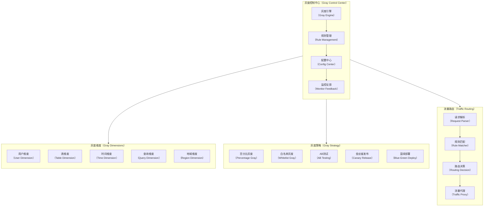
```mermaid
graph TB
%% 多维度灰度控制架构
subgraph GC[灰度控制中心（Gray Control Center）]
    direction TB
    GC_ENGINE[灰度引擎<br/>（Gray Engine）]
    GC_RULE[规则管理<br/>（Rule Management）]
    GC_CONFIG[配置中心<br/>（Config Center）]
    GC_MONITOR[监控反馈<br/>（Monitor Feedback）]
end

subgraph GD[灰度维度（Gray Dimensions）]
    direction TB
    GD_USER[用户维度<br/>（User Dimension）]
    GD_TABLE[表维度<br/>（Table Dimension）]
    GD_TIME[时间维度<br/>（Time Dimension）]
    GD_QUERY[查询维度<br/>（Query Dimension）]
    GD_REGION[地域维度<br/>（Region Dimension）]
end

subgraph GS[灰度策略（Gray Strategy）]
    direction TB
    GS_PERCENT[百分比灰度<br/>（Percentage Gray）]
    GS_WHITELIST[白名单灰度<br/>（Whitelist Gray）]
    GS_AB[AB测试<br/>（AB Testing）]
    GS_CANARY[金丝雀发布<br/>（Canary Release）]
    GS_BLUE_GREEN[蓝绿部署<br/>（Blue-Green Deploy）]
end

subgraph TR[流量路由（Traffic Routing）]
    direction TB
    TR_PARSER[请求解析<br/>（Request Parser）]
    TR_MATCHER[规则匹配<br/>（Rule Matcher）]
    TR_ROUTER[路由决策<br/>（Routing Decision）]
    TR_PROXY[流量代理<br/>（Traffic Proxy）]
end

%% 连接关系
GC --> GD
GC --> GS
GC --> TR
GC_ENGINE --> GC_RULE
GC_RULE --> GC_CONFIG
GC_CONFIG --> GC_MONITOR
TR_PARSER --> TR_MATCHER
TR_MATCHER --> TR_ROUTER
TR_ROUTER --> TR_PROXY
```

多维度灰度控制架构支持用户、表、时间、查询类型、地域等多个维度的灰度策略。灰度引擎根据配置的规则动态决策流量路由，支持百分比、白名单、AB测试等多种灰度模式。

### 7.2 灰度策略执行流程

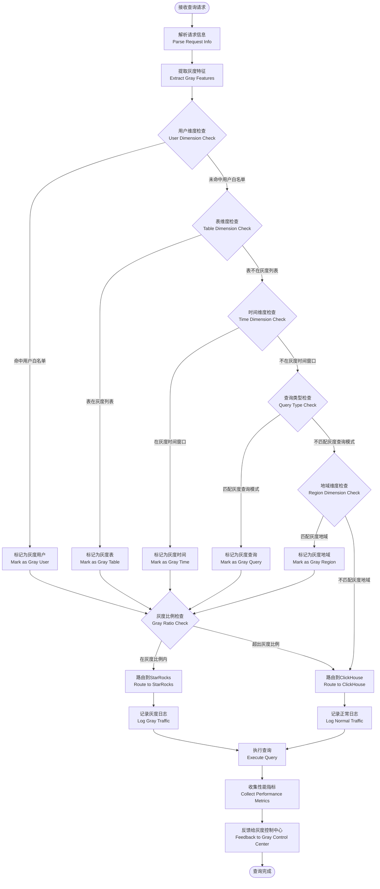
```mermaid
flowchart TD
%% 灰度策略执行流程
Start([接收查询请求]) --> A1[解析请求信息<br/>Parse Request Info]

A1 --> A2[提取灰度特征<br/>Extract Gray Features]
A2 --> B1{用户维度检查<br/>User Dimension Check}

B1 -->|命中用户白名单| C1[标记为灰度用户<br/>Mark as Gray User]
B1 -->|未命中用户白名单| B2{表维度检查<br/>Table Dimension Check}

B2 -->|表在灰度列表| C2[标记为灰度表<br/>Mark as Gray Table]
B2 -->|表不在灰度列表| B3{时间维度检查<br/>Time Dimension Check}

B3 -->|在灰度时间窗口| C3[标记为灰度时间<br/>Mark as Gray Time]
B3 -->|不在灰度时间窗口| B4{查询类型检查<br/>Query Type Check}

B4 -->|匹配灰度查询模式| C4[标记为灰度查询<br/>Mark as Gray Query]
B4 -->|不匹配灰度查询模式| B5{地域维度检查<br/>Region Dimension Check}

B5 -->|匹配灰度地域| C5[标记为灰度地域<br/>Mark as Gray Region]
B5 -->|不匹配灰度地域| D1[路由到ClickHouse<br/>Route to ClickHouse]

C1 --> E1{灰度比例检查<br/>Gray Ratio Check}
C2 --> E1
C3 --> E1
C4 --> E1
C5 --> E1

E1 -->|在灰度比例内| F1[路由到StarRocks<br/>Route to StarRocks]
E1 -->|超出灰度比例| D1

F1 --> G1[记录灰度日志<br/>Log Gray Traffic]
D1 --> G2[记录正常日志<br/>Log Normal Traffic]

G1 --> H1[执行查询<br/>Execute Query]
G2 --> H1

H1 --> I1[收集性能指标<br/>Collect Performance Metrics]
I1 --> J1[反馈给灰度控制中心<br/>Feedback to Gray Control Center]
J1 --> End([查询完成])
```

## 8. 监控体系与质量保障

### 8.1 全链路监控架构

```mermaid
graph TB
%% 全链路监控架构
subgraph ML[监控层（Monitor Layer）]
    direction TB
    ML_COLLECTOR[指标收集器<br/>（Metrics Collector）]
    ML_PROCESSOR[数据处理器<br/>（Data Processor）]
    ML_STORAGE[监控存储<br/>（Monitor Storage）]
    ML_ANALYZER[分析引擎<br/>（Analysis Engine）]
end

subgraph DL[数据层监控（Data Layer Monitor）]
    direction TB
    DL_CONSIST[数据一致性<br/>（Data Consistency）]
    DL_LATENCY[同步延迟<br/>（Sync Latency）]
    DL_VOLUME[数据量监控<br/>（Data Volume）]
    DL_QUALITY[数据质量<br/>（Data Quality）]
end

subgraph PL[性能层监控（Performance Layer Monitor）]
    direction TB
    PL_QUERY[查询性能<br/>（Query Performance）]
    PL_RESOURCE[资源使用<br/>（Resource Usage）]
    PL_THROUGHPUT[吞吐量<br/>（Throughput）]
    PL_CONCURRENCY[并发度<br/>（Concurrency）]
end

subgraph BL[业务层监控（Business Layer Monitor）]
    direction TB
    BL_SLA[服务水平<br/>（SLA Monitor）]
    BL_ERROR[错误率<br/>（Error Rate）]
    BL_SUCCESS[成功率<br/>（Success Rate）]
    BL_USER[用户体验<br/>（User Experience）]
end

subgraph AL[告警层（Alert Layer）]
    direction TB
    AL_THRESHOLD[阈值告警<br/>（Threshold Alert）]
    AL_ANOMALY[异常检测<br/>（Anomaly Detection）]
    AL_PREDICT[预测告警<br/>（Predictive Alert）]
    AL_ESCALATE[告警升级<br/>（Alert Escalation）]
end

subgraph VL[可视化层（Visualization Layer）]
    direction TB
    VL_DASHBOARD[监控仪表板<br/>（Monitor Dashboard）]
    VL_REPORT[迁移报告<br/>（Migration Report）]
    VL_TREND[趋势分析<br/>（Trend Analysis）]
    VL_REALTIME[实时监控<br/>（Real-time Monitor）]
end

%% 连接关系
ML --> DL
ML --> PL
ML --> BL
ML --> AL
ML --> VL
```

全链路监控架构覆盖数据层、性能层、业务层的全方位监控。通过指标收集器实时采集各种监控指标，经过数据处理和分析引擎的处理，最终通过可视化层展示给运维人员。

### 8.2 数据一致性验证机制

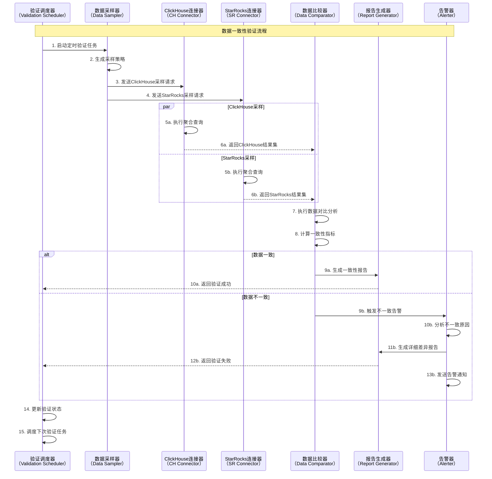
```mermaid
sequenceDiagram
%% 数据一致性验证时序图
participant SCHEDULER as 验证调度器<br/>（Validation Scheduler）
participant SAMPLER as 数据采样器<br/>（Data Sampler）
participant CH_CONN as ClickHouse连接器<br/>（CH Connector）
participant SR_CONN as StarRocks连接器<br/>（SR Connector）
participant COMPARATOR as 数据比较器<br/>（Data Comparator）
participant REPORTER as 报告生成器<br/>（Report Generator）
participant ALERTER as 告警器<br/>（Alerter）

Note over SCHEDULER,ALERTER: 数据一致性验证流程

SCHEDULER->>SAMPLER: 1. 启动定时验证任务
SAMPLER->>SAMPLER: 2. 生成采样策略
SAMPLER->>CH_CONN: 3. 发送ClickHouse采样请求
SAMPLER->>SR_CONN: 4. 发送StarRocks采样请求

par ClickHouse采样
    CH_CONN->>CH_CONN: 5a. 执行聚合查询
    CH_CONN-->>COMPARATOR: 6a. 返回ClickHouse结果集
and StarRocks采样  
    SR_CONN->>SR_CONN: 5b. 执行聚合查询
    SR_CONN-->>COMPARATOR: 6b. 返回StarRocks结果集
end

COMPARATOR->>COMPARATOR: 7. 执行数据对比分析
COMPARATOR->>COMPARATOR: 8. 计算一致性指标

alt 数据一致
    COMPARATOR->>REPORTER: 9a. 生成一致性报告
    REPORTER-->>SCHEDULER: 10a. 返回验证成功
else 数据不一致
    COMPARATOR->>ALERTER: 9b. 触发不一致告警
    ALERTER->>ALERTER: 10b. 分析不一致原因
    ALERTER->>REPORTER: 11b. 生成详细差异报告
    REPORTER-->>SCHEDULER: 12b. 返回验证失败
    ALERTER->>ALERTER: 13b. 发送告警通知
end

SCHEDULER->>SCHEDULER: 14. 更新验证状态
SCHEDULER->>SCHEDULER: 15. 调度下次验证任务
```

数据一致性验证是迁移过程中的关键环节。验证机制采用定时采样、并行查询、结果对比的方式，确保两个系统间数据的一致性。当发现不一致时，会生成详细的差异报告并触发告警。

## 9. 风险控制与应急预案

### 9.1 多层级风险控制体系

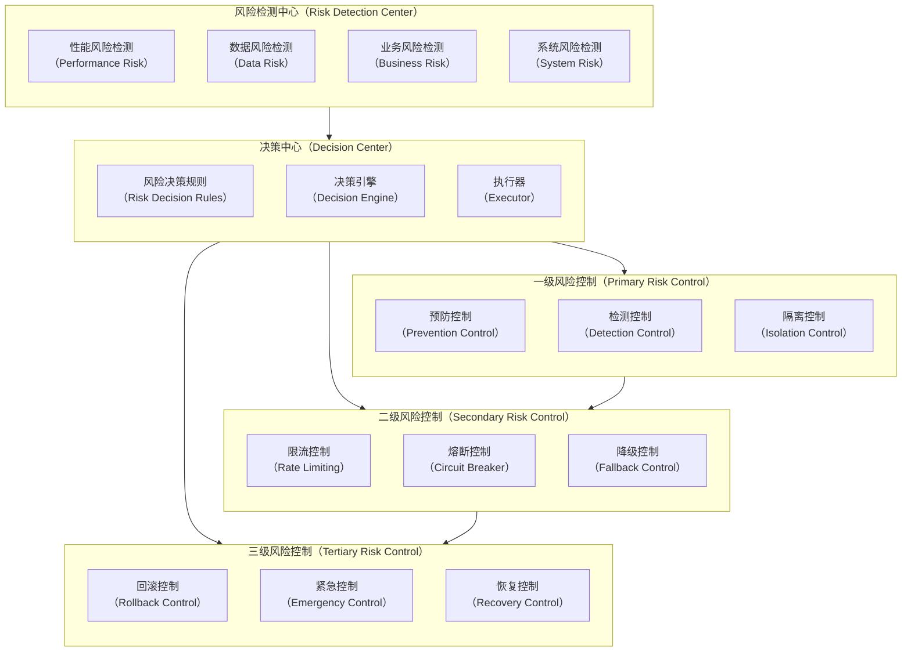
```mermaid
graph TB
%% 多层级风险控制体系
subgraph L1[一级风险控制（Primary Risk Control）]
    direction TB
    L1_PREVENT[预防控制<br/>（Prevention Control）]
    L1_DETECT[检测控制<br/>（Detection Control）]
    L1_ISOLATE[隔离控制<br/>（Isolation Control）]
end

subgraph L2[二级风险控制（Secondary Risk Control）]
    direction TB
    L2_LIMIT[限流控制<br/>（Rate Limiting）]
    L2_CIRCUIT[熔断控制<br/>（Circuit Breaker）]
    L2_FALLBACK[降级控制<br/>（Fallback Control）]
end

subgraph L3[三级风险控制（Tertiary Risk Control）]
    direction TB
    L3_ROLLBACK[回滚控制<br/>（Rollback Control）]
    L3_EMERGENCY[紧急控制<br/>（Emergency Control）]
    L3_RECOVERY[恢复控制<br/>（Recovery Control）]
end

subgraph RC[风险检测中心（Risk Detection Center）]
    direction TB
    RC_PERF[性能风险检测<br/>（Performance Risk）]
    RC_DATA[数据风险检测<br/>（Data Risk）]
    RC_BUSINESS[业务风险检测<br/>（Business Risk）]
    RC_SYSTEM[系统风险检测<br/>（System Risk）]
end

subgraph DC[决策中心（Decision Center）]
    direction TB
    DC_RULE[风险决策规则<br/>（Risk Decision Rules）]
    DC_ENGINE[决策引擎<br/>（Decision Engine）]
    DC_EXECUTE[执行器<br/>（Executor）]
end

%% 连接关系
RC --> DC
DC --> L1
DC --> L2
DC --> L3
L1 --> L2
L2 --> L3
```

多层级风险控制体系采用预防、检测、响应的分层防护策略。一级控制主要负责预防和早期检测，二级控制负责限流和熔断，三级控制负责回滚和紧急恢复。

### 9.2 应急响应流程

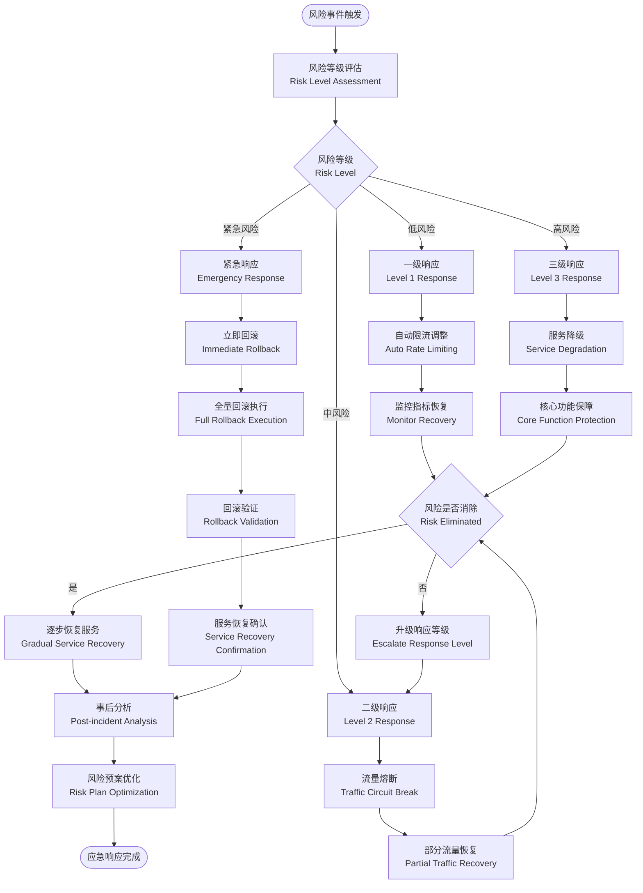
```mermaid
flowchart TD
%% 应急响应流程
Start([风险事件触发]) --> A1[风险等级评估<br/>Risk Level Assessment]

A1 --> B1{风险等级<br/>Risk Level}

B1 -->|低风险| C1[一级响应<br/>Level 1 Response]
B1 -->|中风险| C2[二级响应<br/>Level 2 Response]  
B1 -->|高风险| C3[三级响应<br/>Level 3 Response]
B1 -->|紧急风险| C4[紧急响应<br/>Emergency Response]

C1 --> D1[自动限流调整<br/>Auto Rate Limiting]
C2 --> D2[流量熔断<br/>Traffic Circuit Break]
C3 --> D3[服务降级<br/>Service Degradation]
C4 --> D4[立即回滚<br/>Immediate Rollback]

D1 --> E1[监控指标恢复<br/>Monitor Recovery]
D2 --> E2[部分流量恢复<br/>Partial Traffic Recovery]
D3 --> E3[核心功能保障<br/>Core Function Protection]
D4 --> E4[全量回滚执行<br/>Full Rollback Execution]

E1 --> F1{风险是否消除<br/>Risk Eliminated}
E2 --> F1
E3 --> F1
E4 --> F2[回滚验证<br/>Rollback Validation]

F1 -->|是| G1[逐步恢复服务<br/>Gradual Service Recovery]
F1 -->|否| H1[升级响应等级<br/>Escalate Response Level]

F2 --> G2[服务恢复确认<br/>Service Recovery Confirmation]

G1 --> I1[事后分析<br/>Post-incident Analysis]
G2 --> I1
H1 --> C2

I1 --> J1[风险预案优化<br/>Risk Plan Optimization]
J1 --> End([应急响应完成])
```

## 10. 实施计划与时间规划

### 10.1 关键里程碑与交付物

整个迁移项目设置了4个关键里程碑：

**里程碑1：方案设计完成**

* 交付物：详细技术方案、架构设计文档、风险评估报告

**里程碑2：工具开发完成**

* 交付物：迁移工具集、监控系统、自动化脚本

**里程碑3：试点验证完成**

* 交付物：试点迁移报告、性能对比分析、优化建议

**里程碑4：生产迁移完成**

* 交付物：全量迁移报告、运维手册、应急预案

## 总结

本方案设计提供了ClickHouse到StarRocks的三种迁移模式：原地升级、整体迁移、引擎替换。每种模式都有其适用场景和技术特点：

**原地升级模式**适合小规模、可容忍停机的场景，通过在现有环境中直接替换数据库引擎实现快速迁移。

**整体迁移模式**适合大规模、复杂业务系统，通过建立独立的StarRocks集群并采用灰度策略实现平滑迁移。

**引擎替换模式**适合零停机要求的场景，通过透明代理层实现业务无感知的引擎切换。

方案充分考虑了Schema兼容性、数据一致性、性能优化、风险控制等关键因素，通过多维度灰度策略、全链路监控体系、多层级风险控制等技术手段，确保迁移过程的安全性和可靠性。整个实施周期约9个月，分为准备、开发、试点、生产迁移、收尾五个阶段，为企业提供了完整的迁移解决方案。
