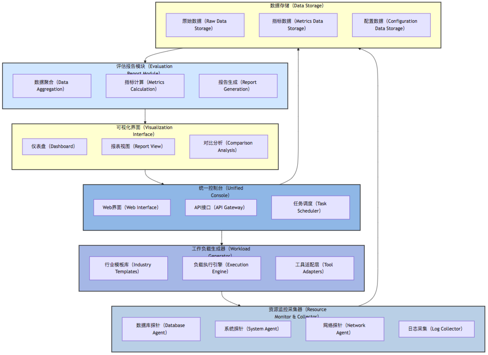
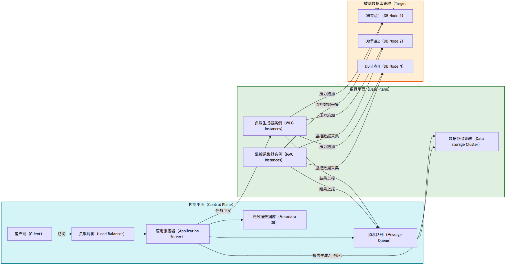
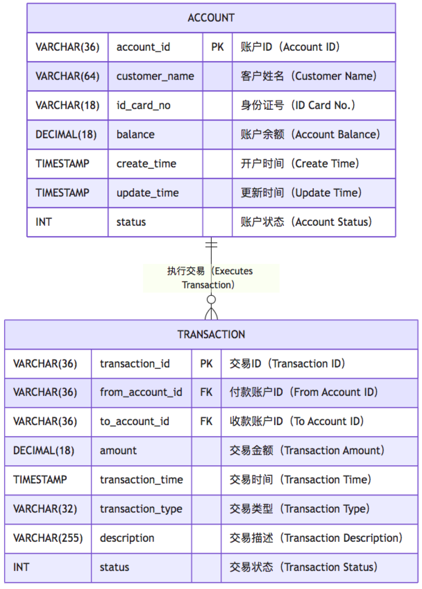
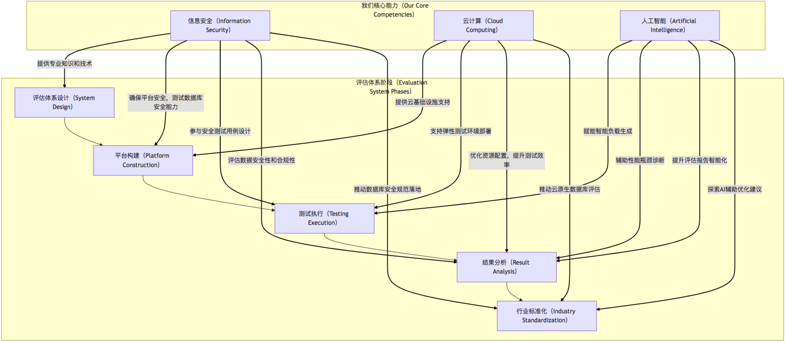

## 国产数据库能力评估体系与行业标准化白皮书(参考)

### 1. 引言

#### 1.1 背景与痛点分析

近年来，伴随国家对关键基础软件自主可控的高度重视，国产数据库技术取得了显著进步，涌现出一批具有核心竞争力的产品和解决方案。然而，在市场推广和客户选型过程中，普遍存在以下症结：

* **行业需求与负载特征缺乏标准表达**：各行业客户对数据库的需求千差万别，缺乏统一的语言来描述其业务负载特性，导致数据库厂商难以精准理解痛点并提供适配性方案。
* **能力评估维度模糊、不可复现**：现有评估往往停留在表面，缺乏对数据库深层次能力（如分布式事务一致性、复杂查询优化、多模数据处理等）的量化评估，且测试方法难以标准化，结果不可复现，使得客户难以基于事实数据做出决策。
* **测试方法各自为政、缺乏可信度**：不同厂商、客户或第三方机构采用的测试方法、工具、数据集各异，导致评估结果互不兼容、缺乏公信力，选型过程易受主观偏见和营销策略主导，而非技术能力本身。

这些问题严重制约了国产数据库的规模化应用，也使得整个产业在良性循环和协同发展方面面临挑战。

#### 1.2 评估体系的愿景与目标

为解决上述痛点，本白皮书旨在构建一套**开放、量化、可复现的国产数据库能力评估体系**。其核心愿景是成为国产数据库选型、产品优化和产业协同的“度量衡”，最终目标为：

* **助力客户科学选型**：为行业客户提供客观、量化、可复现的数据库选型依据，降低选型风险。
* **引导厂商持续改进**：清晰反馈数据库产品的性能短板、工程成熟度与场景适配能力，指导厂商产品研发与优化方向。
* **促进生态协同发展**：通过标准化的评估规范，推动形成健康有序的产业生态，提升国产数据库整体竞争力与技术话语权。

#### 1.3 本白皮书概述

本白皮书将深入探讨国产数据库能力评估体系的核心设计理念、可交互评估平台的架构，并提供一个完整的行业建模示例。同时，将分析我们在信息安全、云计算及人工智能领域的深厚积累如何赋能此评估体系，并提出推动行业标准化、构建产业联盟及建立动态评估机制的策略，最终展望通过公开排行榜和白皮书持续提升行业透明度和信任度。

### 2. 国内外数据库能力评估经验借鉴与分析

构建标准化的数据库评估体系并非无章可循，国际上已有成熟的实践经验，国内也在积极探索。

#### 2.1 国际主流评估标准与实践

国际上最广为人知的数据库性能评估标准莫过于**TPC（Transaction Processing Performance Council）系列基准测试** \[1]。TPC基准测试旨在模拟真实的业务负载，如在线事务处理（OLTP）、决策支持系统（DSS/OLAP）和混合负载等。

* **TPC-C**：业界应用最广泛的OLTP基准测试，模拟零售订单输入和查询，主要评估数据库在高并发、短事务场景下的吞吐量（TPS）和响应时间。
* **TPC-H**：面向决策支持系统的基准测试，包含一系列复杂SQL查询，评估数据库在处理大规模数据集、复杂关联、聚合计算时的性能。
* **TPC-DS**：更复杂的决策支持系统基准测试，模拟更真实的业务场景，包含多种查询类型和数据模式，对数据库的扩展性、复杂分析能力提出更高要求。
* **TPC-E**：新型企业级OLTP基准测试，模拟股票交易，比TPC-C更复杂，强调实际应用场景中的复杂逻辑和事务依赖。

此外，**SPEC（Standard Performance Evaluation Corporation）** \[2] 也提供了一系列系统级性能测试，虽然不直接针对数据库，但其对服务器硬件、存储I/O和网络性能的评估方法，对数据库底层性能分析具有参考价值。

**YCSB（Yahoo! Cloud Serving Benchmark）** \[3] 则是一个更通用的基准测试框架，尤其适用于NoSQL和NewSQL数据库。它提供了一系列预定义的负载模式（如读取密集型、写入密集型、扫描等），用户也可以自定义负载，以评估数据库在不同访问模式下的性能表现，具有极高的灵活性。

#### 2.2 国内数据库评测现状与挑战

国内在数据库评测方面，虽然尚未形成类似TPC这样具有全球影响力的标准化组织和规范，但各数据库厂商、头部互联网公司和科研机构也进行过大量内部测试和性能对比。

* **厂商自测**：大部分国产数据库厂商都会发布基于Sysbench \[4]、TPC-C/H（或其变种）等工具的性能数据，以展示其产品能力。但这些测试往往是厂商主导，缺乏统一的测试环境和方法，结果难以横向比较。
* **行业联盟或实验室评测**：部分行业联盟（如信创联盟）或高校实验室会开展数据库产品评测，但通常覆盖面有限，且缺乏持续更新和公开透明的机制。
* **客户POC（Proof of Concept）**：客户在选型过程中会进行小范围POC，但其局限于特定业务场景，缺乏普遍性，且耗时耗力。

主要挑战在于：

1. **缺乏统一规范**：没有一个被广泛认可的、由独立第三方机构主导的国产数据库性能和能力评估标准。
2. **可信度问题**：厂商自测数据公信力不足，第三方评测覆盖有限且缺乏持续性。
3. **场景适配不足**：现有基准测试工具（如Sysbench、YCSB）虽然通用，但针对中国特定行业场景（如金融信创的特殊监管要求、政务大数据平台的复杂多维查询）的模拟能力有限。

#### 2.3 经验总结与借鉴

从国际国内经验中，我们可以总结出以下几点借鉴意义：

* **独立第三方权威性**：评估体系的公信力源于其独立性和权威性。需要避免厂商主导，由具备公信力的第三方机构牵头。
* **标准化与可复现性**：从负载模型、测试方法、评估指标到结果发布，全流程必须标准化，确保测试结果可复现、可比较。
* **场景化与代表性**：基准测试应尽可能贴近真实业务场景，通过典型的行业负载模型来驱动评估。
* **全面性与多维度**：除了性能，还需关注工程成熟度、安全、稳定性、可扩展性、运维便捷性等多个维度。
* **持续演进**：数据库技术和业务需求不断变化，评估体系也需要动态更新，保持其前瞻性和有效性。

### 3. 国产数据库能力评估体系核心设计理念

本评估体系以“**全面量化、场景驱动、开放透明、持续演进**”为核心理念，旨在构建一个科学、客观、权威的评估平台。

#### 3.1 基于典型行业负载模型驱动

传统的基准测试往往是通用的，难以充分反映特定行业数据库应用的核心需求和挑战。因此，本评估体系将深入研究典型行业（如金融、电信、政务、工业、医疗、电商）的业务特性、数据模式和访问模式，抽象出具有代表性的**行业负载模型**。

* **行业需求特征**：分析各行业对数据一致性、事务并发、数据规模、查询复杂性、实时性、安全性、可用性等方面的特殊要求。
* **典型负载场景**：为每个行业定义1-3个核心业务场景，如金融的“高频转账”、电信的“详单批处理”、政务的“复杂多表联合查询”等。
* **负载参数化**：将负载模型参数化，包括并发度、事务模式（ACID/BASE、长事务/短事务）、查询复杂度（JOIN深度、聚合函数）、数据规模（百万/亿级、冷热数据比例）、索引使用等，确保负载的可配置性和可控性。

#### 3.2 全面量化与多维度评估

评估结果必须是量化且可比较的，我们将从**性能、工程能力、安全与稳定性**三大维度，辅以细化指标，对数据库产品进行全方位考量。

* **性能指标**：聚焦吞吐量（TPS/QPS）、延迟（TP50/95/99）、批处理时间、查询计划质量等。
* **工程能力指标**：涵盖高可用机制（RPO/RTO）、扩展能力、运维便捷性、数据一致性机制、生态集成能力等。
* **安全与稳定性指标**：关注权限控制粒度、审计能力、故障稳定性、数据恢复能力等。

每个指标将设计一套标准化的测试方法和数据采集规范，确保评估结果的准确性和可信度。

#### 3.3 开放、透明、持续演进

评估体系的生命力在于其开放性和透明度。我们将：

* **开放评估规范**：评估方法、负载模型、指标体系和测试工具将向全行业开放，接受广泛监督和反馈。
* **透明测试过程**：鼓励厂商在透明环境中进行测试，测试结果和报告将公开。
* **持续演进机制**：随着数据库技术和行业需求的发展，定期更新负载模型、测试工具和评估指标，确保评估体系始终保持先进性。

### 4. 标准化数据库能力评估平台架构设计

为支撑上述评估理念，需要一个强大、灵活且可扩展的自动化测试平台。该平台应采用模块化设计，具备统一控制、灵活负载生成、全面监控、智能分析和可视化展现的能力。

#### 4.1 总体架构概览

以下是国产数据库能力评估平台的总体架构设计图：



该架构清晰地划分了系统功能模块，实现了职责分离和模块间松耦合。

#### 4.2 核心模块详细设计

##### 4.2.1 统一控制台（Unified Console）

统一控制台是整个评估平台的用户交互入口和核心调度中心。

* **Web界面（Web Interface）**：提供直观的用户界面，用于测试场景选择、数据库信息录入、数据集生成配置、测试任务启动与停止、评估报告查看等。
* **API接口（API Gateway）**：提供RESTful API，支持外部系统（如CI/CD流程）集成，实现自动化测试触发和结果查询。
* **任务调度（Task Scheduler）**：负责管理测试任务的生命周期，包括任务队列、优先级调度、并发控制、失败重试等。

##### 4.2.2 工作负载生成器（Workload Generator）

工作负载生成器是评估体系的核心，负责模拟真实行业负载并向目标数据库施压。

* **行业模板库（Industry Templates）**：预置或支持自定义金融、电信、政务、工业、医疗、电商等典型行业的数据模型和业务操作模板。每个模板包含数据模型定义（表结构、数据类型、索引）、预生成数据脚本、以及代表性业务操作脚本。
* **负载执行引擎（Execution Engine）**：根据选定的行业模板和配置参数（并发度、事务模式、数据规模等），动态生成并执行压力测试脚本。支持多进程/多线程并发，分布式部署以支撑超大规模负载。
* **工具适配层（Tool Adapters）**：提供统一的接口，封装和管理不同的开源基准测试工具，如Sysbench、OLTPBench \[5]、YCSB等。通过适配器模式，使得平台可灵活扩展支持新的测试工具，也可自研统一加载框架，确保负载生成逻辑的一致性和可控性。

##### 4.2.3 资源监控采集器（Resource Monitor & Collector）

此模块负责实时采集被测数据库及其所在主机的性能和资源利用率数据。

* **数据库探针（Database Agent）**：通过数据库自身提供的监控接口（如SQL查询、性能视图）采集TPS、QPS、SQL执行时间、锁等待、死锁、连接数、缓存命中率等数据库内部性能指标。
* **系统探针（System Agent）**：部署在被测数据库主机上，采集CPU利用率、内存使用、磁盘I/O（读写带宽、IOPS、延迟）、网络吞吐等操作系统层面的资源数据。
* **网络探针（Network Agent）**：监控测试客户端与数据库服务器之间的网络延迟、丢包率等。
* **日志采集（Log Collector）**：收集数据库运行日志、慢查询日志、审计日志等，用于后续的故障分析和安全审计。

##### 4.2.4 评估报告模块（Evaluation Report Module）

该模块对采集到的原始数据进行清洗、聚合和分析，生成标准化评估报告。

* **数据聚合（Data Aggregation）**：将来自不同探针的原始数据进行时间对齐和聚合。
* **指标计算（Metrics Calculation）**：基于原始数据，按照预定义的公式计算性能指标（如延迟分位TP50/95/99）、工程能力指标和安全稳定性指标。
* **报告生成（Report Generation）**：生成结构化、易于理解的评估报告，包含各项指标的数值、趋势图、与基线的对比等。支持PDF、HTML等多种输出格式。

##### 4.2.5 可视化界面（Visualization Interface）

可视化界面提供直观的数据展现和分析能力，帮助用户快速理解评估结果。

* **仪表盘（Dashboard）**：实时展示当前正在进行测试的关键指标，如TPS、QPS、平均延迟、CPU利用率等。
* **报表视图（Report View）**：以图表形式（热力图、雷达图、趋势图、柱状图等）展现评估报告中的各项指标，支持多维度下钻分析。
* **对比分析（Comparison Analysis）**：支持不同数据库产品之间、同一产品不同版本之间、或同一产品不同测试场景之间的横向/纵向对比，以便发现产品优势与劣势。

#### 4.3 部署架构

评估平台支持分布式部署，以满足不同规模的测试需求。



* **控制平面（Control Plane）**：负责用户请求处理、任务调度、配置管理、报告展示等，由Web服务器、应用服务器、元数据数据库和消息队列组成。
* **数据平面（Data Plane）**：由多个负载生成器实例和监控采集器实例组成，可弹性扩展。负载生成器实例负责产生压力，监控采集器实例负责收集数据。所有测试数据和监控数据通过消息队列汇聚到数据存储集群。
* **被测数据库集群（Target DB Cluster）**：待评估的国产数据库集群，部署于独立的测试环境中，确保评估的隔离性和公平性。

#### 4.4 安全与AI赋能考量

在评估平台设计中，融入安全和AI能力是提升其专业性和智能化的关键。

* **安全加固**：

  * **平台自身安全**：遵循最小权限原则，对控制台、API接口、数据传输链路进行安全加固，防止未授权访问和数据泄露。所有组件间通信采用TLS加密。
  * **测试数据安全**：敏感测试数据（如金融行业的用户信息）可采用脱敏或合成数据，确保数据合规性。
  * **安全能力评估**：在安全与稳定性指标中，深入评估数据库自身的安全能力，如权限管理、审计日志、加密存储、SQL注入防护等。我们在网络安全、数据安全和云安全领域拥有深厚积累，可为平台自身安全提供全面的防护，并在数据库安全能力评估方面提供专业指导和测试工具。
* **AI赋能**：

  * **智能负载生成**：利用AI（如强化学习）分析历史业务负载数据，自动调整负载参数（并发、事务类型、查询模式等），生成更逼真的压力模型。
  * **性能瓶颈智能诊断**：结合AI算法，对海量监控数据进行模式识别和异常检测，自动识别性能瓶颈（如I/O瓶颈、CPU瓶颈、锁争用、慢查询），并给出初步诊断建议。
  * **异常行为检测**：结合机器学习模型，对数据库操作日志和系统日志进行分析，识别潜在的入侵行为或系统异常，提升评估的全面性。
  * **报告智能解读**：利用自然语言处理（NLP）技术，对评估报告进行智能摘要和解读，帮助用户快速理解复杂数据，甚至生成面向不同角色的定制化报告。

### 5. 行业负载模型与标准化指标体系

#### 5.1 典型行业负载模型定义

我们建议从以下标准行业集出发，构建其典型负载模型。以下以\*\*金融（OLTP为主）\*\*为例，进行详细建模。

##### 5.1.1 行业需求特征

* **金融（OLTP为主）**：

  * **高并发、低延迟**：核心交易系统需支撑每秒数万甚至数十万的交易，响应时间要求极高（毫秒级）。
  * **强一致性（ACID）**：资金交易对数据一致性要求最高，必须严格遵循ACID特性，不允许数据丢失或不一致。
  * **复杂事务**：除了简单的转账，还涉及跨账户、跨表的复杂事务，如批量结算、对账。
  * **数据安全与审计**：金融数据是核心资产，要求极高的安全防护能力、细粒度权限控制和完整的操作审计。
  * **高可用性与灾备**：系统可用性要求达到99.999%甚至更高，具备RPO=0、RTO极短的灾备能力。
  * **历史数据归档与查询**：大量历史交易数据需要归档，并支持快速查询和统计分析。

##### 5.1.2 典型负载场景与数据模型：金融-在线交易（OLTP）

**场景描述**：模拟银行核心交易系统，包含用户开户、存款、取款、转账、查询余额等高频短事务操作。

**数据模型**：
我们构建一个简化的银行交易模型，包含 `Account（账户）`、`Transaction（交易流水）`两张核心表。



**表结构示例（SQL DDL）**：

```sql
-- Account Table
CREATE TABLE Account (
    account_id VARCHAR(36) PRIMARY KEY COMMENT '账户ID',
    customer_name VARCHAR(64) NOT NULL COMMENT '客户姓名',
    id_card_no VARCHAR(18) NOT NULL UNIQUE COMMENT '身份证号',
    balance DECIMAL(18, 2) NOT NULL DEFAULT 0.00 COMMENT '账户余额',
    create_time TIMESTAMP DEFAULT CURRENT_TIMESTAMP COMMENT '开户时间',
    update_time TIMESTAMP DEFAULT CURRENT_TIMESTAMP ON UPDATE CURRENT_TIMESTAMP COMMENT '更新时间',
    status INT NOT NULL DEFAULT 0 COMMENT '账户状态：0-正常，1-冻结'
);

-- Transaction Table
CREATE TABLE Transaction (
    transaction_id VARCHAR(36) PRIMARY KEY COMMENT '交易ID',
    from_account_id VARCHAR(36) NOT NULL COMMENT '付款账户ID',
    to_account_id VARCHAR(36) NOT NULL COMMENT '收款账户ID',
    amount DECIMAL(18, 2) NOT NULL COMMENT '交易金额',
    transaction_time TIMESTAMP DEFAULT CURRENT_TIMESTAMP COMMENT '交易时间',
    transaction_type VARCHAR(32) NOT NULL COMMENT '交易类型：deposit, withdraw, transfer',
    description VARCHAR(255) COMMENT '交易描述',
    status INT NOT NULL DEFAULT 0 COMMENT '交易状态：0-处理中，1-成功，2-失败',
    INDEX idx_from_account (from_account_id),
    INDEX idx_to_account (to_account_id),
    INDEX idx_transaction_time (transaction_time)
);
```

##### 5.1.3 负载生成策略：金融-在线交易

基于上述数据模型，构造具有代表性的压力测试负载。

| 参数维度      | 说明                                     | 金融场景示例                        | 具体配置建议                                                           |
| :-------- | :------------------------------------- | :---------------------------- | :--------------------------------------------------------------- |
| **并发度**   | 模拟真实访问用户                               | 模拟核心交易系统并发用户                  | 1000 - 10000 并发用户，持续请求                                           |
| **事务模式**  | ACID vs BASE，长事务/短事务                   | 高频转账、存款、取款（短事务）               | **80%转账（2PC）、15%存款/取款（1PC）、5%余额查询**                              |
| **查询复杂度** | 查询条件、JOIN深度、聚合函数                       | 单一账户余额查询、最近交易流水查询             | 单表查询、简单JOIN（账户与交易），无复杂聚合                                         |
| **数据规模**  | 百万/亿级数据量、冷热数据比例                        | 活跃账户与历史归档区分                   | 1亿账户，100亿交易流水；**活跃数据（近3个月）占比20%**                                |
| **索引使用**  | 主键索引、复合索引、全文索引                         | 账户ID主键、交易时间/账户ID复合索引          | **主键索引、from\_account\_id/to\_account\_id索引、transaction\_time索引** |
| **负载构成**  | 不同操作的比例                                | 转账、存款、取款、查询                   | 写入操作（转账、存款、取款）占比 \~95%，查询占比 \~5%                                 |
| **数据偏斜**  | 热点账户、热点商品等                             | VIP账户、大额交易账户                  | 20%的账户承载80%的交易量                                                  |
| **工具建议**  | 可扩展 Sysbench、OLTPBench、YCSB，也可自研统一加载框架 | Sysbench TPC-C 变种，或自研金融OLTP套件 | 基于**OLTPBench**或**自研框架**，实现复杂事务模拟                                |

#### 5.2 评估指标体系详解

评估指标体系将从性能、工程能力、安全与稳定性三大类进行全面量化。

##### 5.2.1 性能指标（Performance Metrics）

| 指标                     | 说明                                              | 量化方式/计算方法                                          | 典型值/目标                          |
| :--------------------- | :---------------------------------------------- | :------------------------------------------------- | :------------------------------ |
| **TPS / QPS**          | 每秒处理的事务/查询数量，反映数据库吞吐能力。                         | **TPS**：成功提交事务数 / 总测试时间<br/>**QPS**：成功查询数 / 总测试时间  | 金融：数万-数十万TPS，政务：数千QPS           |
| **延迟（TP50/TP95/TP99）** | 不同百分位的响应时间，反映用户体验和系统稳定性。TP50为中位数，TP95/99关注长尾延迟。 | 收集所有请求响应时间，计算其50%、95%、99%分位值。                      | 金融：TP99 < 100ms；电信：TP95 < 500ms |
| **批处理时间**              | 批量导入、清洗、归档等操作的完成耗时。                             | 记录任务开始到结束的时间差。                                     | 电信批处理：数小时内完成GB/TB级数据            |
| **查询计划质量**             | 实际执行计划与预期优化计划的差异，反映优化器智能程度。                     | 1. 查询成本对比（实际与理论）<br/>2. 索引命中率<br/>3. 全表扫描/大表JOIN次数 | 关键查询无全表扫描，索引命中率 > 95%           |
| **资源利用率**              | CPU、内存、磁盘I/O、网络带宽的利用率。                          | 实时采集并计算平均、峰值利用率。                                   | CPU < 80%，内存< 90%，I/O无瓶颈        |

##### 5.2.2 工程能力指标（Engineering Maturity Metrics）

| 指标          | 描述                                   | 评估维度/具体衡量                                                                                                                              |
| :---------- | :----------------------------------- | :------------------------------------------------------------------------------------------------------------------------------------- |
| **高可用机制**   | 主从切换、分布式容错、故障恢复时间（RTO）和数据丢失量（RPO）。   | **RPO/RTO**：通过模拟故障（节点宕机、网络分区），测量故障发现、切换、恢复的时间与数据丢失量。<br/>**故障模式覆盖**：支持单点故障、多点故障、机房级故障恢复。                                               |
| **扩展能力**    | 支持水平扩展、自动分片、弹性伸缩。                    | **线性扩展性**：在负载不变下，通过增加节点，TPS/QPS是否接近线性增长。<br/>**自动分片**：是否支持透明分片，数据均衡能力。<br/>**弹性伸缩**：扩容/缩容对业务影响、所需时间。                                   |
| **运维便捷性**   | 是否支持完备的监控、日志、热配置变更、诊断工具。             | **监控覆盖**：提供全面的性能、资源、会话监控。<br/>**日志管理**：结构化日志、日志级别可调、远程归档。<br/>**热配置变更**：无需重启实例即可修改关键配置。<br/>**自动化运维**：是否支持备份恢复、升级补丁等自动化脚本/工具。          |
| **数据一致性机制** | 支持强一致、最终一致、多版本快照等不同一致性模型。            | **ACID支持**：严格测试分布式事务的隔离性、原子性、持久性。<br/>**一致性级别**：支持读写分离场景下不同一致性级别配置（读写强一致、最终一致等）。<br/>**多版本快照**：支持MVCC以提升并发度。                           |
| **生态集成**    | 与主流中间件、大数据系统（Kafka、Flink、Spark）的兼容性。 | **API/驱动支持**：提供标准JDBC/ODBC驱动，兼容常见编程语言SDK。<br/>**工具链兼容**：与主流ORM框架、BI工具、ETL工具的集成度。<br/>**大数据生态**：与Kafka、Flink、Spark等流批一体计算引擎的连接器和数据同步能力。 |

##### 5.2.3 安全与稳定性指标

| 指标         | 内容                          | 评估维度/具体衡量                                                                                                    |
| :--------- | :-------------------------- | :----------------------------------------------------------------------------------------------------------- |
| **权限控制粒度** | 表级、列级、行级控制，用户角色管理。          | **细粒度权限**：是否支持到列、行级的CRUD权限控制。<br/>**角色管理**：是否支持RBAC（基于角色的访问控制），权限继承和委派。                                      |
| **审计能力**   | 审计日志的完整性、可追溯性，访问审计、数据操作审计。  | **审计日志**：记录所有敏感操作（登录、查询、修改、删除），包含用户、时间、IP、SQL等。<br/>**不可篡改性**：审计日志是否具备防篡改机制。<br/>**合规性**：是否满足行业合规要求（如等保2.0）。 |
| **故障稳定性**  | 大数据量或高并发下的系统稳定性，如内存泄漏、进程崩溃。 | **长时间运行稳定性**：在连续高负载下，观察系统资源使用趋势（内存、句柄），有无OOM、进程崩溃等异常。<br/>**边界条件稳定性**：在连接数、SQL长度、数据量等达到极限时的表现。               |
| **数据恢复能力** | 备份还原效率，闪回机制，增量备份与恢复。        | **备份策略**：支持全量、增量、逻辑、物理备份。<br/>**恢复效率**：测试不同规模数据恢复所需时间。<br/>**闪回机制**：是否支持通过时间点或事务ID回滚到历史状态，防止误操作。             |
| **数据加密能力** | 传输加密（SSL/TLS）、存储加密（TDE）。    | **传输加密**：客户端与服务端之间通信是否支持SSL/TLS加密。<br/>**存储加密**：是否支持透明数据加密（TDE）或应用层加密，以及密钥管理。                                |

#### 5.3 指标量化与评分机制

每项指标都将设定详细的量化标准和测试方法，最终通过加权平均或分级评分的方式，形成数据库产品的综合评分和各项子能力评分。例如：

* **性能指标**：通过实际测试数据（TPS、QPS、延迟），与行业基准或理想值进行对比，得出百分制得分。
* **工程能力/安全指标**：通过功能点覆盖度、故障注入测试结果、配置复杂度等进行定性与定量结合的评估，如支持的功能点越多、故障恢复越快则得分越高。
* **评分权重**：不同行业场景下，各类别指标的权重可动态调整。例如，金融行业对“强一致性”、“高可用”、“安全审计”的权重将远高于“批处理时间”。

### 6. 我们能力赋能与价值主张（设想）

我们作为国产数据库能力评估体系的推动者和参与者，并在信息安全、云计算和人工智能方向的深厚积累将为本目标提供独特且关键的价值(猜想)。



* **信息安全领域的赋能**：

  * **构建安全可信的评估平台**：我们在网络安全、云安全和数据安全领域拥有业界领先的技术和产品，可以为评估平台自身提供一体化安全防护，包括网络边界防护、主机安全加固、数据加密存储、访问控制和安全审计，确保评估过程和数据的安全可信。
  * **强化数据库安全能力评估**：将我们在数据库安全方面的专业知识融入到评估体系的安全指标设计中。例如，在权限控制粒度、审计能力、数据加密（透明加密TDE、传输加密SSL/TLS）、数据脱敏、入侵防御等方面，可以提供更深入的测试方法和更严格的评估标准。特别是在**故障稳定性**方面，我们可以设计针对安全漏洞利用、攻击注入（如SQL注入、缓冲区溢出）后的数据库稳定性、恢复能力测试，从攻击者视角验证数据库的健壮性。
  * **推动数据库安全规范**：基于我们对等保2.0、关键信息基础设施保护等政策的深刻理解，助力评估体系形成符合国家安全标准的数据库安全能力评测规范，确保国产数据库在安全方面达到行业高水准。

* **云计算领域的赋能**：

  * **弹性高效的测试基础设施**：我们的云计算平台可以为评估平台提供弹性、高可用的基础设施资源。无论是大规模并发测试所需的计算和网络资源，还是海量测试数据的存储，都可以在云平台上实现快速部署、弹性伸缩，极大地提升测试效率和灵活性，降低测试成本。
  * **云原生数据库评估**：随着数据库向云原生架构演进，我们在容器化、微服务、Serverless等云原生技术方面的经验，可以帮助评估体系更好地设计针对云原生数据库的评估模型，如弹性伸缩时间、资源隔离性、故障自愈能力等。

* **人工智能领域的赋能**：

  * **智能负载模型优化**：运用我们在AI领域的算法能力，对历史业务数据进行分析，通过机器学习、深度学习等技术，构建更精准、更具代表性的行业负载模型。例如，预测用户行为模式，动态调整并发比例和事务类型，使得测试负载更贴近真实世界。
  * **性能瓶颈智能诊断与优化建议**：将AI技术应用于海量测试数据的分析。通过异常检测、关联分析等算法，自动识别性能瓶颈（如I/O瓶颈、锁竞争、内存泄漏），甚至根据诊断结果给出初步的优化建议（如索引优化、参数调整），提升评估报告的智能性和指导性。
  * **自动化测试与报告生成**：AI可以辅助提升自动化测试脚本的生成效率和鲁棒性，并在评估报告生成阶段，智能提炼关键信息，生成个性化、可视化更强的报告，甚至进行智能解读。

**我们的整体价值在于：** 作为一个具备“安全+云+AI”综合能力厂商，我们不仅能提供评估平台所需的基础设施和技术支持，更重要的是，能将自身在这些前沿领域的洞察和实践转化为评估体系的专业优势，特别是：

* **确保评估体系本身的“安全可靠”**，让评估结果更具公信力。
* **推动国产数据库在“安全能力”维度的深度评估和持续提升**，满足国家对关键基础软件的最高安全要求。
* **利用“智能技术”提升评估效率和深度**，为客户和厂商提供更精准、更智能的决策支持。

### 7. 推动行业标准化与产业联盟建设

构建一个公认的国产数据库评估体系，离不开行业共识和生态协作。

#### 7.1 推动行业标准化：形成国产 TPC 类性能评测规范

借鉴国际TPC的成功经验，我们应积极推动形成一套**符合中国国情和行业特点的国产数据库性能评测规范（CN-TPC）**。

* **成立规范委员会**：由国家主管部门指导，联合权威学术机构（如中国计算机学会数据库专委会）、行业协会、头部数据库厂商、大型客户和第三方评测机构，成立“国产数据库性能评测规范委员会”。
* **制定规范文档**：委员会负责起草、审议并发布CN-TPC系列规范，包括：

  * **测试方法论**：统一测试环境、工具、数据生成、负载生成策略。
  * **指标定义与计算**：明确各项性能、功能、安全指标的定义、量化方法和计算公式。
  * **行业负载模型**：发布经过广泛验证的各行业典型负载模型和数据集标准。
  * **结果报告格式**：统一结果报告格式，确保可读性和可比较性。
* **认证与授权**：由委员会或其授权的第三方实验室对国产数据库产品进行评估认证，发布官方评测报告，提升公信力。

#### 7.2 构建产业联盟机制：客户、厂商、学研机构联合共建

一个开放、协同的产业联盟是评估体系健康发展的基石。

* **客户参与**：邀请金融、电信、政务、工业等领域的头部客户深度参与，提供真实业务场景和痛点，共同定义行业负载模型和评估标准，确保评估体系的实用性和落地性。
* **厂商共建**：鼓励国产数据库厂商积极参与，提供产品技术细节、测试经验，并根据评估结果持续改进产品，形成良性竞争与合作。
* **学研机构助力**：高校和科研院所提供理论研究支撑、前沿技术洞察（如AI在数据库领域的应用）、独立评测能力和人才培养。
* **政府引导**：国家相关部门提供政策支持和指导，促进评估结果在国家级项目和重大工程中的应用。

联盟可定期举办技术研讨会、标准发布会、成果交流会，共同推动国产数据库技术创新和产业生态繁荣。

#### 7.3 动态评估机制：不定期更新测试模型与数据集

数据库技术发展日新月异，行业需求也在不断变化。因此，评估体系必须具备动态演进的能力。

* **定期审查与更新**：规范委员会应每年或每两年对现有评估规范、负载模型和测试数据集进行审查，根据技术发展趋势、新的业务场景和行业反馈进行修订和完善。
* **引入前沿技术**：及时将新的数据库技术范式（如多模数据库、图数据库、HTAP数据库）和新兴技术（如内存计算、向量数据库）纳入评估范围。
* **数据集迭代**：随着数据规模的增长和数据类型的多样化，定期更新测试数据集，使其更具代表性和挑战性。

#### 7.4 公开排行榜与白皮书：持续提升行业透明度和信任度

为了提升评估体系的影响力、公信力和行业透明度，定期发布评估结果至关重要。

* **发布公开排行榜**：定期发布国产数据库产品在不同行业场景下的性能和能力排行榜。排行榜应详细列出各项指标得分，并提供详细的测试环境和配置信息，确保公平公正。
* **发布白皮书**：每年发布国产数据库能力评估白皮书，总结当年度评估结果、行业发展趋势、技术挑战与突破，并对未来发展提出展望。白皮书将成为客户选型的重要参考，也是厂商产品规划和市场定位的重要依据。
* **技术交流与培训**：定期组织技术交流活动，推广评估体系和方法，并提供专业培训，提升行业整体的数据库评估和测试能力。

通过上述机制的协同推进，我们有信心构建一个权威、公正、全面、动态的国产数据库能力评估体系，真正助力客户科学选型，引导厂商持续改进，并最终推动国产数据库产业的繁荣发展。

### 参考资料

* \[1] TPC（Transaction Processing Performance Council）Official Website. [https://www.tpc.org/](https://www.tpc.org/)
* \[2] SPEC (Standard Performance Evaluation Corporation) Official Website. [https://www.spec.org/](https://www.spec.org/)
* \[3] YCSB (Yahoo! Cloud Serving Benchmark) GitHub Repository. [https://github.com/brianfrankcooper/YCSB](https://github.com/brianfrankcooper/YCSB)
* \[4] Sysbench GitHub Repository. [https://github.com/akopytov/sysbench](https://github.com/akopytov/sysbench)
* \[5] OLTPBench GitHub Repository. [https://github.com/oltpbench/oltpbench](https://github.com/oltpbench/oltpbench)
