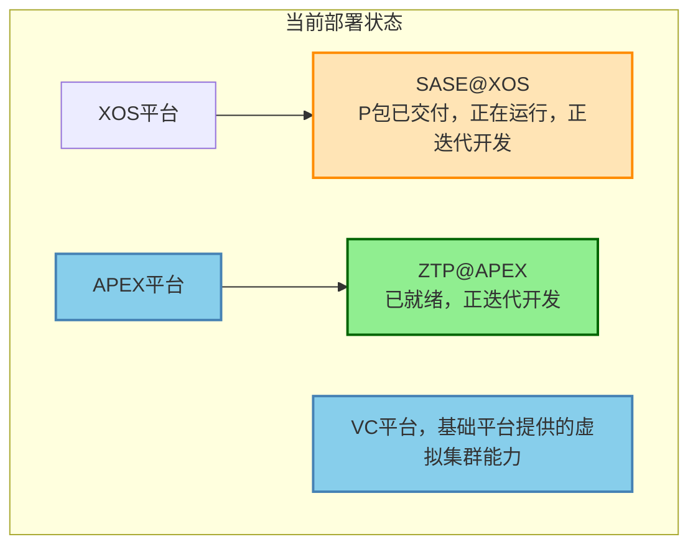
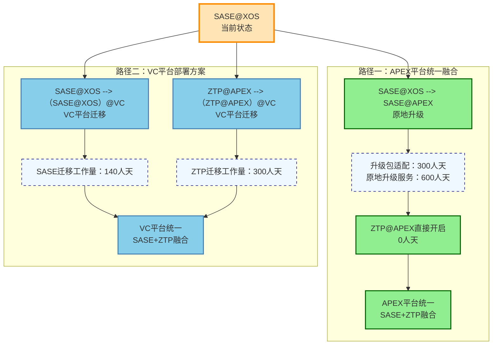
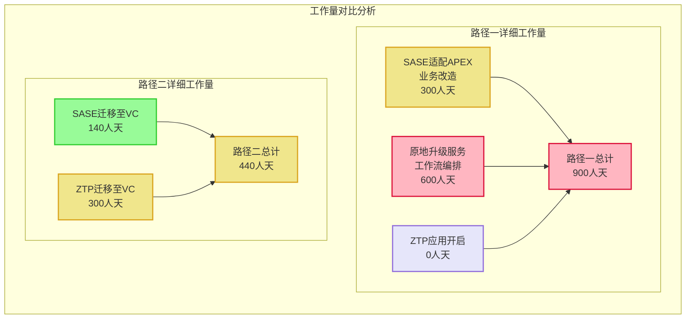
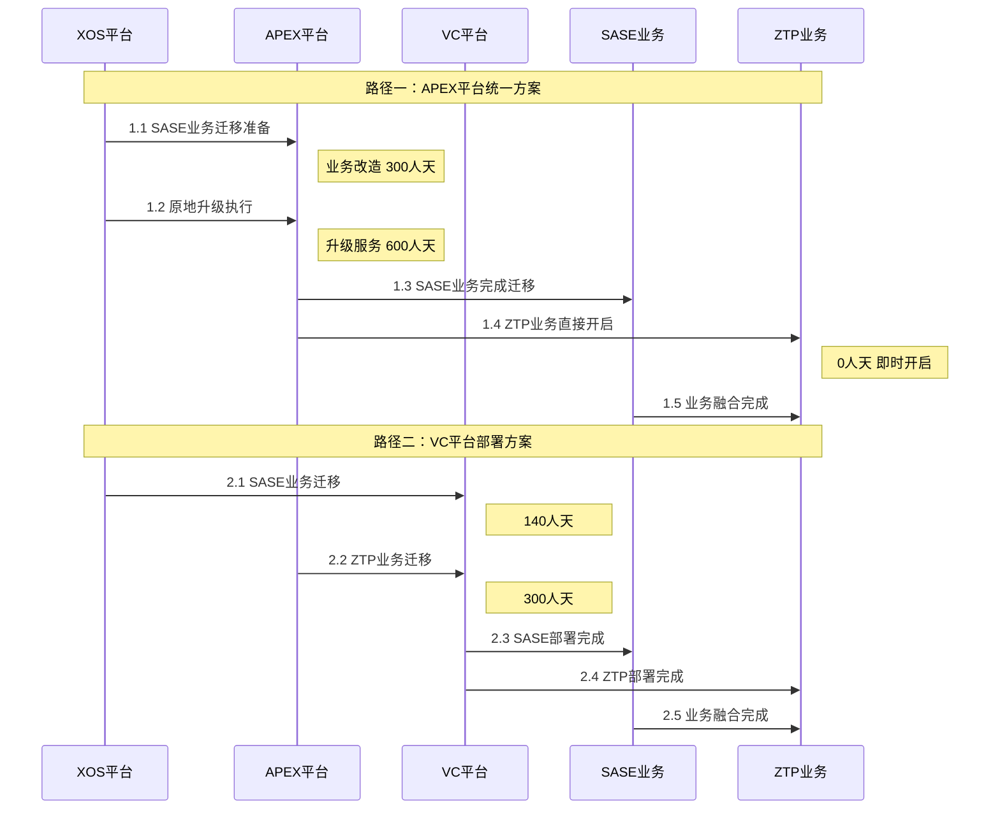

# SASE和ZTP业务融合平台升级路径分析

本文档通过可视化图表分析SASE和ZTP业务在不同平台间的融合升级路径，重点展示两种主要的迁移策略及其工作量对比。

## 当前业务部署状态

首先展示当前业务在各平台的部署现状：

当前状态显示SASE业务部署在XOS平台，而ZTP业务已在APEX平台就绪，形成了业务分散部署的现状。

## 业务融合升级路径对比

针对SASE和ZTP业务融合需求，存在两条可行的升级路径：

## 详细工作量分解分析

为了更清晰地展示各路径的工作量构成，以下图表详细分析了每个升级步骤的工作内容：

## 升级时序流程分析

以下时序图展示了两种路径的具体执行时序和关键节点：

## 路径选择建议与风险分析

通过上述图表分析，可以得出以下关键结论：

**路径一 APEX统一方案**的优势在于最终实现了在单一APEX平台上的完整业务融合，ZTP业务无需额外迁移工作。但其总工作量较高（900人天），主要集中在原地升级服务的复杂性上。

**路径二 VC平台方案**的优势在于总工作量相对较少（440人天），迁移风险相对可控。但需要同时处理两个业务的平台迁移，协调复杂度较高。

基于工作量和风险平衡考虑，建议优先考虑路径二，同时制定详细的迁移时序规划，确保SASE和ZTP业务的平滑过渡和最终融合。
