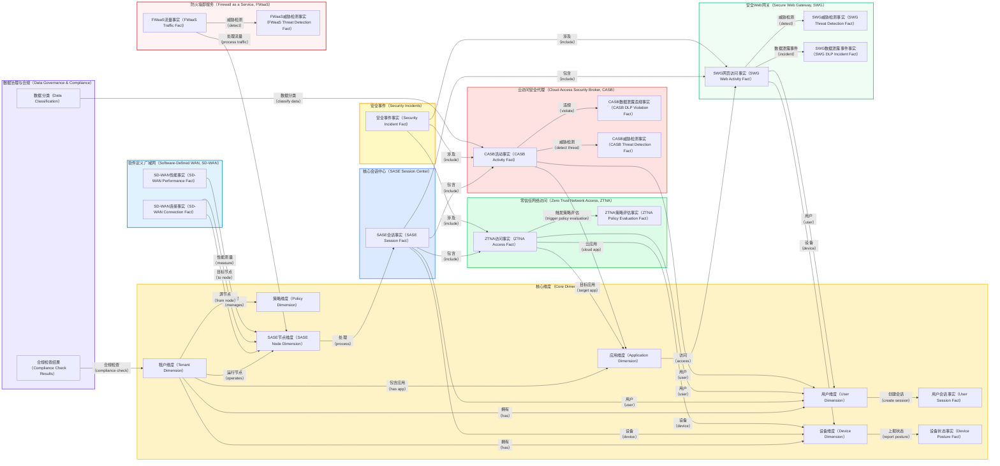

根据搜索结果，SASE架构包含SD-WAN、SWG（安全网关）、CASB（云访问安全代理）、ZTNA（零信任网络访问）、FWaaS（防火墙即服务）等核心组件。

## SASE和相关安全产品完整数据库设计（参考）

### 1. 整体实体关系图



### 2. SASE核心维度表详细定义

#### 2.1 SASE节点维度表

```sql
-- 文件名: 010_sase_dimensions.sql

-- SASE服务节点维度表
CREATE TABLE IF NOT EXISTS sase_node_dim (
    node_id String,
    tenant_id String,
    node_name String,
    node_type LowCardinality(String), -- POP, EDGE, GATEWAY, REGIONAL_HUB
    service_capabilities Array(String), -- ['ZTNA', 'CASB', 'SWG', 'SD-WAN', 'FWaaS']
    
    -- 地理位置信息
    region String, -- Americas, EMEA, APAC
    country String,
    city String,
    data_center_provider String,
    geographic_coordinates Tuple(Float64, Float64), -- (latitude, longitude)
    
    -- 网络信息
    node_ip_ranges Array(String), -- CIDR blocks
    autonomous_system_number UInt32,
    bandwidth_capacity_gbps Float32,
    
    -- 服务配置
    ssl_inspection_enabled Boolean DEFAULT false,
    threat_intelligence_feeds Array(String),
    compliance_certifications Array(String), -- ['SOC2', 'ISO27001', 'GDPR']
    
    -- 状态信息
    operational_status LowCardinality(String) DEFAULT 'ACTIVE', -- ACTIVE, MAINTENANCE, OFFLINE
    last_health_check DateTime,
    node_version String,
    
    -- 容量规划
    max_concurrent_sessions UInt32,
    max_throughput_mbps UInt32,
    cpu_cores UInt16,
    memory_gb UInt16,
    
    -- 审计字段
    created_at DateTime DEFAULT now(),
    updated_at DateTime DEFAULT now(),
    is_active Boolean DEFAULT true
    
) ENGINE = ReplacingMergeTree(updated_at)
PARTITION BY tenant_id
ORDER BY (tenant_id, node_id)
SETTINGS index_granularity = 8192;

-- SASE节点索引
ALTER TABLE sase_node_dim ADD INDEX idx_node_region (region) TYPE set(50) GRANULARITY 1;
ALTER TABLE sase_node_dim ADD INDEX idx_node_capabilities (service_capabilities) TYPE bloom_filter GRANULARITY 1;
ALTER TABLE sase_node_dim ADD INDEX idx_node_status (operational_status) TYPE set(10) GRANULARITY 1;

-- 应用维度表 (扩展云应用支持)
CREATE TABLE IF NOT EXISTS application_dim (
    application_id String,
    tenant_id String,
    application_name String,
    application_type LowCardinality(String), -- SAAS, PRIVATE_APP, WEB_APP, CLOUD_NATIVE
    
    -- 云应用特定信息
    cloud_provider LowCardinality(String), -- AWS, AZURE, GCP, OFFICE365, SALESFORCE
    application_category LowCardinality(String), -- PRODUCTIVITY, CRM, ERP, DEVELOPMENT, STORAGE
    saas_vendor String,
    
    -- 应用特征
    application_urls Array(String),
    ip_ranges Array(String),
    domain_names Array(String),
    port_ranges Array(String),
    
    -- 安全分类
    data_classification LowCardinality(String), -- PUBLIC, INTERNAL, CONFIDENTIAL, RESTRICTED
    compliance_requirements Array(String), -- ['HIPAA', 'PCI', 'GDPR']
    risk_score Float32, -- 0.0-1.0
    
    -- CASB特定字段
    casb_connector_type LowCardinality(String), -- API, PROXY, LOG, INLINE
    api_integration_status LowCardinality(String), -- CONNECTED, PARTIAL, DISCONNECTED
    supported_activities Array(String), -- ['LOGIN', 'DOWNLOAD', 'UPLOAD', 'SHARE', 'DELETE']
    
    -- 访问控制
    requires_mfa Boolean DEFAULT false,
    allowed_countries Array(String),
    blocked_countries Array(String),
    business_hours_only Boolean DEFAULT false,
    
    created_at DateTime DEFAULT now(),
    updated_at DateTime DEFAULT now(),
    is_active Boolean DEFAULT true
    
) ENGINE = ReplacingMergeTree(updated_at)
PARTITION BY tenant_id  
ORDER BY (tenant_id, application_id)
SETTINGS index_granularity = 8192;

-- 应用维度索引
ALTER TABLE application_dim ADD INDEX idx_app_type (application_type) TYPE set(20) GRANULARITY 1;
ALTER TABLE application_dim ADD INDEX idx_app_provider (cloud_provider) TYPE set(50) GRANULARITY 1;
ALTER TABLE application_dim ADD INDEX idx_app_category (application_category) TYPE set(30) GRANULARITY 1;
ALTER TABLE application_dim ADD INDEX idx_app_risk (risk_score) TYPE minmax GRANULARITY 1;

-- 策略维度表 (Zero Trust策略)
CREATE TABLE IF NOT EXISTS policy_dim (
    policy_id String,
    tenant_id String,
    policy_name String,
    policy_type LowCardinality(String), -- ZTNA, CASB, SWG, FIREWALL, DLP
    policy_category LowCardinality(String), -- ACCESS_CONTROL, DATA_PROTECTION, THREAT_PREVENTION
    
    -- 策略定义
    policy_description String,
    policy_rules String, -- JSON格式的规则定义
    policy_action LowCardinality(String), -- ALLOW, DENY, WARN, QUARANTINE, ENCRYPT
    
    -- 适用范围
    applies_to_users Array(String), -- User groups or individual users
    applies_to_devices Array(String), -- Device types or specific devices
    applies_to_applications Array(String), -- Application IDs
    applies_to_locations Array(String), -- Geographic locations
    
    -- 条件设置
    time_restrictions String, -- JSON格式的时间限制
    device_requirements String, -- JSON格式的设备要求
    location_requirements String, -- JSON格式的位置要求
    risk_threshold Float32, -- Risk score threshold
    
    -- Zero Trust特定
    trust_verification_level LowCardinality(String), -- LOW, MEDIUM, HIGH, CONTINUOUS
    authentication_requirements Array(String), -- ['MFA', 'DEVICE_CERT', 'BIOMETRIC']
    session_monitoring_enabled Boolean DEFAULT true,
    
    -- 策略状态
    policy_status LowCardinality(String) DEFAULT 'ACTIVE', -- ACTIVE, INACTIVE, TESTING
    enforcement_mode LowCardinality(String) DEFAULT 'ENFORCING', -- MONITORING, ENFORCING
    priority UInt16 DEFAULT 100, -- 优先级 (1-1000, 1最高)
    
    -- 版本控制
    policy_version String,
    parent_policy_id Nullable(String), -- For policy inheritance
    
    created_at DateTime DEFAULT now(),
    updated_at DateTime DEFAULT now(),
    created_by String,
    is_active Boolean DEFAULT true
    
) ENGINE = ReplacingMergeTree(updated_at)
PARTITION BY tenant_id
ORDER BY (tenant_id, policy_type, priority)
SETTINGS index_granularity = 8192;

-- 策略维度索引
ALTER TABLE policy_dim ADD INDEX idx_policy_type (policy_type) TYPE set(20) GRANULARITY 1;
ALTER TABLE policy_dim ADD INDEX idx_policy_status (policy_status) TYPE set(10) GRANULARITY 1;
ALTER TABLE policy_dim ADD INDEX idx_policy_priority (priority) TYPE minmax GRANULARITY 1;
```

### 3. SASE核心事实表详细定义

#### 3.1 SASE会话事实表

```sql
-- 文件名: 011_sase_fact_tables.sql

-- SASE统一会话事实表
CREATE TABLE IF NOT EXISTS sase_session_fact (
    session_id String,
    tenant_id String,
    
    -- 时间维度
    session_start_time DateTime,
    session_end_time Nullable(DateTime),
    event_timestamp DateTime,
    session_duration_seconds Nullable(UInt32),
    
    -- 用户和设备维度
    user_id String,
    device_id String,
    
    -- SASE节点信息
    entry_node_id String, -- 用户接入的SASE节点
    exit_node_id Nullable(String), -- 流量出口的SASE节点
    processing_nodes Array(String), -- 处理路径上的所有节点
    
    -- 会话分类
    session_type LowCardinality(String), -- ZTNA, CASB, SWG, SD_WAN, HYBRID
    primary_service LowCardinality(String), -- 主要使用的服务类型
    
    -- 网络信息
    client_ip String,
    client_country String,
    client_asn UInt32,
    server_ip Nullable(String),
    server_country Nullable(String),
    
    -- 安全上下文
    initial_trust_score Float32, -- 会话开始时的信任分数
    final_trust_score Nullable(Float32), -- 会话结束时的信任分数
    risk_level LowCardinality(String), -- LOW, MEDIUM, HIGH, CRITICAL
    
    -- 认证信息
    authentication_method Array(String), -- ['PASSWORD', 'MFA', 'CERT', 'SSO']
    authentication_result LowCardinality(String), -- SUCCESS, FAILED, PARTIAL
    mfa_methods Array(String), -- ['SMS', 'TOTP', 'PUSH', 'BIOMETRIC']
    
    -- 设备安全态势
    device_compliance_status LowCardinality(String), -- COMPLIANT, NON_COMPLIANT, UNKNOWN
    device_trust_level LowCardinality(String), -- TRUSTED, UNTRUSTED, CONDITIONAL
    endpoint_protection_status LowCardinality(String), -- ACTIVE, INACTIVE, OUTDATED
    
    -- 会话质量指标
    bandwidth_consumed_bytes UInt64 DEFAULT 0,
    latency_ms Array(UInt16), -- 延迟测量值数组
    packet_loss_rate Float32 DEFAULT 0.0,
    connection_quality_score Float32, -- 0.0-1.0
    
    -- 安全检测结果
    threats_detected UInt16 DEFAULT 0,
    policies_violated UInt16 DEFAULT 0,
    dlp_violations UInt16 DEFAULT 0,
    malware_detected Boolean DEFAULT false,
    anomalies_detected UInt16 DEFAULT 0,
    
    -- 会话结果
    session_outcome LowCardinality(String), -- COMPLETED, TERMINATED, TIMEOUT, ERROR
    termination_reason LowCardinality(String), -- USER_LOGOUT, POLICY_VIOLATION, TIMEOUT, ERROR
    
    -- 原始数据保留
    raw_session_data String, -- 原始会话日志的JSON格式
    
    created_at DateTime DEFAULT now()
    
) ENGINE = MergeTree()
PARTITION BY (tenant_id, toYYYYMM(session_start_time))
ORDER BY (tenant_id, session_start_time, session_id)
SETTINGS index_granularity = 8192;

-- SASE会话表索引
ALTER TABLE sase_session_fact ADD INDEX idx_session_user (user_id) TYPE bloom_filter GRANULARITY 1;
ALTER TABLE sase_session_fact ADD INDEX idx_session_device (device_id) TYPE bloom_filter GRANULARITY 1;
ALTER TABLE sase_session_fact ADD INDEX idx_session_type (session_type) TYPE set(10) GRANULARITY 1;
ALTER TABLE sase_session_fact ADD INDEX idx_session_risk (risk_level) TYPE set(5) GRANULARITY 1;
ALTER TABLE sase_session_fact ADD INDEX idx_session_trust (initial_trust_score) TYPE minmax GRANULARITY 1;
ALTER TABLE sase_session_fact ADD INDEX idx_session_entry_node (entry_node_id) TYPE bloom_filter GRANULARITY 1;
```

#### 3.2 ZTNA访问事实表

```sql
-- Zero Trust Network Access 访问事实表
CREATE TABLE IF NOT EXISTS ztna_access_fact (
    access_id String,
    tenant_id String,
    
    -- 关联会话
    session_id String,
    
    -- 时间维度
    access_timestamp DateTime,
    access_duration_seconds Nullable(UInt32),
    
    -- 访问主体
    user_id String,
    device_id String,
    
    -- 访问目标
    application_id String,
    resource_type LowCardinality(String), -- APPLICATION, API, DATABASE, FILE_SHARE
    resource_name String,
    resource_path Nullable(String),
    
    -- 访问请求详情
    access_method LowCardinality(String), -- HTTPS, RDP, SSH, DATABASE_CONNECTION
    requested_action LowCardinality(String), -- READ, WRITE, EXECUTE, DELETE, ADMIN
    access_protocol String, -- HTTP/HTTPS, RDP, SSH, etc.
    
    -- Zero Trust验证过程
    pre_auth_trust_score Float32,
    post_auth_trust_score Float32,
    continuous_verification Boolean DEFAULT false,
    
    -- 策略评估
    evaluated_policies Array(String), -- Policy IDs that were evaluated
    policy_decision LowCardinality(String), -- ALLOW, DENY, CONDITIONAL_ALLOW
    policy_enforcement_point String, -- Where the policy was enforced
    
    -- 条件检查结果
    device_posture_check LowCardinality(String), -- PASS, FAIL, WARNING
    location_check LowCardinality(String), -- PASS, FAIL, NOT_CHECKED
    time_check LowCardinality(String), -- PASS, FAIL, NOT_APPLICABLE
    risk_check LowCardinality(String), -- PASS, FAIL, WARNING
    
    -- 认证详情 
    authentication_strength LowCardinality(String), -- WEAK, MEDIUM, STRONG
    step_up_auth_required Boolean DEFAULT false,
    step_up_auth_completed Boolean DEFAULT false,
    certificate_used Boolean DEFAULT false,
    
    -- 网络信息
    client_ip String,
    entry_point_ip String, -- SASE entry point
    target_ip Nullable(String),
    connection_encrypted Boolean DEFAULT true,
    tls_version Nullable(String),
    
    -- 访问结果
    access_result LowCardinality(String), -- SUCCESS, DENIED, ERROR, TIMEOUT
    denial_reason Nullable(String),
    error_code Nullable(String),
    
    -- 数据传输统计
    bytes_uploaded UInt64 DEFAULT 0,
    bytes_downloaded UInt64 DEFAULT 0,
    files_accessed UInt32 DEFAULT 0,
    api_calls_made UInt32 DEFAULT 0,
    
    -- 安全监控
    suspicious_activity_detected Boolean DEFAULT false,
    privilege_escalation_attempted Boolean DEFAULT false,
    lateral_movement_detected Boolean DEFAULT false,
    
    -- 会话记录
    session_recorded Boolean DEFAULT false,
    recording_path Nullable(String),
    
    created_at DateTime DEFAULT now()
    
) ENGINE = MergeTree()
PARTITION BY (tenant_id, toYYYYMM(access_timestamp))
ORDER BY (tenant_id, access_timestamp, user_id, application_id)
SETTINGS index_granularity = 8192;

-- ZTNA访问表索引
ALTER TABLE ztna_access_fact ADD INDEX idx_ztna_user (user_id) TYPE bloom_filter GRANULARITY 1;
ALTER TABLE ztna_access_fact ADD INDEX idx_ztna_app (application_id) TYPE bloom_filter GRANULARITY 1;
ALTER TABLE ztna_access_fact ADD INDEX idx_ztna_result (access_result) TYPE set(10) GRANULARITY 1;
ALTER TABLE ztna_access_fact ADD INDEX idx_ztna_policy (policy_decision) TYPE set(5) GRANULARITY 1;
ALTER TABLE ztna_access_fact ADD INDEX idx_ztna_trust (pre_auth_trust_score) TYPE minmax GRANULARITY 1;
ALTER TABLE ztna_access_fact ADD INDEX idx_ztna_session (session_id) TYPE bloom_filter GRANULARITY 1;
```

#### 3.3 CASB活动事实表

```sql
-- Cloud Access Security Broker 活动事实表
CREATE TABLE IF NOT EXISTS casb_activity_fact (
    activity_id String,
    tenant_id String,
    
    -- 关联会话
    session_id String,
    
    -- 时间维度
    activity_timestamp DateTime,
    
    -- 活动主体
    user_id String,
    device_id String,
    
    -- 云应用信息
    application_id String,
    cloud_service LowCardinality(String), -- OFFICE365, SALESFORCE, BOX, DROPBOX, AWS, AZURE
    service_instance String, -- Specific instance or org
    
    -- 活动详情
    activity_type LowCardinality(String), -- LOGIN, LOGOUT, DOWNLOAD, UPLOAD, SHARE, DELETE, VIEW, EDIT
    activity_category LowCardinality(String), -- FILE_OPERATION, USER_MANAGEMENT, CONFIGURATION, DATA_ACCESS
    object_type LowCardinality(String), -- FILE, FOLDER, EMAIL, CONTACT, CALENDAR, DOCUMENT
    object_name String,
    object_path Nullable(String),
    object_size_bytes Nullable(UInt64),
    
    -- 文件和数据信息
    file_type Nullable(String), -- PDF, DOC, XLS, etc.
    mime_type Nullable(String),
    file_hash Nullable(String), -- SHA256 hash
    
    -- 共享和协作
    shared_with Array(String), -- Email addresses or user IDs
    sharing_permissions LowCardinality(String), -- READ, WRITE, ADMIN, PUBLIC
    external_sharing Boolean DEFAULT false,
    anonymous_sharing Boolean DEFAULT false,
    
    -- 位置信息
    client_ip String,
    geolocation String, -- Country/City
    access_method LowCardinality(String), -- WEB, MOBILE_APP, DESKTOP_APP, API
    user_agent String,
    
    -- 安全评估
    data_classification LowCardinality(String), -- PUBLIC, INTERNAL, CONFIDENTIAL, RESTRICTED
    sensitivity_labels Array(String), -- Microsoft/vendor sensitivity labels
    dlp_policy_matches Array(String), -- DLP policy IDs that matched
    
    -- 风险评估
    risk_score Float32, -- 0.0-1.0
    risk_factors Array(String), -- ['EXTERNAL_SHARING', 'BULK_DOWNLOAD', 'UNUSUAL_LOCATION']
    anomaly_score Float32, -- 0.0-1.0
    
    -- 威胁检测
    malware_detected Boolean DEFAULT false,
    malware_name Nullable(String),
    threat_intelligence_match Boolean DEFAULT false,
    threat_categories Array(String), -- ['MALWARE', 'PHISHING', 'SUSPICIOUS_DOMAIN']
    
    -- 策略执行
    policy_action LowCardinality(String), -- ALLOW, BLOCK, WARN, QUARANTINE, ENCRYPT
    policy_violations Array(String), -- Policy IDs that were violated
    quarantine_applied Boolean DEFAULT false,
    encryption_applied Boolean DEFAULT false,
    
    -- 合规性
    compliance_violations Array(String), -- ['GDPR_VIOLATION', 'HIPAA_VIOLATION']
    retention_applied Boolean DEFAULT false,
    legal_hold_applied Boolean DEFAULT false,
    
    -- API特定信息
    api_endpoint Nullable(String),
    api_method Nullable(String), -- GET, POST, PUT, DELETE
    response_code Nullable(UInt16),
    
    -- 活动结果
    activity_result LowCardinality(String), -- SUCCESS, BLOCKED, WARNING, ERROR
    block_reason Nullable(String),
    
    -- 原始数据
    raw_activity_log String, -- Original log in JSON format
    
    created_at DateTime DEFAULT now()
    
) ENGINE = MergeTree()
PARTITION BY (tenant_id, toYYYYMM(activity_timestamp))
ORDER BY (tenant_id, activity_timestamp, user_id, application_id)
SETTINGS index_granularity = 8192;

-- CASB活动表索引
ALTER TABLE casb_activity_fact ADD INDEX idx_casb_user (user_id) TYPE bloom_filter GRANULARITY 1;
ALTER TABLE casb_activity_fact ADD INDEX idx_casb_app (application_id) TYPE bloom_filter GRANULARITY 1;
ALTER TABLE casb_activity_fact ADD INDEX idx_casb_activity (activity_type) TYPE set(50) GRANULARITY 1;
ALTER TABLE casb_activity_fact ADD INDEX idx_casb_service (cloud_service) TYPE set(100) GRANULARITY 1;
ALTER TABLE casb_activity_fact ADD INDEX idx_casb_risk (risk_score) TYPE minmax GRANULARITY 1;
ALTER TABLE casb_activity_fact ADD INDEX idx_casb_result (activity_result) TYPE set(10) GRANULARITY 1;
ALTER TABLE casb_activity_fact ADD INDEX idx_casb_classification (data_classification) TYPE set(10) GRANULARITY 1;
```

#### 3.4 SWG网页活动事实表

```sql
-- Secure Web Gateway 网页活动事实表
CREATE TABLE IF NOT EXISTS swg_web_activity_fact (
    activity_id String,
    tenant_id String,
    
    -- 关联会话
    session_id String,
    
    -- 时间维度
    request_timestamp DateTime,
    response_timestamp Nullable(DateTime),
    
    -- 用户和设备
    user_id String,
    device_id String,
    
    -- HTTP请求详情
    http_method LowCardinality(String), -- GET, POST, PUT, DELETE
    url String,
    domain String,
    path String,
    query_params String,
    referrer Nullable(String),
    user_agent String,
    
    -- 网络信息
    client_ip String,
    server_ip String,
    server_port UInt16,
    protocol_version String, -- HTTP/1.1, HTTP/2
    
    -- SSL/TLS信息
    ssl_used Boolean DEFAULT false,
    ssl_version Nullable(String),
    certificate_valid Boolean DEFAULT true,
    certificate_issuer Nullable(String),
    
    -- 内容分析
    content_type String,
    content_length UInt64 DEFAULT 0,
    content_category Array(String), -- ['SOCIAL_MEDIA', 'NEWS', 'BUSINESS', 'ADULT', 'MALWARE']
    
    -- 文件信息
    file_type Nullable(String),
    file_hash Nullable(String),
    file_reputation LowCardinality(String), -- CLEAN, SUSPICIOUS, MALICIOUS, UNKNOWN
    
    -- 威胁检测
    threat_detected Boolean DEFAULT false,
    threat_types Array(String), -- ['MALWARE', 'PHISHING', 'C2', 'EXPLOIT_KIT']
    threat_intelligence_sources Array(String),
    malware_family Nullable(String),
    
    -- URL分析
    url_reputation LowCardinality(String), -- GOOD, SUSPICIOUS, MALICIOUS, UNKNOWN
    domain_age_days Nullable(UInt32),
    domain_reputation_score Float32,
    newly_registered_domain Boolean DEFAULT false,
    
    -- 策略评估
    policy_action LowCardinality(String), -- ALLOW, BLOCK, WARN, SCAN
    policy_categories Array(String), -- Policy categories that matched
    block_category LowCardinality(String), -- MALWARE, ADULT_CONTENT, SOCIAL_MEDIA, etc.
    
    -- DLP检测
    dlp_incident Boolean DEFAULT false,
    dlp_policy_matches Array(String),
    sensitive_data_types Array(String), -- ['SSN', 'CREDIT_CARD', 'EMAIL']
    
    -- 沙箱分析
    sandboxed Boolean DEFAULT false,
    sandbox_verdict LowCardinality(String), -- CLEAN, SUSPICIOUS, MALICIOUS
    sandbox_analysis_time UInt32 DEFAULT 0,
    
    -- 响应信息
    http_status_code UInt16,
    response_size_bytes UInt64 DEFAULT 0,
    processing_time_ms UInt32,
    
    -- 带宽和性能
    bytes_downloaded UInt64 DEFAULT 0,
    bytes_uploaded UInt64 DEFAULT 0,
    connection_time_ms UInt32,
    dns_lookup_time_ms UInt32,
    
    -- 缓存信息
    cache_hit Boolean DEFAULT false,
    cached_response Boolean DEFAULT false,
    
    -- 地理位置
    server_country String,
    server_region String,
    client_country String,
    
    -- 最终动作
    final_action LowCardinality(String), -- ALLOWED, BLOCKED, WARNED, QUARANTINED
    block_reason Nullable(String),
    warning_message Nullable(String),
    
    -- 原始数据
    raw_request_headers String,
    raw_response_headers String,
    
    created_at DateTime DEFAULT now()
    
) ENGINE = MergeTree()
PARTITION BY (tenant_id, toYYYYMM(request_timestamp))
ORDER BY (tenant_id, request_timestamp, user_id, domain)
SETTINGS index_granularity = 8192;

-- SWG网页活动表索引
ALTER TABLE swg_web_activity_fact ADD INDEX idx_swg_action (final_action) TYPE set(10) GRANULARITY 1;
ALTER TABLE swg_web_activity_fact ADD INDEX idx_swg_threat (threat_detected) TYPE set(2) GRANULARITY 1;
ALTER TABLE swg_web_activity_fact ADD INDEX idx_swg_category (content_category) TYPE bloom_filter GRANULARITY 1;
ALTER TABLE swg_web_activity_fact ADD INDEX idx_swg_status (http_status_code) TYPE set(100) GRANULARITY 1;
ALTER TABLE swg_web_activity_fact ADD INDEX idx_swg_ssl (ssl_used) TYPE set(2) GRANULARITY 1;
```

#### 3.5 SD-WAN连接事实表

```sql
-- SD-WAN 连接和性能事实表
CREATE TABLE IF NOT EXISTS sdwan_connection_fact (
    connection_id String,
    tenant_id String,
    
    -- 时间维度
    connection_start_time DateTime,
    connection_end_time Nullable(DateTime),
    measurement_timestamp DateTime,
    connection_duration_seconds Nullable(UInt32),
    
    -- 网络路径
    source_node_id String,
    destination_node_id String,
    path_type LowCardinality(String), -- PRIMARY, BACKUP, LOAD_BALANCED
    transport_type LowCardinality(String), -- MPLS, INTERNET, LTE, SATELLITE
    
    -- 连接质量指标
    latency_ms Float32,
    jitter_ms Float32,
    packet_loss_percent Float32,
    bandwidth_utilization_percent Float32,
    
    -- 流量统计
    bytes_transmitted UInt64,
    bytes_received UInt64,
    packets_transmitted UInt64,
    packets_received UInt64,
    packets_dropped UInt32,
    
    -- 应用性能
    application_flows UInt32, -- Number of concurrent application flows
    voice_quality_mos Float32, -- Mean Opinion Score for voice traffic
    video_quality_score Float32,
    
    -- 路径选择
    path_selection_reason LowCardinality(String), -- POLICY, PERFORMANCE, FAILOVER
    load_balancing_algorithm LowCardinality(String), -- ROUND_ROBIN, WEIGHTED, PERFORMANCE
    
    -- QoS信息
    dscp_markings Array(UInt8),
    traffic_classes Array(String), -- ['VOICE', 'VIDEO', 'DATA', 'BACKGROUND']
    priority_queues Array(String),
    
    -- 安全隧道
    tunnel_established Boolean DEFAULT false,
    encryption_protocol LowCardinality(String), -- IPSEC, TLS, PROPRIETARY
    tunnel_overhead_bytes UInt32,
    
    -- 故障和恢复
    connection_failures UInt16 DEFAULT 0,
    recovery_time_ms Nullable(UInt32),
    failover_triggered Boolean DEFAULT false,
    failover_reason Nullable(String),
    
    -- 成本优化
    link_cost_per_mb Float32,
    data_usage_cost Float32,
    
    created_at DateTime DEFAULT now()
    
) ENGINE = MergeTree()
PARTITION BY (tenant_id, toYYYYMM(measurement_timestamp))
ORDER BY (tenant_id, measurement_timestamp, source_node_id, destination_node_id)
SETTINGS index_granularity = 8192;

-- SD-WAN表索引
ALTER TABLE sdwan_connection_fact ADD INDEX idx_sdwan_source (source_node_id) TYPE bloom_filter GRANULARITY 1;
ALTER TABLE sdwan_connection_fact ADD INDEX idx_sdwan_dest (destination_node_id) TYPE bloom_filter GRANULARITY 1;
ALTER TABLE sdwan_connection_fact ADD INDEX idx_sdwan_transport (transport_type) TYPE set(10) GRANULARITY 1;
ALTER TABLE sdwan_connection_fact ADD INDEX idx_sdwan_latency (latency_ms) TYPE minmax GRANULARITY 1;
ALTER TABLE sdwan_connection_fact ADD INDEX idx_sdwan_loss (packet_loss_percent) TYPE minmax GRANULARITY 1;
```

#### 3.6 FWaaS防火墙事实表

```sql
-- Firewall as a Service 防火墙事实表
CREATE TABLE IF NOT EXISTS fwaas_traffic_fact (
    traffic_id String,
    tenant_id String,
    
    -- 时间维度
    event_timestamp DateTime,
    
    -- 网络五元组
    source_ip String,
    destination_ip String,
    source_port UInt16,
    destination_port UInt16,
    protocol LowCardinality(String), -- TCP, UDP, ICMP
    
    -- 处理节点
    processing_node_id String,
    firewall_instance_id String,
    
    -- 流量方向和分类
    traffic_direction LowCardinality(String), -- INBOUND, OUTBOUND, INTERNAL, EXTERNAL
    traffic_type LowCardinality(String), -- NEW_CONNECTION, ESTABLISHED, RELATED
    connection_state LowCardinality(String), -- SYN, SYN_ACK, ESTABLISHED, FIN, RST
    
    -- 地理位置
    source_country String,
    destination_country String,
    source_asn UInt32,
    destination_asn UInt32,
    
    -- 用户上下文（如果可用）
    user_id Nullable(String),
    device_id Nullable(String),
    application_id Nullable(String),
    
    -- 策略匹配
    matched_rule_id String,
    rule_name String,
    rule_action LowCardinality(String), -- ALLOW, DENY, DROP, REJECT
    rule_priority UInt16,
    
    -- 流量统计
    bytes_sent UInt64,
    bytes_received UInt64,
    packets_sent UInt32,
    packets_received UInt32,
    session_duration_seconds Nullable(UInt32),
    
    -- 应用识别
    application_name Nullable(String),
    application_category Nullable(String),
    application_risk_level LowCardinality(String), -- LOW, MEDIUM, HIGH, CRITICAL
    application_protocol Nullable(String), -- HTTP, HTTPS, FTP, SSH, etc.
    
    -- SSL/TLS检查
    ssl_inspection_performed Boolean DEFAULT false,
    ssl_version Nullable(String),
    certificate_subject Nullable(String),
    certificate_issuer Nullable(String),
    certificate_valid Boolean DEFAULT true,
    
    -- 威胁检测
    threat_detected Boolean DEFAULT false,
    threat_signature_id Nullable(String),
    threat_signature_name Nullable(String),
    threat_severity LowCardinality(String), -- LOW, MEDIUM, HIGH, CRITICAL
    threat_category Array(String), -- ['MALWARE', 'BOTNET', 'EXPLOIT', 'RECONNAISSANCE']
    
    -- IPS/IDS检测
    intrusion_detected Boolean DEFAULT false,
    attack_type Array(String),
    cve_references Array(String),
    
    -- 恶意域名/IP检测
    malicious_domain_detected Boolean DEFAULT false,
    threat_intelligence_match Boolean DEFAULT false,
    reputation_score Float32, -- 0.0-1.0 (0=malicious, 1=clean)
    
    -- NAT信息
    nat_applied Boolean DEFAULT false,
    pre_nat_source_ip Nullable(String),
    pre_nat_destination_ip Nullable(String),
    post_nat_source_ip Nullable(String),
    post_nat_destination_ip Nullable(String),
    
    -- QoS和带宽控制
    qos_class Nullable(String),
    bandwidth_limit_applied Boolean DEFAULT false,
    rate_limited Boolean DEFAULT false,
    
    -- 会话信息
    session_id Nullable(String),
    connection_established Boolean DEFAULT false,
    connection_terminated_by LowCardinality(String), -- CLIENT, SERVER, FIREWALL, TIMEOUT
    
    -- 日志详细度
    log_level LowCardinality(String) DEFAULT 'INFO', -- DEBUG, INFO, WARN, ERROR
    
    created_at DateTime DEFAULT now()
    
) ENGINE = MergeTree()
PARTITION BY (tenant_id, toYYYYMM(event_timestamp))
ORDER BY (tenant_id, event_timestamp, source_ip, destination_ip)
SETTINGS index_granularity = 8192;

-- FWaaS表索引
ALTER TABLE fwaas_traffic_fact ADD INDEX idx_fwaas_src_ip (source_ip) TYPE bloom_filter GRANULARITY 1;
ALTER TABLE fwaas_traffic_fact ADD INDEX idx_fwaas_dst_ip (destination_ip) TYPE bloom_filter GRANULARITY 1;
ALTER TABLE fwaas_traffic_fact ADD INDEX idx_fwaas_action (rule_action) TYPE set(10) GRANULARITY 1;
ALTER TABLE fwaas_traffic_fact ADD INDEX idx_fwaas_threat (threat_detected) TYPE set(2) GRANULARITY 1;
ALTER TABLE fwaas_traffic_fact ADD INDEX idx_fwaas_protocol (protocol) TYPE set(20) GRANULARITY 1;
ALTER TABLE fwaas_traffic_fact ADD INDEX idx_fwaas_app (application_name) TYPE bloom_filter GRANULARITY 1;
ALTER TABLE fwaas_traffic_fact ADD INDEX idx_fwaas_node (processing_node_id) TYPE bloom_filter GRANULARITY 1;
```

### 4. SASE安全增强表

#### 4.1 威胁检测汇总表

```sql
-- 文件名: 012_sase_security_tables.sql

-- SASE威胁检测汇总表
CREATE TABLE IF NOT EXISTS sase_threat_detection_fact (
    detection_id String,
    tenant_id String,
    
    -- 时间维度
    detection_timestamp DateTime,
    
    -- 威胁分类
    threat_type LowCardinality(String), -- MALWARE, PHISHING, C2, EXPLOIT, ANOMALY
    threat_category LowCardinality(String), -- NETWORK, WEB, EMAIL, FILE, BEHAVIOR
    threat_severity LowCardinality(String), -- LOW, MEDIUM, HIGH, CRITICAL
    confidence_score Float32, -- 0.0-1.0
    
    -- 检测源
    detection_service LowCardinality(String), -- ZTNA, CASB, SWG, FWAAS
    detection_node_id String,
    detection_method LowCardinality(String), -- SIGNATURE, HEURISTIC, BEHAVIORAL, ML
    
    -- 威胁详情
    threat_name String,
    threat_signature_id Nullable(String),
    ioc_type LowCardinality(String), -- IP, DOMAIN, URL, HASH, EMAIL
    ioc_value String,
    
    -- 影响范围
    affected_users Array(String),
    affected_devices Array(String),
    affected_applications Array(String),
    affected_sessions Array(String),
    
    -- 攻击向量
    attack_vector LowCardinality(String), -- EMAIL, WEB, NETWORK, APPLICATION
    attack_stage LowCardinality(String), -- RECONNAISSANCE, INITIAL_ACCESS, EXECUTION, PERSISTENCE
    mitre_tactics Array(String), -- MITRE ATT&CK Tactics
    mitre_techniques Array(String), -- MITRE ATT&CK Techniques
    
    -- 威胁情报
    threat_actor Nullable(String),
    campaign_name Nullable(String),
    threat_intelligence_sources Array(String),
    first_seen_timestamp Nullable(DateTime),
    last_seen_timestamp Nullable(DateTime),
    
    -- 响应动作
    automated_response Boolean DEFAULT false,
    response_actions Array(String), -- ['BLOCKED', 'QUARANTINED', 'ALERTED']
    containment_applied Boolean DEFAULT false,
    
    -- 误报管理
    false_positive Boolean DEFAULT false,
    false_positive_reason Nullable(String),
    analyst_verified Boolean DEFAULT false,
    
    -- 关联事件
    related_detections Array(String),
    parent_incident_id Nullable(String),
    
    created_at DateTime DEFAULT now()
    
) ENGINE = MergeTree()
PARTITION BY (tenant_id, toYYYYMM(detection_timestamp))
ORDER BY (tenant_id, detection_timestamp, threat_severity)
SETTINGS index_granularity = 8192;

-- 威胁检测表索引
ALTER TABLE sase_threat_detection_fact ADD INDEX idx_threat_type (threat_type) TYPE set(20) GRANULARITY 1;
ALTER TABLE sase_threat_detection_fact ADD INDEX idx_threat_severity (threat_severity) TYPE set(5) GRANULARITY 1;
ALTER TABLE sase_threat_detection_fact ADD INDEX idx_threat_service (detection_service) TYPE set(10) GRANULARITY 1;
ALTER TABLE sase_threat_detection_fact ADD INDEX idx_threat_ioc (ioc_value) TYPE bloom_filter GRANULARITY 1;
ALTER TABLE sase_threat_detection_fact ADD INDEX idx_threat_confidence (confidence_score) TYPE minmax GRANULARITY 1;
```

#### 4.2 DLP违规事件表

```sql
-- Data Loss Prevention 违规事件表
CREATE TABLE IF NOT EXISTS sase_dlp_violation_fact (
    violation_id String,
    tenant_id String,
    
    -- 时间维度
    violation_timestamp DateTime,
    
    -- 检测源
    detection_service LowCardinality(String), -- CASB, SWG, EMAIL_SECURITY
    detection_node_id String,
    
    -- 用户和设备
    user_id String,
    device_id String,
    
    -- 数据分类
    data_classification LowCardinality(String), -- PUBLIC, INTERNAL, CONFIDENTIAL, RESTRICTED
    sensitivity_level LowCardinality(String), -- LOW, MEDIUM, HIGH, CRITICAL
    data_categories Array(String), -- ['PII', 'PHI', 'PCI', 'IP', 'FINANCIAL']
    
    -- 违规详情
    policy_id String,
    policy_name String,
    violation_type LowCardinality(String), -- UPLOAD, DOWNLOAD, EMAIL, SHARE, PRINT
    
    -- 数据识别
    detected_patterns Array(String), -- Regex patterns that matched
    pattern_confidence Float32,
    data_identifiers Array(String), -- ['SSN', 'CREDIT_CARD', 'PASSPORT']
    match_count UInt16, -- Number of sensitive data matches
    
    -- 文件信息
    file_name Nullable(String),
    file_type Nullable(String),
    file_size_bytes Nullable(UInt64),
    file_hash Nullable(String),
    
    -- 传输详情
    source_application Nullable(String),
    destination_application Nullable(String),
    transmission_method LowCardinality(String), -- EMAIL, UPLOAD, DOWNLOAD, SHARE
    
    -- 收件人信息（如果适用）
    internal_recipients Array(String),
    external_recipients Array(String),
    public_sharing Boolean DEFAULT false,
    
    -- 违规严重性
    violation_severity LowCardinality(String), -- LOW, MEDIUM, HIGH, CRITICAL
    risk_score Float32, -- 0.0-1.0
    business_impact LowCardinality(String), -- LOW, MEDIUM, HIGH, CRITICAL
    
    -- 响应动作
    policy_action LowCardinality(String), -- ALLOW, BLOCK, WARN, QUARANTINE, ENCRYPT
    action_taken Array(String), -- ['BLOCKED', 'ENCRYPTED', 'NOTIFIED_ADMIN']
    quarantine_location Nullable(String),
    
    -- 加密和保护
    encryption_applied Boolean DEFAULT false,
    encryption_method Nullable(String),
    rights_management_applied Boolean DEFAULT false,
    
    -- 通知和工作流
    user_notified Boolean DEFAULT false,
    admin_notified Boolean DEFAULT false,
    manager_notified Boolean DEFAULT false,
    workflow_triggered Boolean DEFAULT false,
    ticket_created Nullable(String),
    
    -- 业务上下文
    business_justification Nullable(String),
    approved_override Boolean DEFAULT false,
    override_reason Nullable(String),
    override_approved_by Nullable(String),
    
    -- 补救状态
    remediation_required Boolean DEFAULT false,
    remediation_status LowCardinality(String), -- PENDING, IN_PROGRESS, COMPLETED
    remediation_steps String,
    
    -- 合规影响
    compliance_violations Array(String), -- ['GDPR', 'HIPAA', 'PCI_DSS']
    regulatory_notification_required Boolean DEFAULT false,
    
    created_at DateTime DEFAULT now()
    
) ENGINE = MergeTree()
PARTITION BY (tenant_id, toYYYYMM(violation_timestamp))
ORDER BY (tenant_id, violation_timestamp, violation_severity)
SETTINGS index_granularity = 8192;

-- DLP违规表索引
ALTER TABLE sase_dlp_violation_fact ADD INDEX idx_dlp_user (user_id) TYPE bloom_filter GRANULARITY 1;
ALTER TABLE sase_dlp_violation_fact ADD INDEX idx_dlp_policy (policy_id) TYPE bloom_filter GRANULARITY 1;
ALTER TABLE sase_dlp_violation_fact ADD INDEX idx_dlp_severity (violation_severity) TYPE set(5) GRANULARITY 1;
ALTER TABLE sase_dlp_violation_fact ADD INDEX idx_dlp_service (detection_service) TYPE set(10) GRANULARITY 1;
ALTER TABLE sase_dlp_violation_fact ADD INDEX idx_dlp_classification (data_classification) TYPE set(10) GRANULARITY 1;
ALTER TABLE sase_dlp_violation_fact ADD INDEX idx_dlp_action (policy_action) TYPE set(10) GRANULARITY 1;
```

### 5. SASE性能和运维表

#### 4.3 SASE性能指标表

```sql
-- SASE服务性能指标表
CREATE TABLE IF NOT EXISTS sase_performance_metrics (
    metric_id String,
    tenant_id String,
    
    -- 时间维度
    measurement_timestamp DateTime,
    measurement_interval_seconds UInt16 DEFAULT 300, -- 5分钟间隔
    
    -- 节点信息
    node_id String,
    service_type LowCardinality(String), -- ZTNA, CASB, SWG, SDWAN, FWAAS
    
    -- 连接性能
    active_connections UInt32,
    new_connections_per_second Float32,
    connection_success_rate Float32,
    average_connection_time_ms Float32,
    
    -- 吞吐量指标
    requests_per_second Float32,
    bytes_per_second UInt64,
    concurrent_users UInt32,
    peak_concurrent_users UInt32,
    
    -- 延迟指标
    average_latency_ms Float32,
    p50_latency_ms Float32,
    p90_latency_ms Float32,
    p99_latency_ms Float32,
    
    -- 可用性指标
    uptime_percentage Float32,
    service_availability Float32,
    error_rate_percentage Float32,
    timeout_rate_percentage Float32,
    
    -- 资源利用率
    cpu_utilization_percent Float32,
    memory_utilization_percent Float32,
    disk_utilization_percent Float32,
    network_utilization_percent Float32,
    
    -- 缓存性能
    cache_hit_rate Float32,
    cache_miss_rate Float32,
    cache_size_mb Float32,
    
    -- 安全处理性能
    threats_scanned_per_second Float32,
    false_positive_rate Float32,
    scanning_overhead_ms Float32,
    
    -- 服务特定指标
    service_specific_metrics String, -- JSON format for service-specific KPIs
    
    -- 告警状态
    performance_alerts_triggered UInt16 DEFAULT 0,
    alert_severity_levels Array(String),
    
    created_at DateTime DEFAULT now()
    
) ENGINE = MergeTree()
PARTITION BY (tenant_id, toYYYYMM(measurement_timestamp))
ORDER BY (tenant_id, measurement_timestamp, node_id, service_type)
SETTINGS index_granularity = 8192;

-- 性能指标表索引
ALTER TABLE sase_performance_metrics ADD INDEX idx_perf_node (node_id) TYPE bloom_filter GRANULARITY 1;
ALTER TABLE sase_performance_metrics ADD INDEX idx_perf_service (service_type) TYPE set(10) GRANULARITY 1;
ALTER TABLE sase_performance_metrics ADD INDEX idx_perf_latency (average_latency_ms) TYPE minmax GRANULARITY 1;
ALTER TABLE sase_performance_metrics ADD INDEX idx_perf_availability (service_availability) TYPE minmax GRANULARITY 1;
```

### 6. SASE专用API接口设计

#### 6.1 SASE统一会话查询接口

```yaml
# SASE会话统一查询接口
GET /api/v1/sase/sessions
Authorization: Bearer {token}
X-Tenant-ID: {tenant_id}

Parameters:
- time_range: object
  - start_time: ISO8601时间戳
  - end_time: ISO8601时间戳
- user_id: string, 可选
- device_id: string, 可选
- session_type: array, 可选 ['ZTNA', 'CASB', 'SWG', 'SD_WAN']
- risk_level: array, 可选 ['LOW', 'MEDIUM', 'HIGH', 'CRITICAL']
- include_details: boolean, 默认false
- limit: integer, 默认100, 最大1000
- offset: integer, 默认0

Response:
{
  "success": true,
  "pagination": {
    "total_count": 15234,
    "returned_count": 100,
    "has_more": true,
    "next_offset": 100
  },
  "sessions": [
    {
      "session_id": "sase_sess_001",
      "session_type": "ZTNA",
      "user": {
        "user_id": "user_001",
        "username": "john.doe",
        "department": "Engineering"
      },
      "device": {
        "device_id": "dev_001",
        "device_name": "JOHN-LAPTOP",
        "device_type": "Laptop",
        "compliance_status": "COMPLIANT"
      },
      "session_timeline": {
        "start_time": "2024-01-15T10:30:00Z",
        "end_time": "2024-01-15T12:45:00Z",
        "duration_seconds": 8100
      },
      "security_context": {
        "initial_trust_score": 0.85,
        "final_trust_score": 0.82,
        "risk_level": "MEDIUM",
        "authentication_methods": ["PASSWORD", "MFA"],
        "policy_violations": 0,
        "threats_detected": 1
      },
      "network_path": {
        "entry_node": {
          "node_id": "node_us_east_01",
          "location": "New York, US"
        },
        "processing_nodes": ["node_us_east_01", "node_eu_west_01"],
        "client_location": {
          "country": "United States",
          "city": "Boston"
        }
      },
      "service_usage": {
        "ztna_accesses": 15,
        "web_requests": 234,
        "data_transferred_mb": 45.2
      },
      "session_outcome": "COMPLETED"
    }
  ],
  "aggregations": {
    "session_types": {
      "ZTNA": 8500,
      "CASB": 4200,
      "SWG": 2534
    },
    "risk_distribution": {
      "LOW": 12000,
      "MEDIUM": 2800,
      "HIGH": 400,
      "CRITICAL": 34
    },
    "top_applications": [
      {
        "application": "Office 365",
        "session_count": 5600
      }
    ]
  }
}
```

#### 6.2 SASE威胁检测接口

```yaml
# SASE威胁检测统一接口
GET /api/v1/sase/threats
Authorization: Bearer {token}
X-Tenant-ID: {tenant_id}

Parameters:
- time_range: object
- threat_types: array, 可选
- severity_levels: array, 可选
- detection_services: array, 可选 ['ZTNA', 'CASB', 'SWG', 'FWAAS']
- include_iocs: boolean, 默认false
- include_mitre_mapping: boolean, 默认false

Response:
{
  "success": true,
  "threat_summary": {
    "total_threats": 1234,
    "critical_threats": 12,
    "high_threats": 89,
    "active_campaigns": 3,
    "blocked_threats": 1200,
    "allowed_threats": 34
  },
  "threats": [
    {
      "detection_id": "threat_det_001",
      "detection_timestamp": "2024-01-15T10:30:00Z",
      "threat_info": {
        "name": "Cobalt Strike Beacon",
        "type": "MALWARE",
        "category": "C2_COMMUNICATION",
        "severity": "HIGH",
        "confidence_score": 0.94
      },
      "detection_source": {
        "service": "SWG",
        "node_id": "node_us_east_01",
        "detection_method": "BEHAVIORAL"
      },
      "threat_indicators": {
        "ioc_type": "DOMAIN",
        "ioc_value": "malicious.example.com",
        "reputation_score": 0.1
      },
      "impact_assessment": {
        "affected_users": ["user_001"],
        "affected_devices": ["dev_001"],
        "affected_sessions": ["sess_001"],
        "potential_data_exposure": "MEDIUM"
      },
      "attack_context": {
        "attack_vector": "WEB",
        "attack_stage": "COMMAND_AND_CONTROL",
        "mitre_tactics": ["TA0011"],
        "mitre_techniques": ["T1071.001"]
      },
      "response_actions": {
        "automated_response": true,
        "actions_taken": ["BLOCKED", "USER_NOTIFIED", "QUARANTINED"],
        "containment_status": "CONTAINED"
      },
      "threat_intelligence": {
        "threat_actor": "APT29",
        "campaign": "CozyBear Campaign 2024",
        "first_seen": "2024-01-10T08:00:00Z",
        "sources": ["CrowdStrike", "FireEye", "Internal TI"]
      }
    }
  ],
  "threat_trends": [
    {
      "date": "2024-01-15",
      "threat_count": 145,
      "top_threat_type": "MALWARE"
    }
  ],
  "mitre_attack_mapping": [
    {
      "tactic": "Command and Control",
      "tactic_id": "TA0011",
      "techniques": [
        {
          "technique": "Application Layer Protocol",
          "technique_id": "T1071.001",
          "detection_count": 23
        }
      ]
    }
  ]
}
```

#### 6.3 SASE DLP违规统计接口

```yaml
# SASE DLP违规统计接口
GET /api/v1/sase/dlp-violations
Authorization: Bearer {token}
X-Tenant-ID: {tenant_id}

Parameters:
- time_range: object
- data_classifications: array, 可选
- violation_severities: array, 可选
- policy_ids: array, 可选
- services: array, 可选 ['CASB', 'SWG']
- include_remediation_status: boolean, 默认false

Response:
{
  "success": true,
  "violation_summary": {
    "total_violations": 456,
    "critical_violations": 23,
    "blocked_violations": 400,
    "policy_overrides": 12,
    "pending_remediation": 34
  },
  "violations": [
    {
      "violation_id": "dlp_viol_001",
      "violation_timestamp": "2024-01-15T14:30:00Z",
      "user": {
        "user_id": "user_001",
        "username": "john.doe",
        "department": "HR"
      },
      "violation_details": {
        "policy_name": "PII Protection Policy",
        "violation_type": "EMAIL",
        "severity": "HIGH",
        "data_categories": ["PII", "SSN"],
        "match_count": 15
      },
      "data_context": {
        "classification": "CONFIDENTIAL",
        "sensitivity_level": "HIGH",
        "file_info": {
          "name": "employee_records.xlsx",
          "type": "EXCEL",
          "size_bytes": 2048576
        }
      },
      "transmission_details": {
        "source_app": "Office 365",
        "destination": "Gmail",
        "external_recipients": ["external@company.com"],
        "detection_service": "CASB"
      },
      "policy_response": {
        "action": "BLOCKED",
        "quarantine_applied": true,
        "encryption_required": true,
        "user_notified": true,
        "admin_notified": true
      },
      "compliance_impact": {
        "regulations_affected": ["GDPR", "HIPAA"],
        "notification_required": false,
        "risk_assessment": "MEDIUM"
      },
      "remediation": {
        "status": "IN_PROGRESS",
        "assigned_to": "security_team",
        "ticket_id": "INC-2024-001"
      }
    }
  ],
  "policy_effectiveness": [
    {
      "policy_id": "pol_001",
      "policy_name": "PII Protection",
      "violations_detected": 234,
      "false_positives": 12,
      "effectiveness_score": 0.95
    }
  ],
  "data_risk_insights": {
    "most_at_risk_users": [
      {
        "user_id": "user_001",
        "violation_count": 15,
        "risk_score": 0.8
      }
    ],
    "most_violated_policies": [
      {
        "policy_name": "Financial Data Protection",
        "violation_count": 89
      }
    ],
    "trending_violations": [
      {
        "data_type": "CREDIT_CARD",
        "trend": "INCREASING",
        "change_percent": 25.5
      }
    ]
  }
}
```

### 7. SASE数据治理专用表

```sql
-- 文件名: 013_sase_governance_tables.sql

-- SASE数据治理和合规表
CREATE TABLE IF NOT EXISTS sase_data_governance (
    governance_id String,
    tenant_id String,
    
    -- 时间维度
    assessment_timestamp DateTime,
    assessment_period String, -- DAILY, WEEKLY, MONTHLY, QUARTERLY
    
    -- 数据分类统计
    data_processed_total_gb Float64,
    data_by_classification String, -- JSON: {"CONFIDENTIAL": 12.5, "INTERNAL": 45.2}
    data_by_region String, -- JSON: {"US": 30.5, "EU": 25.2, "APAC": 15.1}
    
    -- 合规状态
    gdpr_compliance_score Float32, -- 0.0-1.0
    hipaa_compliance_score Float32,
    pci_compliance_score Float32,
    sox_compliance_score Float32,
    
    -- 数据保护措施
    encryption_coverage_percent Float32,
    dlp_coverage_percent Float32,
    backup_coverage_percent Float32,
    retention_policy_compliance Float32,
    
    -- 访问控制评估
    privileged_access_review_completion Float32,
    access_certification_completion Float32,
    orphaned_accounts_count UInt32,
    excessive_privileges_count UInt32,
    
    -- 数据质量指标
    data_quality_score Float32, -- 0.0-1.0
    duplicate_records_percent Float32,
    incomplete_records_percent Float32,
    data_freshness_score Float32,
    
    -- 安全事件影响
    security_incidents_count UInt32,
    data_breaches_count UInt32,
    affected_records_count UInt64,
    mean_time_to_detection_hours Float32,
    mean_time_to_response_hours Float32,
    
    -- 政策执行效果
    policy_violations_total UInt32,
    policy_exceptions_granted UInt32,
    false_positive_rate Float32,
    policy_coverage_score Float32,
    
    -- 审计和监控
    audit_logs_completeness Float32,
    monitoring_coverage Float32,
    alert_fatigue_score Float32, -- 0.0-1.0 (higher = more fatigue)
    
    -- 风险评估
    overall_risk_score Float32, -- 0.0-1.0
    risk_factors String, -- JSON array of identified risk factors
    mitigation_effectiveness Float32,
    
    -- 成本和资源
    governance_cost_usd Float32,
    resource_utilization_percent Float32,
    automation_coverage_percent Float32,
    
    created_at DateTime DEFAULT now()
    
) ENGINE = ReplacingMergeTree(created_at)
PARTITION BY (tenant_id, toYYYYMM(assessment_timestamp))
ORDER BY (tenant_id, assessment_timestamp)
SETTINGS index_granularity = 8192;

-- 数据血缘追踪表
CREATE TABLE IF NOT EXISTS sase_data_lineage (
    lineage_id String,
    tenant_id String,
    
    -- 源数据信息
    source_system LowCardinality(String), -- ZTNA, CASB, SWG, FWAAS, SDWAN
    source_table String,
    source_field String,
    source_record_id String,
    
    -- 目标数据信息
    target_system LowCardinality(String),
    target_table String,
    target_field String,
    target_record_id String,
    
    -- 转换信息
    transformation_type LowCardinality(String), -- DIRECT_COPY, AGGREGATION, ENRICHMENT, ANONYMIZATION
    transformation_rules String, -- JSON格式的转换规则
    transformation_timestamp DateTime,
    
    -- 数据流转路径
    processing_pipeline Array(String), -- 处理管道的各个步骤
    data_quality_checks Array(String), -- 应用的数据质量检查
    
    -- 数据治理标签
    data_sensitivity LowCardinality(String),
    retention_category String,
    compliance_tags Array(String),
    
    -- 访问控制
    access_restrictions Array(String),
    authorized_roles Array(String),
    
    created_at DateTime DEFAULT now()
    
) ENGINE = MergeTree()
PARTITION BY (tenant_id, toYYYYMM(transformation_timestamp))
ORDER BY (tenant_id, transformation_timestamp, source_system, target_system)
SETTINGS index_granularity = 8192;
```

### 8. SASE高级分析视图

```sql
-- 文件名: 014_sase_analytical_views.sql

-- SASE安全态势综合视图
CREATE VIEW sase_security_posture_view AS
SELECT 
    tenant_id,
    toStartOfHour(event_timestamp) as hour_timestamp,
    
    -- 会话统计
    countIf(session_type = 'ZTNA') as ztna_sessions,
    countIf(session_type = 'CASB') as casb_sessions, 
    countIf(session_type = 'SWG') as swg_sessions,
    
    -- 安全指标
    countIf(threats_detected > 0) as sessions_with_threats,
    countIf(policies_violated > 0) as sessions_with_violations,
    countIf(risk_level = 'HIGH') as high_risk_sessions,
    countIf(risk_level = 'CRITICAL') as critical_risk_sessions,
    
    -- 信任分数分析
    avg(initial_trust_score) as avg_initial_trust,
    avg(final_trust_score) as avg_final_trust,
    avgIf(initial_trust_score, initial_trust_score > 0) - avgIf(final_trust_score, final_trust_score > 0) as trust_degradation,
    
    -- 性能指标
    avg(bandwidth_consumed_bytes) / (1024*1024) as avg_bandwidth_mb,
    quantile(0.95)(arrayElement(latency_ms, 1)) as p95_latency_ms,
    
    -- 地理分布
    uniqExact(client_country) as unique_countries,
    topK(5)(client_country) as top_countries,
    
    -- 设备合规性
    countIf(device_compliance_status = 'COMPLIANT') as compliant_devices,
    countIf(device_compliance_status = 'NON_COMPLIANT') as non_compliant_devices,
    
    count() as total_sessions
    
FROM sase_session_fact 
WHERE event_timestamp >= now() - INTERVAL 24 HOUR
GROUP BY tenant_id, hour_timestamp
ORDER BY tenant_id, hour_timestamp DESC;

-- SASE威胁情报聚合视图  
CREATE VIEW sase_threat_intelligence_view AS
SELECT
    tenant_id,
    toDate(detection_timestamp) as detection_date,
    threat_type,
    threat_category,
    
    -- 检测统计
    count() as total_detections,
    countIf(threat_severity = 'CRITICAL') as critical_threats,
    countIf(threat_severity = 'HIGH') as high_threats,
    countIf(automated_response = 1) as auto_responded,
    
    -- IOC分析
    uniqExact(ioc_value) as unique_iocs,
    topK(10)(ioc_value) as top_iocs,
    uniqExact(threat_intelligence_sources) as unique_ti_sources,
    
    -- 攻击向量分析
    topK(5)(attack_vector) as top_attack_vectors,
    topK(5)(attack_stage) as top_attack_stages,
    
    -- MITRE ATT&CK映射
    arrayJoin(mitre_tactics) as mitre_tactic,
    count() as tactic_frequency,
    
    -- 误报分析
    countIf(false_positive = 1) as false_positives,
    countIf(analyst_verified = 1) as analyst_verified,
    
    -- 平均置信度
    avg(confidence_score) as avg_confidence,
    
FROM sase_threat_detection_fact
WHERE detection_timestamp >= now() - INTERVAL 7 DAY
GROUP BY tenant_id, detection_date, threat_type, threat_category
ORDER BY tenant_id, detection_date DESC, total_detections DESC;

-- SASE用户风险评分视图
CREATE VIEW sase_user_risk_view AS
SELECT
    tenant_id,
    user_id,
    
    -- 最近活动统计 (7天)
    count() as total_sessions_7d,
    countIf(risk_level IN ('HIGH', 'CRITICAL')) as high_risk_sessions_7d,
    countIf(threats_detected > 0) as sessions_with_threats_7d,
    countIf(policies_violated > 0) as policy_violations_7d,
    
    -- 访问模式分析
    uniqExact(client_country) as countries_accessed_from,
    uniqExact(entry_node_id) as unique_entry_nodes,
    countIf(toHour(session_start_time) NOT BETWEEN 8 AND 18) as off_hours_sessions,
    
    -- 应用访问分析
    (
        SELECT topK(5)(application_id) 
        FROM ztna_access_fact z 
        WHERE z.tenant_id = s.tenant_id AND z.user_id = s.user_id 
        AND z.access_timestamp >= now() - INTERVAL 7 DAY
    ) as top_applications,
    
    -- 数据访问风险
    (
        SELECT countIf(data_classification IN ('CONFIDENTIAL', 'RESTRICTED'))
        FROM casb_activity_fact c
        WHERE c.tenant_id = s.tenant_id AND c.user_id = s.user_id
        AND c.activity_timestamp >= now() - INTERVAL 7 DAY
    ) as sensitive_data_accesses_7d,
    
    -- 信任分数趋势
    avg(initial_trust_score) as avg_trust_score,
    min(initial_trust_score) as min_trust_score,
    
    -- 异常行为指标
    countIf(session_duration_seconds > 28800) as long_sessions, -- >8 hours
    sum(bandwidth_consumed_bytes) / (1024*1024*1024) as total_bandwidth_gb,
    
    -- 综合风险评分计算
    CASE 
        WHEN high_risk_sessions_7d > 5 OR sessions_with_threats_7d > 2 THEN 'CRITICAL'
        WHEN high_risk_sessions_7d > 2 OR policy_violations_7d > 5 THEN 'HIGH' 
        WHEN off_hours_sessions > 10 OR countries_accessed_from > 3 THEN 'MEDIUM'
        ELSE 'LOW'
    END as calculated_risk_level,
    
    max(session_start_time) as last_session_time

FROM sase_session_fact s
WHERE session_start_time >= now() - INTERVAL 7 DAY
GROUP BY tenant_id, user_id
ORDER BY tenant_id, 
         CASE calculated_risk_level 
             WHEN 'CRITICAL' THEN 4 
             WHEN 'HIGH' THEN 3 
             WHEN 'MEDIUM' THEN 2 
             ELSE 1 
         END DESC;
```

### 9. SASE专用存储过程

```sql
-- 文件名: 015_sase_procedures.sql

-- SASE会话风险评分存储过程
CREATE OR REPLACE FUNCTION calculate_session_risk_score(
    p_tenant_id String,
    p_user_id String,
    p_device_id String,
    p_session_context String -- JSON格式的会话上下文
)
RETURNS Float32 AS
$$
DECLARE
    base_score Float32 := 0.5; -- 基础风险分数
    risk_factors String[];
    final_score Float32;
BEGIN
    -- 基于用户历史行为调整分数
    SELECT base_score + 
           CASE 
               WHEN user_historical_violations > 10 THEN 0.3
               WHEN user_historical_violations > 5 THEN 0.2
               WHEN user_historical_violations > 0 THEN 0.1
               ELSE 0.0
           END +
           CASE
               WHEN unusual_location THEN 0.15
               ELSE 0.0
           END +
           CASE 
               WHEN off_hours_access THEN 0.1
               ELSE 0.0
           END +
           CASE
               WHEN device_non_compliant THEN 0.2
               ELSE 0.0
           END
    INTO final_score;
    
    -- 确保分数在0-1范围内
    RETURN GREATEST(0.0, LEAST(1.0, final_score));
END
$$;
```

### 10. 完整的表清单和关系总结

## 🎯 **SASE数据湖完整表清单**

### **维度表 (Dimension Tables)**

| 表名                | 用途     | 主要字段                                                     | 分区策略       |
| ----------------- | ------ | -------------------------------------------------------- | ---------- |
| `tenant_dim`      | 租户信息   | tenant\_id, tenant\_name, subscription\_tier             | 无分区        |
| `user_dim`        | 用户信息   | user\_id, username, department, role                     | tenant\_id |
| `device_dim`      | 设备信息   | device\_id, device\_type, os\_type, compliance\_status   | tenant\_id |
| `application_dim` | 应用信息   | application\_id, app\_type, cloud\_provider, risk\_score | tenant\_id |
| `sase_node_dim`   | SASE节点 | node\_id, node\_type, region, service\_capabilities      | tenant\_id |
| `policy_dim`      | 策略定义   | policy\_id, policy\_type, rules, priority                | tenant\_id |

### **核心事实表 (Core Fact Tables)**

| 表名                      | 用途           | 分区策略            | 主要指标             |
| ----------------------- | ------------ | --------------- | ---------------- |
| `sase_session_fact`     | 统一会话记录       | tenant\_id + 月份 | 会话时长、带宽、风险分数     |
| `ztna_access_fact`      | Zero Trust访问 | tenant\_id + 月份 | 访问结果、策略评估、数据传输   |
| `casb_activity_fact`    | 云应用活动        | tenant\_id + 月份 | 文件操作、共享、DLP检测    |
| `swg_web_activity_fact` | Web网关活动      | tenant\_id + 月份 | HTTP请求、威胁检测、内容过滤 |
| `sdwan_connection_fact` | SD-WAN连接     | tenant\_id + 月份 | 延迟、带宽、连接质量       |
| `fwaas_traffic_fact`    | 防火墙流量        | tenant\_id + 月份 | 流量统计、威胁检测、策略执行   |

### **安全事实表 (Security Fact Tables)**

| 表名                           | 用途      | 分区策略            | 主要指标           |
| ---------------------------- | ------- | --------------- | -------------- |
| `sase_threat_detection_fact` | 威胁检测汇总  | tenant\_id + 月份 | 威胁类型、严重性、置信度   |
| `sase_dlp_violation_fact`    | DLP违规事件 | tenant\_id + 月份 | 违规类型、数据分类、响应动作 |
| `sase_performance_metrics`   | 性能指标    | tenant\_id + 月份 | 延迟、吞吐量、可用性     |

### **治理支持表 (Governance Tables)**

| 表名                     | 用途     | 分区策略            | 主要指标           |
| ---------------------- | ------ | --------------- | -------------- |
| `sase_data_governance` | 数据治理评估 | tenant\_id + 月份 | 合规分数、数据质量、风险评估 |
| `sase_data_lineage`    | 数据血缘追踪 | tenant\_id + 月份 | 数据流转、转换规则、血缘关系 |

### **分析视图 (Analytical Views)**

* `sase_security_posture_view` - 安全态势综合视图
* `sase_threat_intelligence_view` - 威胁情报聚合视图
* `sase_user_risk_view` - 用户风险评分视图

## 🚀 **关键特性总结**

### **1. 多租户架构支持**

* 所有表基于 `tenant_id` 进行分区
* 行级安全控制和数据隔离
* 灵活的租户配置和资源分配

### **2. 高性能查询优化**

* 基于时间和租户的多级分区
* 针对高频查询场景的专用索引
* 支持实时和历史数据的混合查询

### **3. 全面的安全覆盖**

* 涵盖SASE五大核心服务的完整数据模型
* 统一的威胁检测和DLP违规处理
* Zero Trust架构的全面支持

### **4. 强大的分析能力**

* 预构建的分析视图支持快速洞察
* 用户风险评分和行为分析
* 威胁情报集成和MITRE ATT\&CK映射

### **5. 企业级治理**

* 完整的数据血缘追踪
* 自动化的合规评估和报告
* 数据质量监控和治理流程

---


本设计提供了：

* **15个核心数据表** 覆盖SASE全业务场景
* **完整的ER关系图** 展示表间关系
* **详细的字段定义** 包括索引和分区策略
* **专用API接口设计** 支持SASE业务查询
* **高级分析视图** 提供开箱即用的洞察
* **数据治理框架** 确保合规和质量

该设计能够支持：
✓ **千万级**并发用户的SASE服务

✓ **PB级**数据的高效存储和查询

✓ **毫秒级**实时威胁检测响应

✓ **多云环境**的统一安全管理

✓ **Zero Trust**架构的完整实现

可根据具体业务需求进行定制化调整和扩展。
