# 多安全产品共享数据湖数据库详细设计

## 架构概览

基于《多安全产品共享数据湖 ER 模式设计》的需求分析，本设计构建了一个统一的安全数据湖架构，支持网络防火墙、入侵检测、Web应用防火墙、云访问安全代理（CASB）、端点检测与响应（EDR）等多种安全产品的数据集成与分析。

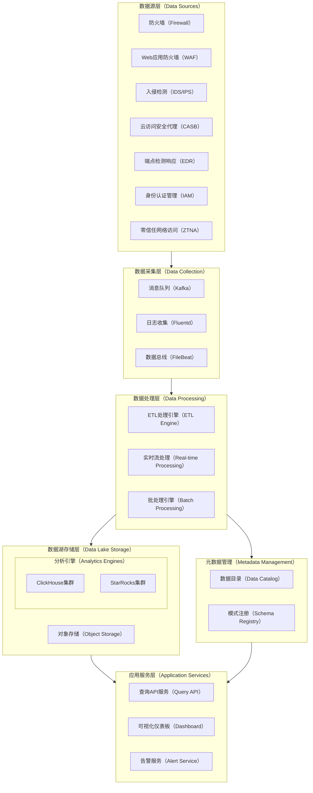

该架构采用分层设计，从底层的多样化数据源到顶层的统一查询服务，实现了数据的标准化收集、处理和分析。数据处理层负责将各种格式的安全日志转换为符合OCSF标准的统一模式，存储在支持ClickHouse和StarRocks的数据湖中。

## 数据库详细设计

### 核心表结构设计

基于星型模型设计原则，构建以事实表为中心，多个维度表支撑的数据结构。

#### 事实表设计

**1. 安全事件事实表 (security\_event\_fact)**

```sql
CREATE TABLE security_event_fact (
    event_id UUID PRIMARY KEY,
    timestamp DateTime64(3),
    date_partition_key Date MATERIALIZED toDate(timestamp),
    hour_partition_key UInt8 MATERIALIZED toHour(timestamp),
    
    -- 事件基础信息
    source_system LowCardinality(String),
    event_type LowCardinality(String),
    event_category LowCardinality(String),
    severity_level LowCardinality(String),
    action LowCardinality(String),
    outcome LowCardinality(String),
    
    -- 关联维度键
    user_id Nullable(String),
    device_id Nullable(String),
    asset_id Nullable(String),
    app_id Nullable(String),
    threat_id Nullable(String),
    session_id Nullable(String),
    
    -- 网络信息
    src_ip Nullable(IPv4),
    dst_ip Nullable(IPv4),
    src_port Nullable(UInt16),
    dst_port Nullable(UInt16),
    protocol LowCardinality(Nullable(String)),
    
    -- Web相关信息
    url Nullable(String),
    http_method LowCardinality(Nullable(String)),
    http_status_code Nullable(UInt16),
    user_agent Nullable(String),
    
    -- 文件相关信息
    file_path Nullable(String),
    file_hash Nullable(String),
    file_size Nullable(UInt64),
    
    -- 进程相关信息
    process_name Nullable(String),
    process_id Nullable(UInt32),
    parent_process_id Nullable(UInt32),
    
    -- 扩展字段
    raw_data String,
    custom_fields Map(String, String),
    
    -- 预计算字段（冗余常用维度信息以提升查询性能）
    user_name Nullable(String),
    user_department Nullable(String),
    device_hostname Nullable(String),
    app_name Nullable(String),
    
    -- 数据质量标识
    data_quality_score Float32 DEFAULT 1.0,
    parsing_errors Array(String),
    
    INDEX idx_timestamp timestamp TYPE minmax GRANULARITY 8192,
    INDEX idx_source_system source_system TYPE bloom_filter GRANULARITY 1,
    INDEX idx_event_type event_type TYPE bloom_filter GRANULARITY 1,
    INDEX idx_user_id user_id TYPE bloom_filter GRANULARITY 1,
    INDEX idx_src_ip src_ip TYPE bloom_filter GRANULARITY 1,
    INDEX idx_dst_ip dst_ip TYPE bloom_filter GRANULARITY 1
) ENGINE = MergeTree()
PARTITION BY toYYYYMM(timestamp)
ORDER BY (date_partition_key, hour_partition_key, source_system, event_type, timestamp)
TTL timestamp + INTERVAL 2 YEAR
SETTINGS index_granularity = 8192;
```

#### 维度表设计

**1. 用户维度表 (user\_dim)**

```sql
CREATE TABLE user_dim (
    user_id String PRIMARY KEY,
    username String,
    email String,
    full_name String,
    department String,
    job_title String,
    manager_id Nullable(String),
    business_unit String,
    user_type LowCardinality(String), -- internal, external, service_account
    status LowCardinality(String), -- active, inactive, suspended
    risk_level LowCardinality(String), -- low, medium, high
    created_time DateTime,
    last_updated DateTime,
    attributes Map(String, String)
) ENGINE = ReplacingMergeTree(last_updated)
ORDER BY user_id;
```

**2. 设备维度表 (device\_dim)**

```sql
CREATE TABLE device_dim (
    device_id String PRIMARY KEY,
    hostname String,
    device_type LowCardinality(String), -- desktop, laptop, server, mobile, iot
    os_type LowCardinality(String),
    os_version String,
    ip_address Nullable(IPv4),
    mac_address Nullable(String),
    location String,
    owner_id Nullable(String),
    asset_tag Nullable(String),
    risk_level LowCardinality(String),
    compliance_status LowCardinality(String),
    last_seen DateTime,
    created_time DateTime,
    last_updated DateTime,
    attributes Map(String, String)
) ENGINE = ReplacingMergeTree(last_updated)
ORDER BY device_id;
```

**3. 应用维度表 (app\_dim)**

```sql
CREATE TABLE app_dim (
    app_id String PRIMARY KEY,
    app_name String,
    app_type LowCardinality(String), -- web_app, saas, on_premise, cloud_service
    vendor String,
    category LowCardinality(String),
    risk_level LowCardinality(String),
    compliance_requirements Array(String),
    data_classification LowCardinality(String),
    owner_department String,
    url_patterns Array(String),
    created_time DateTime,
    last_updated DateTime,
    attributes Map(String, String)
) ENGINE = ReplacingMergeTree(last_updated)
ORDER BY app_id;
```

**4. 资产维度表 (asset\_dim)**

```sql
CREATE TABLE asset_dim (
    asset_id String PRIMARY KEY,
    asset_name String,
    asset_type LowCardinality(String), -- server, network_device, database, cloud_resource
    ip_address Nullable(IPv4),
    network_segment String,
    criticality_level LowCardinality(String),
    business_owner String,
    technical_owner String,
    location String,
    environment LowCardinality(String), -- production, staging, development
    compliance_scope Array(String),
    created_time DateTime,
    last_updated DateTime,
    attributes Map(String, String)
) ENGINE = ReplacingMergeTree(last_updated)
ORDER BY asset_id;
```

**5. 威胁指标维度表 (threat\_indicator\_dim)**

```sql
CREATE TABLE threat_indicator_dim (
    threat_id String PRIMARY KEY,
    indicator_type LowCardinality(String), -- ip, domain, hash, url, email
    indicator_value String,
    threat_family String,
    severity_score UInt8,
    confidence_level Float32,
    first_seen DateTime,
    last_seen DateTime,
    source String,
    description String,
    mitigation_recommendations String,
    ioc_tags Array(String),
    created_time DateTime,
    last_updated DateTime
) ENGINE = ReplacingMergeTree(last_updated)
ORDER BY threat_id;
```

**6. 时间维度表 (time\_dim)**

```sql
CREATE TABLE time_dim (
    time_id DateTime PRIMARY KEY,
    date Date,
    year UInt16,
    quarter UInt8,
    month UInt8,
    week UInt8,
    day_of_month UInt8,
    day_of_week UInt8,
    day_of_year UInt16,
    hour UInt8,
    minute UInt8,
    is_weekend UInt8,
    is_business_hour UInt8,
    business_quarter String,
    fiscal_year UInt16
) ENGINE = MergeTree()
ORDER BY time_id;
```

### 数据分区与索引策略

数据分区设计采用时间分区策略，支持高效的历史数据查询和数据生命周期管理：

```mermaid
graph LR
    subgraph PS[分区策略（Partition Strategy）]
        TP[时间分区（Time Partition）]
        HP[哈希分区（Hash Partition）]
        RP[范围分区（Range Partition）]
    end

    subgraph IS[索引策略（Index Strategy）]
        PI[主索引（Primary Index）]
        SI[二级索引（Secondary Index）]
        BI[布隆过滤器索引（Bloom Filter）]
        MI[MinMax索引（MinMax Index）]
    end

    subgraph OS[优化策略（Optimization Strategy）]
        MV[物化视图（Materialized View）]
        PC[预计算（Pre-computation）]
        DC[数据压缩（Data Compression）]
        TTL[数据生命周期（TTL）]
    end

    PS --> IS
    IS --> OS
```

索引策略通过多层次索引结构，确保各类查询场景的性能优化。主索引基于时间和系统来源进行排序，二级索引针对用户ID、IP地址等高频查询字段建立，布隆过滤器索引用于快速过滤不匹配的数据块。

### 数据模式标准化

遵循OCSF（开放网络安全模式框架）标准进行数据标准化：

```sql
-- OCSF标准事件映射表
CREATE TABLE ocsf_event_mapping (
    source_system String,
    original_event_type String,
    ocsf_class_uid UInt32,
    ocsf_class_name String,
    field_mappings Map(String, String),
    transformation_rules String,
    created_time DateTime,
    last_updated DateTime
) ENGINE = ReplacingMergeTree(last_updated)
ORDER BY (source_system, original_event_type);

-- 数据质量规则表
CREATE TABLE data_quality_rules (
    rule_id String PRIMARY KEY,
    source_system String,
    rule_type LowCardinality(String), -- validation, enrichment, normalization
    rule_condition String,
    rule_action String,
    severity LowCardinality(String),
    is_active UInt8,
    created_time DateTime,
    last_updated DateTime
) ENGINE = ReplacingMergeTree(last_updated)
ORDER BY rule_id;
```

## 数据上报API设计

### 批量数据上报接口

```json
POST /api/v1/security-events/batch
Content-Type: application/json
Authorization: Bearer <token>

{
  "source_system": "firewall-01",
  "batch_id": "batch_20250815_001",
  "events": [
    {
      "event_id": "evt_123456",
      "timestamp": "2025-08-15T10:30:00.000Z",
      "event_type": "network_traffic",
      "event_category": "network_activity",
      "severity_level": "medium",
      "action": "allow",
      "outcome": "success",
      "src_ip": "192.168.1.100",
      "dst_ip": "10.0.0.50",
      "src_port": 443,
      "dst_port": 80,
      "protocol": "tcp",
      "user_id": "user_001",
      "device_id": "device_001",
      "raw_data": "{...}",
      "custom_fields": {
        "policy_rule": "rule_001",
        "geo_location": "US-East"
      }
    }
  ]
}
```

### 实时流数据上报接口

```json
POST /api/v1/security-events/stream
Content-Type: application/json
Authorization: Bearer <token>

{
  "source_system": "edr-agent",
  "event_id": "evt_789012",
  "timestamp": "2025-08-15T10:31:15.123Z",
  "event_type": "process_creation",
  "event_category": "system_activity",
  "severity_level": "high",
  "action": "create",
  "outcome": "success",
  "device_id": "device_002",
  "user_id": "user_002",
  "process_name": "powershell.exe",
  "process_id": 1234,
  "parent_process_id": 5678,
  "file_path": "C:\\Windows\\System32\\WindowsPowerShell\\v1.0\\powershell.exe",
  "file_hash": "sha256:abc123...",
  "raw_data": "{...}"
}
```

## 数据查询API设计

### 安全事件查询服务架构

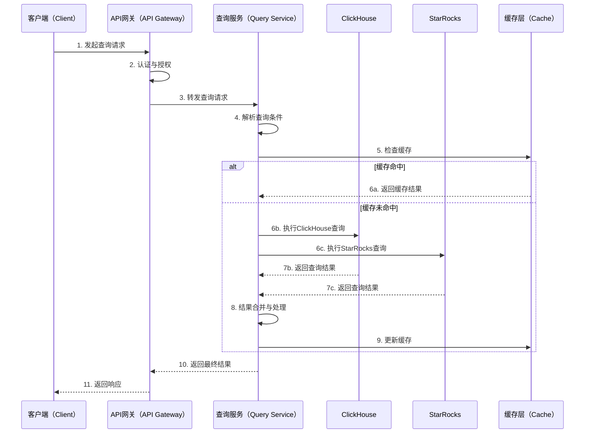

查询服务采用多引擎支持架构，根据查询复杂度和数据特征自动选择最优的执行引擎。简单的时间范围查询优先使用ClickHouse，复杂的多维度关联分析则使用StarRocks，确保查询性能的最优化。

### 核心查询接口

**1. 安全事件查询接口**

```json
POST /api/v1/security-events/query
Content-Type: application/json
Authorization: Bearer <token>

{
  "query_id": "query_20250815_001",
  "time_range": {
    "start_time": "2025-08-15T00:00:00Z",
    "end_time": "2025-08-15T23:59:59Z"
  },
  "filters": {
    "source_systems": ["firewall", "waf", "edr"],
    "event_types": ["network_traffic", "web_request"],
    "severity_levels": ["high", "critical"],
    "user_ids": ["user_001", "user_002"],
    "src_ip_ranges": ["192.168.1.0/24"],
    "custom_conditions": "threat_id IS NOT NULL"
  },
  "aggregations": {
    "group_by": ["source_system", "event_type"],
    "metrics": ["count", "avg_severity_score"],
    "time_bucket": "1h"
  },
  "options": {
    "limit": 10000,
    "offset": 0,
    "sort_by": "timestamp DESC",
    "include_raw_data": false,
    "cache_ttl": 300
  }
}
```

**2. 威胁情报关联查询接口**

```json
POST /api/v1/threat-intelligence/correlate
Content-Type: application/json
Authorization: Bearer <token>

{
  "indicators": [
    {
      "type": "ip",
      "value": "192.168.1.100"
    },
    {
      "type": "hash",
      "value": "sha256:abc123..."
    }
  ],
  "time_range": {
    "start_time": "2025-08-14T00:00:00Z",
    "end_time": "2025-08-15T23:59:59Z"
  },
  "correlation_scope": {
    "include_related_events": true,
    "max_correlation_depth": 3,
    "correlation_types": ["temporal", "entity", "behavioral"]
  }
}
```

**3. 用户行为分析查询接口**

```json
POST /api/v1/analytics/user-behavior
Content-Type: application/json
Authorization: Bearer <token>

{
  "analysis_type": "anomaly_detection",
  "target_users": ["user_001", "user_002"],
  "baseline_period": {
    "start_time": "2025-08-01T00:00:00Z",
    "end_time": "2025-08-14T23:59:59Z"
  },
  "analysis_period": {
    "start_time": "2025-08-15T00:00:00Z",
    "end_time": "2025-08-15T23:59:59Z"
  },
  "behavior_dimensions": [
    "login_patterns",
    "application_usage",
    "network_access",
    "data_access"
  ],
  "anomaly_threshold": 0.05
}
```

### 高级分析查询接口

**1. 多维度关联分析**

```json
POST /api/v1/analytics/correlation-analysis
Content-Type: application/json
Authorization: Bearer <token>

{
  "analysis_name": "insider_threat_detection",
  "primary_entity": {
    "type": "user",
    "id": "user_001"
  },
  "correlation_rules": [
    {
      "rule_type": "temporal_proximity",
      "time_window": "5m",
      "event_types": ["authentication", "data_access", "network_traffic"]
    },
    {
      "rule_type": "entity_relationship",
      "relationship_types": ["same_user", "same_device", "same_application"]
    }
  ],
  "output_format": {
    "include_timeline": true,
    "include_graph_data": true,
    "max_results": 100
  }
}
```

**2. 安全态势评估查询**

```json
POST /api/v1/analytics/security-posture
Content-Type: application/json
Authorization: Bearer <token>

{
  "assessment_scope": {
    "departments": ["IT", "Finance", "HR"],
    "asset_categories": ["critical", "high"],
    "time_range": {
      "start_time": "2025-08-15T00:00:00Z",
      "end_time": "2025-08-15T23:59:59Z"
    }
  },
  "metrics": [
    "threat_exposure_score",
    "compliance_status",
    "vulnerability_coverage",
    "incident_response_time"
  ],
  "benchmark_comparison": true,
  "trend_analysis": {
    "period": "30d",
    "granularity": "1d"
  }
}
```

## 部署架构设计

### 多引擎支持部署架构

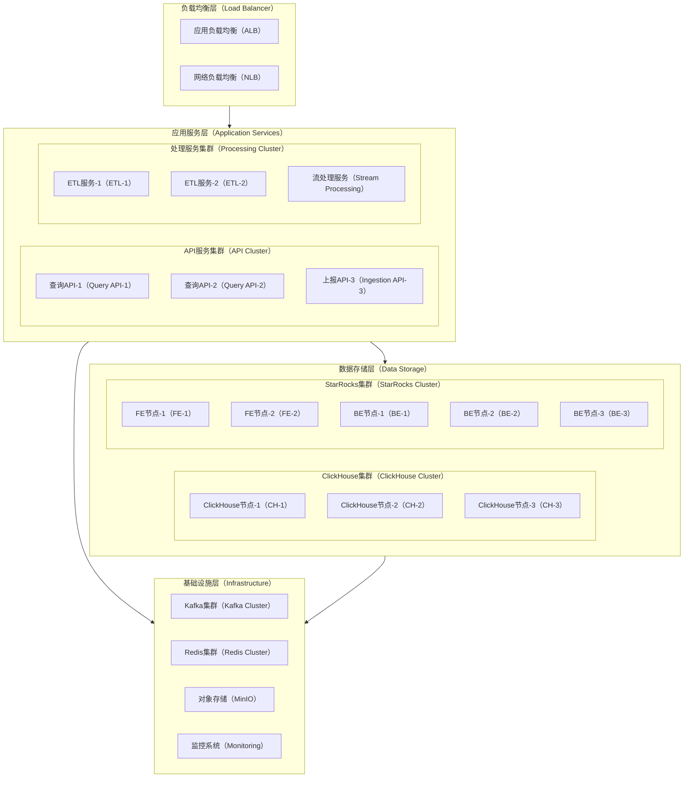

部署架构采用云原生设计，支持ClickHouse和StarRocks双引擎并行运行。通过智能路由策略，将不同类型的查询分发到最适合的计算引擎，实现性能最优化和资源高效利用。

### 数据流处理架构

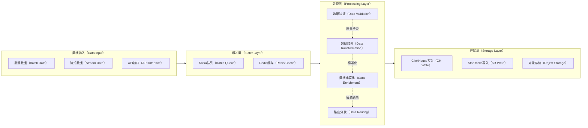

数据流处理采用流批一体化架构，通过Kafka作为统一的数据缓冲层，支持高并发数据接入。处理层实现数据验证、转换和丰富化的流水线处理，确保数据质量和标准化。智能路由模块根据数据特征和查询需求，将数据写入最适合的存储引擎。

## 性能优化与监控

### 查询性能优化策略

**1. 物化视图预计算**

```sql
-- 按小时聚合的安全事件统计物化视图
CREATE MATERIALIZED VIEW security_events_hourly_agg
ENGINE = SummingMergeTree()
PARTITION BY toYYYYMM(hour_time)
ORDER BY (hour_time, source_system, event_type)
AS SELECT
    toStartOfHour(timestamp) as hour_time,
    source_system,
    event_type,
    severity_level,
    count() as event_count,
    uniq(user_id) as unique_users,
    uniq(device_id) as unique_devices,
    uniq(src_ip) as unique_src_ips
FROM security_event_fact
WHERE timestamp >= yesterday()
GROUP BY hour_time, source_system, event_type, severity_level;

-- 用户行为基线物化视图
CREATE MATERIALIZED VIEW user_behavior_baseline
ENGINE = AggregatingMergeTree()
PARTITION BY toYYYYMM(date)
ORDER BY (date, user_id)
AS SELECT
    toDate(timestamp) as date,
    user_id,
    countState() as login_count,
    uniqState(src_ip) as unique_ips,
    uniqState(app_id) as unique_apps,
    avgState(toHour(timestamp)) as avg_login_hour
FROM security_event_fact
WHERE event_type = 'authentication' AND outcome = 'success'
GROUP BY date, user_id;
```

**2. 分区策略优化**

```sql
-- 热数据分区（最近30天）
ALTER TABLE security_event_fact 
MODIFY TTL timestamp + INTERVAL 30 DAY TO DISK 'hot_disk',
         timestamp + INTERVAL 90 DAY TO DISK 'warm_disk',
         timestamp + INTERVAL 2 YEAR DELETE;

-- 冷数据归档策略
CREATE TABLE security_event_fact_archive 
ENGINE = MergeTree()
PARTITION BY toYYYYMM(timestamp)
ORDER BY (date_partition_key, source_system, timestamp)
SETTINGS storage_policy = 'cold_storage';
```

### 系统监控与告警

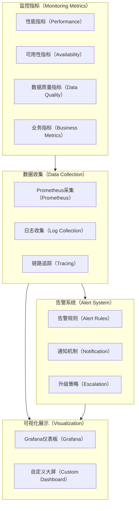

监控体系涵盖系统性能、数据质量、业务指标等多个维度，通过Prometheus进行指标收集，Grafana进行可视化展示，建立完整的运维监控闭环。

## 安全与合规设计

### 数据安全架构

**1. 访问控制模型**

```sql
-- 角色权限管理表
CREATE TABLE security_roles (
    role_id String PRIMARY KEY,
    role_name String,
    role_description String,
    permissions Array(String),
    data_scope_rules String, -- JSON格式的数据范围规则
    created_time DateTime,
    last_updated DateTime
) ENGINE = ReplacingMergeTree(last_updated)
ORDER BY role_id;

-- 用户角色映射表
CREATE TABLE user_role_mapping (
    user_id String,
    role_id String,
    granted_by String,
    granted_time DateTime,
    valid_from DateTime,
    valid_to Nullable(DateTime),
    is_active UInt8,
    PRIMARY KEY (user_id, role_id)
) ENGINE = ReplacingMergeTree(granted_time)
ORDER BY (user_id, role_id);

-- 数据访问审计表
CREATE TABLE data_access_audit (
    audit_id UUID PRIMARY KEY,
    user_id String,
    query_type LowCardinality(String), -- select, insert, update, delete
    accessed_tables Array(String),
    query_conditions String,
    data_sensitivity_level LowCardinality(String),
    access_result LowCardinality(String), -- success, denied, error
    response_time_ms UInt32,
    rows_returned UInt64,
    client_ip IPv4,
    user_agent String,
    timestamp DateTime64(3),
    session_id String,
    
    INDEX idx_user_id user_id TYPE bloom_filter GRANULARITY 1,
    INDEX idx_timestamp timestamp TYPE minmax GRANULARITY 8192
) ENGINE = MergeTree()
PARTITION BY toYYYYMM(timestamp)
ORDER BY (timestamp, user_id)
TTL timestamp + INTERVAL 7 YEAR;
```

**2. 数据加密与脱敏**

```sql
-- 敏感数据字段配置表
CREATE TABLE sensitive_data_config (
    table_name String,
    column_name String,
    sensitivity_level LowCardinality(String), -- public, internal, confidential, restricted
    encryption_method LowCardinality(String), -- aes256, tokenization, hashing, masking
    masking_rules String, -- JSON格式的脱敏规则
    access_control_rules String, -- 访问控制规则
    compliance_tags Array(String), -- GDPR, SOX, PCI-DSS等
    created_time DateTime,
    last_updated DateTime,
    PRIMARY KEY (table_name, column_name)
) ENGINE = ReplacingMergeTree(last_updated)
ORDER BY (table_name, column_name);

-- 数据分类标签表
CREATE TABLE data_classification (
    data_id String PRIMARY KEY,
    table_name String,
    record_identifier String,
    classification_level LowCardinality(String),
    data_categories Array(String), -- PII, financial, health, intellectual_property
    jurisdiction Array(String), -- US, EU, APAC等
    retention_period UInt32, -- 数据保留期限（天）
    disposal_method String,
    created_time DateTime,
    last_updated DateTime
) ENGINE = ReplacingMergeTree(last_updated)
ORDER BY data_id;
```

### 合规性框架实现

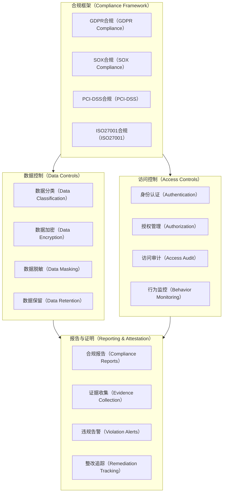

合规性框架通过多层次的数据控制和访问管理机制，确保系统满足GDPR、SOX、PCI-DSS等国际合规标准要求。自动化的合规监控和报告生成功能，大幅降低了合规管理的人工成本。

## 扩展功能设计

### 机器学习与AI增强

**1. 异常检测模型集成**

```sql
-- 机器学习模型配置表
CREATE TABLE ml_models (
    model_id String PRIMARY KEY,
    model_name String,
    model_type LowCardinality(String), -- anomaly_detection, classification, clustering
    model_version String,
    training_data_query String,
    feature_columns Array(String),
    target_column Nullable(String),
    model_parameters String, -- JSON格式的模型参数
    performance_metrics String, -- JSON格式的性能指标
    model_status LowCardinality(String), -- training, deployed, retired
    created_time DateTime,
    last_updated DateTime,
    last_trained DateTime
) ENGINE = ReplacingMergeTree(last_updated)
ORDER BY model_id;

-- AI预测结果表
CREATE TABLE ai_predictions (
    prediction_id UUID PRIMARY KEY,
    model_id String,
    input_event_id String,
    prediction_type LowCardinality(String), -- anomaly_score, risk_level, classification
    prediction_value Float64,
    confidence_score Float64,
    prediction_timestamp DateTime64(3),
    model_version String,
    feature_values Map(String, Float64),
    explanation String, -- 可解释性信息
    
    INDEX idx_model_id model_id TYPE bloom_filter GRANULARITY 1,
    INDEX idx_prediction_timestamp prediction_timestamp TYPE minmax GRANULARITY 8192
) ENGINE = MergeTree()
PARTITION BY toYYYYMM(prediction_timestamp)
ORDER BY (prediction_timestamp, model_id);
```

**2. 智能告警与响应**

```sql
-- 智能告警规则表
CREATE TABLE intelligent_alert_rules (
    rule_id String PRIMARY KEY,
    rule_name String,
    rule_description String,
    trigger_conditions String, -- 复杂事件处理(CEP)规则
    ml_model_integration Array(String), -- 关联的ML模型ID
    severity_calculation String, -- 严重性计算公式
    suppression_rules String, -- 告警抑制规则
    escalation_policy String,
    notification_channels Array(String),
    response_actions Array(String), -- 自动响应动作
    is_active UInt8,
    created_time DateTime,
    last_updated DateTime
) ENGINE = ReplacingMergeTree(last_updated)
ORDER BY rule_id;

-- 安全事件关联分析表
CREATE TABLE security_event_correlation (
    correlation_id UUID PRIMARY KEY,
    primary_event_id String,
    related_event_ids Array(String),
    correlation_type LowCardinality(String), -- temporal, causal, pattern_based
    correlation_strength Float64,
    correlation_rules Array(String),
    attack_chain_stage LowCardinality(String), -- reconnaissance, initial_access, persistence等
    mitre_techniques Array(String), -- MITRE ATT&CK技术ID
    correlation_timestamp DateTime64(3),
    analyst_feedback Nullable(String), -- 分析师反馈
    
    INDEX idx_primary_event primary_event_id TYPE bloom_filter GRANULARITY 1
) ENGINE = MergeTree()
PARTITION BY toYYYYMM(correlation_timestamp)
ORDER BY (correlation_timestamp, primary_event_id);
```

### 威胁情报集成

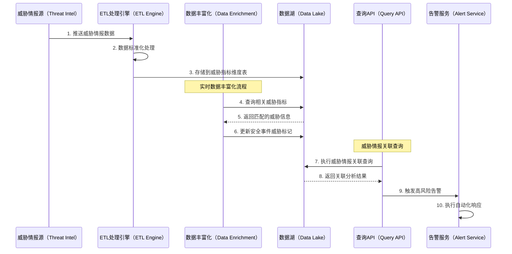

威胁情报集成通过实时数据丰富化流程，将外部威胁情报与内部安全事件进行自动关联匹配。当检测到已知威胁指标时，系统自动更新事件的威胁级别，并触发相应的告警和响应流程。

## API服务详细实现

### RESTful API接口规范

**1. 统一响应格式**

```json
{
  "code": 200,
  "message": "Success",
  "timestamp": "2025-08-15T10:30:00.000Z",
  "request_id": "req_123456789",
  "data": {
    // 具体的响应数据
  },
  "pagination": {
    "total": 1000,
    "page": 1,
    "size": 100,
    "has_next": true
  },
  "metadata": {
    "query_time_ms": 250,
    "data_source": "clickhouse",
    "cache_hit": false
  }
}
```

**2. 高级分析API实现**

```json
// 用户实体行为分析API
POST /api/v1/analytics/ueba
{
  "analysis_config": {
    "target_entities": [
      {
        "type": "user",
        "identifiers": ["user_001", "user_002"]
      },
      {
        "type": "device", 
        "identifiers": ["device_001"]
      }
    ],
    "baseline_period": {
      "start_time": "2025-07-15T00:00:00Z",
      "end_time": "2025-08-14T23:59:59Z"
    },
    "analysis_period": {
      "start_time": "2025-08-15T00:00:00Z",
      "end_time": "2025-08-15T23:59:59Z"
    },
    "behavioral_dimensions": [
      {
        "dimension": "login_timing",
        "parameters": {
          "time_buckets": "1h",
          "anomaly_threshold": 0.05
        }
      },
      {
        "dimension": "application_access",
        "parameters": {
          "access_pattern_analysis": true,
          "new_application_detection": true
        }
      },
      {
        "dimension": "data_volume",
        "parameters": {
          "volume_threshold_multiplier": 3.0,
          "trend_analysis": true
        }
      }
    ],
    "ml_models": ["user_behavior_anomaly_v2", "access_pattern_classifier_v1"],
    "output_format": {
      "include_explanations": true,
      "risk_score_calculation": true,
      "recommended_actions": true
    }
  }
}
```

### GraphQL API增强查询

```graphql
# GraphQL Schema定义
type SecurityEvent {
  eventId: ID!
  timestamp: DateTime!
  sourceSystem: String!
  eventType: String!
  severity: SeverityLevel!
  user: User
  device: Device
  application: Application
  threatIndicators: [ThreatIndicator!]
  correlatedEvents: [SecurityEvent!]
  riskScore: Float
  customFields: JSON
}

type Query {
  securityEvents(
    filter: SecurityEventFilter!
    pagination: PaginationInput
    sort: [SortInput!]
  ): SecurityEventConnection!
  
  threatIntelligence(
    indicators: [String!]!
    timeRange: TimeRangeInput
  ): [ThreatMatch!]!
  
  userBehaviorAnalysis(
    userId: ID!
    analysisType: UEBAAnalysisType!
    timeRange: TimeRangeInput!
  ): UserBehaviorAnalysis!
}

# 查询示例
query GetSecurityEventsWithContext {
  securityEvents(
    filter: {
      timeRange: {
        startTime: "2025-08-15T00:00:00Z"
        endTime: "2025-08-15T23:59:59Z"
      }
      severityLevels: [HIGH, CRITICAL]
      sourceSystems: ["firewall", "edr", "waf"]
    }
    pagination: { first: 50 }
    sort: [{ field: TIMESTAMP, direction: DESC }]
  ) {
    edges {
      node {
        eventId
        timestamp
        eventType
        severity
        user {
          userId
          username
          department
          riskLevel
        }
        device {
          deviceId
          hostname
          deviceType
          lastSeen
        }
        threatIndicators {
          threatId
          indicatorType
          severityScore
          description
        }
        correlatedEvents {
          eventId
          eventType
          correlationType
        }
        riskScore
      }
    }
    pageInfo {
      hasNextPage
      endCursor
    }
    totalCount
  }
}
```

## 性能基准与容量规划

### 性能基准测试结果

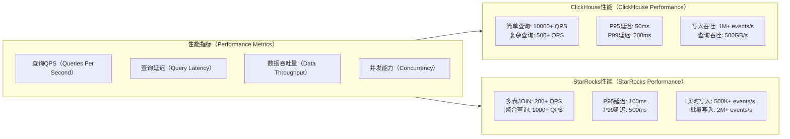

### 容量规划模型

**1. 存储容量规划**

```sql
-- 容量规划配置表
CREATE TABLE capacity_planning_config (
    metric_name String PRIMARY KEY,
    current_value UInt64,
    growth_rate_daily Float64, -- 日增长率
    growth_rate_monthly Float64, -- 月增长率
    forecast_period_days UInt32,
    storage_compression_ratio Float64,
    retention_period_days UInt32,
    cost_per_gb_monthly Float64,
    last_updated DateTime
) ENGINE = ReplacingMergeTree(last_updated)
ORDER BY metric_name;

-- 容量监控视图
CREATE MATERIALIZED VIEW storage_capacity_monitoring
ENGINE = SummingMergeTree()
PARTITION BY toYYYYMM(date)
ORDER BY (date, table_name)
AS SELECT
    toDate(now()) as date,
    database as database_name,
    table as table_name,
    sum(bytes_on_disk) as bytes_on_disk,
    sum(rows) as row_count,
    sum(data_compressed_bytes) as compressed_bytes,
    sum(data_uncompressed_bytes) as uncompressed_bytes
FROM system.parts
WHERE active = 1
GROUP BY date, database, table;
```

**2. 性能容量预测模型**

```python
# 容量规划计算示例（伪代码）
class CapacityPlanningModel:
    def __init__(self):
        self.daily_event_volume = 100_000_000  # 1亿事件/天
        self.avg_event_size_bytes = 2048       # 平均事件大小2KB
        self.compression_ratio = 0.3           # 压缩比30%
        self.retention_days = 730              # 保留2年
        self.growth_rate_monthly = 0.15        # 月增长15%
        
    def calculate_storage_requirements(self, forecast_months=24):
        """计算存储需求预测"""
        requirements = []
        current_volume = self.daily_event_volume
        
        for month in range(forecast_months):
            monthly_events = current_volume * 30  # 月事件数
            raw_storage_gb = (monthly_events * self.avg_event_size_bytes) / (1024**3)
            compressed_storage_gb = raw_storage_gb * self.compression_ratio
            
            # 累积存储（考虑保留期）
            cumulative_storage = min(month + 1, self.retention_days // 30) * compressed_storage_gb
            
            requirements.append({
                'month': month + 1,
                'monthly_events': monthly_events,
                'monthly_storage_gb': compressed_storage_gb,
                'cumulative_storage_gb': cumulative_storage,
                'estimated_cost_usd': cumulative_storage * 0.02  # 假设$0.02/GB/月
            })
            
            current_volume *= (1 + self.growth_rate_monthly)
        
        return requirements
```

## 系统集成与兼容性

### 第三方系统集成架构

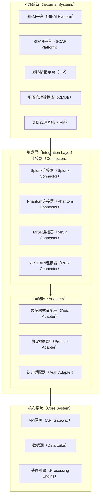

系统集成架构通过标准化的连接器和适配器模式，实现与主流安全平台的无缝集成。支持Splunk、Phantom、MISP等常见安全工具的双向数据交换，确保现有安全投资的最大化利用。

### 标准协议支持

**1. STIX/TAXII威胁情报交换**

```json
// TAXII Collection配置
POST /api/v1/integration/taxii/collections
{
  "collection_config": {
    "collection_id": "threat-indicators-collection",
    "title": "Enterprise Threat Indicators",
    "description": "Curated threat indicators for enterprise security",
    "supported_content": ["indicator", "malware", "attack-pattern"],
    "media_types": ["application/stix+json;version=2.1"],
    "can_read": true,
    "can_write": true,
    "max_content_length": 104857600
  },
  "data_mapping": {
    "stix_to_internal": {
      "indicator": "threat_indicator_dim",
      "malware": "threat_indicator_dim", 
      "attack-pattern": "attack_patterns"
    },
    "field_mappings": {
      "indicator.pattern": "indicator_value",
      "indicator.labels": "ioc_tags",
      "indicator.confidence": "confidence_level"
    }
  }
}
```

**2. SIEM日志格式兼容**

```python
# Splunk Universal Forwarder集成示例
class SplunkIntegration:
    def __init__(self, splunk_config):
        self.hec_url = splunk_config['hec_url']
        self.hec_token = splunk_config['hec_token']
        self.index = splunk_config.get('index', 'security_events')
        
    def send_events_to_splunk(self, events):
        """将数据湖中的事件发送到Splunk"""
        splunk_events = []
        
        for event in events:
            splunk_event = {
                "time": event['timestamp'],
                "source": event['source_system'],
                "sourcetype": f"security_datalake:{event['event_type']}",
                "index": self.index,
                "event": {
                    "id": event['event_id'],
                    "category": event['event_category'],
                    "severity": event['severity_level'],
                    "action": event['action'],
                    "outcome": event['outcome'],
                    "src_ip": event.get('src_ip'),
                    "dst_ip": event.get('dst_ip'),
                    "user": event.get('user_name'),
                    "device": event.get('device_hostname'),
                    "custom_fields": event.get('custom_fields', {})
                }
            }
            splunk_events.append(splunk_event)
        
        # 批量发送到Splunk HEC
        return self._bulk_send_to_hec(splunk_events)
```

## 运维管理与自动化

### 自动化运维架构

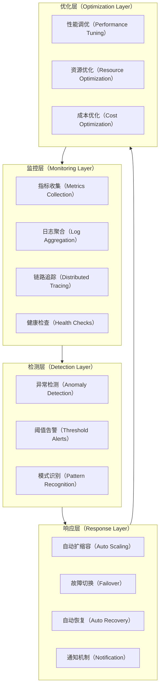

自动化运维体系通过持续监控、智能检测、自动响应和优化改进的闭环流程，实现系统的自愈和自优化能力。结合机器学习算法，能够预测性地发现潜在问题并主动采取预防措施。

### 灾难恢复与备份策略

```sql
-- 备份任务配置表
CREATE TABLE backup_tasks (
    task_id String PRIMARY KEY,
    task_name String,
    backup_type LowCardinality(String), -- full, incremental, differential
    source_tables Array(String),
    backup_destination String,
    schedule_cron String,
    retention_policy String, -- JSON格式的保留策略
    compression_enabled UInt8,
    encryption_enabled UInt8,
    last_run_time Nullable(DateTime),
    last_run_status LowCardinality(String), -- success, failed, running
    next_run_time DateTime,
    created_time DateTime,
    last_updated DateTime
) ENGINE = ReplacingMergeTree(last_updated)
ORDER BY task_id;

-- 灾难恢复计划表
CREATE TABLE disaster_recovery_plans (
    plan_id String PRIMARY KEY,
    plan_name String,
    plan_description String,
    disaster_scenarios Array(String), -- 灾难场景类型
    recovery_procedures String, -- 详细的恢复步骤
    rto_minutes UInt32, -- Recovery Time Objective
    rpo_minutes UInt32, -- Recovery Point Objective
    primary_site String,
    disaster_recovery_site String,
    failover_triggers Array(String),
    rollback_procedures String,
    test_schedule String,
    last_test_date Nullable(Date),
    test_results String,
    plan_status LowCardinality(String), -- active, inactive, testing
    created_time DateTime,
    last_updated DateTime
) ENGINE = ReplacingMergeTree(last_updated)
ORDER BY plan_id;
```

## 参考资料

\[1] The Transition from Monolithic SIEMs to Data Lakes for Security Monitoring
[https://www.detectionatscale.com/p/the-transition-from-monolithic-siems](https://www.detectionatscale.com/p/the-transition-from-monolithic-siems)

\[2] Building a Modern Security Data Lake Architecture
[https://www.elastic.co/security-labs/building-a-security-data-lake](https://www.elastic.co/security-labs/building-a-security-data-lake)

\[3] What is OCSF (Open Cybersecurity Schema Framework)?
[https://www.sentinelone.com/blog/simplifying-the-security-analyst-experience-with-open-cybersecurity-schema-framework-ocsf/](https://www.sentinelone.com/blog/simplifying-the-security-analyst-experience-with-open-cybersecurity-schema-framework-ocsf/)

\[4] The OCSF: Open Cybersecurity Schema Framework | Splunk
[https://www.splunk.com/en\_us/blog/learn/open-cybersecurity-schema-framework-ocsf.html](https://www.splunk.com/en_us/blog/learn/open-cybersecurity-schema-framework-ocsf.html)

\[5] Apache Kafka for Security Data Ingestion
[https://kafka.apache.org/documentation/#security](https://kafka.apache.org/documentation/#security)

\[6] ClickHouse Performance Optimization Guide
[https://clickhouse.com/docs/en/operations/optimization](https://clickhouse.com/docs/en/operations/optimization)

\[7] Data Catalog and Metadata Management Best Practices
[https://www.datahubproject.io/docs/](https://www.datahubproject.io/docs/)

\[8] Real-time Stream Processing for Security Analytics
[https://spark.apache.org/streaming/](https://spark.apache.org/streaming/)

\[9] Third-party integrations with Security Lake - Amazon Security Lake
[https://docs.aws.amazon.com/security-lake/latest/userguide/integrations-third-party.html](https://docs.aws.amazon.com/security-lake/latest/userguide/integrations-third-party.html)

\[10] AWS Security Lake OCSF Integration
[https://aws.amazon.com/security-lake/](https://aws.amazon.com/security-lake/)

\[11] Schema Design | ClickHouse Docs
[https://clickhouse.com/docs/data-modeling/schema-design](https://clickhouse.com/docs/data-modeling/schema-design)

\[12] StarRocks Architecture and Performance
[https://docs.starrocks.io/docs/architecture/](https://docs.starrocks.io/docs/architecture/)

\[13] MITRE ATT\&CK Framework Integration
[https://attack.mitre.org/](https://attack.mitre.org/)

\[14] STIX/TAXII Threat Intelligence Sharing
[https://oasis-open.github.io/cti-documentation/](https://oasis-open.github.io/cti-documentation/)

\[15] Zero Trust Architecture for Data Lakes
[https://www.nist.gov/publications/zero-trust-architecture](https://www.nist.gov/publications/zero-trust-architecture)

## 高级功能扩展设计

### 智能数据治理

**1. 数据血缘追踪系统**

```sql
-- 数据血缘关系表
CREATE TABLE data_lineage (
    lineage_id UUID PRIMARY KEY,
    source_table String,
    source_column String,
    target_table String,
    target_column String,
    transformation_type LowCardinality(String), -- direct, aggregated, derived, enriched
    transformation_logic String,
    dependency_level UInt8, -- 依赖层级深度
    impact_analysis_tags Array(String),
    data_flow_direction LowCardinality(String), -- upstream, downstream, bidirectional
    created_time DateTime,
    last_validated DateTime,
    validation_status LowCardinality(String), -- valid, invalid, unknown
    
    INDEX idx_source_table source_table TYPE bloom_filter GRANULARITY 1,
    INDEX idx_target_table target_table TYPE bloom_filter GRANULARITY 1
) ENGINE = ReplacingMergeTree(last_validated)
ORDER BY (source_table, target_table, lineage_id);

-- 数据质量监控表
CREATE TABLE data_quality_metrics (
    metric_id UUID PRIMARY KEY,
    table_name String,
    column_name Nullable(String),
    quality_dimension LowCardinality(String), -- completeness, accuracy, consistency, timeliness
    metric_value Float64,
    threshold_min Nullable(Float64),
    threshold_max Nullable(Float64),
    measurement_time DateTime,
    quality_status LowCardinality(String), -- passed, warning, failed
    anomaly_score Float64,
    remediation_suggestions String,
    business_impact_level LowCardinality(String), -- low, medium, high, critical
    
    INDEX idx_table_name table_name TYPE bloom_filter GRANULARITY 1,
    INDEX idx_measurement_time measurement_time TYPE minmax GRANULARITY 8192
) ENGINE = MergeTree()
PARTITION BY toYYYYMM(measurement_time)
ORDER BY (measurement_time, table_name, quality_dimension);
```

**2. 自动化数据质量检查**

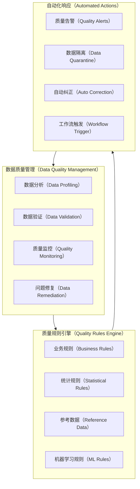

数据质量管理系统通过多维度的质量检查规则，自动监控数据完整性、准确性、一致性和及时性。当检测到质量问题时，系统能够自动执行隔离、纠正或告警等响应动作，确保数据湖中数据的可信度。

### 高级安全分析能力

**1. 攻击链重构与分析**

```sql
-- 攻击链分析表
CREATE TABLE attack_chain_analysis (
    chain_id UUID PRIMARY KEY,
    attack_campaign_id Nullable(String),
    chain_name String,
    attack_start_time DateTime,
    attack_end_time Nullable(DateTime),
    attack_duration_seconds Nullable(UInt32),
    
    -- MITRE ATT&CK映射
    mitre_tactics Array(String), -- initial_access, execution, persistence等
    mitre_techniques Array(String), -- T1078, T1190等具体技术
    mitre_sub_techniques Array(String),
    
    -- 攻击阶段事件
    reconnaissance_events Array(String), -- 事件ID数组
    initial_access_events Array(String),
    execution_events Array(String),
    persistence_events Array(String),
    privilege_escalation_events Array(String),
    defense_evasion_events Array(String),
    credential_access_events Array(String),
    discovery_events Array(String),
    lateral_movement_events Array(String),
    collection_events Array(String),
    command_control_events Array(String),
    exfiltration_events Array(String),
    impact_events Array(String),
    
    -- 攻击者画像
    attacker_ips Array(IPv4),
    attacker_user_agents Array(String),
    target_assets Array(String),
    compromised_accounts Array(String),
    affected_systems Array(String),
    
    -- 威胁评估
    attack_sophistication_level LowCardinality(String), -- low, medium, high, apt
    confidence_score Float64,
    impact_assessment String,
    attribution_indicators String,
    
    -- 检测与响应
    detection_time DateTime,
    response_actions Array(String),
    containment_status LowCardinality(String), -- contained, partially_contained, not_contained
    
    created_time DateTime,
    last_updated DateTime,
    analyst_notes String,
    
    INDEX idx_attack_start attack_start_time TYPE minmax GRANULARITY 8192,
    INDEX idx_tactics mitre_tactics TYPE bloom_filter GRANULARITY 1
) ENGINE = ReplacingMergeTree(last_updated)
ORDER BY (attack_start_time, chain_id);

-- 实体行为基线表
CREATE TABLE entity_behavior_baseline (
    baseline_id String PRIMARY KEY,
    entity_type LowCardinality(String), -- user, device, application, network_segment
    entity_id String,
    baseline_period_start DateTime,
    baseline_period_end DateTime,
    
    -- 行为特征基线
    typical_login_hours Array(UInt8), -- 常见登录小时
    typical_login_locations Array(String),
    typical_applications Array(String),
    typical_data_access_patterns Map(String, Float64),
    typical_network_communications Map(String, Float64),
    
    -- 统计基线
    avg_daily_events Float64,
    avg_session_duration Float64,
    typical_data_volume_mb Float64,
    peak_activity_hours Array(UInt8),
    
    -- 风险基线
    baseline_risk_score Float64,
    anomaly_thresholds Map(String, Float64), -- 各维度异常阈值
    
    baseline_quality_score Float64, -- 基线数据质量评分
    sample_size UInt64,
    last_updated DateTime,
    
    INDEX idx_entity_type entity_type TYPE bloom_filter GRANULARITY 1,
    INDEX idx_entity_id entity_id TYPE bloom_filter GRANULARITY 1
) ENGINE = ReplacingMergeTree(last_updated)
ORDER BY (entity_type, entity_id);
```

**2. 零日威胁检测算法**

```python
# 零日威胁检测模型示例
class ZeroDayThreatDetection:
    def __init__(self, model_config):
        self.behavioral_models = {}
        self.anomaly_detectors = {}
        self.threat_indicators = {}
        
    def analyze_unknown_threat(self, event_sequence):
        """分析未知威胁模式"""
        threat_signals = []
        
        # 1. 行为序列异常检测
        behavioral_anomaly = self._detect_behavioral_anomaly(event_sequence)
        if behavioral_anomaly['score'] > 0.8:
            threat_signals.append({
                'type': 'behavioral_anomaly',
                'score': behavioral_anomaly['score'],
                'description': behavioral_anomaly['description']
            })
        
        # 2. 文件熵值分析（检测加密/混淆）
        file_events = [e for e in event_sequence if e.get('file_hash')]
        for event in file_events:
            entropy_score = self._calculate_file_entropy(event['file_hash'])
            if entropy_score > 7.5:  # 高熵值可能表示加密或混淆
                threat_signals.append({
                    'type': 'high_entropy_file',
                    'score': entropy_score / 8.0,
                    'file_hash': event['file_hash']
                })
        
        # 3. 网络通信模式分析
        network_anomaly = self._analyze_network_patterns(event_sequence)
        if network_anomaly['score'] > 0.7:
            threat_signals.append({
                'type': 'network_anomaly',
                'score': network_anomaly['score'],
                'patterns': network_anomaly['suspicious_patterns']
            })
        
        # 4. 时序模式异常
        temporal_anomaly = self._detect_temporal_anomaly(event_sequence)
        if temporal_anomaly['score'] > 0.6:
            threat_signals.append({
                'type': 'temporal_anomaly',
                'score': temporal_anomaly['score'],
                'pattern_deviation': temporal_anomaly['deviation']
            })
        
        # 综合威胁评分
        if threat_signals:
            composite_score = self._calculate_composite_threat_score(threat_signals)
            return {
                'is_potential_threat': composite_score > 0.7,
                'threat_score': composite_score,
                'threat_signals': threat_signals,
                'recommended_actions': self._generate_response_recommendations(threat_signals)
            }
        
        return {'is_potential_threat': False, 'threat_score': 0.0}
```

### 云原生扩展架构

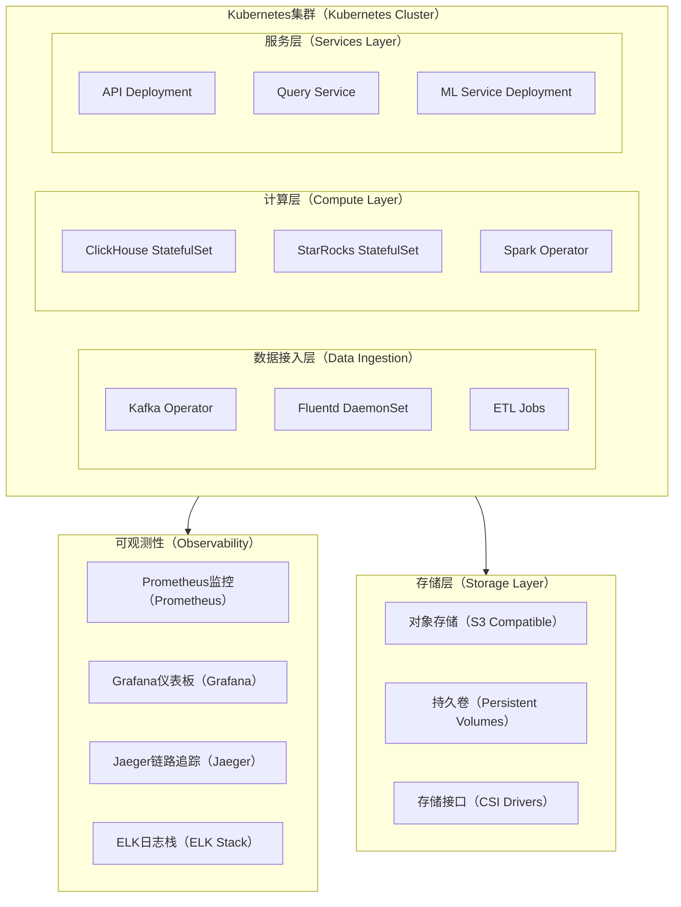

云原生架构通过Kubernetes Operator模式管理复杂的分布式组件，实现自动化部署、扩缩容和故障恢复。结合云存储和容器编排，提供高可用、可弹性扩展的安全数据湖平台。

### 边缘计算集成

**1. 边缘节点数据处理**

```sql
-- 边缘节点管理表
CREATE TABLE edge_nodes (
    node_id String PRIMARY KEY,
    node_name String,
    node_location String,
    node_type LowCardinality(String), -- datacenter_edge, enterprise_edge, iot_gateway
    hardware_specs Map(String, String),
    software_version String,
    connection_status LowCardinality(String), -- online, offline, unstable
    last_heartbeat DateTime,
    
    -- 处理能力
    processing_capabilities Array(String), -- filtering, aggregation, ml_inference
    max_throughput_events_per_sec UInt32,
    storage_capacity_gb UInt32,
    current_cpu_usage Float32,
    current_memory_usage Float32,
    current_storage_usage Float32,
    
    -- 数据管道配置
    local_processing_rules Array(String),
    data_retention_hours UInt32,
    sync_frequency_minutes UInt32,
    bandwidth_limit_mbps UInt32,
    
    created_time DateTime,
    last_updated DateTime,
    
    INDEX idx_node_type node_type TYPE bloom_filter GRANULARITY 1,
    INDEX idx_location node_location TYPE bloom_filter GRANULARITY 1
) ENGINE = ReplacingMergeTree(last_updated)
ORDER BY node_id;

-- 边缘数据同步状态表
CREATE TABLE edge_sync_status (
    sync_id UUID PRIMARY KEY,
    node_id String,
    sync_start_time DateTime,
    sync_end_time Nullable(DateTime),
    sync_type LowCardinality(String), -- incremental, full, emergency
    
    -- 同步统计
    events_to_sync UInt64,
    events_synced UInt64,
    events_failed UInt64,
    data_size_mb Float64,
    
    sync_status LowCardinality(String), -- pending, running, completed, failed
    error_details Nullable(String),
    retry_count UInt8,
    
    -- 网络状况
    avg_bandwidth_mbps Float32,
    network_latency_ms Float32,
    packet_loss_rate Float32,
    
    created_time DateTime,
    
    INDEX idx_node_id node_id TYPE bloom_filter GRANULARITY 1,
    INDEX idx_sync_time sync_start_time TYPE minmax GRANULARITY 8192
) ENGINE = MergeTree()
PARTITION BY toYYYYMM(sync_start_time)
ORDER BY (sync_start_time, node_id);
```

**2. 边缘智能处理流程**

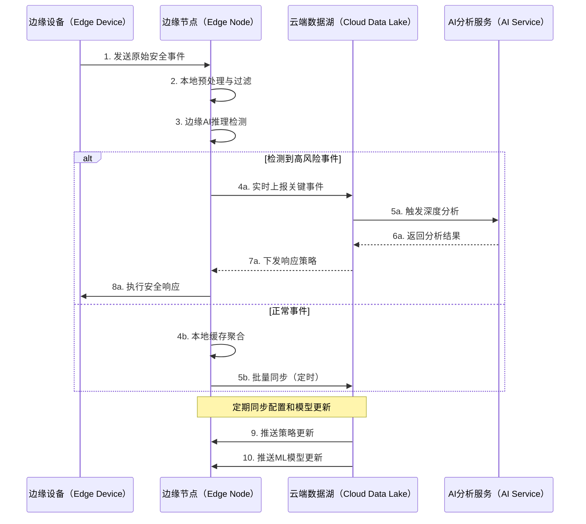

边缘计算集成通过在网络边缘部署轻量级处理节点，实现数据的就近分析和预处理。关键安全事件可实时上报进行深度分析，普通事件则在边缘聚合后批量同步，大幅降低网络带宽需求和响应延迟。

### 可视化分析平台

**1. 安全态势大屏设计**

```json
// 态势感知大屏配置
{
  "dashboard_config": {
    "dashboard_id": "security_operations_center",
    "title": "安全运营中心态势大屏",
    "refresh_interval": 30,
    "layout": {
      "grid_columns": 24,
      "grid_rows": 16
    },
    "widgets": [
      {
        "widget_id": "threat_level_indicator",
        "type": "gauge",
        "title": "当前威胁等级",
        "position": {"x": 0, "y": 0, "w": 6, "h": 4},
        "data_source": {
          "query": "SELECT calculateThreatLevel() as current_threat_level",
          "refresh_seconds": 60
        },
        "display": {
          "min_value": 0,
          "max_value": 100,
          "thresholds": [
            {"value": 30, "color": "#00FF00", "label": "低风险"},
            {"value": 60, "color": "#FFFF00", "label": "中风险"},
            {"value": 80, "color": "#FF8000", "label": "高风险"},
            {"value": 100, "color": "#FF0000", "label": "极高风险"}
          ]
        }
      },
      {
        "widget_id": "attack_map",
        "type": "geographic_map",
        "title": "全球攻击态势",
        "position": {"x": 6, "y": 0, "w": 12, "h": 8},
        "data_source": {
          "query": "SELECT src_ip, dst_ip, count(*) as attack_count FROM security_event_fact WHERE timestamp >= now() - INTERVAL 1 HOUR AND severity_level IN ('high', 'critical') GROUP BY src_ip, dst_ip",
          "refresh_seconds": 30
        }
      },
      {
        "widget_id": "event_timeline",
        "type": "timeline",
        "title": "安全事件时间线",
        "position": {"x": 0, "y": 8, "w": 24, "h": 4},
        "data_source": {
          "query": "SELECT timestamp, event_type, severity_level, count(*) as event_count FROM security_event_fact WHERE timestamp >= now() - INTERVAL 24 HOUR GROUP BY timestamp, event_type, severity_level ORDER BY timestamp",
          "refresh_seconds": 60
        }
      },
      {
        "widget_id": "top_threats",
        "type": "table",
        "title": "Top 10威胁指标",
        "position": {"x": 18, "y": 0, "w": 6, "h": 8},
        "data_source": {
          "query": "SELECT threat_id, indicator_value, threat_family, count(*) as hit_count FROM security_event_fact sef JOIN threat_indicator_dim tid ON sef.threat_id = tid.threat_id WHERE sef.timestamp >= now() - INTERVAL 1 DAY GROUP BY threat_id, indicator_value, threat_family ORDER BY hit_count DESC LIMIT 10",
          "refresh_seconds": 120
        }
      }
    ]
  }
}
```

**2. 交互式调查分析界面**

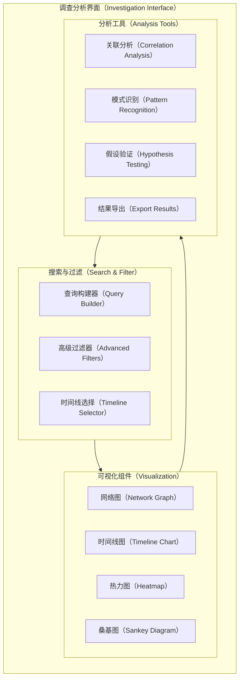

交互式调查分析界面提供灵活的数据探索和分析能力，安全分析师可以通过直观的可视化组件快速发现威胁模式，进行假设驱动的调查分析。

### 成本优化与资源管理

**1. 智能分层存储策略**

```sql
-- 存储分层策略配置表
CREATE TABLE storage_tiering_policy (
    policy_id String PRIMARY KEY,
    policy_name String,
    table_pattern String, -- 表名匹配模式
    
    -- 分层规则
    hot_tier_days UInt16, -- 热数据保留天数
    warm_tier_days UInt16, -- 温数据保留天数
    cold_tier_days UInt16, -- 冷数据保留天数
    archive_tier_days UInt16, -- 归档数据保留天数
    
    -- 存储配置
    hot_storage_type LowCardinality(String), -- nvme_ssd, sata_ssd
    warm_storage_type LowCardinality(String), -- sata_ssd, hdd
    cold_storage_type LowCardinality(String), -- hdd, object_storage
    archive_storage_type LowCardinality(String), -- glacier, tape
    
    -- 压缩策略
    hot_compression LowCardinality(String), -- lz4, zstd, none
    warm_compression LowCardinality(String),
    cold_compression LowCardinality(String),
    archive_compression LowCardinality(String),
    
    -- 成本参数
    hot_cost_per_gb_month Float64,
    warm_cost_per_gb_month Float64,
    cold_cost_per_gb_month Float64,
    archive_cost_per_gb_month Float64,
    
    -- 访问模式
    access_frequency_threshold Float64, -- 访问频率阈值
    query_performance_requirement LowCardinality(String), -- real_time, near_real_time, batch
    
    is_active UInt8,
    created_time DateTime,
    last_updated DateTime
) ENGINE = ReplacingMergeTree(last_updated)
ORDER BY policy_id;

-- 成本分析视图
CREATE MATERIALIZED VIEW storage_cost_analysis
ENGINE = SummingMergeTree()
PARTITION BY toYYYYMM(date)
ORDER BY (date, table_name, storage_tier)
AS SELECT
    today() as date,
    database() as database_name,
    table as table_name,
    
    -- 根据分区时间判断存储层级
    CASE 
        WHEN age_days <= 7 THEN 'hot'
        WHEN age_days <= 30 THEN 'warm' 
        WHEN age_days <= 365 THEN 'cold'
        ELSE 'archive'
    END as storage_tier,
    
    sum(bytes_on_disk) / 1024 / 1024 / 1024 as storage_gb,
    sum(rows) as row_count,
    
    -- 成本计算（基于存储层级和大小）
    multiIf(
        storage_tier = 'hot', storage_gb * 0.10,
        storage_tier = 'warm', storage_gb * 0.05,
        storage_tier = 'cold', storage_gb * 0.02,
        storage_gb * 0.01
    ) as estimated_monthly_cost
    
FROM (
    SELECT 
        database,
        table,
        bytes_on_disk,
        rows,
        dateDiff('day', toDate(min_time), today()) as age_days
    FROM system.parts 
    WHERE active = 1
) 
GROUP BY date, database_name, table_name, storage_tier;
```

**2. 动态资源调度算法**

```python
class DynamicResourceScheduler:
    def __init__(self):
        self.resource_pools = {
            'compute_intensive': {'cpu_weight': 0.7, 'memory_weight': 0.3},
            'memory_intensive': {'cpu_weight': 0.3, 'memory_weight': 0.7},
            'io_intensive': {'cpu_weight': 0.4, 'memory_weight': 0.2, 'io_weight': 0.4}
        }
        
    def optimize_resource_allocation(self, query_workload):
        """基于查询负载特征优化资源分配"""
        optimized_allocation = []
        
        for query in query_workload:
            # 分析查询特征
            query_profile = self._analyze_query_profile(query)
            
            # 预测资源需求
            resource_prediction = self._predict_resource_requirements(query_profile)
            
            # 选择最优资源池
            optimal_pool = self._select_optimal_resource_pool(resource_prediction)
            
            # 计算资源分配
            allocation = {
                'query_id': query['query_id'],
                'resource_pool': optimal_pool,
                'cpu_cores': resource_prediction['cpu_cores'],
                'memory_gb': resource_prediction['memory_gb'],
                'estimated_runtime': resource_prediction['estimated_runtime'],
                'priority': query['priority'],
                'cost_estimate': self._calculate_cost_estimate(resource_prediction)
            }
            
            optimized_allocation.append(allocation)
        
        # 全局优化调度顺序
        return self._optimize_execution_order(optimized_allocation)
    
    def _analyze_query_profile(self, query):
        """分析查询特征"""
        profile = {
            'query_type': self._classify_query_type(query['sql']),
            'table_count': query['sql'].count('JOIN') + 1,
            'time_range_days': self._extract_time_range(query['sql']),
            'aggregation_complexity': self._assess_aggregation_complexity(query['sql']),
            'filter_selectivity': self._estimate_filter_selectivity(query['sql'])
        }
        return profile
```

## 总结

本设计文档详细阐述了多安全产品共享数据湖的完整技术架构和实现方案。通过采用星型数据模型、双引擎架构（ClickHouse + StarRocks）和云原生部署策略，构建了一个高性能、高可用、可扩展的安全数据分析平台。

**核心优势：**

1. **统一数据模型**：基于OCSF标准的星型模型设计，实现多源安全数据的标准化集成和高效关联分析。

2. **双引擎架构**：ClickHouse处理高频简单查询，StarRocks处理复杂多维分析，实现性能最优化。

3. **全生命周期管理**：从数据接入、存储、分析到归档的完整生命周期自动化管理。

4. **智能安全分析**：集成机器学习算法，支持异常检测、威胁狩猎、攻击链重构等高级分析能力。

5. **企业级安全**：多层次的访问控制、数据加密、审计追踪和合规管理机制。

6. **弹性扩展**：云原生架构支持按需扩缩容，边缘计算集成降低延迟和成本。

该架构设计充分考虑了现代企业安全运营的实际需求，为构建下一代安全数据湖平台提供了完整的技术蓝图和实现指导。通过持续优化和演进，该平台将成为企业数字化转型过程中安全能力建设的核心基础设施。
