# 多安全产品共享数据湖数据库详细设计（参考）

## 1. 系统架构概述

### 1.1 数据湖整体架构

基于SASE及多安全产品的共享数据湖架构采用分层设计，从数据采集、处理、存储到应用服务形成完整的数据流转体系。该架构确保在ClickHouse、StarRocks等不同分析引擎上的一致性支持。

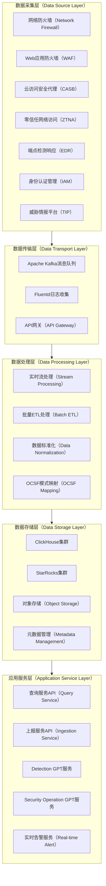

数据湖架构采用松耦合设计，各层次之间通过标准接口连接。数据采集层负责从各类安全产品收集原始日志，数据传输层提供可靠的消息队列和API接口，数据处理层实现实时和批量的数据清洗转换，数据存储层提供高性能的分析数据库支撑，应用服务层为上层业务提供统一的数据访问接口。

### 1.2 租户隔离架构

考虑到多租户环境下的数据隔离需求，系统采用租户级别的数据分离策略，确保不同客户的安全数据在物理和逻辑层面都得到有效隔离。

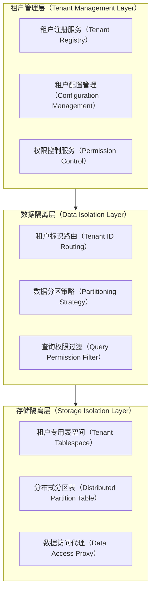

租户隔离架构通过三层设计实现数据安全隔离。租户管理层负责租户的注册、配置和权限管理；数据隔离层实现租户标识的路由和数据分区；存储隔离层在物理存储层面确保数据隔离，同时提供统一的数据访问接口。

## 2. 数据库表设计

### 2.1 核心实体关系模型

基于星型模型设计，将安全事件作为事实表，用户、设备、应用等作为维度表，实现高效的多维度分析查询。

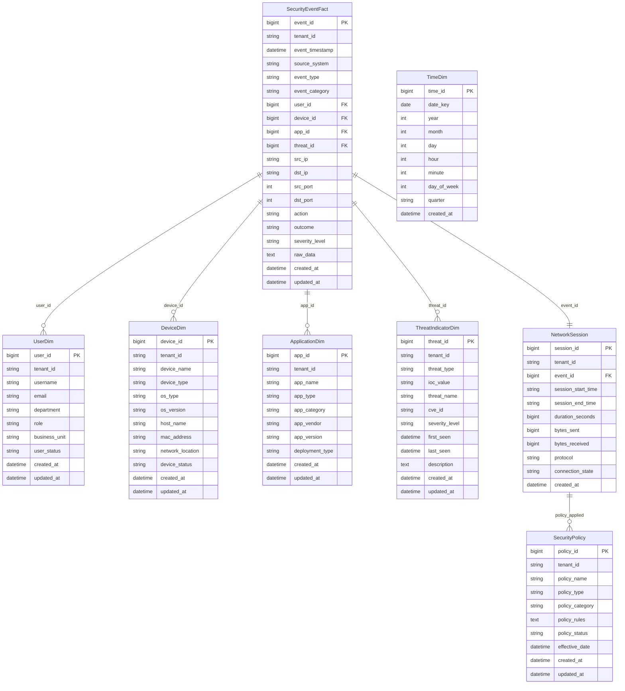

### 2.2 SASE专用扩展表

针对SASE场景的特殊需求，设计专门的扩展表来支持零信任网络访问、云访问安全等业务场景。

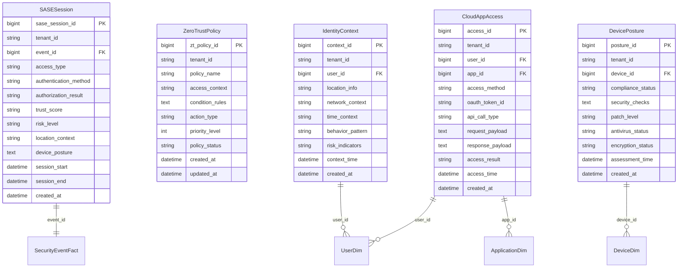

### 2.3 Security GPT专用表

为支持Detection GPT和Security Operation GPT的AI增强功能，设计专门的知识库和学习数据表。

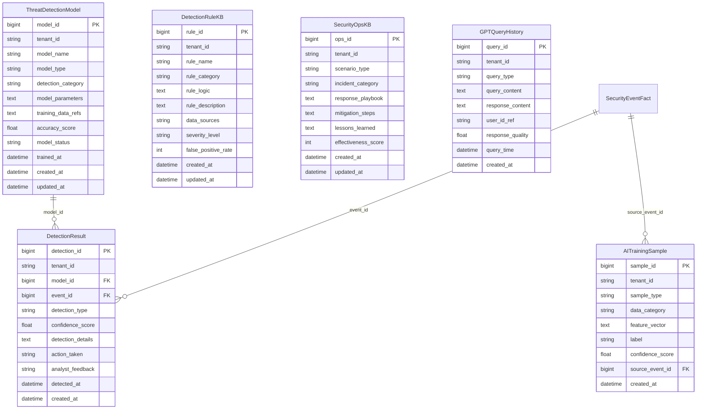

## 3. DDL语句设计

### 3.1 核心事实表DDL

**文件名**: `001_security_event_fact.sql`

```sql
-- 安全事件事实表 - ClickHouse版本
CREATE TABLE IF NOT EXISTS security_event_fact (
    event_id UInt64,
    tenant_id String,
    event_timestamp DateTime64(3),
    source_system LowCardinality(String),
    event_type LowCardinality(String),
    event_category LowCardinality(String),
    user_id Nullable(UInt64),
    device_id Nullable(UInt64),
    app_id Nullable(UInt64),
    threat_id Nullable(UInt64),
    src_ip IPv4,
    dst_ip IPv4,
    src_port UInt16,
    dst_port UInt16,
    action LowCardinality(String),
    outcome LowCardinality(String),
    severity_level LowCardinality(String),
    raw_data String,
    created_at DateTime DEFAULT now(),
    updated_at DateTime DEFAULT now()
) ENGINE = MergeTree()
PARTITION BY (tenant_id, toYYYYMM(event_timestamp))
ORDER BY (tenant_id, event_timestamp, source_system, event_type)
TTL event_timestamp + INTERVAL 2 YEAR
SETTINGS index_granularity = 8192;

-- StarRocks版本
CREATE TABLE IF NOT EXISTS security_event_fact (
    event_id BIGINT NOT NULL,
    tenant_id VARCHAR(64) NOT NULL,
    event_timestamp DATETIME NOT NULL,
    source_system VARCHAR(128),
    event_type VARCHAR(64),
    event_category VARCHAR(64),
    user_id BIGINT,
    device_id BIGINT,
    app_id BIGINT,
    threat_id BIGINT,
    src_ip VARCHAR(15),
    dst_ip VARCHAR(15),
    src_port INT,
    dst_port INT,
    action VARCHAR(32),
    outcome VARCHAR(32),
    severity_level VARCHAR(16),
    raw_data STRING,
    created_at DATETIME DEFAULT CURRENT_TIMESTAMP(),
    updated_at DATETIME DEFAULT CURRENT_TIMESTAMP()
) ENGINE=OLAP
DUPLICATE KEY(tenant_id, event_timestamp, source_system)
PARTITION BY RANGE(event_timestamp)(
    PARTITION p202401 VALUES [('2024-01-01'), ('2024-02-01')),
    PARTITION p202402 VALUES [('2024-02-01'), ('2024-03-01'))
)
DISTRIBUTED BY HASH(tenant_id) BUCKETS 32
PROPERTIES (
    "replication_num" = "3",
    "storage_medium" = "SSD",
    "enable_persistent_index" = "true"
);

-- 创建索引
CREATE INDEX idx_security_event_tenant_time ON security_event_fact(tenant_id, event_timestamp);
CREATE INDEX idx_security_event_source ON security_event_fact(source_system);
CREATE INDEX idx_security_event_severity ON security_event_fact(severity_level);
CREATE INDEX idx_security_event_ip ON security_event_fact(src_ip, dst_ip);
```

**文件名**: `002_user_dimension.sql`

```sql
-- 用户维度表 - ClickHouse版本
CREATE TABLE IF NOT EXISTS user_dim (
    user_id UInt64,
    tenant_id String,
    username String,
    email String,
    department LowCardinality(String),
    role LowCardinality(String),
    business_unit LowCardinality(String),
    user_status LowCardinality(String),
    created_at DateTime DEFAULT now(),
    updated_at DateTime DEFAULT now()
) ENGINE = MergeTree()
PARTITION BY tenant_id
ORDER BY (tenant_id, user_id)
SETTINGS index_granularity = 8192;

-- StarRocks版本
CREATE TABLE IF NOT EXISTS user_dim (
    user_id BIGINT NOT NULL,
    tenant_id VARCHAR(64) NOT NULL,
    username VARCHAR(128),
    email VARCHAR(256),
    department VARCHAR(128),
    role VARCHAR(64),
    business_unit VARCHAR(128),
    user_status VARCHAR(32),
    created_at DATETIME DEFAULT CURRENT_TIMESTAMP(),
    updated_at DATETIME DEFAULT CURRENT_TIMESTAMP()
) ENGINE=OLAP
DUPLICATE KEY(tenant_id, user_id)
PARTITION BY LIST(tenant_id)(
    PARTITION p_default VALUES IN ('default'),
    PARTITION p_tenant1 VALUES IN ('tenant1'),
    PARTITION p_tenant2 VALUES IN ('tenant2')
)
DISTRIBUTED BY HASH(user_id) BUCKETS 8
PROPERTIES (
    "replication_num" = "3"
);

-- 创建唯一键约束和索引
ALTER TABLE user_dim ADD CONSTRAINT uk_user_tenant UNIQUE(tenant_id, username);
CREATE INDEX idx_user_email ON user_dim(email);
CREATE INDEX idx_user_dept_role ON user_dim(department, role);
```

### 3.2 SASE专用表DDL

**文件名**: `003_sase_session.sql`

```sql
-- SASE会话表 - ClickHouse版本
CREATE TABLE IF NOT EXISTS sase_session (
    sase_session_id UInt64,
    tenant_id String,
    event_id UInt64,
    access_type LowCardinality(String),
    authentication_method LowCardinality(String),
    authorization_result LowCardinality(String),
    trust_score Float32,
    risk_level LowCardinality(String),
    location_context String,
    device_posture String,
    session_start DateTime64(3),
    session_end Nullable(DateTime64(3)),
    created_at DateTime DEFAULT now()
) ENGINE = MergeTree()
PARTITION BY (tenant_id, toYYYYMM(session_start))
ORDER BY (tenant_id, session_start, sase_session_id)
SETTINGS index_granularity = 8192;

-- StarRocks版本
CREATE TABLE IF NOT EXISTS sase_session (
    sase_session_id BIGINT NOT NULL,
    tenant_id VARCHAR(64) NOT NULL,
    event_id BIGINT,
    access_type VARCHAR(32),
    authentication_method VARCHAR(32),
    authorization_result VARCHAR(32),
    trust_score FLOAT,
    risk_level VARCHAR(16),
    location_context VARCHAR(256),
    device_posture STRING,
    session_start DATETIME,
    session_end DATETIME,
    created_at DATETIME DEFAULT CURRENT_TIMESTAMP()
) ENGINE=OLAP
DUPLICATE KEY(tenant_id, session_start, sase_session_id)
PARTITION BY RANGE(session_start)(
    PARTITION p202401 VALUES [('2024-01-01'), ('2024-02-01'))
)
DISTRIBUTED BY HASH(tenant_id, sase_session_id) BUCKETS 16
PROPERTIES (
    "replication_num" = "3"
);

-- 外键关联和索引
CREATE INDEX idx_sase_event_ref ON sase_session(event_id);
CREATE INDEX idx_sase_trust_score ON sase_session(trust_score);
CREATE INDEX idx_sase_risk_level ON sase_session(risk_level);
```

### 3.3 Security GPT表DDL

**文件名**: `004_threat_detection_model.sql`

```sql
-- 威胁检测模型表 - ClickHouse版本
CREATE TABLE IF NOT EXISTS threat_detection_model (
    model_id UInt64,
    tenant_id String,
    model_name String,
    model_type LowCardinality(String),
    detection_category LowCardinality(String),
    model_parameters String,
    training_data_refs Array(String),
    accuracy_score Float32,
    model_status LowCardinality(String),
    trained_at DateTime,
    created_at DateTime DEFAULT now(),
    updated_at DateTime DEFAULT now()
) ENGINE = MergeTree()
PARTITION BY tenant_id
ORDER BY (tenant_id, model_id)
SETTINGS index_granularity = 8192;

-- StarRocks版本
CREATE TABLE IF NOT EXISTS threat_detection_model (
    model_id BIGINT NOT NULL,
    tenant_id VARCHAR(64) NOT NULL,
    model_name VARCHAR(128),
    model_type VARCHAR(32),
    detection_category VARCHAR(32),
    model_parameters STRING,
    training_data_refs ARRAY<STRING>,
    accuracy_score FLOAT,
    model_status VARCHAR(16),
    trained_at DATETIME,
    created_at DATETIME DEFAULT CURRENT_TIMESTAMP(),
    updated_at DATETIME DEFAULT CURRENT_TIMESTAMP()
) ENGINE=OLAP
DUPLICATE KEY(tenant_id, model_id)
DISTRIBUTED BY HASH(model_id) BUCKETS 8
PROPERTIES (
    "replication_num" = "3"
);

CREATE INDEX idx_model_category ON threat_detection_model(detection_category);
CREATE INDEX idx_model_accuracy ON threat_detection_model(accuracy_score);
```

## 4. 数据上报服务API设计

### 4.1 API架构设计

数据上报服务采用RESTful API设计，支持批量上报和实时上报两种模式，确保高并发场景下的数据处理能力。

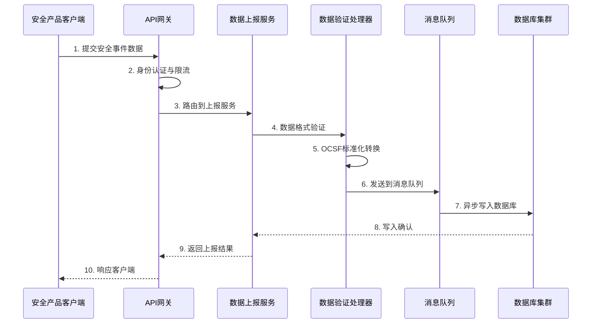

### 4.2 核心上报API接口

**单事件上报接口**

```yaml
# 接口规范
POST /api/v1/security-events/single
Content-Type: application/json
Authorization: Bearer {token}
X-Tenant-ID: {tenant_id}

# 请求体结构
{
  "event_id": "string, 可选，系统自动生成",
  "source_system": "string, 必填，数据源系统标识",
  "event_type": "string, 必填，事件类型",
  "event_category": "string, 必填，事件分类",
  "event_timestamp": "ISO8601格式时间戳",
  "user_context": {
    "user_id": "string, 可选",
    "username": "string, 可选",
    "email": "string, 可选"
  },
  "device_context": {
    "device_id": "string, 可选",
    "device_name": "string, 可选", 
    "device_type": "string, 可选"
  },
  "network_context": {
    "src_ip": "string, 可选",
    "dst_ip": "string, 可选",
    "src_port": "integer, 可选",
    "dst_port": "integer, 可选"
  },
  "application_context": {
    "app_id": "string, 可选",
    "app_name": "string, 可选",
    "url": "string, 可选"
  },
  "threat_context": {
    "threat_id": "string, 可选",
    "threat_name": "string, 可选",
    "severity_level": "string, 可选"
  },
  "action": "string, 必填，执行的动作",
  "outcome": "string, 必填，执行结果",
  "raw_data": "object, 可选，原始日志数据",
  "custom_attributes": "object, 可选，自定义属性"
}

# 响应体结构
{
  "success": true,
  "event_id": "生成的事件ID",
  "message": "事件上报成功",
  "timestamp": "处理时间戳"
}
```

**批量事件上报接口**

```yaml
# 接口规范
POST /api/v1/security-events/batch
Content-Type: application/json
Authorization: Bearer {token}
X-Tenant-ID: {tenant_id}

# 请求体结构
{
  "batch_id": "string, 可选，批次标识",
  "events": [
    {
      # 单个事件结构同上
    }
  ],
  "batch_metadata": {
    "source_system": "string, 批次来源系统",
    "collection_time": "ISO8601格式时间戳",
    "total_count": "integer, 事件总数"
  }
}

# 响应体结构
{
  "success": true,
  "batch_id": "批次ID",
  "processed_count": 150,
  "failed_count": 0,
  "failed_events": [],
  "message": "批量上报完成",
  "timestamp": "处理时间戳"
}
```

### 4.3 SASE专用上报接口

**SASE会话事件上报**

```yaml
POST /api/v1/sase/session-events
Content-Type: application/json

{
  "sase_session_id": "string, 必填",
  "base_event": {
    # 基础安全事件信息
  },
  "sase_context": {
    "access_type": "ZTNA|CASB|SWG",
    "authentication_method": "string",
    "authorization_result": "ALLOW|DENY|CHALLENGE",
    "trust_score": "float, 0-1之间",
    "risk_level": "LOW|MEDIUM|HIGH|CRITICAL",
    "location_context": "string",
    "device_posture": {
      "compliance_status": "COMPLIANT|NON_COMPLIANT|UNKNOWN",
      "security_checks": "object",
      "patch_level": "string"
    }
  },
  "session_details": {
    "session_start": "ISO8601时间戳",
    "session_end": "ISO8601时间戳, 可选",
    "duration_seconds": "integer, 可选",
    "bytes_transferred": "integer, 可选"
  }
}
```

### 4.4 数据验证与处理流程

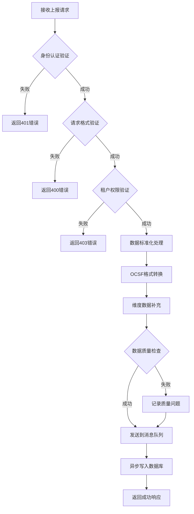

## 5. 查询服务API设计

### 5.1 通用查询接口

**事件查询接口**

```yaml
# 基础查询接口
GET /api/v1/security-events/query
Authorization: Bearer {token}
X-Tenant-ID: {tenant_id}

# 查询参数
{
  "time_range": {
    "start_time": "ISO8601时间戳",
    "end_time": "ISO8601时间戳"
  },
  "filters": {
    "source_systems": ["firewall", "waf", "casb"],
    "event_types": ["login", "access", "alert"],
    "severity_levels": ["HIGH", "CRITICAL"],
    "user_ids": ["user1", "user2"],
    "src_ips": ["192.168.1.1"],
    "custom_filter": "SQL WHERE条件，可选"
  },
  "aggregation": {
    "group_by": ["source_system", "event_type"],
    "metrics": ["count", "avg", "sum"],
    "time_bucket": "1h|1d|1w"
  },
  "pagination": {
    "page": 1,
    "page_size": 100,
    "max_results": 10000
  },
  "sort": {
    "field": "event_timestamp",
    "order": "DESC"
  }
}

# 响应体结构
{
  "success": true,
  "data": {
    "events": [
      {
        "event_id": "string",
        "event_timestamp": "ISO8601时间戳",
        "source_system": "string",
        "event_type": "string",
        "user_name": "string",
        "device_name": "string",
        "src_ip": "string",
        "dst_ip": "string",
        "action": "string",
        "outcome": "string",
        "severity_level": "string"
      }
    ],
    "aggregations": {
      "source_system": {
        "firewall": 1500,
        "waf": 800
      
```
继续查询服务API设计和Security GPT服务接口：

```yaml
      },
      "event_type": {
        "login": 900,
        "access": 1200,
        "alert": 200
      },
      "time_series": [
        {
          "timestamp": "2024-01-01T00:00:00Z",
          "count": 150
        }
      ]
    }
  },
  "pagination": {
    "total_count": 2300,
    "page": 1,
    "page_size": 100,
    "total_pages": 23
  },
  "query_metadata": {
    "execution_time_ms": 450,
    "data_sources": ["clickhouse_cluster1"],
    "cache_hit": false
  }
}
```

### 5.2 复杂关联查询接口

**多维度关联分析接口**

```yaml
POST /api/v1/security-events/correlation-analysis
Content-Type: application/json

{
  "analysis_type": "USER_BEHAVIOR|THREAT_HUNTING|INCIDENT_TIMELINE",
  "correlation_config": {
    "primary_entity": {
      "type": "user|device|ip|application",
      "value": "john.doe@company.com"
    },
    "time_window": {
      "start_time": "ISO8601时间戳",
      "end_time": "ISO8601时间戳"
    },
    "correlation_rules": [
      {
        "rule_type": "TEMPORAL_SEQUENCE",
        "entities": ["login_event", "file_access", "network_connection"],
        "time_threshold": "300s"
      },
      {
        "rule_type": "SPATIAL_CORRELATION",
        "entities": ["device_location", "network_segment"],
        "distance_threshold": "same_subnet"
      }
    ]
  },
  "output_format": {
    "include_timeline": true,
    "include_graph": true,
    "max_depth": 3
  }
}

# 响应体
{
  "success": true,
  "correlation_result": {
    "correlation_id": "string",
    "analysis_type": "USER_BEHAVIOR",
    "primary_entity": {
      "type": "user",
      "value": "john.doe@company.com",
      "entity_details": {}
    },
    "correlated_events": [
      {
        "event_id": "string",
        "correlation_score": 0.85,
        "correlation_type": "TEMPORAL|SPATIAL|BEHAVIORAL",
        "event_summary": {}
      }
    ],
    "timeline": [
      {
        "timestamp": "ISO8601时间戳",
        "event_type": "login",
        "description": "用户从新设备登录"
      }
    ],
    "correlation_graph": {
      "nodes": [
        {
          "id": "user_001",
          "type": "user",
          "properties": {}
        }
      ],
      "edges": [
        {
          "source": "user_001",
          "target": "device_001",
          "relationship": "accessed_from"
        }
      ]
    },
    "risk_assessment": {
      "overall_risk_score": 0.7,
      "risk_factors": ["new_device", "unusual_time"],
      "recommended_actions": ["verify_identity", "monitor_session"]
    }
  }
}
```

### 5.3 SASE专用查询接口

**零信任访问分析接口**

```yaml
GET /api/v1/sase/zero-trust-analysis
Parameters:
- user_id: string
- time_range: object
- access_context: ZTNA|CASB|SWG

{
  "success": true,
  "data": {
    "user_profile": {
      "user_id": "string",
      "username": "string",
      "department": "string",
      "baseline_behavior": {
        "typical_access_hours": "9-17",
        "common_applications": ["app1", "app2"],
        "trusted_devices": ["device1", "device2"],
        "common_locations": ["office", "home"]
      }
    },
    "access_sessions": [
      {
        "session_id": "string",
        "access_type": "ZTNA",
        "application": "internal-app",
        "device_trust_score": 0.8,
        "location_context": "office_network",
        "policy_evaluation": {
          "policy_name": "standard_access",
          "evaluation_result": "ALLOW",
          "conditions_met": ["device_compliant", "location_trusted"],
          "conditions_failed": []
        },
        "anomaly_indicators": [
          {
            "type": "unusual_time",
            "description": "访问时间异常",
            "risk_score": 0.3
          }
        ]
      }
    ],
    "trust_trend": [
      {
        "timestamp": "ISO8601时间戳",
        "trust_score": 0.85,
        "contributing_factors": ["device_posture", "behavior_consistency"]
      }
    ],
    "recommendations": [
      {
        "type": "policy_adjustment",
        "description": "建议调整访问策略",
        "priority": "medium"
      }
    ]
  }
}
```

## 6. Security GPT服务API设计

### 6.1 Detection GPT接口

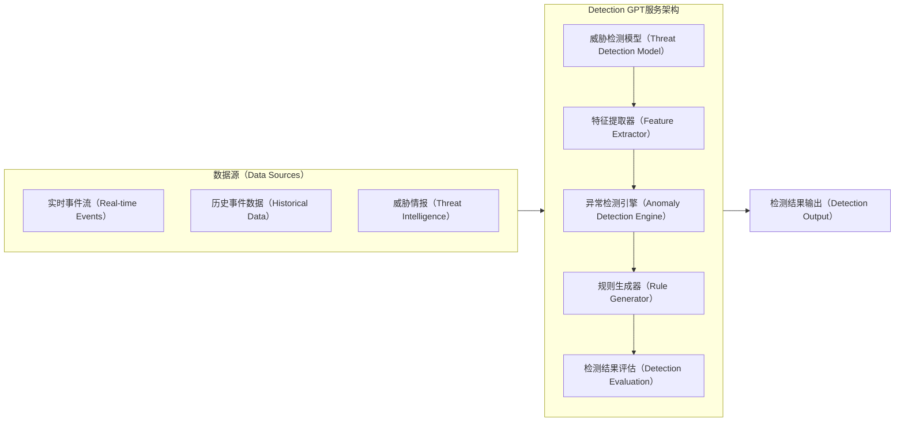

**智能威胁检测接口**

```yaml
POST /api/v1/security-gpt/detection/analyze
Content-Type: application/json

{
  "detection_request": {
    "request_id": "string, 可选",
    "detection_mode": "REAL_TIME|BATCH|INTERACTIVE",
    "data_source": {
      "source_type": "event_stream|historical_data|mixed",
      "time_range": {
        "start_time": "ISO8601时间戳",
        "end_time": "ISO8601时间戳"
      },
      "event_filters": {
        "source_systems": ["firewall", "edr", "casb"],
        "event_categories": ["network", "endpoint", "identity"],
        "entities": ["user_id", "device_id", "ip_address"]
      }
    },
    "detection_config": {
      "model_types": ["anomaly_detection", "behavioral_analysis", "pattern_matching"],
      "sensitivity_level": "LOW|MEDIUM|HIGH",
      "confidence_threshold": 0.7,
      "output_format": "structured|narrative|both"
    },
    "context_enrichment": {
      "include_threat_intel": true,
      "include_user_context": true,
      "include_asset_context": true,
      "historical_context_days": 30
    }
  }
}

# 响应体
{
  "success": true,
  "detection_result": {
    "request_id": "string",
    "analysis_timestamp": "ISO8601时间戳",
    "processing_time_ms": 1500,
    "detections": [
      {
        "detection_id": "string",
        "detection_type": "ANOMALY|BEHAVIORAL|SIGNATURE|AI_GENERATED",
        "threat_category": "MALWARE|INTRUSION|DATA_EXFILTRATION|INSIDER_THREAT",
        "confidence_score": 0.85,
        "severity_level": "LOW|MEDIUM|HIGH|CRITICAL",
        "title": "可疑的横向移动活动",
        "description": "检测到用户在短时间内访问多个不同网络段的资源",
        "affected_entities": [
          {
            "entity_type": "user",
            "entity_id": "user_123",
            "entity_name": "john.doe",
            "risk_score": 0.8
          }
        ],
        "evidence": [
          {
            "event_id": "event_001",
            "event_timestamp": "ISO8601时间戳",
            "evidence_type": "network_access",
            "description": "异常网络访问模式"
          }
        ],
        "attack_timeline": [
          {
            "timestamp": "ISO8601时间戳",
            "action": "initial_access",
            "description": "初始访问检测"
          }
        ],
        "ai_analysis": {
          "reasoning": "基于用户历史行为分析，该访问模式与正常模式存在显著偏差",
          "similar_cases": ["case_001", "case_002"],
          "recommendation": "建议立即验证用户身份并监控后续活动"
        },
        "mitigation_suggestions": [
          {
            "action": "isolate_user_session",
            "priority": "high",
            "description": "隔离用户会话以防止潜在损害"
          }
        ]
      }
    ],
    "summary": {
      "total_detections": 5,
      "critical_count": 1,
      "high_count": 2,
      "medium_count": 2,
      "false_positive_estimate": 0.1
    }
  }
}
```

**自动规则生成接口**

```yaml
POST /api/v1/security-gpt/detection/generate-rules

{
  "rule_generation_request": {
    "based_on": "HISTORICAL_INCIDENTS|THREAT_INTEL|BEHAVIORAL_PATTERNS",
    "target_threats": ["apt_attack", "insider_threat", "ransomware"],
    "data_sources": ["firewall", "edr", "email_security"],
    "rule_format": "SIGMA|YARA|CUSTOM_SQL|NATURAL_LANGUAGE",
    "optimization_goals": ["low_false_positive", "high_coverage", "performance"]
  }
}

# 响应体
{
  "success": true,
  "generated_rules": [
    {
      "rule_id": "string",
      "rule_name": "异常文件加密活动检测",
      "rule_category": "RANSOMWARE",
      "confidence_score": 0.9,
      "rule_logic": {
        "format": "SIGMA",
        "content": "detection: condition: selection and timeframe",
        "explanation": "检测短时间内大量文件被加密的活动"
      },
      "validation_results": {
        "tested_against_historical_data": true,
        "false_positive_rate": 0.05,
        "detection_coverage": 0.85,
        "performance_impact": "low"
      },
      "deployment_recommendation": {
        "environment": ["production", "staging"],
        "monitoring_frequency": "real_time",
        "review_schedule": "monthly"
      }
    }
  ]
}
```

### 6.2 Security Operation GPT接口

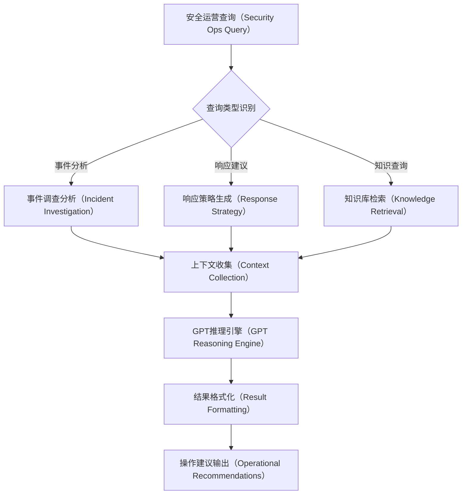

**安全运营助手接口**

```yaml
POST /api/v1/security-gpt/operations/assist
Content-Type: application/json

{
  "query": {
    "query_id": "string, 可选",
    "query_type": "INCIDENT_ANALYSIS|RESPONSE_GUIDANCE|THREAT_HUNTING|POLICY_RECOMMENDATION",
    "query_text": "请分析这个安全事件并提供处置建议",
    "context": {
      "incident_id": "inc_001",
      "event_ids": ["event_001", "event_002"],
      "affected_assets": ["server_01", "workstation_05"],
      "timeframe": {
        "start_time": "ISO8601时间戳",
        "end_time": "ISO8601时间戳"
      }
    },
    "query_preferences": {
      "detail_level": "SUMMARY|DETAILED|COMPREHENSIVE",
      "include_examples": true,
      "include_references": true,
      "output_format": "TEXT|STRUCTURED|MARKDOWN"
    }
  }
}

# 响应体
{
  "success": true,
  "response": {
    "query_id": "string",
    "response_timestamp": "ISO8601时间戳",
    "processing_time_ms": 2000,
    "query_type": "INCIDENT_ANALYSIS",
    "analysis_result": {
      "summary": "检测到疑似APT攻击活动，涉及横向移动和数据收集行为",
      "detailed_analysis": {
        "attack_phases": [
          {
            "phase": "Initial Access",
            "description": "攻击者通过钓鱼邮件获得初始访问权限",
            "evidence": ["email_event_001", "endpoint_event_002"],
            "timestamp": "ISO8601时间戳"
          },
          {
            "phase": "Lateral Movement",
            "description": "使用合法凭证在网络中横向移动",
            "evidence": ["network_event_003", "auth_event_004"],
            "timestamp": "ISO8601时间戳"
          }
        ],
        "indicators_of_compromise": [
          {
            "type": "file_hash",
            "value": "d41d8cd98f00b204e9800998ecf8427e",
            "description": "恶意程序文件哈希"
          },
          {
            "type": "ip_address",
            "value": "192.168.1.100",
            "description": "可疑内网IP地址"
          }
        ],
        "affected_systems": [
          {
            "system_id": "srv_001",
            "system_name": "file-server-01",
            "impact_level": "HIGH",
            "compromise_indicators": ["unauthorized_file_access", "privilege_escalation"]
          }
        ]
      },
      "risk_assessment": {
        "overall_risk_score": 0.8,
        "business_impact": "HIGH",
        "risk_factors": [
          "sensitive_data_access",
          "persistent_presence",
          "lateral_movement_capability"
        ]
      },
      "response_recommendations": {
        "immediate_actions": [
          {
            "action": "isolate_affected_systems",
            "priority": "CRITICAL",
            "description": "立即隔离受影响的系统以防止进一步传播",
            "estimated_time": "30 minutes",
            "responsible_team": "SOC_L2"
          },
          {
            "action": "reset_compromised_credentials",
            "priority": "HIGH",
            "description": "重置所有可能被泄露的用户凭证",
            "estimated_time": "2 hours",
            "responsible_team": "Identity_Team"
          }
        ],
        "investigation_steps": [
          {
            "step": "forensic_analysis",
            "description": "对受影响系统进行深度取证分析",
            "tools_required": ["volatility", "autopsy"],
            "estimated_duration": "4-8 hours"
          }
        ],
        "containment_strategy": {
          "approach": "aggressive_containment",
          "rationale": "考虑到APT攻击的持久性和潜在影响，建议采用积极的遏制策略"
        }
      },
      "playbook_references": [
        {
          "playbook_id": "pb_apt_response",
          "playbook_name": "APT攻击响应手册",
          "relevant_sections": ["初始遏制", "证据收集", "系统恢复"]
        }
      ],
      "lessons_learned": "此次事件突出了邮件安全防护的重要性，建议加强邮件过滤和用户安全意识培训"
    },
    "confidence_score": 0.85,
    "information_sources": [
      "incident_database",
      "threat_intelligence",
      "historical_cases",
      "security_knowledge_base"
    ]
  }
}
```

**威胁狩猎助手接口**

```yaml
POST /api/v1/security-gpt/operations/threat-hunting

{
  "hunting_request": {
    "hypothesis": "可能存在使用PowerShell进行的恶意活动",
    "hunting_scope": {
      "target_entities": ["endpoints", "network_traffic", "process_logs"],
      "time_range": {
        "start_time": "ISO8601时间戳",
        "end_time": "ISO8601时间戳"
      },
      "asset_scope": ["windows_workstations", "servers"]
    },
    "hunting_techniques": ["behavioral_analysis", "anomaly_detection", "ioc_matching"],
    "automation_level": "GUIDED|SEMI_AUTOMATED|FULLY_AUTOMATED"
  }
}

# 响应体
{
  "success": true,
  "hunting_result": {
    "hunting_session_id": "hunt_001",
    "hypothesis_validation": {
      "hypothesis": "可能存在使用PowerShell进行的恶意活动",
      "validation_result": "CONFIRMED|PARTIALLY_CONFIRMED|REJECTED",
      "confidence_score": 0.75,
      "supporting_evidence": [
        {
          "evidence_type": "process_anomaly",
          "description": "检测到异常的PowerShell进程执行模式",
          "event_count": 15,
          "affected_hosts": ["ws_001", "ws_005", "srv_002"]
        }
      ]
    },
    "hunting_findings": [
      {
        "finding_id": "find_001",
        "finding_type": "MALICIOUS_POWERSHELL",
        "severity": "HIGH",
        "description": "发现使用PowerShell下载和执行恶意脚本的活动",
        "affected_entities": [
          {
            "entity_type": "host",
            "entity_id": "ws_001",
            "entity_details": {}
          }
        ],
        "hunting_queries": [
          {
            "query_type": "KQL",
            "query": "DeviceProcessEvents | where ProcessCommandLine contains 'powershell' and ProcessCommandLine contains 'downloadstring'",
            "results_count": 5
          }
        ],
        "timeline": [
          {
            "timestamp": "ISO8601时间戳",
            "event": "PowerShell进程启动",
            "details": "异常参数执行"
          }
        ]
      }
    ],
    "recommended_actions": [
      {
        "action_type": "further_investigation",
        "description": "建议对涉及的主机进行更深入的调查",
        "priority": "high",
        "estimated_effort": "2-4 hours"
      },
      {
        "action_type": "policy_update",
        "description": "建议更新PowerShell执行策略",
        "priority": "medium",
        "estimated_effort": "1 hour"
      }
    ],
    "next_hunting_suggestions": [
      {
        "hypothesis": "检查是否存在持久化机制",
        "suggested_queries": ["registry_modifications", "scheduled_tasks"],
        "rationale": "恶意PowerShell活动通常伴随持久化尝试"
      }
    ]
  }
}
```

## 7. 索引优化策略

### 7.1 ClickHouse索引设计

```sql
-- 文件名: 005_clickhouse_indexes.sql

-- 主要查询优化索引
ALTER TABLE security_event_fact ADD INDEX idx_tenant_time (tenant_id, event_timestamp) TYPE minmax GRANULARITY 1;
ALTER TABLE security_event_fact ADD INDEX idx_source_type (source_system, event_type) TYPE bloom_filter GRANULARITY 1;
ALTER TABLE security_event_fact ADD INDEX idx_severity (severity_level) TYPE set(10) GRANULARITY 1;
ALTER TABLE security_event_fact ADD INDEX idx_src_ip (src_ip) TYPE bloom_filter GRANULARITY 1;
ALTER TABLE security_event_fact ADD INDEX idx_dst_ip (dst_ip) TYPE bloom_filter GRANULARITY 1;
ALTER TABLE security_event_fact ADD INDEX idx_user_device (user_id, device_id) TYPE bloom_filter GRANULARITY 1;

-- 物化视图优化查询性能
CREATE MATERIALIZED VIEW security_event_hourly_summary
ENGINE = SummingMergeTree()
PARTITION BY (tenant_id, toYYYYMM(event_hour))
ORDER BY (tenant_id, event_hour, source_system, event_type, severity_level)
AS SELECT
    tenant_id,
    toStartOfHour(event_timestamp) as event_hour,
    source_system,
    event_type,
    severity_level,
    count(*) as event_count,
    uniqExact(user_id) as unique_users,
    uniqExact(device_id) as unique_devices,
    uniqExact(src_ip) as unique_src_ips
FROM security_event_fact
GROUP BY tenant_id, event_hour, source_system, event_type, severity_level;

-- SASE专用索引
ALTER TABLE sase_session ADD INDEX idx_trust_score (trust_score) TYPE minmax GRANULARITY 1;
ALTER TABLE sase_session ADD INDEX idx_risk_level (risk_level) TYPE set(5) GRANULARITY 1;
ALTER TABLE sase_session ADD INDEX idx_auth_method (authentication_method) TYPE set(20) GRANULARITY 1;
```

### 7.2 StarRocks索引设计

```sql
-- 文件名: 006_starrocks_indexes.sql

-- 主键和排序键优化
ALTER TABLE security_event_fact ORDER BY (tenant_id, event_timestamp, source_system);

-- Bloom Filter索引用于高基数列
CREATE INDEX idx_event_user_bloom ON security_event_fact (user_id) USING BLOOM_FILTER;
CREATE INDEX idx_event_device_bloom ON security_event_fact (device_id) USING BLOOM_FILTER;
CREATE INDEX idx_event_src_ip_bloom ON security_event_fact (src_ip) USING BLOOM_FILTER;
CREATE INDEX idx_event_dst_ip_bloom ON security_event_fact (dst_ip) USING BLOOM_FILTER;

-- 位图索引用于低基数列
CREATE INDEX idx_event_source_bitmap ON security_event_fact (source_system) USING BITMAP;
CREATE INDEX idx_event_type_bitmap ON security_event_fact (event_type) USING BITMAP;
CREATE INDEX idx_event_severity_bitmap ON security_event_fact (severity_level) USING BITMAP;
CREATE INDEX idx_event_outcome_bitmap ON security_event_fact (outcome) USING BITMAP;

-- 物化视图加速聚合查询
CREATE MATERIALIZED VIEW mv_security_event_daily_stats
AS SELECT
    tenant_id,
    date_trunc('day', event_timestamp) as event_date,
    source_system,
    event_type,
    severity_level,
    count(*) as total_events,
    count(DISTINCT user_id) as unique_users,
    count(DISTINCT device_id) as unique_devices,
    count(DISTINCT src_ip) as unique_src_ips,
    sum(CASE WHEN outcome = 'SUCCESS' THEN 1 ELSE 0 END) as success_count,
    sum(CASE WHEN outcome = 'FAILURE' THEN 1 ELSE 0 END) as failure_count
FROM security_event_fact
GROUP BY tenant_id, event_date, source_system, event_type, severity_level;

-- 异步刷新物化视图
ALTER MATERIALIZED VIEW mv_security_event_daily_stats REFRESH ASYNC;
```

## 8. 部署架构设计

### 8.1 数据库集群部署

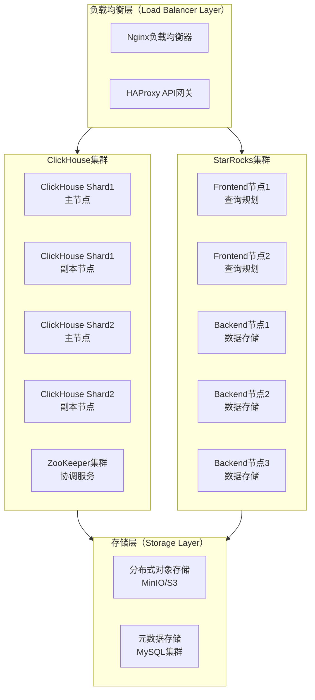

数据库集群采用双引擎架构，ClickHouse和StarRocks并行部署，通过负载均衡器根据查询类型和性能要求自动路由请求。ClickHouse集群采用分片加副本的架构保证高可用性和查询性能，StarRocks集群采用FE/BE分离架构支持弹性扩容。

### 8.2 微服务部署架构

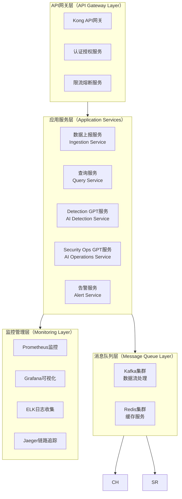

## 9. 参考资料

\[1] The Transition from Monolithic SIEMs to Data Lakes for Security Monitoring
[https://www.detectionatscale.com/p/the-transition-from-monolithic-siems](https://www.detectionatscale.com/p/the-transition-from-monolithic-siems)

\[2] What is OCSF （Open Cybersecurity Schema Framework）?
[https://www.sentinelone.com/blog/simplifying-the-security-analyst-experience-with-open-cybersecurity-schema-framework-ocsf/](https://www.sentinelone.com/blog/simplifying-the-security-analyst-experience-with-open-cybersecurity-schema-framework-ocsf/)

\[3] The OCSF: Open Cybersecurity Schema Framework | Splunk
[https://www.splunk.com/en\_us/blog/learn/open-cybersecurity-schema-framework-ocsf.html](https://www.splunk.com/en_us/blog/learn/open-cybersecurity-schema-framework-ocsf.html)

\[4] Third-party integrations with Security Lake - Amazon Security Lake
[https://docs.aws.amazon.com/security-lake/latest/userguide/integrations-third-party.html](https://docs.aws.amazon.com/security-lake/latest/userguide/integrations-third-party.html)

\[5] Schema Design | ClickHouse Docs
[https://clickhouse.com/docs/data-modeling/schema-design](https://clickhouse.com/docs/data-modeling/schema-design)

本设计文档提供了完整的多安全产品共享数据湖数据库设计方案，包括核心表结构、SASE专用扩展、Security GPT支持、API接口设计以及部署架构。设计充分考虑了租户隔离、高性能查询、AI增强分析等现代安全数据湖的核心需求，确保在ClickHouse和StarRocks等不同分析引擎上的一致性支持。


## 10. 数据治理与质量管控

### 10.1 数据质量监控体系

基于OCSF标准的数据质量监控确保入湖数据的准确性、完整性和一致性，为Security GPT提供高质量的训练和推理数据。

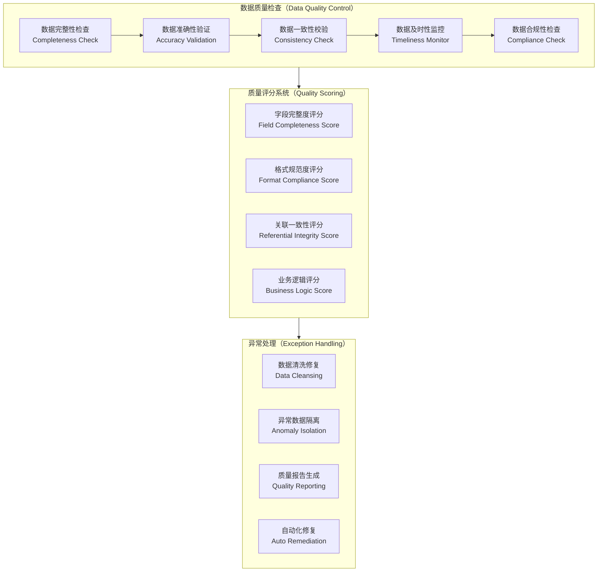

### 10.2 数据血缘追踪设计

**数据血缘表DDL**

```sql
-- 文件名: 007_data_lineage.sql

-- 数据血缘追踪表
CREATE TABLE IF NOT EXISTS data_lineage (
    lineage_id UInt64,
    tenant_id String,
    source_system String,
    source_table String,
    source_field String,
    target_system String,
    target_table String,
    target_field String,
    transformation_logic String,
    transformation_type LowCardinality(String), -- DIRECT_COPY, CALCULATED, AGGREGATED, ENRICHED
    data_flow_timestamp DateTime,
    processing_job_id String,
    created_at DateTime DEFAULT now()
) ENGINE = MergeTree()
PARTITION BY (tenant_id, toYYYYMM(data_flow_timestamp))
ORDER BY (tenant_id, data_flow_timestamp, source_system, target_system)
SETTINGS index_granularity = 8192;

-- 数据质量评分表
CREATE TABLE IF NOT EXISTS data_quality_metrics (
    metric_id UInt64,
    tenant_id String,
    table_name String,
    field_name String,
    quality_dimension LowCardinality(String), -- COMPLETENESS, ACCURACY, CONSISTENCY, TIMELINESS
    quality_score Float32,
    total_records UInt64,
    valid_records UInt64,
    invalid_records UInt64,
    null_records UInt64,
    duplicate_records UInt64,
    evaluation_timestamp DateTime,
    evaluation_rules String,
    created_at DateTime DEFAULT now()
) ENGINE = MergeTree()
PARTITION BY (tenant_id, toYYYYMM(evaluation_timestamp))
ORDER BY (tenant_id, evaluation_timestamp, table_name, field_name)
SETTINGS index_granularity = 8192;

-- 数据处理作业追踪表
CREATE TABLE IF NOT EXISTS data_processing_jobs (
    job_id String,
    tenant_id String,
    job_type LowCardinality(String), -- ETL, REAL_TIME_STREAM, BATCH_PROCESS
    job_name String,
    source_systems Array(String),
    target_systems Array(String),
    job_status LowCardinality(String), -- RUNNING, SUCCESS, FAILED, PARTIAL_SUCCESS
    start_time DateTime,
    end_time Nullable(DateTime),
    records_processed UInt64,
    records_successful UInt64,
    records_failed UInt64,
    error_details String,
    job_config String,
    created_at DateTime DEFAULT now()
) ENGINE = MergeTree()
PARTITION BY (tenant_id, toYYYYMM(start_time))
ORDER BY (tenant_id, start_time, job_id)
SETTINGS index_granularity = 8192;
```

### 10.3 数据治理API接口

**数据质量监控接口**

```yaml
GET /api/v1/data-governance/quality-metrics
Authorization: Bearer {token}
X-Tenant-ID: {tenant_id}

Parameters:
- table_name: string, 可选
- time_range: object
- quality_dimensions: array

# 响应体
{
  "success": true,
  "quality_report": {
    "overall_score": 0.85,
    "evaluation_timestamp": "ISO8601时间戳",
    "table_metrics": [
      {
        "table_name": "security_event_fact",
        "overall_quality_score": 0.87,
        "record_count": 1000000,
        "quality_dimensions": {
          "completeness": {
            "score": 0.95,
            "details": {
              "total_fields": 20,
              "complete_fields": 19,
              "missing_data_fields": ["threat_id"]
            }
          },
          "accuracy": {
            "score": 0.82,
            "details": {
              "validation_rules_passed": 15,
              "validation_rules_failed": 3,
              "accuracy_issues": ["invalid_ip_format", "future_timestamp"]
            }
          },
          "consistency": {
            "score": 0.89,
            "details": {
              "referential_integrity_violations": 50,
              "data_type_inconsistencies": 12
            }
          },
          "timeliness": {
            "score": 0.92,
            "details": {
              "avg_ingestion_delay_minutes": 5.2,
              "sla_compliance_rate": 0.95
            }
          }
        },
        "field_quality": [
          {
            "field_name": "event_timestamp",
            "quality_score": 0.98,
            "issues": []
          },
          {
            "field_name": "src_ip",
            "quality_score": 0.75,
            "issues": ["invalid_format", "private_ip_in_public_field"]
          }
        ]
      }
    ],
    "trends": [
      {
        "date": "2024-01-01",
        "overall_score": 0.83
      },
      {
        "date": "2024-01-02", 
        "overall_score": 0.85
      }
    ],
    "recommendations": [
      {
        "priority": "high",
        "category": "data_validation",
        "description": "建议增强IP地址格式验证规则",
        "affected_tables": ["security_event_fact"],
        "estimated_improvement": 0.05
      }
    ]
  }
}
```

**数据血缘查询接口**

```yaml
GET /api/v1/data-governance/lineage
Parameters:
- entity_type: table|field
- entity_name: string
- direction: upstream|downstream|both
- depth: integer, 默认3

# 响应体
{
  "success": true,
  "lineage_graph": {
    "root_entity": {
      "type": "table",
      "name": "security_event_fact",
      "system": "data_lake"
    },
    "upstream_lineage": [
      {
        "level": 1,
        "entities": [
          {
            "type": "table",
            "name": "firewall_raw_logs",
            "system": "kafka_stream",
            "transformation": "ETL_NORMALIZATION"
          },
          {
            "type": "table", 
            "name": "waf_raw_logs",
            "system": "kafka_stream",
            "transformation": "ETL_NORMALIZATION"
          }
        ]
      },
      {
        "level": 2,
        "entities": [
          {
            "type": "api",
            "name": "firewall_log_collector",
            "system": "security_device",
            "transformation": "API_INGESTION"
          }
        ]
      }
    ],
    "downstream_lineage": [
      {
        "level": 1,
        "entities": [
          {
            "type": "materialized_view",
            "name": "security_event_hourly_summary",
            "system": "clickhouse",
            "transformation": "AGGREGATION"
          },
          {
            "type": "table",
            "name": "ai_training_samples",
            "system": "ml_pipeline",
            "transformation": "FEATURE_EXTRACTION"
          }
        ]
      }
    ],
    "field_mappings": [
      {
        "source_field": "firewall_raw_logs.source_ip",
        "target_field": "security_event_fact.src_ip",
        "transformation_rule": "DIRECT_COPY"
      },
      {
        "source_field": "waf_raw_logs.client_ip",
        "target_field": "security_event_fact.src_ip", 
        "transformation_rule": "FIELD_MAPPING"
      }
    ],
    "impact_analysis": {
      "affected_downstream_entities": 5,
      "affected_reports": 3,
      "affected_ml_models": 2
    }
  }
}
```

## 11. 性能优化与运维监控

### 11.1 性能调优策略

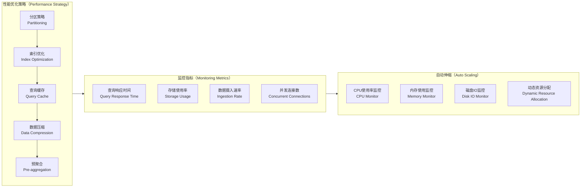

**性能监控表DDL**

```sql
-- 文件名: 008_performance_monitoring.sql

-- 查询性能监控表
CREATE TABLE IF NOT EXISTS query_performance_metrics (
    metric_id UInt64,
    tenant_id String,
    query_id String,
    query_type LowCardinality(String), -- SELECT, INSERT, AGGREGATION
    query_hash String,
    execution_time_ms UInt32,
    memory_usage_bytes UInt64,
    rows_processed UInt64,
    rows_returned UInt64,
    cache_hit Boolean,
    query_complexity_score Float32,
    execution_plan_hash String,
    query_timestamp DateTime,
    database_engine LowCardinality(String), -- CLICKHOUSE, STARROCKS
    created_at DateTime DEFAULT now()
) ENGINE = MergeTree()
PARTITION BY (tenant_id, toYYYYMM(query_timestamp))
ORDER BY (tenant_id, query_timestamp, execution_time_ms)
SETTINGS index_granularity = 8192;

-- 系统资源使用监控表
CREATE TABLE IF NOT EXISTS system_resource_metrics (
    metric_id UInt64,
    node_id String,
    node_type LowCardinality(String), -- CLICKHOUSE_NODE, STARROCKS_FE, STARROCKS_BE
    cpu_usage_percent Float32,
    memory_usage_percent Float32,
    memory_usage_bytes UInt64,
    disk_usage_percent Float32,
    disk_io_read_bytes_per_sec UInt64,
    disk_io_write_bytes_per_sec UInt64,
    network_io_bytes_per_sec UInt64,
    active_connections UInt32,
    query_queue_size UInt32,
    metric_timestamp DateTime,
    created_at DateTime DEFAULT now()
) ENGINE = MergeTree()
PARTITION BY (node_type, toYYYYMM(metric_timestamp))
ORDER BY (node_id, metric_timestamp)
SETTINGS index_granularity = 8192;

-- 数据摄入性能监控表
CREATE TABLE IF NOT EXISTS ingestion_performance_metrics (
    metric_id UInt64,
    tenant_id String,
    ingestion_job_id String,
    source_system String,
    batch_size UInt32,
    ingestion_rate_per_sec Float32,
    processing_latency_ms UInt32,
    success_rate Float32,
    error_count UInt32,
    data_volume_bytes UInt64,
    ingestion_timestamp DateTime,
    created_at DateTime DEFAULT now()
) ENGINE = MergeTree()
PARTITION BY (tenant_id, toYYYYMM(ingestion_timestamp))
ORDER BY (tenant_id, ingestion_timestamp, source_system)
SETTINGS index_granularity = 8192;
```

### 11.2 智能运维监控接口

**性能监控仪表板接口**

```yaml
GET /api/v1/monitoring/performance-dashboard
Parameters:
- time_range: object
- metrics: array
- granularity: 1m|5m|1h|1d

# 响应体
{
  "success": true,
  "dashboard_data": {
    "timestamp": "ISO8601时间戳",
    "time_range": {
      "start_time": "ISO8601时间戳",
      "end_time": "ISO8601时间戳"
    },
    "cluster_overview": {
      "total_nodes": 12,
      "active_nodes": 12,
      "inactive_nodes": 0,
      "cluster_health": "HEALTHY",
      "overall_cpu_usage": 0.65,
      "overall_memory_usage": 0.72,
      "overall_disk_usage": 0.58
    },
    "query_performance": {
      "avg_response_time_ms": 450,
      "p95_response_time_ms": 1200,
      "p99_response_time_ms": 2500,
      "queries_per_second": 125.5,
      "slow_queries_count": 5,
      "cache_hit_rate": 0.82,
      "query_success_rate": 0.998
    },
    "ingestion_performance": {
      "events_per_second": 15000,
      "avg_processing_latency_ms": 200,
      "ingestion_success_rate": 0.999,
      "backlog_size": 1500,
      "data_volume_per_hour_gb": 45.2
    },
    "resource_utilization": {
      "clickhouse_cluster": {
        "avg_cpu_usage": 0.68,
        "avg_memory_usage": 0.75,
        "disk_usage": 0.55,
        "query_queue_length": 8
      },
      "starrocks_cluster": {
        "fe_nodes": {
          "avg_cpu_usage": 0.45,
          "avg_memory_usage": 0.62
        },
        "be_nodes": {
          "avg_cpu_usage": 0.72,
          "avg_memory_usage": 0.78,
          "disk_usage": 0.61
        }
      }
    },
    "time_series_metrics": [
      {
        "metric": "avg_response_time",
        "data_points": [
          {
            "timestamp": "ISO8601时间戳",
            "value": 420
          }
        ]
      }
    ],
    "alerts": [
      {
        "alert_id": "alert_001",
        "severity": "WARNING",
        "message": "ClickHouse节点内存使用率超过80%",
        "node_id": "ch_node_003",
        "timestamp": "ISO8601时间戳"
      }
    ]
  }
}
```

**预测性维护接口**

```yaml
POST /api/v1/monitoring/predictive-maintenance

{
  "analysis_request": {
    "prediction_horizon_hours": 24,
    "target_metrics": ["cpu_usage", "memory_usage", "disk_usage", "query_latency"],
    "alert_thresholds": {
      "cpu_usage": 0.85,
      "memory_usage": 0.90,
      "disk_usage": 0.80
    },
    "include_recommendations": true
  }
}

# 响应体
{
  "success": true,
  "prediction_result": {
    "analysis_timestamp": "ISO8601时间戳",
    "prediction_horizon": "24 hours",
    "overall_health_forecast": "STABLE",
    "risk_level": "LOW",
    "node_predictions": [
      {
        "node_id": "ch_node_001",
        "node_type": "clickhouse",
        "predictions": [
          {
            "metric": "memory_usage",
            "current_value": 0.75,
            "predicted_value_1h": 0.78,
            "predicted_value_24h": 0.88,
            "confidence_score": 0.85,
            "trend": "INCREASING",
            "risk_level": "MEDIUM"
          }
        ],
        "alerts": [
          {
            "predicted_time": "ISO8601时间戳",
            "alert_type": "MEMORY_THRESHOLD",
            "probability": 0.75,
            "description": "预计在18小时内内存使用率将超过90%阈值"
          }
        ]
      }
    ],
    "cluster_capacity_forecast": {
      "storage_capacity": {
        "current_usage_gb": 1200,
        "predicted_usage_1week_gb": 1450,
        "predicted_usage_1month_gb": 2100,
        "capacity_exhaustion_date": "2024-03-15T00:00:00Z"
      },
      "compute_capacity": {
        "peak_utilization_forecast": 0.85,
        "recommended_scale_out_date": "2024-02-10T00:00:00Z"
      }
    },
    "maintenance_recommendations": [
      {
        "priority": "high",
        "type": "capacity_expansion",
        "description": "建议在2周内增加2个ClickHouse节点",
        "estimated_cost": "medium",
        "business_impact": "low"
      },
      {
        "priority": "medium",
        "type": "configuration_tuning",
        "description": "优化查询缓存配置以降低内存使用",
        "estimated_effort": "2 hours",
        "expected_improvement": "10-15%内存使用率降低"
      }
    ],
    "automation_suggestions": [
      {
        "rule_type": "auto_scale",
        "condition": "memory_usage > 0.85 for 15 minutes",
        "action": "scale_out_cluster",
        "confidence": 0.9
      }
    ]
  }
}
```

## 12. 安全与合规设计

### 12.1 数据安全架构

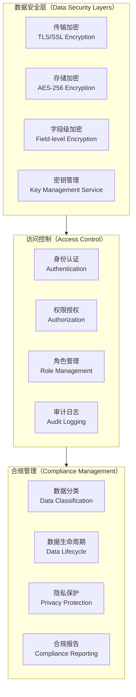

**安全配置表DDL**

```sql
-- 文件名: 009_security_compliance.sql

-- 数据分类表
CREATE TABLE IF NOT EXISTS data_classification (
    classification_id UInt64,
    tenant_id String,
    table_name String,
    field_name String,
    classification_level LowCardinality(String), -- PUBLIC, INTERNAL, CONFIDENTIAL, RESTRICTED
    data_category LowCardinality(String), -- PII, PHI, FINANCIAL, SECURITY, OPERATIONAL
    sensitivity_score Float32,
    retention_period_days UInt32,
    encryption_required Boolean,
    masking_required Boolean,
    access_restrictions String,
    compliance_tags Array(String),
    classification_timestamp DateTime,
    classified_by String,
    created_at DateTime DEFAULT now()
) ENGINE = MergeTree()
PARTITION BY tenant_id
ORDER BY (tenant_id, table_name, field_name)
SETTINGS index_granularity = 8192;

-- 访问审计表
CREATE TABLE IF NOT EXISTS access_audit_log (
    audit_id UInt64,
    tenant_id String,
    user_id String,
    user_role String,
    access_type LowCardinality(String), -- SELECT, INSERT, UPDATE, DELETE, EXPORT
    resource_type LowCardinality(String), -- TABLE, FIELD, API, REPORT
    resource_name String,
    access_method LowCardinality(String), -- API, SQL, DASHBOARD, EXPORT
    client_ip String,
    user_agent String,
    access_result LowCardinality(String), -- SUCCESS, DENIED, ERROR
    data_volume_accessed UInt64,
    sensitive_data_accessed Boolean,
    access_reason String,
    session_id String,
    access_timestamp DateTime,
    created_at DateTime DEFAULT now()
) ENGINE = MergeTree()
PARTITION BY (tenant_id, toYYYYMM(access_timestamp))
ORDER BY (tenant_id, access_timestamp, user_id)
SETTINGS index_granularity = 8192;

-- 合规检查结果表
CREATE TABLE IF NOT EXISTS compliance_check_results (
    check_id UInt64,
    tenant_id String,
    compliance_framework LowCardinality(String), -- GDPR, HIPAA, SOX, PCI_DSS
    check_category LowCardinality(String), -- DATA_RETENTION, ACCESS_CONTROL, ENCRYPTION, AUDIT
    check_name String,
    check_status LowCardinality(String), -- PASSED, FAILED, WARNING, NOT_APPLICABLE
    compliance_score Float32,
    findings_count UInt32,
    critical_findings UInt32,
    high_findings UInt32,
    medium_findings UInt32,
    low_findings UInt32,
    check_details String,
    remediation_required Boolean,
    remediation_steps String,
    check_timestamp DateTime,
    next_check_due DateTime,
    created_at DateTime DEFAULT now()
) ENGINE = MergeTree()
PARTITION BY (tenant_id, toYYYYMM(check_timestamp))
ORDER BY (tenant_id, check_timestamp, compliance_framework)
SETTINGS index_granularity = 8192;
```

### 12.2 隐私保护与数据脱敏

**数据脱敏服务接口**

```yaml
POST /api/v1/privacy/data-masking
Content-Type: application/json
Authorization: Bearer {token}

{
  "masking_request": {
    "request_id": "string, 可选",
    "data_source": {
      "table_name": "user_dim",
      "fields": ["email", "phone", "ssn"],
      "filter_conditions": "department = 'HR'"
    },
    "masking_rules": [
      {
        "field_name": "email",
        "masking_type": "EMAIL_DOMAIN_PRESERVE", -- 保留域名，用户名部分脱敏
        "masking_pattern": "***@company.com"
      },
      {
        "field_name": "phone",
        "masking_type": "PARTIAL_MASK",
        "visible_characters": 4, -- 显示后4位
        "mask_character": "*"
      },
      {
        "field_name": "ssn",
        "masking_type": "FORMAT_PRESERVE_HASH", -- 保持格式，使用哈希
        "hash_algorithm": "SHA256"
      }
    ],
    "output_config": {
      "create_masked_view": true,
      "masked_view_name": "user_dim_masked",
      "retention_period_days": 90
    }
  }
}

# 响应体
{
  "success": true,
  "masking_result": {
    "request_id": "mask_req_001",
    "processing_time_ms": 1200,
    "masked_records_count": 15000,
    "masking_summary": {
      "email": {
        "original_format": "john.doe@company.com", 
        "masked_format": "***@company.com",
        "masking_effectiveness": 0.85
      },
      "phone": {
        "original_format": "123-456-7890",
        "masked_format": "***-***-7890", 
        "masking_effectiveness": 0.70
      },
      "ssn": {
        "original_format": "123-45-6789",
        "masked_format": "abc-de-fghi",
        "masking_effectiveness": 1.0
      }
    },
    "created_resources": {
      "masked_view": "user_dim_masked",
      "access_policy": "policy_masked_user_data"
    },
    "compliance_validation": {
      "gdpr_compliant": true,
      "hipaa_compliant": true,
      "data_minimization_score": 0.9
    }
  }
}
```

### 12.3 合规报告生成接口

**合规性评估接口**

```yaml
GET /api/v1/compliance/assessment
Parameters:
- framework: GDPR|HIPAA|SOX|PCI_DSS|ISO27001
- scope: tenant|table|field
- assessment_date: ISO8601 date

# 响应体
{
  "success": true,
  "compliance_assessment": {
    "assessment_id": "comp_assess_001",
    "framework": "GDPR",
    "assessment_date": "2024-01-15T00:00:00Z",
    "scope": {
      "tenant_id": "tenant_001",
      "included_tables": ["security_event_fact", "user_dim"],
      "excluded_tables": [],
      "assessment_coverage": 0.95
    },
    "overall_compliance_score": 0.87,
    "compliance_status": "SUBSTANTIALLY_COMPLIANT",
    "category_scores": {
      "data_protection": {
        "score": 0.92,
        "status": "COMPLIANT",
        "findings": []
      },
      "access_control": {
        "score": 0.88,
        "status": "COMPLIANT", 
        "findings": [
          {
            "finding_id": "ac_001",
            "severity": "medium",
            "description": "部分用户权限过于宽泛",
            "recommendation": "实施最小权限原则"
          }
        ]
      },
      "data_retention": {
        "score": 0.75,
        "status": "PARTIALLY_COMPLIANT",
        "findings": [
          {
            "finding_id": "dr_001",
            "severity": "high",
            "description": "缺少自动化数据删除策略",
            "recommendation": "配置基于TTL的自动删除规则"
          }
        ]
      },
      "audit_logging": {
        "score": 0.95,
        "status": "COMPLIANT",
        "findings": []
      }
    },
    "data_subject_rights": {
      "right_to_access": {
        "implemented": true,
        "automation_level": "FULLY_AUTOMATED",
        "avg_response_time_hours": 2
      },
      "right_to_rectification": {
        "implemented": true,
        "automation_level": "SEMI_AUTOMATED",
        "avg_response_time_hours": 24
      },
      "right_to_erasure": {
        "implemented": true,
        "automation_level": "FULLY_AUTOMATED",
        "avg_response_time_hours": 1
      },
      "right_to_portability": {
        "implemented": false,
        "reason": "技术实现复杂",
        "planned_implementation": "Q2 2024"
      }
    },
    "risk_assessment": [
      {
        "risk_category": "data_breach",
        "risk_level": "MEDIUM",
        "probability": 0.3,
        "impact": "HIGH",
        "mitigation_measures": ["加密", "访问控制", "监控"]
      }
    ],
    "remediation_plan": [
      {
        "finding_id": "dr_001",
        "priority": "high",
        "remediation_steps": [
          "配置ClickHouse TTL策略",
          "实施自动化删除脚本",
          "建立删除验证流程"
        ],
        "estimated_effort": "1 week",
        "target_completion_date": "2024-02-01T00:00:00Z"
      }
    ],
    "next_assessment_due": "2024-04-15T00:00:00Z"
  }
}
```

## 13. 总结

本设计文档提供了一个全面的多安全产品共享数据湖解决方案，涵盖了从底层数据库设计到上层AI增强服务的完整技术栈。设计的核心特点包括：

**技术创新性**：

* 采用星型模型设计确保高性能查询，支持ClickHouse和StarRocks双引擎架构
* 集成OCSF标准化数据模型，实现跨厂商安全产品的统一数据格式
* 融合Detection GPT和Security Operation GPT，提供AI驱动的威胁检测和安全运营能力
* 实现租户级数据隔离，确保多租户环境下的数据安全

**架构完整性**：

* 从数据采集、传输、处理、存储到应用服务的端到端设计
* 完整的API接口设计，支持RESTful风格的数据上报和查询服务
* 全面的数据治理体系，包括数据质量监控、血缘追踪和合规管理
* 智能运维监控和预测性维护能力

**实用性与可扩展性**：

* 支持水平扩展的分布式架构设计
* 灵活的数据分区和索引策略，满足不同查询场景需求
* 完整的安全合规框架，满足GDPR、HIPAA等法规要求
* 丰富的性能优化策略和运维监控能力

## 14. 实施路线图

### 14.1 分阶段实施计划

```mermaid
gantt
    title 数据湖实施路线图（相对阶段长短对比）
    dateFormat  X
    axisFormat  %s

    section 基础设施
    集群环境搭建           :done,    infra1, 0, 1
    基础网络配置           :done,    infra2, after infra1, 1
    安全认证体系           :active,  infra3, after infra2, 2

    section 核心数据层
    核心表结构设计         :done,    core1, 0, 1
    索引和分区配置         :active,  core2, after core1, 1
    数据导入工具开发       :         core3, after core2, 2

    section API服务
    数据上报API开发        :         api1, after core3, 2
    查询服务API开发        :         api2, after api1, 2
    SASE专用接口开发       :         api3, after api2, 2

    section AI增强服务
    Detection GPT集成      :         ai1, after api3, 3
    Security Ops GPT开发   :         ai2, after ai1, 3
    智能规则生成           :         ai3, after ai2, 2

    section 治理监控
    数据质量监控           :         gov1, after ai1, 1
    性能监控仪表板         :         gov2, after gov1, 2
    合规报告系统           :         gov3, after gov2, 2

```

### 14.2 技术选型建议

**数据库引擎选择**：

* **ClickHouse**：适用于实时分析、时序数据查询、高并发场景
* **StarRocks**：适用于复杂关联查询、多维分析、BI报表场景
* **混合部署**：根据查询模式自动路由到最适合的引擎

**部署架构推荐**：

* **生产环境**：Kubernetes + Docker容器化部署
* **存储**：对象存储（S3/MinIO）+ SSD本地缓存
* **网络**：VPC内网 + API网关 + CDN加速
* **监控**：Prometheus + Grafana + ELK Stack

### 14.3 关键成功因素

**技术层面**：

1. **性能优化**：合理设计分区策略和索引，确保查询性能
2. **数据质量**：建立完善的数据验证和清洗机制
3. **可扩展性**：采用微服务架构，支持水平扩展
4. **安全合规**：从设计阶段就考虑安全和合规要求

**管理层面**：

1. **数据治理**：建立数据标准和管理流程
2. **运维监控**：实现7×24小时监控和自动化运维
3. **团队培训**：确保团队掌握相关技术和最佳实践
4. **渐进式迁移**：分阶段迁移现有系统，降低风险

## 15. 附录

### 15.1 OCSF映射示例基于搜索结果，让我获取更详细的OCSF映射信息：让我查找OCSF映射的具体示例：基于搜索结果，我将为您提供OCSF映射示例：

### 15.1 OCSF映射示例

**网络活动事件映射（Network Activity Event）**

```json
{
  "metadata": {
    "version": "1.3.0",
    "product": {
      "name": "Firewall Pro",
      "vendor_name": "Security Corp"
    },
    "profiles": ["security_control"]
  },
  "time": 1640995200000,
  "class_uid": 4001,
  "category_uid": 4,
  "class_name": "Network Activity",
  "category_name": "Network Activity",
  "activity_id": 1,
  "activity_name": "Allow",
  "type_uid": 400101,
  "type_name": "Network Activity: Allow",
  "severity_id": 1,
  "severity": "Informational",
  "connection_info": {
    "direction_id": 1,
    "direction": "Inbound",
    "protocol_num": 6,
    "protocol_name": "TCP"
  },
  "src_endpoint": {
    "ip": "192.168.1.100",
    "port": 12345,
    "hostname": "client-workstation"
  },
  "dst_endpoint": {
    "ip": "10.0.1.50", 
    "port": 443,
    "hostname": "web-server-01"
  },
  "traffic": {
    "bytes_in": 2048,
    "bytes_out": 8192,
    "packets_in": 15,
    "packets_out": 12
  },
  "device": {
    "uid": "fw-001",
    "name": "Border Firewall",
    "type": "Firewall",
    "ip": "10.0.0.1"
  }
}
```

**身份认证事件映射（Authentication Event）**

根据OCSF框架的设计，认证事件属于IAM（身份和访问管理）类别，用于标准化认证相关的日志和事件：

```json
{
  "metadata": {
    "version": "1.3.0",
    "product": {
      "name": "AD Domain Controller",
      "vendor_name": "Microsoft"
    }
  },
  "time": 1640995200000,
  "class_uid": 3002,
  "category_uid": 3,
  "class_name": "Authentication",
  "category_name": "Identity & Access Management",
  "activity_id": 1,
  "activity_name": "Logon",
  "type_uid": 300201,
  "type_name": "Authentication: Logon",
  "severity_id": 1,
  "severity": "Informational",
  "status_id": 1,
  "status": "Success",
  "user": {
    "name": "john.doe",
    "type": "User",
    "domain": "corp.company.com",
    "uid": "S-1-5-21-123456789-1234567890-123456789-1001"
  },
  "device": {
    "uid": "WS-JOHN-001",
    "name": "JOHN-LAPTOP",
    "type": "Computer",
    "os": {
      "name": "Windows 11 Pro",
      "version": "22H2"
    },
    "ip": "192.168.1.150"
  },
  "src_endpoint": {
    "ip": "192.168.1.150",
    "hostname": "john-laptop.corp.company.com"
  },
  "auth_protocol": "Kerberos",
  "logon_type": "Interactive",
  "session": {
    "uid": "session_12345",
    "created_time": 1640995200000
  }
}
```

**Web应用安全事件映射（HTTP Activity Event）**

```json
{
  "metadata": {
    "version": "1.3.0",
    "product": {
      "name": "Web Application Firewall",
      "vendor_name": "CloudFlare"
    }
  },
  "time": 1640995200000,
  "class_uid": 4002,
  "category_uid": 4,
  "class_name": "HTTP Activity", 
  "category_name": "Network Activity",
  "activity_id": 2,
  "activity_name": "Deny",
  "type_uid": 400202,
  "type_name": "HTTP Activity: Deny",
  "severity_id": 3,
  "severity": "Medium",
  "http_request": {
    "url": {
      "url_string": "https://example.com/admin/config.php",
      "hostname": "example.com",
      "path": "/admin/config.php",
      "scheme": "https"
    },
    "http_method": "POST",
    "user_agent": "Mozilla/5.0 (compatible; BadBot/1.0)",
    "http_headers": [
      {
        "name": "Content-Type",
        "value": "application/x-www-form-urlencoded"
      }
    ]
  },
  "http_response": {
    "code": 403,
    "message": "Forbidden"
  },
  "src_endpoint": {
    "ip": "45.76.123.45",
    "country": "Unknown"
  },
  "dst_endpoint": {
    "ip": "203.0.113.10",
    "port": 443
  },
  "malware": [
    {
      "name": "SQL Injection Attempt",
      "class_uid": 2001,
      "confidence": 95,
      "rule_uid": "WAF-SQL-001"
    }
  ],
  "attacks": [
    {
      "technique": {
        "uid": "T1190",
        "name": "Exploit Public-Facing Application"
      },
      "tactic": {
        "uid": "TA0001", 
        "name": "Initial Access"
      }
    }
  ]
}
```

### 15.2 常用OCSF事件类别映射表

| 原始日志类型  | OCSF类别               | OCSF事件类              | Class UID | 主要用途       |
| ------- | -------------------- | -------------------- | --------- | ---------- |
| 防火墙日志   | Network Activity     | Network Activity     | 4001      | 网络连接和流量分析  |
| WAF日志   | Network Activity     | HTTP Activity        | 4002      | Web应用安全分析  |
| DNS查询日志 | Network Activity     | DNS Activity         | 4003      | DNS查询和解析分析 |
| 认证日志    | IAM                  | Authentication       | 3002      | 用户认证事件分析   |
| 授权日志    | IAM                  | Authorize Session    | 3003      | 访问授权事件分析   |
| 进程日志    | System Activity      | Process Activity     | 1007      | 进程执行和监控    |
| 文件操作日志  | System Activity      | File System Activity | 1001      | 文件访问和修改监控  |
| 邮件安全日志  | Application Activity | Email Activity       | 6001      | 电子邮件安全分析   |

### 15.3 数据映射转换示例代码

```python
# 文件名: ocsf_mapper.py

import json
from datetime import datetime
from typing import Dict, Any, Optional

class OCSFMapper:
    """OCSF数据映射转换器"""
    
    def __init__(self):
        self.version = "1.3.0"
        
    def map_firewall_log(self, raw_log: Dict[str, Any]) -> Dict[str, Any]:
        """防火墙日志转换为OCSF Network Activity事件"""
        
        # 提取时间戳
        timestamp = self._parse_timestamp(raw_log.get('timestamp'))
        
        # 确定活动类型
        action = raw_log.get('action', 'unknown').lower()
        activity_id = 1 if action == 'allow' else 2  # 1=Allow, 2=Deny
        
        # 构建OCSF事件
        ocsf_event = {
            "metadata": {
                "version": self.version,
                "product": {
                    "name": raw_log.get('device_model', 'Unknown Firewall'),
                    "vendor_name": raw_log.get('vendor', 'Unknown')
                }
            },
            "time": int(timestamp.timestamp() * 1000),
            "class_uid": 4001,
            "category_uid": 4,
            "class_name": "Network Activity",
            "category_name": "Network Activity",
            "activity_id": activity_id,
            "activity_name": action.title(),
            "type_uid": 400100 + activity_id,
            "severity_id": self._map_severity(raw_log.get('severity', 'info')),
            "connection_info": {
                "protocol_name": raw_log.get('protocol', 'TCP').upper(),
                "direction": raw_log.get('direction', 'Unknown')
            },
            "src_endpoint": {
                "ip": raw_log.get('src_ip'),
                "port": raw_log.get('src_port'),
                "hostname": raw_log.get('src_hostname')
            },
            "dst_endpoint": {
                "ip": raw_log.get('dst_ip'), 
                "port": raw_log.get('dst_port'),
                "hostname": raw_log.get('dst_hostname')
            },
            "device": {
                "uid": raw_log.get('device_id'),
                "name": raw_log.get('device_name'),
                "type": "Firewall",
                "ip": raw_log.get('device_ip')
            },
            "raw_data": json.dumps(raw_log)  # 保留原始数据
        }
        
        # 添加流量统计信息（如果可用）
        if 'bytes_in' in raw_log or 'bytes_out' in raw_log:
            ocsf_event["traffic"] = {
                "bytes_in": raw_log.get('bytes_in', 0),
                "bytes_out": raw_log.get('bytes_out', 0),
                "packets_in": raw_log.get('packets_in', 0),
                "packets_out": raw_log.get('packets_out', 0)
            }
            
        return ocsf_event
    
    def map_authentication_log(self, raw_log: Dict[str, Any]) -> Dict[str, Any]:
        """认证日志转换为OCSF Authentication事件"""
        
        timestamp = self._parse_timestamp(raw_log.get('timestamp'))
        
        # 确定认证结果
        result = raw_log.get('result', 'unknown').lower()
        status_id = 1 if result in ['success', 'granted'] else 2
        
        ocsf_event = {
            "metadata": {
                "version": self.version,
                "product": {
                    "name": raw_log.get('auth_system', 'Authentication System'),
                    "vendor_name": raw_log.get('vendor', 'Unknown')
                }
            },
            "time": int(timestamp.timestamp() * 1000),
            "class_uid": 3002,
            "category_uid": 3,
            "class_name": "Authentication",
            "category_name": "Identity & Access Management", 
            "activity_id": self._map_auth_activity(raw_log.get('auth_type', 'logon')),
            "status_id": status_id,
            "status": "Success" if status_id == 1 else "Failure",
            "severity_id": 1 if status_id == 1 else 2,
            "user": {
                "name": raw_log.get('username'),
                "type": "User",
                "domain": raw_log.get('domain'),
                "uid": raw_log.get('user_id')
            },
            "device": {
                "uid": raw_log.get('device_id'),
                "name": raw_log.get('device_name'),
                "type": raw_log.get('device_type', 'Computer'),
                "ip": raw_log.get('device_ip')
            },
            "src_endpoint": {
                "ip": raw_log.get('src_ip'),
                "hostname": raw_log.get('src_hostname')
            },
            "auth_protocol": raw_log.get('auth_protocol'),
            "raw_data": json.dumps(raw_log)
        }
        
        return ocsf_event
    
    def _parse_timestamp(self, ts_string: str) -> datetime:
        """解析时间戳字符串"""
        if not ts_string:
            return datetime.now()
        
        # 尝试多种时间格式
        formats = [
            "%Y-%m-%d %H:%M:%S",
            "%Y-%m-%dT%H:%M:%SZ", 
            "%Y-%m-%dT%H:%M:%S.%fZ"
        ]
        
        for fmt in formats:
            try:
                return datetime.strptime(ts_string, fmt)
            except ValueError:
                continue
                
        return datetime.now()
    
    def _map_severity(self, severity: str) -> int:
        """映射严重级别"""
        severity_map = {
            'critical': 5,
            'high': 4,
            'medium': 3,
            'low': 2,
            'info': 1,
            'informational': 1
        }
        return severity_map.get(severity.lower(), 1)
    
    def _map_auth_activity(self, auth_type: str) -> int:
        """映射认证活动类型"""
        activity_map = {
            'logon': 1,
            'logoff': 2,
            'authentication_ticket': 3,
            'service_ticket': 4
        }
        return activity_map.get(auth_type.lower(), 1)

# 使用示例
mapper = OCSFMapper()

# 防火墙日志映射
firewall_log = {
    "timestamp": "2024-01-15 10:30:45",
    "action": "allow",
    "src_ip": "192.168.1.100",
    "src_port": 12345,
    "dst_ip": "10.0.1.50",
    "dst_port": 443,
    "protocol": "tcp",
    "device_id": "fw-001",
    "device_name": "Border Firewall",
    "bytes_in": 2048,
    "bytes_out": 8192
}

ocsf_network_event = mapper.map_firewall_log(firewall_log)
```

这个完整的设计文档为企业安全数据湖提供了全面的技术架构和实施指导，结合了最新的OCSF标准（现已加入Linux基金会）和现代数据湖技术，能够有效支持多安全产品的数据集成、AI增强的威胁检测和智能化的安全运营。
