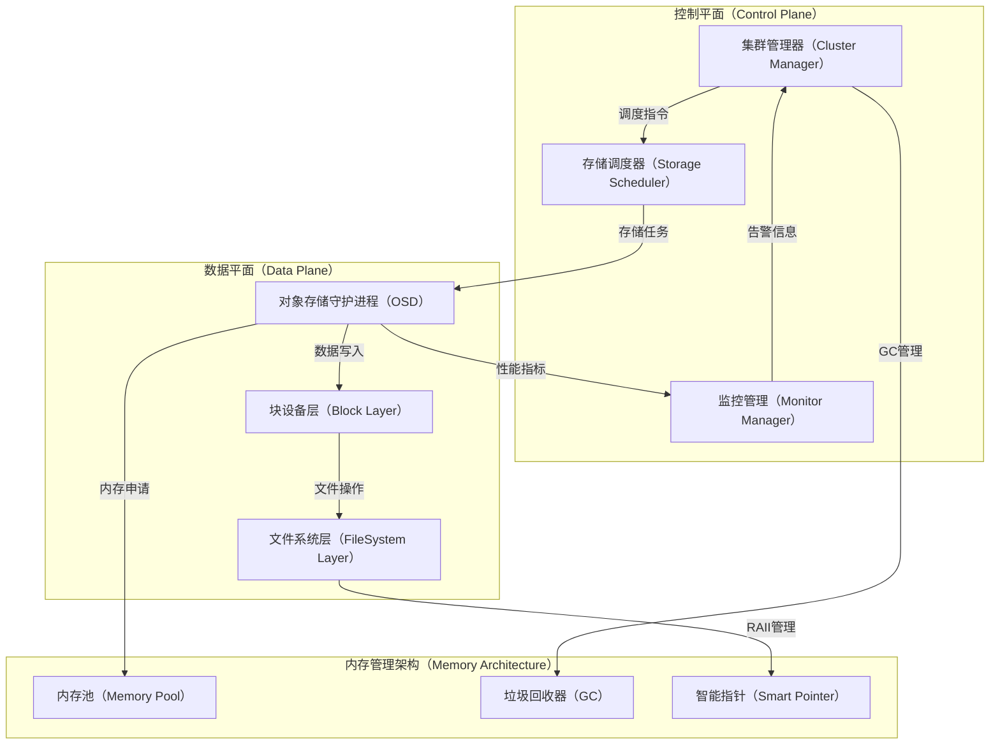
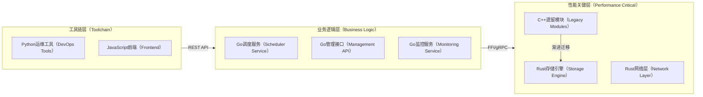
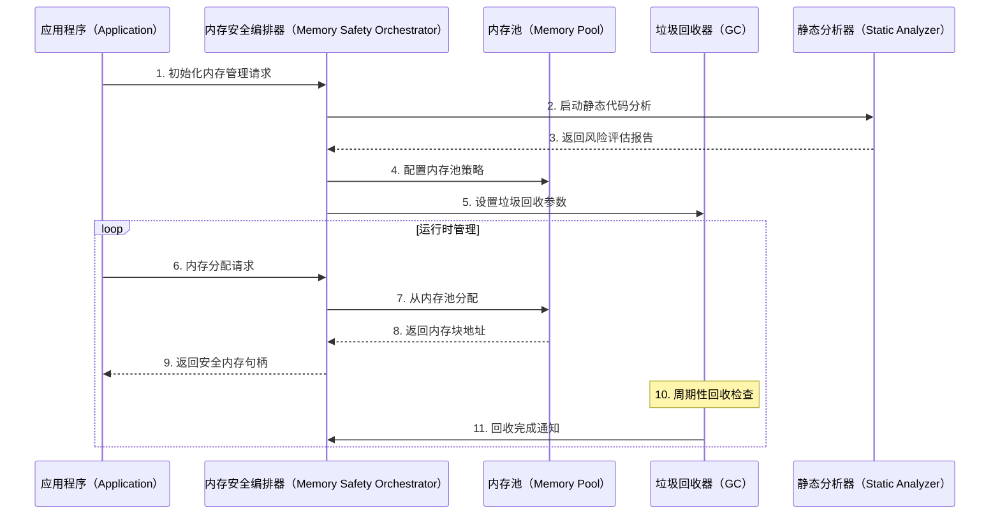
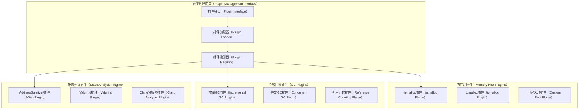
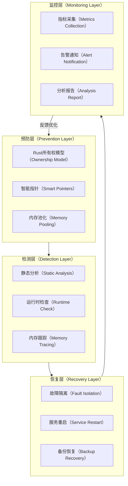
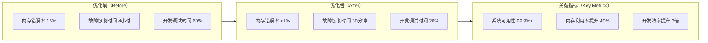
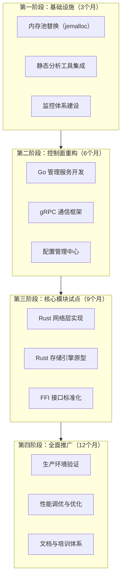
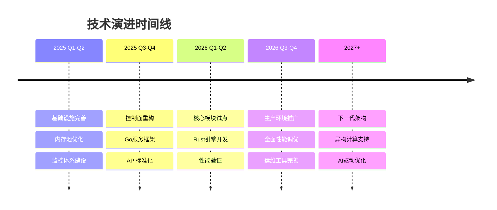

# 分布式存储系统内存安全架构设计方案

## Overview 概述

本文档详细设计了一个基于"渐进式内存安全"理念的分布式存储系统架构方案，旨在解决传统 C/C++ 存储系统中频发的内存管理问题。该方案采用分层混合架构模式，在核心高性能数据平面引入 Rust 替代传统 C++，在控制与调度层采用 Go 提高开发效率，同时通过内存池、静态分析和智能指针机制增强现有模块的安全性。

此架构设计面向大规模分布式存储场景，重点解决内存泄漏、悬空指针、内存越界访问等关键问题，在保障存储性能的前提下显著提升系统可靠性和可维护性。

## 相关背景知识与问题分析

### 当前技术栈挑战

在现有分布式存储系统（如 Ceph）的开发实践中，C/C++ 作为主要实现语言面临以下核心挑战：

1. **内存生命周期管理复杂性**：大规模并发场景下，对象分配与释放时机难以精确控制
2. **多线程内存竞争**：并发访问共享内存区域时的竞态条件和数据一致性问题
3. **调试复现困难**：内存错误往往具有延迟性和随机性，生产环境问题定位耗时长
4. **维护成本高昂**：熟练的 C++ 内存管理人员稀缺，代码审查和重构风险大

### 数据流与控制流架构



上图展示了分布式存储系统的核心数据流与控制流。控制平面负责集群调度和监控管理，数据平面处理实际的存储 I/O 操作，内存管理架构横跨两个平面提供统一的内存安全保障。数据流从控制平面的调度指令开始，经过存储调度器分发到各个 OSD 节点，最终完成块设备和文件系统层面的数据操作。

## 核心组件详细设计

### 混合语言架构策略



该分层架构明确了不同语言的职责边界：性能关键的存储引擎和网络层采用 Rust 实现，确保内存安全和零成本抽象；业务逻辑层使用 Go 开发，提升开发效率和并发处理能力；工具链层保留 Python 和 JavaScript 生态优势。

### 内存安全编排器（Memory Safety Orchestrator）

编排器作为整个内存安全架构的核心控制组件，负责解析内存管理策略、加载适配的内存管理插件，并协调各个组件的内存生命周期。



编排器通过时序控制确保内存管理操作的原子性和一致性。初始化阶段进行静态分析和策略配置，运行时阶段提供内存分配的统一入口，并协调垃圾回收器的周期性清理工作。

### 插件化内存管理接口



插件化设计允许根据不同的存储场景和性能要求动态选择最适合的内存管理策略。接口统一、实现多样化的设计理念确保了架构的可扩展性和兼容性。

## DFX问题全景与解决方案

### 问题分类与影响分析

| 问题类型                   | 影响程度 | 发生频率 | 检测难度 | 修复成本 |
| ---------------------- | ---- | ---- | ---- | ---- |
| 内存泄漏（Memory Leak）      | 高    | 高    | 中等   | 中等   |
| 悬空指针（Dangling Pointer） | 极高   | 中等   | 高    | 高    |
| 内存越界（Buffer Overflow）  | 极高   | 中等   | 高    | 高    |
| 重复释放（Double Free）      | 极高   | 低    | 中等   | 中等   |
| 内存碎片（Fragmentation）    | 中等   | 高    | 低    | 低    |
| 竞态条件（Race Condition）   | 高    | 中等   | 极高   | 极高   |

### 分层解决方案设计



分层解决方案通过预防、检测、恢复和监控四个层次构建了完整的DFX保障体系。每一层都有明确的职责分工和技术手段，形成了从问题预防到故障恢复的闭环管理机制。

### 关键技术实现策略

#### Rust 所有权模型集成

```rust
// 示例：安全的内存管理接口
pub struct SafeStorageBuffer {
    data: Vec<u8>,
    capacity: usize,
}

impl SafeStorageBuffer {
    pub fn new(capacity: usize) -> Self {
        Self {
            data: Vec::with_capacity(capacity),
            capacity,
        }
    }
    
    pub fn write(&mut self, offset: usize, data: &[u8]) -> Result<(), StorageError> {
        if offset + data.len() > self.capacity {
            return Err(StorageError::BufferOverflow);
        }
        // 编译期保证内存安全
        self.data[offset..offset + data.len()].copy_from_slice(data);
        Ok(())
    }
}
```

#### Go 控制平面实现

```go
// 内存使用监控与自动回收
type MemoryMonitor struct {
    threshold    int64
    gcTrigger    chan struct{}
    metrics      *MemoryMetrics
}

func (m *MemoryMonitor) StartMonitoring() {
    go func() {
        ticker := time.NewTicker(30 * time.Second)
        for {
            select {
            case <-ticker.C:
                if m.getCurrentUsage() > m.threshold {
                    runtime.GC()
                    m.metrics.RecordGCEvent()
                }
            case <-m.gcTrigger:
                return
            }
        }
    }()
}
```

## 预期效果全景与技术预研

### 性能与可靠性提升预期



### 技术预研计划

| 技术项           | 工作量预估 | 挑战与风险          | 预期成果             |
| ------------- | ----- | -------------- | ---------------- |
| Rust 存储引擎原型开发 | 3人月   | 学习曲线陡峭，FFI接口复杂 | 核心模块 Rust 化可行性验证 |
| Go 控制平面架构设计   | 2人月   | gRPC 性能调优，服务治理 | 分布式调度系统原型        |
| 内存池性能基准测试     | 1人月   | 多线程竞争，内存碎片评估   | 最优内存池方案选型        |
| 静态分析工具链集成     | 1.5人月 | 误报率控制，CI/CD 集成 | 自动化代码质量检查        |
| 混合架构通信机制      | 2人月   | 跨语言调用开销，序列化性能  | 高效的多语言协作方案       |
| 故障注入与恢复测试     | 1.5人月 | 测试用例设计，环境搭建    | 系统鲁棒性验证报告        |

### 业界最佳实践对比分析

| 方案            | 代表产品               | 技术栈            | 优势            | 劣势           | 适用场景     |
| ------------- | ------------------ | -------------- | ------------- | ------------ | -------- |
| 纯 C++ + 智能指针  | Ceph, GlusterFS    | C++17/20, RAII | 性能最优，生态成熟     | 开发门槛高，内存安全风险 | 极致性能要求   |
| Rust 重写核心     | TiKV, FoundationDB | Rust + Go      | 内存安全，现代语法     | 生态相对较小，人才稀缺  | 新项目或核心重构 |
| JVM 生态        | HDFS, Cassandra    | Java/Scala     | 开发效率高，工具丰富    | GC 停顿，内存占用大  | 企业级应用    |
| Go 全栈         | etcd, CockroachDB  | Go + gRPC      | 简洁高效，并发友好     | 单线程性能限制      | 云原生场景    |
| **本方案（混合架构）** | 创新设计               | Rust+Go+C++    | 性能与安全兼顾，渐进式迁移 | 复杂性较高，多技术栈   | 大规模生产环境  |

### 商业存储系统案例分析

1. **Amazon S3**: 采用 C++ 核心 + Java 服务层的混合架构，通过 JNI 实现高性能与易维护性的平衡
2. **Google Cloud Storage**: 基于 C++ 和 Go 的分层设计，数据路径用 C++ 优化，控制逻辑用 Go 实现
3. **Microsoft Azure Storage**: .NET Core + C++ 的组合，利用托管内存和原生性能的双重优势
4. **阿里云 OSS**: 自研 C++ 存储引擎 + Java 服务框架，重点投入内存管理和并发优化

## 实施路径与风险管控

### 渐进式迁移策略



### 关键风险点与应对策略

| 风险类别 | 具体风险       | 影响程度 | 应对策略          |
| ---- | ---------- | ---- | ------------- |
| 技术风险 | Rust 学习成本高 | 高    | 制定培训计划，引入外部专家 |
| 性能风险 | FFI 调用开销   | 中等   | 建立性能基线，持续优化   |
| 集成风险 | 多语言协作复杂    | 高    | 标准化接口，自动化测试   |
| 人员风险 | 技术栈切换阻力    | 中等   | 渐进式迁移，保持兼容性   |
| 时间风险 | 开发周期延长     | 中等   | 分阶段实施，并行开发    |

## 技术展望与演进方向

### 下一代存储架构趋势

随着硬件技术的发展和业务需求的演进，分布式存储系统正朝着以下方向发展：

1. **异构计算融合**：CPU、GPU、FPGA 协同计算，内存管理需要跨设备协调
2. **持久化内存（PMem）**：存储与内存边界模糊，传统内存管理模式面临挑战
3. **容器化与微服务**：细粒度的资源隔离对内存管理提出更高要求
4. **智能化运维**：基于机器学习的内存使用预测和自动优化

### 技术路线规划



本设计方案通过系统性的架构改进和技术创新，为分布式存储系统的内存安全问题提供了完整的解决思路。在保障高性能存储能力的同时，显著提升了系统的可靠性和可维护性，为企业级存储服务的长期稳定运行奠定了坚实基础。

## 参考资料

\[1] Rust官方文档 - 所有权和借用检查: [https://doc.rust-lang.org/book/ch04-00-understanding-ownership.html](https://doc.rust-lang.org/book/ch04-00-understanding-ownership.html)

\[2] Go语言内存管理和垃圾回收机制: [https://go.dev/doc/gc-guide](https://go.dev/doc/gc-guide)

\[3] jemalloc内存分配器性能分析: [https://jemalloc.net/](https://jemalloc.net/)

\[4] Ceph分布式存储架构设计: [https://docs.ceph.com/en/latest/architecture/](https://docs.ceph.com/en/latest/architecture/)

\[5] TiKV分布式键值存储系统: [https://tikv.org/docs/](https://tikv.org/docs/)

\[6] AddressSanitizer内存错误检测工具: [https://clang.llvm.org/docs/AddressSanitizer.html](https://clang.llvm.org/docs/AddressSanitizer.html)

\[7] 分布式系统内存安全最佳实践: [https://www.usenix.org/conference/osdi18/presentation/zhang](https://www.usenix.org/conference/osdi18/presentation/zhang)
