# 企业级分布式存储系统全新 RPC 协议预研方案

## 概述

企业级分布式存储系统作为现代数据中心的核心基础设施，面临着前所未有的性能、可靠性和扩展性挑战。传统的单一协议架构已无法满足企业级应用对低延迟、高吞吐、强一致性的综合需求。本方案提出了一种全新的多层次、多协议融合的RPC框架设计，通过协议层多样化选择与实现层内核旁路技术的深度结合，构建面向新一代数据中心的企业级分布式存储通信基础设施。

该方案的核心创新在于：建立控制平面与数据平面分离的双平面架构，在控制平面确保稳定性与兼容性的同时，在数据平面追求极致性能；通过DPDK/SPDK等内核旁路框架实现底层I/O加速；提供统一的API抽象层，支持业务无缝集成和协议自适应切换。

## 背景知识

### 分布式存储通信挑战

现代企业级分布式存储系统面临的核心挑战包括：

**性能挑战**：随着NVMe SSD等高性能存储介质的普及，传统网络协议栈成为系统瓶颈。内核态与用户态的频繁切换、内存拷贝开销、中断处理延迟等因素显著制约了系统整体性能。

**可扩展性挑战**：企业级存储集群规模动辄数千节点，传统的TCP连接管理、路由发现、负载均衡等机制在大规模场景下表现出明显的可扩展性瓶颈。

**可靠性挑战**：分布式存储系统对数据一致性、故障恢复、网络分区容忍性有着极高要求，需要通信协议在性能与可靠性之间取得精确平衡。

### 技术发展趋势

**协议栈演进**：从传统TCP/IP向RDMA、QUIC等新兴协议的演进，以及NVMe-oF、iSCSI等存储特化协议的发展，为分布式存储通信提供了更多选择。

**硬件加速**：InfiniBand、RoCE、智能网卡等硬件技术的成熟，为高性能通信提供了硬件基础。DPDK、SPDK等内核旁路技术的发展，使得软件层面的性能优化成为可能。

**云原生化**：容器化、微服务化、多云部署等趋势对存储系统的灵活性、可移植性提出了新的要求。

## 核心组件

### 协议适配层 (Protocol Adaptation Layer)

协议适配层作为整个RPC框架的核心，负责统一抽象不同传输协议的接口差异，提供一致的编程模型。

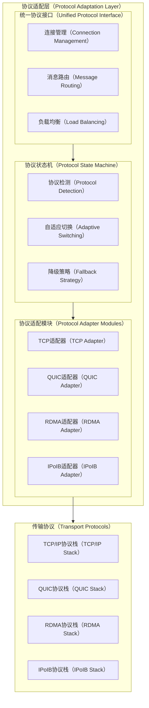

**统一协议接口**提供标准的连接建立、数据传输、错误处理等API，屏蔽底层协议差异。**协议状态机**负责运行时的协议选择和切换决策，基于网络状况、硬件能力、应用需求等因素进行智能选择。**协议适配模块**实现各种传输协议的具体适配逻辑。

### 双平面通信架构 (Dual-Plane Communication Architecture)

基于控制平面与数据平面分离的设计理念，构建专业化的双平面通信架构。

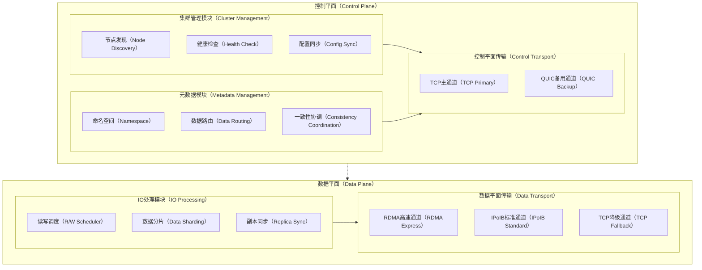

控制平面专注于集群管理、元数据同步、一致性协调等关键但相对低频的操作，采用成熟稳定的TCP协议，必要时结合QUIC提升跨域性能。数据平面专门处理用户I/O操作，采用RDMA等高性能协议，在硬件不支持时自动降级到IPoIB或TCP。

### 内核旁路加速引擎 (Kernel Bypass Acceleration Engine)

集成DPDK和SPDK技术，构建完整的内核旁路加速栈。

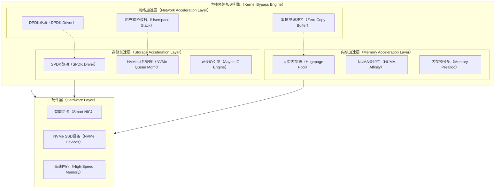

网络加速层通过DPDK实现用户态网卡驱动和协议栈，消除内核切换开销。存储加速层通过SPDK实现用户态存储协议栈，支持NVMe-oF等现代存储协议。内存加速层通过大页内存、NUMA感知等技术优化内存访问性能。

### 智能QoS与流控系统 (Intelligent QoS and Flow Control)

提供细粒度的服务质量保证和流量控制能力。

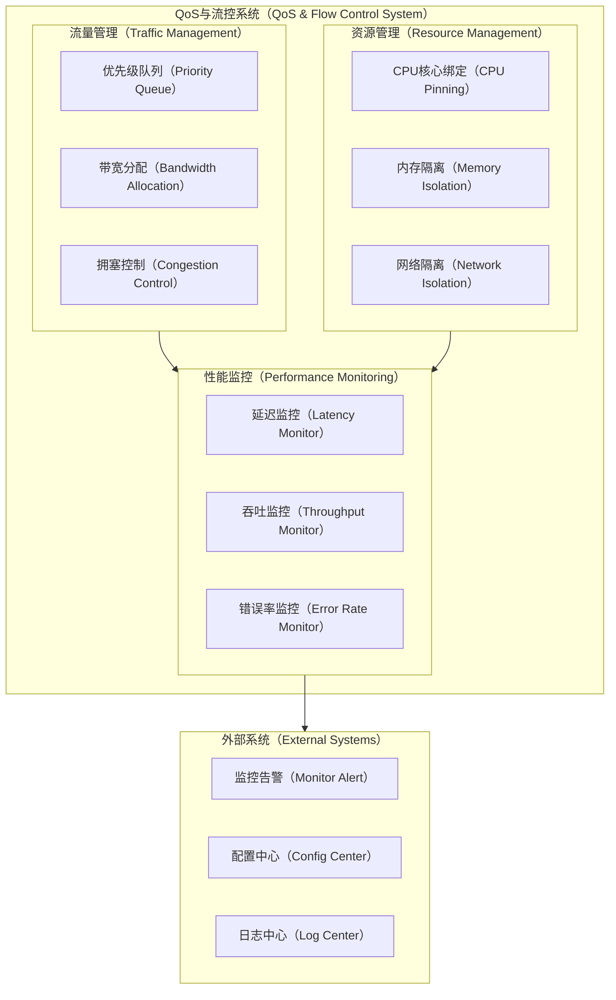

流量管理模块实现多级优先级队列、动态带宽分配、智能拥塞控制等功能。资源管理模块提供CPU、内存、网络等资源的隔离和分配能力。性能监控模块实时监控系统关键指标，为QoS策略调整提供数据支持。

## 核心架构

### 整体系统架构

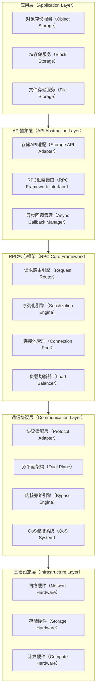

整体架构采用分层设计，从上到下分别为应用层、API抽象层、RPC核心框架、通信协议层和基础设施层。每层都有明确的职责边界和标准的接口定义，确保系统的模块化和可维护性。

### 协议选择决策流程

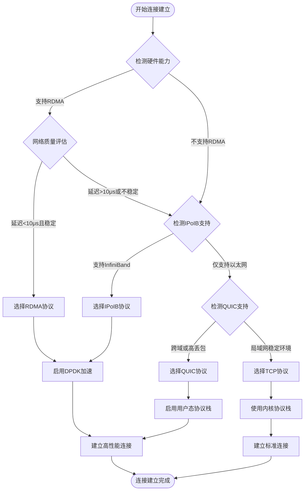

协议选择采用多层次决策机制，首先检测硬件能力，然后基于网络质量、应用需求等因素选择最适合的协议。系统支持运行时动态协议切换，在网络环境变化时自动调整。

### 数据流处理架构

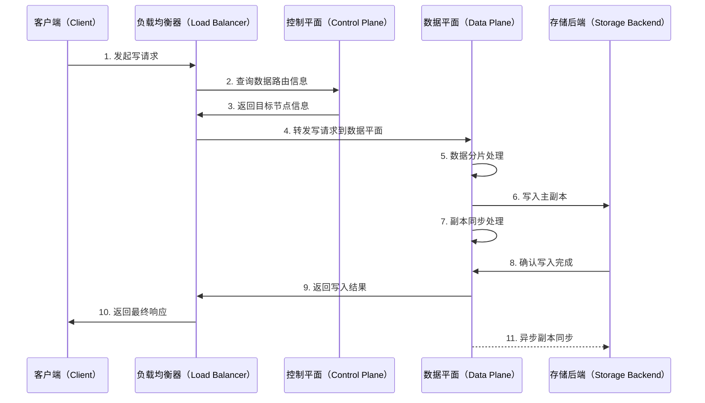

数据流处理采用异步化设计，控制平面负责路由决策，数据平面专注于高性能I/O处理。写操作采用主副本先写、异步同步的策略，在一致性和性能之间取得平衡。

## 可扩展架构

### 水平扩展机制

系统支持节点动态加入和退出，采用一致性哈希算法实现数据的自动重分布。新节点加入时，系统自动检测其硬件能力和网络拓扑位置，动态调整路由策略和负载均衡权重。

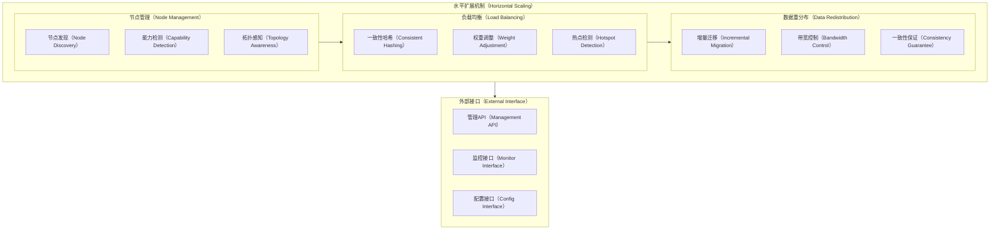

### 协议扩展机制

框架提供标准的协议扩展接口，支持新协议的快速集成。扩展机制包括协议注册、能力声明、适配器实现等标准流程。

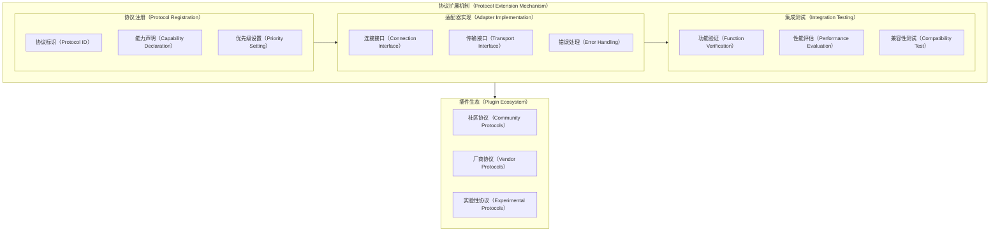

### 多云部署支持

支持跨云、混合云等复杂部署场景，提供统一的管理和监控能力。

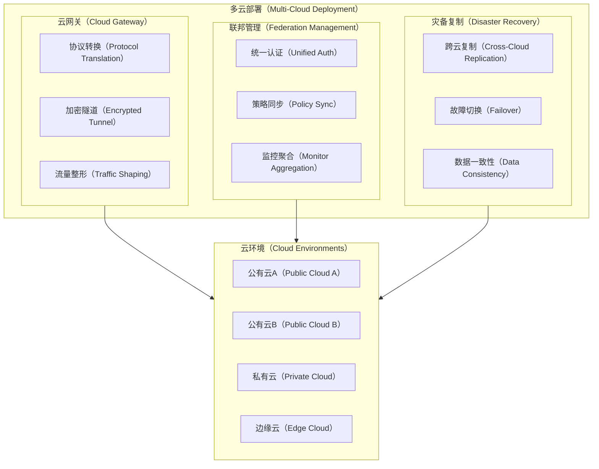

## DFX问题全景与解决方案

### 设计问题全景 (Design Issues)

**协议兼容性问题**：不同协议栈之间的语义差异、错误处理机制不一致、性能特征差异等问题可能导致系统行为不一致。

**性能隔离问题**：多租户场景下，不同业务负载之间的性能干扰、资源竞争等问题可能影响服务质量。

**故障传播问题**：分布式系统中的故障可能通过网络连接传播，导致级联失效。

### 功能问题全景 (Functional Issues)

**一致性保证问题**：在网络分区、节点故障等场景下，如何保证数据的强一致性或最终一致性。

**负载均衡问题**：在节点能力差异、网络拓扑变化等情况下，如何实现智能负载分配。

**自动故障恢复问题**：如何实现故障的快速检测、自动切换和透明恢复。

### 体验问题全景 (Experience Issues)

**性能可预测性问题**：如何为业务应用提供可预测的性能SLA。

**运维复杂性问题**：如何简化多协议、多平面架构的配置和管理。

**监控可观测性问题**：如何提供完整的系统可观测性和故障诊断能力。

### 解决方案全景

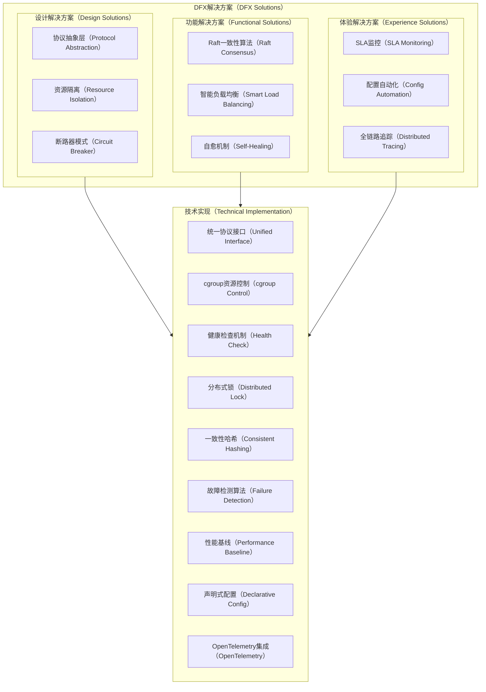

### 预期效果全景

**性能效果**：

* 数据平面延迟降低至10μs以内（RDMA场景）
* 吞吐量提升300%以上（相比传统TCP）
* CPU开销降低50%（通过内核旁路）

**可靠性效果**：

* 系统可用性达到99.99%
* 故障恢复时间控制在秒级
* 数据一致性保证100%

**可扩展性效果**：

* 支持10000+节点规模
* 节点动态扩缩容时间<30秒
* 线性扩展性能比>0.8

**运维效果**：

* 配置复杂度降低70%
* 故障定位时间缩短80%
* 运维自动化程度达到90%

## 业界最佳实践对比

### 商业存储系统对比| 厂商系统 | 协议支持 | 内核旁路 | 性能特征 | 优势 | 劣势 |

\|---------|---------|---------|---------|------|------|
\| NetApp ONTAP | 支持NFS over RDMA、NVMe-oF over InfiniBand和RoCE | 部分支持RDMA | 100Gbps InfiniBand支持 | 企业级特性完整、兼容性强 | 性能调优复杂、许可成本高 |
\| Pure Storage FlashArray | 支持NVMe-oF，延迟200-300微秒 | DirectFlash技术 | 相比iSCSI性能提升50% | 硬件优化深度、管理简单 | 协议选择有限、厂商锁定 |
\| 开源Ceph | 支持iWARP RDMA集成 | 通过DPDK支持 | 4K随机I/O性能提升显著 | 开源灵活、成本控制 | 运维复杂度高、性能调优困难 |
\| 本方案 | TCP/QUIC/RDMA/IPoIB全支持 | DPDK/SPDK深度集成 | 延迟<10μs，吞吐提升300% | 协议自适应、性能极致 | 实现复杂度较高 |

### 技术对比优势分析

**协议覆盖度**：现有商业方案通常专注于特定协议栈，如NetApp侧重NFS/NVMe-oF，Pure Storage专注NVMe-oF。本方案提供全协议栈支持，具备更强的环境适应性。

**性能优化深度**：RDMA提供零拷贝网络传输，DPDK在应用层优化数据包处理，SPDK加速本地NVMe存储访问。本方案将三者深度融合，实现端到端的性能优化。

**智能化程度**：传统方案多采用静态配置，本方案实现动态协议选择、自适应负载均衡和智能故障恢复，显著降低运维复杂度。

**扩展性设计**：商业方案扩展性受厂商架构限制，本方案采用模块化设计，支持协议、算法、硬件等多维度扩展。

## 技术预研计划

| 技术项        | 工作量预估 | 关键挑战               | 技术风险         | 缓解措施             |
| ---------- | ----- | ------------------ | ------------ | ---------------- |
| DPDK网络加速引擎 | 8人月   | 用户态驱动稳定性、性能调优      | 系统稳定性风险、调试困难 | 建立完善测试框架、渐进式部署   |
| SPDK存储加速集成 | 6人月   | NVMe-oF协议栈、异步I/O优化 | 数据一致性风险      | 实现事务日志、多级校验机制    |
| QoS流控系统    | 5人月   | 多维度资源调度、公平性算法      | 性能隔离效果不佳     | 基于硬件队列实现、实时监控调整  |
| 智能协议选择算法   | 4人月   | 决策模型建立、切换延迟控制      | 选择策略不准确      | 机器学习辅助决策、A/B测试验证 |
| 分布式一致性算法   | 7人月   | Raft算法优化、脑裂处理      | 性能与一致性平衡困难   | 实现多级一致性、性能分级     |
| 监控可观测性系统   | 5人月   | 全链路追踪、性能指标收集       | 监控开销过大       | 采样策略优化、异步数据收集    |
| 配置管理自动化    | 3人月   | 声明式配置、版本管理         | 配置冲突处理复杂     | 建立配置校验规则、回滚机制    |

## 业务集成方案

### API设计与集成接口

为便于业务系统快速集成，框架提供多层次的API接口设计。

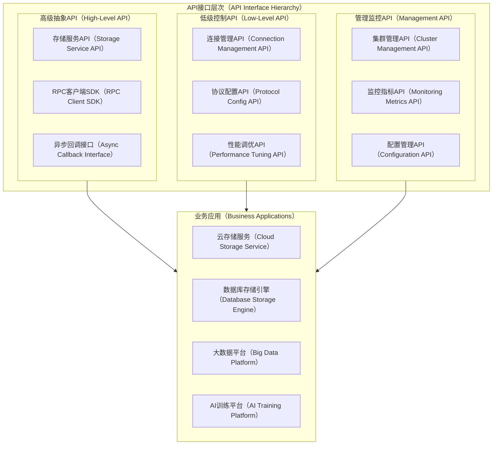

### 快速集成指南

**第一步：环境准备**
业务应用需要确认硬件环境支持情况，包括网络设备、存储设备、内存配置等。系统提供自动化的环境检测工具，生成优化建议报告。

**第二步：SDK集成**

```java
// 高级API使用示例
StorageClient client = StorageClientBuilder.newBuilder()
    .setClusterEndpoints(endpoints)
    .setProtocolPreference(ProtocolType.AUTO)  // 自动协议选择
    .setQosPolicy(QosPolicy.BALANCED)          // 平衡性能与可靠性
    .build();

// 异步写入示例
CompletableFuture<WriteResult> future = client.writeAsync(
    bucket, key, data, WriteOptions.builder()
        .setReplicationLevel(3)
        .setConsistencyLevel(ConsistencyLevel.STRONG)
        .build()
);
```

**第三步：配置优化**
系统提供声明式配置方式，支持YAML格式的配置文件：

```yaml
cluster:
  name: production-cluster
  nodes:
    - host: 192.168.1.10
      protocols: [rdma, tcp]
      capabilities: [dpdk, spdk]
  
rpc_config:
  protocol_selection:
    strategy: adaptive          # 自适应协议选择
    fallback_chain: [rdma, ipoib, tcp]
  
  qos_policy:
    latency_sensitive:
      priority: high
      max_latency_ms: 1
    throughput_optimized:
      priority: medium
      min_bandwidth_gbps: 10
```

### 业务场景适配方案

**对象存储场景**：针对大文件传输优化，启用RDMA零拷贝传输，采用流水线处理提升吞吐量。支持S3兼容API，无缝对接现有业务系统。

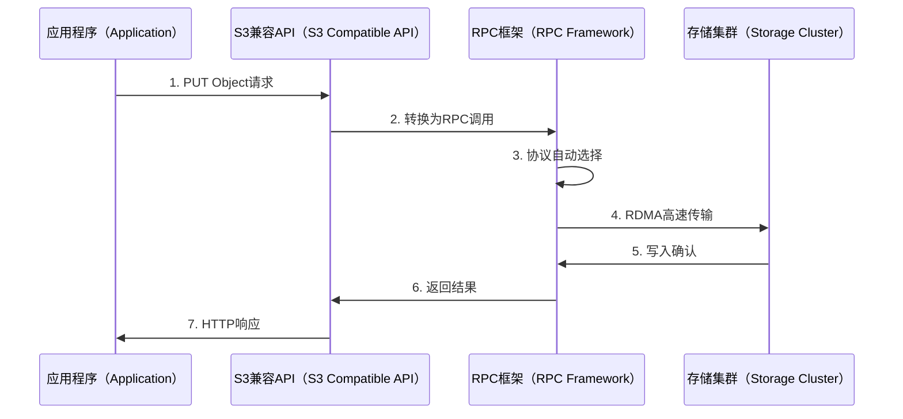

**数据库存储引擎场景**：针对小块随机I/O优化，启用NVMe-oF协议，实现微秒级延迟。提供事务支持和强一致性保证。

**大数据分析场景**：针对大规模数据扫描优化，实现智能预取和批量传输。支持数据本地化调度，减少网络传输开销。

**AI训练场景**：针对模型参数同步优化，实现All-Reduce等集合通信原语。支持混合精度传输，平衡精度与带宽需求。

### 运维管理集成

**监控集成**：提供Prometheus格式的监控指标，支持Grafana可视化。关键指标包括延迟分布、吞吐量统计、错误率监控、协议使用情况等。

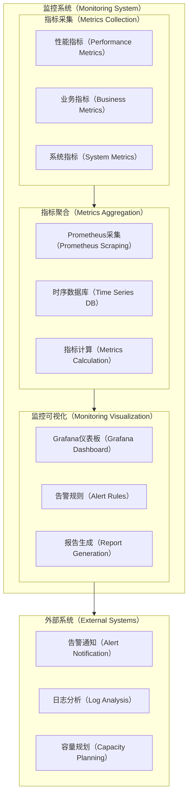

**日志集成**：支持结构化日志输出，兼容ELK、Fluentd等主流日志收集系统。提供分布式追踪能力，支持OpenTelemetry标准。

**配置管理**：支持热配置更新，无需重启服务。提供配置版本管理和回滚功能。支持与Kubernetes ConfigMap、Consul等配置中心集成。

## 未来发展展望

### 技术演进方向

**硬件协同优化**：随着CXL、PCI-E 5.0等新硬件标准的成熟，存储与网络的边界将进一步模糊。框架将支持内存-存储-网络的统一寻址和管理。

**AI驱动优化**：集成机器学习算法，实现性能预测、故障预测、容量规划等智能化功能。基于历史数据和实时状态，动态调整系统参数。

**边缘计算支持**：扩展支持边缘计算场景，提供边云协同的存储能力。支持5G网络的超低延迟特性，实现边缘-中心的数据同步。

### 生态建设规划

**开源社区建设**：建立开源社区，推动标准化进程。与CNCF、Linux Foundation等组织合作，推广技术标准。

**厂商合作计划**：与硬件厂商、云服务商建立合作关系，优化产品适配。建立认证体系，确保生态产品质量。

**人才培养体系**：建立培训认证体系，培养专业技术人才。与高等院校合作，推动课程建设和人才输送。

### 标准化推进

**协议标准化**：推动多协议融合的标准化工作，建立行业共识。参与国际标准组织的相关工作。

**接口标准化**：建立API接口标准，促进生态系统互操作性。制定性能评测标准，建立公平的比较基准。

**安全标准化**：建立安全防护标准，确保数据传输和存储安全。支持零信任网络架构，提供端到端加密能力。

## 参考资料

\[1] InfiniBand Trade Association. "InfiniBand Architecture Specification Volume 1". [https://www.infinibandta.org/](https://www.infinibandta.org/)

\[2] NVM Express Organization. "NVM Express over Fabrics Specification". [https://nvmexpress.org/](https://nvmexpress.org/)

\[3] Data Plane Development Kit. "DPDK Documentation". [https://doc.dpdk.org/](https://doc.dpdk.org/)

\[4] Storage Performance Development Kit. "SPDK User Guide". [https://spdk.io/doc/](https://spdk.io/doc/)

\[5] Internet Engineering Task Force. "QUIC: A UDP-Based Multiplexed and Secure Transport". RFC 9000. [https://www.rfc-editor.org/rfc/rfc9000.html](https://www.rfc-editor.org/rfc/rfc9000.html)

\[6] Linux Foundation. "Remote Direct Memory Access (RDMA) Kernel API". [https://www.kernel.org/doc/html/latest/infiniband/](https://www.kernel.org/doc/html/latest/infiniband/)

\[7] Cloud Native Computing Foundation. "OpenTelemetry Specification". [https://opentelemetry.io/docs/specs/](https://opentelemetry.io/docs/specs/)

\[8] Ongaro, D., & Ousterhout, J. "In Search of an Understandable Consensus Algorithm". USENIX Annual Technical Conference, 2014.

\[9] Amazon Web Services. "Amazon S3 API Reference". [https://docs.aws.amazon.com/s3/](https://docs.aws.amazon.com/s3/)

\[10] Ceph Community. "Ceph Documentation". [https://docs.ceph.com/](https://docs.ceph.com/)
