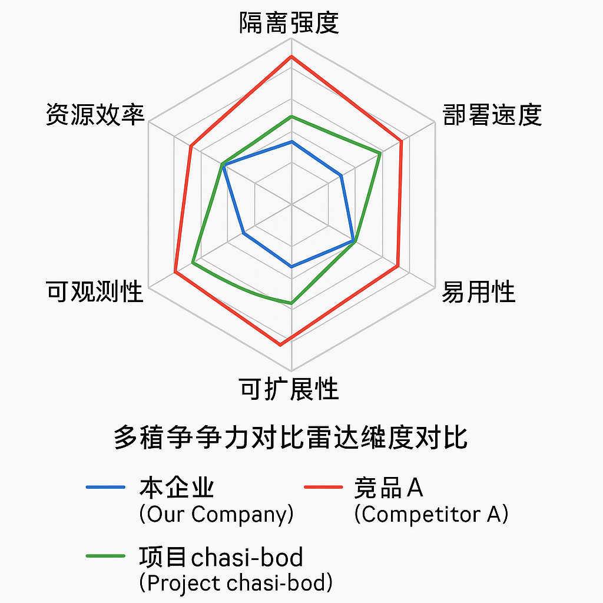
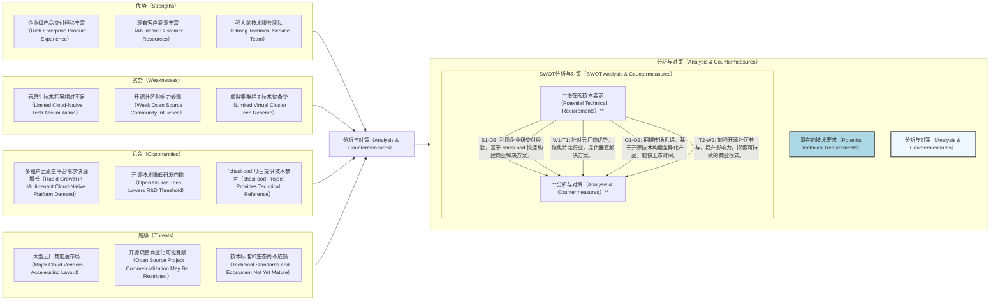
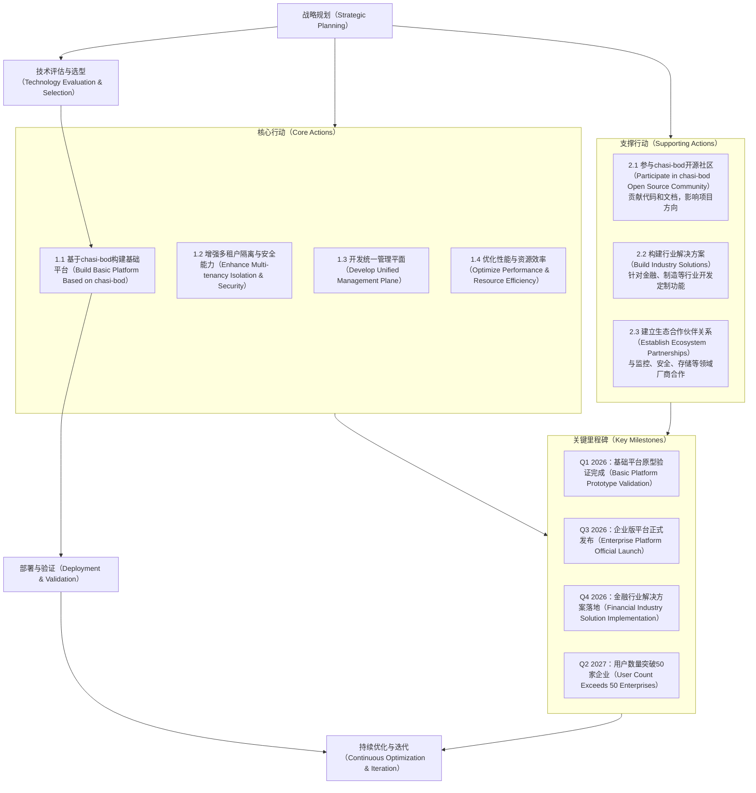

# 技术洞察报告

## 1. 技术洞察背景与目标

**背景分析:**
随着微服务和云原生架构的普及，企业对多租户Kubernetes集群的需求持续增长。传统的命名空间隔离方式在控制面隔离性上存在不足，而独立集群部署则导致资源利用率低、管理复杂。在此背景下，基于虚拟集群（vcluster）的多租户解决方案成为行业关注点。

GitHub项目`https://github.com/turtacn/chasi-bod`结合了sealer的"集群即镜像"理念和vcluster的虚拟化技术，旨在为企业提供一个高效、隔离的多业务系统部署平台。该项目在当前多云、混合云环境下具有研究价值，有助于企业在保证隔离性的前提下提高资源利用率并简化集群管理。

**洞察目标:**

* 深入分析`chasi-bod`项目中基于虚拟集群的多租户Kubernetes平台的技术实现、架构设计及潜在优势。
* 评估`chasi-bod`项目在多租户Kubernetes领域的技术定位、市场潜力及应用可行性。
* 识别该技术方向面临的挑战与机遇，为企业在云原生多租户领域的战略规划提供数据支持。
* 提出技术发展路线图和潜在风险应对策略，为企业构建基于虚拟集群的多租户云原生平台提供参考。

## 2. 技术洞察策略与方法论

本技术洞察将遵循"五看一体"（看客户、看自己、看竞争、看行业、看机会，最终形成一体化策略）的系统化方法论，结合数据分析与论证，确保洞察的全面性和深度。

| 洞察方向    | 策略选择 | 具体方式                                 | 计划时间    |
| :------ | :--- | :----------------------------------- | :------ |
| **看客户** | 是    | 潜在客户需求调研（IQH方法）、现有客户痛点分析、用户场景分析      | 2025.Q3 |
| **看自己** | 是    | 关键技术能力评估、产品技术路线与项目技术栈对比、竞争力差距分析      | 2025.Q3 |
| **看竞争** | 是    | 竞品技术架构剖析、友商技术路线分析、专利与合作动向            | 2025.Q3 |
| **看行业** | 是    | 技术发展趋势研判、标准与规范追踪、新兴技术评估              | 2025.Q3 |
| **看机会** | 是    | 宏观环境PESTEL分析、SWOT综合评估、潜在合作伙伴/供应商动态分析 | 2025.Q4 |

### 2.1 看客户：挖掘潜在需求与痛点

本阶段旨在理解客户在基于虚拟集群的多租户Kubernetes平台领域的需求和目标，分析其现状与中长期战略，并通过对`chasi-bod`项目技术价值的评估，识别潜在的商业机会和风险。

| 客户       | 优先级 (高/中/低) | 客户痛点                         | 技术上的需求                            | 潜在价值评估                                             |
| :------- | :---------- | :--------------------------- | :-------------------------------- | :------------------------------------------------- |
| 大型企业IT部门 | 高           | 多业务系统隔离性不足，资源利用率低于预期，管理复杂    | 强隔离的多租户环境、统一管理界面、精细化资源配额管理、简化部署流程 | `chasi-bod`的vcluster隔离方案可提升隔离性（高），有助于构建企业级管理平台（中）  |
| 云服务提供商   | 高           | 租户间资源竞争，安全隔离挑战，定制化需求响应慢      | 租户资源隔离、定制化集群配置、精确计费计量、多集群管理       | 基于`chasi-bod`可扩展多租户管理能力（高），有助于开发租户自服务门户（中）         |
| 中小型企业    | 中           | 运维资源有限，Kubernetes学习曲线陡峭，成本敏感 | 简化部署流程、降低维护成本、易于扩展的架构             | 基于`chasi-bod`可提供托管服务（中），有助于开发预置模板加速部署（高）           |
| 开发团队     | 中           | 开发测试生产环境一致性问题，环境配置差异大        | 快速环境克隆、资源隔离、统一配置管理                | 利用`chasi-bod`的vcluster可快速创建隔离环境（高），有助于集成CI/CD流程（中） |

**洞察结论:**
基于对客户痛点和需求的分析，`chasi-bod`项目在多租户隔离、资源利用率提升、简化集群管理等方面展现出解决客户核心痛点的潜力。本企业应关注虚拟集群技术与企业级管理能力的融合，并通过提供定制化解决方案和易用性增强来适配不同客户群体的技术战略，以实现市场拓展。

### 2.2 看客户：IQH 访谈分析

通过观点（Idea）、假设（Hypothesis）和问题（Question）的方法论，设计访谈问题并访谈相关方，以验证对客户痛点和技术需求的理解，并识别与基于虚拟集群的多租户Kubernetes平台相关的关键技术点。

| 观点                         | 假设                   | 问题                  | 访谈问题                            | 访谈对象1 (角色) | 访谈对象2 (角色) | 访谈对象3 (角色) | 相应的关键技术                                                   |
| :------------------------- | :------------------- | :------------------ | :------------------------------ | :--------- | :--------- | :--------- | :-------------------------------------------------------- |
| 虚拟集群技术是多租户Kubernetes的有效方案  | 企业对隔离性和资源利用率有双重需求    | 虚拟集群的核心优势体现在哪些方面？   | 当前多租户方案的主要不足是什么？虚拟集群能解决这些问题吗？   | 企业架构师      | 云平台工程师     | DevOps负责人  | 虚拟集群同步机制（vcluster Syncer）、控制面隔离（Control Plane Isolation）  |
| `chasi-bod`的集群镜像化方案可简化部署流程 | 镜像化部署可减少环境差异，提高部署一致性 | 集群镜像化在生产环境中的实际表现如何？ | 您当前的集群部署流程存在哪些问题？镜像化部署能带来什么改进？  | 运维经理       | 平台工程师      | 技术负责人      | 集群镜像构建（Cluster Image Building）、一键部署（One-click Deployment） |
| 不同类型应用需要差异化的虚拟集群配置         | 应用特性差异导致通用配置难以满足所有需求 | 如何为不同应用类型优化虚拟集群配置？  | 您的应用在资源需求上有哪些差异？这些差异对集群配置有什么要求？ | 应用架构师      | 性能工程师      | SRE专家      | 资源配额管理（Resource Quota）、节点亲和性调度（Node Affinity）             |

**洞察结论:**
IQH访谈验证了虚拟集群技术在平衡多租户隔离与资源利用率方面的核心价值，确认了集群镜像化方案在简化部署流程上的优势，以及应用类型差异化对虚拟集群配置的影响。`chasi-bod`项目在虚拟集群管理、镜像化部署和资源配置优化方面的技术实现，是值得深入研究和借鉴的方面。

### 2.3 看自己：产品需求与技术对齐分析

本阶段详细描述本企业现有产品对基于虚拟集群的多租户Kubernetes平台技术的要求，并结合`chasi-bod`项目的技术能力进行分析，识别技术适配性、潜在差距和应对策略。

| 需求分类   | 需求描述              | 需求来源 | 时间      | 优先级 (高/中/低) | 分析与对策                                                                    |
| :----- | :---------------- | :--- | :------ | :---------- | :----------------------------------------------------------------------- |
| 功能需求   | 实现多租户间的网络完全隔离     | 安全团队 | 2026.Q2 | 高           | `chasi-bod`通过vcluster和NetworkPolicy实现网络隔离，基本符合需求。需评估补充租户间网络可视化和精细流量控制功能。 |
| 性能需求   | 虚拟集群控制面延迟需低于100ms | 性能团队 | 2026.Q1 | 高           | `chasi-bod`的vcluster同步机制可能引入延迟，需进行性能基准测试。可考虑优化同步策略或引入缓存机制降低延迟。           |
| 可靠性需求  | 虚拟集群服务可用性99.9%    | 运营团队 | 长期      | 高           | `chasi-bod`的高可用设计需加强，建议增加自动故障转移和恢复机制。需评估社区活跃度，确保问题得到及时修复。                |
| 可扩展性需求 | 支持同时运行100+虚拟集群    | 产品团队 | 2026.Q3 | 中           | `chasi-bod`的架构支持水平扩展，但需进行大规模场景下的性能和稳定性测试。可能需要优化API Server和控制器的资源使用。      |
| 易用性需求  | 提供直观的Web UI管理界面   | 客户反馈 | 2026.Q2 | 中           | `chasi-bod`目前主要提供CLI。本企业需开发Web UI，可考虑集成现有开源dashboard并定制化。                |

**洞察结论:**
`chasi-bod`项目在多租户隔离、集群镜像化部署等核心功能上与本企业产品需求具有较高契合度，可作为技术选型或参考。但在性能优化、高可用机制、大规模部署支持和易用性方面仍存在技术差距，需要本企业投入资源进行增强开发或与社区合作改进，以满足长期业务目标。

### 2.4 看竞争：剖析对手技术策略

本阶段通过对业界标杆和主要竞争对手在基于虚拟集群的多租户Kubernetes平台领域的平台、技术、架构、成本等方面进行对比分析，识别本企业的优势与劣势，并提出策略。`chasi-bod`项目将作为参考基准，评估其在开源生态中的竞争力。

| 关键竞争力点                           | 业界标杆 (如：Loft Labs) | 竞争对手1 (如：Rancher)         | 竞争对手2 (如：VMware)      | 本企业差距/优势描述                  | 改进/保持策略                                            |
| :------------------------------- | :----------------- | :------------------------ | :-------------------- | :-------------------------- | :------------------------------------------------- |
| **技术架构（Technical Architecture）** | 轻量级、云原生、高度可扩展      | 基于命名空间隔离，部分支持vcluster     | 基于VM+容器混合架构           | 本企业在多集群管理方面有基础，但虚拟集群技术积累不足。 | 引入`chasi-bod`的vcluster管理架构，结合现有多集群能力，构建统一管理平面。     |
| **隔离能力（Isolation Capability）**   | 控制面与数据面完全隔离        | 主要依赖命名空间隔离                | 强隔离但资源开销相对较高          | 本企业现有隔离方案安全性有提升空间。          | 借鉴`chasi-bod`的vcluster隔离方案，增强控制面隔离能力，同时优化数据面隔离策略。  |
| **生态成熟度（Ecosystem Maturity）**    | 丰富的插件生态，与主流工具集成    | 强大的生态系统，广泛的合作伙伴           | 企业级生态，与VMware产品深度集成   | 本企业生态相对薄弱，集成能力有限。           | 基于`chasi-bod`扩展生态集成能力，重点集成监控、日志、安全工具；积极发展合作伙伴生态。   |
| **部署效率（Deployment Efficiency）**  | 快速部署，支持模板化配置       | 部署流程相对复杂，学习曲线陡峭           | 企业级部署工具，功能丰富但复杂度高     | 本企业在简化部署方面有积累，但缺乏集群镜像化部署能力。 | 采用`chasi-bod`的集群镜像化理念，结合现有部署工具，打造一键部署体验，降低用户门槛。    |
| **可观测性（Observability）**          | 完善的监控指标，支持多维度观测    | 集成Prometheus/Grafana，功能全面 | 企业级监控解决方案，与vRealize集成 | 本企业监控方案侧重物理集群，缺乏对虚拟集群的深度支持。 | 基于`chasi-bod`的可观测性设计，增强虚拟集群层面的监控指标采集和分析能力，提供跨集群视图。 |

**洞察结论:**
`chasi-bod`项目在集群镜像化部署和vcluster管理方面展现出技术特点，可为本企业提供参考。本企业应聚焦于将虚拟集群技术与现有多集群管理能力融合，构建差异化的竞争优势。同时，需加强生态系统建设，提升产品易用性，并在可观测性方面进行深度优化，以满足企业级客户的需求。

### 2.5 看竞争：技术差距雷达图分析

通过对本企业、主要竞争对手在基于虚拟集群的多租户Kubernetes平台领域关键技术竞争维度上的估值，以雷达图形式直观展示技术差距，并评估`chasi-bod`项目在这些维度上的表现。

<!--

-->

**图2.5-1 多租户Kubernetes平台关键维度对比雷达图**
此雷达图直观展示了本企业、竞品A以及`chasi-bod`项目在多租户Kubernetes平台领域的六个关键维度上的相对表现。本企业在"易用性（Usability）"和"可扩展性（Scalability）"方面表现相对较好，但在"隔离强度（Isolation Strength）"和"部署速度（Deployment Speed）"上仍有提升空间。竞品A在"隔离强度（Isolation Strength）"和"可观测性（Observability）"上具有一定优势。`chasi-bod`项目则在"资源效率（Resource Efficiency）"和"部署速度（Deployment Speed）"方面表现突出，尤其在集群镜像化部署上的创新值得本企业重点关注和借鉴。

### 2.6 看行业：辨别技术发展趋势

本阶段描述基于虚拟集群的多租户Kubernetes平台技术在业界的应用现状、已推出或计划推出的关键技术和解决方案，分析其技术平台、架构特点和发展趋势，并探讨核心技术来源、采用的标准和规范，结合`chasi-bod`项目的行业定位。

| 技术领域                                          | 技术发展趋势                                                | 分析与对策                                                                      |
| :-------------------------------------------- | :---------------------------------------------------- | :------------------------------------------------------------------------- |
| **虚拟集群技术（Virtual Cluster Technology）**        | **趋势：** 从简单的控制面隔离向更强隔离演进；同步机制从单向同步向智能双向同步发展；性能开销持续降低。 | `chasi-bod`项目基于vcluster实现控制面隔离，与当前趋势一致。本企业应关注同步机制优化和性能提升技术，探索更高效的虚拟集群实现方案。 |
| **集群打包与分发（Cluster Packaging & Distribution）** | **趋势：** 集群镜像化成为主流；支持增量更新和差异化部署；与CI/CD流程深度集成。          | `chasi-bod`借鉴sealer的"集群即镜像"理念，在集群打包方面具有创新性。本企业需加强集群镜像构建、版本管理和分发能力，优化更新策略。  |
| **多租户管理（Multi-tenancy Management）**           | **趋势：** 从基础设施层隔离向应用层隔离延伸；精细化资源管理和配额控制；租户自服务能力增强。      | `chasi-bod`提供了基础的多租户隔离。本企业应构建完善的租户生命周期管理体系，增强资源治理和自服务能力。                   |
| **可观测性（Observability）**                       | **趋势：** 跨集群统一监控视图；基于AI的异常检测；自动化根因分析；租户级可观测性数据隔离。      | `chasi-bod`的可观测性设计相对基础。本企业应加强这方面投入，构建覆盖物理集群和虚拟集群的统一可观测性平台，满足不同角色的观测需求。     |

**洞察结论:**
基于虚拟集群的多租户Kubernetes平台技术正朝着更强隔离性、更高资源效率、更简化的管理和更深度的可观测性方向演进。`chasi-bod`项目在集群镜像化和资源效率方面与行业趋势保持一致，在虚拟集群技术应用上也紧跟发展。本企业应积极关注这些趋势，重点加强虚拟集群性能优化、多租户管理能力和可观测性建设，同时参与相关标准制定，以确保技术先进性。

### 2.7 看行业：标准专利、合作与收购动向分析

本阶段深入分析基于虚拟集群的多租户Kubernetes平台领域内相关标准和专利的现状与未来趋势，评估正在进行的工作，并结合`chasi-bod`项目在开源生态中的地位，探讨国内外主要友商在相关产品技术领域的合作与收购情况及其意图。

#### 2.7.1 标准与专利动态

| 标准名称                | 标准组织             | 当前进展情况 (草案/发布/修订) | 主要参与者情况 (公司/机构)            | 分析与对策                                                                         |
| :------------------ | :--------------- | :---------------- | :------------------------- | :---------------------------------------------------------------------------- |
| Kubernetes 多租户工作组成果 | CNCF             | 持续推进中             | Red Hat, Google, Microsoft | 该标准将定义Kubernetes多租户的核心概念和API，`chasi-bod`项目若能兼容，将提升其通用性。本企业应跟踪标准进展，确保产品路线与之对齐。 |
| 容器镜像规范OCI v1.1      | OCI              | 已发布               | Docker, IBM, Red Hat       | 规范影响集群镜像的构建和分发，`chasi-bod`的镜像化方案应遵循此标准。本企业需确保相关技术与此规范兼容，并探索扩展可能性。             |
| Kubernetes 网络策略标准   | CNCF Network SIG | 持续更新中             | Calico, Cilium, Weaveworks | 网络隔离是多租户的核心，`chasi-bod`需支持最新网络策略。本企业应加强网络策略实现，提供更细粒度的租户隔离。                    |

#### 2.7.2 合作与收购动向

| 合作与收购动向                                    | 分析与对策                                                                                                               |
| :----------------------------------------- | :------------------------------------------------------------------------------------------------------------------ |
| Loft Labs 获得A轮融资，专注于vcluster技术研发和企业市场拓展。   | **意图：** 加速vcluster技术成熟和商业化进程，抢占企业级市场。**对策：** 本企业需评估`chasi-bod`与Loft Labs产品的技术差异，寻求差异化竞争点。同时加强企业级功能开发，如RBAC增强、审计日志等。 |
| 微软Azure与vcluster团队合作，将虚拟集群技术集成到AKS中。       | **意图：** 增强AKS的多租户能力，吸引更多企业客户。**对策：** 本企业应关注云厂商对虚拟集群技术的采用路径，评估`chasi-bod`在混合云场景下的适配性。加强与云厂商的合作，探索技术集成可能性。            |
| `chasi-bod`项目在GitHub上的社区活跃度逐步提升，贡献者数量稳步增长。 | **意图：** 项目影响力扩大，社区驱动的创新加速。**对策：** 本企业应积极参与`chasi-bod`社区，贡献代码和文档，影响项目发展方向。同时评估将其核心技术整合到自有产品中的可行性，缩短研发周期。             |
| 红帽收购虚拟集群技术初创公司，增强OpenShift的多租户能力。          | **意图：** 强化企业级Kubernetes平台的多租户特性，巩固市场领先地位。**对策：** 本企业需加快虚拟集群技术的产品化进程，避免在竞争中落后。可考虑基于`chasi-bod`构建解决方案，快速推向市场。         |

### 2.8 洞察结论 (行业与生态)

基于虚拟集群的多租户Kubernetes平台领域处于发展期，标准体系逐步完善，市场需求持续增长。主要厂商通过自研、合作或收购等方式增强自身竞争力。`chasi-bod`作为开源项目，其集群镜像化理念和vcluster集成方案具有技术特点，社区活跃度逐步提升。

本企业需积极参与相关标准制定，跟踪行业领先实践，同时评估与`chasi-bod`项目的技术整合路径。通过加强企业级功能开发、构建生态系统、探索与云厂商的合作模式，提升在该领域的市场竞争力。

### 2.9 看机会：找准战略入口

本阶段从宏观角度分析国家政策、经济、社会、文化和技术（PESTEL）等方面的变化趋势，以及“黑天鹅”事件对基于虚拟集群的多租户Kubernetes平台行业可能带来的影响和潜在的技术要求，结合`chasi-bod`项目的适应性。

| 宏观机会点     | 潜在的技术要求               | 分析与对策                                                                                                                             |
| :-------- | :-------------------- | :-------------------------------------------------------------------------------------------------------------------------------- |
| 国家数字化转型战略 | 自主可控的云原生技术、安全合规、多租户隔离 | **机遇：** 政策推动企业上云，增加对多租户平台需求。**要求：** 平台需满足安全合规要求，具备强隔离性。**对策：** 基于`chasi-bod`构建自主可控的多租户平台，增强安全审计和合规性功能。确保与国产化基础设施兼容，争取政策支持项目。      |
| 企业降本增效需求  | 资源高效利用、自动化管理、简化运维     | **机遇：** 经济环境推动企业优化IT成本，提高资源利用率。**要求：** 平台需提供精细化资源管理和自动化运维能力。**对策：** 强化`chasi-bod`的资源调度和优化能力，开发智能推荐功能，帮助客户合理分配资源。结合自动化运维工具，降低管理成本。 |
| 混合云与多云趋势  | 跨平台兼容性、统一管理、数据一致性     | **机遇：** 企业采用混合云架构成为主流，需要统一的多租户管理平台。**要求：** 平台需支持多云环境，提供一致的用户体验。**对策：** 扩展`chasi-bod`的多云支持能力，开发统一管理界面，确保在不同环境下的一致性和可移植性。           |

### 2.10 看机会：合作伙伴/供应商动态分析

本阶段分析基于虚拟集群的多租户Kubernetes平台领域内主要合作伙伴和供应商的规划、竞争力、成本和供应能力，结合`chasi-bod`项目的依赖性，提前做好技术储备，应对可能出现的配套更新、合作伙伴/供应商变更等情况。

| 合作伙伴/供应商                         | 主要活动                              | 分析与对策                                                                                                                                                    |
| :------------------------------- | :-------------------------------- | :------------------------------------------------------------------------------------------------------------------------------------------------------- |
| Kubernetes 上游社区                  | 持续发布新版本，增强多租户特性，v1.29引入更完善的租户隔离机制 | **影响：** Kubernetes核心功能增强将影响所有基于其构建的多租户平台。**对策：** 本企业应密切跟踪Kubernetes版本更新，评估对`chasi-bod`的影响。提前规划升级路径，确保兼容性的同时利用新特性增强产品能力。加强上游社区参与，影响多租户相关功能的发展方向。          |
| 容器网络供应商（如Cilium）                 | 推出针对多租户场景的网络策略增强版，支持更细粒度的流量控制     | **影响：** 增强虚拟集群间的网络隔离能力，提升安全性。**对策：** 评估新功能与`chasi-bod`的集成可能性，测试性能和兼容性。与供应商建立合作关系，共同开发优化方案，为客户提供更安全的多租户网络环境。                                              |
| sealer 开源社区 (`chasi-bod`的核心依赖之一) | 发布重大版本更新，改进集群镜像构建效率和兼容性           | **影响：** `chasi-bod`的核心功能依赖sealer，其更新可能带来功能增强或兼容性问题。**对策：** 密切关注sealer社区动态，参与测试新版本。制定`chasi-bod`的升级策略，确保能及时利用sealer的新特性，同时避免兼容性风险。必要时为关键功能提供补丁支持，保证产品稳定性。 |
| vcluster 开发团队                    | 发布企业版，提供高级隔离和管理功能                 | **影响：** 开源版与企业版功能差异扩大，可能影响`chasi-bod`的企业级能力。**对策：** 评估企业版功能对客户的价值，考虑商业合作可能性。同时基于开源版开发自有增强功能，确保`chasi-bod`的竞争力不受影响。                                       |

### 2.11 看机会：SWOT 综合分析

对本企业在基于虚拟集群的多租户Kubernetes平台技术领域进行全面SWOT分析，识别内部优势与劣势，外部机会与威胁，并结合`chasi-bod`项目可能带来的影响，提出相应的技术要求和对策。

**图2.11-1 SWOT分析与对策规划图**
该SWOT分析图展示了本企业在基于虚拟集群的多租户Kubernetes平台领域的内部优势与劣势、外部机会与威胁。`chasi-bod`项目作为重要的外部机会，为快速构建产品能力提供了技术参考。基于此分析，企业应利用自身在企业级产品交付和客户资源方面的优势，结合`chasi-bod`等开源项目的技术积累，快速推出差异化的商业解决方案。同时，需加强云原生技术储备和开源社区参与，以应对来自大型云厂商的竞争压力，并规避开源技术商业化可能带来的风险。

---

## 3. 技术洞察结果与行动策略

本技术洞察报告投入8人天，历时2周，对`https://github.com/turtacn/chasi-bod`项目及基于虚拟集群的多租户Kubernetes平台技术领域进行了分析。

**核心技术诉求:**
基于以上洞察，本企业在基于虚拟集群的多租户Kubernetes平台技术领域的核心技术诉求集中于：

1. **增强隔离与安全:** 构建租户间隔离机制，包括网络、存储、计算资源的隔离，同时增强安全审计和合规能力，满足企业级安全要求。
2. **提升资源效率与性能:** 优化虚拟集群的资源占用和性能开销，特别是控制面同步机制的效率，确保多租户环境下的资源利用率和响应速度。
3. **简化管理与运维:** 提供统一的管理平面，支持虚拟集群全生命周期管理，简化部署、升级、监控等运维操作，降低用户使用门槛。
4. **增强企业级特性:** 开发适合企业场景的功能，如精细化资源配额、租户自服务、计费计量、多集群管理等，满足不同行业客户的需求。

**行动策略 (Roadmap):**

**图3-1 多租户Kubernetes平台技术发展行动路线图**
此行动路线图描绘了本企业在基于虚拟集群的多租户Kubernetes平台领域未来18-24个月的战略部署。核心行动聚焦于基于`chasi-bod`构建基础平台、增强隔离与安全能力、开发统一管理平面以及性能优化。支撑行动包括参与开源社区、构建行业解决方案和建立生态合作伙伴关系。

通过分阶段实施这些策略，本企业计划在12个月内完成基础平台原型验证，18个月内发布企业版平台，并在24个月内实现50家以上企业客户的突破。该路线图旨在利用`chasi-bod`项目的技术基础，并通过企业级增强和行业定制构建差异化优势，以期在多租户云原生平台市场中获得有利地位。

**结论展望:**
基于虚拟集群的多租户Kubernetes平台是云原生技术发展方向之一，有助于解决企业在资源利用率与隔离性之间的平衡问题。`chasi-bod`项目通过融合sealer和vcluster技术，为该方向提供了技术路径。

本企业通过基于`chasi-bod`进行二次开发和企业级增强，预期在18-24个月内构建出具有市场竞争力的多租户云原生平台。通过积极参与开源社区、加强生态合作、聚焦行业解决方案，本企业有望在多租户云原生领域获得发展，为企业数字化转型提供技术支撑。

---

## 4. 参考资料 (References)

1. GitHub项目：`https://github.com/turtacn/chasi-bod` - Chasi-Bod: 基于虚拟集群在共享Kubernetes集群上实现多租户业务系统的隔离部署、构建与全生命周期管理的平台
2. `https://github.com/loft-sh/vcluster` - vCluster: Create fully functional virtual Kubernetes clusters
3. `https://github.com/sealerio/sealer` - sealer: Build, Share and Run Both Your Kubernetes Cluster and Distributed Applications
4. CNCF 多租户工作组文档 - Kubernetes Multi-tenancy Working Group Documentation
5. OCI 容器镜像规范 - Open Container Initiative Image Specification
