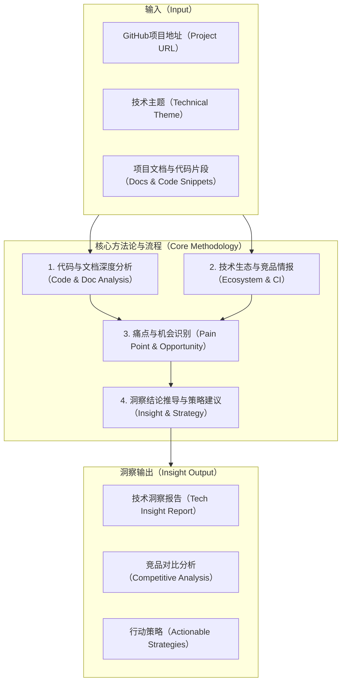

# KubeStack-AI 技术洞察报告

## 技术洞察背景与目标

随着云原生架构的日益普及，企业在Kubernetes及混合IT环境中管理多样化中间件面临诸多挑战，包括工具链碎片化、运维知识门槛高、故障诊断复杂度大以及自动化水平不足。KubeStack-AI作为融合人工智能与云原生技术的创新平台，旨在通过自然语言交互、智能诊断与统一管理能力，系统性地应对现代分布式系统中中间件运维的复杂性问题。

本次技术洞察旨在：

1. **深入分析** KubeStack-AI项目的技术架构、核心竞争力及市场定位。
2. **客观评估** 其在云原生中间件运维领域的创新潜力及潜在技术挑战。
3. **识别对比** 其与现有竞品的技术优势与差距。
4. **前瞻性地提出** 基于行业趋势与用户需求的战略性技术发展建议，为项目优化与市场拓展提供决策支持。

## 技术洞察策略

| 洞察方向 | 策略选择  | 具体方式                                                                                                                         | 计划时间 |
| :--- | :---- | :--------------------------------------------------------------------------------------------------------------------------- | :--- |
| 看客户  | 验证性分析 | 结合项目潜在应用场景，推导云原生运维工程师、SRE团队和平台管理员的共性痛点与技术需求；基于项目GitHub Issues和Discussions分析用户反馈，采用IQH（Insight-Question-Hypothesis）方法进行假设性验证。 | 3天   |
| 看自己  | 能力评估  | 系统分析KubeStack-AI的技术栈（如Go语言、LLM集成、RAG系统、插件化架构）与核心功能实现，评估其独特技术优势及潜在劣势。                                                         | 2天   |
| 看竞争  | 竞品对标  | 针对AI驱动的云原生运维领域，剖析k8sgpt-ai、kubectl-ai等同类或相关项目的技术架构、功能特性、生态成熟度与市场表现。                                                          | 2天   |
| 看行业  | 趋势研判  | 识别云原生运维自动化、AI+运维、中间件管理标准化等领域的前沿技术趋势、行业标准规范及主要合作与收购动态。                                                                        | 2天   |
| 看机会  | 战略识别  | 综合云原生市场增长、AI技术普及等宏观环境因素，结合项目SWOT（优势、劣势、机会、威胁）分析，识别潜在市场切入点与技术发展机遇。                                                            | 1天   |



## 看客户：挖掘痛点

KubeStack-AI的目标客户群主要包括企业SRE工程师、云平台管理员和DevOps团队，这些团队在云原生和中间件运维中面临以下关键挑战：

| 客户群体（代表性场景）                      | 痛点描述                                                                          | 技术需求                                                                | 潜在路标建议与预期效益                                                                             |
| :------------------------------- | :---------------------------------------------------------------------------- | :------------------------------------------------------------------ | :-------------------------------------------------------------------------------------- |
| **企业SRE工程师**<br/>（负责多中间件监控与故障排查） | 1. 需掌握多样化中间件的特定命令和诊断流程。<br/>2. 跨系统依赖复杂，故障根因定位效率低。<br/>3. 重复性运维任务占比较高，自动化水平不足。 | 1. 统一的诊断与管理操作接口。<br/>2. 智能化的跨中间件根因分析能力。<br/>3. 可编程与自动化修复工具。         | **短期：** 完善主流中间件插件及AI诊断能力。<br/>**中期：** 引入预测性维护功能。<br/>**预期效益：** 故障平均恢复时间（MTTR）有望缩短。      |
| **云平台管理员**<br/>（负责K8s与裸机混合环境）    | 1. 混合IT环境管理工具不统一，操作异构。<br/>2. 多租户权限管理复杂，缺乏细粒度控制。<br/>3. 操作审计与合规性保障难度大。        | 1. 跨环境统一的资源管理模型。<br/>2. 细粒度的RBAC/ABAC权限控制系统。<br/>3. 全面的操作审计与日志追踪功能。 | **短期：** 实现基础多环境资源适配。<br/>**中期：** 完善企业级多租户与审计功能。<br/>**预期效益：** 降低混合环境运维复杂度，提升合规性水平。      |
| **开发团队**<br/>（需要自助式中间件管理）        | 1. 缺乏专业中间件运维知识。<br/>2. 中间件配置与性能优化实践困难。<br/>3. 问题排查对专业运维团队依赖性高。                | 1. 直观的自然语言交互界面。<br/>2. 智能配置建议与优化指导。<br/>3. 自助式诊断与简易故障处理工具。          | **短期：** 优化自然语言交互精度与体验。<br/>**中期：** 增强领域知识库与自动优化功能。<br/>**预期效益：** 提升开发效率，降低对专业运维资源的依赖。   |
| **大型企业IT架构师**<br/>（负责技术选型与标准化）   | 1. 工具链整合复杂，集成成本高。<br/>2. 技术栈标准化实施面临挑战。<br/>3. 系统扩展性与定制化需求突出。                  | 1. 开放且可扩展的插件化架构。<br/>2. 可定制的领域知识体系。<br/>3. 支持自定义工作流与集成接口。           | **短期：** 完善插件开发工具链与文档。<br/>**中期：** 建立行业最佳实践与配置模板库。<br/>**预期效益：** 降低架构设计与实施复杂度，加速技术标准化进程。 |

**洞察结论**：
KubeStack-AI有效识别了云原生中间件运维领域的核心痛点，特别是工具碎片化和专业知识壁垒问题。通过AI驱动的自然语言交互和智能诊断能力，项目有望降低运维操作门槛并提高问题解决效率。其插件化架构和对混合环境的支持，增强了产品的适应性与扩展潜力，能够满足不同规模企业在多样化环境中的运维需求。未来发展应侧重于企业级特性的完善和领域知识库的持续丰富，以更好地服务中大型企业客户。

## 看客户：IQH（Insight-Question-Hypothesis）分析

通过对KubeStack-AI目标用户群体的深入分析，我们提出以下观点、假设和问题，以验证产品定位和功能设计的有效性。

| 观点（Insight）            | 假设（Hypothesis）              | 问题（Question）                 | 访谈问题（Interview Question）                   | 访谈对象1（SRE工程师）                       | 访谈对象2（平台管理员）                  | 访谈对象3（开发工程师）                    | 相应的关键技术                         |
| :--------------------- | :-------------------------- | :--------------------------- | :----------------------------------------- | :---------------------------------- | :---------------------------- | :------------------------------ | :------------------------------ |
| 自然语言交互可显著降低运维操作门槛。     | 运维人员倾向于使用自然语言而非记忆复杂命令行。     | 自然语言交互的准确性与效率是否能满足生产运维的严苛要求？ | 您是否愿意使用自然语言代替传统命令行操作中间件？在实际使用中，您最担心何种问题？   | "意愿强烈，记忆命令效率低，但担忧AI理解偏差导致误操作或语义歧义。" | "认可其便利性，但需确保精确的权限控制和操作范围限定。"  | "非常需要，我们缺乏深入的运维专业知识，难以准确表达。"    | 自然语言处理（NLP）引擎、意图识别模型、安全确认与回滚机制。 |
| 跨中间件关联分析是解决复杂故障的关键。    | 多数生产故障涉及多个中间件组件间的交互问题。      | 现有工具能否有效支持跨中间件的根因分析？         | 您遇到的生产故障中，有多少比例涉及多个中间件组件？现有工具对此类问题的处理能力如何？ | "约60%的故障涉及多组件，现有工具需手动关联，效率极低。"      | "跨组件问题排查耗时最长，当前缺乏有效的自动化分析工具。" | "通常难以判断是应用层还是中间件层问题，导致反复沟通与定位。" | 分布式追踪系统、跨组件拓扑分析、知识图谱构建与推理。      |
| 插件化架构是适应多样化中间件生态的最佳方式。 | 企业IT环境中中间件种类多样且持续演进。        | 标准化解决方案能否满足企业多样化中间件的定制化需求？   | 您环境中使用了多少种中间件？现有标准化运维工具的覆盖率如何？             | "超过10种，标准化工具覆盖率仅约50%，其余需定制或人工管理。"   | "不同业务线使用不同中间件，单一工具难以全面覆盖。"    | "开发框架多样，需适配多种缓存、消息队列等组件。"       | 插件开发框架、动态加载机制、API标准化、插件签名与验证。   |
| 混合环境管理需要统一的操作模型。       | 企业普遍存在Kubernetes与传统环境并存的状况。 | 混合环境是否显著增加了运维复杂性？            | 在Kubernetes和裸机环境间管理同一类中间件时，您面临的最大挑战是什么？    | "操作方式、监控体系差异大，需两套知识，易出错且效率低。"       | "权限管理和监控指标不统一，难以实现全局视图和控制。"   | "环境差异导致部署、调试和维护复杂性增高。"          | 环境抽象层、统一权限模型、跨环境数据聚合与展示。        |

**洞察结论**：
IQH分析验证了KubeStack-AI核心技术方向的正确性。自然语言交互、跨组件分析、插件化架构和混合环境支持均被确认为解决用户核心痛点的关键技术支柱。分析也揭示了用户对AI准确性、操作安全性和系统兼容性的潜在担忧。这要求项目在发展过程中，在增强智能能力的同时，高度重视构建可靠的安全机制和灵活的适配能力。未来应优先发展自然语言理解的精确性提升、跨组件关联分析算法优化和插件生态建设，以更好地满足实际生产环境的需求。

## 看自己：产品需求分析

KubeStack-AI作为AI驱动的云原生中间件运维平台，其产品需求涵盖功能、性能、安全及可扩展性等多个维度，直接影响技术选型与架构设计。

| 需求分类（功能/性能/安全/可扩展性） | 需求描述                                 | 需求来源（用户反馈/市场趋势/内部规划） | 时间（发现/提出） | 优先级（高/中/低） | 分析与对策（技术实现/改进方向）                           |
| :------------------ | :----------------------------------- | :------------------- | :-------- | :--------- | :----------------------------------------- |
| **功能需求**            | 支持主流中间件（MySQL、Redis、Kafka等）的智能诊断与管理。 | 市场趋势、用户场景分析          | 项目初期      | 高          | 采用插件化架构，为每种中间件开发专业插件；建立统一的插件开发标准与SDK。      |
| **功能需求**            | 提供自然语言交互界面，支持中英文混合查询。                | 用户反馈、竞品分析            | 项目初期      | 高          | 集成大语言模型，开发专用的意图识别与命令转换模块；构建领域特定语言模型微调。     |
| **功能需求**            | 实现跨中间件的根因分析与关联诊断。                    | 用户痛点分析               | 短期规划      | 高          | 设计知识图谱存储中间件依赖关系；开发分布式追踪与日志关联分析引擎。          |
| **性能需求**            | 诊断响应时间小于3秒，支持100+节点集群的并发诊断。          | 性能测试基准、用户体验要求        | 中期规划      | 中          | 实现数据收集并行化；优化缓存策略；采用增量分析机制减少重复计算。           |
| **安全需求**            | 敏感信息（如密码、API Key）的自动脱敏处理；操作权限的精细化控制。 | 企业级需求分析、合规性要求        | 中期规划      | 高          | 实现数据传输加密；设计基于RBAC/ABAC的权限系统；开发敏感信息识别与脱敏模块。 |
| **安全需求**            | 危险操作的二次确认机制与完整的审计跟踪日志。               | 合规性要求                | 中期规划      | 中          | 实现操作风险等级评估；开发交互式确认流程；建立不可篡改的审计日志系统。        |
| **可扩展性需求**          | 支持社区贡献插件，具备动态加载机制。                   | 生态发展规划               | 短期规划      | 中          | 设计插件签名与验证机制；实现热插拔架构；提供完善的插件开发文档与测试工具。      |
| **可扩展性需求**          | 支持多集群管理，具备横向扩展能力。                    | 企业规模需求               | 长期规划      | 中          | 采用分布式架构；实现数据分片存储；设计去中心化的任务调度与管理机制。         |

**洞察结论**：
KubeStack-AI的产品需求清晰地反映了其定位于企业级云原生中间件运维平台的目标。在功能层面，插件化架构和自然语言交互是其核心差异化优势，而跨中间件分析则是提升用户核心价值的关键。性能需求侧重于用户体验与大规模集群适用性，安全需求则强调企业级特性，可扩展性需求着眼于生态建设与未来增长。

当前项目在基础功能实现方面已明确进展，但在企业级特性（如细粒度权限、多集群管理）和高级分析能力（如跨组件根因分析）上仍有提升空间。建议优先完成高优先级的核心功能，同时为企业级特性做好技术储备，确保产品既能快速验证市场，又能满足未来规模化应用的需求。

## 看竞争：剖析对手

在AI驱动的云原生运维领域，KubeStack-AI面临开源项目和潜在商业产品的竞争。通过与主要竞争对手的对比分析，可识别项目的优势与不足。

| 关键竞争力点（功能/性能/架构/成本等） | 业界标杆（项目/产品）       | 竞争对手1（k8sgpt-ai）          | 竞争对手2（kubectl-ai）     | 本企业差距/优势描述                           | 改进/保持策略                             |
| :------------------- | :---------------- | :------------------------ | :-------------------- | :----------------------------------- | :---------------------------------- |
| **核心定位**             | 无明确标杆，新兴领域        | 专注于Kubernetes集群问题诊断的AI工具。 | 专注于将自然语言转换为kubectl命令。 | **优势：** 定位更全面，覆盖中间件层及混合环境；整合诊断与管理能力。 | 保持并强化全栈覆盖优势，突出中间件专业知识深度。            |
| **支持环境**             | 混合云/多云管理平台        | 仅支持Kubernetes环境。          | 仅支持Kubernetes环境。      | **优势：** 同时支持Kubernetes和裸机环境，提供一致体验。  | 持续优化混合环境适配能力，确保跨环境操作一致性与稳定性。        |
| **中间件支持**            | 商业APM工具（如Datadog） | 有限中间件支持，以K8s资源为主。         | 无专门中间件支持。             | **优势：** 专注中间件领域，提供深度支持；插件化架构易于扩展。    | 快速扩展中间件覆盖范围，构建最全面的中间件领域知识库。         |
| **AI能力**             | 专业运维AI助手          | 提供基础RCA（根因分析）和建议。         | 主要提供命令生成能力。           | **优势：** 更深入的根因分析；规划预测性维护功能；知识融合能力强。  | 增强AI模型的领域适应性与上下文理解能力，提升复杂场景下的分析准确性。 |
| **交互方式**             | 多模态交互平台           | 命令行+Web UI                | 命令行集成。                | **持平：** 均支持自然语言交互，但各有侧重。             | 优化自然语言理解精度，支持更复杂的多轮对话与意图识别。         |
| **生态系统**             | 成熟的插件市场           | 有基础插件机制。                  | 有限扩展能力。               | **潜力优势：** 插件化架构设计完善，但生态尚未成熟。         | 加速插件开发工具链建设，吸引社区贡献，培养活跃的开发者生态。      |
| **企业级特性**            | 企业级运维平台           | 基础多集群支持。                  | 无企业级特性。               | **潜力优势：** 规划了多租户、审计等企业特性，但尚未实现。      | 优先开发企业级安全与管理特性，精准瞄准中大型企业市场。         |

**洞察结论**：
KubeStack-AI在竞争格局中占据了独特的定位，其专注于中间件领域并支持混合环境的特点填补了现有工具的空白。与k8sgpt-ai和kubectl-ai相比，KubeStack-AI提供了更全面的功能覆盖和更深入的中间件专业支持。

项目的核心竞争优势在于：(1) 对混合环境的全面支持；(2) 深度中间件知识的整合能力；(3) 兼具诊断与管理的全面功能；(4) 完善且可扩展的插件化架构设计。然而，在生态成熟度和企业级特性实现方面仍有追赶空间。

未来竞争策略应聚焦于：(1) 快速扩展中间件覆盖范围，建立领域领先的知识库；(2) 加速插件生态建设，形成差异化壁垒；(3) 优先实现企业级特性，瞄准企业客户市场；(4) 持续优化AI分析能力，提升复杂场景下的问题解决率。

## 看竞争：技术差距分析

以下雷达图展示了KubeStack-AI与主要竞争对手在六个核心技术竞争力维度上的评估对比：

```mermaid
radarChart
    title "技术竞争力雷达图（Technical Competitiveness Radar Chart）"
    data
        labels
            中间件支持（Middleware Support）
            环境兼容性（Environment Compatibility）
            AI分析能力（AI Analysis）
            易用性（Usability）
            企业级特性（Enterprise Features）
            生态成熟度（Ecosystem Maturity）
        dataSets
            { label: "KubeStack-AI", fill: true, backgroundColor: "rgba(0, 123, 255, 0.2)", borderColor: "rgb(0, 123, 255)", data: [7, 8, 7, 7, 5, 4] }
            { label: "k8sgpt-ai", fill: true, backgroundColor: "rgba(255, 99, 132, 0.2)", borderColor: "rgb(255, 99, 132)", data: [5, 6, 7, 6, 4, 6] }
            { label: "kubectl-ai", fill: true, backgroundColor: "rgba(255, 205, 86, 0.2)", borderColor: "rgb(255, 205, 86)", data: [3, 5, 6, 8, 3, 5] }
```

**雷达图说明**：上图展示了KubeStack-AI与两个主要竞品在六个核心维度上的对比评估（评分范围0-10分）。KubeStack-AI在**中间件支持**和**环境兼容性**方面表现突出，体现了其专注中间件领域和混合环境支持的差异化优势。在**AI分析能力**和**易用性**方面与k8sgpt-ai表现相当。但在**企业级特性**和**生态成熟度**方面仍存在一定差距，这与项目相对较新的发展阶段相符。kubectl-ai在易用性方面表现较好，但其功能范围较为有限。

## 看行业：辨别趋势

KubeStack-AI所处的云原生运维与AI结合领域正处于快速发展期，多项技术趋势正在重塑行业格局。

| 技术领域（Project Domain）    | 技术发展趋势                                                         | 分析与对策                                               |
| :---------------------- | :------------------------------------------------------------- | :-------------------------------------------------- |
| **AI驱动的运维自动化（AIOps）**   | 1. 从被动响应向主动预测演进。<br/>2. 大语言模型与领域知识深度融合。<br/>3. 自动化修复能力持续增强。    | 强化预测性维护功能研发；深化中间件领域知识与LLM的融合微调；扩展自动化修复范围，建立安全执行框架。  |
| **云原生中间件管理**            | 1. 服务网格与中间件深度集成。<br/>2. 声明式配置与自修复成为主流。<br/>3. 多集群统一管理需求增长。     | 探索与服务网格集成的诊断与管理能力；增强声明式配置支持；加速多集群管理功能开发。            |
| **混合云与多云管理**            | 1. 混合环境成为企业IT基础设施常态。<br/>2. 统一管理平面需求迫切。<br/>3. 数据与应用迁移灵活性要求提高。 | 强化跨环境一致性操作体验；开发统一的资源模型与管理接口；优化不同环境间的适配与互操作层。        |
| **可观测性（Observability）** | 1. 日志、指标、追踪的深度关联分析。<br/>2. 实时分析与异常检测。<br/>3. 数据量爆炸式增长带来的挑战。    | 优化数据收集与处理管道，提升效率；增强实时分析与智能异常检测能力；开发智能数据采样与存储策略。     |
| **低代码/自然语言编程（LLM-Ops）** | 1. 自然语言界面降低技术门槛。<br/>2. 代码生成与配置优化自动化。<br/>3. 自助式运维成为趋势。        | 提升自然语言交互的准确性与复杂任务支持；增强代码生成与执行的安全性；开发面向非专业用户的简化运维界面。 |

**洞察结论**：
KubeStack-AI的技术方向与云原生运维领域的主要趋势高度契合，特别是在AI驱动的自动化、混合环境管理和自然语言交互方面。项目的插件化架构和RAG（Retrieval-Augmented Generation）系统设计使其能够有效应对中间件多样性和领域知识快速更新的挑战。

未来发展应重点关注：(1) 从被动诊断向主动预测性维护演进；(2) 深化与云原生生态系统（如服务网格）的集成；(3) 增强多集群和多云管理能力；(4) 提升自然语言交互的精度和复杂任务处理能力。同时，需关注可观测性数据爆炸带来的性能挑战，提前规划高效的数据处理策略。

## 看行业：标准专利、合作与收购动向分析

云原生运维领域的标准制定和行业合作日益活跃，影响着技术发展方向和市场格局。

| 标准名称（Standard Name）                  | 标准组织（Organization）                       | 当前进展情况                   | 主要参与者情况                      | 分析与对策                                                    |
| :----------------------------------- | :--------------------------------------- | :----------------------- | :--------------------------- | :------------------------------------------------------- |
| **CNCF（云原生计算基金会）云原生标准**              | Cloud Native Computing Foundation (CNCF) | 持续演进中，已发布多项云原生技术标准和最佳实践。 | 谷歌、微软、红帽、亚马逊等科技巨头；众多云原生创业公司。 | 积极参与CNCF社区，遵循相关标准；探讨项目捐赠至CNCF以提升行业影响力；参与标准制定，反映中间件管理需求。  |
| **OpenAPI 规范**                       | OpenAPI Initiative                       | v3.1版本已发布，成为API描述的事实标准。  | 微软、谷歌、IBM等；几乎所有云服务提供商。       | 确保项目API符合OpenAPI规范，提升与其他系统的互操作性与集成能力；开发基于OpenAPI的插件接口。   |
| **OpenTelemetry 可观测性框架**             | Cloud Native Computing Foundation        | 已成为可观测性数据收集的事实标准框架。      | 微软、谷歌、红帽、Datadog等。           | 深度集成OpenTelemetry；利用其数据模型增强诊断能力；参与社区扩展中间件特定的工具和规范。       |
| **IaC（Infrastructure as Code）标准与工具** | 多个组织（HashiCorp、OCI等）                     | 多种标准并存，逐步走向融合。           | HashiCorp、微软、亚马逊、RedHat。     | 支持主流IaC工具（Terraform, Helm等）；开发专用的中间件配置模块；推动中间件配置最佳实践标准化。 |

| 合作与收购动向（M\&A/Partnership Dynamics）                    | 分析与对策                                                        |
| :---------------------------------------------------- | :----------------------------------------------------------- |
| **大型云厂商（AWS、Azure、GCP）** 持续收购AIOps初创公司，增强其云管理平台的智能能力。 | 关注云厂商API变化与集成需求；探索与主流云平台的合作关系；保持技术中立性，避免过度依赖单一厂商。            |
| **云原生工具链厂商（如GitLab、Jenkins）** 整合AI辅助功能，扩展DevOps平台能力。  | 加强与主流DevOps工具的集成；开发专用插件提升在DevOps流程中的嵌入度；探索合作推广机会。            |
| **中间件厂商（Redis Labs、Confluent等）** 推出原生AI辅助管理工具。        | 与核心中间件厂商建立技术合作关系，获取官方数据和API支持；保持平台中立性，提供统一体验；差异化竞争，专注跨中间件场景。 |
| **企业级IT管理厂商（如IBM、Dell）** 将云原生管理能力整合到其产品组合中。           | 定位为专业中间件管理解决方案，可作为这些平台的补充；开发适配这些平台的集成接口；探索渠道合作可能性。           |

**洞察结论**：
云原生运维领域的标准生态正逐步成熟，CNCF及其旗下项目（如OpenTelemetry）成为主要标准制定者，吸引了全行业的参与。同时，市场整合加速，大型厂商通过收购增强其云原生和AI能力，中间件厂商也在强化自身的管理工具。

KubeStack-AI应采取的策略包括：(1) 积极参与主流标准组织，特别是CNCF和OpenTelemetry社区，确保兼容性并影响标准演进；(2) 保持技术中立性，与各主要云厂商和中间件提供商建立合作而非竞争关系；(3) 专注于跨平台、跨中间件的统一管理能力，形成与单一厂商解决方案的差异化；(4) 加强与DevOps工具链的集成，融入主流开发运维流程。这些策略将有助于项目在快速变化的生态中确立独特定位并获取合作机会。

## 看机会：找准入口

宏观环境的变化为云原生中间件运维平台创造了多重发展机会，同时也带来了新的技术要求。

| 宏观机会点（Macro Opportunity）       | 潜在的技术要求                                | 分析与对策                                             |
| :----------------------------- | :------------------------------------- | :------------------------------------------------ |
| **企业数字化转型加速，云原生技术普及率提升。**      | 支持更广泛的中间件类型；适应复杂混合架构；提供平滑迁移路径。         | 加速插件生态建设，扩大中间件覆盖范围；强化混合环境统一管理能力；开发迁移评估与辅助工具。      |
| **AI技术在企业级应用中的普及，降低技术门槛需求增加。** | 提升自然语言交互准确性与鲁棒性；增强AI建议的可解释性；确保AI操作安全性。 | 优化LLM微调流程与RAG系统；开发AI决策解释机制（XAI）；建立多层级安全防护与操作确认流程。 |
| **企业成本优化压力增大，运维效率要求提高。**       | 增强自动化修复能力；提供精准资源优化建议；减少人工干预需求。         | 扩展自动化操作范围；开发基于AI的资源优化与成本管理引擎；构建自修复与自适应能力框架。       |
| **数据安全与合规要求日益严格。**             | 增强敏感数据处理能力；提供细粒度权限控制；完善审计与合规报告。        | 实现数据脱敏、加密与访问控制；开发基于RBAC+ABAC的混合权限模型；构建合规性检查与报告模块。 |
| **远程与分布式团队协作成为常态。**            | 增强多人协作功能；提供操作透明性与可追溯性；支持异步问题诊断。        | 开发团队协作空间与共享功能；实现操作全程可追溯的审计日志；优化离线分析与报告能力。         |

## 看机会：合作伙伴/供应商动态分析

KubeStack-AI的成功发展需与生态系统中各类合作伙伴和供应商协同。分析其动态有助于把握合作机会和应对潜在风险。

| 合作伙伴/供应商（Partner/Vendor）                         | 主要活动/产品                           | 分析与对策                                              |
| :----------------------------------------------- | :-------------------------------- | :------------------------------------------------- |
| **云服务提供商**<br/>（AWS、Azure、GCP、阿里云等）              | 持续扩展托管中间件服务；增强云原生管理工具；推出AI辅助运维功能。 | 开发针对各云厂商托管服务的专用插件；确保与云厂商API的兼容性；探索与云厂商市场的合作分发渠道。   |
| **中间件技术提供商**<br/>（Redis Labs、Confluent、Elastic等） | 发布新版本与功能；扩展云原生部署选项；提供监控与管理API。    | 与核心中间件厂商建立技术合作关系；及时适配新版本特性；利用官方API增强诊断能力；参与早期测试计划。 |
| **开源社区**<br/>（Kubernetes、CNCF项目、LLM开源项目）         | 快速迭代核心技术；社区驱动的功能创新；发布安全补丁与更新。     | 积极参与相关开源社区，贡献代码和文档；建立开源项目间的集成测试；及时响应安全更新。          |
| **AI模型提供商**<br/>（OpenAI、Anthropic、开源LLM项目）       | 模型能力持续增强；API不断更新；推出专用领域模型。        | 支持多模型提供商，避免锁定；开发模型适配层，应对API变化；评估并整合领域专用模型提升效果。     |
| **云原生工具链厂商**<br/>（GitLab、ArgoCD、Prometheus等）     | 扩展功能集成；增强API与扩展点；推出企业级版本。         | 开发与主流工具的集成插件；利用工具链数据增强诊断能力；参与工具链厂商的生态合作计划。         |

## 看机会：SWOT分析

```mermaid
graph LR
    %% Legend
    %% Quadrants: S(优势), W(劣势), O(机会), T(威胁)
    %% Table: 技术要求与对策

    subgraph SWOT分析（SWOT Analysis）
        direction LR
        S[优势（Strengths）]
        W[劣势（Weaknesses）]
        O[机会（Opportunities）]
        T[威胁（Threats）]
    end

    subgraph 对策规划（Countermeasure Planning）
        direction TD
        TA[潜在的技术要求（Potential Tech Requirements）]
        AC[分析与对策（Analysis & Countermeasures）]
        TA --- AC
        style TA fill:#ADD8E6,stroke:#333,stroke-width:2px
        style AC fill:#ADD8E6,stroke:#333,stroke-width:2px

        subgraph T1[要求1]
            R1A[功能完善与生态建设]
        end
        subgraph T2[要求2]
            R2A[差异化增强与合作拓展]
        end
        subgraph T3[要求3]
            R3A[性能优化与安全加固]
        end
        TA --> T1
        TA --> T2
        TA --> T3
    end

    SWOT分析 --> 对策规划
    S --> T1
    W --> T1
    O --> T2
    T --> T2
    S --> T3
    W --> T3

    %% 具体SWOT内容（表格形式展示）
    classDef swotQuadrant fill:#f9f9f9,stroke:#333,stroke-width:2px,rx:5px,ry:5px;
    class S,W,O,T swotQuadrant;

    subgraph SWOT具体内容（SWOT Details）
        direction LR
        S_content["**优势（Strengths）**<br/><br/>1. 专注中间件领域，具备深度专业知识。<br/>2. 支持混合环境，覆盖K8s与裸机。<br/>3. 插件化架构设计，具备良好扩展性。<br/>4. 融合AI与运维知识的创新模式。"]
        W_content["**劣势（Weaknesses）**<br/><br/>1. 项目相对较新，生态系统成熟度有限。<br/>2. 企业级特性（如多租户、细粒度权限）有待完善。<br/>3. 品牌知名度与市场影响力有限。<br/>4. 资源投入相对有限，开发速度可能受制约。"]
        O_content["**机会（Opportunities）**<br/><br/>1. 云原生中间件管理市场快速增长。<br/>2. AI在运维领域应用尚处早期，创新空间大。<br/>3. 企业对统一运维平台的需求迫切。<br/>4. 开源社区合作与生态扩展潜力巨大。"]
        T_content["**威胁（Threats）**<br/><br/>1. 大型云厂商和中间件厂商可能进入或整合该领域。<br/>2. 开源竞品快速迭代，功能趋同化风险。<br/>3. LLM技术快速变化带来的适配与兼容性挑战。<br/>4. 企业客户对新兴运维工具的信任壁垒。"]
    end
```

| 潜在的技术要求（Potential Tech Requirements） | 分析与对策（Analysis & Countermeasures）                                                                                                                     |
| :----------------------------------- | :---------------------------------------------------------------------------------------------------------------------------------------------------- |
| **功能完善与生态建设**                        | 1. 优先开发高需求主流中间件插件，持续扩大覆盖范围。<br/>2. 完善企业级特性，包括多租户管理、细粒度权限控制与操作审计功能。<br/>3. 建立插件开发者社区，提供完善的开发工具链与技术支持。<br/>4. 制定清晰的贡献者激励计划，加速生态发展与知识共享。                 |
| **差异化增强与合作拓展**                       | 1. 深化跨中间件关联分析能力，形成核心技术壁垒与竞争优势。<br/>2. 与主流云厂商和中间件厂商建立技术合作关系，确保兼容性与互操作性。<br/>3. 针对特定行业或应用场景开发定制化解决方案，实现垂直领域突破。<br/>4. 积极参与标准组织（如CNCF），提升项目在行业中的影响力与话语权。 |
| **性能优化与安全加固**                        | 1. 优化大规模集群下的数据收集与分析性能，确保实时响应能力。<br/>2. 增强AI模型推理效率，降低诊断与操作的响应时间。<br/>3. 建立全面的安全测试与验证流程，定期进行安全审计与漏洞修复。<br/>4. 实现敏感数据处理的合规性，满足企业级安全与隐私保护要求。              |

## 技术洞察结果

本次技术洞察历时约10个工作日，通过对KubeStack-AI项目的代码文档深度分析、竞品对标、行业趋势研究及用户需求推断，形成了全面的技术评估和战略建议。

KubeStack-AI的核心技术诉求在于构建一个融合AI能力与中间件专业知识的统一运维平台，旨在解决云原生环境中中间件管理的碎片化和复杂性问题。项目的技术优势体现在其专注于中间件领域的深度支持、对混合环境的兼容性、高度可扩展的插件化架构设计，以及AI与运维知识的创新性融合模式。

基于上述全面分析，提出以下行动策略：

1. **产品发展优先级**：

   * **短期（0-6个月）**：优先完善主流中间件插件覆盖，提升AI诊断能力与准确性；优化自然语言交互体验；启动基础插件开发生态建设。
   * **中期（6-12个月）**：实现企业级核心特性，包括多租户管理、细粒度权限控制及完整的审计日志功能；开发跨中间件关联分析能力；逐步扩展自动化修复范围。
   * **长期（12+个月）**：构建预测性维护能力；探索多模态交互（如语音、图形）集成；建立行业解决方案库；致力于成为中间件运维领域的关键技术标准。

2. **技术创新方向**：

   * 深化中间件领域知识与大语言模型的融合，开发专业微调模型（Domain-specific LLM），以提升诊断精度和响应速度。
   * 构建中间件依赖关系知识图谱，结合分布式追踪数据，大幅提升跨组件故障的根因分析能力。
   * 优化混合环境下（Kubernetes与裸机）的数据收集与分析架构，确保操作一致性和体验统一性。
   * 开发自适应学习机制，使系统能从历史运维数据、用户操作及问题解决反馈中持续优化和进化。

3. **生态与合作策略**：

   * 积极参与CNCF等云原生标准组织，推动中间件管理领域标准化的形成与发展。
   * 与主流云服务提供商及中间件技术提供商建立技术合作关系，确保产品兼容性并获取官方API与数据支持。
   * 构建开放、活跃的插件市场，吸引社区开发者贡献力量，快速扩展支持的中间件类型和功能。
   * 加强与主流DevOps工具链（如CI/CD平台、监控系统）的集成，将KubeStack-AI无缝融入企业现有开发运维流程。

4. **风险管理建议**：

   * 保持技术中立性，避免过度依赖单一AI模型提供商或云厂商，确保技术栈的灵活性和可替代性。
   * 建立严格的安全验证流程，尤其针对AI驱动的自动化操作，确保不会引入新的安全风险或误操作。
   * 设计渐进式部署策略，允许用户从小范围试点逐步扩展到全环境，降低采用风险。
   * 投资于高质量的文档、培训资源及用户支持，降低用户的学习曲线和信任壁垒。

通过实施上述策略，KubeStack-AI有望在快速增长的云原生中间件运维市场中确立其领先地位，为企业提供真正解决实际痛点的智能化运维解决方案。

---

**参考资料**：
\[1] CNCF Cloud Native Survey 2023. [https://www.cncf.io/reports/cloud-native-survey-2023/](https://www.cncf.io/reports/cloud-native-survey-2023/)
\[2] Gartner, "Hype Cycle for Cloud-Native Computing", 2023.
\[3] OpenTelemetry Documentation. [https://opentelemetry.io/docs/](https://opentelemetry.io/docs/)
\[4] k8sgpt-ai GitHub Repository. [https://github.com/k8sgpt-ai/k8sgpt](https://github.com/k8sgpt-ai/k8sgpt)
\[5] kubectl-ai GitHub Repository. [https://github.com/GoogleCloudPlatform/kubectl-ai](https://github.com/GoogleCloudPlatform/kubectl-ai)
\[6] Esposito, M., et al. (2020). *AIOps: Practical Artificial Intelligence for IT Operations*. Apress.
\[7] Davis, C. (2019). *Cloud Native Patterns*. Manning Publications.
