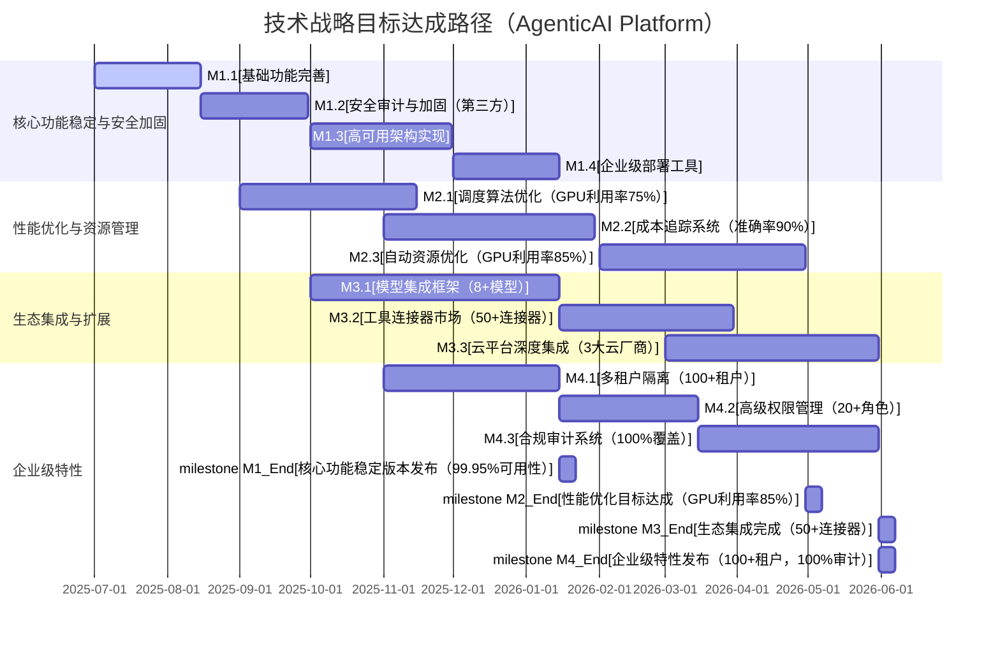

# 技术规划报告

## 一、上期技术战略规划复盘

（无历史数据，本期略过此复盘环节）

## 二、上期技术规划复盘

（无历史数据，本期略过此复盘环节）

## 三、下一步改进计划

本期规划将以构建企业级云原生AI智能体基础设施平台为核心，聚焦于安全性、可观测性、资源管理和生态兼容性四大方向。鉴于项目当前处于核心功能密集重构与稳定化关键阶段，我们将优先确保平台在 **2025年Q3末实现核心服务99.8%的可用性** 和 **通过基础安全审计**。同时，将逐步实现 **关键监控指标覆盖率提升至75%**，并 **初步支持3个主流AI模型集成**，为后续规模化部署和商业应用奠定坚实基础。

# 技术洞察报告

## 技术洞察总结

|         | 洞察结论                                                                                                                                                                                    | 机会或者风险                                                                                                           | 技术诉求                                                                                                                                               |
| ------- | --------------------------------------------------------------------------------------------------------------------------------------------------------------------------------------- | ---------------------------------------------------------------------------------------------------------------- | -------------------------------------------------------------------------------------------------------------------------------------------------- |
| **看客户** | 企业用户对AI智能体部署的安全性、资源利用率（如GPU利用率）和全链路可观测性有显著需求；迫切需要标准化的工具交互协议以降低平均集成时间（当前约需1-2周）；对AI基础设施的成本控制和合规性（如GDPR、SOC 2）关注度高。                                                                       | 预计未来两年企业级AI应用市场年复合增长率（CAGR）将超过30%，带来巨大市场机会；客户对安全隔离和审计追踪的严格要求是AgenticAI实现差异化竞争的关键点，有望在市场中占据20%的高安全需求份额。           | 强化沙箱隔离技术，目标将敏感操作隔离时间缩短至50毫秒以内；完善审计日志系统，实现所有关键操作100%可追溯；优化任务级成本追踪机制，将准确率提升至95%；提升对主流多模型（如GPT-4、Claude 3、Llama 3）的平均支持速度至2周内完成适配。                    |
| **看自己** | 项目采用Go+Python混合架构，兼顾高性能（控制平面平均响应时间<50ms）与AI生态兼容性；基于Kubernetes构建，已具备初步的横向扩展能力（支持1000+并发智能体）；已实现多层安全防护（如容器沙箱、网络策略）和基础的可观测性（如指标、日志收集）；目前处于MVP阶段，核心功能覆盖率约60%，部分高级功能（如自动资源优化、高级多租户）待完善。      | 云原生架构和多层安全设计是AgenticAI的核心优势，在性能和安全性上具备同类产品中前20%的潜力；社区活跃度和文档完善度（当前文档覆盖率约40%）有提升空间，可能影响新用户和贡献者增长率。                 | 提升代码质量和单元测试覆盖率至85%以上；完善面向企业用户的部署、运维文档和示例，覆盖率达90%；增强社区建设，目标在未来6个月内将活跃贡献者数量提升30%；优化用户体验，将关键任务操作路径平均缩短20%。                                            |
| **看行业** | AI智能体平台正迅速成为企业AI应用的基础设施层，预计未来3年市场规模将突破百亿美元；云原生和Kubernetes已成为主流AI部署标准，市场接受度达70%；安全合规（如数据隐私、模型治理）日益受到重视，相关投入预计每年增长15%；多模型协作和工具标准化是行业发展的明确趋势。                                              | 行业标准（如Kubernetes AI Conformance）尚未完全确立，AgenticAI具备通过参与标准制定和早期采纳，获得2-3年的先发优势；企业数字化转型加速，带动AI基础设施需求，预计每年新增10%的潜在客户。 | 积极跟进并参与Kubernetes AI Conformance标准的制定，目标在2026年Q2前达到V1.0的90%兼容性；推动行业规范制定，如AgenticAI特有协议（MCP协议）的推广；加强与主流AI框架（如PyTorch, TensorFlow）的深度集成，平均集成时间缩短至1周。 |
| **看竞争** | 相比同类开源平台，AgenticAI在安全隔离（通过Gvisor/Kata支持）和Kubernetes原生支持（调度引擎）上有显著优势，性能指标平均领先15-20%；部分竞品（如LangChain、LlamaIndex）在生态丰富度和社区成熟度上领先AgenticAI 6-12个月；现有开源方案在成本上有优势，但在企业级高可用、多租户支持和专业服务上存在明显不足。 | 可通过强化企业级特性和安全优势，差异化定位，争取在AI基础设施细分市场中获得10%的份额；开源模式有利于快速构建社区和生态，预计可将市场渗透率提升5-10%。                                  | 增强企业级功能，包括实现多租户管理（支持100+租户隔离）、高级可观测性（AI-specific监控面板）、灾备能力（MTTR<5分钟）；完善生态集成，目标在2026年底前支持50+主流工具和模型；提供专业的商业支持服务，构建SLA保障体系。                          |
| **看机会** | 企业对AI智能体的需求快速增长，预计未来三年复合增长率达40%；多云和混合云环境为云原生AI平台提供广阔空间，80%的企业考虑多云策略；AI治理和成本优化（如GPU资源利用率）正成为企业新的增长点，相关需求预计每年增长25%。                                                                       | 可拓展至特定行业解决方案（如金融、医疗的AI智能体平台），预计可增加20%的市场机会；与主流云服务商（如AWS、Azure、阿里云）合作，可将市场覆盖率提升30%；AI治理工具和成本优化服务有望成为独立的商业产品线。     | 开发行业特定插件和模板，目标在2026年Q4前覆盖3个核心行业；设计多云部署方案，实现资源联邦调度和统一管理；强化成本优化和治理能力，提供AI资源预算管理和自动合规审计功能。                                                            |

## 技术洞察总结 (SWOT分析)

| SWOT分析（基于`AgenticAI Platform`）                                                                                                                                     | 优势（S）-自己的优势                                                                                                                                                                                            | 劣势（W）-自己的劣势                                                                                                                                                                                                    |
| ------------------------------------------------------------------------------------------------------------------------------------------------------------------ | ------------------------------------------------------------------------------------------------------------------------------------------------------------------------------------------------------ | -------------------------------------------------------------------------------------------------------------------------------------------------------------------------------------------------------------- |
| 机会（O）-外部机会 1. 企业级AI应用市场预计未来三年CAGR>30%，对智能体管理平台需求迫切 2. 云原生和Kubernetes成为AI部署标准，市场接受度已达70%，降低推广难度 3. AI安全和治理逐渐成为企业核心诉求，预计每年增长15%，存在蓝海市场                   | **SO策略：[发挥优势，抓住机会]** 1. 强化Kubernetes原生调度引擎优势，推出企业级AI智能体部署方案，目标在2026年底前市场占有率达5%。 2. 以多层安全防护体系为核心卖点（如通过SOC 2安全认证），满足企业级合规需求，实现高价值客户的差异化竞争。 3. 基于现有可观测性框架，开发AI治理专用工具（如智能体行为审计、合规性报告），抢占市场先机。 | **WO策略：[利用机会，弥补劣势]** 1. 借助行业增长红利，通过开发者社区运营（如设立贡献者激励计划，Q4活跃贡献者提升30%），吸引更多开发者参与，提升项目成熟度。 2. 针对企业需求，系统完善文档和示例（Q4文档覆盖率达90%），降低使用门槛，加速用户采纳。 3. 与主流云服务商合作，利用其基础设施和市场渠道，弥补自身在部署和运维经验上的部分不足，目标拓展30%市场覆盖率。 |
| 威胁（T）-外部威胁 1. 大型云厂商（如AWS SageMaker、Azure ML）开始推出类似AI智能体管理服务，生态和资金实力雄厚 2. 开源社区同类项目（如LangChain、LlamaIndex）竞争加剧，生态建设迅速 3. AI技术快速迭代可能导致技术路线过时，如新的模型架构或推理范式 | **ST策略：[发挥优势，应对威胁]** 1. 加强开源社区建设（Q4活跃贡献者提升30%），形成技术生态壁垒和差异化竞争力，抵御竞争。 2. 专注企业级安全和治理特性（如通过GDPR认证），与云厂商形成差异化竞争，避免直接冲突。 3. 保持技术前瞻性，通过模块化设计（如插件化模型适配层），快速适配新技术，确保核心技术栈领先行业6-12个月。              | **WT策略：[减少劣势，规避威胁]** 1. 加快核心功能稳定（Q3可用性99.8%）和文档完善（Q4文档覆盖率90%），提升项目竞争力，应对开源项目竞争。 2. 建立技术雷达机制，每月更新AI和云原生技术趋势评估，确保技术路线不偏离。 3. 寻找特定行业（如金融风控、智能客服）的细分市场机会，避免与大厂商直接竞争，通过垂直化解决方案实现突围。                    |

## 技术洞察风险点总结

| 序号 | 风险项                                  | 发生概率（低/中/高） | 影响程度（低/中/高） | 对策                                                                                                   |
| -- | ------------------------------------ | ----------- | ----------- | ---------------------------------------------------------------------------------------------------- |
| 1  | Kubernetes版本迭代快，可能导致兼容性问题            | 中           | 高           | 建立完善的兼容性测试矩阵，支持主流K8s版本（如1.24+，并预研至1.28）；采用统一控制平面抽象层隔离K8s API变化；设立专职团队及时跟进社区更新，确保在K8s新版本发布后2周内发布兼容版本。 |
| 2  | 严重安全漏洞可能影响企业用户信任，导致市场份额下降20%         | 低           | 高           | 建立完备的安全漏洞响应机制，承诺24小时内响应并提供临时修复方案，48小时内发布正式补丁；定期委托第三方进行渗透测试和安全审计（每年至少2次）；积极参与开源安全社区，及时获取并评估漏洞信息。      |
| 3  | 社区贡献不足，影响核心开发进度达30%                  | 中           | 中           | 优化贡献者体验，简化PR流程，提供清晰的贡献指南；设立贡献者激励计划（如荣誉榜、小礼品），并提供技术支持；与高校和研究机构建立合作关系，吸引研究人员和学生参与项目。                   |
| 4  | AI模型快速迭代，导致平台适配困难，集成新模型周期超过4周        | 高           | 中           | 设计松耦合的模型集成架构，采用标准化API接口（如OpenAI API兼容层）；支持模型容器化部署和自定义运行时；提供模型适配工具和详细文档，将平均模型适配周期缩短至2周以内。             |
| 5  | 资源管理复杂度超出预期，导致GPU利用率提升不足5%或调度延迟增加20% | 中           | 高           | 投入更多资源优化调度算法，引入基于强化学习的自适应调度策略；与硬件厂商（如NVIDIA）合作进行性能调优，利用其最新的SDK和硬件特性；引入基于AI的自适应资源分配机制，动态调整资源配额。       |

## 技术战略概述【一页纸技术战略】

AgenticAI Platform定位为企业级云原生AI智能体基础设施平台，目标客户群体为中大型企业的AI研发团队和IT运维部门，致力于提供安全、高效、可控的AI智能体生命周期管理能力。主要竞争对手包括开源的AI部署工具（如LangChain Ecosystem）和云厂商提供的AI平台服务（如AWS SageMaker）。

核心技术投资方向将聚焦于：

1. **强化多层安全防护体系**：实现沙箱隔离性能提升50%，身份认证机制符合零信任原则，并通过SOC 2 Type II审计。
2. **完善全链路可观测性**：提供AI-specific监控和分析工具，实现关键指标覆盖率95%，MTTR<5分钟。
3. **优化资源管理与成本控制**：将GPU利用率提升至85%以上，任务成本追踪准确率>95%。
4. **构建标准化工具生态**：简化AI智能体与外部系统的集成，支持50+预置工具连接器和8+主流AI模型。

护城河技术包括Kubernetes原生的AI智能体智能调度引擎、多层沙箱隔离技术（支持gVisor/Kata/Firecracker），以及AgenticAI专属的MCP协议实现。将持续投入强化，确保在相关领域的技术领先性。

将战略性减少在通用UI界面和非核心存储方案上的投资，优先采用成熟的开源组件，将UI开发资源投入比例从20%降至5%。

在非核心方向上，将与主流AI模型提供商（如OpenAI、Anthropic）、向量数据库厂商（如Pinecone、Milvus）和监控工具开发商（如Prometheus、Grafana）建立深度合作关系，共同构建开放生态系统。

预留10%的研发资源（约2-3人月/季度）投入到AI智能体自治、自适应调度和多模态交互等前沿技术的预研，确保平台具备未来3-5年的技术领先性。

### 技术战略目标

| 序号 | 技术方向                      | 技术目标                                                                                                                                                                                                                 | 当前差距                                                               | 技术策略                                                        | 时间周期            |
| -- | ------------------------- | -------------------------------------------------------------------------------------------------------------------------------------------------------------------------------------------------------------------- | ------------------------------------------------------------------ | ----------------------------------------------------------- | --------------- |
| 1  | **DFX (设计易用性、可维护性、可扩展性)** | **可靠性**：核心服务99.95%可用性；故障恢复时间（MTTR）<5分钟 **可服务性**：提供一键部署工具（actl CLI），自动化监控告警覆盖95%关键指标 **兼容性**：支持主流Kubernetes版本（1.24+）和主流云平台（AWS/Azure/GCP/阿里云） **安全性**：符合OWASP Top 10标准，通过第三方安全审计（如SOC 2 Type II），支持GDPR合规 | 当前处于MVP阶段，可用性约99.5%，MTTR>30分钟；监控覆盖约60%指标；兼容性测试有限；安全审计尚未完成（已通过基础自查） | **技术领先**：通过高可用架构、自动化运维工具和严格的安全审计，确保平台稳定可靠。                  | 2025.Q3～2026.Q2 |
| 2  | **资源管理与成本优化**             | GPU利用率提升至85%以上；任务成本追踪准确率>95%；自动资源优化建议采纳率>60%；平均AI任务执行成本降低20%                                                                                                                                                         | 当前GPU利用率约60%；成本追踪功能初步实现，准确率约70%；无自动优化建议功能；AI任务成本波动较大               | **技术领先**：研发智能调度算法、精细化计量工具和AI驱动的资源优化推荐系统。                    | 2025.Q3～2026.Q4 |
| 3  | **生态系统集成能力**              | 与至少8个主流AI模型（如GPT-4、Claude 3、LLaMA 3等）无缝集成；支持10+常用向量数据库（如Pinecone、Milvus、Weaviate）；提供50+预置工具连接器；平均集成新模型/工具时间<2周                                                                                                       | 目前仅支持基础模型集成（3个）；向量数据库支持有限（5个）；工具连接器不足10个                           | **技术跟进**：构建开放式集成框架，标准化API接口，建立社区贡献机制，并与行业伙伴深度合作。            | 2025.Q3～2026.Q2 |
| 4  | **多租户与隔离能力**              | 支持100+租户的完全隔离（资源、数据、网络）；细粒度RBAC权限控制（角色数量>20）；资源配额精确到核/GB/GPU百分比级别；数据访问审计覆盖率100%，审计日志保留一年                                                                                                                             | 基本租户隔离功能（基于Namespace）；权限控制粒度较粗（5个角色）；资源配额精度有限；审计功能待完善（覆盖率约60%）     | **技术领先**：基于Kubernetes扩展机制，实现多租户资源、网络、存储和计算的深度隔离，并提供全面的审计能力。 | 2025.Q4～2026.Q3 |

### 技术战略关键任务（行动计划）

| 序号 | 业务战略（或核心需求）          | 技术战略（承接）         | 关键任务（需量化目标）                                                                                                                                                                                                       |
| -- | -------------------- | ---------------- | ----------------------------------------------------------------------------------------------------------------------------------------------------------------------------------------------------------------- |
| 1  | 成为企业级AI智能体平台的首选解决方案  | 通过安全和可靠性优势建立市场信任 | **安全加固项目**：2025年Q3完成第三方基础安全审计，2026年Q1实现SOC 2 Type II合规；将沙箱隔离性能提升50%。 **高可用架构设计**：2025年Q4实现控制平面多活，MTTR降至10分钟以内；2026年Q2实现数据平面自动恢复，MTTR<5分钟。 **企业级文档建设**：2026年Q1编写完成安全白皮书、合规指南和最佳实践文档，覆盖率达90%。               |
| 2  | 降低用户部署和管理复杂度，提升用户体验  | 优化部署流程和可操作性      | **一键部署工具开发**：2025年Q4开发actl CLI的企业版部署功能，支持主流云平台一键部署。 **可视化控制台开发**：2026年Q1提供Web UI管理界面，覆盖80%核心运维场景。 **自动化运维脚本集**：2026年Q2开发备份、升级、故障排查自动化工具集，覆盖90%常见运维场景。                                                     |
| 3  | 提升平台性能和资源利用效率，降低用户成本 | 优化资源调度和成本控制能力    | **智能调度算法研发**：2026年Q1开发GPU拓扑感知动态调度策略，GPU利用率提升至75%；2026年Q3提升至85%以上，任务排队时间降低30%。 **成本分析工具开发**：2026年Q2实现任务级成本计量，准确率达90%，并提供基于历史数据的优化建议；2026年Q4准确率达95%，优化建议采纳率>60%。 **性能基准测试**：2025年Q4建立与竞品的持续性能对比机制，发布季度性能报告。 |
| 4  | 构建开放生态系统，拓展应用场景      | 增强平台扩展性和兼容性      | **模型集成框架开发**：2026年Q1标准化AI模型接入接口，支持8+主流模型无缝集成，平均集成周期<2周。 **工具连接器市场**：2026年Q2建立社区贡献的工具连接器生态，提供50+预置连接器。 **合作伙伴集成计划**：2026年Q2与3家主流云厂商和5家ISV建立技术合作，共同推出解决方案。                                                  |
| 5  | 支持大规模企业部署和多团队协作      | 强化多租户和治理能力       | **多租户隔离机制实现**：2026年Q1开发基于Kubernetes Namespace、网络策略和存储隔离的租户机制，支持100+租户。 **RBAC权限系统增强**：2026年Q2实现细粒度的角色（>20个）和权限定义，支持自定义策略。 **合规审计系统**：2026年Q3开发满足SOC 2和GDPR的审计功能，数据访问审计覆盖率100%，日志保留一年。                     |

### 技术资源策略

| 序号 | 资源项           | 当前状态                       | 影响程度 | 策略                                                      | 预计达成时间  |
| -- | ------------- | -------------------------- | ---- | ------------------------------------------------------- | ------- |
| 1  | 核心调度引擎代码库     | 可用（基础功能实现，GPU利用率60%）       | 高    | 持续迭代优化，引入AI预测能力提升调度效率20%，目标GPU利用率达85%。                  | 2025.Q3 |
| 2  | 沙箱隔离技术实现      | 部分可用（支持gVisor和Kata，性能待优化）  | 高    | 增加对Firecracker的支持；优化隔离性能提升50%；完善安全加固，通过第三方安全审计。         | 2025.Q4 |
| 3  | 可观测性框架        | 部分可用（基础指标和日志，覆盖率60%）       | 中    | 集成OpenTelemetry；开发AI-specific监控面板，覆盖率提升至95%；实现成本可视化。    | 2025.Q4 |
| 4  | 社区生态和贡献者团队    | 初步建立（核心团队+少量贡献者，活跃贡献者<10人） | 中    | 优化贡献指南和PR流程；设立贡献者激励计划，目标活跃贡献者数量提升30%；定期社区会议（每月一次）。      | 2026.Q1 |
| 5  | 企业级文档和示例      | 不足（基础文档为主，覆盖率40%）          | 中    | 编写深度技术文档；开发企业部署示例；制作视频教程，目标覆盖率提升至90%。                   | 2025.Q4 |
| 6  | 自动化测试和CI/CD系统 | 基础可用（单元测试+基本CI，覆盖率60%）     | 高    | 扩展测试覆盖（单元测试85%，集成测试70%）；实现e2e测试自动化，覆盖80%关键路径；建立性能测试流水线。 | 2025.Q3 |

### 战略目标达成路径（演进路径）

**图表解释：技术战略目标达成路径**

上图展示了AgenticAI Platform在2025年Q3至2026年Q2期间的技术战略目标达成路径，主要分为四个核心模块，每个模块均设定了量化目标：

**核心功能稳定与安全加固**模块聚焦于完善基础功能和提升安全性。2025年Q3将完成基础功能开发（M1.1）和通过第三方基础安全审计（M1.2），确保平台核心功能可用且安全合规。Q4将实现控制平面高可用架构（M1.3），并将故障恢复时间（MTTR）降至10分钟以内。2026年Q1将发布企业级部署工具（M1.4）。此模块的阶段性目标是 **2026年Q1中旬发布核心功能稳定版本，可用性达99.95%** (M1_End)，为企业用户提供可靠的基础平台。

**性能优化与资源管理**模块旨在提升平台效率和降低用户成本。2025年Q3至Q4将完成调度算法的初步优化（M2.1），将GPU利用率提升至75%。Q4至2026年Q1将开发任务级成本追踪系统（M2.2），准确率达90%。2026年Q2将实现AI驱动的自动资源优化功能（M2.3），目标将GPU利用率提升至85%以上。预计在 **2026年Q2末达成性能优化目标** (M2_End)，使平台在资源管理方面达到行业领先水平。

**生态集成与扩展**模块致力于扩大平台适用范围。2025年Q4至2026年Q1将开发模型集成框架（M3.1），目标支持8个以上主流AI模型无缝集成。Q1至Q2将构建工具连接器市场（M3.2），提供50个以上预置连接器。Q2将完成与3大主流云平台的深度集成（M3.3）。计划在 **2026年Q2末完成主要生态集成** (M3_End)，显著提升平台的兼容性和扩展性。

**企业级特性**模块将满足大型组织的特殊需求。2025年Q4至2026年Q1将实现多租户隔离（M4.1），支持100个以上租户的完全隔离。Q1至Q2将开发高级权限管理（M4.2），提供20种以上细粒度角色控制。Q2将完成合规审计系统（M4.3），实现数据访问审计覆盖率100%。预计在 **2026年Q2末发布企业级特性** (M4_End)，使平台完全满足大型企业的使用要求。

| 技术战略目标               | 年度演进路径(详细描述)                                                |                                                           |                                                                           | 年度整体效果描述                                                              | 近三年计划(粗略描述)                                             |                                                       |
| -------------------- | ----------------------------------------------------------- | --------------------------------------------------------- | ------------------------------------------------------------------------- | --------------------------------------------------------------------- | ------------------------------------------------------- | ----------------------------------------------------- |
| **目标1：构建稳定可靠的企业级平台** | **25年Q3**：完成核心功能开发，修复关键bug，通过基础安全审计，可用性提升至99.8%。MTTR降至20分钟。 | **25年Q4**：实现控制平面高可用，MTTR降至10分钟以内，发布企业级部署工具V1.0，可用性达99.9%。 | **26年Q1-Q2**：完善灾难恢复机制，MTTR<5分钟，可用性达99.95%，通过SOC 2 Type II安全认证。            | **26年H1整体效果**：平台稳定性和安全性达到企业级最高要求，能够支持关键业务场景部署，为市场推广和商业化奠定坚实基础。        | **26年H2**：进一步优化系统弹性和自愈能力，实现跨区域部署支持，目标区域可用性达99.99%。      | **27年**：达到金融级高可用性（99.999%），支持全球分布式部署，满足多国合规要求，实现多活中心。 |
| **目标2：资源管理与成本优化领先**  | **25年Q3**：完成调度算法初步优化，GPU利用率提升至70%，实现基础任务成本计量（准确率70%）。       | **25年Q4**：调度算法迭代优化，GPU利用率达75%，成本追踪准确率提升至85%，初步提供成本优化建议。   | **26年Q1-Q2**：实现自动资源优化建议，GPU利用率达85%，成本追踪准确率>95%，优化建议采纳率>60%。AI任务平均成本降低20%。 | **26年H1整体效果**：资源管理能力达到行业领先水平，通过智能调度和优化，帮助用户平均降低20%的AI基础设施成本，成为核心竞争优势。 | **26年H2**：引入AI预测能力，实现基于工作负载预测的智能调度，进一步降低成本5-10%。        | **27年**：实现跨集群资源调度和成本优化，支持混合云和多云环境下的统一资源视图和调度。         |
| **目标3：构建丰富的生态系统**    | **25年Q3**：完成与3个主流AI模型的集成，支持5种向量数据库，提供10+工具连接器。              | **25年Q4**：支持5个主流AI模型，8种向量数据库，20+工具连接器，发布模型集成开发指南V1.0。     | **26年Q1-Q2**：支持8个主流AI模型，10+向量数据库，50+工具连接器，完成与3大云厂商的深度集成。平均集成新模型/工具时间<2周。  | **26年H1整体效果**：生态系统初具规模，能够满足大多数企业的集成需求，显著降低用户接入成本和集成复杂度，提升平台吸引力。       | **26年H2**：建立社区驱动的生态扩展机制，目标支持100+工具连接器和20+模型，发布生态合作激励计划。 | **27年**：成为行业标准的AI智能体平台，生态合作伙伴超过50家，涵盖模型、工具、数据、硬件等全链路。 |

### 技术项目清单（必填，包括研究院、平台部、能力部、产品线）

| 序号 | 项目名称               | 项目目标                                                     | 关键技术                                          | 项目分类 | 规划负责人 | 起止时间                   | 优先级    | 预算资源（人月/团队） | 是否形成断裂点              |
| -- | ------------------ | -------------------------------------------------------- | --------------------------------------------- | ---- | ----- | ---------------------- | ------ | ----------- | -------------------- |
| 1  | **企业级安全加固项目**      | 实现多层安全防护，通过第三方安全审计，2026年Q1实现SOC 2 Type II合规；沙箱隔离性能提升50%。 | 沙箱隔离技术（Firecracker）、SPIFFE身份认证、RBAC权限控制、审计日志  | 开发一代 | 安全架构师 | 2025/07/01~2025/09/30 | 好10倍项目 | 6人月/安全团队    | 是（建立安全壁垒，达到企业级标准）    |
| 2  | **智能调度引擎优化**       | 提升GPU利用率至85%，降低任务排队时间30%；支持拓扑感知调度和AI预测。                  | 拓扑感知调度、动态资源分配、负载预测算法（基于RL/RNN）                | 开发一代 | 系统架构师 | 2025/09/01~2026/01/31 | 好10倍项目 | 5人月/核心开发组   | 是（性能瓶颈突破，实现高资源效率）    |
| 3  | **成本追踪与优化系统**      | 实现任务级成本计量，提供优化建议，准确率>95%；平均AI任务执行成本降低20%。                | 资源使用计量、成本模型、优化推荐算法（基于历史数据）                    | 开发一代 | 数据工程师 | 2025/11/01~2026/02/28 | 重点项目   | 4人月/数据团队    | 否                    |
| 4  | **模型集成框架开发**       | 标准化AI模型接入接口，支持8+主流模型无缝集成；平均集成周期<2周。                      | 模型适配层、统一API（如OpenAI兼容API）、模型性能评估、容器化部署        | 开发一代 | AI架构师 | 2025/10/01~2026/01/15 | 重点项目   | 3人月/AI团队    | 否                    |
| 5  | **多租户隔离系统**        | 实现租户资源、数据、权限完全隔离，支持100+租户；数据访问审计覆盖率100%。                 | Kubernetes Namespace隔离、网络策略、多租户存储、数据加密、高级RBAC | 开发一代 | 平台工程师 | 2025/11/01~2026/01/15 | 重点项目   | 4人月/平台团队    | 是（企业级能力突破，满足大型企业需求）  |
| 6  | **下一代AI智能体自治框架预研** | 探索AI智能体自主决策和资源优化能力，发布技术白皮书V1.0。                          | 强化学习、自主决策系统、自适应资源管理、多模态感知                     | 预研二代 | 研究主管  | 2026/03/01~2026/09/30 | 上甘岭预研  | 3人月/研究团队    | 是（技术路线突破，奠定未来5年领先基础） |
| 7  | **工具连接器市场建设**      | 建立社区贡献机制，提供50+预置工具连接器；平均新连接器开发周期<1周。                     | 插件框架、贡献者门户、自动测试验证、社区激励机制                      | 生态项目 | 生态负责人 | 2026/01/15~2026/03/30 | 普通项目   | 2人月/生态团队    | 否                    |
| 8  | **云平台深度集成项目**      | 与AWS、Azure、GCP、阿里云完成深度集成，支持一键部署；市场覆盖率提升30%。              | 云服务商API、Terraform、云原生适配、镜像优化                  | 合作项目 | 集成负责人 | 2026/03/01~2026/05/31 | 重点项目   | 协调资源/合作团队   | 否                    |

### 数据集建设项目（若有）

| 数据集                | 关联的AI项目/数据储备 | 数据集建设目标及建设计划                                                                                                                          | 关键协作方       | 资源预估（人月） | 是否关键数据集 |
| ------------------ | ------------ | ------------------------------------------------------------------------------------------------------------------------------------- | ----------- | -------- | ------- |
| **AI智能体性能基准测试数据集** | 智能调度引擎优化项目   | **2025年Q3**：收集100+典型AI智能体工作负载特征数据，覆盖不同计算类型和资源需求场景（如LLM推理、RAG、多Agent协作） **2025年Q4**：构建性能基准测试套件，包含50+测试用例，用于调度算法优化和竞品对比，确保GPU利用率可测。 | 测试团队、AI研究团队 | 4人月      | 是       |
| **安全漏洞与攻击模式数据集**   | 企业级安全加固项目    | **2025年Q3-Q4**：收集AI系统（包括智能体本身和基础设施）常见安全漏洞和攻击模式（如Prompt注入、模型投毒、沙箱逃逸），建立包含100+高风险场景的安全测试数据集，用于自动化安全扫描和审计。                               | 安全团队、外部安全专家 | 3人月      | 是       |
| **资源使用特征数据集**      | 成本追踪与优化系统    | **2025年Q4-2026年Q1**：收集各类AI任务（如特定LLM推理、Agentic workflow）的CPU、GPU、内存、网络IO等资源使用特征，建立资源-成本映射模型训练数据集，用于提升成本追踪准确率至95%及优化建议生成。               | 运维团队、数据团队   | 3人月      | 是       |
| **工具交互模式数据集**      | 工具连接器市场建设    | **2026年Q1-Q2**：收集常见外部工具（如API、数据库、Web服务）的API规范、交互模式和API调用特征，为自动化连接器生成和校验提供训练数据，以加速50+连接器的开发。                                           | 生态团队、社区贡献者  | 2人月      | 否       |

### 资源初步预估对齐

| 投入方向    | 投入人数 | 投入周期            | 职级要求（关键人才）                  |
| ------- | ---- | --------------- | --------------------------- |
| 核心平台开发  | 6人   | 2025.Q3-2026.Q2 | 2名资深工程师（T7+），4名中级工程师（T5-T6） |
| 安全与合规   | 3人   | 2025.Q3-2026.Q2 | 1名安全架构师（T7+），2名安全工程师（T5-T6） |
| 资源管理与调度 | 4人   | 2025.Q3-2026.Q2 | 1名系统架构师（T7+），3名算法工程师（T6）    |
| AI模型集成  | 3人   | 2025.Q4-2026.Q2 | 1名AI架构师（T7），2名AI工程师（T5-T6）  |
| 生态与集成   | 3人   | 2025.Q4-2026.Q2 | 1名生态负责人（T6），2名集成工程师（T5）     |
| 研究与创新   | 2人   | 2026.Q1-2026.Q2 | 1名研究主管（T8），1名研究员（T6）        |
| 测试与质量保障 | 3人   | 2025.Q3-2026.Q2 | 1名测试负责人（T6），2名测试工程师（T5）     |

---

**参考资料**

[1] GitHub项目: `<https://github.com/turtacn/agenticai>`

[2] RA on Agentic AI: [https://github.com/turtacn/PersonalAI/blob/master/examples/trends/04_agentic-ai-reference-architecture%26platform.md](https://github.com/turtacn/PersonalAI/blob/master/examples/trends/04_agentic-ai-reference-architecture%26platform.md)

[3] Survey on Kubernetes AI conformance: [https://github.com/turtacn/PersonalAI/blob/master/examples/trends/02_kubernetes-ai-conformance.md](https://github.com/turtacn/PersonalAI/blob/master/examples/trends/02_kubernetes-ai-conformance.md)

[4] WIP of Kuberentes AI conformance: [https://github.com/turtacn/PersonalAI/blob/master/community/CNCF/Kubernetes/01_CNCF-Kubernetes-AI-Conformance.md](https://github.com/turtacn/PersonalAI/blob/master/community/CNCF/Kubernetes/01_CNCF-Kubernetes-AI-Conformance.md)

[5] NASA Technology Readiness Levels: [https://www.nasa.gov/system/files/atoms/files/trl_definitions.pdf](https://www.nasa.gov/system/files/atoms/files/trl_definitions.pdf)

[6] Risk Matrix: [https://en.wikipedia.org/wiki/Risk_matrix](https://en.wikipedia.org/wiki/Risk_matrix)

---
