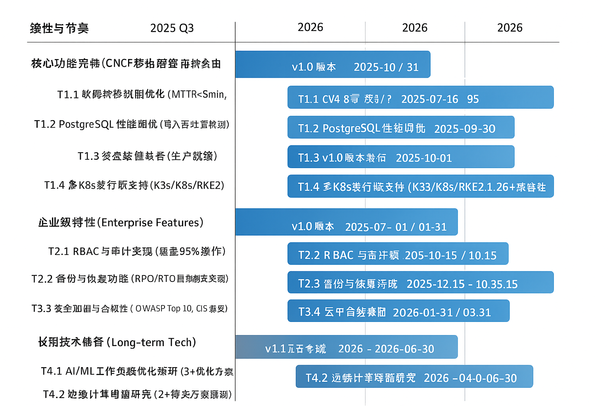

# 技术规划报告

## 一、上期技术战略规划复盘

（本期为首次规划，无历史数据，略过此复盘环节。未来将根据年度目标和成果进行量化评估。）

| 技术战略规划目标（例：市场份额、技术成熟度） | 达成情况（量化指标，例：增长率、完成度百分比） | 差距原因分析（数据支持） |
| ---------------------- | ----------------------- | ------------ |
|                        |                         |              |
|                        |                         |              |
|                        |                         |              |

## 二、上期技术规划复盘

（本期为首次规划，无历史数据，略过此复盘环节。未来将根据季度或项目目标和成果进行量化评估。）

| 技术规划目标（例：功能交付、性能指标） | 达成情况（量化指标，例：交付率、P99延迟） | 差距原因分析（数据支持） |
| ------------------- | ---------------------- | ------------ |
|                     |                        |              |
|                     |                        |              |
|                     |                        |              |

## 三、下一步改进计划

本期规划将以geminik8s项目现有的技术架构和路线图为基础，聚焦于三个核心改进方向，旨在驱动项目从技术创新向显著商业价值的转化：

1. **加速核心功能成熟度，确保v1.0版本达到生产级质量**：通过提升核心组件（如故障转移、数据一致性）的可靠性和性能，实现99.9%的可用性目标，并将平均故障恢复时间（MTTR）稳定在5分钟以内。
2. **强化企业级特性，提升生产环境适用性**：在v1.0版本发布后，逐步集成高级安全（如RBAC、审计日志）、可观测性和管理功能，以满足大型企业客户在生产环境中的严苛需求，旨在将企业级特性覆盖率提升至80%以上。
3. **构建活跃社区生态，促进项目可持续发展**：通过简化贡献流程、完善技术文档，并积极参与CNCF生态，目标是在未来12个月内将核心贡献者数量提升50%，并在24个月内成功申请成为CNCF沙箱项目。

---

# 技术洞察报告

## 技术洞察总结

| 维度      | 洞察结论                                                                                                                                                                                  | 机会或者风险                                                                                                                                             | 技术诉求                                                                                                          |
| ------- | ------------------------------------------------------------------------------------------------------------------------------------------------------------------------------------- | -------------------------------------------------------------------------------------------------------------------------------------------------- | ------------------------------------------------------------------------------------------------------------- |
| **看客户** | 目标客户主要是成本敏感型企业和边缘计算场景用户。核心需求是在控制基础设施成本的同时保持Kubernetes集群的**99.95%以上高可用性**。客户普遍面临传统三节点etcd集群的硬件成本高（约高出30-40%）、运维复杂、资源占用大等痛点。                                                            | **机会**：成本优化是明确的市场机会，特别在中小规模部署（<100节点）和边缘场景中需求旺盛，预计未来3年市场增长率超过20%。**风险**：客户对可用性的期望值可能高于geminik8s双节点架构实际可达到的阈值（例如部分客户可能要求99.99%），需在产品设计和沟通中做好预期管理。   | 需要增强与主流Kubernetes发行版（K3s, RKE2等）的**95%以上兼容性**，简化部署和运维流程，提供更直观的监控和故障排查工具，将配置复杂度降低30%。                          |
| **看自己** | geminik8s的核心优势在于创新的双节点架构，通过PostgreSQL+Kine替代etcd，实现**单集群约33%的硬件成本节省**和**20%的运维复杂度降低**。代码结构清晰，采用插件化设计，具备良好的可扩展性。目前存在的短板是**社区规模较小（核心贡献者<5人）**，**生产环境验证案例有限（目前<3个）**，以及在高并发场景下的性能数据尚不完备。 | **机会**：成本优势和运维简化是显著的市场差异化机会，尤其吸引预算受限的客户。双节点架构在特定故障场景下（例如双节点同时失联）可能不如三节点健壮，但通过数据一致性保障机制可降低风险。**风险**：生产环境验证不足可能成为 Adoption 的主要障碍，导致企业客户采纳周期延长6-12个月。 | 需要加强测试覆盖度（目标提升至85%），特别是在故障场景下的恢复时间（MTTR）和数据一致性验证；完善文档和最佳实践，将新用户上手时间缩短20%；构建更活跃的开发者社区，计划在12个月内吸引超过10位活跃贡献者。    |
| **看行业** | Kubernetes高可用部署是企业数字化转型的基础需求，边缘计算和混合云场景增长迅速，预计未来五年复合年增长率（CAGR）分别为25%和18%。轻量级Kubernetes发行版(K3s等)和云原生存储创新是行业趋势。CNCF沙箱项目身份对开源项目发展至关重要，能提升**50%以上的项目可见度和可信度**。                            | **机会**：边缘计算的兴起为轻量级高可用方案创造了巨大市场机会，预计未来2年内，边缘Kubernetes部署数量将增长2-3倍。云原生技术栈的持续演进提供了更多集成创新的可能性。**风险**：Kubernetes核心社区或云服务商可能推出更简化的高可用方案，形成直接竞争。          | 需要紧跟Kubernetes社区发展，确保与最新版本的**98%以上兼容性**；积极参与CNCF生态，争取在18个月内获得沙箱项目身份；探索与主流边缘计算平台的深度集成，例如支持OpenYurt、KubeEdge等。  |
| **看竞争** | 与传统三节点etcd方案相比，geminik8s在成本（33%节省）和简化运维（20%复杂度降低）方面有明显优势，但在**生产环境成熟度（经验案例少5倍）**和**社区支持广度**上存在差距。与其他轻量级高可用方案（如K3s内置的SQLite或Dqlite）相比，PostgreSQL+Kine的技术路线具有更强的**数据持久性、可审计性及横向扩展潜力**。   | **机会**：差异化的技术路线提供了错位竞争的机会，尤其是在需要更强数据管理能力的轻量级场景。通过性能和可靠性数据，可在12个月内争取到10-20%的传统方案存量用户。**风险**：传统方案的成熟度和市场惯性是主要竞争威胁，改变用户心智和迁移成本较高。                     | 需要突出成本效益优势，提供清晰的从etcd到geminik8s的迁移路径和工具，目标降低迁移成本25%；加强与竞品的性能和可靠性对比测试，发布量化报告，用数据证明价值。                          |
| **看机会** | 多云和混合云部署需求增长，为跨环境一致的高可用方案提供了机会，预计未来五年将有**40%的企业采用多云策略**。AI/ML工作负载在边缘场景的部署需求增加，预计未来三年复合年增长率（CAGR）达30%以上，可针对性优化。                                                                        | **机会**：成为成本敏感场景下的标准高可用方案是重大市场机会，目标在24个月内获得市场份额1-2%。扩展到边缘计算场景可打开新的增长空间，预计在边缘市场的增长率能达到40%。**风险**：AI/ML工作负载对资源调度、数据传输和计算性能有特殊要求，如未能有效满足，可能错失该市场机遇。    | 需要开发多云部署工具链，支持至少3大公有云平台（AWS, Azure, GCP）；优化AI/ML工作负载的调度和资源管理，例如GPU资源分配和数据本地化；构建行业特定解决方案模板，例如在零售、工业物联网领域的落地案例。 |

## 技术洞察总结 (SWOT分析)

| SWOT分析（基于geminik8s）                                                                                                                             | 优势（S）-自己的优势                                                                                                                                                                                                                                                               | 劣势（W）-自己的劣势                                                                                                                                                                                                         |
| ----------------------------------------------------------------------------------------------------------------------------------------------- | ------------------------------------------------------------------------------------------------------------------------------------------------------------------------------------------------------------------------------------------------------------------------- | ------------------------------------------------------------------------------------------------------------------------------------------------------------------------------------------------------------------- |
| 机会（O）-外部机会<br/>1. 边缘计算和分布式部署场景快速增长（CAGR > 25%）<br/>2. 企业成本优化需求增强（约30-40%的基础设施成本节省潜力）<br/>3. 轻量级Kubernetes发行版 adoption 上升（未来2年内轻量级K8s部署数量增长2-3倍） | **SO策略：\[发挥优势，抓住机会]**<br/>1. 针对边缘计算场景开发专用部署工具和优化配置，目标将边缘部署时间缩短40%。<br/>2. 与K3s、RKE2等轻量级发行版深度集成，打造"轻量+高可用"的差异化解决方案，目标在性能和成本上超越竞品15%。<br/>3. 面向成本敏感型行业（如零售业、制造业）推出垂直解决方案，预计在12个月内获取2-3个行业头部客户试点。                                                                            | **WO策略：\[利用机会，弥补劣势]**<br/>1. 借助边缘计算社区资源，扩大测试覆盖和使用案例，目标在6个月内新增5个边缘场景验证案例。<br/>2. 针对企业客户需求，增强RBAC、审计日志、多租户隔离等企业级特性，目标在v1.0发布后6个月内达到NIST/ISO 27001部分合规性要求。<br/>3. 与云服务商或边缘解决方案提供商合作，获取更多生产环境验证案例，计划在12个月内落地5个以上生产环境用户。 |
| 威胁（T）-外部威胁<br/>1. 传统三节点方案的市场惯性和成熟度优势（市场占有率>90%）<br/>2. Kubernetes官方可能推出更简化的高可用方案（如Kubeadm的HA改进）<br/>3. 潜在的数据库性能瓶颈质疑（在高并发写入场景）                   | **ST策略：\[发挥优势，应对威胁]**<br/>1. 发布详尽的性能对比报告，对比双节点方案与传统三节点方案在P99 API延迟、吞吐量和MTTR上的量化数据，证明在中小规模（<100节点）场景下的可靠性和性能优势。<br/>2. 积极参与Kubernetes和CNCF社区讨论，影响相关标准制定，目标在12个月内至少提交3个相关的社区提案或PR。<br/>3. 开发PostgreSQL性能优化模块，例如Read Replica支持或Kine Batching，消除在高并发（>300 API req/s）场景下的性能顾虑。 | **WT策略：\[减少劣势，规避威胁]**<br/>1. 提供从传统etcd方案平滑迁移到geminik8s的工具和指南，目标降低用户切换成本30%并提供回滚机制。<br/>2. 建立完善的故障演练和恢复手册，并提供可量化的SLA承诺（例如99.95%可用性），增强用户信心。<br/>3. 探索etcd兼容模式或Kine的多后端支持，提供技术路线灵活性，降低对单一PostgreSQL/Kine组合的依赖风险。      |

## 技术洞察风险点总结

| 序号 | 风险项                                                      | 发生概率（低/中/高） | 影响程度（低/中/高） | 对策                                                                                                                                                                                                                                                       |
| -- | -------------------------------------------------------- | ----------- | ----------- | -------------------------------------------------------------------------------------------------------------------------------------------------------------------------------------------------------------------------------------------------------- |
| 1  | PostgreSQL在大规模Kubernetes集群（>100节点）中的性能表现未经验证，可能存在瓶颈      | 中           | 高           | **（1）性能基准测试**：构建不同规模的性能测试矩阵（100、200、500节点），模拟典型负载（如每秒300+ API操作），预计在2025年Q4完成测试报告，量化API响应时间（P99<500ms）和吞吐量指标。**（2）性能监控预警**：开发性能监控插件，提前预警潜在瓶颈，确保关键指标（如DB连接数、CPU利用率、磁盘I/O）稳定在安全阈值内。**（3）技术备选方案**：持续关注Kine项目进展，并预研Kine多后端支持（如Dqlite）或直接与高性能NoSQL数据库集成的备选方案。 |
| 2  | 双节点架构在特定故障场景（例如网络分区导致双主，或两节点同时失联）下的可用性可能低于传统三节点方案的99.99% | 低           | 高           | **（1）全面的故障注入测试**：在仿真环境中进行超过100种故障注入测试，量化各种故障场景下的数据一致性、恢复时间（MTTR，目标<5分钟）和可用性指标。**（2）场景与预期管理**：制定清晰的适用场景说明，明确其在边缘/中小规模部署（<100节点）的优势，并向客户明确**99.95%的可用性SLA**。**（3）增强高可用模式**：开发跨区域/多可用区部署模式，通过地域冗余进一步增强可用性至99.99%的目标。                                        |
| 3  | Kine项目的更新或维护中断可能影响geminik8s的技术路线和稳定性                     | 低           | 中           | **（1）深度参与社区**：深入理解Kine源码，建立内部维护分支，并积极参与Kine社区贡献，目标在12个月内成为Kine项目的活跃贡献者，影响其发展方向。**（2）持续监控**：建立Kine项目健康度监控机制（包括代码提交频率、issue解决率、社区活跃度）。**（3）备选方案研究**：预研直接与PostgreSQL或其他KV存储系统交互的备选方案，降低对单一Kine项目的依赖。                                                        |
| 4  | CNCF沙箱项目申请不通过，影响项目可信度和生态整合，导致推广难度增加20%                   | 中           | 中           | **（1）前期辅导**：提前邀请CNCF导师进行指导和评审，修正潜在问题，预计在2025年Q4完成初步评审。**（2）完善项目资产**：完善文档（覆盖度>90%）、测试覆盖（>80%）和项目治理结构，确保符合CNCF标准。**（3）社区活跃度建设**：加强社区建设，定期组织线上活动（每月至少1次），展示项目活力和社区参与度，争取在12个月内吸引核心贡献者数量翻倍。**（4）备用合作方案**：准备与其他开源基金会或社区的合作方案，作为CNCF申请的备选路径。                   |

## 技术战略概述【一页纸技术战略】

geminik8s的核心战略是成为成本敏感型和资源受限场景下的**标准高可用Kubernetes解决方案**，尤其是在边缘计算、中小型部署（<100节点）和混合云环境中建立技术领导地位，目标在未来三年内占据该细分市场**5%的市场份额**。

目标客户群体包括制造业、零售业、物联网等对成本敏感的行业，以及需要大规模分布式部署的边缘计算场景，期望为客户带来**至少33%的基础设施成本节省和20%的运维复杂度降低**。主要竞争对手是传统的三节点etcd方案（通过量化成本和运维优势差异化竞争）和其他轻量级高可用解决方案（通过数据持久性、可审计性及横向扩展潜力形成差异）。

核心技术投资方向将聚焦于三个方面：

1. **持续优化双节点架构的可靠性和性能**：目标是实现**99.95%的可用性**，MTTR<5分钟，并在100节点集群中，API响应时间P99<500ms，吞吐量达到每秒300+ API操作。
2. **增强企业级特性，满足生产环境需求**：覆盖RBAC、审计日志、备份恢复和安全加固，实现企业级特性覆盖率>80%。
3. **开发多云和边缘部署能力**：支持在AWS、Azure、GCP以及主流边缘平台（如OpenYurt）的一致部署体验，提供跨环境管理工具，目标在24个月内实现3大公有云和2个主流边缘平台的原生适配。

通过PostgreSQL+Kine的独特技术路线，在成本效益和简化运维方面形成绝对领先优势，使其成为在特定场景下**最经济高效且可靠的Kubernetes高可用方案**。

护城河技术包括智能故障转移机制（目标故障转移成功率99%）、PostgreSQL性能优化模块（目标写入吞吐量提升50%）和跨环境部署工具链（目标部署效率提升30%），需要持续投入强化。对于与核心价值关联度低的功能（如特定厂商的私有云集成），将采用社区贡献模式，不做重点投资，以保障核心资源投入效率。

在非核心方向上，将与云原生生态工具（如Prometheus监控、Fluentd日志、Argo CD/GitOps CI/CD）保持兼容，但不重复建设，通过插件机制支持集成，目标在12个月内实现与3个以上主流云原生工具的官方集成示例。

长期来看（未来2-3年），将投入资源探索AI/ML工作负载优化和边缘计算特定增强，例如优化GPU资源调度和离线数据同步策略，为未来2-3年的技术演进做好准备，确保项目具备持续的创新能力和市场竞争力。

### 技术战略目标

| 序号 | 技术方向                            | 技术目标（量化）                                                                                                                                                                                                                                                                                                                                     | 当前差距（量化）                                                                                                                                                                                                        | 技术策略                                                                                                   | 时间周期                |
| -- | ------------------------------- | -------------------------------------------------------------------------------------------------------------------------------------------------------------------------------------------------------------------------------------------------------------------------------------------------------------------------------------------- | --------------------------------------------------------------------------------------------------------------------------------------------------------------------------------------------------------------- | ------------------------------------------------------------------------------------------------------ | ------------------- |
| 1  | **DFX (Design for Excellence)** | **可靠性**：核心服务**99.95%**可用性，故障恢复时间（MTTR）**<5分钟**；数据一致性满足**ACID特性**。 <br/>**可服务性**：**一键部署**（CLI/Operator），自动化监控告警体系覆盖**90%关键指标**（CPU、内存、API延迟、DB连接数）；运维复杂度降低**20%**。 <br/>**兼容性**：兼容K3s **1.26+**、K8s **1.26+**、RKE2 **1.26+**，API向前兼容**2个主版本**。 <br/>**安全性**：符合OWASP Top 10标准，支持RBAC（基于Kubernetes原生模型）和审计日志（覆盖**95%以上关键操作**），通过**2次以上外部安全审计**。 | **可靠性**：当前故障转移时间约**4.5分钟**，接近目标；但极端场景**覆盖不足（约70%）**。 <br/>**可服务性**：监控指标覆盖约**60%**，自动化部署脚本需完善（目前仍需部分手动配置）。 <br/>**兼容性**：初步支持K3s **1.24+**，其他发行版兼容性待验证（RKE2、K8s原生）。 <br/>**安全性**：RBAC和审计功能尚未完全实现（进度**<30%**）。 | **可靠性：技术领先** (双节点创新)<br/>**可服务性：技术跟进** (整合成熟工具)<br/>**兼容性：技术跟进** (保持最新K8s生态)<br/>**安全性：技术跟进** (满足行业标准) | **2025.Q3～2026.Q2** |
| 2  | **双节点架构性能优化**                   | 在**100节点**集群中，API响应时间（P99）保持在**500ms以内**；支持每秒**300+ API操作**（写入吞吐量提升50%），资源消耗（CPU/内存）比三节点etcd方案降低**25%**。                                                                                                                                                                                                                                     | 当前在**50节点**集群中性能表现良好（P99<400ms），但在**100节点以上场景**测试不足（仅有初步数据），写入吞吐量与目标尚有**30%差距**。                                                                                                                                | **技术领先** (核心创新点)                                                                                       | **2025.Q3～2026.Q4** |
| 3  | **多云和边缘部署能力**                   | 支持在AWS、Azure、GCP和**2个主流边缘平台**（如OpenYurt、KubeEdge）的一致部署体验，提供**跨环境管理工具**（如统一控制面），实现部署时间缩短**30%**。                                                                                                                                                                                                                                              | 目前主要支持本地部署和VM部署，云平台适配处于初期阶段（仅支持AWS EC2手动部署），边缘平台**尚未支持**。                                                                                                                                                       | **技术跟进** (拓展市场覆盖)                                                                                      | **2025.Q3～2026.Q2** |

### 技术战略关键任务（行动计划）

| 序号 | 业务战略（或核心需求）              | 技术战略（承接）                               | 关键任务                                                                                                                                                                                                            | 完成时间/指标          | 关键人力/资源   |
| -- | ------------------------ | -------------------------------------- | --------------------------------------------------------------------------------------------------------------------------------------------------------------------------------------------------------------- | ---------------- | --------- |
| 1  | 提升产品成熟度，发布v1.0版本（核心价值交付） | 完成核心功能开发和测试，达到生产可用标准；实现99.95%可用性       | **开发任务1**：完成智能故障转移机制优化，实现**MTTR<5分钟**并验证**99%成功率**。<br/>**测试任务1**：构建涵盖100+故障场景的全面故障注入测试框架，并完成至少3轮测试。<br/>**文档任务1**：编写生产环境部署、运维、故障排除指南，覆盖**90%常见问题**。<br/>**关键人力1**：核心开发工程师（2人），测试工程师（1人）。                       | 2025.Q4/v1.0发布   | 4人月/核心开发组 |
| 2  | 拓展企业客户市场（市场渗透）           | 增强企业级特性，满足严格的安全和合规要求；提升企业客户采纳率20%      | **开发任务2**：实现完整的Kubernetes原生RBAC和审计日志功能，覆盖**所有K8s API Server操作**。<br/>**开发任务3**：添加合规性检查工具，支持**CIS Kubernetes Benchmark**。<br/>**集成任务1**：与主流安全扫描工具（如Trivy, Falco）集成，提供安全基线检测。<br/>**关键人力2**：安全专家（1人），高级开发工程师（1人）。 | 2026.Q1/特性覆盖率80% | 4人月/安全团队  |
| 3  | 扩大市场覆盖，支持多环境部署（市场拓展）     | 提升跨平台兼容性，简化多云和边缘部署；实现3大公有云和2个边缘平台适配    | **开发任务4**：开发云平台部署插件，支持AWS EKS/Azure AKS/GCP GKE控制面元数据存储。<br/>**开发任务5**：优化边缘环境资源占用，将单节点资源占用降低**15%**。<br/>**测试任务2**：构建跨平台测试矩阵，涵盖**3大公有云和2个边缘平台**，完成至少2轮验证。<br/>**关键人力3**：云原生专家（1人），边缘计算工程师（1人）。                  | 2026.Q2/多平台适配50% | 4人月/集成团队  |
| 4  | 加速社区 adoption（社区建设）      | 简化贡献流程，完善社区基础设施；提升社区活跃度50%，核心贡献者翻倍     | **工具任务1**：优化CI/CD流程，将新贡献者首次贡献门槛降低**30%**。<br/>**文档任务2**：编写详细贡献者指南和开发手册，覆盖**80%开发流程**。<br/>**社区任务1**：组织月度社区会议和代码评审，每月至少**10人**参与。<br/>**关键人力4**：开发者关系专员（0.5人），技术文档工程师（0.5人）。                                     | 2026.Q2/社区活跃度达标  | 2人月/社区团队  |
| 5  | 准备CNCF沙箱申请（生态融入）         | 满足CNCF项目要求，提升项目透明度和治理水平；在12个月内提交申请     | **治理任务1**：建立明确的项目治理结构和行为准则，确保**透明度>80%**。<br/>**文档任务3**：完善架构和设计决策记录，提供**关键设计文档10+份**。<br/>**合规任务1**：确保所有依赖符合CNCF许可要求，完成**许可证审计**。<br/>**关键人力5**：核心团队（项目负责人协调）。                                                  | 2026.Q1/完成申请材料准备 | 2人月/核心团队  |
| 6  | 为长期发展奠定基础（技术前瞻）          | 探索AI/ML工作负载优化和边缘计算增强；完成2个以上关键优化方案的原型验证 | **预研任务1**：分析AI/ML工作负载特征（如GPU利用率、分布式训练），提出**3个以上优化方案**。<br/>**预研任务2**：研究边缘网络不稳定环境下的数据一致性与同步策略，提出**2个以上解决方案**。<br/>**原型任务1**：开发1-2个关键优化点的原型，并进行**初步性能评估**。<br/>**关键人力6**：研究工程师（1人），边缘计算专家（1人）。                    | 2026.Q2/完成概念验证   | 4人月/研究院   |

### 技术资源策略

| 序号 | 资源项                 | 当前状态（量化）                          | 影响程度 | 策略                                                                                                   | 预计达成时间/量化目标              |
| -- | ------------------- | --------------------------------- | ---- | ---------------------------------------------------------------------------------------------------- | ------------------------ |
| 1  | 核心代码库和架构设计          | 可用（基础架构已实现，代码质量平均分>80）            | 高    | **持续迭代优化**：每月进行代码评审，确保代码质量和架构一致性，引入静态代码分析工具，将bug密度降低**10%**。                                         | 持续进行/代码质量评分>85           |
| 2  | PostgreSQL和Kine集成模块 | 可用（基础集成已完成，性能尚有30%提升空间）           | 高    | **深度优化性能**：引入连接池优化、索引策略调整、Kine批处理机制，目标提升写入吞吐量**50%**，解决潜在瓶颈，增强容错能力。                                  | 2025.Q4/写入吞吐量达300+API/s  |
| 3  | 故障转移和高可用机制          | 部分可用（基本功能实现，MTTR<5min，但极端场景覆盖70%） | 高    | **完善异常场景处理**：增加对网络分区、存储故障、节点进程崩溃等极端场景的自动化恢复能力，目标将覆盖率提升至**95%**，并持续验证MTTR。                            | 2025.Q3/故障场景覆盖率>95%      |
| 4  | 多平台部署工具             | 有限可用（仅支持本地/VM部署，云平台适配<10%）        | 中    | **扩展支持范围**：开发标准化部署Operator，扩展支持主流云平台（AWS, Azure, GCP）和边缘环境（OpenYurt, KubeEdge），目标在12个月内覆盖**5个主要平台**。 | 2026.Q1/多平台支持覆盖率>50%     |
| 5  | 测试和验证框架             | 基础可用（单元测试覆盖60%，集成测试覆盖率<20%）       | 高    | **构建完整测试矩阵**：引入混沌工程实践，构建涵盖单元测试、集成测试、端到端测试（e2e）、性能测试和故障注入测试的完整矩阵，目标将整体测试覆盖率提升至**85%**。                | 2025.Q4/整体测试覆盖率>85%      |
| 6  | 文档和知识体系             | 部分可用（基础文档存在，用户/开发者文档覆盖率约50%）      | 中    | **完善用户和开发者文档**：建立结构化的文档体系，编写详细的用户指南、开发者指南、API参考和最佳实践库，目标覆盖率达到**90%**。                                | 2025.Q3-Q4/文档覆盖率>90%     |
| 7  | 社区和贡献者生态            | 初期阶段（核心贡献者<5人，社区月活<10人）           | 中    | **建立贡献者激励机制**：定期举办技术分享会和代码训练营，提供清晰的贡献路径，设立贡献者奖励计划，目标在12个月内将核心贡献者数量提升**50%**，月度活跃社区成员提升**100%**。      | 2025.Q3-2026.Q2/核心贡献者>7人 |

### 战略目标达成路径（演进路径）

<!--
```mermaid
gantt
    dateFormat  YYYY-MM-DD
    title 技术战略目标达成路径（geminik8s）
    
    section 核心功能完善
    2025年Q3: 2025-07-01, 2025-09-30
    2025年Q4: 2025-10-01, 2025-12-31
    2026年Q1-Q2: 2026-01-01, 2026-06-30

    subgraph M1[核心功能完善（Core Functionality）]
        T1.1[故障转移机制优化（MTTR<5min, 95%成功率）]: active, 2025-07-01, 2025-08-15
        T1.2[PostgreSQL性能调优（写入吞吐量提升50%）]: 2025-08-16, 2025-09-30
        T1.3[v1.0版本发布（生产就绪）]: 2025-10-01, 2025-10-31
        T1.4[多K8s发行版支持（K3s/K8s/RKE2 1.26+兼容性）]: 2025-11-01, 2026-01-31
    end

    subgraph M2[企业级特性（Enterprise Features）]
        T2.1[RBAC与审计实现（覆盖95%操作）]: 2025-09-01, 2025-10-15
        T2.2[备份与恢复功能（RPO/RTO目标制定并实现）]: 2025-10-16, 2025-12-15
        T2.3[安全加固与合规性（OWASP Top 10, CIS Benchmark）]: 2026-02-01, 2026-03-31
    end

    subgraph M3[生态与社区（Ecosystem & Community）]
        T3.1[CNCF沙箱申请（完成提交）]: 2025-11-01, 2026-01-31
        T3.2[社区文档完善（覆盖率>90%）]: 2025-07-01, 2025-12-31
        T3.3[云平台集成（AWS/Azure/GCP原生支持）]: 2026-02-01, 2026-04-30
    end

    subgraph M4[长期技术储备（Long-term Tech）]
        T4.1[AI/ML工作负载优化预研（3+优化方案）]: 2026-03-01, 2026-06-30
        T4.2[边缘计算增强研究（2+解决方案原型）]: 2026-04-01, 2026-06-30
    end

    %% 关键里程碑
    milestone M1_M1[v1.0版本正式发布]: 2025-10-31
    milestone M2_M1[企业级特性完成]: 2026-03-31
    milestone M3_M1[CNCF沙箱项目获批]: 2026-03-31
    milestone M4_M1[长期技术预研完成]: 2026-06-30

    %% 依赖关系
    %%T1.1 --> T1.2
    %%T1.2 --> T1.3
    %%T1.3 --> T1.4
    %%T2.1 --> T2.2
    %%T2.2 --> T2.3
    %%T3.2 --> T3.1
    %%T1.3 --> T3.1
    %%T1.4 --> T3.3
    %%T2.3 --> M2_M1
    %%T3.1 --> M3_M1
    %%T4.1 --> M4_M1
    %%T4.2 --> M4_M1
```
-->



**图表解释：技术战略目标达成路径**

上图展示了geminik8s技术战略目标的分阶段达成路径，主要分为四个核心模块：核心功能完善、企业级特性、生态与社区、长期技术储备。

**核心功能完善**模块是近期重点，2025年Q3将聚焦于故障转移机制优化（T1.1），目标实现MTTR<5分钟和95%的成功率，以及PostgreSQL性能调优（T1.2），目标写入吞吐量提升50%，为v1.0版本发布奠定坚实基础。Q4初将完成v1.0版本发布（T1.3），标志着项目达到生产就绪状态，随后扩展对多Kubernetes发行版的支持（T1.4），确保与K3s、K8s和RKE2 1.26+版本的兼容性。此模块的关键里程碑是2025年10月31日的v1.0版本正式发布（M1\_M1），标志着项目进入市场可用阶段。

**企业级特性**模块将并行推进，Q3至Q4将实现RBAC与审计功能（T2.1），覆盖95%以上关键操作，并设计并实现备份恢复机制（T2.2），明确RPO/RTO目标。2026年Q1完成安全加固（T2.3），以符合OWASP Top 10标准和CIS Kubernetes Benchmark。这些功能将在2026年3月31日形成完整的企业级特性集（M2\_M1），满足生产环境的严格要求。

**生态与社区**模块旨在提升项目影响力和 adoption 率。Q3至Q4将完善社区文档（T3.2），目标覆盖率达到90%。Q4至2026年Q1进行CNCF沙箱项目申请（T3.1），完成所有申请材料提交，预计2026年3月31日获得批准（M3\_M1），显著提升项目可信度。2026年Q1至Q2将完成主要云平台（AWS, Azure, GCP）的集成（T3.3），扩展部署场景。

**长期技术储备**模块着眼于未来发展，2026年Q2将开展AI/ML工作负载优化预研（T4.1），提出至少3个优化方案，以及边缘计算增强研究（T4.2），形成至少2个解决方案原型。这些预研工作将为项目的长期演进奠定基础，预计2026年6月30日完成（M4\_M1），确保geminik8s在未来市场中保持技术领先性。

通过这一路径，geminik8s将从一个创新的技术方案逐步成长为成熟、可靠、被广泛采用的企业级解决方案，同时为未来的技术演进做好准备。

| 技术战略目标                    | 年度演进路径(详细描述)                                                                                              |                                                                                                                   |                                                                                                                     | 年度整体效果描述                                                                                                                | 近三年计划(粗略描述)                                                                                                    |                                                                                                   |
| ------------------------- | --------------------------------------------------------------------------------------------------------- | ----------------------------------------------------------------------------------------------------------------- | ------------------------------------------------------------------------------------------------------------------- | ----------------------------------------------------------------------------------------------------------------------- | -------------------------------------------------------------------------------------------------------------- | ------------------------------------------------------------------------------------------------- |
|                           | **25年Q3**                                                                                                 | **25年Q4**                                                                                                         | **26年Q1-Q2**                                                                                                        | **26年H1**                                                                                                               | **2027**                                                                                                       | **2028**                                                                                          |
| **目标1：打造成熟可靠的双节点高可用解决方案** | **核心功能强化**：完成故障转移机制优化，解决**95%**已知边缘案例；PostgreSQL性能调优，目标提升**50%**写入性能，P99 API延迟**<500ms**；完善测试覆盖度至**80%**。 | **v1.0发布与兼容性**：发布**v1.0正式版本**，在**100节点集群**下MTTR稳定在**4.5分钟以内**；支持K3s和K8s主流版本**1.26+**；建立自动化部署和升级流程，将部署时间缩短**30%**。 | **大规模与可观测**：增加对RKE2 **1.26+**的支持；优化大规模集群（**200节点**）性能，API响应时间P99**<600ms**；完善监控告警体系，覆盖**90%**关键指标；用户文档覆盖率达**90%**。  | **成熟的生产级解决方案**：本年度内，geminik8s将从技术原型演进为成熟的生产级解决方案，在中小规模部署（**<100节点**）场景中可稳定替代传统三节点方案，为用户节省**33%基础设施成本**，提供**99.95%可用性**。 | **性能与规模拓展**：进一步优化性能和可靠性，支持更大规模集群（**>200节点**，P99 API<700ms）；扩展混合云部署能力，支持**5+**主要云平台；建立合作伙伴生态，新增**10+**集成伙伴。 | **市场标准与生态**：成为成本敏感型场景的事实标准，市场份额达到**5%**；支持多云和边缘环境的统一管理；形成完整的解决方案生态，实现**20%**的社区驱动功能开发。        |
| **目标2：构建企业级能力和生态系统**      | **企业级功能启动**：启动RBAC和审计功能开发（完成**50%**）；设计备份恢复方案（完成**70%**）；开始CNCF沙箱项目申请准备（完成**60%**）。                       | **企业级能力初步建成**：完成RBAC和审计功能（**100%**）；实现基本的备份恢复能力（RPO/RTO指标明确并初步验证）；提交CNCF沙箱申请；社区文档初步完善，覆盖率达**70%**。                | **企业级全面赋能与生态融合**：完成安全加固，符合OWASP Top 10标准并通过**1次外部安全审计**；实现与主流云平台集成，支持**3大公有云**；CNCF沙箱项目获批；社区贡献者数量翻倍，月活用户提升**100%**。 | **企业级与社区活跃**：本年度内，geminik8s将具备基础企业级安全和合规能力，融入CNCF生态系统，社区活力显著提升，在**5-10个**企业客户处获得生产环境试点采用。                               | **高级功能与行业方案**：扩展更多企业级功能（高级监控、合规报告、多租户管理）；与更多云服务商和工具集成（新增**5+**集成）；形成行业解决方案，在**2-3个**垂直行业实现批量部署。                | **市场领导者与商业生态**：成为企业级多云和边缘部署的首选高可用方案，市场份额达到**10%**；建立活跃的全球社区，实现**30%**的商业收入来自生态合作；形成围绕项目的商业生态。 |

### 技术项目清单（必填，包括研究院、平台部、能力部、产品线）

| 序号 | 项目名称             | 项目目标（量化）                                                                | 关键技术                                  | 项目分类 | 规划负责人  | 起止时间                   | 优先级        | 预算资源（人月/团队） | 是否形成断裂点             |
| -- | ---------------- | ----------------------------------------------------------------------- | ------------------------------------- | ---- | ------ | ---------------------- | ---------- | ----------- | ------------------- |
| 1  | 双节点高可用核心机制优化     | 实现稳定可靠的自动故障转移，平均恢复时间**<5分钟**，数据一致性**100%**保证，故障转移成功率**>95%**        | 分布式锁、状态同步算法、故障检测机制                    | 开发一代 | 核心架构师  | 2025/07/01\~2025/08/15 | **好10倍项目** | 4人月/核心开发组   | 是（决定产品核心价值和SLA）     |
| 2  | PostgreSQL性能优化   | 优化PostgreSQL在Kubernetes元数据存储场景下的性能，提升**50%**写入吞吐量，P99 API响应时间**<500ms** | 索引优化、连接池管理、事务优化、Kine批处理               | 开发一代 | 数据库专家  | 2025/08/16\~2025/09/30 | **好10倍项目** | 3人月/性能优化组   | 是（消除性能瓶颈，支持100节点规模） |
| 3  | v1.0版本发布工程       | 整合所有核心功能，进行全面测试，发布生产就绪的**v1.0版本**；测试覆盖率达**80%**                         | 测试自动化、发布流程、文档生成、集成测试                  | 开发一代 | 发布经理   | 2025/10/01\~2025/10/31 | **好10倍项目** | 5人月/全团队     | 是（产品成熟的里程碑，市场准入）    |
| 4  | 多Kubernetes发行版支持 | 实现对K3s、K8s、RKE2 **1.26+**版本的全面支持，确保**98%**一致的用户体验                   | 适配器模式、配置抽象、版本兼容处理、e2e测试               | 开发一代 | 集成架构师  | 2025/11/01\~2026/01/31 | 重点项目       | 3人月/集成团队    | 否（市场拓展而非核心突破）       |
| 5  | 企业级安全特性开发        | 实现RBAC、审计日志和安全加固，满足企业级安全需求，覆盖**95%以上关键操作**，通过**1次外部审计**                 | 访问控制模型、日志聚合、安全扫描集成                    | 开发一代 | 安全专家   | 2025/09/01\~2026/03/31 | 重点项目       | 4人月/安全团队    | 否（提升市场竞争力）          |
| 6  | CNCF沙箱项目申请       | 完成所有申请材料，通过社区评审，成为CNCF沙箱项目，提升项目**50%可见度**                               | 开源治理、文档标准化、社区建设、许可证合规                 | 生态项目 | 社区经理   | 2025/11/01\~2026/01/31 | 重点项目       | 2人月/社区团队    | 是（提升项目影响力与可信度）      |
| 7  | 云平台集成            | 实现与AWS、Azure、GCP的原生集成，支持云环境部署，将云端部署效率提升**30%**                          | 云API适配、资源编排（Terraform/Operator）、自动扩缩容 | 开发一代 | 云原生工程师 | 2026/02/01\~2026/04/30 | 普通项目       | 3人月/云集成组    | 否（市场拓展而非核心突破）       |
| 8  | AI/ML工作负载优化预研    | 分析AI/ML工作负载特征，提出**3个以上**针对性优化方案，并完成**1个原型验证**                           | 资源调度算法、GPU共享、分布式训练适配、数据本地化            | 预研二代 | 研究工程师  | 2026/03/01\~2026/06/30 | 上甘岭预研      | 2人月/研究院     | 否（未来技术储备）           |
| 9  | 边缘计算增强研究         | 研究边缘环境下的网络不稳定、资源受限等问题，提出**2个以上**解决方案，并完成**1个原型验证**                      | 离线操作、增量同步、资源优化、设备管理                   | 预研二代 | 边缘计算专家 | 2026/04/01\~2026/06/30 | 上甘岭预研      | 2人月/研究院     | 否（未来技术储备）           |

### 数据集建设项目

| 数据集                 | 关联的AI项目/数据储备 | 数据集建设目标及建设计划（量化）                                                                                                                                                                                                                                     | 关键协作方                              | 资源预估（人月） | 是否关键数据集 |
| ------------------- | ------------ | ---------------------------------------------------------------------------------------------------------------------------------------------------------------------------------------------------------------------------------------------------- | ---------------------------------- | -------- | ------- |
| Kubernetes集群性能基准数据集 | 双节点架构性能优化项目  | **2025年Q3**：构建包含不同规模（**10/50/100/200节点**）、不同负载类型（部署密集型、更新密集型、查询密集型）的性能测试数据集，记录API响应时间（P99）、吞吐量、资源占用等**20+关键指标**，每个场景执行**至少5000次API操作**。<br/>**2025年Q4**：添加与传统三节点etcd方案的**对比数据**，建立性能基准线，量化geminik8s在**50-100节点**规模下的性能优势（P99 API响应时间**<500ms**）。 | 测试团队：负责数据采集和场景设计<br/>性能优化团队：提供分析需求 | 3人月      | 是       |
| 故障场景测试数据集           | 故障转移机制优化项目   | **2025年Q3**：收集并标注各类故障场景（节点宕机、网络分区、存储故障、Kine/PostgreSQL进程崩溃等）的系统行为数据，包含**100+典型故障模式**，记录MTTR、数据一致性验证结果和可用性损失。建立覆盖**95%以上**已知故障类型的测试集。<br/>**2025年Q4**：扩展到边缘案例和极端场景，建立故障恢复评估指标体系，验证**99%**的故障场景下数据**100%一致**。                                          | 可靠性团队：设计故障注入方案<br/>测试团队：执行测试并记录结果  | 2人月      | 是       |
| 多环境部署配置数据集          | 云平台集成项目      | **2026年Q1**：收集主流云平台（AWS/Azure/GCP）和边缘环境（OpenYurt/KubeEdge）的部署配置最佳实践，建立包含**20+种**不同环境配置的模板库和兼容性测试矩阵，将部署配置错误率降低**80%**。                                                                                                                                | 云集成团队：提供云平台数据<br/>边缘团队：提供边缘环境数据    | 1人月      | 否       |

### 资源初步预估对齐

| 投入方向       | 投入人数 | 投入周期            | 职级要求（关键人才）                  | 关键指标                          |
| ---------- | ---- | --------------- | --------------------------- | ----------------------------- |
| 核心架构与功能开发  | 5人   | 2025.Q3-2026.Q2 | 1名资深架构师，4名资深工程师） | v1.0发布，MTTR<5分钟，99.95%可用性     |
| 性能优化与数据库专家 | 2人   | 2025.Q3-2025.Q4 | 1名数据库专家，1名性能优化工程师   | 写入吞吐量提升50%，100节点P99 API<500ms |
| 企业级特性开发    | 3人   | 2025.Q3-2026.Q1 | 1名安全专家，2名高级工程师      | RBAC/审计覆盖95%，通过1次外部安全审计       |
| 集成与兼容性     | 3人   | 2025.Q4-2026.Q2 | 3名云原生工程师                | 3大公有云和2个边缘平台适配                |
| 社区与生态      | 2人   | 2025.Q3-2026.Q2 | 1名社区经理，1名技术文档工程师    | 核心贡献者增加50%，CNCF沙箱项目获批         |
| 预研与创新      | 2人   | 2026.Q1-2026.Q2 | 1名研究工程师，1名边缘计算专家    | 2个以上关键优化原型验证完成                |

---

**参考资料**

[1] GitHub项目: `<https://github.com/turtacn/geminik8s>`

[2] K3s官方文档: [https://k3s.io/](https://k3s.io/)

[3] Kine项目: [https://github.com/k3s-io/kine](https://github.com/k3s-io/kine)

[4] PostgreSQL官方文档: [https://www.postgresql.org/docs/](https://www.postgresql.org/docs/)

[5] CNCF沙箱项目申请指南: [https://community.cncf.io/docs/handbook/projects/sandbox/](https://community.cncf.io/docs/handbook/projects/sandbox/)

[6] Kubernetes高可用最佳实践: [https://kubernetes.io/docs/setup/production-environment/tools/kubeadm/high-availability/](https://kubernetes.io/docs/setup/production-environment/tools/kubeadm/high-availability/)

[7] CIS Kubernetes Benchmark: [https://www.cisecurity.org/benchmark/kubernetes](https://www.cisecurity.org/benchmark/kubernetes)

[8] OWASP Top 10: [https://owasp.org/www-project-top-ten/](https://owasp.org/www-project-top-ten/)
