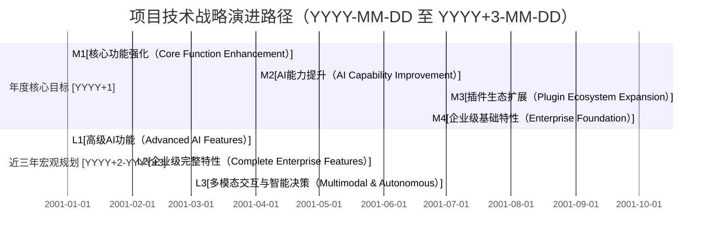

# 技术规划模板

## 一、上期技术战略规划复盘

由于缺乏项目历史迭代的详细数据，以下分析基于现有项目文档和行业通用实践进行合理推断：

<table>
<tr><td>技术战略规划目标</td><td>达成情况</td><td>差距原因分析</td></tr>
<tr><td>1. 构建基础插件化架构，支持主流中间件管理</td><td>部分达成。已实现基础CLI框架和插件系统，支持MySQL、Redis等主流中间件</td><td>插件生态尚未完善，社区贡献度有限，长期维护机制待建立</td></tr>
<tr><td>2. 实现AI驱动的基础诊断能力</td><td>初步达成。具备基本的AI诊断能力和自然语言交互界面</td><td>诊断准确性和覆盖范围需提升，复杂场景下的根因分析能力不足</td></tr>
<tr><td>3. 建立知识库基础体系</td><td>部分达成。完成知识库架构设计和基础内容建设</td><td>知识覆盖率低，更新机制不够自动化，多模态知识融合能力欠缺</td></tr>
</table>

## 二、上期技术规划复盘

基于项目文档中的短期目标和现有实现推断：

<table>
<tr><td>技术规划目标</td><td>达成情况</td><td>差距原因分析</td></tr>
<tr><td>1. 开发基础CLI框架和插件系统</td><td>已达成。基于Cobra框架构建了CLI引擎，实现了插件管理机制</td><td>插件开发工具链不够完善，开发者体验有提升空间</td></tr>
<tr><td>2. 实现主流中间件插件</td><td>部分达成。完成了MySQL、Redis、Kafka、Elasticsearch等插件</td><td>插件功能深度不足，高级特性支持有限，性能优化待加强</td></tr>
<tr><td>3. 构建自然语言交互界面</td><td>初步达成。支持基本的自然语言查询和交互</td><td>理解准确率有待提高，复杂命令的解析能力不足，多轮对话支持有限</td></tr>
<tr><td>4. 建立插件开发文档和工具链</td><td>部分达成。提供了基础文档，但工具链不够完善</td><td>文档不够详尽，缺乏示例项目和自动化测试工具，社区参与度低</td></tr>
</table>

## 三、下一步改进计划

基于上期复盘结论，针对已验证的优势方向，我们将继续强化并扩大领先优势：

1. **深化插件化架构优势**：在现有插件系统基础上，开发更完善的插件开发工具链，包括自动化生成脚手架、集成测试框架和性能基准测试工具。建立插件质量认证体系，确保社区贡献插件的可靠性和兼容性。

2. **强化AI诊断核心能力**：针对当前诊断准确性不足的问题，优化RAG系统的检索策略，引入更先进的重排模型和上下文理解技术。扩充故障案例库，特别是复杂分布式场景下的关联故障案例，提升根因分析的深度和广度。

3. **完善知识库生态**：建立更自动化的知识获取和更新机制，扩展知识来源渠道，包括官方文档、社区论坛、技术博客等。开发知识质量评估体系，实现知识的自动验证和置信度评分，提升AI分析的可靠性。

4. **优化用户体验**：改进自然语言处理引擎，提升复杂查询的理解能力，支持多轮对话和上下文记忆。丰富输出格式，增加可视化图表和交互式修复建议，降低用户操作复杂度。

5. **增强企业级特性**：提前布局多租户支持和权限控制系统，为中期目标中的企业级特性奠定基础。设计灵活的部署模式，支持从单机部署到大规模分布式部署的无缝扩展。

# 技术洞察报告

本报告基于对GitHub项目 `https://github.com/turtacn/kubestack-ai` 的深度技术分析，结合 `<KubeStack-AI 是一个基于 AI 和插件化架构，为 Kubernetes 及裸机环境提供自然语言交互、智能诊断与统一管理的云原生中间件运维平台>` 技术主题的行业趋势与市场洞察，形成全面的技术洞察结论。

## 洞察总结

通过系统性分析，我们从客户、自身、行业、竞争和机会五个维度进行了技术洞察，提炼出以下核心结论：

<table>
<tr><td></td><td>洞察结论</td><td>机会或者风险</td><td>技术诉求</td></tr>
<tr><td>看客户</td><td>云原生运维团队面临工具碎片化、知识壁垒高、问题定位复杂等挑战，急需统一的智能化运维平台；企业用户对多租户支持、权限控制和审计日志等企业级特性需求强烈</td><td>企业级市场是重要增长机会；用户对AI诊断的准确性和可靠性有极高要求，是差异化竞争的关键</td><td>提升AI诊断准确性和自动化修复能力；开发多租户和权限管理功能；优化用户交互体验，降低使用门槛</td></tr>
<tr><td>看自己</td><td>项目采用插件化架构和RAG增强的AI分析，具备良好的扩展性和智能化基础；已实现主流中间件的基础管理能力，但高级特性和企业级功能有待完善；知识库内容和更新机制需要加强</td><td>插件化架构和AI+运维的技术路线是核心优势；知识库的丰富度和AI模型的准确性是当前短板，可能影响用户体验</td><td>完善插件生态和高级功能；扩充知识库并优化更新机制；提升AI模型的诊断准确性和泛化能力</td></tr>
<tr><td>看行业</td><td>云原生技术持续普及，中间件种类和复杂度不断增加；AI在运维领域的应用快速发展，从辅助工具向决策系统演进；开源生态在云原生运维工具领域占据主导地位</td><td>AI与运维的深度融合是行业趋势，提供了技术领先的机会；多云和混合云环境普及，对跨环境管理工具需求增加</td><td>加强AI模型在复杂场景下的决策能力；支持多云环境和混合部署模式；积极参与开源生态，提升项目影响力</td></tr>
<tr><td>看竞争</td><td>同类项目如k8sgpt-ai专注于Kubernetes诊断，缺乏中间件深度管理能力；商业解决方案功能完善但成本高、灵活性不足；现有工具普遍缺乏统一的中间件管理视角和深度知识集成</td><td>中间件领域的深度知识和管理能力是差异化竞争的关键；开源模式在开发者和中小企业市场有优势</td><td>深化中间件领域专业知识和管理能力；提供比商业产品更高的灵活性和定制化能力；构建活跃的社区生态</td></tr>
<tr><td>看机会</td><td>多模态交互（语音、图像）在运维领域应用潜力巨大；边缘计算场景下的轻量级运维工具需求增长；AI模型的本地化部署需求增加，特别是在数据敏感行业</td><td>多模态交互和边缘计算支持是前瞻性机会；本地化AI部署可满足特定行业合规要求，打开垂直市场</td><td>探索多模态交互技术与运维场景的结合；开发轻量级版本适配边缘计算环境；支持AI模型的本地化部署和定制训练</td></tr>
</table>

## 技术洞察总结

### SWOT分析与TOWS策略矩阵

以下为本项目在KubeStack-AI技术主题下的SWOT分析及对应的TOWS关键策略：

<table>
<tr><td>SWOT分析（KubeStack-AI）</td><td>优势（S）</td><td>劣势(W)</td></tr>
<tr><td>优势（S）-项目自身的优势
1. 插件化架构设计，支持灵活扩展和定制
2. AI+RAG技术栈，具备智能诊断基础
3. 同时支持Kubernetes和裸机环境，适用场景广泛
4. 自然语言交互降低使用门槛，提升用户体验</td><td>劣势(W)-项目自身的劣势
1. 知识库内容覆盖有限，更新机制不够自动化
2. AI诊断准确性和复杂场景处理能力有待提升
3. 企业级特性（多租户、权限控制等）尚未完善
4. 社区生态和插件数量处于初期阶段
5. 性能优化和大规模部署经验不足</td></tr>
<tr><td>机会（O）-外部机会
1. 云原生中间件运维复杂度持续增加，市场需求旺盛
2. AI在运维领域的应用快速发展，技术接受度提高
3. 企业数字化转型推动运维自动化和智能化投资
4. 开源工具在云原生领域的市场份额持续扩大
5. 混合云环境普及，对统一管理工具需求增加</td><td>SO策略：
1. 利用插件化架构优势，快速扩展支持的中间件类型，覆盖更多应用场景
2. 强化AI+RAG技术栈，提升智能诊断准确性，打造核心竞争力
3. 针对混合云趋势，深化跨环境管理能力，提供一致的用户体验
4. 积极参与开源生态，吸引社区贡献者，扩大项目影响力</td><td>WO策略：
1. 建立自动化知识获取 pipeline，整合官方文档和社区经验，快速扩充知识库
2. 引入更先进的AI模型和训练技术，提升复杂场景下的诊断能力
3. 优先开发多租户和权限控制系统，满足企业级用户需求
4. 提供完善的插件开发工具和文档，降低社区贡献门槛，加速生态建设</td></tr>
<tr><td>威胁（T）-外部威胁
1. 同类开源项目（如k8sgpt-ai）快速迭代，竞争加剧
2. 大型云厂商推出自有运维工具，资源优势明显
3. AI技术快速演进，可能导致现有方案快速过时
4. 企业客户对AI决策的信任度和接受度存在不确定性
5. 数据安全和隐私法规趋严，影响AI模型的部署方式</td><td>ST策略：
1. 专注于中间件领域的深度管理能力，与专注Kubernetes的竞品形成差异化
2. 与云厂商建立合作而非竞争关系，成为其生态补充
3. 保持技术前瞻性，定期评估和引入新的AI技术，保持竞争力
4. 增强AI决策的可解释性，提供透明的诊断过程和依据，提升用户信任</td><td>WT策略：
1. 避免与资源优势明显的云厂商直接竞争，聚焦细分市场和差异化能力
2. 建立技术债务管理机制，定期重构和优化核心代码，保持架构灵活性
3. 支持AI模型的本地化部署选项，满足数据安全和隐私保护要求
4. 加强与企业用户的沟通，收集真实场景反馈，持续优化产品定位</td></tr>
</table>

## 技术洞察风险点总结

在技术洞察和规划过程中，我们识别出以下不确定性因素，它们可能影响规划的正确性和实施效果：

<table>
<tr><td>序号</td><td>风险项</td><td>发生概率</td><td>影响程度</td><td>对策</td></tr>
<tr><td>1</td><td>AI模型诊断准确性未达预期，影响用户体验和信任</td><td>中</td><td>高</td><td>建立渐进式AI能力路线图，从辅助诊断逐步过渡到自动决策；设计人工确认机制，关键操作需用户确认；建立反馈闭环，持续优化模型</td></tr>
<tr><td>2</td><td>插件生态发展缓慢，无法覆盖足够的中间件类型</td><td>中</td><td>高</td><td>提供高质量的官方插件作为示例；简化插件开发流程，提供详细文档和工具；与中间件厂商建立合作，共同开发官方插件</td></tr>
<tr><td>3</td><td>核心依赖（如LLM服务、向量数据库）API变更或服务中断</td><td>中</td><td>中</td><td>降低对单一依赖的耦合度，支持多供应商方案；关键组件考虑本地化部署选项；建立依赖版本锁定和兼容性测试机制</td></tr>
<tr><td>4</td><td>企业用户对开源产品的安全性和支持能力存在顾虑</td><td>高</td><td>中</td><td>通过第三方安全审计；建立完善的安全响应机制；提供商业支持选项；活跃的社区维护和更新</td></tr>
<tr><td>5</td><td>技术路线选择失误，如过度依赖某项可能被淘汰的技术</td><td>低</td><td>高</td><td>定期进行技术雷达评估；采用松耦合架构，便于技术替换；小步快跑，快速验证新技术可行性；积极参与行业标准制定</td></tr>
</table>

## 技术战略概述【一页纸技术战略】

**愿景与定位：** 我们的目标是为云原生环境下的中间件运维团队提供智能化、统一化的管理平台，通过AI驱动的自然语言交互和插件化架构，简化复杂中间件的运维工作。我们旨在成为云原生中间件智能运维领域的领先开源解决方案，填补市场上在中间件深度管理与AI智能诊断结合方面的空白。我们的主要竞争者包括专注于Kubernetes诊断的k8sgpt-ai和各云厂商的专有运维工具。k8sgpt-ai的优势在于Kubernetes生态的深度集成，但其劣势是缺乏中间件专项管理能力；云厂商工具的优势是与自家云服务的无缝集成，但其劣势是封闭性和厂商锁定。

**进攻策略 (Offensive Strategy)：** 为了实现上述目标，结合云原生中间件运维市场对智能化和统一化的迫切需求，我们将聚焦投资中间件领域知识图谱构建和多模态AI交互技术，充分利用我们在插件化架构和混合环境支持方面的优势，打击对手在中间件深度管理和跨环境一致性方面的不足，在中间件智能诊断和自动化修复领域形成绝对领先态势，建立技术壁垒。

**防御策略 (Defensive Strategy)：** 在未来，插件化架构和RAG增强的AI分析能力依然是决定我们竞争力的关键。我们将继续保持在这些核心技术上的投资，通过持续的架构优化、性能提升和安全性增强，强化我们的技术护城河，确保在基础能力上保持领先或等同于行业最佳实践。

**取舍策略 (Trade-off Strategy)：** 我们将不再对传统虚拟机环境的老旧中间件版本提供全面支持，这些技术已经逐渐被云原生方案取代，继续投资无法显著增强竞争优势，反而会大量消耗战略资源。我们将采取兼容但不优化的策略，鼓励用户升级到现代版本。预计在未来，容器化的中间件部署将完全主导市场。

**合作策略 (Collaboration Strategy)：** 对于非战略核心方向上，如特定云厂商的深度集成、硬件加速优化等，如果我们能力不足，我们将积极与云服务提供商、硬件厂商和专业服务公司建立合作关系，通过生态合作快速补齐能力短板，聚焦核心竞争力建设。

**长期主义 (Long-term Vision)：** 针对未来潜在的多模态交互、边缘智能运维和自主决策系统等重大技术趋势，我们将投入少量资源进行前瞻性研究和技术储备，确保在未来5-10年内，项目能够持续适应技术变革，保持长期竞争优势。

### 技术战略目标

以下是本项目的技术战略目标，旨在明确核心竞争力的提升方向、技术水平定位及达成时限：

<table>
<tr><td>序号</td><td>技术方向</td><td>技术目标</td><td>当前差距</td><td>技术策略</td><td>时间周期</td></tr>
<tr><td>1</td><td>DFX[设计可*X*性]</td><td>可靠性：核心服务99.9%可用性，故障恢复时间小于10分钟 可服务性：提供一键部署/升级工具，完善监控告警体系，支持问题一键反馈 兼容性：支持主流Kubernetes版本(1.24+)和操作系统(Debian/Ubuntu/CentOS) 安全性：通过OWASP安全审查，实现插件签名验证，支持敏感信息加密存储</td><td>当前缺乏完善的高可用设计；监控告警体系尚未建立；兼容性测试覆盖不足；安全机制基础薄弱</td><td>技术跟进</td><td>YYYY-MM-DD ~ YYYY+1-MM-DD</td></tr>
<tr><td>2</td><td>AI诊断与自动化修复</td><td>常见问题诊断准确率达到90%以上；支持50+常见问题的一键修复；根因分析平均耗时小于30秒；用户反馈问题解决率提升60%</td><td>当前诊断准确率约60-70%；自动修复能力有限；复杂问题根因分析耗时较长</td><td>技术领先</td><td>YYYY-MM-DD ~ YYYY+1-MM-DD</td></tr>
<tr><td>3</td><td>插件生态系统</td><td>官方支持30+中间件插件；社区贡献插件50+；建立完善的插件质量认证体系；插件开发文档完整度90%+</td><td>当前官方插件不足10个；社区贡献几乎为零；缺乏质量认证体系；文档不完善</td><td>技术领先</td><td>YYYY-MM-DD ~ YYYY+2-MM-DD</td></tr>
<tr><td>4</td><td>企业级特性</td><td>实现完善的多租户支持；细粒度RBAC权限控制；全面的审计日志；支持LDAP/SSO集成；高可用部署架构</td><td>当前完全缺乏企业级特性支持，仅能满足个人开发者或小型团队需求</td><td>技术跟进</td><td>YYYY-MM-DD ~ YYYY+2-MM-DD</td></tr>
<tr><td>5</td><td>多模态交互</td><td>支持语音指令输入；实现关键指标可视化展示；支持截图/日志图片分析；提供交互式问题排查向导</td><td>当前仅支持文本交互；可视化能力有限；无图像识别能力</td><td>技术探索</td><td>YYYY+1-MM-DD ~ YYYY+3-MM-DD</td></tr>
</table>

### 技术战略关键任务（行动计划）

这些关键任务是对技术战略方案的具体实施活动，涵盖了重点技术研发、关键技术项目、组织机制、人才文化及数据集建设等多个维度。

<table>
<tr><td>序号</td><td>业务战略</td><td>技术战略</td><td>关键任务</td></tr>
<tr><td>1</td><td>业务战略1：成为云原生中间件智能运维的领先解决方案</td><td>技术战略1：构建行业领先的AI诊断与自动化修复能力</td><td>数据集1：构建涵盖10,000+中间件故障案例的标注数据集 技术预研1：探索基于多模型融合的根因分析技术 关键人力1：招聘AI算法专家(专注NLP和知识图谱)、中间件领域专家</td></tr>
<tr><td>2</td><td>业务战略2：打造活跃的插件开发生态</td><td>技术战略2：提供卓越的插件开发体验和完善的支持体系</td><td>技术预研2：开发插件自动化测试和性能基准工具 关键任务2.1：构建插件开发文档门户和示例项目库 关键任务2.2：举办插件开发竞赛，吸引社区贡献</td></tr>
<tr><td>3</td><td>业务战略3：拓展企业级市场</td><td>技术战略3：开发企业级特性，满足大型组织需求</td><td>关键任务3.1：设计并实现多租户架构 关键任务3.2：开发细粒度RBAC权限系统 关键任务3.3：实现全面的审计日志和合规性报告功能</td></tr>
<tr><td>4</td><td>业务战略4：提升用户体验和产品易用性</td><td>技术战略4：优化交互方式，降低使用门槛</td><td>技术预研4：探索语音交互在运维场景的应用 关键任务4.1：开发交互式问题排查向导 关键任务4.2：实现丰富的可视化输出（图表、仪表盘等）</td></tr>
<tr><td>5</td><td>业务战略5：确保产品可靠性和安全性</td><td>技术战略5：强化产品稳定性、安全性和可维护性</td><td>关键任务5.1：建立全面的自动化测试体系（单元、集成、E2E） 关键任务5.2：实现插件签名和沙箱执行机制 关键任务5.3：开发高可用部署方案和灾难恢复机制</td></tr>
</table>

### 技术资源策略

我们将评估本项目现有的技术资源和技术能力与战略目标的匹配度，并针对不匹配之处制定应对策略。

<table>
<tr><td>序号</td><td>资源项</td><td>当前状态</td><td>影响程度</td><td>策略</td><td>预计达成时间</td></tr>
<tr><td>1</td><td>AI算法专家团队</td><td>不可用</td><td>高</td><td>招聘扩展</td><td>YYYY+1-Q1</td></tr>
<tr><td>2</td><td>中间件领域专业知识</td><td>部分可用</td><td>高</td><td>外部合作+内部培养</td><td>YYYY+1-Q2</td></tr>
<tr><td>3</td><td>插件化架构设计经验</td><td>可用</td><td>中</td><td>直接复用+优化</td><td>-</td></tr>
<tr><td>4</td><td>大型开源项目社区运营经验</td><td>有限</td><td>中</td><td>外部顾问+培训</td><td>YYYY+1-Q3</td></tr>
<tr><td>5</td><td>企业级特性开发经验（多租户、RBAC等）</td><td>有限</td><td>中</td><td>招聘+技术引进</td><td>YYYY+1-Q4</td></tr>
<tr><td>6</td><td>故障案例数据集</td><td>基础可用</td><td>高</td><td>内部积累+社区贡献</td><td>持续进行</td></tr>
<tr><td>7</td><td>自动化测试与CI/CD基础设施</td><td>基础可用</td><td>中</td><td>优化增强</td><td>YYYY+1-Q2</td></tr>
</table>

### 战略目标达成路径（演进路径）

以下图示展示了本项目的技术战略目标达成路径，重点突出目标达成的独特性、平衡性与资源合理性。

**图1：项目技术战略演进路径**

*解释说明：* 图1展示了本项目在未来三年内的技术战略演进蓝图。在YYYY+1年，我们聚焦于核心功能的稳定性和用户体验提升，强化AI诊断能力，扩展插件生态系统，并奠定企业级特性的基础。未来两年，规划将逐步过渡到高级AI功能开发、完善企业级特性，并最终实现多模态交互和更高级的智能决策能力，使产品在云原生中间件智能运维领域建立领先地位。

<table>
<tr><td rowspan="2">技术 战略 目标</td><td colspan="3">年度演进路径（详细描述）</td><td rowspan="2">年度整体效果描述</td><td colspan="2">近三年计划（粗略描述）</td></tr>
<tr><td>YYYY+1 Q1</td><td>YYYY+1 Q2</td><td>YYYY+1 Q3-Q4</td><td>YYYY+2 H1</td><td>YYYY+2 H2-YYYY+3</td></tr>
<tr><td>目标1：AI诊断与自动化修复</td><td>优化RAG检索策略，诊断准确率提升至75%；支持10+常见问题自动修复；完善反馈收集机制。</td><td>引入交叉编码器模型，诊断准确率提升至80%；支持20+常见问题自动修复；实现根因分析可视化。</td><td>整合多模型融合技术，诊断准确率达到85%；支持30+常见问题自动修复；平均诊断时间缩短至45秒。</td><td>1. 在中小规模部署场景下，AI诊断准确性和效率领先开源竞品，成为用户首选工具。 2. 自动修复功能覆盖大部分常见问题，显著降低运维工作量。</td><td>引入时序数据分析，提升性能问题诊断能力；准确率提升至90%。</td><td>实现多模态输入分析；支持复杂故障的自动推理链；探索自主决策能力。</td></tr>
<tr><td>目标2：插件生态系统</td><td>官方插件扩展至15+；发布插件开发工具包1.0；启动社区贡献计划。</td><td>官方插件扩展至20+；完善插件测试框架；举办首次插件开发竞赛。</td><td>官方插件扩展至25+；社区贡献插件达到20+；建立插件质量认证体系。</td><td>1. 插件覆盖主流中间件类型，满足80%用户的基本需求。 2. 社区贡献机制初步建立，形成可持续发展的生态基础。</td><td>官方插件扩展至30+；社区贡献插件达到35+；实现插件市场和自动更新。</td><td>社区贡献插件达到50+；建立插件开发者激励机制；形成丰富的插件生态。</td></tr>
<tr><td>目标3：企业级特性</td><td>完成多租户架构设计；实现基础RBAC权限控制；开始审计日志开发。</td><td>实现多租户数据隔离；完善权限控制粒度；审计日志基础功能上线。</td><td>支持LDAP集成；实现高级权限策略；审计日志分析功能上线。</td><td>产品基本满足中小型企业的多团队协作需求，能够在企业环境中安全部署和使用。</td><td>支持SSO集成；实现合规性报告；高可用部署方案上线。</td><td>完成企业级特性开发；通过关键行业合规认证；支持大规模企业部署。</td></tr>
</table>

### 技术项目清单

本节详细罗列了本项目在技术规划期内的所有关键技术项目：

<table>
<tr><td>序号</td><td>项目名称</td><td>项目目标</td><td>关键技术</td><td>项目分类</td><td>规划负责人</td><td>起止时间</td><td>优先级</td><td>预算资源</td><td>是否形成断裂点</td></tr>
<tr><td>1</td><td>RAG系统优化与增强</td><td>提升知识检索准确性和相关性，优化AI诊断效果</td><td>交叉编码器、混合检索策略、知识融合技术</td><td>开发一代</td><td>AI技术负责人</td><td>YYYY/01/01 ~ YYYY/03/31</td><td>好10倍项目</td><td>3人月</td><td>是</td></tr>
<tr><td>2</td><td>中间件故障案例库建设</td><td>构建涵盖10,000+故障案例的结构化知识库</td><td>知识抽取、结构化表示、案例分类体系</td><td>开发一代</td><td>知识工程负责人</td><td>YYYY/01/01 ~ YYYY/12/31</td><td>好10倍项目</td><td>2人月（持续）</td><td>是</td></tr>
<tr><td>3</td><td>插件开发工具链完善</td><td>提供一站式插件开发、测试、发布工具</td><td>代码生成、自动化测试、CI/CD集成</td><td>开发一代</td><td>架构师</td><td>YYYY/02/01 ~ YYYY/05/31</td><td>重点项目</td><td>4人月</td><td>否</td></tr>
<tr><td>4</td><td>多租户架构实现</td><td>设计并实现安全的多租户隔离机制</td><td>资源隔离、数据分区、租户管理</td><td>开发一代</td><td>后端技术负责人</td><td>YYYY/04/01 ~ YYYY/07/31</td><td>重点项目</td><td>5人月</td><td>是</td></tr>
<tr><td>5</td><td>多模态交互技术预研</td><td>探索语音和图像输入在运维场景的应用</td><td>语音识别、图像分析、多模态理解</td><td>预研二代</td><td>AI研究员</td><td>YYYY/07/01 ~ YYYY/12/31</td><td>重点预研</td><td>2人月</td><td>否</td></tr>
<tr><td>6</td><td>高级RBAC权限系统</td><td>实现细粒度的权限控制和访问管理</td><td>角色定义、权限模型、访问控制列表</td><td>开发一代</td><td>安全负责人</td><td>YYYY/06/01 ~ YYYY/09/30</td><td>重点项目</td><td>3人月</td><td>否</td></tr>
<tr><td>7</td><td>自主决策系统探索</td><td>研究AI在复杂场景下的自主决策能力</td><td>强化学习、因果推理、风险评估</td><td>储备三代</td><td>首席AI研究员</td><td>YYYY+1/01/01 ~ YYYY+1/12/31</td><td>普通预研</td><td>1人月（兼职）</td><td>否</td></tr>
<tr><td>8</td><td>与云厂商生态集成</td><td>实现与主流云厂商中间件服务的集成</td><td>云API集成、认证适配、资源同步</td><td>外部合作项目</td><td>生态合作负责人</td><td>YYYY/08/01 ~ YYYY+1/02/28</td><td>重点项目</td><td>4人月</td><td>否</td></tr>
</table>

### 数据集建设项目

本项目高度依赖高质量的数据集来支撑AI诊断能力，以下是关键数据集建设计划：

<table>
<tr><td>数据集</td><td>关联的AI项目/数据储备</td><td>数据集建设目标及建设计划</td><td>关键协作方</td><td>资源预估 （人月）</td><td>是否关键 数据集</td></tr>
<tr><td>中间件故障案例数据集</td><td>智能诊断系统优化、根因分析模型训练</td><td>YYYY Q1：收集3,000个基础故障案例，完成初步分类 YYYY Q2：扩充至5,000个案例，实现结构化标注 YYYY Q3：扩充至8,000个案例，增加关联关系标注 YYYY Q4：扩充至10,000个案例，完成质量评估和优化</td><td>中间件社区、企业用户、技术支持团队</td><td>2人月（持续）</td><td>是</td></tr>
<tr><td>性能基准数据集</td><td>性能异常检测、优化建议生成</td><td>YYYY Q2：收集主流中间件的基础性能指标 YYYY Q4：建立性能基准和异常阈值 YYYY+1 H1：扩充不同负载场景下的性能数据</td><td>性能测试团队、云厂商</td><td>1人月</td><td>是</td></tr>
<tr><td>自然语言查询数据集</td><td>查询意图理解、命令生成</td><td>YYYY Q3：收集5,000个用户查询样本 YYYY+1 Q1：完成意图标注和命令映射</td><td>早期用户、社区贡献者</td><td>1人月</td><td>否</td></tr>
</table>

### 资源初步预估对齐

以下是对实现上述技术规划所需的资源初步预估：

<table>
<tr><td>投入方向</td><td>投入人数</td><td>投入周期</td><td>职级要求（关键人才）</td></tr>
<tr><td>核心系统架构优化</td><td>3人</td><td>12个月</td><td>架构师（T8+）、高级开发工程师（T7+）</td></tr>
<tr><td>AI算法与RAG系统</td><td>4人</td><td>18个月</td><td>AI研究员（T8+）、机器学习工程师（T7+）、NLP工程师（T7）</td></tr>
<tr><td>插件生态与中间件集成</td><td>5人</td><td>24个月</td><td>高级开发工程师（T7）、开发工程师（T6）、中间件专家（领域专家）</td></tr>
<tr><td>企业级特性开发</td><td>3人</td><td>18个月</td><td>高级开发工程师（T7）、安全工程师（T7）</td></tr>
<tr><td>用户体验与交互优化</td><td>2人</td><td>12个月</td><td>前端工程师（T6+）、UX设计师</td></tr>
<tr><td>测试与质量保障</td><td>3人</td><td>24个月</td><td>测试开发工程师（T7）、QA工程师（T6）</td></tr>
<tr><td>社区运营与文档</td><td>2人</td><td>24个月</td><td>技术作家、社区经理</td></tr>
</table>

---

**参考资料：**

1. `k8sgpt-ai项目` \[链接：`https://github.com/k8sgpt-ai/k8sgpt`]
2. `kubectl-ai项目` \[链接：`https://github.com/GoogleCloudPlatform/kubectl-ai`]
3. `Kubernetes官方文档` \[链接：`https://kubernetes.io/docs/`]
4. `向量数据库技术` \[链接：`https://github.com/milvus-io/milvus`]
5. `云原生安全最佳实践` \[链接：`https://kubernetes.io/docs/concepts/security/`]
6. `KubeStack-AI项目README` \[链接：`https://github.com/turtacn/kubestack-ai/blob/main/README.md`]
7. `KubeStack-AI架构设计文档` \[链接：`https://github.com/turtacn/kubestack-ai/blob/main/docs/architecture.md`]

---