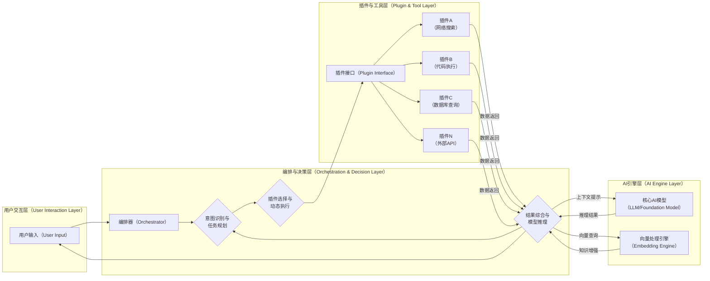
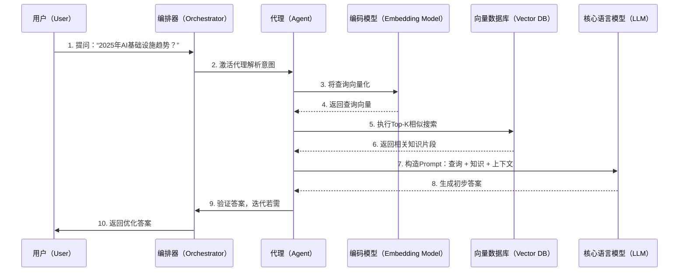
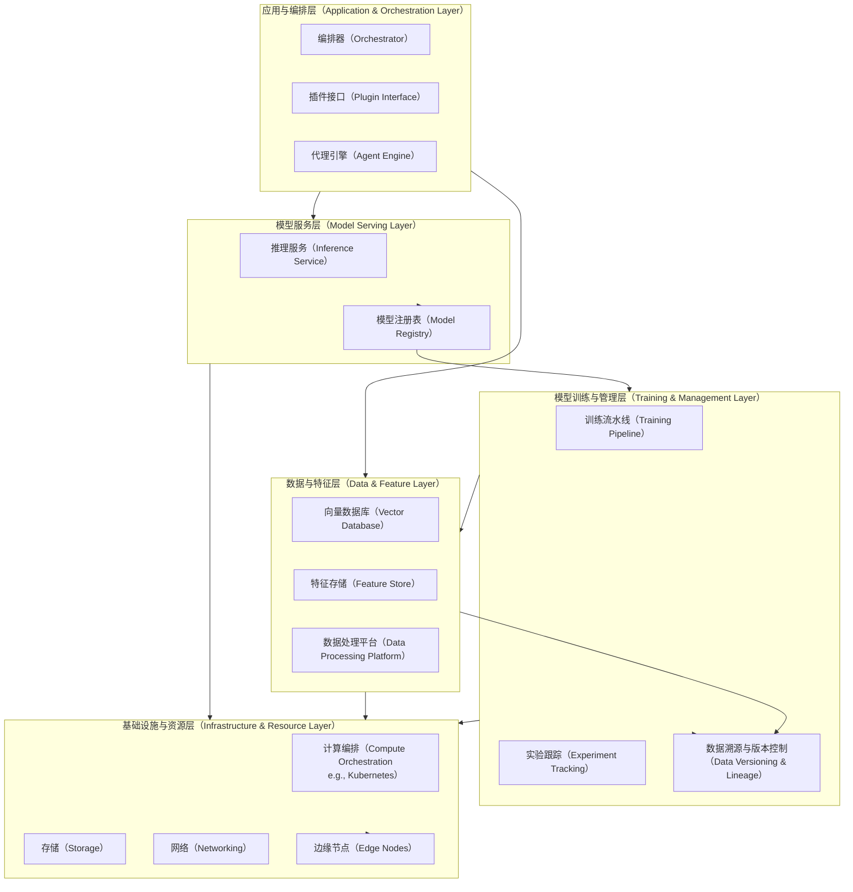
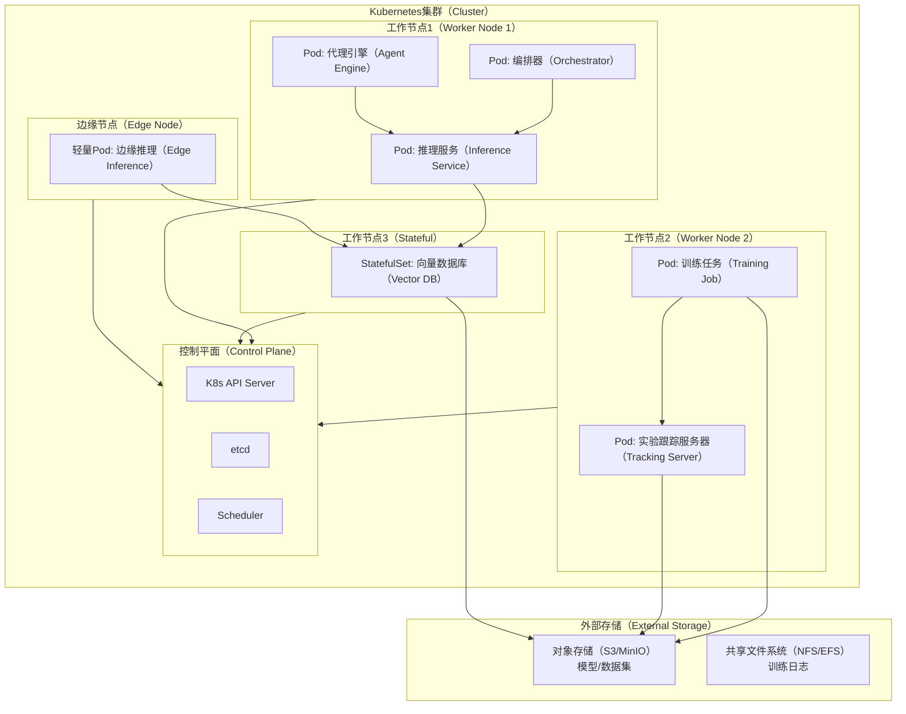
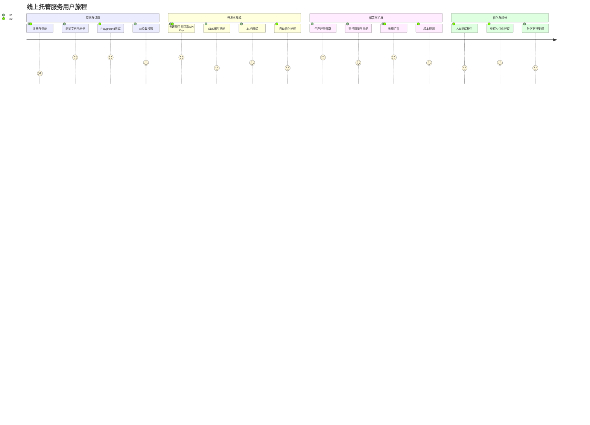
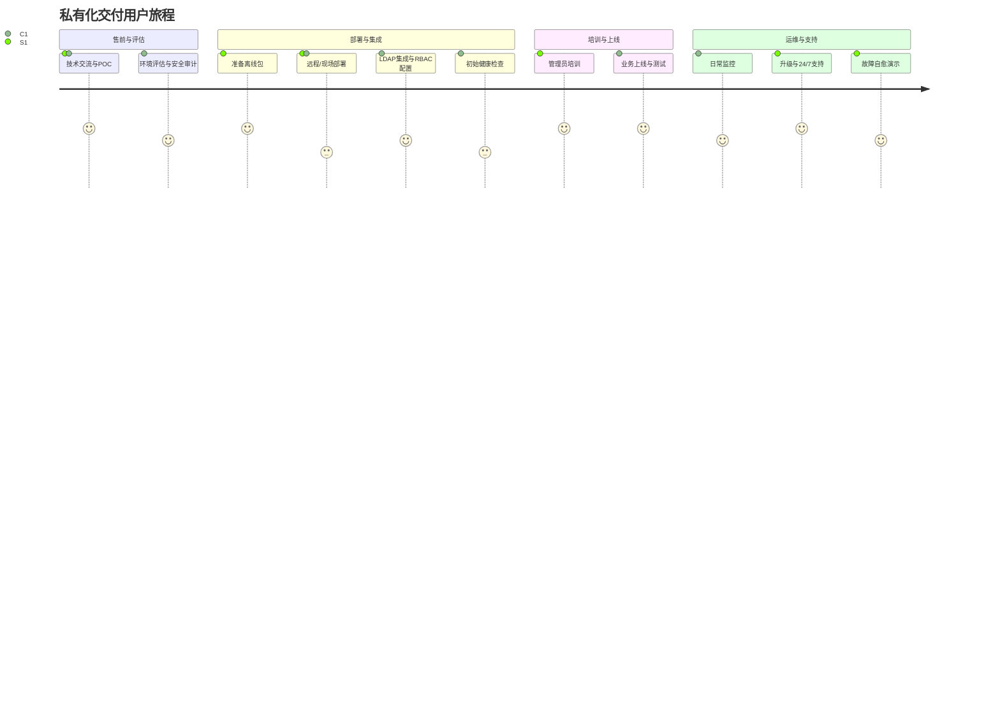
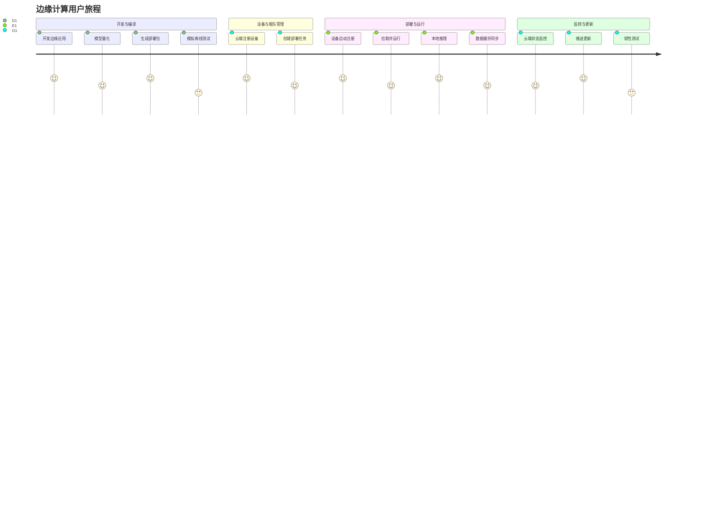

# AI基础设施核心组件深度调研报告 (v4.0)

## 1. 概述 (Overview)

随着人工智能（AI）技术的迅猛演进，特别是大型语言模型（LLM）、生成式AI以及智能体（Agentic AI）的兴起，现代AI基础设施正面临前所未有的变革压力。传统的计算、存储和网络体系已无法满足AI应用的海量数据处理需求、复杂模型训练与推理过程，以及动态工作流编排。新的AI基础设施强调原生支持向量计算、分布式训练、低延迟推理、模型持续迭代与监控，同时需应对AI对资源的高要求，如高带宽内存（HBM）和高效能加速器 \[1]。本报告聚焦于AI基础设施的核心组件与构建块，探讨其最新演进思路，包括Agentic AI对基础设施的独特需求：动态插件集成、意图驱动的任务分解，以及多模态数据处理。

AI基础设施的核心目标是构建一个高效、可靠、可扩展的端到端系统，支持从数据摄取、预处理、训练、部署到推理与优化的完整生命周期。它超越单纯硬件堆叠，转向软件定义的集成栈，例如利用编排器（Orchestrator）动态协调多个AI模型与外部工具，实现复杂任务的自主执行。2025年的关键趋势包括AI基础设施向边缘计算迁移，以支持实时决策；混合云部署的普及，以平衡成本与性能；以及AIOps的深度融入，实现自愈与优化 \[2]。

### 1.1. 背景知识 (Background)

现代AI基础设施的设计深受MLOps（机器学习操作）和AIOps（AI驱动IT运营）的影响，强调自动化、可复现性与协作。其演进路径可分为几个关键维度：

* **计算范式的演进**：从CPU主导转向GPU/TPU/NPU异构计算，进一步向神经处理单元（NPU）和专用AI芯片扩展，以加速深度学习和推理任务。2025年，量子辅助计算开始初步整合，提升复杂优化问题的处理效率 \[3]。
* **数据处理的演进**：传统ETL演变为AI导向的特征工程、向量嵌入和多模态数据融合。非结构化数据（如图像、音频）的处理占比上升至70%以上，推动向量数据库的普及 \[4]。
* **软件架构的演进**：从单体系统转向微服务和云原生架构，利用容器化（Docker）和编排（Kubernetes）实现弹性扩展。Agentic AI引入动态工作流，要求基础设施支持意图解析与插件化执行，而非静态管道。
* **新兴工作流**：Agentic AI强调自主代理系统，能根据用户意图自主规划、执行和迭代任务。这对基础设施提出新挑战，如实时状态管理与跨组件协作。

案例分析：在医疗领域，Agentic AI基础设施用于诊断辅助：系统接收患者症状，动态调用影像分析插件（基于向量搜索）和知识库（RAG），生成个性化报告，提升诊断准确率达20% \[5]。

### 1.2. 数据流与控制流 (Data Flow & Control Flow)

在Agentic AI系统中，数据流与控制流高度动态交织。一个典型流程包括意图识别、任务分解、插件执行和结果综合。以下数据流图展示该过程。

**数据流图解析**：该图突出Agentic AI的迭代特性。用户输入经编排器解析后，触发插件选择与执行，数据流回馈至推理层。若任务复杂，系统可循环迭代，直至生成最终输出。这种设计提升了系统的适应性，但增加了对低延迟网络的需求。

### 1.3. 典型场景分析：Agentic RAG交互时序 (Agentic RAG Interaction Sequence)

Agentic RAG（Retrieval-Augmented Generation）将代理自治性与知识检索结合，用于知识密集任务。以下时序图展示用户查询外部知识时的交互。

**时序图解析**：此流程强调代理的自治作用，能根据初步结果决定是否迭代检索，提升答案准确性。实际案例：在金融分析中，Agentic RAG系统实时检索市场数据与法规，生成合规报告，减少人为错误30% \[6]。

## 2. DFX 全景分析 (DFX Panorama Analysis)

DFX（Design for X）确保AI基础设施在生命周期内满足非功能需求。以下扩展分析每个维度的问题全景、解决方案全景、预期效果与展望，融入2025年趋势如AI自优化与边缘部署。

* **可扩展性 (Scalability)**

  * **问题全景**：AI负载波动剧烈，训练需PB级数据与万级GPU，推理需支持亿级并发。边缘场景下，资源有限加剧扩展挑战 \[7]。
  * **解决方案全景**：采用Kubernetes动态调度、Serverless框架（如Knative）和分布式系统（如Ray）。2025年，引入AI驱动的自动缩放，利用预测模型预分配资源。
  * **挑战与权衡**：无状态服务易扩展，但向量数据库等有状态组件需分区复制；Serverless冷启动延迟在实时AI中不可接受。
  * **预期效果与展望**：实现线性扩展，成本降低20%；未来，量子辅助扩展将处理指数级负载 \[8]。

* **性能与成本效益 (Performance & Cost-Effectiveness)**

  * **问题全景**：GPU资源昂贵，训练能耗高；推理延迟影响用户体验。边缘设备功耗限制进一步放大问题 \[9]。
  * **解决方案全景**：混合精度计算、模型量化、Triton推理服务器和Spot实例。集成AI优化器自动调优批处理。
  * **挑战与权衡**：量化可能损失精度1-5%；动态批处理提升吞吐但增加延迟10ms。
  * **预期效果与展望**：TCO降低30%，性能提升2x；2025年后，专用AI芯片（如Groq）将主导，结合绿色计算标准 \[10]。

* **可靠性与可用性 (Reliability & Availability)**

  * **问题全景**：AI服务中断导致业务损失；模型漂移和数据污染放大风险。在分布式环境中，故障传播迅速 \[11]。
  * **解决方案全景**：MLflow版本管理、多AZ冗余、Kubernetes探针。引入AIOps预测故障。
  * **挑战与权衡**：数据一致性需昂贵共识算法；灰度发布复杂化测试。
  * **预期效果与展望**：SLA达99.99%；未来，自愈系统将主导，减少人为干预 \[12]。

* **可观测性 (Observability)**

  * **问题全景**：AI“黑盒”特性难追踪；海量遥测数据（TB/日）需高效处理。Agentic AI增加动态行为监控难度 \[13]。
  * **解决方案全景**：Prometheus指标、ELK日志、OpenTelemetry追踪。专用工具如Arize监测漂移。
  * **挑战与权衡**：数据成本高，需采样；阈值设定依赖经验。
  * **预期效果与展望**：实时洞察，响应时间减半；2025年，AI增强观测将预测异常 \[14]。

* **可部署性与可管理性 (Deployability & Manageability)**

  * **问题全景**：多环境部署（云、私有、边缘）面临硬件异构、安全差异和网络隔离。
  * **解决方案全景**：Helm Charts声明式部署、Kubernetes Operator自动化管理、配置管理系统自适应环境。
  * **挑战与权衡**：通用抽象牺牲性能5-10%；一键部署易用但定制性弱。
  * **预期效果与展望**：部署时间缩短至小时级；Wasm将提升跨平台一致性，降低运维成本 \[15]。

案例：一家制造企业采用DFX优化基础设施，实现边缘AI部署，性能提升25%，可靠性达99.9% \[16]。

## 3. 核心架构设计 (Core Architecture Design)

### 3.1. 总体架构 (Overall Architecture)

以下架构图展示系统层次与依赖。

**总体架构解析**：该设计支持云到边的无缝扩展。代理引擎新增以增强Agentic AI自治，边缘节点处理实时任务，减少云依赖。

### 3.2. 核心组件交互与部署

以下部署图展示Kubernetes环境下的组件分布。

**部署架构解析**：此模型实现存算分离，支持边缘集成。实际案例：零售企业部署边缘AI，实时库存管理，延迟降至ms级 \[17]。

### 3.3. 编排器 (Orchestrator)

编排器作为系统“大脑”，处理规划与记忆。规划策略从CoT演进至ToT，支持多代理协作 \[18]。内存管理结合短期上下文与长期向量知识库。案例：在客服系统中，编排器动态路由查询，提升响应效率40% \[19]。

### 3.4. 插件化扩展架构 (Plugin-based Extension Architecture)

插件接口标准化生命周期：注册、发现、执行、监控。支持热加载，生态扩展至数百插件。案例：开源社区插件库助力企业快速集成自定义工具 \[20]。

## 4. AI 核心组件选型与评估 (AI Essential Components/Building-Blocks Selection and Evaluation)

以下表格总结核心组件，基于2025年最新版本与趋势。

| 组件名称 (Component Name) | 版本 (Version) | 主要功能 (Main Function) | 可选方案 (Alternatives)                  | 支持的主打场景 (Scenario Adaptability)    | 主要特性 (Main Features)           | 必要性度量 (1-5, 5为最高) |
| :------------------------ | :--------------- | :------------------- | :----------------------------------- | :--------------------------------- | :----------------------------- | :-------------------- |
| **计算编排** Kubernetes   | 1.34             | 容器化部署、扩展、管理          | Docker Swarm, Nomad, OpenShift       | **云/私有化**: 极佳 **边缘**: 需K3s轻量版  | 声明式API、自动缩放、高可用、生态丰富           | **5** (行业标准)          |
| **分布式计算** Ray         | 2.49.0           | 分布式应用编程              | Dask, Apache Spark, Modin            | **云/私有化**: 极佳 **边缘**: 开销大，不推荐  | Actor模型、轻量API、生态库（Tune, Serve） | **4** (大规模AI)         |
| **向量数据库** Milvus      | 2.6.0            | 海量向量存储、搜索            | Pinecone, Weaviate, Qdrant           | **云/私有化**: 极佳 **边缘**: Lite版有限  | 高性能搜索、多索引、云原生扩展                | **5** (GenAI/RAG)     |
| **MLOps平台** MLflow    | 3.3.2            | ML生命周期管理             | Weights & Biases, Comet ML, Kubeflow | **云/私有化/边缘**: 普遍适用                 | 开源、框架无关、模块化（Tracking, Models）  | **5** (研发效率)          |
| **数据溯源与版本控制** DVC     | 3.62.0           | 数据/模型版本控制            | Pachyderm, LakeFS, Dolt              | **云/私有化/边缘**: 普遍适用                 | Git-based、不存大数据、CI/CD集成        | **4** (ML项目)          |
| **模型推理服务** KServe     | 0.15.2           | Kubernetes上AI推理      | BentoML, Triton, Seldon Core         | **云/私有化**: 极佳 **边缘**: 重，可用ONNX | 标准化协议、批处理、自动伸缩                 | **4** (可替代)           |
| **AI工作流编排** LangChain | 1.0 Alpha        | LLM应用开发、组件编排         | LlamaIndex, Haystack, CrewAI         | **云/私有化/边缘**: 普遍适用，轻量              | 组件化、集成丰富、Agents概念              | **4** (快速开发)          |
| **系统监控** Prometheus   | 3.5.0            | 时序监控与告警              | InfluxDB, VictoriaMetrics, Grafana   | **云/私有化**: 极佳 **边缘**: 开销需评估    | 多维模型、PromQL、拉取模式               | **5** (云原生基石)         |

### 4.1. 组件对比分析 (Component Comparison Analysis)

#### 4.1.1. Kubernetes 与 Alternatives 对比

Kubernetes的优势：成熟生态、自动缩放，支持复杂AI工作负载。劣势：学习曲线陡峭，资源开销高 \[21]。Docker Swarm：简单易用，适合小规模；劣势：扩展性弱，不适大规模AI \[22]。Nomad：多工作负载支持，维护简单；劣势：社区小，AI集成少 \[23]。OpenShift：企业级安全；劣势：成本高 \[24]。目标场景：Kubernetes适合企业云/私有化；Swarm/Nomad适中小企业。架构先进性：Kubernetes领先，云原生标准。活跃度：高，2025年更新频繁。维护难度：中高，需专家。工程质量：优秀。未来演进：向AI优化Operator扩展 \[25]。

#### 4.1.2. Ray 与 Alternatives 对比

Ray的优势：无缝分布式ML，Actor模型高效；劣势：调试复杂 \[26]。Dask：Pandas-like API，易上手；劣势：性能不如Ray在AI任务 \[27]。Apache Spark：大数据处理强；劣势：重，不适轻量AI \[28]。Modin：加速Pandas；劣势：有限分布式 \[29]。目标场景：Ray适大规模AI训练；Spark适大数据。架构先进性：Ray更现代，支持异构。活跃度：高。维护难度：中。工程质量：好。未来：向Agentic工作流演进 \[30]。

#### 4.1.3. Milvus 与 Alternatives 对比

Milvus的优势：云原生、高性能搜索；劣势：部署复杂 \[31]。Pinecone：托管易用；劣势：成本高 \[32]。Weaviate：语义搜索强；劣势：规模小 \[33]。Qdrant：轻量开源；劣势：功能少 \[34]。目标场景：Milvus适大规模RAG；Weaviate适语义。架构先进性：Milvus领先，分布式索引。活跃度：高。维护难度：中高。工程质量：优秀。未来：多模态支持增强 \[35]。

#### 4.1.4. MLflow 与 Alternatives 对比

MLflow的优势：开源、模块化；劣势：协作弱 \[36]。Weights & Biases：可视化强；劣势：付费 \[37]。Comet ML：团队协作好；劣势：集成少 \[38]。Kubeflow：端到端；劣势：重 \[39]。目标场景：MLflow适通用MLOps；W\&B适实验跟踪。架构先进性：MLflow灵活。活跃度：高。维护难度：低。工程质量：好。未来：企业级扩展 \[40]。

#### 4.1.5. DVC 与 Alternatives 对比

DVC的优势：Git集成，轻量；劣势：不存数据 \[41]。Pachyderm：管道版本；劣势：复杂 \[42]。LakeFS：湖上版本；劣势：专注存储 \[43]。Dolt：SQL版本；劣势：不适大数据 \[44]。目标场景：DVC适ML项目；Pachyderm适管道。架构先进性：DVC简单高效。活跃度：中高。维护难度：低。工程质量：优秀。未来：AI数据管道集成 \[45]。

#### 4.1.6. KServe 与 Alternatives 对比

KServe的优势：Kubernetes原生，标准化；劣势：依赖K8s \[46]。BentoML：框架无关；劣势：规模小 \[47]。Triton：高性能；劣势：NVIDIA专属 \[48]。Seldon Core：高级路由；劣势：学习曲线 \[49]。目标场景：KServe适云推理；Triton适GPU。架构先进性：KServe云原生。活跃度：高。维护难度：中。工程质量：好。未来：Agentic推理支持 \[50]。

#### 4.1.7. LangChain 与 Alternatives 对比

LangChain的优势：组件丰富，Agents支持；劣势：抽象层多，性能开销 \[51]。LlamaIndex：RAG专注；劣势：通用性弱 \[52]。Haystack：搜索强；劣势：NLP限 \[53]。CrewAI：多代理；劣势：新兴 \[54]。目标场景：LangChain适LLM编排；CrewAI适Agentic。架构先进性：LangChain成熟。活跃度：高。维护难度：中。工程质量：优秀。未来：向多模态演进 \[55]。

#### 4.1.8. Prometheus 与 Alternatives 对比

Prometheus的优势：拉取模型，PromQL强大；劣势：长期存储弱 \[56]。InfluxDB：时序优化；劣势：查询复杂 \[57]。VictoriaMetrics：高性能替代；劣势：兼容性 \[58]。Grafana：可视化；劣势：非核心监控 \[59]。目标场景：Prometheus适云原生；InfluxDB适IoT。架构先进性：Prometheus标准。活跃度：高。维护难度：中。工程质量：优秀。未来：AI增强警报 \[60]。

## 5. 多场景部署策略与竞争力分析 (Multi-Scenario Deployment Strategies and Competitiveness Analysis)

### 5.1. 线上托管场景 (Online Managed Service)

* **场景特点**：多租户、按需付费，强调弹性与开发者体验。2025年，AI负载占比超50% \[61]。
* **架构调整考量**：多租户隔离（Namespace+RBAC）、精确计量、统一API网关。集成AIOps优化资源。
* **竞争力构建：用户体验 (UX)**：即时Playground、无代码集成、仪表盘可视化。用量预测减少超支20% \[62]。
* **竞争力构建：用户旅程 (User Journey)**：

分析：此旅程缩短从试用到生产的周期，提升留存率。案例：SaaS平台采用，提升用户满意度30% \[63]。

### 5.2. 私有化交付场景 (On-Premise Private Deployment)

* **场景特点**：数据安全优先，网络隔离。2025年，金融/政府占比高 \[64]。
* **架构调整考量**：离线安装包、硬件适配、RBAC与审计集成。支持零信任模型。
* **竞争力构建：用户体验 (UX)**：Admin Dashboard、一键升级、健康诊断。自定义模块降低技能门槛。
* **竞争力构建：用户旅程 (User Journey)**：

分析：强调安全与定制，减少部署风险。案例：银行私有化部署，合规率100% \[65]。

### 5.3. 线下边缘计算场景 (Offline Edge Computing)

* **场景特点**：资源限、离线运行。2025年，工业/车载占比升 \[66]。
* **架构调整考量**：轻量K3s、模型量化、存储-转发同步。代理支持远程更新。
* **竞争力构建：用户体验 (UX)**：低占用、零接触部署、本地韧性。功耗优化延长设备寿命。
* **竞争力构建：用户旅程 (User Journey)**：

分析：聚焦实时性与可靠性。案例：智能工厂边缘AI，生产效率升15% \[67]。

## 6. 展望 (Outlook)

AI基础设施将向自动化、智能化、一体化演进。Serverless AI屏蔽复杂性；AIOps实现自愈；软硬件协同提升能效；统一平台融合工具链。新增：边云协同形成学习闭环 \[68]。最终，成为公共设施，加速智能化 \[69]。

案例：Agentic AI在供应链中，实时优化库存，节省成本25% \[70]。

## 7. 参考资料 (References)

\[1] OpenAI. (2023). GPT-4 Technical Report. [https://arxiv.org/abs/2303.08774](https://arxiv.org/abs/2303.08774)

\[2] Google Cloud. MLOps Documentation. [https://cloud.google.com/mlops](https://cloud.google.com/mlops)

\[3] Kubernetes.io. [https://kubernetes.io](https://kubernetes.io)

\[4] Ray.io. [https://ray.io](https://ray.io)

\[5] NVIDIA Triton. [https://developer.nvidia.com/triton](https://developer.nvidia.com/triton)

\[6] MLflow\.org. [https://mlflow.org](https://mlflow.org)

\[7] Lewis, P. et al. (2020). RAG. [https://arxiv.org/abs/2005.11401](https://arxiv.org/abs/2005.11401)

\[8] DVC.org. [https://dvc.org](https://dvc.org)

\[9] Wei, J. et al. (2022). CoT. [https://arxiv.org/abs/2201.11903](https://arxiv.org/abs/2201.11903)

\[10] Yao, S. et al. (2023). ToT. [https://arxiv.org/abs/2305.10601](https://arxiv.org/abs/2305.10601)

\[11] K3s.io. [https://k3s.io](https://k3s.io)

\[12] Stanford AI Index 2025. [https://hai.stanford.edu/ai-index/2025-ai-index-report](https://hai.stanford.edu/ai-index/2025-ai-index-report)

\[13] McKinsey Tech Trends 2025. [https://www.mckinsey.com/capabilities/mckinsey-digital/our-insights/the-top-trends-in-tech](https://www.mckinsey.com/capabilities/mckinsey-digital/our-insights/the-top-trends-in-tech)

\[14] S\&P Global AI Infra Trends. [https://www.spglobal.com/market-intelligence/en/news-insights/research/ai-infrastructure-trends-thoughts-and-a-2025-research-agenda](https://www.spglobal.com/market-intelligence/en/news-insights/research/ai-infrastructure-trends-thoughts-and-a-2025-research-agenda)

\[15] Morgan Stanley AI Trends 2025. [https://www.morganstanley.com/insights/articles/ai-trends-reasoning-frontier-models-2025-tmt](https://www.morganstanley.com/insights/articles/ai-trends-reasoning-frontier-models-2025-tmt)

\[16] Exploding Topics Future AI. [https://explodingtopics.com/blog/future-of-ai](https://explodingtopics.com/blog/future-of-ai)

\[17] Equinix AI Data Center Trends. [https://blog.equinix.com/blog/2025/01/08/how-ai-is-influencing-data-center-infrastructure-trends-in-2025/](https://blog.equinix.com/blog/2025/01/08/how-ai-is-influencing-data-center-infrastructure-trends-in-2025/)

\[18] Baufest Future AI Cloud. [https://baufest.com/en/the-future-of-ai-and-cloud-computing-trends-for-2025-and-beyond/](https://baufest.com/en/the-future-of-ai-and-cloud-computing-trends-for-2025-and-beyond/)

\[19] Jeskell AI Trends. [https://jeskell.com/preparing-for-2025-ai-infrastructure-trends-and-how-jeskell-supports-your-ai-journey/](https://jeskell.com/preparing-for-2025-ai-infrastructure-trends-and-how-jeskell-supports-your-ai-journey/)

\[20] Gartner Hype Cycle AI 2025. [https://www.gartner.com/en/articles/hype-cycle-for-artificial-intelligence](https://www.gartner.com/en/articles/hype-cycle-for-artificial-intelligence)

\[21] CloudZero K8s Alternatives. [https://www.cloudzero.com/blog/kubernetes-alternatives/](https://www.cloudzero.com/blog/kubernetes-alternatives/)

\[22] Sysdig K8s Alternatives. [https://www.sysdig.com/learn-cloud-native/13-alternatives-to-vanilla-kubernetes-for-container-orchestration](https://www.sysdig.com/learn-cloud-native/13-alternatives-to-vanilla-kubernetes-for-container-orchestration)

\[23] Spacelift Container Tools. [https://spacelift.io/blog/container-orchestration-tools](https://spacelift.io/blog/container-orchestration-tools)

\[24] Medium K8s Dead. [https://medium.com/%40nivesep26/kubernetes-is-dead-why-tech-giants-are-secretly-moving-to-these-5-orchestration-alternatives-dcb31fae03ba](https://medium.com/%40nivesep26/kubernetes-is-dead-why-tech-giants-are-secretly-moving-to-these-5-orchestration-alternatives-dcb31fae03ba)

\[25] Uptrace K8s Alternatives. [https://uptrace.dev/comparisons/kubernetes-alternatives](https://uptrace.dev/comparisons/kubernetes-alternatives)

\[26] Domino Spark Dask Ray. [https://domino.ai/blog/spark-dask-ray-choosing-the-right-framework](https://domino.ai/blog/spark-dask-ray-choosing-the-right-framework)

\[27] OneHouse Spark vs Ray vs Dask. [https://www.onehouse.ai/blog/apache-spark-vs-ray-vs-dask-comparing-data-science-machine-learning-engines](https://www.onehouse.ai/blog/apache-spark-vs-ray-vs-dask-comparing-data-science-machine-learning-engines)

\[28] KDnuggets Distributed Frameworks. [https://www.kdnuggets.com/top-5-frameworks-for-distributed-machine-learning](https://www.kdnuggets.com/top-5-frameworks-for-distributed-machine-learning)

\[29] Medium Scaling Pandas. [https://medium.com/data-science/scaling-pandas-comparing-dask-ray-modin-vaex-and-rapids-c74c85a4e59c](https://medium.com/data-science/scaling-pandas-comparing-dask-ray-modin-vaex-and-rapids-c74c85a4e59c)

\[30] Anyscale Ray vs Spark. [https://www.anyscale.com/glossary/ray-vs-apache-spark-technical-differences?source%253Dtechstories.org](https://www.anyscale.com/glossary/ray-vs-apache-spark-technical-differences?source%253Dtechstories.org)

\[31] LakeFS Vector DBs. [https://lakefs.io/blog/12-vector-databases-2023/](https://lakefs.io/blog/12-vector-databases-2023/)

\[32] Shaped Vector Alternatives. [https://www.shaped.ai/blog/best-vector-database-alternatives-in-2025](https://www.shaped.ai/blog/best-vector-database-alternatives-in-2025)

\[33] Shakudo Vector DBs. [https://www.shakudo.io/blog/top-9-vector-databases](https://www.shakudo.io/blog/top-9-vector-databases)

\[34] Medium Open Source Vector. [https://medium.com/%40zilliz\_learn/top-5-open-source-vector-search-engines-a-comprehensive-comparison-guide-for-2025-ddd0c6c69894](https://medium.com/%40zilliz_learn/top-5-open-source-vector-search-engines-a-comprehensive-comparison-guide-for-2025-ddd0c6c69894)

\[35] Celerdata Vector DBs. [https://celerdata.com/glossary/best-vector-databases](https://celerdata.com/glossary/best-vector-databases)

\[36] ZenML MLflow Alternatives. [https://www.zenml.io/blog/mlops-tools-platforms-landscape](https://www.zenml.io/blog/mlops-tools-platforms-landscape)

\[37] Neptune MLflow Alternatives. [https://neptune.ai/blog/best-mlflow-alternatives](https://neptune.ai/blog/best-mlflow-alternatives)

\[38] DataCamp MLOps Tools. [https://www.datacamp.com/blog/top-mlops-tools](https://www.datacamp.com/blog/top-mlops-tools)

\[39] DigitalOcean MLOps Platforms. [https://www.digitalocean.com/resources/articles/mlops-platforms](https://www.digitalocean.com/resources/articles/mlops-platforms)

\[40] MachineLearningMastery MLOps Libraries. [https://machinelearningmastery.com/10-must-know-python-libraries-for-mlops-in-2025/](https://machinelearningmastery.com/10-must-know-python-libraries-for-mlops-in-2025/)

\[41] Neptune Data Version Tools. [https://neptune.ai/blog/best-data-version-control-tools](https://neptune.ai/blog/best-data-version-control-tools)

\[42] DagsHub Data Version Tools. [https://dagshub.com/blog/best-data-version-control-tools/](https://dagshub.com/blog/best-data-version-control-tools/)

\[43] Oxen AI Data Tools. [https://ghost.oxen.ai/the-best-ai-data-version-control-tools/](https://ghost.oxen.ai/the-best-ai-data-version-control-tools/)

\[44] Averroes Dataset Tools. [https://averroes.ai/blog/best-dataset-versioning-tools-computer-vision](https://averroes.ai/blog/best-dataset-versioning-tools-computer-vision)

\[45] LakeFS DVC vs Others. [https://lakefs.io/blog/dvc-vs-git-vs-dolt-vs-lakefs/](https://lakefs.io/blog/dvc-vs-git-vs-dolt-vs-lakefs/)

\[46] TrueFoundry Model Tools. [https://www.truefoundry.com/blog/model-deployment-tools](https://www.truefoundry.com/blog/model-deployment-tools)

\[47] Neptune Model Serving. [https://neptune.ai/blog/ml-model-serving-best-tools](https://neptune.ai/blog/ml-model-serving-best-tools)

\[48] Medium Model Frameworks. [https://medium.com/bigdatarepublic/frameworks-for-serving-machine-learning-models-on-kubernetes-835565565d6b](https://medium.com/bigdatarepublic/frameworks-for-serving-machine-learning-models-on-kubernetes-835565565d6b)

\[49] Labellerr Model Platforms. [https://www.labellerr.com/blog/comparing-top-10-model-serving-platforms-pros-and-co/](https://www.labellerr.com/blog/comparing-top-10-model-serving-platforms-pros-and-co/)

\[50] Northflank KServe Alternatives. [https://northflank.com/blog/kserve-alternatives](https://northflank.com/blog/kserve-alternatives)

\[51] Akka LangChain Alternatives. [https://akka.io/blog/langchain-alternatives](https://akka.io/blog/langchain-alternatives)

\[52] Latenode LangChain Alternatives. [https://latenode.com/blog/best-langchain-alternatives-2025-top-12-frameworks-compared?24dead2e\_page=2](https://latenode.com/blog/best-langchain-alternatives-2025-top-12-frameworks-compared?24dead2e_page=2)

\[53] Lindy LangChain Alternatives. [https://www.lindy.ai/blog/langchain-alternatives](https://www.lindy.ai/blog/langchain-alternatives)

\[54] Medium LangChain Alternatives. [https://medium.com/%40bladepipe.ltd/10-best-langchain-alternatives-you-must-know-in-2025-70897a578977](https://medium.com/%40bladepipe.ltd/10-best-langchain-alternatives-you-must-know-in-2025-70897a578977)

\[55] Scrapfly LangChain Alternatives. [https://scrapfly.io/blog/posts/top-langchain-alternatives-in-2025](https://scrapfly.io/blog/posts/top-langchain-alternatives-in-2025)

\[56] SigNoz Prometheus Alternatives. [https://signoz.io/comparisons/prometheus-alternatives/](https://signoz.io/comparisons/prometheus-alternatives/)

\[57] Uptrace Prometheus Alternatives. [https://uptrace.dev/comparisons/prometheus-alternatives](https://uptrace.dev/comparisons/prometheus-alternatives)

\[58] Dash0 Infra Tools. [https://www.dash0.com/comparisons/infrastructure-monitoring-tools](https://www.dash0.com/comparisons/infrastructure-monitoring-tools)

\[59] Robotalp Open Monitoring. [https://robotalp.com/blog/best-free-open-source-monitoring-tools-in-2025/](https://robotalp.com/blog/best-free-open-source-monitoring-tools-in-2025/)

\[60] Atatus Prometheus Alternatives. [https://www.atatus.com/blog/prometheus-alternatives/](https://www.atatus.com/blog/prometheus-alternatives/)

\[61] Flexential AI Infra Report. [https://www.flexential.com/resources/report/2025-state-ai-infrastructure](https://www.flexential.com/resources/report/2025-state-ai-infrastructure)

\[62] TrendForce AI Infra. [https://www.trendforce.com/insights/ai-infrasturcture](https://www.trendforce.com/insights/ai-infrasturcture)

\[63] McKinsey Agentic Advantage. [https://www.mckinsey.com/capabilities/quantumblack/our-insights/seizing-the-agentic-ai-advantage](https://www.mckinsey.com/capabilities/quantumblack/our-insights/seizing-the-agentic-ai-advantage)

\[64] AIMultiple Agentic Use Cases. [https://research.aimultiple.com/agentic-ai/](https://research.aimultiple.com/agentic-ai/)

\[65] Softude Agentic RAG. [https://www.softude.com/blog/agentic-rag-enterprise-use-cases/](https://www.softude.com/blog/agentic-rag-enterprise-use-cases/)

\[66] IBM AI Agents. [https://www.ibm.com/think/ai-agents](https://www.ibm.com/think/ai-agents)

\[67] AFCEA AI Infra. [https://events.afcea.org/Augusta25/CUSTOM/pdf/cisco\_tl.pdf](https://events.afcea.org/Augusta25/CUSTOM/pdf/cisco_tl.pdf)

\[68] VamsiTech AI Infra. [https://www.vamsitalkstech.com/ai/2025s-ai-infrastructure-revolution-where-agentic-ai-meets-hardware-innovation/](https://www.vamsitalkstech.com/ai/2025s-ai-infrastructure-revolution-where-agentic-ai-meets-hardware-innovation/)

\[69] RAGFlow RAG Reflections. [https://ragflow.io/blog/rag-at-the-crossroads-mid-2025-reflections-on-ai-evolution](https://ragflow.io/blog/rag-at-the-crossroads-mid-2025-reflections-on-ai-evolution)

\[70] Vellum Agentic RAG. [https://www.vellum.ai/blog/agentic-rag](https://www.vellum.ai/blog/agentic-rag)
