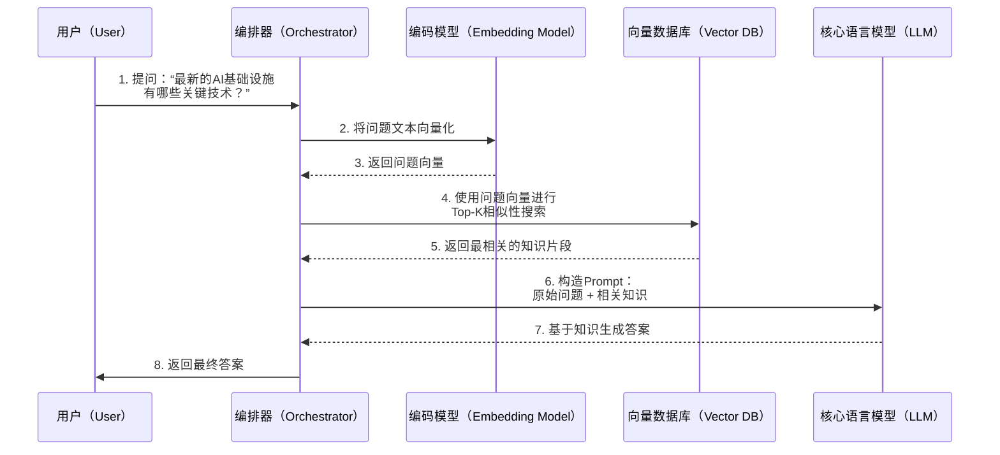
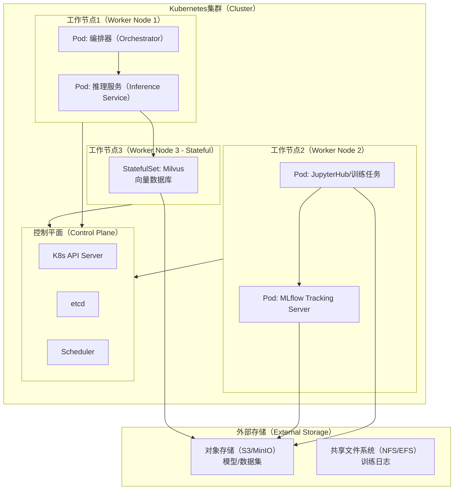
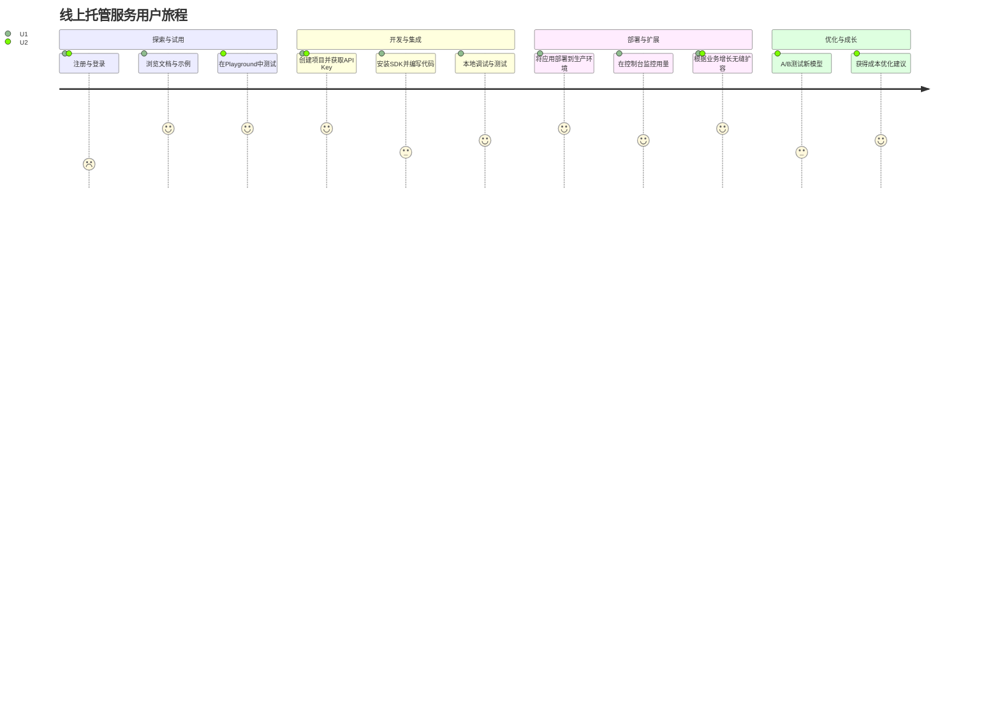
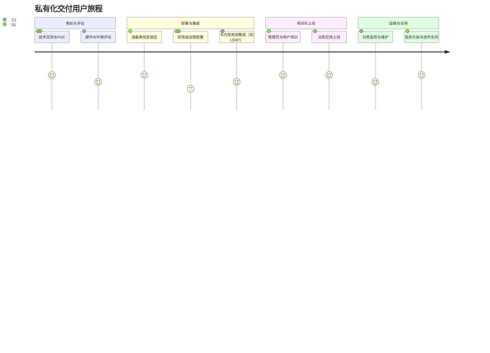
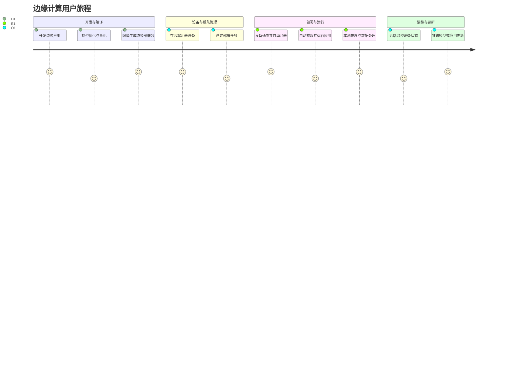

# AI基础设施核心组件深度调研报告 (v3.0)

## 1\. 概述 (Overview)

随着人工智能，特别是大型语言模型（LLM）和生成式AI的飞速发展，现代应用的基础设施正在经历一场深刻的变革。传统的计算、存储和网络架构已不足以支撑AI驱动应用所需的海量数据处理、复杂的模型训练与推理以及新兴的智能体（Agentic AI）工作流。新的AI基础设施不仅需要具备极致的性能和可扩展性，还必须为AI工作负载的特有需求提供原生支持，例如向量计算、分布式训练、低延迟推理和持续的模型迭代与监控 [1]。

AI基础设施的核心思想是构建一个高效、可靠且可扩展的系统，以支持从数据摄取、处理、训练到模型部署、推理和持续优化的完整生命周期。它不仅仅是硬件的堆砌，更是一个由数据存储、计算框架、模型服务、工作流编排和监控工具等紧密集成的软件技术栈。例如，智能体（Agentic AI）的兴起对基础设施提出了新的要求：它需要一个能够动态编排多个AI模型和外部工具（Plugins）的强大“大脑”——即编排器（Orchestrator），以完成复杂的、多步骤的任务。

### 1.1. 背景知识 (Background)

现代AI基础设施的设计理念深受 MLOps（机器学习操作）[2] 和 AIOps（AI用于IT运营）思想的影响，强调自动化、可复现性和协作。其关键演进思路体现在以下几个方面：

  * **计算范式的演进**：从CPU为主到GPU/TPU/NPU等异构计算优先，以加速深度学习任务。
  * **数据处理的演进**：从传统的ETL（抽取、转换、加载）到面向AI的特征工程、向量化和非结构化数据处理。
  * **软件架构的演进**：从单体应用到基于微服务和云原生技术的分布式系统，利用容器化（如Docker）和编排（如Kubernetes）来提升弹性和可移植性。
  * **新兴工作流**：Agentic AI的出现，要求基础设施能够支持动态的、基于意图的、插件化的任务执行流程，而非传统固定的数据流水线。

### 1.2. 数据流与控制流 (Data Flow & Control Flow)

在现代AI应用（尤其是智能体系统）中，数据流和控制流高度交织且动态变化。一个典型的交互流程如下：

1.  **输入解析**：系统接收到用户的自然语言请求。
2.  **意图识别与规划**：编排器（Orchestrator）解析请求，理解用户意图，并将其分解为一系列可执行的步骤或子任务。
3.  **插件/工具选择**：根据任务规划，编排器动态选择一个或多个合适的插件（例如，搜索引擎、代码解释器、数据库查询工具）。
4.  **执行与数据获取**：编排器调用选定的插件，执行操作并获取外部数据或执行结果。
5.  **结果综合与推理**：编排器将插件返回的结果与上下文信息结合，调用核心AI模型（如LLM）进行思考、推理和综合，生成中间或最终答案。
6.  **迭代或输出**：如果任务未完成，流程将返回步骤3或4进行迭代；如果任务完成，则将最终结果格式化并呈现给用户。

以下的数据流图清晰地展示了上述过程。

```mermaid
graph TD
    %% 模块命名规则："大写缩写[中文名称（英文术语）]"
    subgraph USR[用户交互层（User Interaction Layer）]
        A1[用户输入（User Input）]
    end

    subgraph ORC[编排与决策层（Orchestration & Decision Layer）]
        B1[编排器（Orchestrator）]
        B2{意图识别与<br/>任务规划}
        B3{插件选择}
        B4[结果综合与<br/>模型推理]
    end

    subgraph PI[插件与工具层（Plugin & Tool Layer）]
        C1[插件接口（Plugin Interface）]
        C2[插件A<br/>（例如：网络搜索）]
        C3[插件B<br/>（例如：代码执行）]
        C4[插件N<br/>（...）]
    end

    subgraph AIE[AI引擎层（AI Engine Layer）]
        D1[核心AI模型<br/>（LLM/Foundation Model）]
    end

    %% 流程定义
    A1 --> B1
    B1 --> B2
    B2 --> B3
    B3 --> C1
    C1 --> C2
    C1 --> C3
    C1 --> C4
    C2 -- 数据 --> B4
    C3 -- 数据 --> B4
    C4 -- 数据 --> B4
    B4 -- 上下文与提示 --> D1
    D1 -- 推理结果 --> B4
    B4 --> B2 %% 迭代循环
    B4 --> A1 %% 输出结果
```

### 1.3. 典型场景分析：检索增强生成 (RAG) 交互时序

为了更具体地展示组件间的交互，以下时序图描绘了一个典型的检索增强生成（Retrieval-Augmented Generation, RAG）[7] 场景，当用户提出一个需要外部知识的问题时，系统内部的调用顺序。



## 2\. DFX 全景分析 (DFX Panorama Analysis)

DFX（Design for X，面向X的设计）是确保AI基础设施在全生命周期内满足各项非功能性需求的关键。**本章节新增“可部署性”分析，以应对多样化的交付场景。**

  * **可扩展性 (Scalability)**

      * **问题全景**: AI负载具有潮汐效应，训练任务需要海量资源，而推理任务则要求高并发和低延迟。基础设施必须能够弹性伸缩。
      * **解决方案全景**: 采用Kubernetes [3]、Serverless架构（如Knative）、分布式计算框架（如Ray [4]）。
      * **挑战与权衡**: 无状态服务易于扩展，但向量数据库等有状态服务的扩展方案更为复杂；Serverless的冷启动问题可能影响延迟。

  * **性能与成本效益 (Performance & Cost-Effectiveness)**

      * **问题全景**: AI加速器（GPU/TPU）资源昂贵，需最大化利用率，降低延迟，控制总体成本（TCO）。
      * **解决方案全景**: 混合精度训练、模型量化、NVIDIA Triton [5]等高性能推理服务器、Spot实例。
      * **挑战与权衡**: 模型量化可能带来精度损失；动态批处理（Dynamic Batching）能提高吞吐量但会增加单次请求延迟。

  * **可靠性与可用性 (Reliability & Availability)**

      * **问题全景**: AI服务作为核心业务依赖时，必须保证高可用性，防止因模型、数据或服务故障导致业务中断。
      * **解决方案全景**: 模型注册表（如MLflow [6]）支持版本管理与回滚、多可用区冗余部署、Kubernetes健康探针。
      * **挑战与权衡**: 分布式有状态服务的数据一致性、AI模型灰度发布的复杂性。

  * **可观测性 (Observability)**

      * **问题全景**: AI系统存在“黑盒”特性，需监控传统系统指标以及模型特有的漂移（Data/Concept Drift）等指标。
      * **解决方案全景**: Prometheus (Metrics), Loki/ELK (Logging), OpenTelemetry (Tracing)，结合WhyLogs, Arize等专业AI监控工具。
      * **挑战与权衡**: AI应用产生的海量遥测数据带来高昂成本，需有效采样；漂移检测算法复杂，阈值设定困难。

  * **可部署性与可管理性 (Deployability & Manageability)** - **`v3.0 新增`**

      * **问题全景**: AI基础设施需交付到多样化环境中：从公有云、私有化数据中心到资源受限的边缘设备。不同环境的网络、硬件、安全策略差异巨大，给部署和后期运维带来极大挑战。
      * **解决方案全景**:
          * **容器化与声明式部署**: 全面容器化所有组件，并使用Helm Charts或Kustomize打包，通过GitOps工具（如ArgoCD, Flux）实现声明式、可追踪的部署。
          * **Kubernetes Operator模式**: 为核心的有状态组件（如向量数据库）开发Operator，将部署、备份、升级等运维知识固化为代码，实现“无人值守”管理。
          * **环境自适应配置**: 设计灵活的配置管理系统，能够根据目标环境（如`cloud`, `on-premise`, `edge`）动态调整资源请求、副本数、日志级别等参数。
      * **挑战与权衡**:
          * **通用性 vs. 性能**: 为兼容多种环境而做的抽象可能会牺牲在特定环境下的极致性能优化。
          * **易用性 vs. 灵活性**: 一键部署脚本虽然易用，但可能无法满足高级用户的深度定制化需求。需要在两者之间找到平衡。
      * **预期效果与展望**: 实现从云到边的平滑部署体验，大幅降低交付和运维成本。未来，WebAssembly（Wasm）可能会成为一种更轻量、更安全的容器替代方案，进一步提升跨环境部署的一致性和效率。

## 3\. 核心架构设计 (Core Architecture Design)

### 3.1. 总体架构 (Overall Architecture)

```mermaid
graph TD
    %% 定义样式
    classDef layer fill:#f9f9f9,stroke:#333,stroke-width:2px;
    classDef component fill:#ececff,stroke:#9370db;

    %% 模块命名规则："大写缩写[中文名称（英文术语）]"
    subgraph APP[应用与编排层（Application & Orchestration Layer）]
        O[编排器（Orchestrator）]
        PI[插件接口（Plugin Interface）]
    end

    subgraph SER[模型服务层（Model Serving Layer）]
        IS[推理服务（Inference Service）]
        MR[模型注册表（Model Registry）]
    end

    subgraph TRAIN[模型训练与管理层（Training & Management Layer）]
        TP[训练流水线（Training Pipeline）]
        ET[实验跟踪（Experiment Tracking）]
        DVL[数据溯源与版本控制<br>(Data Versioning & Lineage)]
    end

    subgraph DATA[数据与特征层（Data & Feature Layer）]
        VDB[向量数据库（Vector Database）]
        FS[特征存储（Feature Store）]
        DPP[数据处理平台（Data Processing Platform）]
    end

    subgraph INFRA[基础设施与资源层（Infrastructure & Resource Layer）]
        CO[计算编排（Compute Orchestration<br/>e.g., Kubernetes）]
        STO[存储（Storage）]
        NET[网络（Networking）]
    end

    %% 添加样式
    class APP,SER,TRAIN,DATA,INFRA layer;
    class O,PI,IS,MR,TP,ET,DVL,VDB,FS,DPP,CO,STO,NET component;

    %% 定义依赖关系
    APP --> SER; APP --> DATA; SER --> MR; MR --> TRAIN; TRAIN --> DATA; TRAIN --> DVL; DATA --> DVL; SER --> INFRA; TRAIN --> INFRA; DATA --> INFRA;
```

### 3.2. 核心组件交互与部署



**部署架构解析**: 此部署模型是云原生环境的典型实践，通过将不同角色的服务部署到Kubernetes中，并利用外部存储实现存算分离，获得了高度的灵活性和可扩展性。

### 3.3. 编排器 (Orchestrator)

编排器是Agentic AI系统的“大脑”，其核心是规划与记忆。

  * **规划策略**: 从基础的思维链（Chain-of-Thought, CoT）[9]到更复杂的思维树（Tree-of-Thought, ToT）[10]，编排器需要根据任务复杂度选择不同的策略来探索解空间。
  * **内存管理**: 编排器必须维护短期记忆（对话上下文）和长期记忆（由向量数据库支持的知识库）。

### 3.4. 插件化扩展架构 (Plugin-based Extension Architecture)

标准、统一的插件接口是系统扩展性的基石，其生命周期管理（注册、发现、加载、执行、监控、废弃）确保了生态的健康发展。

## 4\. AI 核心组件选型与评估 (AI essential components/building-blocks Selection and Evaluation)

**本表格新增“部署场景适应性”一列，为不同交付目标提供选型参考。**

| 组件名称<br/>(Component Name) | 版本<br/>(Version) | 主要功能 (Main Function) | 可选方案 (Alternatives) | 部署场景适应性 (Scenario Adaptability) | 主要特性 (Main Features) | 必要性度量<br/>(1-5, 5为最高) |
| :--- | :--- | :--- | :--- | :--- | :--- | :--- |
| **计算编排**<br/>Kubernetes | Latest Stable | 容器化应用的部署、扩展和管理 | Docker Swarm, Nomad | **云/私有化**: 极佳<br/>**边缘**: 需K3s/KubeEdge等轻量版 | 声明式API、自动扩缩容、高可用、强大的生态系统 | **5** (事实标准) |
| **分布式计算**<br/>Ray | Latest Stable | 提供简单、通用的API进行分布式应用编程 | Dask, Apache Spark | **云/私有化**: 极佳<br/>**边缘**: 资源开销大，不推荐 | Actor模型、轻量级API、无缝扩展、丰富的生态库(Tune, Serve, RLlib) | **4** (对于大规模AI负载) |
| **向量数据库**<br/>Milvus | Latest Stable | 存储、索引和管理海量向量数据 | Pinecone, Weaviate | **云/私有化**: 极佳<br/>**边缘**: 可用Lite版，但有功能限制 | 高性能相似性搜索、多种索引类型、标量字段过滤、云原生可扩展 | **5** (对于GenAI/RAG应用) |
| **MLOps平台**<br/>MLflow | Latest Stable | 端到端的机器学习生命周期管理 | Weights & Biases | **云/私有化/边缘**: 普遍适用 | 开源、框架无关、模块化设计（Tracking, Projects, Models, Registry） | **5** (保障研发规范与效率) |
| **数据溯源与版本控制**<br/>DVC | Latest Stable | 对数据、模型、代码进行版本控制 | Pachyderm, LakeFS | **云/私有化/边缘**: 普遍适用 | 基于Git、不存储大数据本身、与语言/框架无关、CI/CD集成 | **4** (对于严肃的ML项目) |
| **模型推理服务**<br/>KServe | Latest Stable | 在Kubernetes上部署标准化的AI推理服务 | BentoML, Triton | **云/私有化**: 极佳<br/>**边缘**: 较重，可考虑ONNX Runtime等 | 标准化推理协议(V2)、模型可解释性、请求批处理、基于Knative的自动伸缩 | **4** (可被BentoML等替代) |
| **AI工作流编排**<br/>LangChain | Latest Stable | 简化LLM应用的开发，链接和编排组件 | LlamaIndex, CrewAI | **云/私有化/边缘**: 普遍适用，核心库轻量 | 组件化、丰富的集成、Chains/Agents概念、模板化 | **4** (快速开发的首选) |
| **系统监控**<br/>Prometheus | Latest Stable | 时序数据监控与告警 | InfluxDB, VictoriaMetrics | **云/私有化**: 极佳<br/>**边缘**: 资源开销需评估，有替代方案 | 多维数据模型、强大的查询语言(PromQL)、拉取模型、服务发现 | **5** (云原生监控基石) |

## 5\. 多场景部署策略与竞争力分析 (`v3.0` 核心新增)

一套成功的AI基础设施不仅要技术领先，更要能适应不同的商业交付模式。以下针对三种主流场景进行深度分析。

### 5.1. 线上托管场景 (Online Managed Service)

  * **场景特点**: 面向广大开发者和企业，提供多租户、按需付费的SaaS/PaaS服务。核心是弹性、自动化和开发者体验。
  * **架构调整考量**:
      * **多租户隔离**: 在计算、存储、网络层面实现严格的租户隔离。通常利用Kubernetes的Namespace结合网络策略，并为每个租户提供独立的API密钥和资源配额。
      * **计费与度量**: 必须有精确的用量计量系统，对API调用次数、GPU使用时长、存储容量等进行精确统计，并对接到计费网关。
      * **API网关**: 所有服务通过统一的API网关暴露，负责认证、授权、限流、路由等。
  * **竞争力构建：用户体验 (UX)**:
      * **即时可用**: 提供网页端的Playground，用户无需编写代码即可快速体验核心功能。
      * **无缝的CLI/SDK**: 提供功能强大、文档完善的命令行工具和多语言SDK，简化集成。
      * **可观测性仪表盘**: 为用户提供直观的仪表盘，展示其资源用量、API调用情况、模型性能等。
  * **竞争力构建：用户旅程 (User Journey)**:

<!-- end list -->



### 5.2. 私有化交付场景 (On-Premise Private Deployment)

  * **场景特点**: 面向大型企业、金融、政府等对数据安全和合规性要求极高的客户。产品需部署在客户自有的数据中心或私有云中，通常是网络隔离环境。
  * **架构调整考量**:
      * **打包与安装**: 提供稳定、易用的安装包（如离线Helm包、Ansible Playbook）和详细的部署手册。必须支持在无互联网访问的环境下完成安装。
      * **硬件兼容性**: 适配客户多样化的硬件环境（不同的CPU架构、GPU型号、存储和网络设备）。
      * **权限与审计**: 与客户现有的认证系统（如LDAP, AD）集成，提供基于角色的访问控制（RBAC），并记录所有敏感操作以备审计。
  * **竞争力构建：用户体验 (UX)**:
      * **图形化管理界面**: 提供一个全面的Admin Dashboard，用于系统配置、健康检查、资源监控、用户管理等，降低对运维人员的技能要求。
      * **一键升级与回滚**: 提供经过充分测试的、平滑的升级路径，并能在出现问题时安全地回滚到上一个版本。
      * **全面的健康诊断**: 内置强大的诊断工具，能帮助客户快速定位网络、存储或配置问题。
  * **竞争力构建：用户旅程 (User Journey)**:

<!-- end list -->



### 5.3. 线下边缘计算场景 (Offline Edge Computing)

  * **场景特点**: 部署在资源极其受限的设备上（如工业相机、机器人、车载设备），网络连接不稳定或完全离线。对模型大小、推理延迟、功耗有严苛要求。
  * **架构调整考量**:
      * **轻量化**:
          * **运行时**: 采用轻量级Kubernetes发行版（如K3s [11], MicroK8s）或非容器化部署。
          * **模型**: 必须使用经过量化、剪枝的高度优化模型，并使用ONNX Runtime等高效推理引擎。
          * **组件**: 选择轻量级替代品，如用SQLite替代大型数据库，用MQTT替代Kafka。
      * **数据同步**: 设计鲁棒的“存储-转发”机制，在设备离线时缓存数据，在网络恢复时与云端同步。
      * **远程管理**: 需要一个轻量级的代理（Agent）运行在边缘设备上，用于接收云端下发的指令（如模型更新、配置变更）。
  * **竞争力构建：用户体验 (UX)**:
      * **低资源占用**: 软件栈的CPU和内存占用必须极低，不能影响设备主业务的运行。
      * **即插即用**: 简化配置流程，力求实现设备的“零接触部署”（Zero-touch Provisioning）。
      * **强大的本地韧性**: 即使与云端完全失联，设备核心的AI功能也必须能长时间稳定运行。
  * **竞争力构建：用户旅程 (User Journey)**:

<!-- end list -->



## 6\. 展望 (Outlook)

展望未来，AI基础设施将朝着更加**自动化、智能化和一体化**的方向发展。

  * **Serverless AI**: 从模型推理到模型训练，全流程的Serverless化将进一步屏蔽底层资源管理的复杂性，使开发者能更专注于算法和业务逻辑。
  * **AIOps驱动的自愈与优化**: AI基础设施自身将更广泛地应用AI技术，实现智能的故障预测、根因分析、性能瓶颈诊断和资源调度优化。
  * **软硬件协同设计**: AI模型、编译器、运行时和底层硬件（如新型AI芯片）的协同设计将成为突破性能瓶颈的关键，实现极致的能效比。
  * **统一的AI平台**: 当前分散的工具链将逐步融合，形成更加一体化、端到端的AI开发与运营平台，提供无缝的开发者体验。
  * **混合AI与边云协同 (`v3.0` 新增)**: 未来的主流模式将不是孤立的云或边缘，而是两者的深度协同。边缘设备负责实时数据处理和低延迟推理，并将高价值数据和中间结果上传至云端进行复杂的分析和再训练，形成一个持续学习和优化的闭环。这种模式将最大化云的强大计算能力和边的即时响应能力。

最终，AI基础设施将演变为一种类似于水和电的公共事业设施，开发者可以按需、便捷、经济地获取AI能力，从而加速全社会的智能化进程。

## 7\. 参考资料 (References)

[1] OpenAI. (2023). GPT-4 Technical Report. arXiv:2303.08774.
[2] MLOps: Continuous delivery and automation pipelines in machine learning. Google Cloud Documentation.
[3] Kubernetes Official Website. kubernetes.io.
[4] Ray: A fast and simple framework for building and running distributed applications. ray.io.
[5] NVIDIA Triton Inference Server. NVIDIA Developer.
[6] MLflow: An open source platform for the machine learning lifecycle. mlflow.org.
[7] Lewis, P., et al. (2020). Retrieval-Augmented Generation for Knowledge-Intensive NLP Tasks. arXiv:2005.11401.
[8] DVC - Data Version Control. dvc.org.
[9] Wei, J., et al. (2022). Chain-of-Thought Prompting Elicits Reasoning in Large Language Models. arXiv:2201.11903.
[10] Yao, S., et al. (2023). Tree of Thoughts: Deliberate Problem Solving with Large Language Models. arXiv:2305.10601.
[11] K3s - Lightweight Kubernetes. k3s.io.