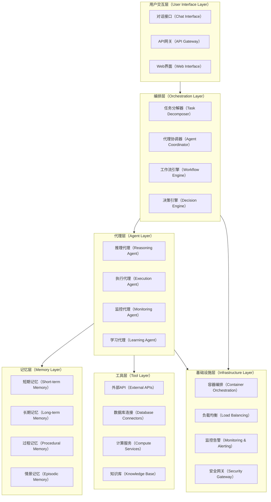
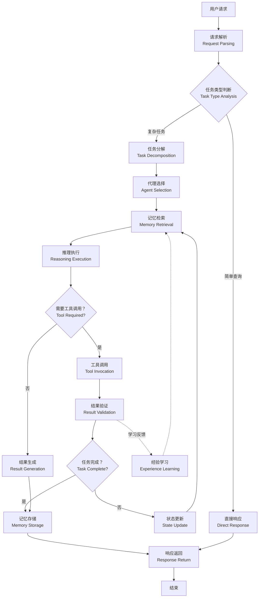
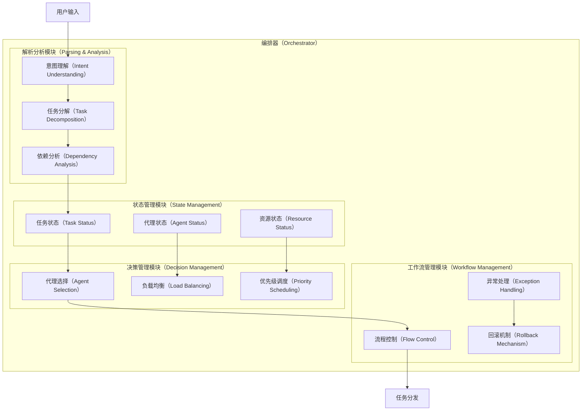
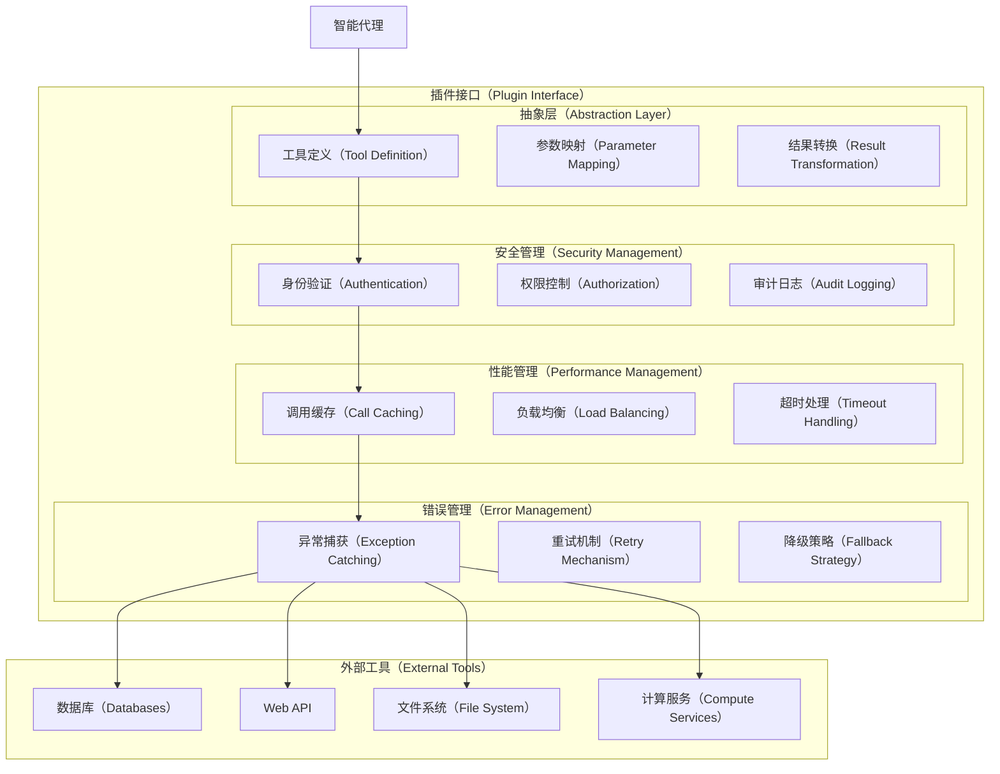
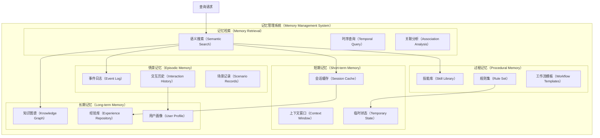
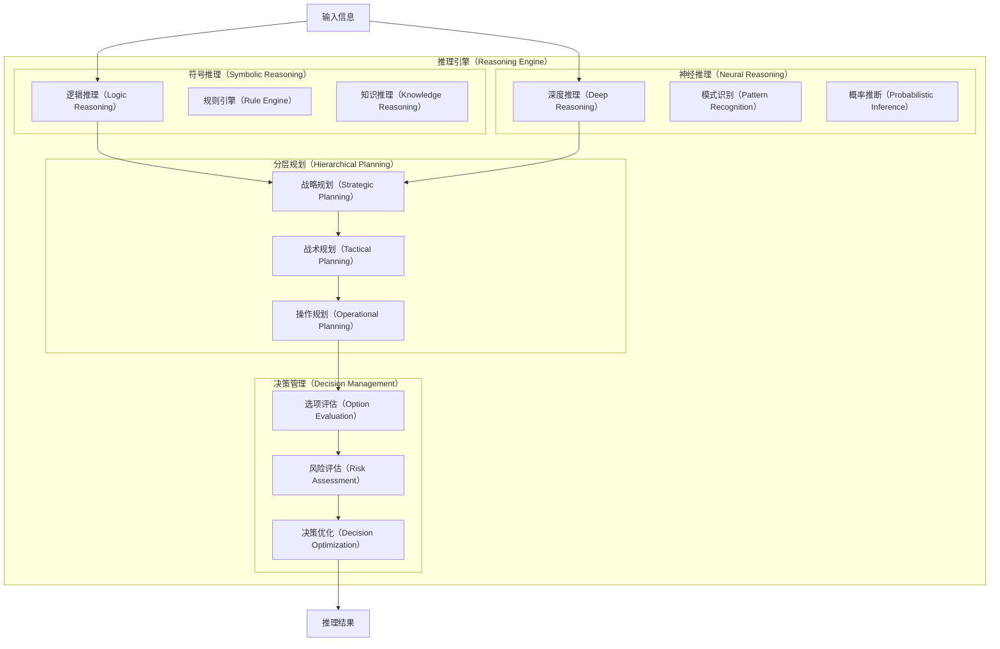
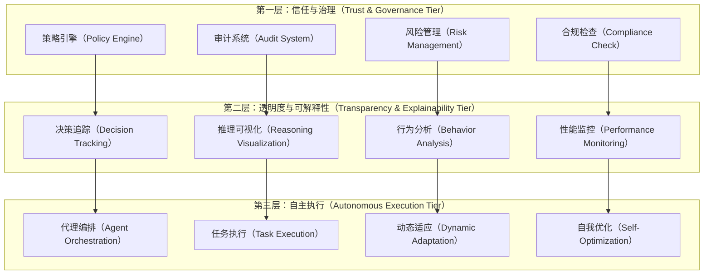
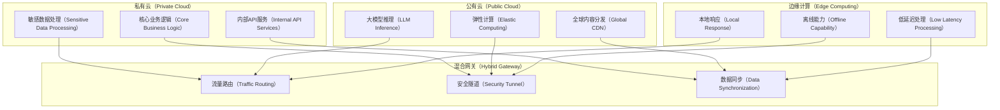
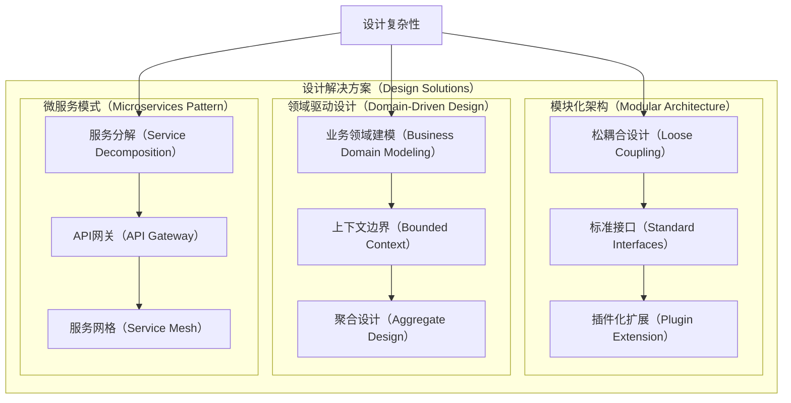

# 智能代理AI基础设施核心组件深度调研报告

## 概述（Overview）

智能代理AI（Agentic AI）代表了人工智能发展的新阶段，得益于推理和记忆方面的突破性进展，AI模型现在更加强大和高效。与传统的生成式AI不同，智能代理不仅仅是传递信息，而是能够推理、行动和协作——在知识和结果之间架起桥梁。

Microsoft AutoGen、LangChain和CrewAI等智能代理AI框架正在为未来奠定基础，在这个未来中，AI系统能够自主操作、动态适应和无缝协作。这些系统的核心在于其复合架构，涵盖了从感知到执行的完整智能循环。

本调研报告深入分析了现代智能代理AI基础设施的核心技术组件，包括编排系统、记忆管理、推理引擎、工具接口等关键模块，并探讨了其在企业级应用中的部署模式和治理机制。

## 智能代理AI基础架构全景

### 系统架构概览

该架构展现了智能代理AI系统的分层设计理念，从用户交互到基础设施的完整技术栈。每一层都承担着特定的职责，同时通过标准化的接口实现层间协作。

### 核心数据流与控制流

该数据流图清晰展示了智能代理系统处理用户请求的完整过程，从初始解析到最终响应的每个关键环节，包括任务分解、代理协作、记忆管理和学习反馈等核心机制。

## 核心组件（Core Components）

### 编排器（Orchestrator）：系统的智慧大脑

编排器是智能代理AI系统的核心控制中心，负责分发任务、管理角色依赖关系，并将输出整合为连贯的结果。其主要功能包括：

#### 任务解析与分解

编排器首先分析用户输入，理解意图并将复杂任务分解为可执行的子任务。这个过程涉及自然语言理解、任务建模和依赖关系分析。

#### 代理选择与调度

基于任务特性和当前系统状态，编排器选择最适合的代理来执行特定任务。企业级智能代理框架如Akka提供了编排、代理、记忆和流处理四个核心组件的无缝协作。

#### 工作流管理

编排器维护任务执行的状态机，确保复杂工作流的正确执行顺序和错误处理。

### 插件接口（Plugin Interface）：可扩展的工具生态

插件接口是智能代理系统与外部世界交互的桥梁，提供了标准化的工具调用机制。AI网关作为所有AI驱动API调用的控制点，包含流量拦截器、策略引擎、路由与成本管理器以及可观测性与审计层等集成组件。

#### 工具抽象层

插件接口定义了统一的工具调用协议，使得不同类型的外部服务能够以标准化的方式被智能代理调用。

#### 安全与权限管理

代理需要能够安全地访问工具和资源以满足用户请求，使用正确的身份验证机制。插件接口实现了细粒度的权限控制和安全策略执行。

#### 性能优化与监控

接口层实现了调用缓存、负载均衡和性能监控，确保工具调用的高效性和可靠性。

### 记忆管理系统（Memory Management System）

AgentCore Memory通过提供业界领先的长期和短期记忆准确性，使开发人员能够轻松构建上下文感知的代理。记忆系统是智能代理持续学习和上下文理解的基础。

#### 多层次记忆架构

现代智能代理系统采用分层的记忆架构，包括：

* **短期记忆**：存储当前会话的上下文信息和临时状态
* **长期记忆**：保存历史交互、学习经验和知识积累
* **过程记忆**：存储和回忆技能、规则和学习的行为，使代理能够自动执行任务而无需每次进行显式推理
* **情景记忆**：记录特定事件和场景的详细信息

#### 记忆检索与更新机制

系统实现了高效的向量化记忆存储和检索机制，支持语义相似性搜索和时序相关性分析。

### 推理引擎（Reasoning Engine）

推理引擎是智能代理系统的认知核心，这些高级代理由大型语言模型驱动，包含推理、规划、记忆和工具使用等能力。

#### 多模态推理能力

现代推理引擎支持符号推理、统计推理和神经推理的融合，能够处理复杂的逻辑关系和不确定性推断。

#### 规划与决策

推理引擎实现了分层的规划算法，从高层策略到具体执行步骤的完整规划链条。

## 企业级部署架构

### 三层架构模型

为了在企业中负责任和有效地部署智能代理AI，组织必须通过三层架构发展，其中信任、治理和透明度先于自主性。

### 混合云部署模式

企业级智能代理系统通常采用混合云部署模式，兼顾性能、安全性和成本效益。

## 关键技术挑战与解决方案

### DFX问题全景

#### 设计挑战（Design Challenges）

* **复杂性管理**：智能代理系统涉及多个组件的协同工作，设计复杂度呈指数增长
* **接口标准化**：需要定义统一的代理间通信协议和工具调用接口
* **可扩展性架构**：系统需要支持动态添加新的代理类型和工具

#### 开发挑战（Development Challenges）

* **多语言集成**：不同组件可能使用不同的编程语言和框架
* **状态管理复杂性**：分布式环境下的状态一致性保证
* **调试困难**：智能代理的行为具有不确定性，传统调试方法不适用

#### 运维挑战（Operations Challenges）

* **性能监控**：需要全新的指标体系来评估智能代理系统的性能
* **故障诊断**：智能代理的错误可能源于推理逻辑而非代码缺陷
* **资源优化**：动态的计算需求使得资源规划变得复杂

#### 安全挑战（Security Challenges）

* **权限控制**：细粒度的权限管理和动态授权
* **数据隐私**：记忆系统中的敏感信息保护
* **对抗攻击**：针对AI模型的提示注入和数据中毒攻击

### 解决方案全景

#### 设计解决方案

#### 开发解决方案

* **统一开发平台**：提供一站式的智能代理开发工具链
* **可视化建模**：通过图形化界面设计代理交互流程
* **测试自动化**：开发专门的智能代理测试框架和工具

#### 运维解决方案

智能代理AI学习、适应并基于实时基础设施条件进行实时优化，包括遥测收集、决策引擎、执行层和反馈循环四个组件协同工作，创建自愈合、策略驱动、成本效益的基础设施。

#### 安全解决方案

* **零信任架构**：实施全面的身份验证和最小权限原则
* **隐私计算**：采用联邦学习和同态加密技术保护数据隐私
* **对抗性训练**：增强AI模型对各种攻击的鲁棒性

## 预期效果与展望

### 技术效果预期

#### 性能提升

* **响应时间**：通过智能缓存和预测性加载，预期响应时间减少40-60%
* **并发处理**：支持10倍以上的并发用户数量
* **资源利用率**：通过智能调度实现资源利用率提升30-50%

#### 准确性改进

* **任务完成率**：复杂任务的自动化完成率预期达到85%以上
* **错误率降低**：通过多层验证机制，错误率降低至5%以下
* **学习效率**：持续学习能力使系统性能随时间不断改进

### 业务价值展望

#### 运营效率提升

组织需要提升员工技能、调整技术基础设施、加速数据产品化，并部署代理特定的治理机制。预期智能代理系统将带来：

* **自动化程度**：常规业务流程自动化率达到80%以上
* **决策速度**：关键业务决策时间缩短70%
* **人员效能**：知识工作者的生产力提升2-3倍

#### 创新能力增强

* **新服务模式**：基于智能代理的全新客户服务体验
* **个性化能力**：深度个性化的产品和服务推荐
* **协作模式**：人机协作的全新工作方式

### 技术发展趋势

#### 近期趋势（2025-2026）

* **多模态融合**：视觉、语言、行为多模态智能代理的成熟
* **轻量化部署**：边缘设备上的智能代理部署能力
* **行业专用代理**：针对特定行业的专业化智能代理

#### 中期趋势（2026-2028）

* **自进化能力**：具备自我改进和进化能力的智能代理
* **群体智能**：大规模代理协作的群体智能涌现
* **物理世界集成**：与机器人和IoT设备的深度集成

#### 长期展望（2028-2030）

* **通用人工智能**：向通用人工智能（AGI）的重要步骤
* **数字孪生生态**：完整的数字孪生智能代理生态系统
* **人机共生**：人类与智能代理深度融合的新社会形态

## 技术实施路线图

### 阶段一：基础设施建设（3-6个月）

1. **核心架构设计**：完成系统整体架构设计和技术选型
2. **基础组件开发**：实现编排器、记忆管理和基础插件接口
3. **开发环境搭建**：建立完整的开发、测试和部署环境

### 阶段二：核心功能实现（6-12个月）

1. **推理引擎集成**：集成先进的推理和规划能力
2. **工具生态构建**：开发丰富的工具插件和外部系统集成
3. **安全体系建设**：实施全面的安全和隐私保护机制

### 阶段三：企业级优化（12-18个月）

1. **性能调优**：大规模部署的性能优化和稳定性提升
2. **治理机制完善**：建立完整的治理、审计和合规体系
3. **生态系统扩展**：构建开放的开发者生态和应用市场

### 阶段四：智能化演进（18-24个月）

1. **自适应优化**：实现系统的自我学习和优化能力
2. **跨域协作**：支持多领域、多场景的智能代理协作
3. **持续创新**：基于用户反馈的持续功能迭代和创新

## 结论

智能代理AI基础设施代表了人工智能技术的重要发展方向，通过编排器、记忆管理、推理引擎等核心组件的协同工作，构建了从感知到执行的完整智能循环。随着开源工具如Ollama和LangChain在代理编排领域的领先地位，这一技术领域正在快速成熟。

企业在部署智能代理AI系统时，需要平衡技术先进性与实际可操作性，通过分阶段的实施策略逐步构建完整的智能代理生态系统。未来，随着技术的不断发展和完善，智能代理AI将成为企业数字化转型和智能化升级的核心驱动力。

## 参考资料

\[1] Microsoft Build 2025: The age of AI agents and building the open
