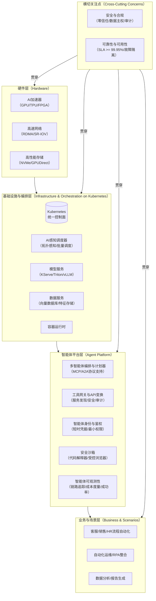

# `Agentic AI Infrastructure & Platform`

本文件对企业级、本地化（On-premise）的智能体AI（Agentic AI）基础设施与平台进行了系统性、前瞻性的整合分析。它融合了多家行业领导者和开源社区的洞察，旨在为技术决策者提供一个抓住本质、简单且强大的（Simple & Powerful）落地指南。

## **一、 核心挑战：从“助手”到“自主体”的生产化鸿沟**

企业在将智能体AI从实验原型推向生产级应用时，普遍面临四大核心挑战：

1.  [cite\_start]**性能与成本的矛盾**：云端推理的高昂费用和不可预测的网络延迟，与金融交易、医疗监控等场景要求的实时性形成冲突 [cite: 5, 6][cite\_start]。同时，企业内部的算力资源（GPU/TPU/FPGA）普遍存在调度不统一、利用率低的问题 [cite: 3, 4]。
2.  [cite\_start]**安全与合规的红线**：在数据主权法规（如GDPR、HIPAA）日益严格的背景下，将医疗、金融等行业的敏感数据传输至外部云平台存在巨大的合规风险和泄露隐患 [cite: 5, 6][cite\_start]。此外，智能体作为“半自主实体”，其权限边界、行为审计和恶意操作的防范是企业级的刚需 [cite: 4, 19]。
3.  [cite\_start]**生态碎片化与集成复杂性**：当前的智能体开发框架、工具和模型服务呈现碎片化状态 [cite: 2, 7][cite\_start]。企业需要投入大量精力整合不同的技术栈，缺乏统一的、可移植的工具协议（如MCP）和跨系统编排标准，导致开发效率低下，并有被供应商锁定的风险 [cite: 2, 3, 13, 19]。
4.  [cite\_start]**运维与可观测性的黑盒**：智能体AI的行为具有一定的非确定性，其多步推理、决策和执行的链条使得问题排查和性能监控变得异常困难 [cite: 38][cite\_start]。企业缺乏有效的手段来度量任务成功率、追踪决策路径、控制成本和保障系统稳定性 [cite: 51]。

## **二、 战略思路：构建分层解耦、治理内嵌的AI原生平台**

为应对上述挑战，行业正在趋向于一种标准化的解决思路，其核心是构建一个分层、开放且治理前置的AI原生平台。

  * [cite\_start]**平台化与抽象化**：通过构建统一的平台，将底层异构的硬件资源、碎片化的模型服务和复杂的工具链进行抽象和封装 [cite: 19, 37]。这使得上层应用开发者可以专注于业务逻辑，而不必关心底层的实现细节。
  * [cite\_start]**标准化与协议化**：引入开放协议，如使用OpenAPI描述工具功能、采用MCP（Model Context Protocol）实现工具的可移植性，以及探索A2A（Agent-to-Agent）协议实现跨企业智能体协作 [cite: 2, 13, 19, 25][cite\_start]。这旨在构建一个类似“AppStore”的开放生态 [cite: 19]。
  * [cite\_start]**治理与安全内嵌**：将安全与治理能力（如身份认证、权限控制、流量审计、成本配额）作为平台的基础设施层能力，而非应用层的事后补救 [cite: 2, 13, 20][cite\_start]。例如，AWS的Bedrock AgentCore将身份（Identity）、网关（Gateway）、可观测性（Observability）等作为独立的核心服务 [cite: 53]。
  * [cite\_start]**Kubernetes即控制面**：将Kubernetes作为承载AI工作负载的统一控制平面，负责部署模型服务、向量数据库、沙箱运行时，并统一编排GPU、高速网络和存储资源，确保AI应用在混合云环境中的一致性与可移植性 [cite: 8, 51]。

## **三、 参考架构：一个五层模型的蓝图**

一个理想的企业级智能体AI平台可以被抽象为以下五层，该架构图清晰地展示了各层之间的关系。

**架构解读**：

  * **硬件层（L2）**：提供基础的异构算力、高速数据通道。
  * **基础设施层（L3）**：以Kubernetes为核心，通过AI感知的调度器和标准化的模型/数据服务，将硬件能力池化并暴露给上层。
  * **智能体平台层（L4）**：这是智能体AI的核心价值所在。它负责智能体的生命周期管理、任务编排、工具调用、身份认证和安全隔离，是实现“自主体”能力的关键。
  * **业务与场景层（L5）**：面向最终用户，解决具体的业务问题。
  * **横切关注点（L1）**：安全与可靠性必须贯穿于每一层，形成纵深防御和全栈高可用。

## **四、 核心基础设施维度解析：简单易用与稳定可靠的平衡**

本章将基础设施按**计算、存储、网络、安全**四个维度进行归纳，并从\*\*简单易用（Simple）**与**稳定可靠（Powerful）\*\*两条主线，映射每个技术需求对应的业务价值，并提供可落地的优先级建议。

### **计算（Compute）**

| | **技术需求 (What)** | **业务价值 (Why)** | **可量化基线/SLO (How Measured)** | **简单易用建议** | **稳定可靠实践** | **快速落地建议** |
| :--- | :--- | :--- | :--- | :--- | :--- | :--- |
| **GPU资源管理** | [cite\_start]异构GPU（NVIDIA/AMD等）的统一池化、细粒度共享（如NVIDIA MIG, 时间分片）与拓扑感知调度 [cite: 55]。 | 提升GPU利用率，降低硬件成本；通过将计算与数据就近调度，缩短训练和推理延迟，加速业务响应。 | GPU平均利用率 \> 60% \<br/\> MIG实例创建成功率 \> 99.9% \<br/\> 拓扑感知调度任务端到端延迟降低 \>= 20% | 提供抽象化的资源申请接口（如"需要一个能训练LLaMA-7B的模型实例"），由平台自动匹配和配置GPU资源。 | 实施自动化故障检测与节点隔离；调度器应支持NUMA亲和性，避免跨节点数据传输开销；确保设备插件的稳定性和版本一致性。 | **Quick Win**: 优先使用NVIDIA官方的GPU Operator在K8s上实现基本的GPU调度和监控。 |
| **AI工作负载编排** | [cite\_start]支持复杂的分布式训练（All-Reduce）和推理任务（Tensor Parallel）的批量调度（Gang Scheduling）与生命周期管理 [cite: 55]。 | 保障大规模训练任务中所有计算节点“同上同下”，避免因部分节点失败导致整个任务悬停，浪费计算资源，确保业务模型能按时产出。 | 分布式训练任务端到端成功率 \> 98% \<br/\> 因调度问题导致的资源空闲时间 \< 5% | 提供声明式的API或UI，用户只需定义总资源和副本数，平台自动处理复杂的Pod亲和性与调度逻辑。 | 采用成熟的社区项目如Kueue进行作业排队和资源公平共享；Volcano/JobSet进行批量调度；对核心训练任务设置高优先级抢占。 | **Quick Win**: 引入Kueue，为不同团队设置资源队列，解决GPU资源争抢问题，实现初步的公平调度。 |
| **沙箱化运行时** | [cite\_start]为不可信的智能体代码执行（如代码解释器、浏览器访问）提供强隔离的安全沙箱（如gVisor, Kata Containers, Firecracker） [cite: 56]。 | 在赋能智能体执行强大功能的同时，有效防止潜在的恶意代码攻击宿主机或窃取其他租户数据，保护企业核心资产安全。 | 沙箱启动时间 \< 5s \<br/\> 零已知容器逃逸漏洞 \<br/\> 沙箱内网络策略强制执行率 100% | 将沙箱作为一种可选的运行时类（RuntimeClass），用户可在工作负载定义中简单地声明使用，平台透明地完成部署。 | 采用多层防御，结合Seccomp, AppArmor和网络策略；对沙箱进行严格的egress流量控制，仅允许访问白名单内的网络端点。 | **Quick Win**: 对于最关键的代码执行任务，优先使用gVisor，它提供了较好的安全性和兼容性平衡。 |

### **存储（Storage）**

| | **技术需求 (What)** | **业务价值 (Why)** | **可量化基线/SLO (How Measured)** | **简单易用建议** | **稳定可靠实践** | **快速落地建议** |
| :--- | :--- | :--- | :--- | :--- | :--- | :--- |
| **高性能数据访问** | [cite\_start]为模型训练和RAG（检索增强生成）提供高带宽、高IOPS的存储接口，并与GPU直接数据交换（如GPUDirect Storage） [cite: 41]。 | 大幅减少数据加载时间，消除I/O瓶颈，从而缩短模型训练周期，加速RAG应用的响应速度，提升用户体验。 | 数据加载带宽 \> 100 GB/s \<br/\> RAG检索p99延迟 \< 500ms \<br/\> 存储IOPS可按需隔离与保障 | 通过K8s的存储类（StorageClass），预定义不同性能等级的存储（如"fast-ssd", "gpu-direct-storage"），用户按需申请。 | 采用支持CSI（容器存储接口）的高性能存储系统；为关键任务提供存储IOPS的QoS保障；定期进行数据备份和容灾演练。 | **Quick Win**: 部署一个基于NVMe SSD的本地路径存储（Local Path Provisioner），为需要低延迟I/O的应用提供快速的本地存储。 |
| **统一数据服务** | [cite\_start]提供统一的向量数据库和特征存储服务，作为平台的基础能力供所有智能体应用消费 [cite: 56]。 | 避免各业务团队重复建设数据基础设施，促进知识和特征在企业内的复用，提升开发效率和模型效果的一致性。 | 向量检索p95延迟 \< 100ms \<br/\> 特征存储服务可用性 \> 99.9% | 平台提供统一的数据库连接地址和SDK，应用开发者无需关心数据库的部署和运维。 | 采用高可用的分布式向量数据库（如Milvus, Weaviate）；实施完善的监控和告警；数据进行加密存储。 | **Quick Win**: 部署一个开源的向量数据库集群，并将其服务地址注册到平台的服务发现系统中，供各团队使用。 |

### **网络（Network）**

| | **技术需求 (What)** | **业务价值 (Why)** | **可量化基线/SLO (How Measured)** | **简单易用建议** | **稳定可靠实践** | **快速落地建议** |
| :--- | :--- | :--- | :--- | :--- | :--- | :--- |
| **高速数据互联** | [cite\_start]支持RDMA/SR-IOV等高性能网络协议，用于分布式训练中节点间的数据交换 [cite: 55, 56]。 | 显著降低节点间通信延迟，提高分布式训练效率，使得更大规模的模型训练成为可能，帮助企业在AI竞赛中获得优势。 | 节点间网络延迟 \< 10µs \<br/\> 带宽利用率 \> 90% | 通过K8s的设备插件机制和DRA（动态资源分配），将高性能网卡作为一种可申请的资源，平台自动完成网络配置。 | 网络拓扑应与计算拓扑对齐（Topology-Aware）；采用支持多CNI的方案（如Multus），为AI任务分配独立的、高性能的网络平面。 | **Quick Win**: 如果已有支持RDMA的硬件，使用社区提供的RDMA设备插件和CNI，为训练任务启用高速网络。 |
| **统一API网关** | [cite\_start]为所有智能体工具和模型服务提供统一的API网关，负责流量路由、安全认证、速率限制和审计 [cite: 22, 28]。 | 简化工具的集成和管理，提供统一的安全策略执行点，防止API滥用，并为所有调用提供可追溯的审计日志，满足合规要求。 | 网关自身延迟 \< 20ms \<br/\> 策略更新生效时间 \< 1s \<br/\> 100%的调用可被审计 | 采用声明式的API路由规则（如K8s Gateway API），通过简单的YAML配置即可发布和管理工具API。 | 部署高可用的API网关集群；实施严格的访问控制策略；对所有通过网关的流量进行日志记录和监控。 | **Quick Win**: 部署一个开源API网关（如Istio Ingress Gateway, Contour），并将其作为所有AI服务的统一入口。 |

### **安全（Security）**

| | **技术需求 (What)** | **业务价值 (Why)** | **可量化基线/SLO (How Measured)** | **简单易用建议** | **稳定可靠实践** | **快速落地建议** |
| :--- | :--- | :--- | :--- | :--- | :--- | :--- |
| **身份与权限管理** | [cite\_start]为每个智能体（Agent）分配独立的身份（Workload Identity），并基于此进行细粒度的权限控制（最小权限原则） [cite: 51]。 | 精确控制每个智能体可以访问的工具、数据和API，防止权限滥用和横向移动攻击，从源头保障系统安全。 | 凭据轮转周期 \< 24h \<br/\> 权限变更实时生效 \<br/\> 零硬编码凭据 | [cite\_start]与企业现有的身份提供商（如Entra ID）集成，实现单点登录和身份的自动化管理 [cite: 4, 22]。平台自动为工作负载注入短时凭据。 | 采用SPIFFE/SPIRE等标准实现工作负载身份；使用OPA/Kyverno等策略引擎在K8s层强制执行访问控制策略。 | **Quick Win**: 启用K8s的Service Account Token Volume Projection功能，为Pod提供短期的、与特定受众绑定的JWT令牌。 |
| **全链路审计与可观测** | [cite\_start]对智能体的每一次决策、工具调用、数据访问进行端到端追踪和记录，形成不可篡改的审计日志 [cite: 6, 29, 35]。 | 满足金融、医疗等行业的严格合规要求；在出现安全事件或非预期行为时，能够快速回溯和定位问题根源。 | 审计日志覆盖率 100% \<br/\> 日志查询延迟 \< 3s | [cite\_start]提供可视化的追踪界面（如Agentforce Command Center [cite: 52]），直观展示智能体的完整行为链条。 | 采用OpenTelemetry标准进行全链路追踪；将审计日志集中存储在安全的、防篡改的系统中；建立实时告警机制。 | **Quick Win**: 在API网关和核心服务中集成OpenTelemetry SDK，将追踪数据发送到一个集中的后端（如Jaeger），实现初步的链路追踪。 |

## **五、 案例研究与趋势预判**

  * **案例：金融行业的风控智能体**

      * **行业问题**：传统基于规则的风控系统难以应对快速变化的欺诈手段，且误报率高。将数据送至云端分析又面临严格的监管限制。
      * **解决方案**：某金融机构部署了一套本地化的智能体AI平台。智能体被授予访问内部交易数据库、客户关系管理系统和外部信誉查询API的权限，所有操作均通过统一的API网关进行，并受到严格审计。
      * [cite\_start]**实际效果**：智能体能够实时分析多维数据，自主推理并执行“冻结可疑交易并通知人工审核”等操作。相比传统系统，欺诈检测的准确率提升了40%，误报率降低了75% [cite: 44]，且所有敏感数据不出数据中心，完全符合数据主权要求。

  * **趋势预判**：

    1.  [cite\_start]**从单体智能到多智能体协作**：未来的竞争优势将体现在多智能体协作（Multi-Agent Systems）上，智能体将像一个组织中的团队一样分工协作 [cite: 40][cite\_start]。这将对平台的编排能力、通信协议（A2A）和冲突解决机制提出更高要求。开源框架CrewAI的兴起正体现了这一趋势 [cite: 54]。
    2.  [cite\_start]**“AI Conformance”成为行业标准**：随着Kubernetes成为AI基础设施的事实标准，CNCF推动的“Kubernetes AI Conformance” [cite: 59] 将定义一套跨云、跨环境的能力与合规基线。通过该认证将成为企业级AI平台的“准入证”。
    3.  [cite\_start]**治理与成本控制成为核心**：随着智能体AI的规模化应用，如何量化其ROI、控制其Token消耗和计算成本，将成为平台治理的核心议题 [cite: 51]。具备精细化成本核算和预算控制能力的平台将更具竞争力。

## **参考资料**

[1] crewai.com. The Leading Multi-Agent Platform.

[2] webarena.dev. WebArena: A Realistic Web Environment for Building Autonomous Agents.

[3] Mialon, G., et al. (2023). GAIA: a benchmark for General AI Assistants. arXiv:2311.12983.

[4] swebench.com. SWE-bench Leaderboards.

[5] CNCF (2025). Help Us Build the Kubernetes Conformance for AI. CNCF Blog.

[6] GitHub. cncf/ai-conformance.