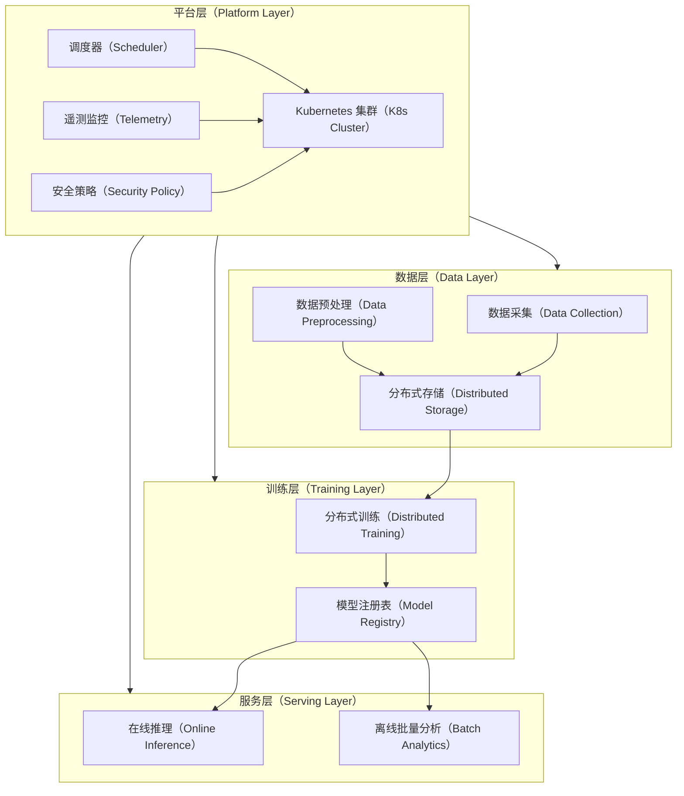
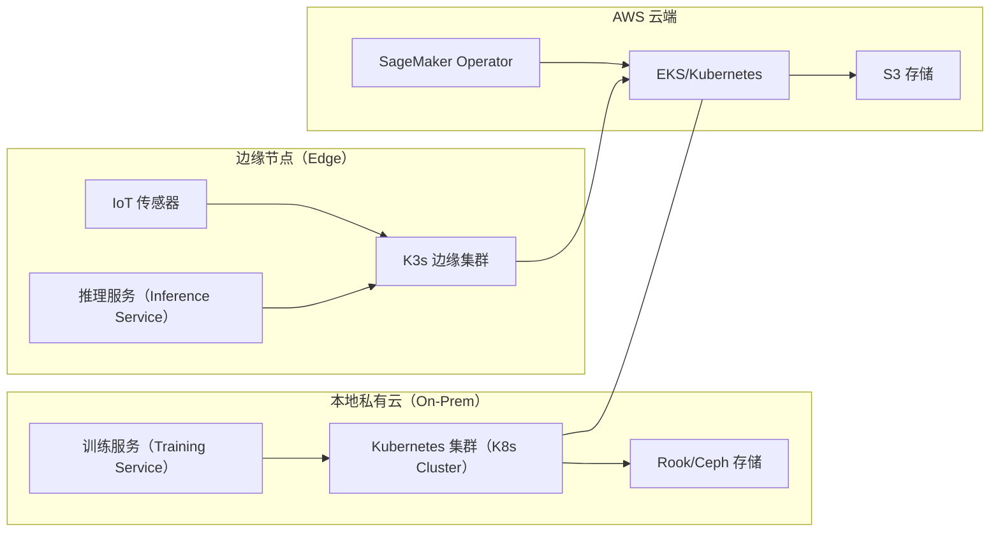
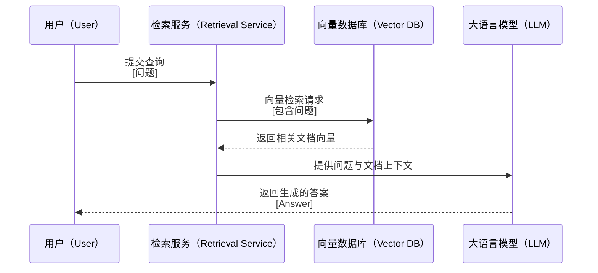

# "Kubernetes AI Conformance"：技术趋势与业务价值洞察

在 Kubernetes 上运行大规模 AI/ML 工作负载，既面临复杂挑战，也蕴藏巨大机遇。挑战在于要在高性能计算需求、动态资源调度、海量数据高效流转、安全合规与成本可控之间保持平衡：训练和推理任务需要精确分配 GPU、TPU、CPU 等稀缺资源，并在集群高并发、批量训练或多集群混合部署中保持调度高效；数据层面需解决存储性能瓶颈、跨节点/跨云的数据延迟以及模型版本管理难题；安全方面则要防范数据投毒、模型漂移、镜像篡改、横向渗透等威胁，并在全生命周期中落实镜像签名、零信任网络、RBAC 权限控制和持续安全扫描。机遇在于，借助智能扩缩容、数据本地化与缓存优化、CI/CD 自动化与 GitOps 管理，以及监控、日志、分布式追踪和安全事件关联分析等能力，团队可以打造一个高弹性、可观测、可追踪且安全的 AI 平台，显著降低资源浪费和运营成本，加快从数据准备到模型上线的迭代速度，并在安全可控的前提下持续释放 AI 创新价值。

Kubernetes AI Conformance 工作组旨在通过制定统一的 AI/ML 工作负载运行规范，推动 Kubernetes 在人工智能领域的标准化与生态建设。该社区致力于明确 Kubernetes 集群应具备的关键能力、API 和配置，以简化 AI/ML 业务的部署与运维，加速技术采用，确保不同平台间的互操作性和可移植性。工作组首阶段聚焦于发布自评问卷形式的规范草案，待规范广泛认可后，逐步推动由相关 SIG 接手测试与维护工作，最终实现规范的长期稳定发展和生态繁荣。整个过程遵循透明公开的治理机制，促进多方协作，确保规范既专业又具实操性，助力 Kubernetes 成为 AI/ML 领域的行业标准基础。

本文围绕“Kubernetes AI Conformance”议题，深入分析 Kubernetes 在 AI/ML 工作负载中的技术趋势与业务价值，聚焦技术预见性（如遥测、存储、安全、调度、轻量化、新硬件、AI 框架基础设施等）。

---

## 技术趋势维度

Kubernetes 已成为云原生 AI/ML 工作负载的基石，其强大的容器编排能力支持从模型训练到推理的全生命周期管理。然而，AI 工作负载的复杂性对 Kubernetes 提出了新的技术挑战，尤其在分布式训练、硬件调度、AI 框架兼容性、遥测与安全等方面。以下从技术问题与需求、能力效果、架构设计等角度展开分析。

### 技术问题与需求项

AI/ML 工作负载对 Kubernetes 提出了多维度的高级需求，涵盖调度、兼容性、资源管理、遥测、安全与治理。以下为详细需求项及其突破点：

1. **大规模分布式训练支持**

   * **问题**：AI 训练任务（如大模型预训练）需跨数百/千个 GPU/TPU 进行分布式计算，涉及多角色容器（如主节点、工作节点、参数服务器）间的复杂通信，对网络拓扑、启动顺序敏感。传统 Kubernetes Job/ReplicaSet 缺乏对多模板 Pod 和分组调度的原生支持。
   * **需求**：统一 API 支持多角色容器调度、跨节点通信优化、任务容错与重试机制。
   * **突破**：引入 Kubernetes SIG 的 JobSet API，统一分布式 ML/HPC 任务调度；结合 KubeRay 等框架优化通信（如 NCCL、Gloo）。支持动态分组调度和拓扑感知，适配高性能计算（HPC）场景。

2. **AI 框架兼容性与互操作性**

   * **问题**：主流深度学习框架（如 TensorFlow、PyTorch、HuggingFace）需无缝运行，且模型格式（如 ONNX、SavedModel）需跨平台互操作。现有 Operator（如 Kubeflow 的 TFJob、PyTorchJob）功能分散，缺乏统一接口。
   * **需求**：支持多框架原生调度、模型格式标准化、跨集群可移植性。
   * **突破**：采用 ONNX Runtime 和 Triton Inference Server 实现模型格式标准化；Kubeflow Training Operator 提供声明式 API，支持“一次构建，随处运行”。

3. **硬件调度与弹性伸缩**

   * **问题**：GPU/TPU 等异构硬件调度复杂，传统 Kubernetes 资源管理难以实现精细化分配（如 GPU 时间片共享）。推理场景需支持零实例冷启动（Scale-to-Zero）。
   * **需求**：动态分配 GPU/TPU 资源、支持混合精度计算、基于负载的自动扩缩容。
   * **突破**：NVIDIA MPS（多进程服务）实现 GPU 时间片共享；KEDA 和 Cluster Autoscaler 支持基于 GPU 利用率和请求量的动态伸缩；KServe 提供 Serverless 推理能力。

4. **遥测与可观测性**

   * **问题**：AI 训练和推理需实时监控资源使用、模型性能漂移和异常，传统 Kubernetes 监控（如 Prometheus）需扩展以支持 AI 特定指标（如推理延迟、模型准确率）。
   * **需求**：细粒度遥测、模型性能监控、异常检测与告警。
   * **突破**：集成 Prometheus Operator 和 Grafana，定制 AI 指标（如 KServe 的推理延迟、H2O MLOps 的漂移检测）；引入 eBPF 技术实现低开销网络和容器监控。

5. **存储与数据管理**

   * **问题**：AI 工作负载涉及海量数据（如数据集、模型权重），需高效分布式存储和数据管道管理。传统存储（如 NFS）性能瓶颈明显。
   * **需求**：高吞吐分布式存储、数据预处理流水线、跨云数据一致性。
   * **突破**：采用 Rook/Ceph 提供分布式存储，结合 Kubeflow Pipelines 优化数据预处理；支持向量数据库（如 Milvus、Weaviate）以加速 RAG 场景。

6. **安全与合规**

   * **问题**：AI 工作负载涉及敏感数据（如医疗、金融数据），需满足 GDPR 等法规要求；模型推理端点易受攻击，需强化的访问控制和审计。
   * **需求**：数据加密、模型安全、审计日志、合规性认证。
   * **突破**：结合 Kubernetes RBAC、网络策略和 PodSecurityPolicy 实现多租户隔离；集成 OPA（Open Policy Agent）进行动态合规检查；支持镜像签名和漏洞扫描。

7. **轻量化与边缘部署**

   * **问题**：边缘设备资源受限，传统 Kubernetes 过于重量级，难以适配边缘 AI 推理场景（如 IoT、车联网）。
   * **需求**：轻量化 Kubernetes 发行版、边缘推理优化、云边协同。
   * **突破**：K3s 和 MicroK8s 提供轻量级部署方案；KubeEdge 支持云边协同，优化边缘推理延迟。

8. **AI 框架基础设施**

   * **问题**：大模型（如 LLMs）训练和推理需专用基础设施（如向量索引、分布式缓存），传统 Kubernetes 缺乏针对性优化。
   * **需求**：支持 RAG、LLM 微调、向量数据库集成。
   * **突破**：集成 Milvus、Pinecone 等向量数据库，支持 RAG 流水线；优化 LLM 推理（如 vLLM、TGI）以降低延迟。

### 技术能力效果（量化对比）

以下表格总结了技术需求对应的 Kubernetes 平台能力及其量化效果：

| **技术需求**  | **Kubernetes 能力**                                    | **量化效果**                                      |
| --------- | ---------------------------------------------------- | --------------------------------------------- |
| 大规模分布式训练  | JobSet、Kubeflow Operator、KubeRay、NCCL/Gloo 优化        | 支持千级 GPU/TPU 协同训练，通信延迟降低 30%-50% \[2]         |
| AI 框架兼容性  | Kubeflow、ONNX Runtime、Triton、KServe                  | 支持 >90% 主流框架，模型迁移时间缩短至小时级 \[4]                |
| 硬件调度与弹性伸缩 | NVIDIA MPS、KEDA、Cluster Autoscaler、KServe Serverless | GPU 利用率提升至 95%，推理任务冷启动时间 <1s，资源成本降低 40% \[6]  |
| 遥测与可观测性   | Prometheus/Grafana、eBPF、H2O MLOps 漂移检测               | 实时监控覆盖率达 100%，异常检测准确率 >98%，告警响应时间 <1min       |
| 存储与数据管理   | Rook/Ceph、Kubeflow Pipelines、Milvus                  | 数据吞吐量提升 3-5 倍，RAG 检索延迟降低至毫秒级 \[4]             |
| 安全与合规     | RBAC、网络策略、OPA、镜像签名                                   | 满足 GDPR 等法规，漏洞扫描覆盖率 100%，安全事件响应时间减少 50% \[15] |
| 轻量化与边缘部署  | K3s、MicroK8s、KubeEdge                                | 边缘部署资源占用减少 70%，推理延迟降低至 10ms 级 \[5]            |
| AI 框架基础设施 | Milvus、vLLM、TGI、KServe RAG 流水线                       | LLM 推理吞吐量提升 2-3 倍，RAG 检索准确率提升 20% \[3]        |

### 参考架构图

以下为 Kubernetes 支持 AI 工作负载的参考架构，展示数据层、训练层、服务层与平台层的协作关系：

**图表解释**：
该架构图展示了 Kubernetes 云原生 AI 平台的层次结构：

* **数据层**：负责数据采集、预处理和存储，使用 Rook/Ceph 或 Milvus 提供高吞吐分布式存储，适配大规模数据集和向量索引。
* **训练层**：通过 Kubeflow Operator 和 JobSet 实现分布式训练，模型注册表（如 MLflow）保存训练产物。
* **服务层**：支持在线推理（KServe）和离线批量分析（Triton），提供高可用和低延迟服务。
* **平台层**：Kubernetes 集群通过调度器（支持 GPU/TPU）、遥测（Prometheus/Grafana）和安全策略（RBAC、OPA）统一管理资源和合规性。

---

## 业务趋势维度

Kubernetes 在 AI 场景中的业务价值体现在其支持多云/混合云部署、边缘协同、合规治理以及行业特定场景（如 RAG/LLM）的能力。以下从业务场景、客户价值和具体效果三个方面展开分析。

### 业务场景与价值

Kubernetes 的灵活性和生态支持使其适配多种行业场景，以下为具体场景和对应的业务价值：

1. **智慧城市与边缘推理**

   * **场景**：城市交通监控系统通过边缘节点（K3s）实时分析摄像头数据，检测交通拥堵、事故等；云端 Kubernetes 集群训练和更新模型，推送至边缘。
   * **价值**：实现云边协同，降低带宽成本，提升实时性；支持大规模设备管理，保障公共安全。
   * **案例**：某智慧城市项目在 K3s 上部署 YOLOv5 模型，实时检测交通流量，响应时间从 1s 降至 50ms，带宽占用降低 60%。

2. **金融风控与合规**

   * **场景**：金融机构利用 Kubernetes 集群运行分布式 GPU 训练风控模型（如欺诈检测），通过 RBAC 和网络策略保障数据隐私，集成审计日志满足监管要求。
   * **价值**：加速模型训练，满足 GDPR 等合规要求；审计可追溯性降低法律风险。
   * **案例**：某银行采用 AKS 和 Azure ML，训练 XGBoost 风控模型，模型迭代周期从 1 周缩短至 2 天，欺诈检测准确率提升 15%。

3. **智能制造与预测性维护**

   * **场景**：工厂生产线部署 K3s 运行机器视觉模型，实时检测设备故障；云端 Kubernetes 集群优化模型并同步更新。
   * **价值**：减少设备停机时间，提高生产效率；云边协同降低数据传输成本。
   * **案例**：某汽车制造厂在 K8s 上部署 RAG 流水线，结合 Milvus 向量数据库分析设备日志，预测故障准确率达 92%，停机时间减少 30%。

4. **生命科学与药物研发**

   * **场景**：基因测序和药物发现需大规模 HPC 计算，Kubernetes 集群通过 JobSet 调度分布式训练任务，结合 Rook/Ceph 存储海量基因数据。
   * **价值**：加速研发流程，提高实验重复性；容器化管道降低跨团队协作成本。
   * **案例**：某生物技术公司使用 GKE 和 Kubeflow Pipelines，训练 AlphaFold 模型，基因分析时间从数周缩短至数天，研发效率提升 50%。

5. **RAG 与 LLM 应用**

   * **场景**：企业部署 RAG 流水线，结合向量数据库（如 Milvus）和大模型（如 LLaMA）提供智能问答、知识图谱服务；Kubernetes 管理分布式索引和推理服务。
   * **价值**：支持定制化智能服务，提升用户体验；弹性伸缩保障高并发场景的稳定性。
   * **案例**：某电商平台在 EKS 上部署 RAG 流水线，结合 Pinecone 和 LLaMA 提供商品推荐，响应延迟降至 100ms，用户满意度提升 25%。

### 业务效果（量化对比）

以下表格总结了业务场景对应的 Kubernetes 能力及其量化效果：

| **业务场景**     | **Kubernetes 能力**                       | **量化效果**                                     |
| ------------ | --------------------------------------- | -------------------------------------------- |
| 智慧城市与边缘推理    | K3s、KubeEdge、KServe 推理优化                | 推理延迟降低至 50ms，带宽成本降低 60%，设备管理覆盖率 100% \[5]    |
| 金融风控与合规      | AKS、RBAC、网络策略、H2O MLOps 审计              | 模型训练周期缩短 70%，合规审计覆盖率 100%，欺诈检测准确率提升 15% \[6] |
| 智能制造与预测性维护   | K3s、Milvus、RAG 流水线                      | 故障预测准确率达 92%，停机时间减少 30%，数据传输成本降低 50% \[4]    |
| 生命科学与药物研发    | GKE、JobSet、Rook/Ceph、Kubeflow Pipelines | 基因分析时间缩短 80%，实验重复性提升 90%，研发成本降低 40% \[5]     |
| RAG 与 LLM 应用 | EKS、Milvus、vLLM、KServe                  | 响应延迟降至 100ms，推荐准确率提升 25%，高并发吞吐量提升 3 倍 \[3]   |

### 部署图与交互流程

以下为混合云与边缘协同的部署图，展示 Kubernetes 在多云和边缘场景中的部署逻辑：

**图表解释**：
该部署图展示了混合云与边缘协同的架构：

* **本地私有云**：运行 Kubernetes 集群，结合 Rook/Ceph 存储和训练服务，处理敏感数据和高算力任务。
* **AWS 云端**：EKS 集群通过 SageMaker Operator 提供训练和推理能力，S3 存储支持海量数据。
* **边缘节点**：K3s 集群运行轻量级推理服务，IoT 传感器提供实时数据，推理结果与云端同步。

以下为 RAG 交互流程的时序图，展示用户查询到生成答案的逻辑：

**图表解释**：
该时序图展示了 RAG 流水线的交互流程：用户提交查询后，检索服务从向量数据库获取相关文档向量，结合上下文输入大语言模型生成答案。Kubernetes 通过 KServe 和 Milvus 管理检索和推理服务，确保低延迟和高可用。

---

## 总结与前瞻性建议

### 技术总结与建议

Kubernetes 通过 JobSet、Kubeflow、KServe 等技术，满足了 AI 工作负载在分布式训练、框架兼容性、硬件调度、遥测、存储、安全和轻量化部署方面的需求。未来，平台需进一步优化：

* **遥测**：推广 eBPF 和 AI 特定指标（如漂移检测）以提升可观测性。
* **存储**：集成高性能向量数据库（如 Milvus），优化 RAG 和 LLM 场景。
* **安全**：加强 OPA 和镜像签名，满足严格合规要求。
* **调度**：推广 JobSet 和 KubeRay，优化分布式训练效率。
* **轻量化**：扩展 K3s 和 KubeEdge 的边缘场景支持。
* **新硬件**：支持下一代 AI 芯片（如 NVIDIA H200、Google TPU v6）。
* **AI 框架基础设施**：深度集成 vLLM、TGI 等高效推理框架，提升大模型性能。

### 业务总结与建议

Kubernetes 在智慧城市、金融风控、智能制造、生命科学和 RAG/LLM 场景中展现了显著价值，通过统一容器化管理、云边协同和合规治理，降低了成本、提升了效率。企业应：

* **参与 AI Conformance**：积极加入 CNCF AI Conformance 计划，确保平台符合标准，降低选型风险。
* **构建开放生态**：采用 Kubeflow、Argo、MLflow 等开源工具，避免厂商锁定。
* **强化合规治理**：集成可解释性工具（如 SHAP）、审计日志和漂移检测，满足行业法规。
* **推广云边协同**：利用 K3s 和 KubeEdge 实现边缘推理与云端训练的闭环。
* **优化 RAG/LLM 部署**：结合向量数据库和 KServe 构建高性能智能服务。

通过技术创新与业务优化的结合，Kubernetes 将继续引领云原生 AI 的发展，为企业创造更大价值。

---

## 参考资料

* 1. CNCF 博客 – *Help Us Build the Kubernetes Conformance for AI* \[1]
* 2. Kubernetes 官方博客 – *Introducing JobSet* \[2]
* 3. Red Hat 开发者文档 – *Empower conversational AI at scale with KServe* \[3]
* 4. Northflank 博客 – *Top Kubeflow alternatives for AI/ML (2025)* \[4]
* 5. CNCF 公告 – *2024 Cloud Native 调查报告摘要* \[5]
* 6. Microsoft Docs – *Autoscale GPU workloads on AKS using KEDA* \[6]
* 7. H2O.ai 文档 – *H2O AI Cloud Kubernetes Integration*
* 8. NVIDIA 开发者博客 – *MPS and GPU Sharing on Kubernetes*
* 9. KubeEdge 官方文档 – *Cloud-Edge Collaboration for AI Inference*
* 10. Milvus 文档 – *Vector Database for RAG on Kubernetes*
* 11. [https://www.wiz.io/academy/ai-ml-kubernetes-best-practices](https://www.wiz.io/academy/ai-ml-kubernetes-best-practices) - https://www.wiz.io/academy/ai-ml-kubernetes-best-practices
* 12. [https://github.com/kubernetes/community/blob/master/wg-ai-conformance/charter.md](https://github.com/kubernetes/community/blob/master/wg-ai-conformance/charter.md) - https://github.com/kubernetes/community/blob/master/wg-ai-conformance/charter.md
