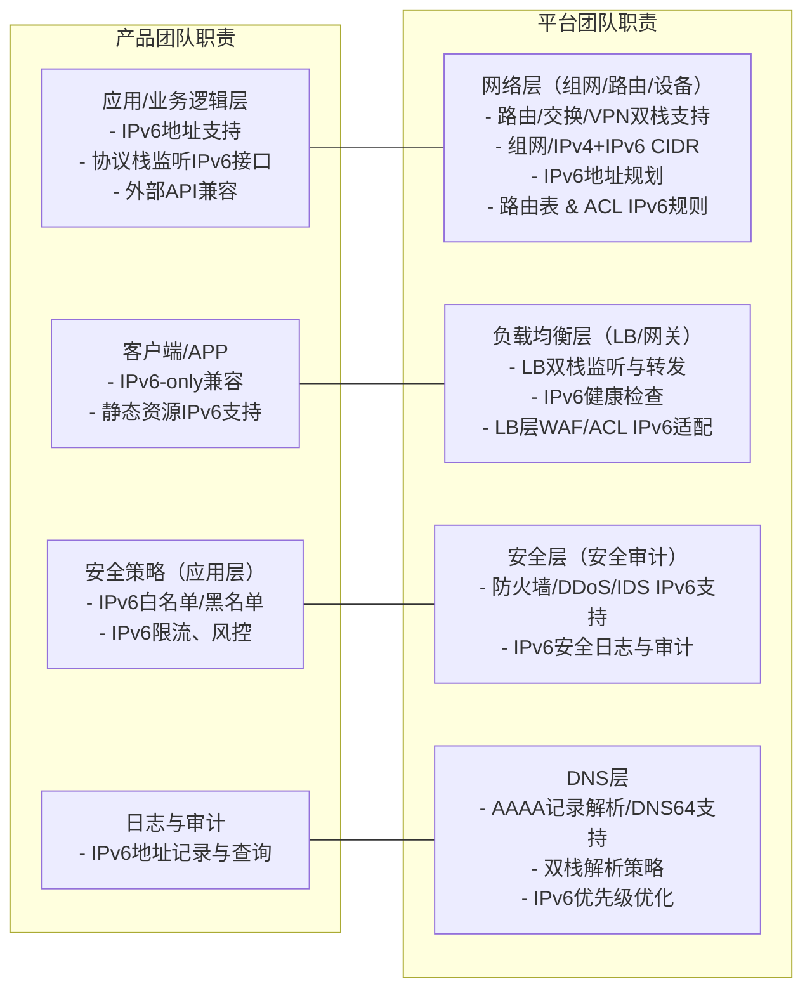

# 通用产品IPv6改造技术方案调研

## 南北向流量与东西向流量的改造特点与实现

* **南北向流量**（即外部用户与数据中心/云平台之间的通信）主要涉及Internet边界和负载均衡。改造时需在边界网关和负载均衡器上启用IPv6/IPv4双栈，配置DNS的AAAA记录，并支持NAT64等协议转换，以保证IPv6客户端可访问IPv4后端服务。例如，AWS的Internet Gateway和NAT网关原生支持双栈；阿里云的ALB/NLB双栈实例也能将IPv6客户端流量转发至IPv4或IPv6后端。
* **东西向流量**（即数据中心/云平台内部服务器间的通信）随着云化和微服务的发展占比越来越大。内部流量通常要求极低延迟和更细粒度的安全隔离，传统集中式防火墙难以胜任。实践中一般采用内网原生IPv6互通并结合**微分段**（分布式防火墙）技术对东西向流量进行安全管控。例如H3C的微分段方案能在源端设备上根据分组ID实施安全控制，显著降低ACL使用率并避免集中式防火墙瓶颈。

## 全栈支持IPv4/IPv6双栈的实现路径

**应用层面：** 应用程序需要支持IPv6地址访问和DNS AAAA记录，尽量使用兼容IPv6的网络库。对于Web服务，需在服务器或容器上绑定IPv6监听，确保SSL证书覆盖IPv6域名。若应用短期无法升级，可考虑部署反向代理或NAT64网关来提供临时兼容。

**平台层面：** 现代操作系统和容器平台普遍支持双栈。以Kubernetes为例，其IPv4/IPv6双协议栈网络可同时为Pod和Service分配IPv4和IPv6地址；从1.21版本开始，Kubernetes集群默认启用双栈模式。只要网络插件和云提供商支持双栈，Pod容器即可同时持有两个地址，实现双栈通信。

&#x20;在云环境中创建虚拟私有网络（VPC）时，控制台通常提供“一键启用IPv6”选项，平台会自动为VPC分配IPv6网段构建双栈网络。以青云云平台为例，用户创建VPC时勾选IPv6，即可获得系统自动分配的IPv6网段，简化了双栈网络的构建过程。

**网络层面：** 网络基础设施需要支持IPv6协议，包括路由器、交换机、VPN网关、DHCP/DNS等。公有云提供商通常在VPC、子网和路由表中加入IPv6选项。例如，AWS在创建VPC时可选择IPv4+IPv6模式，自动为子网分配IPv6地址段；华为云在创建VPC/交换机时开启IPv6后，系统自动创建IPv6网关并分配地址；腾讯云可在多个地域为VPC分配IPv6 CIDR并启用双栈模式。在内部网络中，需要规划IPv6地址规划（例如使用国内ULA或全球单播前缀）并做好路由配置，同时更新网关和防火墙规则以同时处理IPv4和IPv6流量。

&#x20;**负载均衡层面：** 云平台负载均衡器一般支持双栈接入，可为实例添加公网IPv6地址并将后端网络类型设为IPv6，从而支持IPv6流量负载均衡。上述图示为青云云平台的负载均衡管理界面，用户在创建负载均衡实例时可添加IPv6入口，并设置后端使用IPv6网络，以便将IPv6客户端请求转发到后端服务。类似地，阿里云的ALB/NLB双栈实例可同时挂载IPv4和IPv6 ECS，实现对不同协议客户端请求的一致处理。

**安全层面：** 所有安全设备（防火墙、入侵检测、访问控制列表等）和策略都需支持IPv6。改造时应部署IPv6防火墙，确保对应的策略覆盖IPv6地址和端口。某证券公司IPv6改造实践中，部署了外层IPv6防火墙、IDS以及运营商IPv6防DDoS等多层防护。对于东西向流量，建议结合微分段（组策略）技术，在源端主机或虚拟交换机实现分布式安全控制。同时要注意，安全组和ACL需同时配置IPv4/IPv6规则，确保新老协议下的访问控制一致。

## 线上托管服务与私有化部署的方案异同

* **公有云/SaaS**：在云平台上部署的托管服务（SaaS、PaaS）通常由云厂商提供双栈支持方案，用户只需在控制台中开启IPv6或使用提供的转换功能即可。例如，公有云负载均衡服务允许快速创建双栈实例，直接向IPv6客户端提供服务而无需改造后端应用。大部分云服务（如数据库服务、对象存储等）也已支持IPv6访问。由于底层网络由云厂商维护，用户可省去物理网络设备升级的工作。
* **私有化部署**：对于部署在企业自有数据中心或本地服务器的应用，企业需要自行申请IPv6地址资源、升级路由交换设备并配置内部网络双栈。改造成本和周期通常较高。为了降低难度，可采用混合方式：例如华为云提供的IPv6 EIP转换功能，可以通过VPN或专线将IDC与云VPC相连，使用云端NAT64网关对外提供IPv6服务。这样无需改动内部IPv4网络，便可快速响应IPv6客户端请求。在私有部署场景下，企业还需关注内部DNS、DHCP的IPv6配置、IP规划以及安全审计的兼容性等事项，与公有云相比安全控制可更加细粒度但工作量更大。

## 主流厂商实践与标准

根据国家《2025年深入推进IPv6规模部署工作要点》，到2025年底我国要建成全球领先的IPv6体系，并强调与AI等新技术的融合发展。响应国家战略，国内外厂商纷纷推出全栈IPv6解决方案：

* **AWS**：AWS支持VPC子网和网关的双协议栈配置，可为VPC直接分配IPv6前缀；AWS Gateway Load Balancer和Internet/NAT网关均支持IPv6，避免应用降级并减少NAT带来的延迟。此外，AWS的Application Load Balancer和Network Load Balancer均可配置为双栈，使IPv6客户端无缝访问后端服务。
* **阿里云**：自2018年起阿里云推出全栈IPv6方案，VPC和ECS均可启用双栈模式。阿里云ALB/NLB支持IPv6挂载，双栈实例可将IPv6流量转发到IPv4/IPv6后端。此外，阿里云还提供IPv6专用网络、IPv6 EIP等功能，覆盖负载均衡、弹性公网IP、DNS等各层面。
* **华为云**：华为云虚拟私有云（VPC）和云服务器（ECS）支持IPv6双栈配置；用户开通IPv6网段后，系统自动创建IPv6网关并为子网分配地址段。华为云还推出了IPv6弹性公网IP转换服务，可将已有的IPv4服务映射为IPv6地址，从而实现线下IDC向IPv6过渡。华为云的ELB（负载均衡）等网络产品亦支持IPv6。
* **腾讯云**：腾讯云已在全球多个地域支持IPv4/IPv6双栈私有网络，用户可通过控制台为VPC分配IPv6 CIDR，随后创建双栈子网并为CVM实例分配IPv6地址，实现与外部IPv6网络通信。腾讯云负载均衡和安全组等服务也在迭代增加IPv6支持。
* **安全厂商**：主流网络安全厂商均在产品中支持IPv6。Palo Alto Networks的PAN-OS自10.1.6版本起支持NAT64转换和IPv6策略控制；Fortinet防火墙的FortiOS也提供IPv6 SNAT和NAT64配置选项（官方文档说明如何在防火墙上配置IPv6 SNAT/NAT64）。这些产品可以基于IPv6地址进行访问控制、防火墙策略和入侵检测，保证IPv6环境下的安全能力等同于IPv4环境。

## 方案可行性、成本、兼容性与安全性分析

不同IPv6过渡方案各有优劣：

* **双栈方案**：在网络设备上同时启用IPv4和IPv6协议栈，可彻底解决IPv4/IPv6兼容性问题，所有用户和服务同时获得两个地址。其优势是适配彻底、无需协议转换；缺点是需要全面升级网络和终端设备，管理复杂度和成本较高，且IPv6地址稀缺性无法通过双栈方案缓解。
* **隧道方案**：通过IPv6-in-IPv4或IPv4-in-IPv6隧道传输数据，可以较快实现IPv6覆盖，投入硬件成本低。但由于存在封装开销，转发效率较低，并且无法实现两种协议的原生互通，隧道模式仅适合在IPv6网络孤岛间临时通信。
* **协议转换（NAT64/DNS64）方案**：使用NAT64网关让IPv6客户端与IPv4服务器互联，有效缓解IPv4地址紧张。该方案对用户透明，不需改造IPv4后端应用；但会引入网络延迟、某些应用兼容性问题（如未跟随RFC的应用可能访问失败），且增加了网络架构的复杂性和维护成本。
* **反向代理方案**：在用户与服务器之间部署反向代理或应用层网关，通过更新DNS解析无需改动内部架构即可支持IPv6访问。此方案实施简单并能对请求进行安全隔离，但反代服务器可能成为单点瓶颈，在高并发场景下需要额外扩容，并带来中间缓存或延迟的影响。

综上，各方案应根据业务需求权衡选择：双栈最为彻底但成本高昂；NAT64和反向代理可快速部署但需注意兼容性和性能；隧道方案适用于短期过渡。微分段、软件定义网络等新技术可辅助提升东西向通信安全性和灵活性。总体而言，实现IPv6改造时需综合考虑技术可行性、投入成本、业务兼容性和安全性，逐步推进全栈双栈部署。

## 分工
好，那我帮你把 **IPv6 双栈改造职责分界表** 转成一个 **Mermaid 双列对照图**，适合在 Wiki、GitLab、Confluence、PPT 里直观展示。

---

---

* 左边是 **产品** 业务适配工作，右边是 **平台** 公共能力升级
* 中间的连线对应模块配合关系

