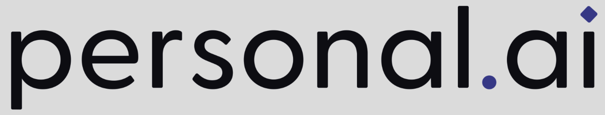

<!-- 幻灯片1: 封面 -->
# 先用AI，先进起来

## 人工智能赋能研发全过程的实践指南

  

  **PersonalAI 项目**  
  https://github.com/turtacn/PersonalAI

---

<!-- 幻灯片2: 内容概览 -->
# 内容概览

- **研发面临的挑战与机遇**
- **AI技术革新与研发融合**
- **"产研GPT三级火箭"理念介绍**
- **实践案例与价值展示**
- **落地路径与资源获取**

> "让顶尖AI模型为研发团队打工"

---

<!-- 幻灯片3: 研发现状与挑战 -->
# 研发现状与挑战

  

  ## 当前痛点
  - 研发效率瓶颈与周期压力
  - 知识传承困境与技术债务
  - 创新转化周期长、成本高
  - 质量保障压力不断增加
  - 人才资源有限与需求无限

  

  

  ## 行业变革趋势
  - 数字化转型加速
  - 降本增效成为刚需
  - 技术栈迭代速度加快
  - 创新竞争日趋激烈
  - 软件供应链安全受关注

  

---

<!-- 幻灯片4: AI技术变革 -->
# AI技术变革

  

  ## 技术飞跃
  - 大语言模型(LLM)能力突破
  - 多模态模型赋能全场景
  - AI智能体(Agent)崭露头角
  - 模型上下文协议(MCP)标准化
  - AI工具链快速成熟

  

  

  ## 研发领域机遇
  - 代码智能生成与补全
  - 需求理解与原型快速构建
  - 测试自动化与质量提升
  - 文档生成与知识沉淀
  - 创新加速与价值挖掘

  

---

<!-- 幻灯片5: 三级火箭总览 -->
# "产研GPT三级火箭"理念

  

从需求理解到知识产权保护，AI赋能研发全过程，实现价值闭环。

---

<!-- 幻灯片6: 一级火箭 - PrototypeGPT -->
# 一级火箭 - PrototypeGPT

## 快速系统原型化

  

  ### 核心价值
  - 需求快速理解与澄清
  - 用户体验流程可视化
  - 交互原型快速构建
  - 客户反馈及时收集
  - 需求迭代周期缩短

  

  

  ### 关键技术
  - 多模态模型理解需求文档
  - Prompt 工程引导设计思路
  - AI Agent 自动化原型构建
  - 可视化草图与流程图生成
  - 反馈优化循环系统

  

---

<!-- 幻灯片7: 二级火箭 - DevelopGPT -->
# 二级火箭 - DevelopGPT

## 系统设计与实现加速

  

  ### 核心价值
  - 架构设计辅助与优化
  - 代码框架快速生成
  - 60%+ 常规代码自动完成
  - 测试用例自动生成
  - 文档注释一体化

  

  

  ### 关键技术
  - CodeLLM 代码生成与优化
  - 架构约束与规范引导
  - 参考实现智能迁移适配
  - 代码质量实时分析
  - 测试覆盖率智能提升

  

---

<!-- 幻灯片8: 三级火箭 - IPRGPT -->
# 三级火箭 - IPRGPT

## 知识产权草案生成

  

  ### 核心价值
  - 技术创新点自动识别
  - 专利撰写辅助加速
  - 专利检索与对比分析
  - 知识产权保护强化
  - 技术资产沉淀与传承

  

  

  ### 关键技术
  - 技术要素智能提取
  - 专利语言规范化生成
  - 相似专利智能检索
  - 差异化分析与强化
  - 技术创新方向预测

  

---

<!-- 幻灯片9: 系统智能诊断 -->
# 系统智能诊断

## AI驱动的问题发现与解决

  

  ### 核心价值
  - 系统问题快速定位
  - 根因分析自动化
  - 解决方案智能推荐
  - 故障预测与预防
  - 知识库动态积累

  

  

  ### 关键技术
  - 日志智能分析系统
  - 多源数据关联分析
  - 故障模式识别与匹配
  - 专家经验知识库构建
  - 持续学习反馈机制

  

---

<!-- 幻灯片10: 案例一 - 需求快速原型化 -->
# 案例一：需求快速原型化

## 背景与挑战
- 某金融科技企业需求变更频繁，传统原型设计周期长  
- 跨部门沟通成本高，需求理解偏差导致返工率高  
- 原型设计资源有限，无法满足多项目并行需求  

## 应用方法
1. 使用 PrototypeGPT 处理需求文档，提取核心功能点  
2. 基于多模态模型生成初步 UI/UX 草图及交互流程  
3. 通过 AI Agent 自动化构建可交互 Demo  
4. 收集反馈并迅速迭代优化原型  

## 价值成效
- 原型构建周期从 2 周缩短至 2 天  
- 需求理解准确率提升 40%  
- 客户满意度显著提升，项目推进速度加快  

---

<!-- 幻灯片11: 案例二 - 代码智能生成 -->
# 案例二：代码智能生成

## 背景与挑战
- 某云原生平台团队面临微服务架构升级改造  
- 大量组件需要重构，但人力资源有限  
- 代码规范与一致性需要保障，技术债务需要消除  

## 应用方法
1. 使用 DevelopGPT 分析现有代码库，理解业务逻辑  
2. 根据新架构规范，生成微服务框架与接口定义  
3. 自动化生成数据模型、服务层、测试用例  
4. 团队专注于核心业务逻辑与性能优化  

## 价值成效
- 代码生成效率提升 200%  
- 70% 的常规代码实现自动化  
- 代码质量与一致性显著提升  
- 团队可专注于核心创新点  

---

<!-- 幻灯片12: 案例三 - 测试自动化 -->
# 案例三：测试自动化

## 背景与挑战
- 某中间件产品测试覆盖率低，质量风险高  
- 手工编写测试用例工作量大，效率低  
- 复杂场景测试难以全面覆盖  

## 应用方法
1. 使用 DevelopGPT 分析产品代码与功能规格  
2. 自动生成单元测试、集成测试与端到端测试用例  
3. 边界条件与异常场景智能发现与测试  
4. 测试结果分析与问题自动归类  

## 价值成效
- 测试用例覆盖率从 60% 提升至 95%  
- 测试编写效率提升 300%  
- 发现潜在问题数量增加 40%  
- 产品质量与稳定性显著提升  

---

<!-- 幻灯片13: 案例四 - 知识产权生成 -->
# 案例四：知识产权生成

## 背景与挑战
- 某数据中台项目包含多项创新技术，但专利申请滞后  
- 技术人员不熟悉专利撰写规范，撰写质量参差不齐  
- 专利检索与分析耗时长，差异化创新点难以凸显  

## 应用方法
1. 使用 IPRGPT 从项目文档与代码中提取技术创新点  
2. 自动生成专利说明书初稿，符合专利撰写规范  
3. 智能检索相似专利，进行差异化分析  
4. 针对性强化创新点描述与保护范围  

## 价值成效
- 专利撰写周期从 3 周缩短至 3 天  
- 单季度专利申请量增长 150%  
- 专利质量评分提升 35%  
- 技术资产转化效率显著提高  

---

<!-- 幻灯片14: 技术选型 -->
# 技术选型

## 模型选择指南

  

  ### 商业模型优势
  - 功能完备，持续更新
  - 技术支持与 SLA 保障
  - 易于集成与使用
  - 合规性与数据安全保障

  **适用场景**：企业级应用、正式生产环境

  

  

  ### 开源模型优势
  - 成本可控，自主可控
  - 可本地部署，数据隐私保护
  - 可定制与优化
  - 无访问限制与配额

  **适用场景**：内部工具、敏感数据场景

  

---

<!-- 幻灯片15: 工程实践 -->
# 工程实践

  

系统化的工程实践确保 AI 应用能持续创造价值，形成正向循环。

---

<!-- 幻灯片16: 团队转型 -->
# 团队转型

## AI赋能研发团队的转型路径

  

  ### 角色与能力演变
  - 工程师 → AI 提示工程师
  - 测试工程师 → 测试策略专家
  - 产品经理 → AI 产品规划专家
  - 架构师 → AI 架构集成专家

  

  

  ### 渐进式转型策略
  1. **试点阶段**：选择小规模非关键项目  
  2. **推广阶段**：扩展到更多场景，总结经验  
  3. **深化阶段**：全面集成，建立标准化流程  
  4. **创新阶段**：AI 驱动创新，持续优化  

  

---

<!-- 幻灯片17: 成本与收益 -->
# 成本与收益

## AI赋能研发的投资回报分析

  

  ### 投入成本
  - AI 服务/模型使用费用
  - 工具开发与集成成本
  - 团队培训与适应成本
  - 流程再造与管理成本

  

  

  ### 收益分析
  - 研发周期缩短 30%–50%
  - 人力成本节约 25%–40%
  - 产品质量提升 15%–30%
  - 创新能力显著增强
  - 技术资产积累加速

  

---

<!-- 幻灯片18: 核心工具资源 -->
# 核心工具资源

## PersonalAI 工具生态

  

  ### 文档资源
  - AI 研发方法论指南
  - 提示工程最佳实践
  - 模型选择与优化指南
  - 标准化工作流模板

  

  

  ### 工具与脚本
  - 提示词模板库
  - 工作流自动化脚本
  - 代码生成与优化工具
  - 专利生成辅助工具
  - 系统诊断智能助手

  

> 所有资源均可在 GitHub 项目仓库获取: https://github.com/turtacn/PersonalAI

---

<!-- 幻灯片19: 实施路线图 -->
# 实施路线图

  

分阶段、有计划地推进 AI 赋能研发转型，确保平稳过渡与持续优化。

---

<!-- 幻灯片20: 总结与展望 -->
# 总结与展望

## 核心价值

- **效率提升**：AI 加速研发全流程，释放人类创造力  
- **质量保障**：智能化质量控制，提前发现问题  
- **知识传承**：沉淀组织知识，降低经验依赖  
- **创新驱动**：激发创新思维，加速技术突破  

## 未来展望

- AI 赋能研发将成为标准实践  
- 智能体(Agent)协作将重塑研发模式  
- 人机协作将达到新高度  
- “AI 原生”研发范式将逐步形成  

---

<!-- 幻灯片21: 结束页 -->
# 感谢聆听

  

  ## 先用AI，先进起来

  项目地址: https://github.com/turtacn/PersonalAI

  

    <h3>扫码获取更多资源</h3>
    
  

