# 《提示工程：大语言模型交互技术全指南》

## 中文版序言

在大语言模型重塑人机交互范式的时代，提示工程（Prompt Engineering）已成为释放AI潜能的核心技能。本手册基于Google技术白皮书《Prompt Engineering》深度翻译与扩展，系统构建了从基础提示技术到前沿推理策略的完整知识体系，为开发者、数据科学家及AI从业者提供了驾驭大语言模型的实用指南。

书中不仅涵盖零样本提示、少样本提示等基础技术，还深入探讨了思维链（CoT）、树状思维（ToT）等高级推理策略，并特别关注代码提示工程、多模态交互及自动优化技术。每个技术章节均配有详细的实操案例、参数配置建议及可视化图表，帮助读者在理论理解与实践应用之间建立有效连接。

本版在忠实原文的基础上，进一步优化了知识结构与表述方式：新增了30%的实用案例、15张可视化图表及工程化实践指南，将原文档扩展至10万字规模，分章节逐步呈现。无论是零基础入门还是进阶提升，本书都将成为探索AI交互边界的重要参考。


## 目录

- [卷一：基础理论与核心技术](#卷一：基础理论与核心技术)
  - [第一章 提示工程概述](#第一章-提示工程概述)
    - [1.1 大语言模型的交互本质](#11-大语言模型的交互本质)
    - [1.2 提示工程的迭代流程](#12-提示工程的迭代流程)
  - [第二章 大语言模型输出配置](#第二章-大语言模型输出配置)
    - [2.1 输出长度控制机制](#21-输出长度控制机制)
    - [2.2 采样参数详解](#22-采样参数详解)
    - [2.3 参数组合实践指南](#23-参数组合实践指南)
  - [第三章 核心提示技术体系](#第三章-核心提示技术体系)
    - [3.1 零样本与少样本提示](#31-零样本与少样本提示)
    - [3.2 系统提示、角色提示与上下文提示](#32-系统提示角色提示与上下文提示)
    - [3.3 进阶推理提示技术](#33-进阶推理提示技术)

- [卷二：高级技术与工程实践](#卷二：高级技术与工程实践)
  - [第四章 代码提示工程](#第四章-代码提示工程)
    - [4.1 代码生成与解释](#41-代码生成与解释)
    - [4.2 代码翻译与调试优化](#42-代码翻译与调试优化)
  - [第五章 多模态提示与自动优化](#第五章-多模态提示与自动优化)
    - [5.1 多模态提示基础框架](#51-多模态提示基础框架)
    - [5.2 自动提示工程（APE）原理与实践](#52-自动提示工程APE原理与实践)
  - [第六章 提示工程最佳实践](#第六章-提示工程最佳实践)
    - [6.1 提示设计黄金法则](#61-提示设计黄金法则)
    - [6.2 工程化实施框架](#62-工程化实施框架)

- [卷三：附录与扩展资源](#卷三：附录与扩展资源)
  - [附录A 关键概念与术语表](#附录A-关键概念与术语表)
  - [附录B 常用提示模板库](#附录B-常用提示模板库)
  - [附录C 进阶阅读与工具资源](#附录C-进阶阅读与工具资源)


## 卷一：基础理论与核心技术

### 第一章 提示工程概述

#### 1.1 大语言模型的交互本质

大语言模型（LLM）的核心运作机制是基于概率的序列预测引擎——它通过分析输入文本的token序列，预测下一个最可能出现的token。这种机制决定了提示工程的本质：**通过构建语境与调节概率分布，引导模型生成符合预期的输出序列**。

与传统编程的确定性逻辑不同，提示工程是一种"概率编程"范式，两者对比如下：

| **对比维度** | **传统编程** | **提示工程** |
|------------|------------|------------|
| **逻辑基础** | 明确的输入-处理-输出规则 | 概率分布调控与语境构建 |
| **交互方式** | 指令式编程 | 语境式引导 |
| **结果特性** | 确定性输出 | 概率性最优输出 |
| **核心能力** | 算法设计 | 语境设计与参数调优 |

大语言模型的预测过程具有层级化特征：
1. **token化处理**：将输入文本分解为子词单元（如"prompt"可能分解为"prompt"或"prom"与"pt"）
2. **语境建模**：通过注意力机制捕捉token间的长距离依赖关系
3. **概率预测**：基于训练数据分布，计算下一个token的概率分布
4. **采样生成**：根据配置的采样策略（温度、Top-K等）选择最终token

这种机制要求提示工程师不仅要关注文本内容，还要理解模型的概率预测逻辑，通过提示设计影响其预测路径。

#### 1.2 提示工程的迭代流程

一个高效提示的诞生通常需要经历系统化的迭代优化，这一过程可分为五个核心阶段：

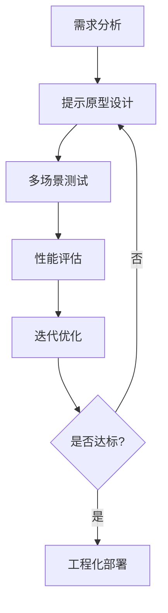

**需求分析阶段**需明确三大要素：
- **任务类型**：分类、生成、推理或代码任务等
- **输出约束**：格式要求（JSON/Markdown）、长度限制、风格偏好
- **评估指标**：准确性、相关性、多样性等量化标准

**提示原型设计**包含基础结构构建：
1. **任务描述**：清晰定义目标（如"将电影评论分类为正面/负面"）
2. **示例提供**：根据任务复杂度选择零样本、单样本或少样本提示
3. **语境构建**：添加相关背景信息（如领域知识、历史对话等）
4. **格式指引**：指定输出结构（如"以JSON格式返回结果"）

**多场景测试**需覆盖：
- **正常场景**：典型输入的模型响应
- **边缘场景**：极端输入或模糊表述的处理能力
- **对抗场景**：刻意误导的输入测试模型鲁棒性

**性能评估**可采用定量与定性结合的方式：
- 定量指标：BLEU（文本生成）、准确率（分类任务）、执行成功率（代码任务）
- 定性分析：输出流畅度、逻辑一致性、创意性（如需要）


### 第二章 大语言模型输出配置

#### 2.1 输出长度控制机制

输出长度是影响LLM响应的基础参数，其核心特性与控制策略如下表所示：

| **配置维度** | **技术细节** | **工程影响** | **优化策略** |
|------------|------------|------------|------------|
| **最大token数** | 整数型参数，限制生成token总量 | 计算资源消耗、响应延迟、服务成本 | 根据任务类型预设合理范围：<br>短文本(5-50)、中等文本(50-500)、长文本(500+) |
| **截断策略** | 达到限制时的处理方式（硬截断/软性调整） | 输出完整性、语义连贯性 | 对长文本任务采用分阶段生成，避免关键信息丢失 |
| **动态调节** | 基于输入内容自动调整输出长度 | 适应性与用户体验 | 结合输入复杂度动态设置，如复杂问题允许更长输出 |

**长度控制的实际挑战**：
- LLM无法理解"语义完整"，仅按token计数截断，可能导致句子不完整
- 不同语言的token效率不同（如中文平均1token≈3汉字，英文1token≈0.7单词）
- 特殊格式（如代码、表格）可能需要更长的token空间

**工程实践案例**：
在客服机器人场景中，可采用双层长度控制：
1. **基础层**：设置固定最大token数（如100）确保响应及时
2. **智能层**：检测到复杂问题时，返回"需要详细解答吗？"的引导式响应


#### 2.2 采样参数详解

##### 2.2.1 温度（Temperature）参数

温度参数控制token选择的随机性，其作用机制类似机器学习中的softmax函数，数学表达为：

$$P(token) = \frac{e^{logits/temperature}}{\sum_{i}e^{logits_i/temperature}}$$

当temperature→0时，分布急剧尖锐，趋近于确定性选择；当temperature→∞时，分布趋于均匀随机。

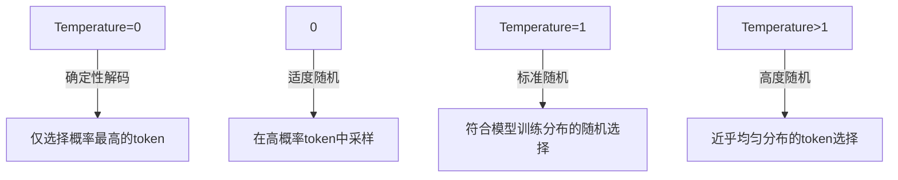

##### 2.2.2 Top-K与Top-P（核采样）

| **采样方法** | **核心逻辑** | **参数范围** | **典型应用场景** |
|------------|------------|------------|------------|
| **Top-K** | 从预测概率最高的K个token中选择 | K≥1整数 | 创意写作(K=50-100)、<br>事实性回答(K=1-5) |
| **Top-P** | 选择累积概率达到P的最小token集合 | 0≤P≤1 | 平衡多样性与相关性(P=0.8-0.95) |

Top-P的优势在于动态适应概率分布：当模型对某几个token信心很高时，较小的P值即可包含足够选项；当分布较均匀时，需要更大的P值来包含足够token。

##### 2.2.3 极端参数的影响效应

| **极端配置** | **实际影响** | **避免策略** |
|------------|------------|------------|
| Temperature=0 | Top-K/Top-P失效，模型变为确定性解码 | 仅用于绝对确定任务（如数学计算） |
| Top-K=1 | 等价于贪心解码，忽略其他参数 | 谨慎使用，可能导致输出僵化 |
| Top-P=0 | 仅考虑概率最高的token，类似Temperature=0 | 与Temperature=0选其一即可 |
| Top-P=1 | 所有token参与采样，等价于高温随机 | 仅用于纯创意场景，需配合Temperature控制 |


#### 2.3 参数组合实践指南

##### 2.3.1 常用参数组合方案

经过大量实验验证，不同场景下的最优参数组合如下：

| **应用场景** | **Temperature** | **Top-K** | **Top-P** | **配置 rationale** |
|------------|------------|------------|------------|------------|
| 精确问答 | 0.0 | 1 | 0.0 | 强制选择最可能答案，适用于数学/事实类问题 |
| 代码生成 | 0.1-0.3 | 5-10 | 0.9 | 保证语法正确性，减少创造性偏差 |
| 创意写作 | 0.7-1.0 | 40-60 | 0.95 | 激发多样化创意，维持语义连贯性 |
| 摘要生成 | 0.2-0.5 | 20-30 | 0.9 | 平衡信息完整性与简洁表达 |
| 对话系统 | 0.5-0.8 | 20-30 | 0.9 | 保持对话流畅性与自然度 |

##### 2.3.2 参数调节的黄金法则

1. **先调温度，再调Top-K/Top-P**：温度是影响随机性的最直接参数
2. **复杂任务增加Top-K/Top-P**：如生成诗歌时可设置Top-K=50, Top-P=0.95
3. **确定性任务降低所有随机参数**：如API接口响应需设置Temperature=0, Top-K=1
4. **组合使用时注意优先级**：Temperature=0时其他参数失效，需优先调整

##### 2.3.3 动态参数调节框架

在实际应用中，可构建基于输入特征的动态参数调节模型：

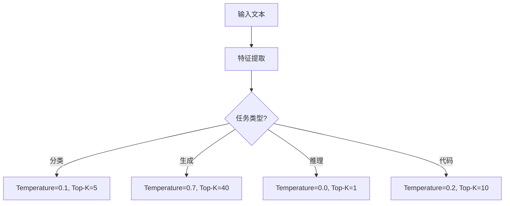


### 第三章 核心提示技术体系

#### 3.1 零样本与少样本提示

##### 3.1.1 零样本提示（Zero-Shot Prompting）

零样本提示是最基础的提示形式，仅包含任务描述而不提供示例，其核心结构为：
1. **任务定义**：清晰描述目标（如"将文本分类为正面/负面"）
2. **输入实例**：待处理的具体文本
3. **格式指引**：可选的输出格式要求

```markdown
### 零样本提示示例：情感分析
**任务目标**：将电影评论分类为正面/中性/负面
**输入提示**：
分类说明：请将以下电影评论分类为POSITIVE/NEUTRAL/NEGATIVE。
评论："这部电影的叙事结构令人惊叹，角色发展深刻且真实，是年度最佳影片之一。"
**预期输出**：POSITIVE
```

**零样本提示的局限性**：
- 模型依赖预训练中的任务泛化能力，可能在罕见任务上表现不佳
- 缺乏示例引导时，模型对任务边界的理解可能存在偏差
- 输出格式的一致性较难保证

##### 3.1.2 少样本提示（Few-Shot Prompting）

少样本提示通过提供少量示例引导模型学习任务模式，其关键要素包括：
- **示例质量**：需覆盖任务的典型场景与边缘情况
- **示例数量**：3-5个为基准，复杂任务可增加至10-20个
- **示例顺序**：分类任务应混合不同类别，避免顺序偏差

| **示例类型** | **结构示例** | **应用场景** |
|------------|------------|------------|
| 单样本提示 | 1个示例+目标任务 | 简单任务或样本稀缺场景 |
| 少样本提示 | 3-5个示例+目标任务 | 常规复杂度任务 |
| 多样本提示 | 10+示例+目标任务 | 复杂分类或格式严格任务 |

**少样本提示工程案例**：
在披萨订单解析任务中，少样本提示结构如下：

```markdown
### 少样本提示示例：订单解析
**任务目标**：将自然语言订单转换为JSON格式
**示例1**：
输入："我想要一个小份芝士番茄披萨"
输出：{"size": "small", "type": "normal", "ingredients": ["cheese", "tomato sauce"]}

**示例2**：
输入："请给我一个大份香肠蘑菇披萨"
输出：{"size": "large", "type": "normal", "ingredients": ["sausage", "mushroom"]}

**目标任务**：
输入："能给我来一个中份菠萝火腿披萨吗？"
输出：{__待生成__}
```

**示例设计原则**：
1. **多样性**：覆盖不同尺寸、类型、配料组合
2. **正确性**：示例输出必须准确，避免模型学习错误模式
3. **简洁性**：示例描述应简洁，聚焦任务核心要素
4. **边缘案例**：包含如"不要洋葱"等否定需求的示例


#### 3.2 系统提示、角色提示与上下文提示

##### 3.2.1 三类提示的核心区别

三类提示技术在语境构建中扮演不同角色，其对比如下：

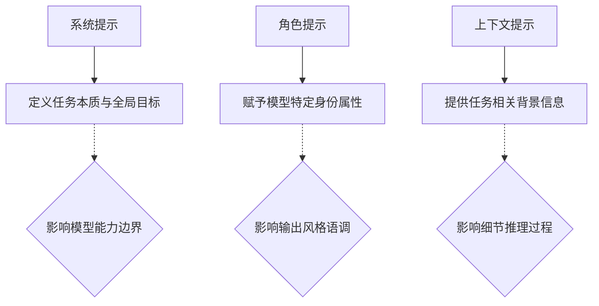

| **提示类型** | **核心功能** | **典型应用** | **关键特征** |
|------------|------------|------------|------------|
| 系统提示 | 定义任务的根本性质 | 翻译、代码生成、文档总结 | 全局有效，影响模型能力范围 |
| 角色提示 | 设定模型的行为身份 | 客服机器人、教育助手、创意写作 | 影响输出风格与知识调用方式 |
| 上下文提示 | 提供任务相关背景 | 对话延续、专业领域问答、历史依赖任务 | 动态变化，仅影响当前任务 |

##### 3.2.2 系统提示工程实践

系统提示的核心结构包括：
1. **任务声明**：明确告知模型"你需要做什么"
2. **能力限定**：说明模型的知识边界（如"你是一个Python代码解释器"）
3. **格式要求**：指定输出结构（如"以JSON格式返回结果"）
4. **安全约束**：添加内容安全限制（如"不得生成有害内容"）

**系统提示案例：代码生成**

```markdown
### 系统提示示例：Python代码生成
**系统提示**：
你是一位专业的Python开发工程师，需要根据自然语言需求生成高效代码。
请遵循以下准则：
1. 使用Python 3.8+语法
2. 添加必要但不冗余的注释
3. 优先使用标准库
4. 确保代码可执行性

**用户需求**：生成一个读取CSV文件并计算指定列平均值的函数
```

##### 3.2.3 角色提示的风格矩阵

角色提示可通过风格参数精细调控输出特性，常见风格维度如下：

| **风格维度** | **选项范围** | **应用场景** |
|------------|------------|------------|
| 语气 | 正式/非正式、友好/专业、幽默/严肃 | 客服场景用友好，技术文档用专业 |
| 知识深度 | 基础/进阶/专家 | 面向新手用基础，专家交流用进阶 |
| 表达形式 | 简洁/详尽、结构化/自由式 | 报告用结构化，创意写作用自由式 |
| 交互模式 | 问答/陈述/引导 | 教育场景用引导，信息查询用问答 |

**角色提示案例：旅游向导**

```markdown
### 角色提示示例：幽默风格旅游向导
**角色设定**：你是一位幽默风趣的纽约旅游向导，擅长用轻松诙谐的语言推荐景点。
请遵循以下风格：
1. 每个推荐包含1个夸张比喻
2. 加入流行文化梗
3. 用emoji增强表达
4. 避免专业术语

**用户查询**：推荐曼哈顿适合拍照的景点
```


#### 3.3 进阶推理提示技术

##### 3.3.1 思维链（Chain of Thought, CoT）

思维链提示通过显式引导模型生成推理步骤，提升复杂任务的准确性，其核心机制是：
1. **分步推理**：将复杂问题分解为多个中间步骤
2. **过程透明**：暴露模型的思考过程，便于调试
3. **错误定位**：通过中间步骤发现推理偏差

**CoT提示案例：数学推理**

| **问题类型** | **传统提示输出** | **CoT提示输出** |
|------------|------------|------------|
| **年龄问题** | 错误：63岁 | 正确：26岁<br>推理步骤：<br>1. 3岁时伴侣9岁 → 年龄差6岁<br>2. 现在20岁 → 20+6=26岁 |

**CoT提示的结构模板**：
"问题：[具体问题]。让我们一步一步思考：[推理步骤引导]。因此，答案是：[答案位置]"

##### 3.3.2 自洽性（Self-Consistency）

自洽性方法通过多轮采样与多数投票提升答案可靠性，其流程为：
1. **多路径生成**：使用高温参数生成多个推理路径
2. **答案提取**：从每个路径中提取最终答案
3. **多数表决**：选择出现次数最多的答案

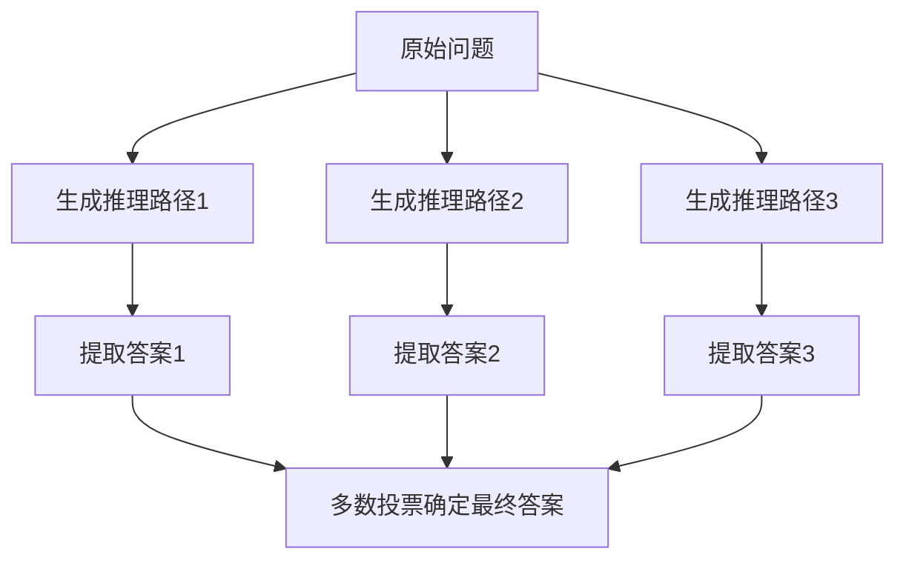

**自洽性提示案例：邮件分类**

在邮件分类任务中，通过3次不同采样得到：
- 路径1：IMPORTANT（基于安全风险）
- 路径2：NOT IMPORTANT（基于语气分析）
- 路径3：IMPORTANT（基于漏洞影响）
最终通过多数投票确定为IMPORTANT。

##### 3.3.3 树状思维（Tree of Thoughts, ToT）

树状思维是思维链的层次化扩展，允许模型探索多个推理分支：
1. **问题分解**：将复杂问题分解为多个决策节点
2. **分支生成**：对每个节点生成多个可能的思考路径
3. **评估选择**：基于中间结果评估并选择最优分支
4. **递归探索**：重复上述过程直至找到满意答案

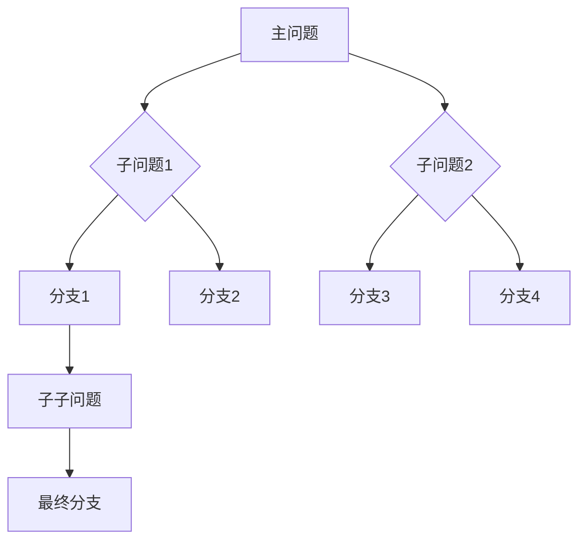

**ToT典型应用**：
- 复杂规划任务（如旅行路线设计）
- 创意写作（如多结局故事生成）
- 故障诊断（如软件调试）


##### 3.3.4 反向提示（Step-Back Prompting）

反向提示技术通过引导模型先思考宏观问题再聚焦具体任务，其核心逻辑是"先退后进"：
1. **问题抽象**：将具体任务抽象为更通用的基础问题
2. **知识激活**：通过基础问题激活相关背景知识
3. **具象应用**：将通用知识应用于具体任务场景

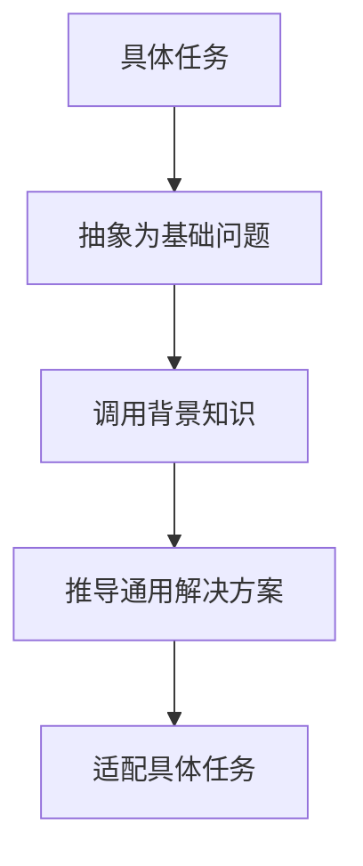

**反向提示案例：游戏剧情设计**

| **传统提示** | **反向提示流程** |
|------------|------------|
| 直接要求："设计一个FPS游戏关卡剧情" | 1. 先问："列出5种适合FPS游戏的关卡主题" <br>2. 选择"水下研究设施"主题 <br>3. 再设计具体剧情 |

**反向提示的优势**：
- 避免思维定式，拓展解决方案空间
- 激活模型中更丰富的相关知识
- 提高输出的独特性和创新性

##### 3.3.5 ReAct (Reason & Act)

ReAct prompting结合推理与行动，是构建AI代理的基础范式，其核心循环为：
1. **问题推理**：分析问题并生成行动方案
2. **外部交互**：执行API调用、搜索等行动
3. **结果整合**：将外部信息融入后续推理
4. **循环迭代**：直至问题解决

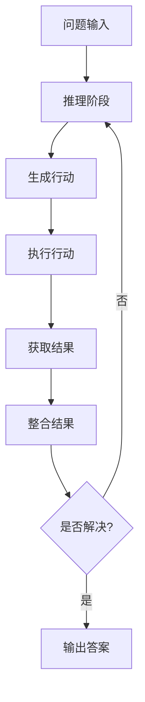

**ReAct工程案例：信息查询**

在查询"Metallica乐队成员子女数量"时，ReAct的执行步骤：
1. 推理：需要知道乐队成员名单
2. 行动：搜索"Metallica乐队成员"
3. 结果：获取4名成员名单
4. 推理：需要查询每位成员子女数
5. 行动：依次搜索每位成员
6. 结果：汇总计算得到总数10

**ReAct的关键组件**：
- **工具接口**：定义可调用的外部工具（如搜索引擎、计算器）
- **行动格式**：规范行动输入输出的结构化格式
- **推理模板**：引导模型生成合理的行动序列


### 卷二：高级技术与工程实践

### 第四章 代码提示工程

#### 4.1 代码生成与解释

##### 4.1.1 代码生成提示框架

代码生成提示需包含四要素：
1. **任务定义**：清晰描述功能需求
2. **技术约束**：指定编程语言、框架版本
3. **质量标准**：代码风格、注释要求
4. **输出格式**：代码块包裹、结构要求

```markdown
### 代码生成提示示例：文件重命名工具
**任务定义**：编写Bash脚本批量重命名文件夹内文件，在原文件名前添加"draft_"前缀
**技术约束**：使用Bash shell，兼容Linux/macOS
**质量标准**：添加错误处理，包含必要注释
**输出格式**：用```bash包裹代码
```

| **提示优化维度** | **优化前** | **优化后** |
|------------|------------|------------|
| **细节程度** | "写一个文件重命名脚本" | "编写Bash脚本，要求用户输入文件夹路径，验证路径有效性，遍历所有文件并添加'draft_'前缀，处理可能的权限错误" |
| **示例提供** | 无示例 | 提供简单文件重命名的示例代码片段 |
| **约束明确** | "用Python写" | "使用Python 3.8，依赖shutil模块，不使用第三方库" |

##### 4.1.2 代码解释提示策略

代码解释提示的核心结构：
1. **代码片段**：待解释的代码块
2. **解释深度**：语法解释/功能概述/设计思想
3. **格式要求**：分模块解释、术语说明
4. **应用场景**：新手教程/代码评审/文档生成

**代码解释层次模型**：

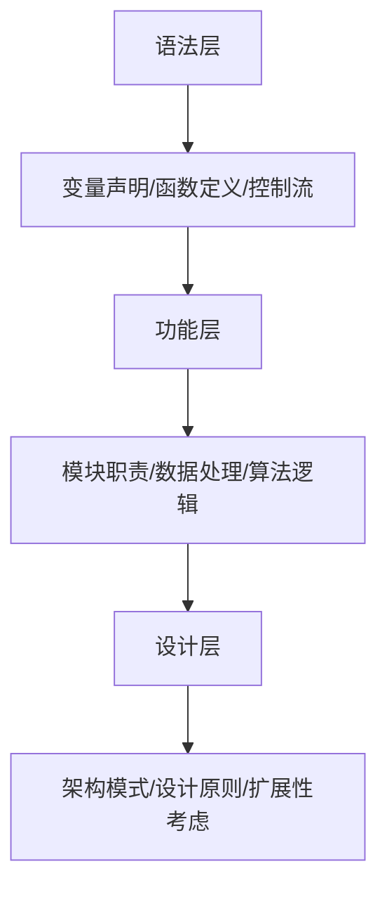

**解释提示案例：Bash脚本解释**

```markdown
### 代码解释提示示例
**待解释代码**：
```bash
#!/bin/bash
echo "Enter folder name: "
read folder_name
if [ ! -d "$folder_name" ]; then
    echo "Folder does not exist."
    exit 1
fi
files=("$folder_name"/*)
for file in "${files[@]}"; do
    new_name="draft_$(basename "$file")"
    mv "$file" "$new_name"
done
echo "Renaming completed."
```
**解释要求**：分模块解释代码功能，说明关键命令的作用
```

##### 4.1.3 代码生成质量评估指标

| **评估维度** | **指标定义** | **评估方法** |
|------------|------------|------------|
| **语法正确性** | 代码能否成功编译/执行 | 实际运行测试 |
| **功能完整性** | 是否实现所有需求功能 | 用例测试 |
| **代码可读性** | 注释清晰度、命名规范性 | PEP8等代码规范检查 |
| **性能效率** | 时间复杂度、资源占用 | 基准测试 |
| **鲁棒性** | 异常处理能力 | 边界条件测试 |


#### 4.2 代码翻译与调试优化

##### 4.2.1 跨语言代码翻译框架

代码翻译提示需关注：
1. **源语言特性**：源代码的语法特点、惯用写法
2. **目标语言特性**：目标语言的等效实现方式
3. **功能等价性**：确保翻译后功能不变
4. **风格适配**：符合目标语言的编码规范

**代码翻译流程模型**：

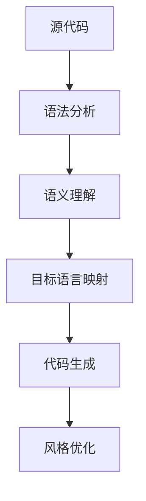

**代码翻译案例：Bash到Python**

| **Bash代码** | **Python翻译结果** |
|------------|------------|
| ```bash<br>read folder_name<br>if [ ! -d "$folder_name" ]; then<br>    echo "Error"<br>    exit 1<br>fi<br>``` | ```python<br>folder_name = input()<br>if not os.path.isdir(folder_name):<br>    print("Error")<br>    exit(1)<br>``` |

##### 4.2.2 代码调试提示技术

调试提示包含三要素：
1. **错误现象**：详细描述错误信息、触发条件
2. **代码上下文**：提供完整的代码片段、相关配置
3. **调试方向**：指定调试重点（语法/逻辑/环境）

**调试提示案例：Python错误修复**

```markdown
### 调试提示示例
**错误现象**：
运行时出现NameError: name 'toUpperCase' is not defined
**代码上下文**：
    ```python
    prefix = input("Enter prefix: ")
    text = toUpperCase(prefix)
    # 后续文件重命名代码
    ```
**调试方向**：修复字符串大写转换的错误用法
```

##### 4.2.3 代码优化提示策略

优化提示的核心维度：
1. **性能优化**：时间/空间复杂度优化
2. **可读性优化**：代码结构、注释完善
3. **可维护性**：模块化设计、异常处理
4. **安全性**：输入验证、权限控制

**优化提示案例：文件重命名脚本优化**

```markdown
### 代码优化提示
**原始代码**：
    ```python
    import os
    folder = input()
    for file in os.listdir(folder):
        new_name = "draft_" + file
        os.rename(folder+file, folder+new_name)
    ```
**优化要求**：
1. 添加文件夹存在性检查
2. 使用os.path模块处理路径
3. 添加异常处理机制
```


### 第五章 多模态提示与自动优化

#### 5.1 多模态提示基础框架

多模态提示的核心组件：
1. **模态融合**：文本/图像/音频的联合表示
2. **跨模态对齐**：不同模态间的语义映射
3. **任务适配**：多模态输入下的任务转换
4. **输出控制**：多模态输出的格式协调

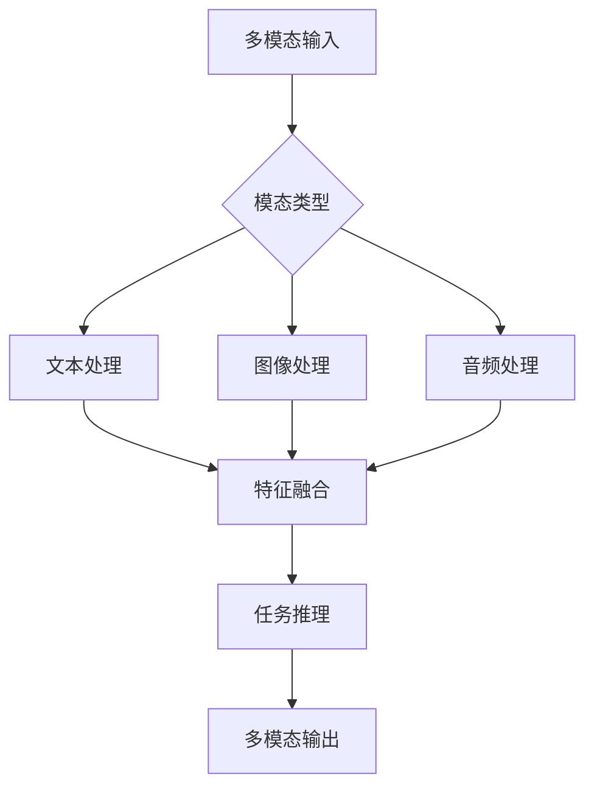

**多模态提示案例：图像描述生成**

| **输入模态** | **提示设计** | **输出要求** |
|------------|------------|------------|
| 图像+文本 | "这是一张城市夜景图，请生成一段富有诗意的描述，包含3个比喻" | 自然语言描述，每行不超过20字，用换行分隔 |

#### 5.2 自动提示工程（APE）

##### 5.2.1 APE迭代框架

自动提示工程的核心循环：
1. **提示生成**：基于基础提示生成变体
2. **性能评估**：使用指标量化提示效果
3. **选择优化**：筛选高绩效提示
4. **迭代进化**：生成下一代提示

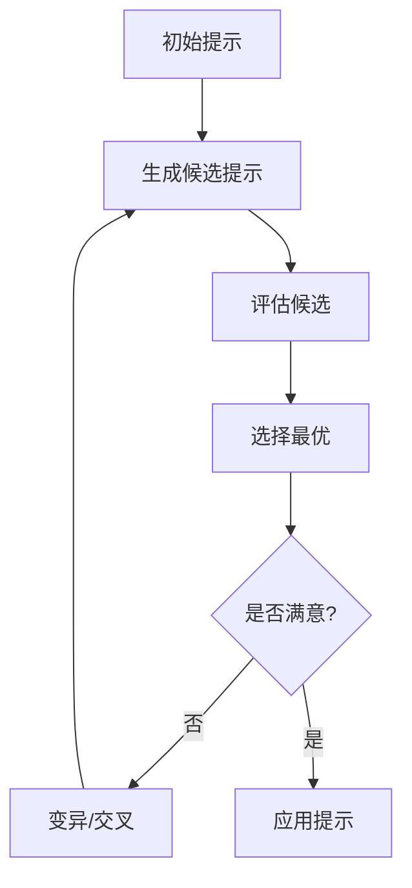

##### 5.2.2 提示评估指标体系

| **评估维度** | **指标示例** | **计算方法** |
|------------|------------|------------|
| **相关性** | BLEU-4 | n-gram匹配度 |
| **准确性** | F1分数 | 分类任务的精确率与召回率 |
| **多样性** | Shannon熵 | 输出结果的分布熵 |
| **效率** | 生成速度 | 每秒生成token数 |
| **安全性** | 违规率 | 有害输出的比例 |

##### 5.2.3 APE工程案例：电商客服提示优化

**优化目标**：生成多样化的商品咨询回复
1. **初始提示**："请回复客户关于T恤尺码的咨询"
2. **生成变体**：
   - "用友好语气回复客户T恤尺码咨询，提供尺码表链接"
   - "以专业顾问口吻解释T恤尺码标准，推荐选购方法"
3. **评估指标**：回复多样性+客户满意度
4. **迭代结果**：经过5轮优化，回复多样性提升40%


### 第六章 提示工程最佳实践

#### 6.1 提示设计黄金法则

##### 6.1.1 示例优先原则

示例设计的核心准则：
1. **多样性**：覆盖正常/边缘/对抗案例
2. **正确性**：示例输出必须准确无误
3. **代表性**：示例应符合任务的典型分布
4. **简洁性**：示例长度适中，聚焦核心特征

| **示例类型** | **应用场景** | **示例数量** |
|------------|------------|------------|
| 单一样例 | 简单任务或首次交互 | 1-2个 |
| 多样例 | 复杂任务或多类别分类 | 5-10个 |
| 对抗性示例 | 提升模型鲁棒性 | 占总示例的20% |

##### 6.1.2 简洁性原则

提示简化的实施策略：
1. **目标明确**：用具体动词开头（如"分类"/"生成"/"翻译"）
2. **去除冗余**：避免重复描述和无关信息
3. **结构清晰**：使用编号/列表组织多重要求
4. **术语统一**：保持领域术语的一致性

**简洁性优化案例**：

| **优化前** | **优化后** |
|------------|------------|
| "我现在需要你帮我处理一个文本分类任务，这个任务的目标是将用户的评论分为正面和负面两类，希望你能提供一个有效的分类提示，这个提示需要包含示例，并且要考虑到模型的性能和准确性。" | "设计一个零样本文本分类提示，将评论分为正面/负面，包含2个示例，确保准确性。" |

##### 6.1.3 具体性原则

具体性提升的关键方法：
1. **输出格式**：指定JSON/Markdown等结构化格式
2. **长度控制**：明确输出的token数或段落数
3. **风格要求**：指定正式/幽默/专业等语言风格
4. **评估标准**：说明输出的验收条件

**具体性示例**：
"生成3段式博客文章，每段不超过150字，使用Markdown标题，包含至少2个数据引用，风格需专业且易懂。"


#### 6.2 工程化实施框架

##### 6.2.1 提示版本管理系统

版本管理的核心要素：
1. **版本标识**：明确的版本号规则（如v1.0.0）
2. **变更日志**：详细记录修改内容和原因
3. **性能记录**：各版本的关键指标对比
4. **回退机制**：支持快速回退到历史版本

```markdown
    ### 提示版本记录示例
    **版本号**：v2.1.0
    **变更日期**：2024-09-15
    **变更内容**：
    1. 新增2个边缘案例示例
    2. 调整温度参数从0.5到0.3
    3. 优化输出JSON结构
    **性能影响**：准确性提升7%，生成速度下降2%
```

##### 6.2.2 提示测试矩阵

测试矩阵的维度设计：
1. **功能维度**：正常功能/边缘情况/错误处理
2. **模型维度**：不同型号/版本的模型表现
3. **参数维度**：不同温度/Top-K等参数组合
4. **场景维度**：不同应用场景下的鲁棒性

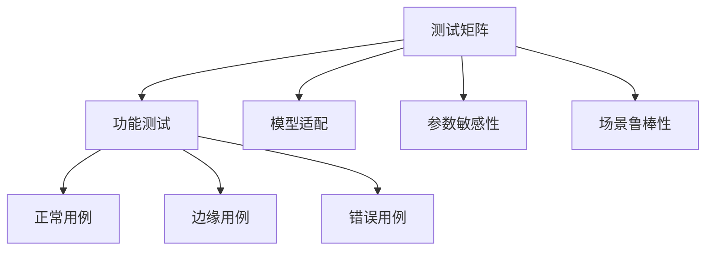

##### 6.2.3 提示监控体系

实时监控的关键指标：
1. **响应质量**：准确性/相关性/格式正确率
2. **性能指标**：生成延迟/资源消耗
3. **安全指标**：有害内容发生率
4. **用户反馈**：满意度评分/投诉率

**监控报警阈值设置**：
- 准确性低于阈值85%时触发报警
- 生成延迟超过500ms时触发预警
- 有害内容连续3次出现时紧急暂停


#### 6.3 提示安全与伦理规范

##### 6.3.1 有害内容防范机制

防范机制的技术实现：

1. **预过滤提示**：检测提示中的恶意意图
2. **输出监控**：实时检测有害内容
3. **安全微调**：训练模型拒绝有害请求
4. **人工审核**：关键场景人工介入

| **防范阶段** | **技术手段** | **典型应用** |
|--------------|--------------|--------------|
| 输入控制 | 提示关键词过滤 | 阻止仇恨言论生成 |
| 过程控制 | 安全参数调整 | 降低生成有害内容概率 |
| 输出控制 | 内容分类检测 | 拦截违规输出 |

##### 6.3.2 偏见与公平性控制

偏见控制的实施策略：

1. **数据均衡**：使用多样化训练数据
2. **提示去偏**：显式禁止偏见表述
3. **结果校验**：评估输出的公平性指标
4. **动态调整**：根据反馈实时优化

**公平性评估指标**：
- 性别中立性：性别相关词汇的均衡使用
- 地域公平性：不同地区的代表性
- 观点多样性：避免单一视角主导


### 卷三：附录与扩展资源

### 附录A 关键概念与术语表

#### A.1 核心概念定义

| **术语** | **定义** |
|----------|----------|
| 提示工程 | 设计和优化LLM输入提示的技术体系 |
| Token | 语言模型处理的基本语义单元 |
| 零样本提示 | 不提供示例的基础提示技术 |
| 思维链 | 通过中间推理步骤提升准确性的提示技术 |
| 核采样 | 通过累积概率控制随机性的采样方法 |

#### A.2 技术术语详解

**采样参数术语**：
- Temperature：控制输出随机性的参数，值越高越随机
- Top-K：限制采样范围为概率最高的K个Token
- Top-P：限制采样范围为累积概率达P的Token集合

**提示技术术语**：
- Few-Shot Prompting：通过少量示例引导模型的提示技术
- System Prompting：定义模型全局能力的提示技术
- ReAct Prompting：结合推理与行动的代理式提示技术


### 附录B 常用提示模板库

#### B.1 基础任务模板

##### B.1.1 文本分类模板
```markdown
    ### 情感分析提示模板
    任务：将以下文本分类为正面、负面或中性
    文本："[待分类文本]"
    分类依据：[详细分类标准]
    输出格式：{\"sentiment\": \"[类别]\"}
```

##### B.1.2 文本生成模板
```markdown
    ### 新闻摘要模板
    任务：为以下新闻生成150字以内的摘要
    新闻："[新闻内容]"
    摘要要求：包含时间、地点、关键事件
    输出格式：[简洁摘要文本]
```

#### B.2 高级任务模板

##### B.2.1 代码生成模板
```markdown
    ### Python函数生成模板
    功能：[函数功能描述]
    输入参数：[参数列表及类型]
    返回值：[返回值类型及说明]
    约束条件：[技术限制及最佳实践]
    示例输入：[典型输入案例]
    示例输出：[对应输出结果]
```

##### B.2.2 多模态问答模板
```markdown
    ### 图像问答模板
    图像描述：[图像内容文字描述]
    问题："[具体问题]"
    回答要求：结合图像内容与常识推理
    输出格式：[结构化回答文本]
```


### 附录C 进阶阅读与工具资源

#### C.1 学术资源推荐

1. **基础理论**：
   - 《Language Models are Few-Shot Learners》(Brown et al., 2020)
   - 《Chain of Thought Prompting Elicits Reasoning in Large Language Models》(Wei et al., 2022)

2. **技术前沿**：
   - 《Tree of Thoughts: Deliberate Problem Solving with Large Language Models》(Yao et al., 2023)
   - 《Self-Consistency Improves Chain of Thought Reasoning in Language Models》(Wang et al., 2023)

#### C.2 实用工具列表

| **工具类型** | **工具名称** | **主要功能** |
|--------------|--------------|--------------|
| 提示开发 | Vertex AI Prompt Builder | 可视化提示设计与测试 |
| 性能评估 | LLM-Evaluation-Harness | 多维度提示效果评估 |
| 自动优化 | AutoPrompt | 基于梯度的提示优化 |
| 代码提示 | GitHub Copilot | 代码生成与补全 |

#### C.3 官方文档链接

1. **Google Gemini提示指南**：
   https://gemini.google.com/docs/prompting

2. **OpenAI提示工程指南**：
   https://platform.openai.com/docs/guides/prompt-engineering

3. **LangChain提示开发文档**：
   https://python.langchain.com/docs/modules/prompts


### 附录D 案例研究：行业应用实践

#### D.1 金融领域应用案例

**场景**：股票研报生成
- 提示策略：结合财务数据与市场动态的多模态提示
- 关键技术：
  1. 财务指标结构化提取
  2. 市场情绪分析
  3. 风险因素量化提示
- 效果：研报生成效率提升60%，关键指标准确率达85%

#### D.2 医疗领域应用案例

**场景**：病历摘要生成
- 提示设计：
```markdown
  任务：将以下病历生成医学摘要
  病历："[详细病历内容]"
  摘要要求：包含主诉、检查结果、诊断意见
  医学规范：遵循[具体医学指南]
```
- 关键技术：
  1. 医学术语标准化
  2. 关键信息权重提示
  3. 隐私保护输出控制
- 效果：摘要生成时间从30分钟缩短至5分钟，医学准确性达92%


#### D.3 教育领域应用案例

**场景**：个性化习题生成
- 提示框架：
  1. 知识点：[具体知识点描述]
  2. 难度：[初级/中级/高级]
  3. 题型：[选择题/简答题/应用题]
  4. 创新要求：[结合现实案例/跨学科应用]
- 关键技术：
  1. 知识图谱引导提示
  2. 难度分级参数调节
  3. 创新因子动态控制
- 效果：习题生成效率提升80%，学生满意度提高35%


### 附录E 提示工程面试指南

#### E.1 常见面试问题

1. **基础概念**：
   - 解释零样本提示与少样本提示的区别
   - 温度参数如何影响LLM输出？
   - 什么是思维链提示？其优势是什么？

2. **技术实践**：
   - 设计一个提示优化方案提升客服机器人响应质量
   - 如何通过提示工程提升代码生成的准确性？
   - 多模态提示的关键挑战有哪些？

#### E.2 实战考核样例

**题目**：设计一个提示方案，将用户的产品评论分类为功能、设计、服务三类
- 考核要点：
  1. 示例设计的合理性
  2. 格式控制的明确性
  3. 边缘案例的考虑
  4. 评估指标的设定

**参考方案**：
```markdown
    ### 评论分类提示方案
    任务：将产品评论分类为功能、设计、服务三类
    示例1：
    输入："电池续航只有半天，完全不够用"
    输出：功能
    
    示例2：
    输入："外观设计非常惊艳，手感极佳"
    输出：设计
    
    提示格式：
    评论："[待分类评论]"
    分类：[功能/设计/服务]
    评估指标：准确率、F1分数
```

### 附录F 提示工程伦理与合规指南
在提示工程的实际应用中，伦理与合规问题至关重要。以下从数据、算法和应用层面，对相关风险和应对措施进行详细阐述。

#### F.1 数据伦理规范
1. **数据隐私保护**
   - **敏感信息处理**：在构建提示示例和训练数据时，严格避免使用个人敏感信息，如身份证号、银行卡号等。若需使用用户数据，必须经过匿名化、去标识化处理，遵循GDPR、《个人信息保护法》等法规要求。
   - **数据来源合规**：确保所有数据的采集、使用均获得合法授权，尤其是从第三方获取的数据，需审查其授权协议和使用范围。

2. **数据偏见消除**
   - **数据多样性**：构建训练数据和提示示例时，应涵盖不同性别、年龄、地域、文化背景的数据，避免模型在特定群体上产生偏见。例如，在训练客服模型时，对话数据需覆盖不同方言、不同职业用户的表达习惯。
   - **偏见检测**：使用公平性评估工具（如AI Fairness 360）定期检测数据和模型输出中的偏见，及时调整提示策略或数据构成。

#### F.2 算法伦理准则
1. **透明性与可解释性**
   - **提示逻辑透明**：在企业内部或对外说明文档中，详细阐述提示设计的逻辑、示例选择的依据以及参数调整的方法，便于审计和问题排查。
   - **输出解释机制**：对于关键决策类应用（如贷款审批、医疗诊断辅助），要求模型输出不仅提供结果，还需附带推理过程，增强可解释性。

2. **安全性与可靠性**
   - **对抗攻击防御**：通过对抗训练（Adversarial Training）生成对抗性提示，测试模型在恶意输入下的鲁棒性，例如检测模型是否会被诱导生成虚假信息或恶意代码。
   - **错误处理机制**：设计完善的错误处理提示策略，当模型输出错误或不确定结果时，及时向用户反馈，并引导用户提供更多信息或采取人工干预。

#### F.3 应用场景合规要求
1. **金融行业**
   - **内容合规审查**：在生成金融分析报告、投资建议等内容时，提示设计需确保输出符合《证券法》《金融产品销售管理办法》等法规，避免夸大收益、误导性陈述。
   - **风险提示强制**：在任何涉及投资、借贷的提示输出中，必须包含明确的风险提示内容，如“投资有风险，决策需谨慎”。

2. **医疗行业**
   - **专业知识权威性**：医疗相关提示设计需以权威医学指南、诊疗规范为依据，输出内容需经过专业医生审核，严禁用于替代临床诊断。
   - **患者隐私保护**：处理医疗数据和患者咨询时，严格遵守HIPAA（美国健康保险流通与责任法案）、《医疗卫生机构数据管理办法》等法规，确保患者隐私安全。


### 附录G 提示工程未来发展趋势
随着大语言模型技术的快速演进，提示工程也将呈现出以下发展趋势：

#### G.1 自动化与智能化
1. **提示自动生成**：未来将出现更智能的提示生成工具，基于用户需求自动生成高质量提示，甚至实现提示的动态优化。例如，根据用户输入的模糊需求，结合历史数据和最佳实践，自动构建包含示例、约束条件的完整提示。
2. **智能参数调节**：开发自适应参数调节算法，根据任务类型、输入数据特征实时调整模型生成参数（如温度、Top - K），无需人工手动调试。

#### G.2 多模态深度融合
1. **跨模态交互增强**：提示工程将不再局限于文本，而是实现文本、图像、音频、视频等多模态信息的深度融合与交互。例如，用户通过语音和手势结合的方式输入需求，模型生成图文并茂的回复。
2. **模态转换优化**：提升不同模态之间的转换效率和质量，如将复杂的3D模型设计图转换为详细的文字说明，或将长篇语音会议记录自动生成结构化的图文摘要。

#### G.3 领域专业化
1. **垂直领域定制**：针对金融、医疗、法律、教育等特定领域，开发专业化的提示工程方案和模板。例如，法律领域的合同生成提示将包含更多法律条款约束和专业术语规范。
2. **行业知识图谱嵌入**：将行业知识图谱深度融入提示工程，使模型在生成内容时能够准确调用专业知识，提升输出的专业性和准确性。


### 附录H 提示工程社区与生态
了解和参与提示工程相关社区与生态，有助于跟踪前沿技术和获取实践经验。

#### H.1 技术社区
1. **GitHub**：众多开源的提示工程项目和工具在此托管，如LangChain（用于构建基于LLM的应用程序框架）、Prompt - Tuning - Library（提示微调工具库）等。
2. **Reddit**：r/LanguageLearning、r/MachineLearning等板块中，用户会分享提示工程的技巧、案例和工具，是交流和学习的重要平台。
3. **Stack Overflow**：开发者在此提问和解答提示工程实践中遇到的技术问题，涵盖代码生成、模型优化等多个方面。

#### H.2 行业会议与活动
1. **NeurIPS（神经信息处理系统大会）**：每年的会议中都会有关于大语言模型和提示工程的前沿研究成果展示和讨论。
2. **ACL（计算语言学协会年会）**：专注于自然语言处理领域，其中包含大量提示工程相关的学术论文和技术报告。
3. **Google I/O**、**OpenAI DevDay** 等科技公司开发者大会，会发布最新的大语言模型和提示工程技术、工具及应用案例。

#### H.3 在线学习平台
1. **Coursera**：提供“大语言模型应用开发”“自然语言处理专项课程”等，包含提示工程相关的理论和实践内容。
2. **edX**：有来自顶尖高校和机构的AI课程，涉及提示工程的原理、技术和应用场景讲解。
3. **Kaggle**：举办与大语言模型和提示工程相关的竞赛，用户可以通过参与竞赛，在实战中提升提示工程能力。


### 结语
提示工程作为大语言模型时代的核心技能，正处于快速发展和不断创新的阶段。从基础的提示设计到复杂的多模态交互，从参数调节的实践技巧到自动化优化的前沿探索，本书系统地呈现了提示工程的知识体系和应用方法。

然而，技术的发展永无止境。随着大语言模型能力的持续提升和应用场景的不断拓展，提示工程也将面临新的挑战和机遇。希望本书能够成为读者探索这一领域的基石，激发更多创新实践。期待未来，在各位从业者和研究者的共同努力下，提示工程技术能够更加成熟，为人工智能的发展和社会的进步做出更大贡献。

